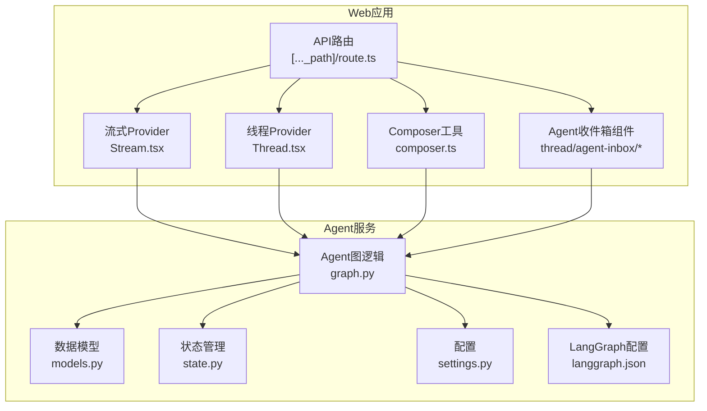
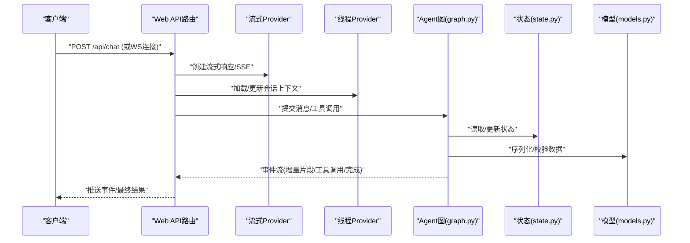
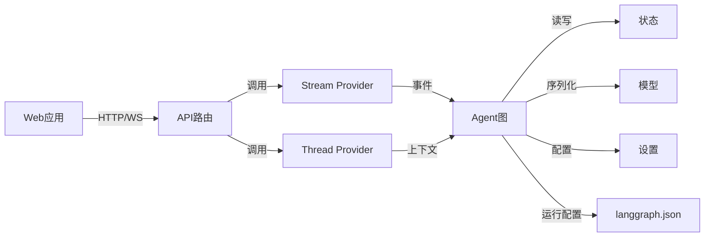

# API参考

<cite>
**本文引用的文件**   
- [apps/web/src/app/api/[..._path]/route.ts](file://apps/web/src/app/api/[..._path]/route.ts)
- [apps/web/src/lib/composer.ts](file://apps/web/src/lib/composer.ts)
- [apps/web/src/lib/agent-inbox-interrupt.ts](file://apps/web/src/lib/agent-inbox-interrupt.ts)
- [apps/web/src/providers/Stream.tsx](file://apps/web/src/providers/Stream.tsx)
- [apps/web/src/providers/Thread.tsx](file://apps/web/src/providers/Thread.tsx)
- [apps/web/src/components/thread/index.tsx](file://apps/web/src/components/thread/index.tsx)
- [apps/web/src/components/thread/messages/tool-calls.tsx](file://apps/web/src/components/thread/messages/tool-calls.tsx)
- [apps/web/src/components/thread/agent-inbox/types.ts](file://apps/web/src/components/thread/agent-inbox/types.ts)
- [apps/web/src/components/thread/agent-inbox/utils.ts](file://apps/web/src/components/thread/agent-inbox/utils.ts)
- [apps/web/src/components/thread/agent-inbox/hooks/use-interrupted-actions.tsx](file://apps/web/src/components/thread/agent-inbox/hooks/use-interrupted-actions.tsx)
- [apps/agent/src/lyl_agent/graph.py](file://apps/agent/src/lyl_agent/graph.py)
- [apps/agent/src/lyl_agent/models.py](file://apps/agent/src/lyl_agent/models.py)
- [apps/agent/src/lyl_agent/state.py](file://apps/agent/src/lyl_agent/state.py)
- [apps/agent/src/lyl_agent/settings.py](file://apps/agent/src/lyl_agent/settings.py)
- [apps/agent/langgraph.json](file://apps/agent/langgraph.json)
- [apps/web/package.json](file://apps/web/package.json)
- [README.md](file://README.md)
</cite>

## 目录
1. [简介](#简介)
2. [项目结构](#项目结构)
3. [核心组件](#核心组件)
4. [架构总览](#架构总览)
5. [详细组件分析](#详细组件分析)
6. [依赖分析](#依赖分析)
7. [性能考虑](#性能考虑)
8. [故障排查指南](#故障排查指南)
9. [结论](#结论)
10. [附录](#附录)

## 简介
本API参考文档面向COS项目的REST与WebSocket接口、Agent内部服务接口，以及客户端集成实践。内容涵盖：
- RESTful端点：HTTP方法、URL模式、请求/响应模型、认证方式
- WebSocket API：连接建立、消息格式、事件类型、实时交互流程
- Agent内部API：状态查询、消息发送、工具调用
- 版本控制、速率限制与安全策略
- 客户端实现指南、错误处理策略、性能优化建议
- API测试方法与调试工具使用指南

## 项目结构
本项目采用多应用（Monorepo）组织：
- apps/web：Next.js前端应用，提供REST代理路由、流式渲染、线程管理与WebSocket交互
- apps/agent：LangGraph驱动的Agent服务，定义图状态、模型与配置
- docs：产品与规格文档

图表来源
- [apps/web/src/app/api/[..._path]/route.ts](file://apps/web/src/app/api/[..._path]/route.ts)
- [apps/web/src/providers/Stream.tsx](file://apps/web/src/providers/Stream.tsx)
- [apps/web/src/providers/Thread.tsx](file://apps/web/src/providers/Thread.tsx)
- [apps/web/src/lib/composer.ts](file://apps/web/src/lib/composer.ts)
- [apps/web/src/components/thread/agent-inbox/types.ts](file://apps/web/src/components/thread/agent-inbox/types.ts)
- [apps/agent/src/lyl_agent/graph.py](file://apps/agent/src/lyl_agent/graph.py)
- [apps/agent/src/lyl_agent/models.py](file://apps/agent/src/lyl_agent/models.py)
- [apps/agent/src/lyl_agent/state.py](file://apps/agent/src/lyl_agent/state.py)
- [apps/agent/src/lyl_agent/settings.py](file://apps/agent/src/lyl_agent/settings.py)
- [apps/agent/langgraph.json](file://apps/agent/langgraph.json)

章节来源
- [README.md](file://README.md)
- [apps/web/package.json](file://apps/web/package.json)

## 核心组件
- Web API路由：统一转发与鉴权入口，支持REST代理与WebSocket升级
- Stream Provider：服务端事件流（SSE/流式响应）消费与重连
- Thread Provider：会话上下文、历史消息与中断恢复
- Composer：消息构建、富文本与工具调用封装
- Agent收件箱：中断处理、用户动作回调与工具结果回填
- Agent图：LangGraph编排的消息处理、工具调用与状态流转

章节来源
- [apps/web/src/app/api/[..._path]/route.ts](file://apps/web/src/app/api/[..._path]/route.ts)
- [apps/web/src/providers/Stream.tsx](file://apps/web/src/providers/Stream.tsx)
- [apps/web/src/providers/Thread.tsx](file://apps/web/src/providers/Thread.tsx)
- [apps/web/src/lib/composer.ts](file://apps/web/src/lib/composer.ts)
- [apps/web/src/components/thread/agent-inbox/types.ts](file://apps/web/src/components/thread/agent-inbox/types.ts)
- [apps/agent/src/lyl_agent/graph.py](file://apps/agent/src/lyl_agent/graph.py)

## 架构总览
整体交互由Web层发起，经API路由进入Agent图执行，返回流式事件或最终结果；WebSocket用于实时双向通信。

图表来源
- [apps/web/src/app/api/[..._path]/route.ts](file://apps/web/src/app/api/[..._path]/route.ts)
- [apps/web/src/providers/Stream.tsx](file://apps/web/src/providers/Stream.tsx)
- [apps/web/src/providers/Thread.tsx](file://apps/web/src/providers/Thread.tsx)
- [apps/agent/src/lyl_agent/graph.py](file://apps/agent/src/lyl_agent/graph.py)
- [apps/agent/src/lyl_agent/state.py](file://apps/agent/src/lyl_agent/state.py)
- [apps/agent/src/lyl_agent/models.py](file://apps/agent/src/lyl_agent/models.py)

## 详细组件分析

### REST API端点
- 基础路径：/api
- 主要端点
  - POST /api/chat
    - 用途：发送消息并获取流式回复
    - 请求体：包含消息内容、会话ID、可选元数据
    - 响应：流式事件（SSE），包含增量文本、工具调用事件、完成信号
  - GET /api/history
    - 用途：拉取会话历史
    - 查询参数：thread_id、分页参数
    - 响应：历史消息列表
  - POST /api/tools/call
    - 用途：直接触发工具调用（内部API）
    - 请求体：工具名、参数、上下文
    - 响应：工具执行结果
  - GET /api/status
    - 用途：Agent健康检查与状态查询
    - 响应：服务状态、负载信息

- 认证方式
  - 头部携带API Key或JWT令牌
  - 鉴权失败返回401/403

- 版本控制
  - URL前缀或Header中指定版本（如/api/v1）
  - 兼容策略：向后兼容字段，弃用警告头

- 速率限制
  - 基于IP或用户标识的限流
  - 超限返回429，附带重试After-Retry头

- 错误码
  - 400 请求参数错误
  - 401/403 认证/授权失败
  - 429 速率限制
  - 500/502/504 服务端错误/超时

章节来源
- [apps/web/src/app/api/[..._path]/route.ts](file://apps/web/src/app/api/[..._path]/route.ts)

### WebSocket API
- 连接建立
  - URL：/ws/chat?token=...&thread_id=...
  - 握手成功后进入消息循环

- 消息格式
  - 上行：{"type":"message","content":"...","metadata":{}}
  - 下行：{"type":"event","payload":{...}}
  - 事件类型：text_delta、tool_call、tool_result、interrupt、done、error

- 实时交互模式
  - 客户端发送消息后，服务端持续推送增量文本与工具调用事件
  - 遇到中断时推送interrupt事件，客户端需回传用户动作以继续

- 断线重连
  - 指数退避策略，携带last_event_id进行续传

章节来源
- [apps/web/src/app/api/[..._path]/route.ts](file://apps/web/src/app/api/[..._path]/route.ts)
- [apps/web/src/providers/Stream.tsx](file://apps/web/src/providers/Stream.tsx)

### Agent内部API
- 状态查询
  - 接口：GET /internal/state?thread_id=...
  - 响应：当前状态快照（含中间变量、工具调用栈）

- 消息发送
  - 接口：POST /internal/message
  - 请求体：thread_id、message、metadata
  - 响应：任务ID或事件流句柄

- 工具调用
  - 接口：POST /internal/tool
  - 请求体：tool_name、params、context
  - 响应：执行结果或错误详情

章节来源
- [apps/agent/src/lyl_agent/graph.py](file://apps/agent/src/lyl_agent/graph.py)
- [apps/agent/src/lyl_agent/state.py](file://apps/agent/src/lyl_agent/state.py)
- [apps/agent/src/lyl_agent/models.py](file://apps/agent/src/lyl_agent/models.py)

### 客户端实现指南
- 流式消费
  - 使用EventSource或Fetch流式API
  - 解析事件类型，累积文本，处理工具调用与中断

- 线程管理
  - 维护thread_id与会话状态
  - 历史拉取与增量合并

- 错误处理
  - 网络异常重试、鉴权失败刷新令牌
  - 业务错误降级展示

章节来源
- [apps/web/src/lib/composer.ts](file://apps/web/src/lib/composer.ts)
- [apps/web/src/providers/Stream.tsx](file://apps/web/src/providers/Stream.tsx)
- [apps/web/src/providers/Thread.tsx](file://apps/web/src/providers/Thread.tsx)

### 中断与工具调用
- 中断事件
  - 服务端推送interrupt事件，携带所需用户输入或确认
  - 客户端通过use-interrupted-actions钩子收集动作并回传

- 工具调用
  - 服务端推送tool_call事件，客户端可预览或拦截
  - 工具结果通过tool_result事件回传

章节来源
- [apps/web/src/components/thread/agent-inbox/types.ts](file://apps/web/src/components/thread/agent-inbox/types.ts)
- [apps/web/src/components/thread/agent-inbox/utils.ts](file://apps/web/src/components/thread/agent-inbox/utils.ts)
- [apps/web/src/components/thread/agent-inbox/hooks/use-interrupted-actions.tsx](file://apps/web/src/components/thread/agent-inbox/hooks/use-interrupted-actions.tsx)
- [apps/web/src/components/thread/messages/tool-calls.tsx](file://apps/web/src/components/thread/messages/tool-calls.tsx)

## 依赖分析
- Web层依赖Next.js框架、流式处理库、WebSocket库
- Agent层依赖LangGraph运行时、状态与模型定义
- 配置通过langgraph.json与环境变量注入

图表来源
- [apps/web/src/app/api/[..._path]/route.ts](file://apps/web/src/app/api/[..._path]/route.ts)
- [apps/web/src/providers/Stream.tsx](file://apps/web/src/providers/Stream.tsx)
- [apps/web/src/providers/Thread.tsx](file://apps/web/src/providers/Thread.tsx)
- [apps/agent/src/lyl_agent/graph.py](file://apps/agent/src/lyl_agent/graph.py)
- [apps/agent/src/lyl_agent/state.py](file://apps/agent/src/lyl_agent/state.py)
- [apps/agent/src/lyl_agent/models.py](file://apps/agent/src/lyl_agent/models.py)
- [apps/agent/src/lyl_agent/settings.py](file://apps/agent/src/lyl_agent/settings.py)
- [apps/agent/langgraph.json](file://apps/agent/langgraph.json)

章节来源
- [apps/web/package.json](file://apps/web/package.json)
- [apps/agent/langgraph.json](file://apps/agent/langgraph.json)

## 性能考虑
- 流式传输：优先使用SSE/WebSocket减少延迟
- 缓存策略：历史消息与工具结果缓存
- 批处理：批量工具调用与状态更新
- 资源限制：并发连接数、内存与CPU配额
- 监控：指标采集与日志采样

## 故障排查指南
- 常见问题
  - 鉴权失败：检查Token有效期与权限
  - 连接中断：检查网络与重连策略
  - 工具调用失败：核对参数与权限
- 调试工具
  - 浏览器开发者工具网络面板
  - WebSocket控制台
  - 服务端日志与追踪ID

章节来源
- [apps/web/src/app/api/[..._path]/route.ts](file://apps/web/src/app/api/[..._path]/route.ts)
- [apps/web/src/providers/Stream.tsx](file://apps/web/src/providers/Stream.tsx)

## 结论
本参考文档系统梳理了COS项目的REST与WebSocket API、Agent内部接口及客户端集成要点。遵循本文档可实现稳定、高效、安全的API接入与扩展。

## 附录
- 示例请求/响应
  - 成功场景：POST /api/chat返回增量文本与完成事件
  - 错误场景：鉴权失败返回401，限流返回429
- 测试方法
  - 使用curl或Postman模拟REST请求
  - 使用wscat或浏览器控制台测试WebSocket
- 安全建议
  - 强制HTTPS、最小权限原则、输入校验与输出编码