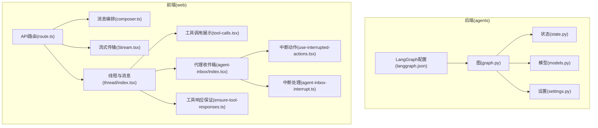
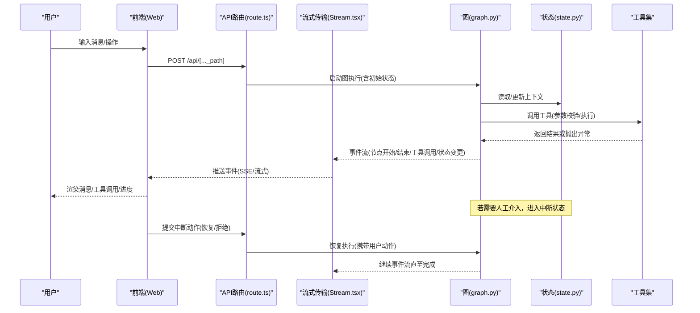
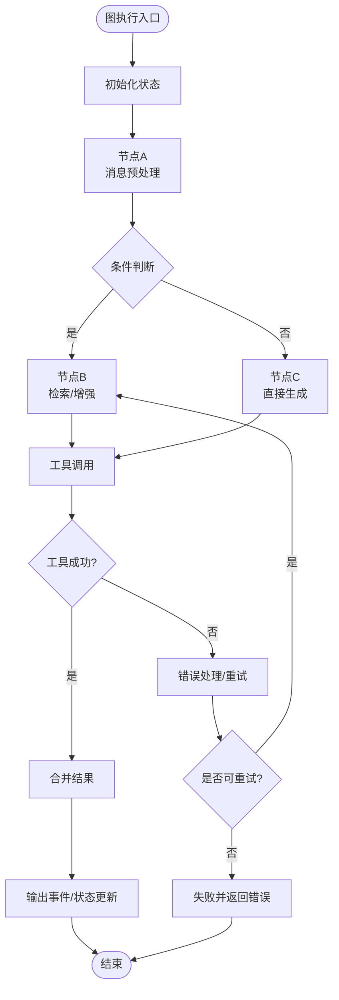
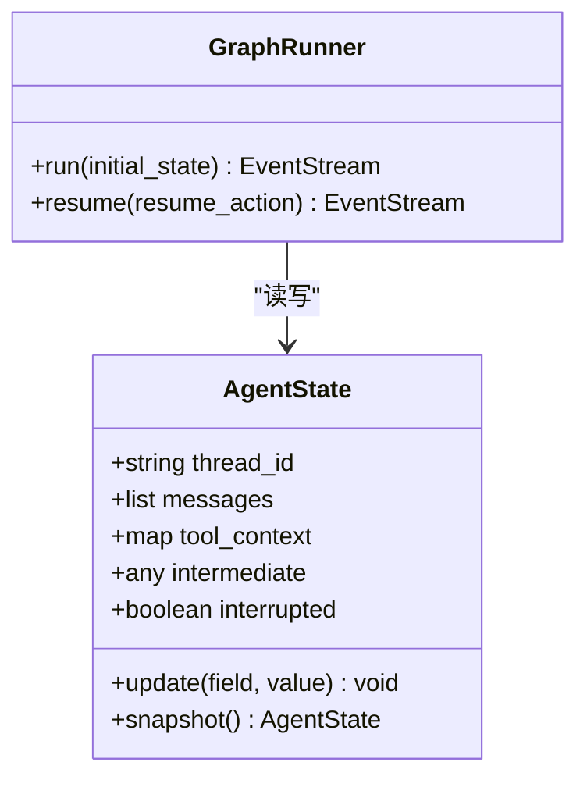
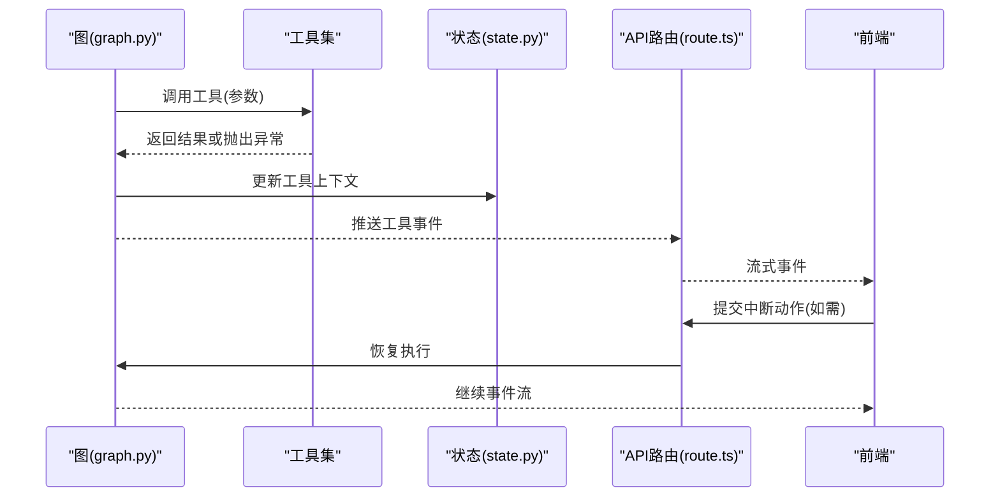
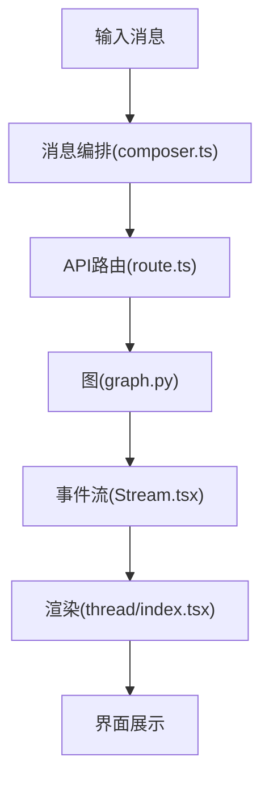
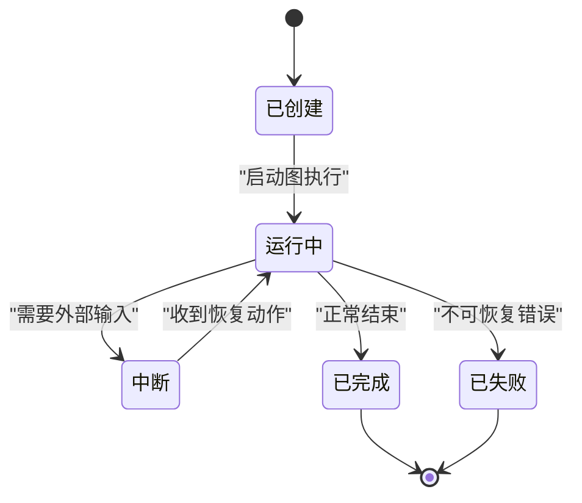
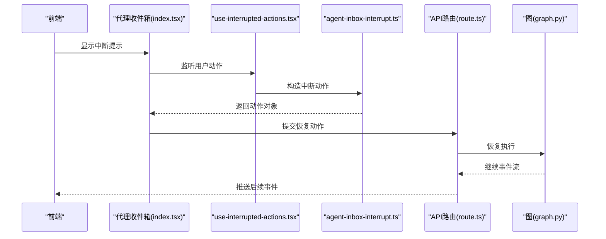
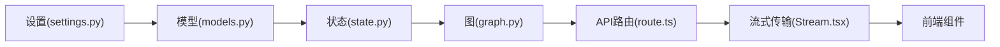

# Agent内部接口

<cite>
**本文引用的文件**   
- [apps/agent/src/lyl_agent/graph.py](file://apps/agent/src/lyl_agent/graph.py)
- [apps/agent/src/lyl_agent/state.py](file://apps/agent/src/lyl_agent/state.py)
- [apps/agent/src/lyl_agent/models.py](file://apps/agent/src/lyl_agent/models.py)
- [apps/agent/src/lyl_agent/settings.py](file://apps/agent/src/lyl_agent/settings.py)
- [apps/web/src/app/api/[..._path]/route.ts](file://apps/web/src/app/api/[..._path]/route.ts)
- [apps/web/src/lib/composer.ts](file://apps/web/src/lib/composer.ts)
- [apps/web/src/providers/Stream.tsx](file://apps/web/src/providers/Stream.tsx)
- [apps/web/src/components/thread/index.tsx](file://apps/web/src/components/thread/index.tsx)
- [apps/web/src/components/thread/messages/tool-calls.tsx](file://apps/web/src/components/thread/messages/tool-calls.tsx)
- [apps/web/src/components/thread/agent-inbox/index.tsx](file://apps/web/src/components/thread/agent-inbox/index.tsx)
- [apps/web/src/components/thread/agent-inbox/hooks/use-interrupted-actions.tsx](file://apps/web/src/components/thread/agent-inbox/hooks/use-interrupted-actions.tsx)
- [apps/web/src/lib/agent-inbox-interrupt.ts](file://apps/web/src/lib/agent-inbox-interrupt.ts)
- [apps/web/src/lib/ensure-tool-responses.ts](file://apps/web/src/lib/ensure-tool-responses.ts)
- [apps/agent/langgraph.json](file://apps/agent/langgraph.json)
</cite>

## 目录
1. [简介](#简介)
2. [项目结构](#项目结构)
3. [核心组件](#核心组件)
4. [架构总览](#架构总览)
5. [详细组件分析](#详细组件分析)
6. [依赖关系分析](#依赖关系分析)
7. [性能考虑](#性能考虑)
8. [故障排查指南](#故障排查指南)
9. [结论](#结论)
10. [附录](#附录)

## 简介
本文件面向COS项目Agent系统的内部API与运行时，聚焦以下目标：
- LangGraph图执行接口：图的构建、节点定义、边配置、执行流程与流式输出。
- 状态管理API：Agent上下文状态的结构、更新与查询方式。
- 工具调用接口：工具注册、调用协议、中断与恢复机制。
- Agent生命周期：创建、运行、暂停、恢复、终止与清理。
- 消息传递机制：用户消息、系统消息、工具结果与中间状态的流转。
- 错误处理、日志记录与调试接口：异常捕获、可观测性与排障手段。

## 项目结构
本项目采用前后端分离的架构：
- 后端（Python）：基于LangGraph实现Agent图、状态模型、设置与工具编排。
- 前端（Next.js）：提供Web API路由、流式传输、线程与消息渲染、工具调用交互与中断处理。

图表来源
- [apps/agent/src/lyl_agent/graph.py](file://apps/agent/src/lyl_agent/graph.py)
- [apps/agent/src/lyl_agent/state.py](file://apps/agent/src/lyl_agent/state.py)
- [apps/agent/src/lyl_agent/models.py](file://apps/agent/src/lyl_agent/models.py)
- [apps/agent/src/lyl_agent/settings.py](file://apps/agent/src/lyl_agent/settings.py)
- [apps/agent/langgraph.json](file://apps/agent/langgraph.json)
- [apps/web/src/app/api/[..._path]/route.ts](file://apps/web/src/app/api/[..._path]/route.ts)
- [apps/web/src/lib/composer.ts](file://apps/web/src/lib/composer.ts)
- [apps/web/src/providers/Stream.tsx](file://apps/web/src/providers/Stream.tsx)
- [apps/web/src/components/thread/index.tsx](file://apps/web/src/components/thread/index.tsx)
- [apps/web/src/components/thread/messages/tool-calls.tsx](file://apps/web/src/components/thread/messages/tool-calls.tsx)
- [apps/web/src/components/thread/agent-inbox/index.tsx](file://apps/web/src/components/thread/agent-inbox/index.tsx)
- [apps/web/src/components/thread/agent-inbox/hooks/use-interrupted-actions.tsx](file://apps/web/src/components/thread/agent-inbox/hooks/use-interrupted-actions.tsx)
- [apps/web/src/lib/agent-inbox-interrupt.ts](file://apps/web/src/lib/agent-inbox-interrupt.ts)
- [apps/web/src/lib/ensure-tool-responses.ts](file://apps/web/src/lib/ensure-tool-responses.ts)

章节来源
- [apps/agent/src/lyl_agent/graph.py](file://apps/agent/src/lyl_agent/graph.py)
- [apps/agent/src/lyl_agent/state.py](file://apps/agent/src/lyl_agent/state.py)
- [apps/agent/src/lyl_agent/models.py](file://apps/agent/src/lyl_agent/models.py)
- [apps/agent/src/lyl_agent/settings.py](file://apps/agent/src/lyl_agent/settings.py)
- [apps/agent/langgraph.json](file://apps/agent/langgraph.json)
- [apps/web/src/app/api/[..._path]/route.ts](file://apps/web/src/app/api/[..._path]/route.ts)
- [apps/web/src/lib/composer.ts](file://apps/web/src/lib/composer.ts)
- [apps/web/src/providers/Stream.tsx](file://apps/web/src/providers/Stream.tsx)
- [apps/web/src/components/thread/index.tsx](file://apps/web/src/components/thread/index.tsx)
- [apps/web/src/components/thread/messages/tool-calls.tsx](file://apps/web/src/components/thread/messages/tool-calls.tsx)
- [apps/web/src/components/thread/agent-inbox/index.tsx](file://apps/web/src/components/thread/agent-inbox/index.tsx)
- [apps/web/src/components/thread/agent-inbox/hooks/use-interrupted-actions.tsx](file://apps/web/src/components/thread/agent-inbox/hooks/use-interrupted-actions.tsx)
- [apps/web/src/lib/agent-inbox-interrupt.ts](file://apps/web/src/lib/agent-inbox-interrupt.ts)
- [apps/web/src/lib/ensure-tool-responses.ts](file://apps/web/src/lib/ensure-tool-responses.ts)

## 核心组件
- 图与执行引擎（LangGraph）
  - 负责定义图节点、边与条件跳转，组织Agent工作流。
  - 支持流式事件输出，便于前端实时渲染。
- 状态管理
  - 定义Agent上下文的数据结构与更新规则，确保跨节点一致性。
- 模型与设置
  - 统一数据模型与外部服务配置，支撑图执行与工具调用。
- Web API与流式传输
  - 暴露HTTP接口接收请求，转发至图执行，并以SSE或类似方式推送事件。
- 前端交互与工具调用
  - 组装消息、渲染工具调用、处理中断与恢复。

章节来源
- [apps/agent/src/lyl_agent/graph.py](file://apps/agent/src/lyl_agent/graph.py)
- [apps/agent/src/lyl_agent/state.py](file://apps/agent/src/lyl_agent/state.py)
- [apps/agent/src/lyl_agent/models.py](file://apps/agent/src/lyl_agent/models.py)
- [apps/agent/src/lyl_agent/settings.py](file://apps/agent/src/lyl_agent/settings.py)
- [apps/web/src/app/api/[..._path]/route.ts](file://apps/web/src/app/api/[..._path]/route.ts)
- [apps/web/src/providers/Stream.tsx](file://apps/web/src/providers/Stream.tsx)
- [apps/web/src/lib/composer.ts](file://apps/web/src/lib/composer.ts)
- [apps/web/src/components/thread/index.tsx](file://apps/web/src/components/thread/index.tsx)
- [apps/web/src/components/thread/messages/tool-calls.tsx](file://apps/web/src/components/thread/messages/tool-calls.tsx)
- [apps/web/src/components/thread/agent-inbox/index.tsx](file://apps/web/src/components/thread/agent-inbox/index.tsx)
- [apps/web/src/components/thread/agent-inbox/hooks/use-interrupted-actions.tsx](file://apps/web/src/components/thread/agent-inbox/hooks/use-interrupted-actions.tsx)
- [apps/web/src/lib/agent-inbox-interrupt.ts](file://apps/web/src/lib/agent-inbox-interrupt.ts)
- [apps/web/src/lib/ensure-tool-responses.ts](file://apps/web/src/lib/ensure-tool-responses.ts)

## 架构总览
下图展示了从前端到后端的完整调用链，包括图执行、状态更新、工具调用与中断恢复。

图表来源
- [apps/web/src/app/api/[..._path]/route.ts](file://apps/web/src/app/api/[..._path]/route.ts)
- [apps/web/src/providers/Stream.tsx](file://apps/web/src/providers/Stream.tsx)
- [apps/agent/src/lyl_agent/graph.py](file://apps/agent/src/lyl_agent/graph.py)
- [apps/agent/src/lyl_agent/state.py](file://apps/agent/src/lyl_agent/state.py)

## 详细组件分析

### 图执行接口（LangGraph）
- 图节点定义
  - 每个节点封装一段业务逻辑，如消息解析、检索、生成、工具编排等。
  - 节点间通过边进行条件跳转，形成有向无环图或带循环的工作流。
- 边配置与条件路由
  - 根据当前状态决定下一节点，支持动态分支与重试策略。
- 执行流程
  - 入口函数接收初始状态，按边规则调度节点，产出事件流。
  - 支持流式输出，便于前端增量渲染。
- 中断与恢复
  - 当需要外部输入时，图进入中断状态；前端提交动作后恢复执行。

图表来源
- [apps/agent/src/lyl_agent/graph.py](file://apps/agent/src/lyl_agent/graph.py)
- [apps/agent/src/lyl_agent/state.py](file://apps/agent/src/lyl_agent/state.py)

章节来源
- [apps/agent/src/lyl_agent/graph.py](file://apps/agent/src/lyl_agent/graph.py)
- [apps/agent/langgraph.json](file://apps/agent/langgraph.json)

### 状态管理API
- 状态结构
  - 包含会话ID、消息历史、工具调用上下文、中间结果、控制标志等。
- 更新规则
  - 节点内对状态进行原子更新，避免并发冲突。
- 查询接口
  - 提供只读快照用于前端展示与调试。
- 持久化
  - 可选将关键状态落库，支持断点续跑。

图表来源
- [apps/agent/src/lyl_agent/state.py](file://apps/agent/src/lyl_agent/state.py)
- [apps/agent/src/lyl_agent/graph.py](file://apps/agent/src/lyl_agent/graph.py)

章节来源
- [apps/agent/src/lyl_agent/state.py](file://apps/agent/src/lyl_agent/state.py)

### 工具调用接口
- 工具注册与发现
  - 工具以统一接口暴露，供图在节点中按需调用。
- 调用协议
  - 入参校验、执行、结果封装为标准化事件。
- 中断与恢复
  - 工具执行可能触发中断，等待前端动作后再继续。
- 结果保证
  - 前端对工具响应进行规范化，确保UI一致体验。

图表来源
- [apps/agent/src/lyl_agent/graph.py](file://apps/agent/src/lyl_agent/graph.py)
- [apps/agent/src/lyl_agent/state.py](file://apps/agent/src/lyl_agent/state.py)
- [apps/web/src/app/api/[..._path]/route.ts](file://apps/web/src/app/api/[..._path]/route.ts)
- [apps/web/src/lib/ensure-tool-responses.ts](file://apps/web/src/lib/ensure-tool-responses.ts)

章节来源
- [apps/web/src/lib/ensure-tool-responses.ts](file://apps/web/src/lib/ensure-tool-responses.ts)
- [apps/web/src/components/thread/messages/tool-calls.tsx](file://apps/web/src/components/thread/messages/tool-calls.tsx)

### 消息传递机制
- 消息类型
  - 用户消息、系统消息、工具调用消息、工具结果消息、中间状态消息。
- 传递路径
  - 前端组装消息 -> API路由 -> 图执行 -> 事件流 -> 前端渲染。
- 顺序与幂等
  - 消息有序追加，重复提交需去重。

图表来源
- [apps/web/src/lib/composer.ts](file://apps/web/src/lib/composer.ts)
- [apps/web/src/app/api/[..._path]/route.ts](file://apps/web/src/app/api/[..._path]/route.ts)
- [apps/web/src/providers/Stream.tsx](file://apps/web/src/providers/Stream.tsx)
- [apps/web/src/components/thread/index.tsx](file://apps/web/src/components/thread/index.tsx)

章节来源
- [apps/web/src/lib/composer.ts](file://apps/web/src/lib/composer.ts)
- [apps/web/src/providers/Stream.tsx](file://apps/web/src/providers/Stream.tsx)
- [apps/web/src/components/thread/index.tsx](file://apps/web/src/components/thread/index.tsx)

### Agent生命周期管理
- 创建
  - 初始化状态、加载配置、准备工具集。
- 运行
  - 启动图执行，持续产出事件流。
- 暂停/中断
  - 遇到需要外部输入时暂停，等待动作。
- 恢复
  - 接收动作后继续执行。
- 终止/清理
  - 释放资源、持久化最终状态。

图表来源
- [apps/agent/src/lyl_agent/graph.py](file://apps/agent/src/lyl_agent/graph.py)
- [apps/agent/src/lyl_agent/state.py](file://apps/agent/src/lyl_agent/state.py)

章节来源
- [apps/agent/src/lyl_agent/graph.py](file://apps/agent/src/lyl_agent/graph.py)
- [apps/agent/src/lyl_agent/state.py](file://apps/agent/src/lyl_agent/state.py)

### 中断与恢复（代理收件箱）
- 中断触发
  - 图在执行过程中标记中断，要求前端收集用户动作。
- 动作收集
  - 前端提供表单或按钮让用户选择下一步。
- 恢复执行
  - 将动作回传给API，图恢复执行并继续事件流。

图表来源
- [apps/web/src/components/thread/agent-inbox/index.tsx](file://apps/web/src/components/thread/agent-inbox/index.tsx)
- [apps/web/src/components/thread/agent-inbox/hooks/use-interrupted-actions.tsx](file://apps/web/src/components/thread/agent-inbox/hooks/use-interrupted-actions.tsx)
- [apps/web/src/lib/agent-inbox-interrupt.ts](file://apps/web/src/lib/agent-inbox-interrupt.ts)
- [apps/web/src/app/api/[..._path]/route.ts](file://apps/web/src/app/api/[..._path]/route.ts)
- [apps/agent/src/lyl_agent/graph.py](file://apps/agent/src/lyl_agent/graph.py)

章节来源
- [apps/web/src/components/thread/agent-inbox/index.tsx](file://apps/web/src/components/thread/agent-inbox/index.tsx)
- [apps/web/src/components/thread/agent-inbox/hooks/use-interrupted-actions.tsx](file://apps/web/src/components/thread/agent-inbox/hooks/use-interrupted-actions.tsx)
- [apps/web/src/lib/agent-inbox-interrupt.ts](file://apps/web/src/lib/agent-inbox-interrupt.ts)

## 依赖关系分析
- 后端模块耦合
  - 图强依赖状态与模型，弱依赖设置。
- 前后端集成
  - API路由作为网关，连接前端与图执行。
  - 流式传输保障实时性。
- 外部依赖
  - LangGraph运行时、工具集、可能的存储与LLM服务。

图表来源
- [apps/agent/src/lyl_agent/settings.py](file://apps/agent/src/lyl_agent/settings.py)
- [apps/agent/src/lyl_agent/models.py](file://apps/agent/src/lyl_agent/models.py)
- [apps/agent/src/lyl_agent/state.py](file://apps/agent/src/lyl_agent/state.py)
- [apps/agent/src/lyl_agent/graph.py](file://apps/agent/src/lyl_agent/graph.py)
- [apps/web/src/app/api/[..._path]/route.ts](file://apps/web/src/app/api/[..._path]/route.ts)
- [apps/web/src/providers/Stream.tsx](file://apps/web/src/providers/Stream.tsx)

章节来源
- [apps/agent/src/lyl_agent/settings.py](file://apps/agent/src/lyl_agent/settings.py)
- [apps/agent/src/lyl_agent/models.py](file://apps/agent/src/lyl_agent/models.py)
- [apps/agent/src/lyl_agent/state.py](file://apps/agent/src/lyl_agent/state.py)
- [apps/agent/src/lyl_agent/graph.py](file://apps/agent/src/lyl_agent/graph.py)
- [apps/web/src/app/api/[..._path]/route.ts](file://apps/web/src/app/api/[..._path]/route.ts)
- [apps/web/src/providers/Stream.tsx](file://apps/web/src/providers/Stream.tsx)

## 性能考虑
- 流式输出
  - 使用事件流减少首屏延迟，提升用户体验。
- 状态更新
  - 尽量局部更新，避免全量拷贝。
- 工具调用
  - 异步与超时控制，避免阻塞主流程。
- 缓存与去重
  - 对频繁查询的结果进行缓存，对重复消息进行去重。

[本节为通用指导，不直接分析具体文件]

## 故障排查指南
- 常见错误
  - 工具调用失败：检查参数校验、外部服务可用性。
  - 中断未恢复：确认前端动作是否正确提交。
  - 状态不一致：核对节点内的状态更新逻辑。
- 日志与调试
  - 在关键节点打印事件与状态快照。
  - 前端开启网络与事件流监控。
- 定位步骤
  - 查看API路由的请求与响应。
  - 检查图执行的事件序列。
  - 对比状态快照差异。

章节来源
- [apps/web/src/app/api/[..._path]/route.ts](file://apps/web/src/app/api/[..._path]/route.ts)
- [apps/web/src/providers/Stream.tsx](file://apps/web/src/providers/Stream.tsx)
- [apps/agent/src/lyl_agent/graph.py](file://apps/agent/src/lyl_agent/graph.py)
- [apps/agent/src/lyl_agent/state.py](file://apps/agent/src/lyl_agent/state.py)

## 结论
本文件系统化梳理了COS项目Agent系统的内部接口与运行机制，涵盖图执行、状态管理、工具调用、消息传递、生命周期、中断恢复以及错误处理与调试。通过前后端协作与流式传输，实现了高可用、可观测且易扩展的Agent平台。建议在生产环境中完善日志、指标与告警，持续提升稳定性与性能。

[本节为总结性内容，不直接分析具体文件]

## 附录
- 配置参考
  - LangGraph配置文件用于定义图元数据与默认行为。
- 示例路径
  - 前端消息编排与工具响应保证的实现位置见对应文件。

章节来源
- [apps/agent/langgraph.json](file://apps/agent/langgraph.json)
- [apps/web/src/lib/composer.ts](file://apps/web/src/lib/composer.ts)
- [apps/web/src/lib/ensure-tool-responses.ts](file://apps/web/src/lib/ensure-tool-responses.ts)