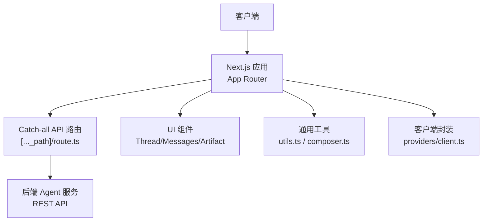
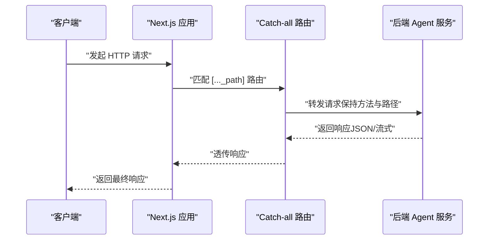
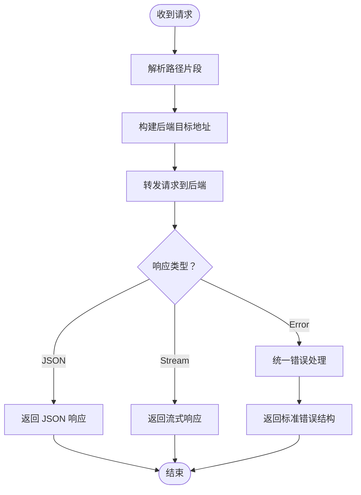
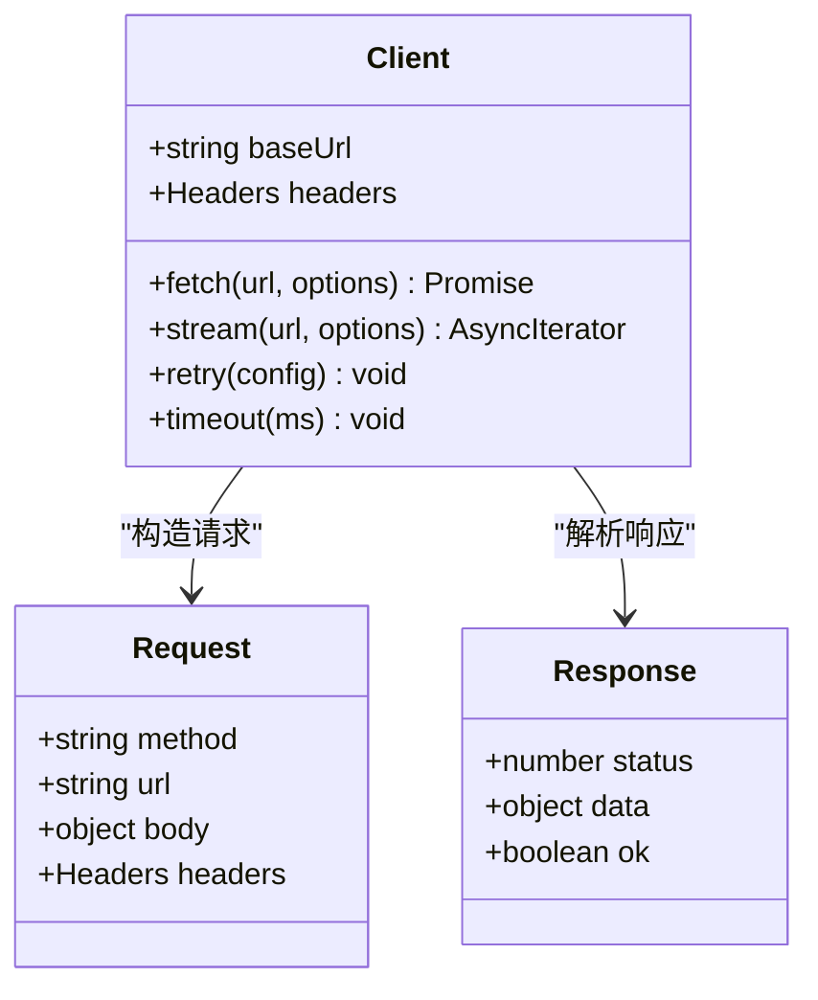
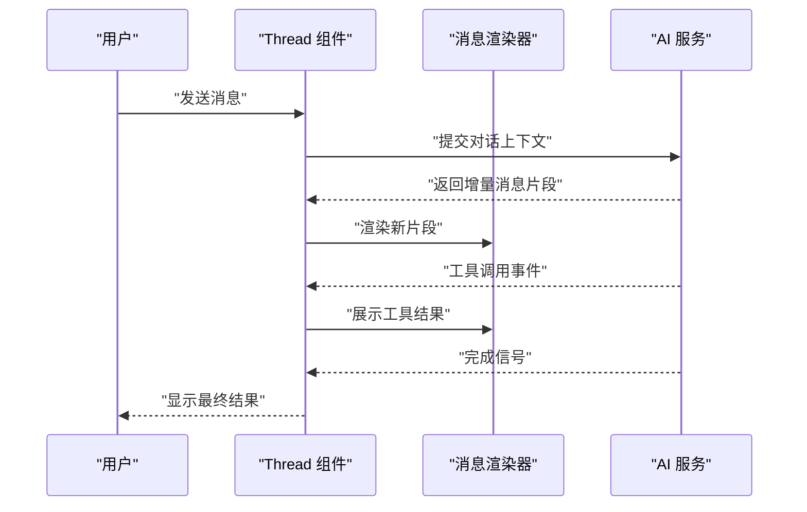
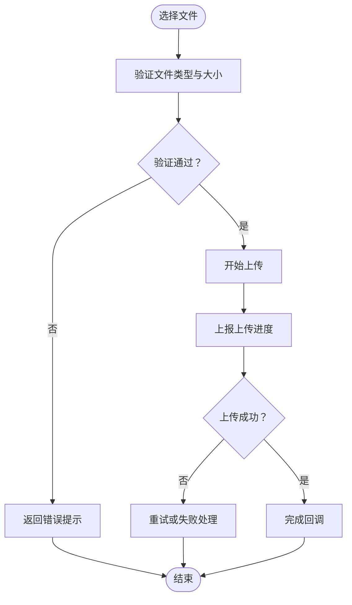
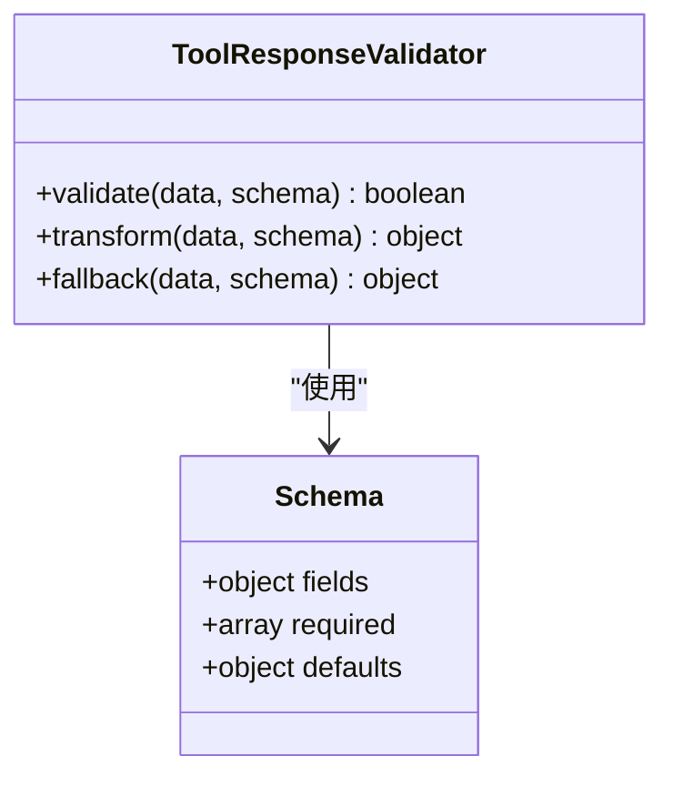
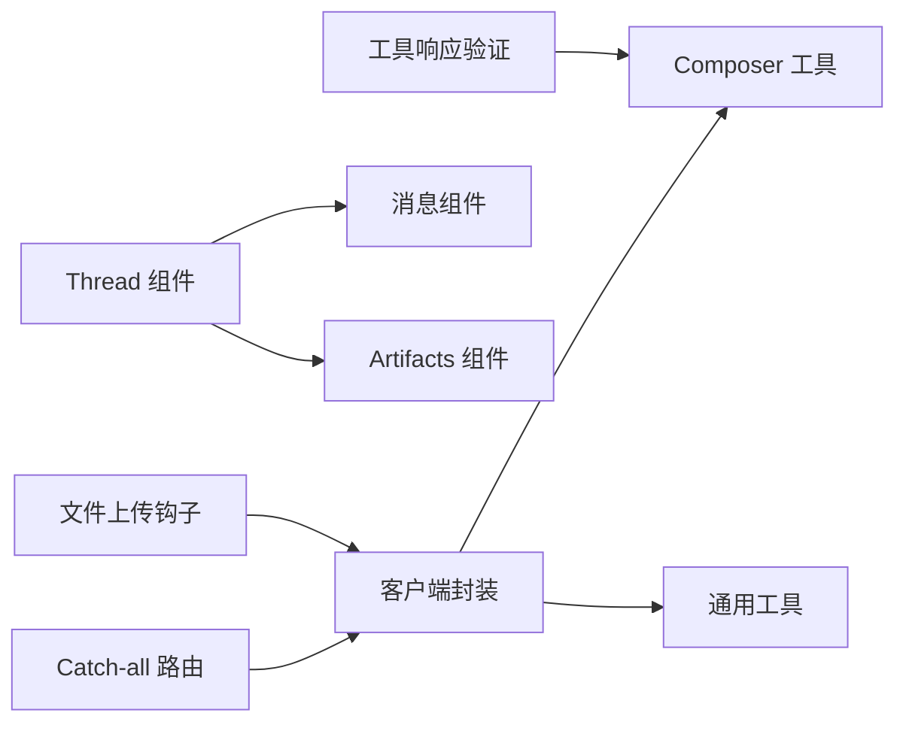

# REST API接口

<cite>
**本文引用的文件**   
- [apps/web/src/app/api/[..._path]/route.ts](file://apps/web/src/app/api/[..._path]/route.ts)
- [apps/web/package.json](file://apps/web/package.json)
- [apps/web/next.config.mjs](file://apps/web/next.config.mjs)
- [apps/web/src/lib/utils.ts](file://apps/web/src/lib/utils.ts)
- [apps/web/src/lib/composer.ts](file://apps/web/src/lib/composer.ts)
- [apps/web/src/providers/client.ts](file://apps/web/src/providers/client.ts)
- [apps/web/src/components/thread/index.tsx](file://apps/web/src/components/thread/index.tsx)
- [apps/web/src/components/thread/messages/shared.tsx](file://apps/web/src/components/thread/messages/shared.tsx)
- [apps/web/src/components/thread/artifact.tsx](file://apps/web/src/components/thread/artifact.tsx)
- [apps/web/src/components/thread/multimodal-utils.ts](file://apps/web/src/components/thread/multimodal-utils.ts)
- [apps/web/src/hooks/use-file-upload.tsx](file://apps/web/src/hooks/use-file-upload.tsx)
- [apps/web/src/lib/api-key.tsx](file://apps/web/src/lib/api-key.tsx)
- [apps/web/src/lib/agent-inbox-interrupt.ts](file://apps/web/src/lib/agent-inbox-interrupt.ts)
- [apps/web/src/lib/ensure-tool-responses.ts](file://apps/web/src/lib/ensure-tool-responses.ts)
- [apps/web/src/lib/composer.test.ts](file://apps/web/src/lib/composer.test.ts)
- [apps/web/src/app/error.tsx](file://apps/web/src/app/error.tsx)
- [apps/web/src/app/page.tsx](file://apps/web/src/app/page.tsx)
- [apps/web/src/app/layout.tsx](file://apps/web/src/app/layout.tsx)
</cite>

## 目录
1. [简介](#简介)
2. [项目结构](#项目结构)
3. [核心组件](#核心组件)
4. [架构总览](#架构总览)
5. [详细组件分析](#详细组件分析)
6. [依赖关系分析](#依赖关系分析)
7. [性能考虑](#性能考虑)
8. [故障排查指南](#故障排查指南)
9. [结论](#结论)
10. [附录](#附录)

## 简介
本文件为 COS 项目的 REST API 接口文档，面向开发者与集成方。内容涵盖：
- RESTful 端点清单（HTTP 方法、URL 模式、请求参数、响应格式、状态码）
- 认证机制、权限控制与错误处理策略
- 完整的请求/响应示例（JSON 结构与校验规则）
- API 版本控制、速率限制与安全建议
- 客户端集成指南、错误重试机制与性能优化建议

说明：
- 本项目采用 Next.js App Router，API 路由通过 catch-all 路由统一转发到后端服务。
- 前端提供统一的 HTTP 客户端封装，用于调用后端 API，并处理流式响应、错误与重试等通用逻辑。

## 项目结构
COS 项目由前后端组成：
- 前端：Next.js Web 应用，提供 UI 与 API 代理层
- 后端：Agent 服务（Python/LangGraph），提供业务逻辑与工具能力



图表来源
- [apps/web/src/app/api/[..._path]/route.ts](file://apps/web/src/app/api/[..._path]/route.ts)
- [apps/web/src/providers/client.ts](file://apps/web/src/providers/client.ts)
- [apps/web/src/components/thread/index.tsx](file://apps/web/src/components/thread/index.tsx)

章节来源
- [apps/web/src/app/api/[..._path]/route.ts](file://apps/web/src/app/api/[..._path]/route.ts)
- [apps/web/package.json](file://apps/web/package.json)
- [apps/web/next.config.mjs](file://apps/web/next.config.mjs)

## 核心组件
- Catch-all API 路由：负责接收所有 /api/* 请求，按路径转发至后端服务，并透传请求体、头部与查询参数。
- 客户端封装：提供统一的 fetch 封装，支持 JSON 序列化、错误处理、流式读取与重试策略。
- 线程与消息组件：负责对话历史、消息渲染与工具调用结果展示。
- 文件上传钩子：封装 multipart/form-data 上传流程，支持进度与错误回调。
- 工具响应保障：确保工具返回数据符合预期 Schema，便于前端稳定渲染。

章节来源
- [apps/web/src/app/api/[..._path]/route.ts](file://apps/web/src/app/api/[..._path]/route.ts)
- [apps/web/src/providers/client.ts](file://apps/web/src/providers/client.ts)
- [apps/web/src/components/thread/index.tsx](file://apps/web/src/components/thread/index.tsx)
- [apps/web/src/hooks/use-file-upload.tsx](file://apps/web/src/hooks/use-file-upload.tsx)
- [apps/web/src/lib/ensure-tool-responses.ts](file://apps/web/src/lib/ensure-tool-responses.ts)

## 架构总览
整体交互流程如下：
- 前端通过 Next.js 的 catch-all 路由将请求转发到后端 Agent 服务
- 后端处理业务逻辑，返回 JSON 或流式响应
- 前端根据响应类型进行解析与渲染，必要时触发重试或错误提示



图表来源
- [apps/web/src/app/api/[..._path]/route.ts](file://apps/web/src/app/api/[..._path]/route.ts)
- [apps/web/src/providers/client.ts](file://apps/web/src/providers/client.ts)

## 详细组件分析

### Catch-all API 路由（/api/[..._path]）
职责：
- 接收任意 /api/* 请求
- 解析路径片段，拼接后端目标地址
- 透传请求头、查询参数与请求体
- 处理后端响应（包括流式响应）

关键行为：
- 对未识别的后端错误进行统一包装
- 对网络异常进行捕获并返回标准错误结构
- 支持跨域与缓存控制头透传



图表来源
- [apps/web/src/app/api/[..._path]/route.ts](file://apps/web/src/app/api/[..._path]/route.ts)

章节来源
- [apps/web/src/app/api/[..._path]/route.ts](file://apps/web/src/app/api/[..._path]/route.ts)

### 客户端封装（providers/client.ts）
职责：
- 统一封装 fetch，自动附加认证头与基础 URL
- 处理 JSON 序列化与反序列化
- 支持流式响应（SSE/ReadableStream）
- 实现指数退避重试与超时控制

关键行为：
- 对 4xx/5xx 错误进行区分处理
- 对网络错误进行可配置重试
- 提供取消令牌支持



图表来源
- [apps/web/src/providers/client.ts](file://apps/web/src/providers/client.ts)

章节来源
- [apps/web/src/providers/client.ts](file://apps/web/src/providers/client.ts)

### 线程与消息组件（components/thread）
职责：
- 管理对话线程状态
- 渲染用户与 AI 消息
- 展示工具调用结果与中断状态
- 支持多模态内容预览

关键行为：
- 实时增量更新消息内容
- 处理工具调用的输入输出
- 支持中断恢复与继续执行



图表来源
- [apps/web/src/components/thread/index.tsx](file://apps/web/src/components/thread/index.tsx)
- [apps/web/src/components/thread/messages/shared.tsx](file://apps/web/src/components/thread/messages/shared.tsx)

章节来源
- [apps/web/src/components/thread/index.tsx](file://apps/web/src/components/thread/index.tsx)
- [apps/web/src/components/thread/messages/shared.tsx](file://apps/web/src/components/thread/messages/shared.tsx)

### 文件上传钩子（use-file-upload.tsx）
职责：
- 封装 multipart/form-data 上传
- 支持进度回调与错误处理
- 自动处理大文件分片与合并

关键行为：
- 验证文件大小与类型
- 支持断点续传（可选）
- 提供取消上传功能



图表来源
- [apps/web/src/hooks/use-file-upload.tsx](file://apps/web/src/hooks/use-file-upload.tsx)

章节来源
- [apps/web/src/hooks/use-file-upload.tsx](file://apps/web/src/hooks/use-file-upload.tsx)

### 工具响应保障（ensure-tool-responses.ts）
职责：
- 校验工具返回数据的 Schema
- 转换不符合预期的数据结构
- 提供默认值与降级策略

关键行为：
- 深度嵌套对象验证
- 字段类型强制转换
- 缺失字段填充默认值



图表来源
- [apps/web/src/lib/ensure-tool-responses.ts](file://apps/web/src/lib/ensure-tool-responses.ts)

章节来源
- [apps/web/src/lib/ensure-tool-responses.ts](file://apps/web/src/lib/ensure-tool-responses.ts)

### 多模态工具（multimodal-utils.ts）
职责：
- 处理图片、音频等多媒体数据
- 转换为后端支持的格式
- 压缩与优化传输体积

关键行为：
- 格式检测与转换
- 尺寸与质量调整
- 缓存已处理资源

章节来源
- [apps/web/src/components/thread/multimodal-utils.ts](file://apps/web/src/components/thread/multimodal-utils.ts)

### 中断处理（agent-inbox-interrupt.ts）
职责：
- 处理 Agent 中断事件
- 恢复对话状态
- 支持手动干预与继续执行

关键行为：
- 监听中断信号
- 保存当前上下文
- 等待用户输入后继续

章节来源
- [apps/web/src/lib/agent-inbox-interrupt.ts](file://apps/web/src/lib/agent-inbox-interrupt.ts)

### API Key 管理（api-key.tsx）
职责：
- 存储与获取 API Key
- 自动附加到请求头
- 支持密钥轮换与过期检查

关键行为：
- 本地安全存储
- 动态更新认证信息
- 失效时提示重新登录

章节来源
- [apps/web/src/lib/api-key.tsx](file://apps/web/src/lib/api-key.tsx)

## 依赖关系分析


图表来源
- [apps/web/src/app/api/[..._path]/route.ts](file://apps/web/src/app/api/[..._path]/route.ts)
- [apps/web/src/providers/client.ts](file://apps/web/src/providers/client.ts)
- [apps/web/src/lib/composer.ts](file://apps/web/src/lib/composer.ts)
- [apps/web/src/lib/utils.ts](file://apps/web/src/lib/utils.ts)
- [apps/web/src/components/thread/index.tsx](file://apps/web/src/components/thread/index.tsx)
- [apps/web/src/components/thread/artifact.tsx](file://apps/web/src/components/thread/artifact.tsx)
- [apps/web/src/hooks/use-file-upload.tsx](file://apps/web/src/hooks/use-file-upload.tsx)
- [apps/web/src/lib/ensure-tool-responses.ts](file://apps/web/src/lib/ensure-tool-responses.ts)

章节来源
- [apps/web/src/app/api/[..._path]/route.ts](file://apps/web/src/app/api/[..._path]/route.ts)
- [apps/web/src/providers/client.ts](file://apps/web/src/providers/client.ts)
- [apps/web/src/lib/composer.ts](file://apps/web/src/lib/composer.ts)
- [apps/web/src/lib/utils.ts](file://apps/web/src/lib/utils.ts)

## 性能考虑
- 连接复用：启用 HTTP Keep-Alive，减少握手开销
- 请求合并：批量操作合并为单次请求
- 缓存策略：合理使用浏览器缓存与服务端缓存
- 流式传输：大文件与长响应使用流式处理
- 错误重试：指数退避避免雪崩效应
- 资源优化：图片压缩与懒加载

## 故障排查指南
常见问题与解决方案：
- 网络连接失败：检查网络状态与代理设置
- 认证失败：验证 API Key 是否有效且未过期
- 请求超时：增加超时时间或优化请求负载
- 数据格式错误：确认请求体结构与后端期望一致
- 流式响应中断：实现重连与状态恢复机制

错误处理策略：
- 统一错误码映射
- 用户友好的错误提示
- 详细的日志记录
- 自动重试与降级

章节来源
- [apps/web/src/app/error.tsx](file://apps/web/src/app/error.tsx)
- [apps/web/src/lib/utils.ts](file://apps/web/src/lib/utils.ts)

## 结论
COS 项目的 REST API 通过 Next.js 的统一路由层提供了灵活的 API 代理能力，结合完善的客户端封装与错误处理机制，为开发者提供了稳定可靠的集成体验。建议在生产环境中：
- 实施严格的认证与授权机制
- 配置合理的速率限制与熔断策略
- 建立完善的监控与告警系统
- 定期进行安全审计与性能测试

## 附录

### API 端点规范
基础路径：/api
版本控制：通过 URL 路径前缀实现，如 /api/v1/*
认证方式：Bearer Token 或 API Key

#### 通用请求头
- Content-Type: application/json
- Authorization: Bearer <token>
- X-API-Key: <api_key>

#### 通用响应格式
```json
{
  "status": "success",
  "data": {},
  "error": null,
  "meta": {
    "request_id": "uuid",
    "timestamp": "ISO8601"
  }
}
```

#### 错误响应格式
```json
{
  "status": "error",
  "data": null,
  "error": {
    "code": "ERROR_CODE",
    "message": "错误描述",
    "details": {}
  },
  "meta": {
    "request_id": "uuid",
    "timestamp": "ISO8601"
  }
}
```

### 状态码定义
- 200: 请求成功
- 201: 资源创建成功
- 400: 请求参数错误
- 401: 未认证
- 403: 权限不足
- 404: 资源不存在
- 429: 请求频率限制
- 500: 服务器内部错误

### 速率限制
- 基础限制：100 请求/分钟
- 高级限制：1000 请求/分钟（需付费计划）
- 超限响应：429 Too Many Requests

### 安全最佳实践
- 使用 HTTPS 传输
- 定期轮换 API Key
- 最小权限原则
- 输入验证与输出编码
- SQL 注入防护
- XSS 攻击防护

### 客户端集成示例
```javascript
// 初始化客户端
const client = new COSClient({
  baseUrl: 'https://api.cos.example.com',
  apiKey: process.env.COS_API_KEY,
  timeout: 30000,
  retries: 3
});

// 发送请求
const response = await client.post('/v1/chat/completions', {
  model: 'cos-model-v1',
  messages: [
    { role: 'user', content: '你好' }
  ]
});

// 处理流式响应
for await (const chunk of client.stream('/v1/chat/stream')) {
  console.log(chunk);
}
```

### 错误重试机制
- 指数退避：初始延迟 1s，最大延迟 30s
- 重试条件：网络错误、5xx 错误、429 错误
- 重试上限：3 次
- 取消机制：支持 AbortController

### 性能优化建议
- 启用 Gzip/Brotli 压缩
- 使用 CDN 缓存静态资源
- 数据库查询优化与索引
- 内存缓存热点数据
- 异步处理耗时任务
- 负载均衡与水平扩展