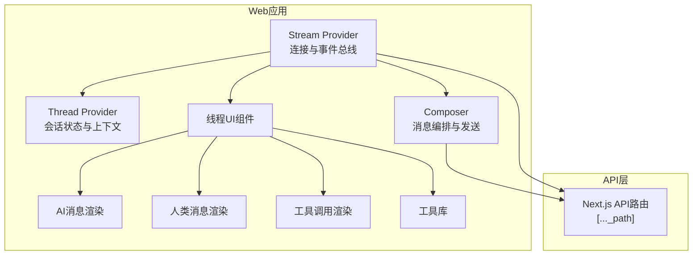
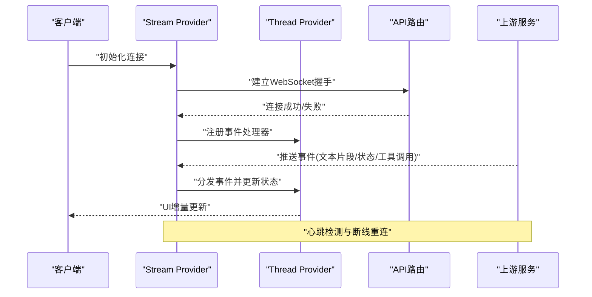
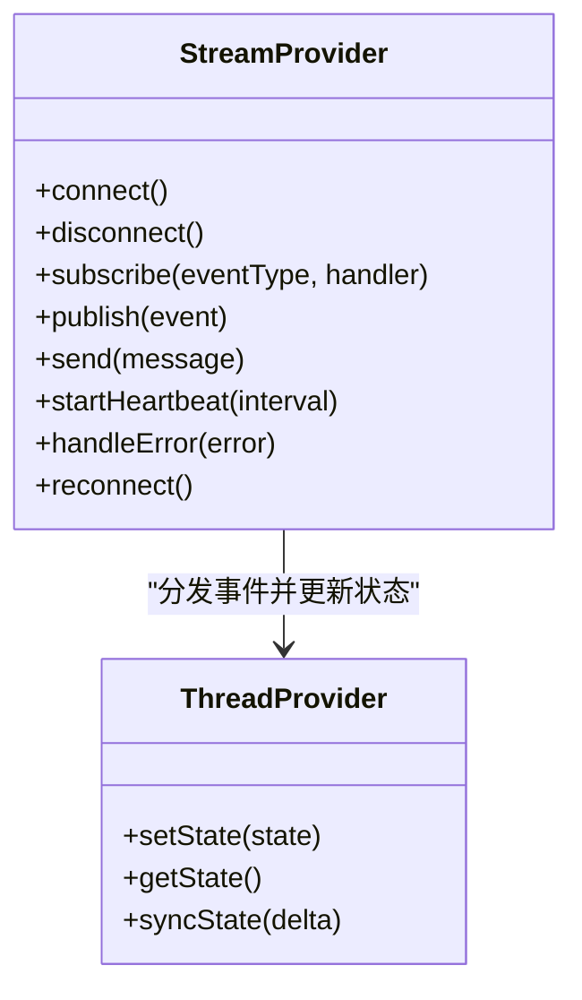
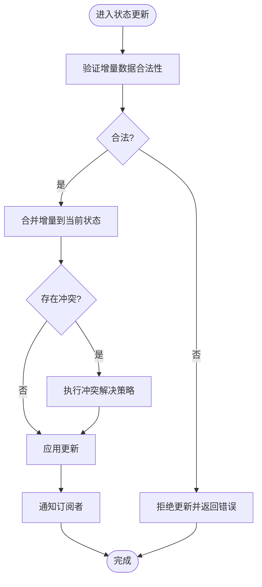
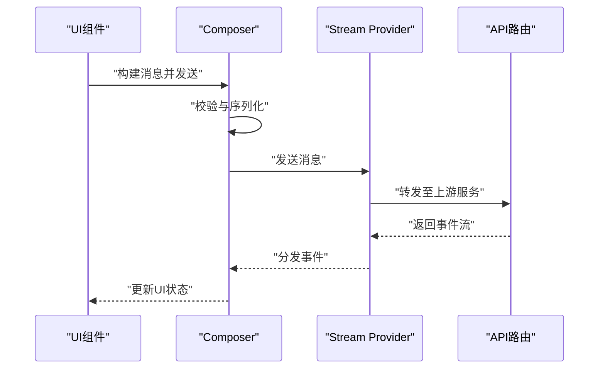
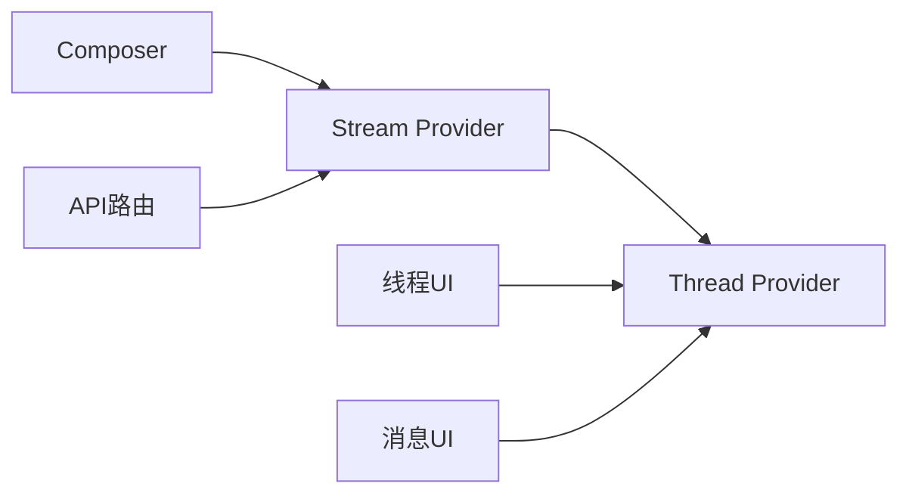

# WebSocket实时通信

<cite>
**本文档引用的文件**   
- [apps/web/src/providers/Stream.tsx](file://apps/web/src/providers/Stream.tsx)
- [apps/web/src/providers/Thread.tsx](file://apps/web/src/providers/Thread.tsx)
- [apps/web/src/lib/composer.ts](file://apps/web/src/lib/composer.ts)
- [apps/web/src/app/api/[..._path]/route.ts](file://apps/web/src/app/api/[..._path]/route.ts)
- [apps/web/src/components/thread/index.tsx](file://apps/web/src/components/thread/index.tsx)
- [apps/web/src/components/thread/messages/ai.tsx](file://apps/web/src/components/thread/messages/ai.tsx)
- [apps/web/src/components/thread/messages/human.tsx](file://apps/web/src/components/thread/messages/human.tsx)
- [apps/web/src/components/thread/messages/tool-calls.tsx](file://apps/web/src/components/thread/messages/tool-calls.tsx)
- [apps/web/src/components/thread/artifact.tsx](file://apps/web/src/components/thread/artifact.tsx)
- [apps/web/src/components/thread/multimodal-utils.ts](file://apps/web/src/components/thread/multimodal-utils.ts)
- [apps/web/src/lib/utils.ts](file://apps/web/src/lib/utils.ts)
- [apps/web/package.json](file://apps/web/package.json)
</cite>

## 目录
1. [简介](#简介)
2. [项目结构](#项目结构)
3. [核心组件](#核心组件)
4. [架构总览](#架构总览)
5. [详细组件分析](#详细组件分析)
6. [依赖分析](#依赖分析)
7. [性能考虑](#性能考虑)
8. [故障排查指南](#故障排查指南)
9. [结论](#结论)
10. [附录](#附录)

## 简介
本文件面向COS项目的WebSocket实时通信能力，聚焦于：
- WebSocket连接建立与生命周期管理
- 消息协议规范、数据序列化/反序列化规则
- 事件类型与实时交互模式（流式数据传输、状态同步）
- 断线重连机制、心跳检测与错误处理策略
- 客户端连接示例、事件监听实现与最佳实践
- 连接管理与性能监控建议

说明：本项目为前端Next.js应用，WebSocket相关逻辑集中在Web端Provider与组件中。后端接口通过Next.js API路由暴露，用于代理或桥接上游服务。

## 项目结构
与WebSocket相关的代码主要位于Web应用中：
- Provider层负责全局连接、状态与事件分发
- 业务组件订阅事件并渲染流式内容
- 工具库提供通用方法（如ID生成、序列化辅助等）
- API路由作为统一入口，转发请求至上游服务

图表来源
- [apps/web/src/providers/Stream.tsx](file://apps/web/src/providers/Stream.tsx)
- [apps/web/src/providers/Thread.tsx](file://apps/web/src/providers/Thread.tsx)
- [apps/web/src/lib/composer.ts](file://apps/web/src/lib/composer.ts)
- [apps/web/src/app/api/[..._path]/route.ts](file://apps/web/src/app/api/[..._path]/route.ts)
- [apps/web/src/components/thread/index.tsx](file://apps/web/src/components/thread/index.tsx)
- [apps/web/src/components/thread/messages/ai.tsx](file://apps/web/src/components/thread/messages/ai.tsx)
- [apps/web/src/components/thread/messages/human.tsx](file://apps/web/src/components/thread/messages/human.tsx)
- [apps/web/src/components/thread/messages/tool-calls.tsx](file://apps/web/src/components/thread/messages/tool-calls.tsx)
- [apps/web/src/lib/utils.ts](file://apps/web/src/lib/utils.ts)

章节来源
- [apps/web/src/providers/Stream.tsx](file://apps/web/src/providers/Stream.tsx)
- [apps/web/src/providers/Thread.tsx](file://apps/web/src/providers/Thread.tsx)
- [apps/web/src/lib/composer.ts](file://apps/web/src/lib/composer.ts)
- [apps/web/src/app/api/[..._path]/route.ts](file://apps/web/src/app/api/[..._path]/route.ts)
- [apps/web/src/components/thread/index.tsx](file://apps/web/src/components/thread/index.tsx)
- [apps/web/src/components/thread/messages/ai.tsx](file://apps/web/src/components/thread/messages/ai.tsx)
- [apps/web/src/components/thread/messages/human.tsx](file://apps/web/src/components/thread/messages/human.tsx)
- [apps/web/src/components/thread/messages/tool-calls.tsx](file://apps/web/src/components/thread/messages/tool-calls.tsx)
- [apps/web/src/lib/utils.ts](file://apps/web/src/lib/utils.ts)

## 核心组件
- Stream Provider
  - 职责：维护WebSocket连接、事件总线、重连与心跳、流式数据接收与分发
  - 关键点：连接生命周期、事件订阅/发布、错误恢复、性能指标上报
- Thread Provider
  - 职责：维护会话上下文、状态同步、消息队列与顺序保证
  - 关键点：状态快照、增量更新、并发安全
- Composer
  - 职责：构建消息、编排发送流程、处理响应与回调
  - 关键点：消息序列化、重试策略、超时控制
- API路由
  - 职责：统一入口、鉴权校验、上游服务代理
  - 关键点：路径匹配、参数校验、错误透传

章节来源
- [apps/web/src/providers/Stream.tsx](file://apps/web/src/providers/Stream.tsx)
- [apps/web/src/providers/Thread.tsx](file://apps/web/src/providers/Thread.tsx)
- [apps/web/src/lib/composer.ts](file://apps/web/src/lib/composer.ts)
- [apps/web/src/app/api/[..._path]/route.ts](file://apps/web/src/app/api/[..._path]/route.ts)

## 架构总览
WebSocket实时通信的整体流程如下：
- 客户端初始化时创建WebSocket连接，携带必要认证信息
- 服务端推送事件（如消息片段、状态变更、工具调用结果）
- 客户端按事件类型分发到对应处理器，更新UI与状态
- 异常或网络波动触发重连与心跳检测，确保稳定性

图表来源
- [apps/web/src/providers/Stream.tsx](file://apps/web/src/providers/Stream.tsx)
- [apps/web/src/providers/Thread.tsx](file://apps/web/src/providers/Thread.tsx)
- [apps/web/src/app/api/[..._path]/route.ts](file://apps/web/src/app/api/[..._path]/route.ts)

## 详细组件分析

### Stream Provider（连接与事件总线）
- 连接管理
  - 支持自动重连、指数退避、最大重试次数限制
  - 心跳检测：定时发送ping，未收到pong则判定断开
- 事件总线
  - 定义事件类型：消息片段、完整消息、状态同步、工具调用、错误
  - 订阅/发布模型，支持优先级与去抖
- 流式数据处理
  - 分片合并、乱序处理、完整性校验
- 错误处理
  - 分类错误码、降级策略、用户提示

图表来源
- [apps/web/src/providers/Stream.tsx](file://apps/web/src/providers/Stream.tsx)
- [apps/web/src/providers/Thread.tsx](file://apps/web/src/providers/Thread.tsx)

章节来源
- [apps/web/src/providers/Stream.tsx](file://apps/web/src/providers/Stream.tsx)
- [apps/web/src/providers/Thread.tsx](file://apps/web/src/providers/Thread.tsx)

### Thread Provider（会话状态与上下文）
- 状态模型
  - 会话ID、消息列表、工具调用记录、元数据
- 状态同步
  - 增量更新、冲突解决、版本控制
- 并发安全
  - 锁机制、事务性更新、回滚策略

图表来源
- [apps/web/src/providers/Thread.tsx](file://apps/web/src/providers/Thread.tsx)

章节来源
- [apps/web/src/providers/Thread.tsx](file://apps/web/src/providers/Thread.tsx)

### Composer（消息编排与发送）
- 消息构建
  - 结构化消息体、字段校验、默认值填充
- 发送流程
  - 异步发送、重试与超时、失败回退
- 响应处理
  - 解析事件流、映射到UI事件、错误捕获

图表来源
- [apps/web/src/lib/composer.ts](file://apps/web/src/lib/composer.ts)
- [apps/web/src/providers/Stream.tsx](file://apps/web/src/providers/Stream.tsx)
- [apps/web/src/app/api/[..._path]/route.ts](file://apps/web/src/app/api/[..._path]/route.ts)

章节来源
- [apps/web/src/lib/composer.ts](file://apps/web/src/lib/composer.ts)
- [apps/web/src/providers/Stream.tsx](file://apps/web/src/providers/Stream.tsx)
- [apps/web/src/app/api/[..._path]/route.ts](file://apps/web/src/app/api/[..._path]/route.ts)

### UI组件（消息渲染与交互）
- AI消息渲染：支持流式文本、Markdown、代码高亮
- 人类消息渲染：显示用户输入与时间戳
- 工具调用渲染：展示工具名称、参数、结果
- 多模态预览：图片、文件等富媒体展示

章节来源
- [apps/web/src/components/thread/index.tsx](file://apps/web/src/components/thread/index.tsx)
- [apps/web/src/components/thread/messages/ai.tsx](file://apps/web/src/components/thread/messages/ai.tsx)
- [apps/web/src/components/thread/messages/human.tsx](file://apps/web/src/components/thread/messages/human.tsx)
- [apps/web/src/components/thread/messages/tool-calls.tsx](file://apps/web/src/components/thread/messages/tool-calls.tsx)
- [apps/web/src/components/thread/artifact.tsx](file://apps/web/src/components/thread/artifact.tsx)
- [apps/web/src/components/thread/multimodal-utils.ts](file://apps/web/src/components/thread/multimodal-utils.ts)

## 依赖分析
- 内部依赖
  - Stream Provider依赖Thread Provider进行状态同步
  - Composer依赖Stream Provider进行消息发送
  - UI组件依赖Thread Provider获取最新状态
- 外部依赖
  - Next.js API路由用于代理上游服务
  - 浏览器WebSocket API用于实时通信

图表来源
- [apps/web/src/providers/Stream.tsx](file://apps/web/src/providers/Stream.tsx)
- [apps/web/src/providers/Thread.tsx](file://apps/web/src/providers/Thread.tsx)
- [apps/web/src/lib/composer.ts](file://apps/web/src/lib/composer.ts)
- [apps/web/src/app/api/[..._path]/route.ts](file://apps/web/src/app/api/[..._path]/route.ts)

章节来源
- [apps/web/src/providers/Stream.tsx](file://apps/web/src/providers/Stream.tsx)
- [apps/web/src/providers/Thread.tsx](file://apps/web/src/providers/Thread.tsx)
- [apps/web/src/lib/composer.ts](file://apps/web/src/lib/composer.ts)
- [apps/web/src/app/api/[..._path]/route.ts](file://apps/web/src/app/api/[..._path]/route.ts)

## 性能考虑
- 连接优化
  - 连接池复用、延迟建立、按需激活
- 传输优化
  - 二进制传输、压缩、分片大小调优
- 内存管理
  - 事件去抖、批量更新、垃圾回收友好
- 监控指标
  - 连接时长、消息吞吐、错误率、重连次数

## 故障排查指南
- 常见问题
  - 连接失败：检查网络、鉴权、防火墙
  - 消息丢失：确认事件顺序、完整性校验
  - 性能问题：监控内存占用、CPU使用率
- 调试技巧
  - 启用日志、抓包分析、模拟断网
- 恢复策略
  - 自动重连、降级模式、用户提示

章节来源
- [apps/web/src/providers/Stream.tsx](file://apps/web/src/providers/Stream.tsx)
- [apps/web/src/lib/utils.ts](file://apps/web/src/lib/utils.ts)

## 结论
本WebSocket实时通信方案通过Stream Provider与Thread Provider的协作，实现了稳定的连接管理、高效的事件分发与状态同步。结合Composer的消息编排与UI组件的渲染能力，提供了完整的实时交互体验。未来可进一步优化性能与可靠性，增强监控与诊断能力。

## 附录
- 消息协议规范
  - 事件类型：message_chunk、state_sync、tool_call、error
  - 字段定义：type、payload、timestamp、sessionId
- 客户端连接示例
  - 初始化连接、事件监听、错误处理
- 最佳实践
  - 合理设置心跳间隔、重连策略、错误阈值