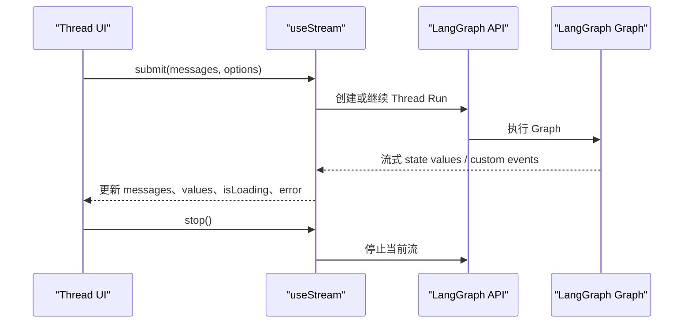

# LangGraph SDK 流式通信

<cite>
**本文档引用的文件**
- [Stream.tsx](file://apps/web/src/providers/Stream.tsx)
- [Thread.tsx](file://apps/web/src/providers/Thread.tsx)
- [client.ts](file://apps/web/src/providers/client.ts)
- [thread/index.tsx](file://apps/web/src/components/thread/index.tsx)
- [route.ts](file://apps/web/src/app/api/[..._path]/route.ts)
</cite>

## 结论

COS Web 不直接创建或管理浏览器 `WebSocket`。实时响应由
`@langchain/langgraph-sdk/react` 的 `useStream` 提供；具体底层传输、恢复语义与
错误行为由 LangGraph SDK 和 LangGraph 服务决定。

当前应用代码没有自定义 WebSocket 握手、ping/pong 心跳、指数退避或断线重连器。
排障时不应假设这些能力存在于 COS 前端。

## 数据流



## Stream Provider

`StreamProvider` 从 URL 参数或环境变量读取：

- `apiUrl`
- `assistantId`
- `authScheme`
- 浏览器 `localStorage` 中的 API key

`StreamSession` 调用类型化的 `useStream`，关键选项如下：

- `threadId`：继续已有 Thread；为空时由 SDK 创建 Thread。
- `fetchStateHistory: true`：加载 Thread 状态历史。
- `onThreadId`：把新 Thread ID 写入 URL，并刷新 Thread 列表。
- `onCustomEvent`：用 SDK 的 `uiMessageReducer` 合并 UI 自定义事件。
- `defaultHeaders`：按需传递认证方案。

组件挂载后会通过普通 `fetch` 请求 `${apiUrl}/info`。失败时显示连接错误提示；
这是一次服务可用性检查，不是心跳。

## 提交与取消

Thread UI 调用 `stream.submit` 提交消息，并使用：

```ts
{
  streamMode: ["values"],
  streamSubgraphs: true,
  streamResumable: true,
  optimisticValues: ...,
}
```

`optimisticValues` 先把用户消息写入本地状态，收到服务端状态后再由 SDK 更新。
重新生成回答时会携带目标 checkpoint。用户点击 Cancel 时调用 `stream.stop()`。

## Thread 查询

`ThreadProvider` 使用 `@langchain/langgraph-sdk` 的 `Client` 和
`client.threads.search` 查询 Thread。查询 metadata 根据 assistant ID 形态选择
`assistant_id` 或 `graph_id`。

## API 入口

浏览器可以直接连接配置的 LangGraph API，也可以通过
`app/api/[..._path]/route.ts` 提供的 Next.js passthrough。该路由使用
`langgraph-nextjs-api-passthrough` 转发 HTTP 方法，不实现独立 WebSocket 服务。

## 排障

1. 确认 LangGraph 服务正在运行，且 `${apiUrl}/info` 返回成功状态。
2. 确认 `assistantId` 与服务端 graph ID 一致。
3. 部署环境确认 API key 和 `X-Auth-Scheme` 配置正确。
4. 查看 `stream.error` 对应的 UI toast 和浏览器 Network 请求。
5. 流中断后验证 SDK 的 resumable stream 行为；不要依赖 COS 中不存在的自定义重连。
