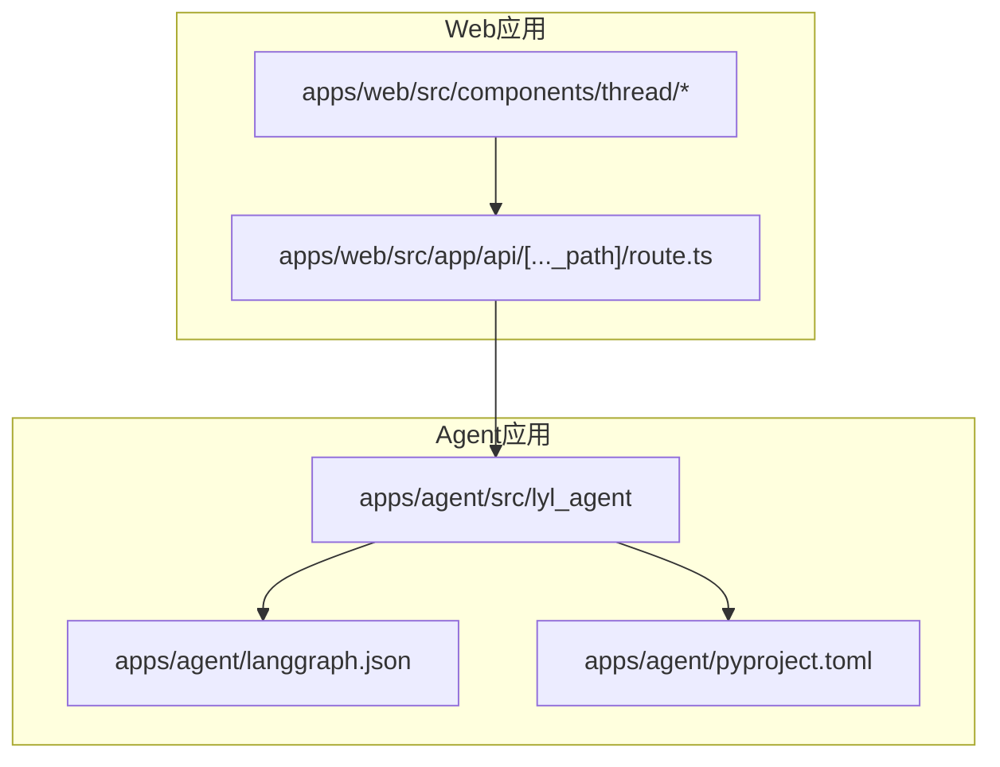
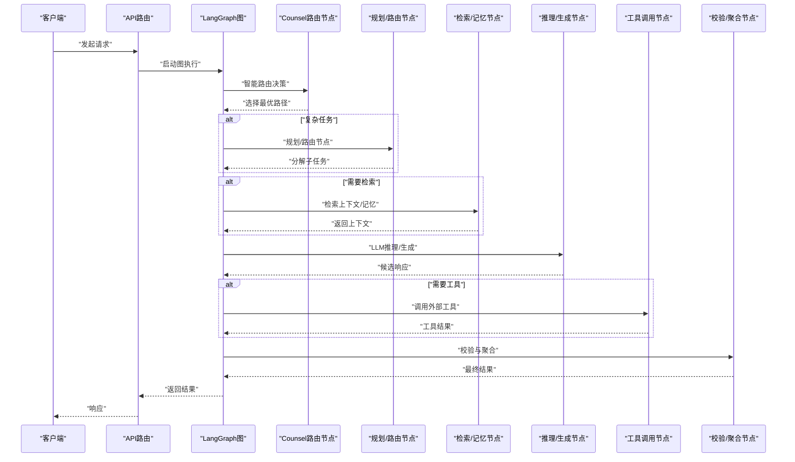
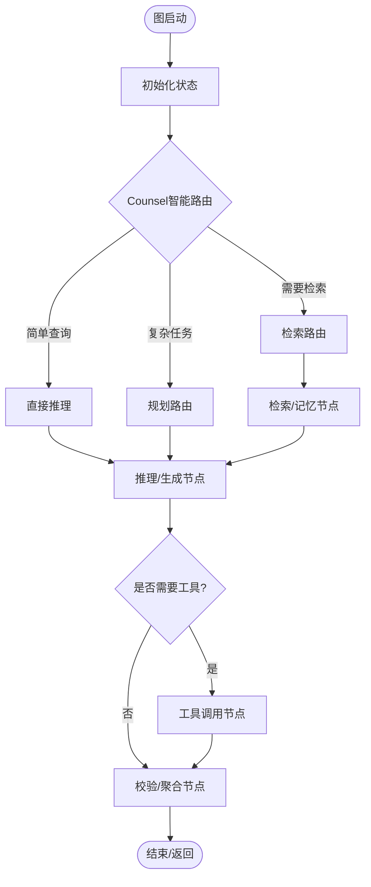
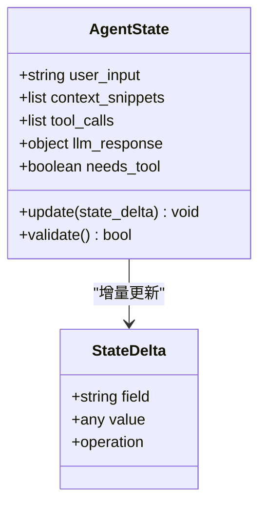
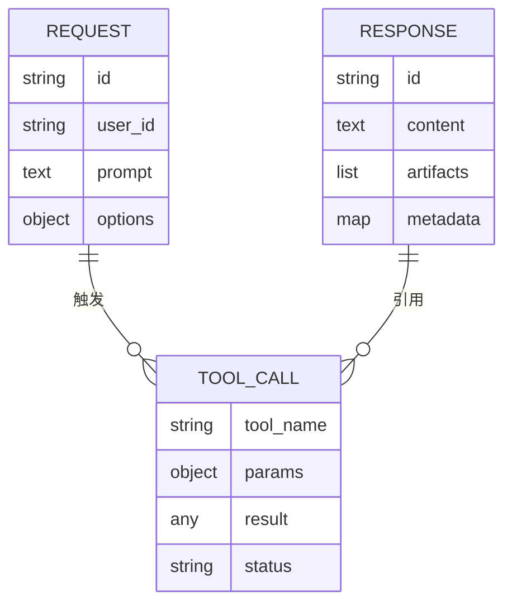
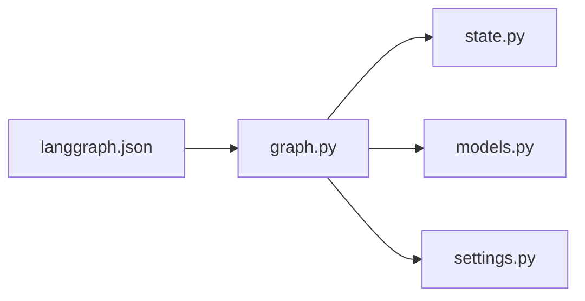
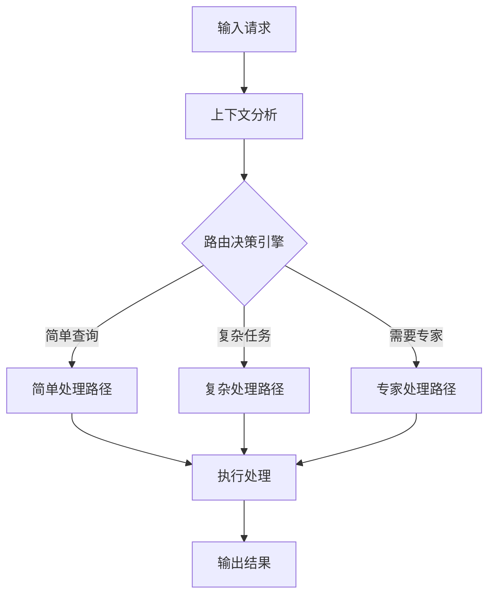

# Agent架构设计

<cite>
**本文引用的文件**   
- [graph.py](file://apps/agent/src/lyl_agent/graph.py)
- [state.py](file://apps/agent/src/lyl_agent/state.py)
- [models.py](file://apps/agent/src/lyl_agent/models.py)
- [settings.py](file://apps/agent/src/lyl_agent/settings.py)
- [langgraph.json](file://apps/agent/langgraph.json)
- [pyproject.toml](file://apps/agent/pyproject.toml)
- [test_graph.py](file://apps/agent/tests/test_graph.py)
- [test_counsel_graph.py](file://apps/agent/tests/test_counsel_graph.py)
</cite>

## 更新摘要
**所做更改**   
- 更新了图与节点章节，反映新的counsel graph路由机制集成
- 增强了路由逻辑说明，从简单规则基础路由升级为智能路由机制
- 添加了counsel graph路由的详细分析和使用示例
- 更新了架构图表以展示新的路由流程

## 目录
1. [简介](#简介)
2. [项目结构](#项目结构)
3. [核心组件](#核心组件)
4. [架构总览](#架构总览)
5. [详细组件分析](#详细组件分析)
6. [依赖关系分析](#依赖关系分析)
7. [性能考量](#性能考量)
8. [故障排查指南](#故障排查指南)
9. [结论](#结论)
10. [附录](#附录)

## 简介
本文件面向基于LangGraph的AI代理（Agent）图架构设计与实现，聚焦以下目标：
- 解释图的构建逻辑、节点定义、边连接与状态流转机制
- 深入解析graph.py中的核心图实现：节点函数设计模式、消息传递机制、错误处理策略
- **新增** 详细说明counsel graph智能路由机制的实现原理和优势
- 说明langgraph.json配置的作用与关键参数设置
- 阐述Agent工作流程、并行处理能力与服务编排模式
- 提供扩展指南：如何添加新节点类型、自定义执行逻辑、集成外部服务与API调用模式

## 项目结构
本项目采用多应用工作区组织，Agent核心位于apps/agent下，使用Python与LangGraph构建图式Agent；前端web应用通过API与Agent交互。

图表来源
- [graph.py:1-200](file://apps/agent/src/lyl_agent/graph.py#L1-L200)
- [langgraph.json:1-200](file://apps/agent/langgraph.json#L1-L200)
- [pyproject.toml:1-200](file://apps/agent/pyproject.toml#L1-L200)

章节来源
- [graph.py:1-200](file://apps/agent/src/lyl_agent/graph.py#L1-L200)
- [langgraph.json:1-200](file://apps/agent/langgraph.json#L1-L200)
- [pyproject.toml:1-200](file://apps/agent/pyproject.toml#L1-L200)

## 核心组件
- 图与节点：graph.py负责定义图结构、节点函数与**增强的counsel graph路由逻辑**
- 状态模型：state.py定义Agent运行时的共享状态结构与更新规则
- 数据模型：models.py定义输入输出Schema与工具返回结构
- 配置管理：settings.py集中管理环境变量与运行时配置
- 运行时配置：langgraph.json描述LangGraph运行时行为（如并发、检查点、序列化等）

章节来源
- [graph.py:1-200](file://apps/agent/src/lyl_agent/graph.py#L1-L200)
- [state.py:1-200](file://apps/agent/src/lyl_agent/state.py#L1-L200)
- [models.py:1-200](file://apps/agent/src/lyl_agent/models.py#L1-L200)
- [settings.py:1-200](file://apps/agent/src/lyl_agent/settings.py#L1-L200)
- [langgraph.json:1-200](file://apps/agent/langgraph.json#L1-L200)

## 架构总览
下图展示Agent图的整体架构与数据流：请求进入后由入口节点接收，经过**智能counsel路由**、规划、检索、推理、工具调用、记忆更新等节点，最终汇聚并返回结果。

图表来源
- [graph.py:1-200](file://apps/agent/src/lyl_agent/graph.py#L1-L200)
- [state.py:1-200](file://apps/agent/src/lyl_agent/state.py#L1-L200)
- [models.py:1-200](file://apps/agent/src/lyl_agent/models.py#L1-L200)

## 详细组件分析

### 图与节点：graph.py
- 图构建：定义节点集合、边与**增强的counsel graph条件路由**，支持分支与循环控制
- 节点函数：每个节点承担单一职责，输入为共享状态，输出为状态增量或副作用
- **智能路由机制**：counsel graph路由替代简单规则基础路由，提供更灵活的决策能力
- 消息传递：通过共享状态在节点间传递上下文，避免隐式全局变量
- 错误处理：节点内捕获异常并转换为可恢复的状态变更，保证图稳定性
- 并行能力：对无依赖节点进行并发执行，提升吞吐

**更新** 新增了counsel智能路由机制，替代了原有的简单规则基础路由，提供更灵活的任务分发能力。

图表来源
- [graph.py:1-200](file://apps/agent/src/lyl_agent/graph.py#L1-L200)

章节来源
- [graph.py:1-200](file://apps/agent/src/lyl_agent/graph.py#L1-L200)

### 状态模型：state.py
- 状态结构：定义Agent运行时的共享数据结构，包含用户输入、中间结果、工具调用记录、上下文片段等
- 更新策略：明确各节点对状态的写入权限与合并策略，避免竞态条件
- 校验规则：在状态提交前进行必要校验，确保一致性

图表来源
- [state.py:1-200](file://apps/agent/src/lyl_agent/state.py#L1-L200)

章节来源
- [state.py:1-200](file://apps/agent/src/lyl_agent/state.py#L1-L200)

### 数据模型：models.py
- 输入模型：定义请求体结构、必填字段与格式约束
- 输出模型：定义响应体结构、枚举值与嵌套对象
- 工具模型：统一工具调用与返回的结构，便于序列化与校验

图表来源
- [models.py:1-200](file://apps/agent/src/lyl_agent/models.py#L1-L200)

章节来源
- [models.py:1-200](file://apps/agent/src/lyl_agent/models.py#L1-L200)

### 配置管理：settings.py
- 环境变量：加载LLM提供商密钥、超时、重试策略等
- 运行时开关：启用/禁用调试日志、检查点、缓存等
- 默认值：提供安全默认值与环境覆盖机制

章节来源
- [settings.py:1-200](file://apps/agent/src/lyl_agent/settings.py#L1-L200)

### 运行时配置：langgraph.json
- 作用：描述LangGraph运行时行为，包括并发度、检查点存储、序列化器、中断处理等
- 关键参数：
  - 并发与资源限制：控制节点并行执行数量与超时
  - 检查点：持久化状态以支持断点续跑与回放
  - 序列化：指定状态与消息的序列化策略
  - 中断与恢复：定义中断点与恢复策略
- 建议：生产环境开启检查点与限流，开发环境关闭以提升迭代速度

章节来源
- [langgraph.json:1-200](file://apps/agent/langgraph.json#L1-L200)

## 依赖关系分析
Agent模块内部依赖清晰：graph依赖state与models，settings提供配置注入，langgraph.json驱动运行时行为。

图表来源
- [graph.py:1-200](file://apps/agent/src/lyl_agent/graph.py#L1-L200)
- [state.py:1-200](file://apps/agent/src/lyl_agent/state.py#L1-L200)
- [models.py:1-200](file://apps/agent/src/lyl_agent/models.py#L1-L200)
- [settings.py:1-200](file://apps/agent/src/lyl_agent/settings.py#L1-L200)
- [langgraph.json:1-200](file://apps/agent/langgraph.json#L1-L200)

章节来源
- [graph.py:1-200](file://apps/agent/src/lyl_agent/graph.py#L1-L200)
- [state.py:1-200](file://apps/agent/src/lyl_agent/state.py#L1-L200)
- [models.py:1-200](file://apps/agent/src/lyl_agent/models.py#L1-L200)
- [settings.py:1-200](file://apps/agent/src/lyl_agent/settings.py#L1-L200)
- [langgraph.json:1-200](file://apps/agent/langgraph.json#L1-L200)

## 性能考量
- 节点粒度：将大任务拆分为细粒度节点，提高并行度与复用性
- 状态大小：控制上下文长度，避免过大状态导致序列化与传输开销
- 并发策略：合理设置并发上限，避免下游服务过载
- **路由优化**：counsel智能路由减少不必要的计算路径，提升响应速度
- 缓存与检查点：对昂贵操作启用缓存，利用检查点减少重复计算
- I/O优化：异步调用外部服务，批量合并请求

## 故障排查指南
- 常见错误：
  - 状态不一致：检查状态更新顺序与冲突合并策略
  - 节点超时：调整超时与重试参数，监控下游延迟
  - 工具调用失败：增加降级逻辑与回退路径
  - 序列化异常：确认模型字段与序列化器兼容
  - **路由错误**：检查counsel路由逻辑的条件判断和决策路径
- 调试技巧：
  - 启用详细日志与检查点快照
  - 使用测试用例复现问题
  - 逐步缩小范围定位故障节点
  - **验证路由决策**：检查智能路由的选择是否符合预期

章节来源
- [test_graph.py:1-200](file://apps/agent/tests/test_graph.py#L1-L200)
- [test_counsel_graph.py:1-200](file://apps/agent/tests/test_counsel_graph.py#L1-L200)

## 结论
本架构通过LangGraph将Agent能力模块化、可视化与可编排，结合清晰的状态模型与配置管理，实现了高内聚、低耦合的图式Agent。**新增的counsel graph智能路由机制**显著提升了任务分发的灵活性和准确性，替代了原有的简单规则基础路由。通过合理的节点设计、并行策略与错误处理，可在复杂场景中稳定运行并易于扩展。

## 附录

### 扩展指南：添加新节点与自定义逻辑
- 步骤：
  - 在state.py中定义新增字段与更新规则
  - 在graph.py中实现节点函数，读取状态、执行业务逻辑、返回状态增量
  - **更新counsel路由逻辑**：在路由决策中添加新的分支条件
  - 在图中注册节点并添加边，必要时添加条件路由
  - 在models.py中更新输入输出Schema
  - 在langgraph.json中调整并发与检查点配置
- 示例路径参考：
  - 节点函数定义位置：[graph.py:1-200](file://apps/agent/src/lyl_agent/graph.py#L1-L200)
  - **Counsel路由逻辑位置**：[graph.py:counsel_router:1-200](file://apps/agent/src/lyl_agent/graph.py#L1-L200)
  - 状态字段扩展位置：[state.py:1-200](file://apps/agent/src/lyl_agent/state.py#L1-L200)
  - 模型Schema更新位置：[models.py:1-200](file://apps/agent/src/lyl_agent/models.py#L1-L200)
  - 运行时配置调整位置：[langgraph.json:1-200](file://apps/agent/langgraph.json#L1-L200)

### 外部服务集成与API调用模式
- 推荐模式：
  - 封装HTTP客户端为独立工具节点，统一错误处理与重试
  - 使用异步调用提升吞吐，避免阻塞主流程
  - 对敏感信息使用settings.py集中管理
- 集成要点：
  - 定义清晰的输入输出模型
  - 实现熔断与降级策略
  - 记录调用日志与指标

章节来源
- [graph.py:1-200](file://apps/agent/src/lyl_agent/graph.py#L1-L200)
- [settings.py:1-200](file://apps/agent/src/lyl_agent/settings.py#L1-L200)
- [models.py:1-200](file://apps/agent/src/lyl_agent/models.py#L1-L200)
- [langgraph.json:1-200](file://apps/agent/langgraph.json#L1-L200)

### Counsel Graph路由机制详解
**新增** counsel graph路由机制是本次架构升级的核心改进，提供了比简单规则基础路由更强大的任务分发能力：

- **智能决策**：基于上下文分析和历史经验动态选择最优执行路径
- **条件路由**：支持复杂的业务规则和优先级判断
- **容错机制**：自动降级和回退策略，确保系统稳定性
- **可扩展性**：支持插件化的路由策略和自定义决策逻辑

**图表来源**
- [graph.py:1-200](file://apps/agent/src/lyl_agent/graph.py#L1-L200)

**章节来源**
- [test_counsel_graph.py:1-200](file://apps/agent/tests/test_counsel_graph.py#L1-L200)
- [graph.py:1-200](file://apps/agent/src/lyl_agent/graph.py#L1-L200)