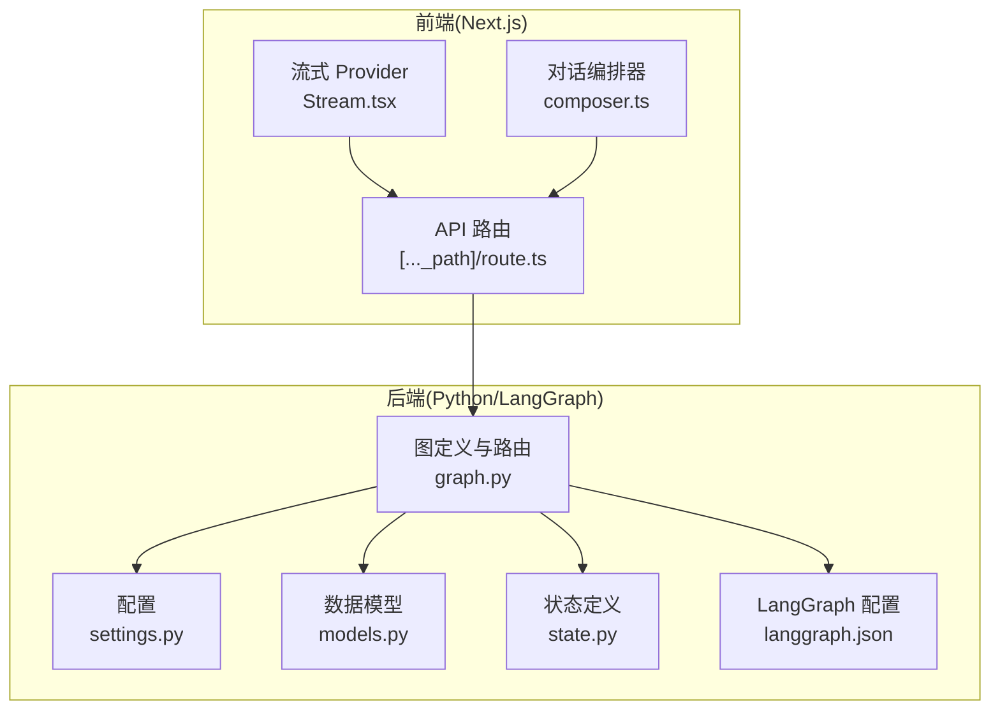
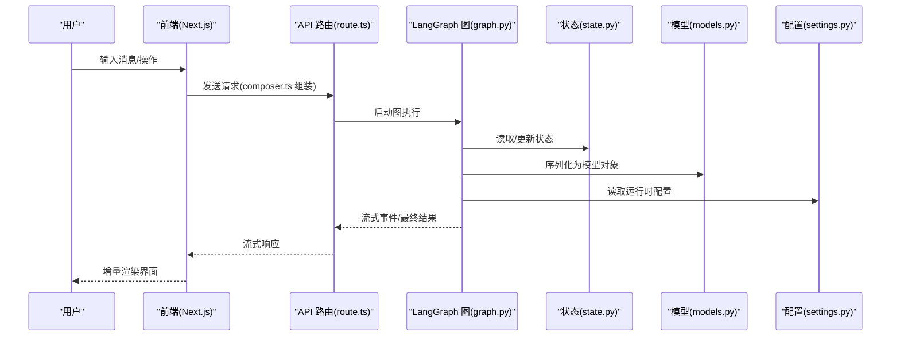
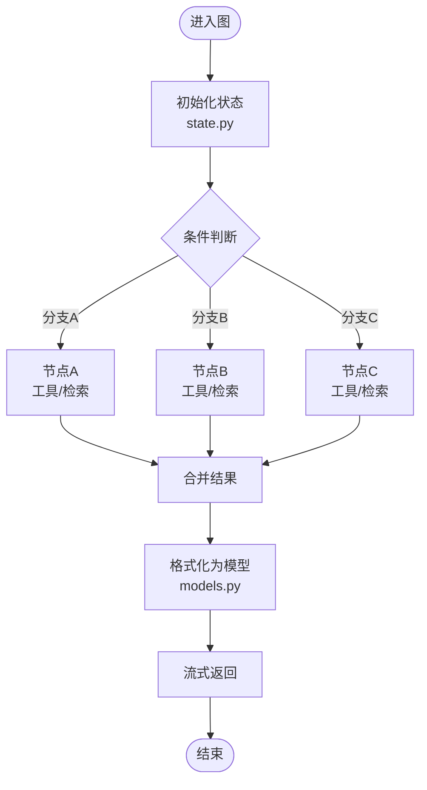
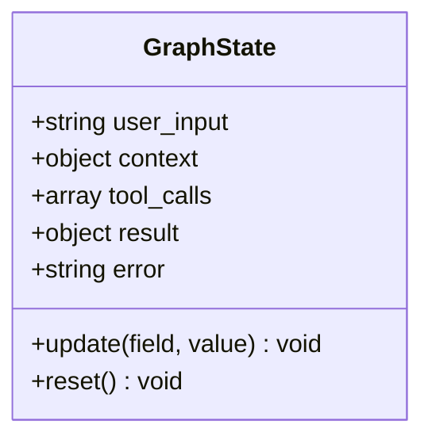
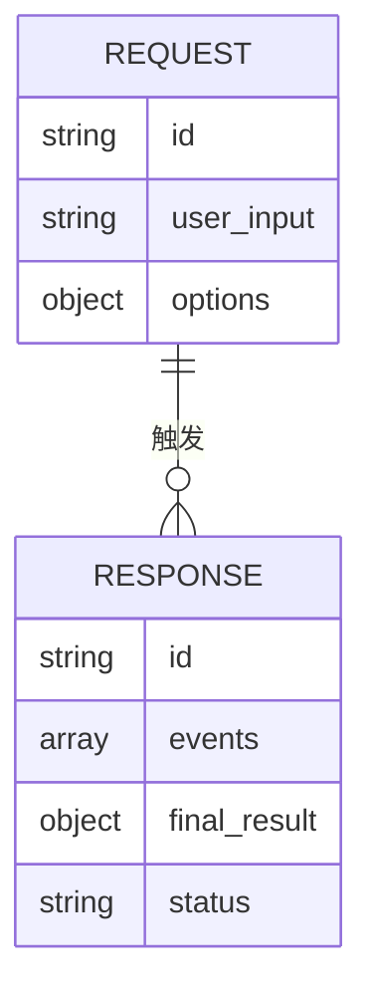
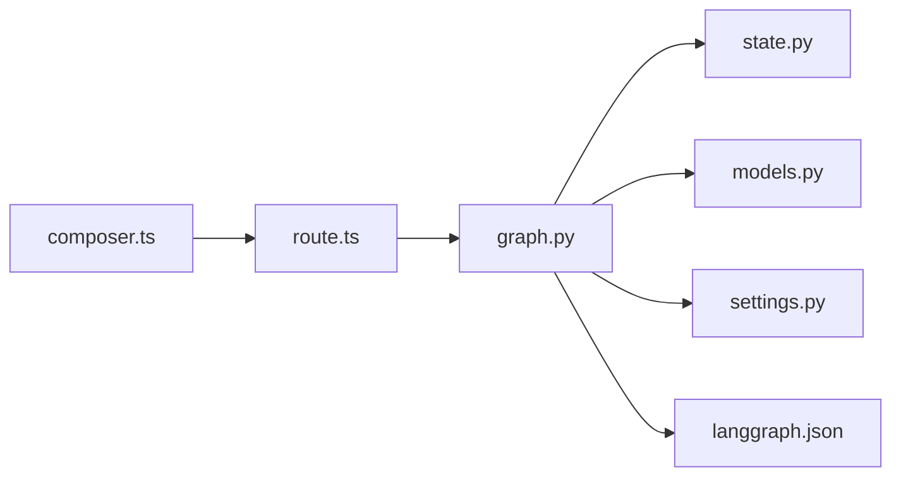

# 参谋图路由

<cite>
**本文引用的文件**   
- [apps/agent/src/lyl_agent/graph.py](file://apps/agent/src/lyl_agent/graph.py)
- [apps/agent/src/lyl_agent/state.py](file://apps/agent/src/lyl_agent/state.py)
- [apps/agent/src/lyl_agent/models.py](file://apps/agent/src/lyl_agent/models.py)
- [apps/agent/src/lyl_agent/settings.py](file://apps/agent/src/lyl_agent/settings.py)
- [apps/agent/langgraph.json](file://apps/agent/langgraph.json)
- [apps/web/src/app/api/[..._path]/route.ts](file://apps/web/src/app/api/[..._path]/route.ts)
- [apps/web/src/providers/Stream.tsx](file://apps/web/src/providers/Stream.tsx)
- [apps/web/src/lib/composer.ts](file://apps/web/src/lib/composer.ts)
- [apps/web/package.json](file://apps/web/package.json)
</cite>

## 目录
1. [简介](#简介)
2. [项目结构](#项目结构)
3. [核心组件](#核心组件)
4. [架构总览](#架构总览)
5. [详细组件分析](#详细组件分析)
6. [依赖关系分析](#依赖关系分析)
7. [性能考量](#性能考量)
8. [故障排查指南](#故障排查指南)
9. [结论](#结论)
10. [附录](#附录)

## 简介
本项目围绕“参谋图路由”展开，核心目标是将前端用户输入通过 Web 层 API 路由到后端 Agent 的 LangGraph 图执行引擎，完成状态驱动的多步推理与工具调用，并以流式方式将结果返回给前端。整体采用前后端分离架构：前端基于 Next.js，提供对话编排、消息渲染与流式展示；后端基于 Python + LangGraph，定义图节点、边与条件路由，实现可插拔的工具链与记忆能力。

## 项目结构
仓库采用 monorepo 组织，关键目录说明如下：
- apps/agent：Python 后端 Agent 服务，包含 LangGraph 图定义、状态模型、配置与测试。
- apps/web：Next.js 前端应用，包含 API 代理路由、流式 Provider、对话 Composer、UI 组件等。
- docs：产品与规格文档，涵盖总体架构、主 Agent 与 Skills、记忆检索与输出 Schema、接口工具 Prompt 与安全等。

**图表来源** 
- [apps/web/src/app/api/[..._path]/route.ts](file://apps/web/src/app/api/[..._path]/route.ts)
- [apps/web/src/providers/Stream.tsx](file://apps/web/src/providers/Stream.tsx)
- [apps/web/src/lib/composer.ts](file://apps/web/src/lib/composer.ts)
- [apps/agent/src/lyl_agent/settings.py](file://apps/agent/src/lyl_agent/settings.py)
- [apps/agent/src/lyl_agent/models.py](file://apps/agent/src/lyl_agent/models.py)
- [apps/agent/src/lyl_agent/state.py](file://apps/agent/src/lyl_agent/state.py)
- [apps/agent/src/lyl_agent/graph.py](file://apps/agent/src/lyl_agent/graph.py)
- [apps/agent/langgraph.json](file://apps/agent/langgraph.json)

**章节来源**
- [apps/web/package.json](file://apps/web/package.json)

## 核心组件
- 图定义与路由（graph.py）：集中描述节点、边、条件分支与工具调用流程，是“参谋图路由”的核心。
- 状态管理（state.py）：定义图运行时的共享状态结构与更新规则，保证多节点协作的数据一致性。
- 数据模型（models.py）：对外暴露的请求/响应模型与中间数据结构，约束前后端契约。
- 配置（settings.py）：加载环境变量与运行时参数，如模型、工具、超时、重试策略等。
- LangGraph 配置（langgraph.json）：图的元数据、版本、入口节点、序列化策略等。
- Web API 路由（route.ts）：统一接收前端请求，转发至 Agent 图执行，并处理流式响应。
- 流式 Provider（Stream.tsx）：封装 SSE/ReadableStream 消费逻辑，驱动 UI 增量渲染。
- 对话编排器（composer.ts）：组装用户输入、上下文与工具调用参数，生成标准化请求体。

**章节来源**
- [apps/agent/src/lyl_agent/graph.py](file://apps/agent/src/lyl_agent/graph.py)
- [apps/agent/src/lyl_agent/state.py](file://apps/agent/src/lyl_agent/state.py)
- [apps/agent/src/lyl_agent/models.py](file://apps/agent/src/lyl_agent/models.py)
- [apps/agent/src/lyl_agent/settings.py](file://apps/agent/src/lyl_agent/settings.py)
- [apps/agent/langgraph.json](file://apps/agent/langgraph.json)
- [apps/web/src/app/api/[..._path]/route.ts](file://apps/web/src/app/api/[..._path]/route.ts)
- [apps/web/src/providers/Stream.tsx](file://apps/web/src/providers/Stream.tsx)
- [apps/web/src/lib/composer.ts](file://apps/web/src/lib/composer.ts)

## 架构总览
下图展示了从前端到后端的端到端调用路径，以及图内关键节点的流转关系。

**图表来源** 
- [apps/web/src/lib/composer.ts](file://apps/web/src/lib/composer.ts)
- [apps/web/src/app/api/[..._path]/route.ts](file://apps/web/src/app/api/[..._path]/route.ts)
- [apps/agent/src/lyl_agent/graph.py](file://apps/agent/src/lyl_agent/graph.py)
- [apps/agent/src/lyl_agent/state.py](file://apps/agent/src/lyl_agent/state.py)
- [apps/agent/src/lyl_agent/models.py](file://apps/agent/src/lyl_agent/models.py)
- [apps/agent/src/lyl_agent/settings.py](file://apps/agent/src/lyl_agent/settings.py)

## 详细组件分析

### 图定义与路由（graph.py）
- 职责：定义图节点、边与条件路由；编排工具调用、记忆检索与输出格式化；处理中断与恢复。
- 关键点：
  - 节点间数据传递依赖 state.py 的状态字段。
  - 条件路由根据当前状态或工具返回决定下一步。
  - 错误分支需捕获异常并回写状态，确保图可恢复。
  - 与 langgraph.json 的入口节点、版本保持一致。

**图表来源** 
- [apps/agent/src/lyl_agent/graph.py](file://apps/agent/src/lyl_agent/graph.py)
- [apps/agent/src/lyl_agent/state.py](file://apps/agent/src/lyl_agent/state.py)
- [apps/agent/src/lyl_agent/models.py](file://apps/agent/src/lyl_agent/models.py)

**章节来源**
- [apps/agent/src/lyl_agent/graph.py](file://apps/agent/src/lyl_agent/graph.py)
- [apps/agent/langgraph.json](file://apps/agent/langgraph.json)

### 状态管理（state.py）
- 职责：定义图运行时的共享状态结构，包括用户输入、中间结果、工具调用上下文、错误信息等。
- 关键点：
  - 字段命名应清晰表达语义，便于调试与可视化。
  - 更新策略需幂等，避免重复计算或副作用。
  - 大对象建议分片或延迟加载，降低内存占用。

**图表来源** 
- [apps/agent/src/lyl_agent/state.py](file://apps/agent/src/lyl_agent/state.py)

**章节来源**
- [apps/agent/src/lyl_agent/state.py](file://apps/agent/src/lyl_agent/state.py)

### 数据模型（models.py）
- 职责：定义前后端交互的 JSON 结构与校验规则，确保类型安全与契约稳定。
- 关键点：
  - 输入模型需包含必要字段与可选扩展。
  - 输出模型需区分成功/失败分支，便于前端差异化渲染。
  - 对敏感字段进行脱敏或最小化暴露。

**图表来源** 
- [apps/agent/src/lyl_agent/models.py](file://apps/agent/src/lyl_agent/models.py)

**章节来源**
- [apps/agent/src/lyl_agent/models.py](file://apps/agent/src/lyl_agent/models.py)

### 配置（settings.py）
- 职责：集中管理环境变量与默认值，如模型名称、API Key、超时、重试次数、日志级别等。
- 关键点：
  - 使用强类型或枚举限制取值范围。
  - 支持开发/测试/生产环境切换。
  - 敏感信息通过环境变量注入，禁止硬编码。

**章节来源**
- [apps/agent/src/lyl_agent/settings.py](file://apps/agent/src/lyl_agent/settings.py)

### LangGraph 配置（langgraph.json）
- 职责：声明图的元数据、入口节点、序列化策略、版本控制等。
- 关键点：
  - 入口节点需与 graph.py 一致。
  - 版本变更需保持向后兼容或提供迁移脚本。
  - 序列化策略影响状态持久化与恢复效率。

**章节来源**
- [apps/agent/langgraph.json](file://apps/agent/langgraph.json)

### Web API 路由（route.ts）
- 职责：统一接收前端请求，鉴权、限流、转发至 Agent 图执行，并处理流式响应。
- 关键点：
  - 路径通配 [..._path] 用于灵活路由映射。
  - 错误码与重试策略需与后端对齐。
  - 流式传输需正确处理中断与取消。

**章节来源**
- [apps/web/src/app/api/[..._path]/route.ts](file://apps/web/src/app/api/[..._path]/route.ts)

### 流式 Provider（Stream.tsx）
- 职责：封装流式数据的消费逻辑，驱动 UI 增量渲染，处理断线重连与错误提示。
- 关键点：
  - 支持多种流协议（SSE/ReadableStream）。
  - 事件去抖与节流，避免 UI 抖动。
  - 错误边界与降级显示。

**章节来源**
- [apps/web/src/providers/Stream.tsx](file://apps/web/src/providers/Stream.tsx)

### 对话编排器（composer.ts）
- 职责：组装用户输入、上下文与工具调用参数，生成标准化的请求体。
- 关键点：
  - 支持富文本、附件等多模态输入。
  - 自动附加会话 ID、时间戳等元数据。
  - 对超长输入进行截断或摘要。

**章节来源**
- [apps/web/src/lib/composer.ts](file://apps/web/src/lib/composer.ts)

## 依赖关系分析
- 前端依赖：Next.js、React、流式库、UI 组件库。
- 后端依赖：Python、LangGraph、HTTP 框架、工具 SDK。
- 耦合点：
  - models.py 与 route.ts/composer.ts 的契约一致性。
  - state.py 与 graph.py 的状态字段同步。
  - settings.py 与 langgraph.json 的配置一致性。

**图表来源** 
- [apps/web/src/lib/composer.ts](file://apps/web/src/lib/composer.ts)
- [apps/web/src/app/api/[..._path]/route.ts](file://apps/web/src/app/api/[..._path]/route.ts)
- [apps/agent/src/lyl_agent/graph.py](file://apps/agent/src/lyl_agent/graph.py)
- [apps/agent/src/lyl_agent/state.py](file://apps/agent/src/lyl_agent/state.py)
- [apps/agent/src/lyl_agent/models.py](file://apps/agent/src/lyl_agent/models.py)
- [apps/agent/src/lyl_agent/settings.py](file://apps/agent/src/lyl_agent/settings.py)
- [apps/agent/langgraph.json](file://apps/agent/langgraph.json)

**章节来源**
- [apps/web/package.json](file://apps/web/package.json)

## 性能考量
- 流式传输：优先使用流式响应减少首屏延迟，避免一次性加载大对象。
- 状态大小：state.py 中避免存储冗余数据，必要时使用引用或懒加载。
- 工具调用：对耗时工具启用缓存、并发与超时控制。
- 前端渲染：对高频事件做节流，避免频繁重排。
- 资源复用：连接池、HTTP 客户端复用、模型实例复用。

## 故障排查指南
- 常见问题定位：
  - 图节点卡死：检查 state.py 更新是否阻塞，确认工具调用是否超时。
  - 路由不生效：核对 langgraph.json 入口节点与 graph.py 一致。
  - 流式中断：检查网络与后端流式实现是否正确处理取消信号。
  - 模型不一致：对比 models.py 与前端 composer.ts 的字段差异。
- 调试手段：
  - 开启详细日志，记录状态快照与工具输入输出。
  - 使用单元测试覆盖关键分支与异常路径。
  - 前端增加错误边界与降级提示。

**章节来源**
- [apps/agent/src/lyl_agent/graph.py](file://apps/agent/src/lyl_agent/graph.py)
- [apps/agent/src/lyl_agent/state.py](file://apps/agent/src/lyl_agent/state.py)
- [apps/agent/src/lyl_agent/models.py](file://apps/agent/src/lyl_agent/models.py)
- [apps/web/src/app/api/[..._path]/route.ts](file://apps/web/src/app/api/[..._path]/route.ts)
- [apps/web/src/providers/Stream.tsx](file://apps/web/src/providers/Stream.tsx)

## 结论
“参谋图路由”以 LangGraph 为核心，结合前后端协作实现了可扩展、可观测、可恢复的智能体工作流。通过清晰的职责划分与严格的契约约束，系统具备良好的可维护性与演进空间。后续可重点优化流式体验、状态管理与工具链性能，进一步提升用户体验与稳定性。

## 附录
- 相关规范与 PRD 参见 docs 目录，涵盖总体架构、主 Agent 与 Skills、记忆检索与输出 Schema、接口工具 Prompt 与安全等。