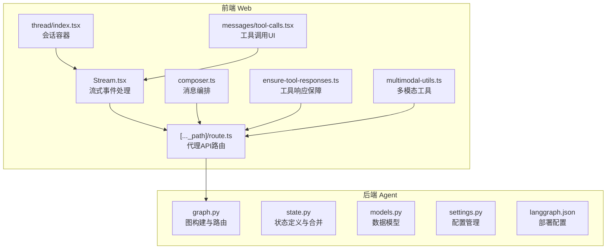
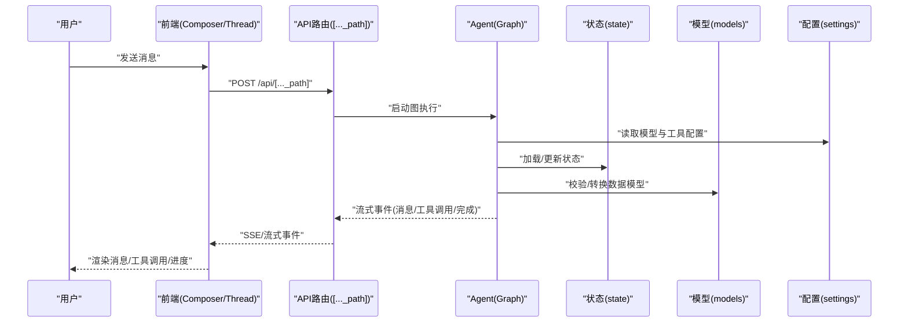
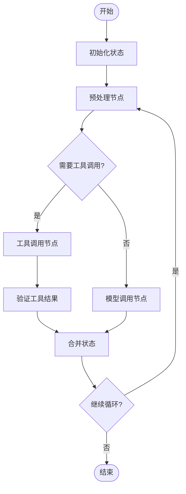
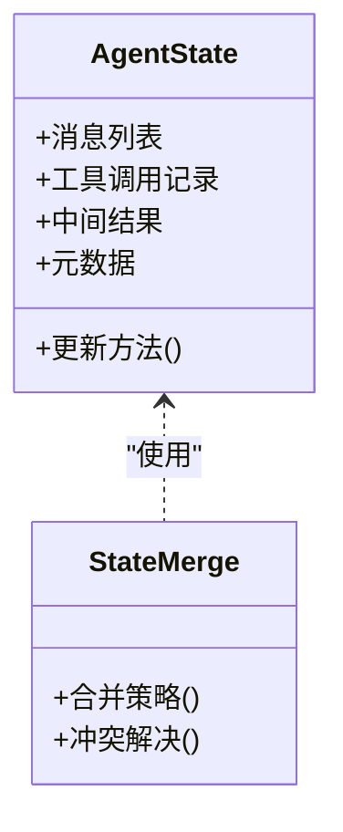
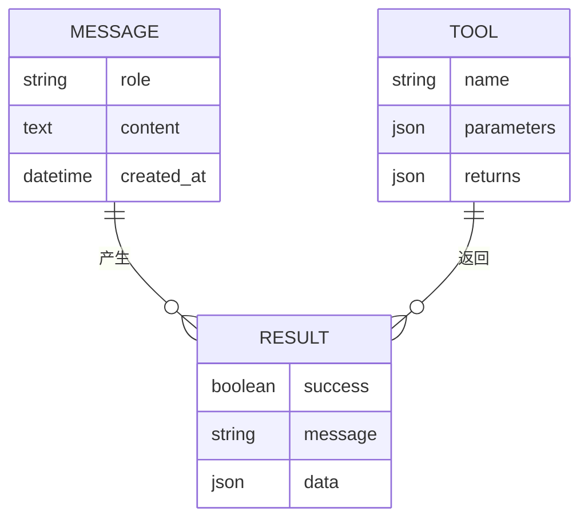
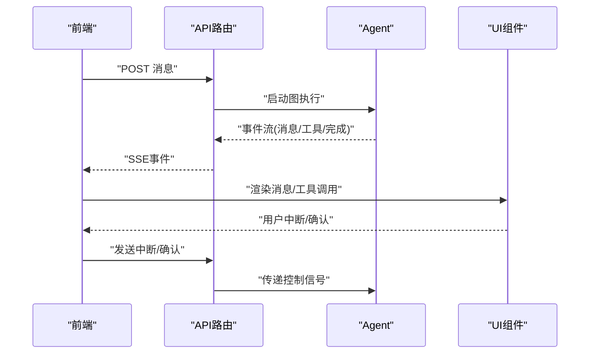
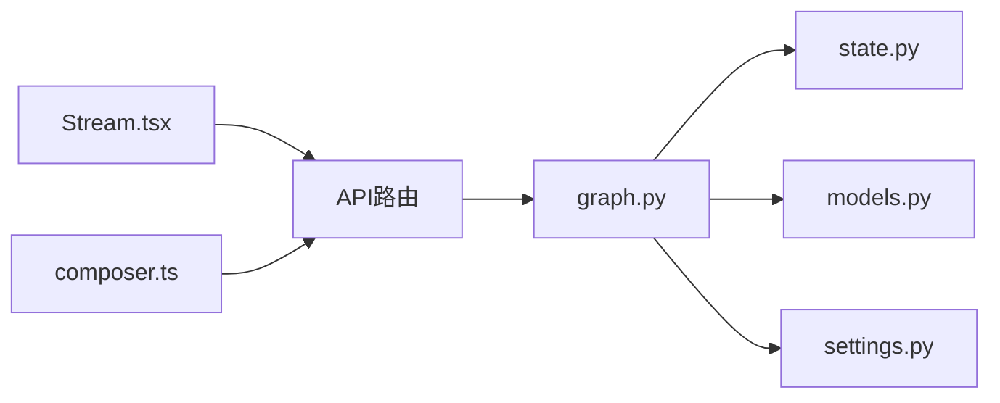

# Agent系统

<cite>
**本文引用的文件**   
- [apps/agent/src/lyl_agent/graph.py](file://apps/agent/src/lyl_agent/graph.py)
- [apps/agent/src/lyl_agent/models.py](file://apps/agent/src/lyl_agent/models.py)
- [apps/agent/src/lyl_agent/state.py](file://apps/agent/src/lyl_agent/state.py)
- [apps/agent/src/lyl_agent/settings.py](file://apps/agent/src/lyl_agent/settings.py)
- [apps/web/src/app/api/[..._path]/route.ts](file://apps/web/src/app/api/[..._path]/route.ts)
- [apps/web/src/providers/Stream.tsx](file://apps/web/src/providers/Stream.tsx)
- [apps/web/src/lib/composer.ts](file://apps/web/src/lib/composer.ts)
- [apps/web/src/components/thread/index.tsx](file://apps/web/src/components/thread/index.tsx)
- [apps/web/src/components/thread/messages/tool-calls.tsx](file://apps/web/src/components/thread/messages/tool-calls.tsx)
- [apps/web/src/lib/ensure-tool-responses.ts](file://apps/web/src/lib/ensure-tool-responses.ts)
- [apps/web/src/lib/multimodal-utils.ts](file://apps/web/src/lib/multimodal-utils.ts)
- [apps/agent/langgraph.json](file://apps/agent/langgraph.json)
- [apps/agent/pyproject.toml](file://apps/agent/pyproject.toml)
</cite>

## 目录
1. [简介](#简介)
2. [项目结构](#项目结构)
3. [核心组件](#核心组件)
4. [架构总览](#架构总览)
5. [详细组件分析](#详细组件分析)
6. [依赖关系分析](#依赖关系分析)
7. [性能考虑](#性能考虑)
8. [故障排查指南](#故障排查指南)
9. [结论](#结论)
10. [附录](#附录)

## 简介
本文件为基于 LangGraph 的 AI Agent 系统的全面技术文档。内容覆盖图结构定义、状态管理、模型配置与设置选项，深入解析 graph.py 中的图构建逻辑、节点定义与边连接；说明 models.py 的数据模型设计、state.py 的状态管理机制以及 settings.py 的配置管理。同时给出 Agent 的工作流程、消息处理机制与工具调用模式，并提供扩展 Agent 功能、添加新节点与自定义状态的实践指引。最后涵盖与 Web 前端的集成方式、API 接口、性能优化建议与调试技巧。

## 项目结构
Agent 系统采用前后端分离架构：
- 后端（Python + LangGraph）：位于 apps/agent，包含图构建、状态模型、配置与测试。
- 前端（Next.js）：位于 apps/web，提供对话界面、流式渲染、工具调用展示与中断交互。

**图表来源** 
- [apps/agent/src/lyl_agent/graph.py](file://apps/agent/src/lyl_agent/graph.py)
- [apps/agent/src/lyl_agent/state.py](file://apps/agent/src/lyl_agent/state.py)
- [apps/agent/src/lyl_agent/models.py](file://apps/agent/src/lyl_agent/models.py)
- [apps/agent/src/lyl_agent/settings.py](file://apps/agent/src/lyl_agent/settings.py)
- [apps/agent/langgraph.json](file://apps/agent/langgraph.json)
- [apps/web/src/app/api/[..._path]/route.ts](file://apps/web/src/app/api/[..._path]/route.ts)
- [apps/web/src/providers/Stream.tsx](file://apps/web/src/providers/Stream.tsx)
- [apps/web/src/lib/composer.ts](file://apps/web/src/lib/composer.ts)
- [apps/web/src/components/thread/index.tsx](file://apps/web/src/components/thread/index.tsx)
- [apps/web/src/components/thread/messages/tool-calls.tsx](file://apps/web/src/components/thread/messages/tool-calls.tsx)
- [apps/web/src/lib/ensure-tool-responses.ts](file://apps/web/src/lib/ensure-tool-responses.ts)
- [apps/web/src/lib/multimodal-utils.ts](file://apps/web/src/lib/multimodal-utils.ts)

**章节来源**
- [apps/agent/langgraph.json](file://apps/agent/langgraph.json)
- [apps/agent/pyproject.toml](file://apps/agent/pyproject.toml)

## 核心组件
- 图构建与路由（graph.py）：定义 LangGraph 的 StateGraph、节点函数、条件边与入口点，组织 Agent 的执行流。
- 状态管理（state.py）：定义状态字段、类型约束与增量更新策略，确保跨节点状态一致性。
- 数据模型（models.py）：定义消息、工具、结果等结构化类型，保证输入输出契约稳定。
- 配置管理（settings.py）：集中管理模型参数、工具开关、超时与重试等运行时配置。
- 前端集成（Web）：通过 Next.js API 路由转发请求到 Agent，使用流式事件驱动 UI 更新，并支持工具调用与中断交互。

**章节来源**
- [apps/agent/src/lyl_agent/graph.py](file://apps/agent/src/lyl_agent/graph.py)
- [apps/agent/src/lyl_agent/state.py](file://apps/agent/src/lyl_agent/state.py)
- [apps/agent/src/lyl_agent/models.py](file://apps/agent/src/lyl_agent/models.py)
- [apps/agent/src/lyl_agent/settings.py](file://apps/agent/src/lyl_agent/settings.py)
- [apps/web/src/app/api/[..._path]/route.ts](file://apps/web/src/app/api/[..._path]/route.ts)
- [apps/web/src/providers/Stream.tsx](file://apps/web/src/providers/Stream.tsx)

## 架构总览
下图展示了从用户输入到 Agent 执行再到前端渲染的整体流程，包括流式事件、工具调用与中断处理。

**图表来源** 
- [apps/web/src/app/api/[..._path]/route.ts](file://apps/web/src/app/api/[..._path]/route.ts)
- [apps/web/src/providers/Stream.tsx](file://apps/web/src/providers/Stream.tsx)
- [apps/agent/src/lyl_agent/graph.py](file://apps/agent/src/lyl_agent/graph.py)
- [apps/agent/src/lyl_agent/state.py](file://apps/agent/src/lyl_agent/state.py)
- [apps/agent/src/lyl_agent/models.py](file://apps/agent/src/lyl_agent/models.py)
- [apps/agent/src/lyl_agent/settings.py](file://apps/agent/src/lyl_agent/settings.py)

## 详细组件分析

### 图构建与路由（graph.py）
- 职责：定义 LangGraph 的 StateGraph，注册节点函数，配置条件边与入口点，组织 Agent 工作流。
- 关键点：
  - 节点函数负责具体业务步骤（如消息预处理、模型调用、工具执行、结果聚合）。
  - 条件边根据状态决定下一步分支（如是否需要工具调用、是否结束）。
  - 入口点统一由 API 路由触发，返回流式事件。
- 扩展建议：新增节点时，在图中注册并配置边；保持状态字段幂等更新，避免副作用。

**图表来源** 
- [apps/agent/src/lyl_agent/graph.py](file://apps/agent/src/lyl_agent/graph.py)

**章节来源**
- [apps/agent/src/lyl_agent/graph.py](file://apps/agent/src/lyl_agent/graph.py)

### 状态管理（state.py）
- 职责：定义状态字段、类型约束与合并策略，确保跨节点状态一致性与可追溯性。
- 关键点：
  - 状态字段应明确可选/必填，避免歧义。
  - 增量更新策略需幂等，防止重复计算或覆盖关键信息。
  - 复杂对象建议使用不可变更新模式，便于回溯与调试。
- 扩展建议：新增状态字段时，同步更新所有相关节点的写入逻辑，并在测试中覆盖边界情况。

**图表来源** 
- [apps/agent/src/lyl_agent/state.py](file://apps/agent/src/lyl_agent/state.py)

**章节来源**
- [apps/agent/src/lyl_agent/state.py](file://apps/agent/src/lyl_agent/state.py)

### 数据模型（models.py）
- 职责：定义消息、工具、结果等结构化类型，保证输入输出契约稳定。
- 关键点：
  - 消息模型区分人类/助手/系统角色，支持文本与多模态内容。
  - 工具模型描述名称、参数 schema 与返回值结构。
  - 结果模型封装成功/失败状态与错误信息。
- 扩展建议：新增模型时，确保序列化/反序列化兼容，并在 API 层进行校验。

**图表来源** 
- [apps/agent/src/lyl_agent/models.py](file://apps/agent/src/lyl_agent/models.py)

**章节来源**
- [apps/agent/src/lyl_agent/models.py](file://apps/agent/src/lyl_agent/models.py)

### 配置管理（settings.py）
- 职责：集中管理模型参数、工具开关、超时与重试等运行时配置。
- 关键点：
  - 使用环境变量或配置文件注入，避免硬编码。
  - 提供默认值与校验，确保服务稳定性。
  - 支持热重载或动态切换（视部署环境而定）。
- 扩展建议：新增配置项时，在入口处统一读取，并在日志中记录关键参数。

**章节来源**
- [apps/agent/src/lyl_agent/settings.py](file://apps/agent/src/lyl_agent/settings.py)

### 前端集成与API接口（Web）
- API 路由（[..._path]/route.ts）：接收前端请求，转发至 Agent 图执行，返回流式事件。
- 流式处理（Stream.tsx）：订阅 SSE/流式事件，实时更新 UI，支持中断与恢复。
- 消息编排（composer.ts）：组装用户输入、上下文与工具调用指令。
- 工具调用UI（tool-calls.tsx）：展示工具执行状态与结果，支持用户干预。
- 工具响应保障（ensure-tool-responses.ts）：确保工具调用有明确的完成信号，避免悬挂状态。
- 多模态工具（multimodal-utils.ts）：处理图像、音频等多模态数据的上传与解析。

**图表来源** 
- [apps/web/src/app/api/[..._path]/route.ts](file://apps/web/src/app/api/[..._path]/route.ts)
- [apps/web/src/providers/Stream.tsx](file://apps/web/src/providers/Stream.tsx)
- [apps/web/src/lib/composer.ts](file://apps/web/src/lib/composer.ts)
- [apps/web/src/components/thread/messages/tool-calls.tsx](file://apps/web/src/components/thread/messages/tool-calls.tsx)
- [apps/web/src/lib/ensure-tool-responses.ts](file://apps/web/src/lib/ensure-tool-responses.ts)
- [apps/web/src/lib/multimodal-utils.ts](file://apps/web/src/lib/multimodal-utils.ts)

**章节来源**
- [apps/web/src/app/api/[..._path]/route.ts](file://apps/web/src/app/api/[..._path]/route.ts)
- [apps/web/src/providers/Stream.tsx](file://apps/web/src/providers/Stream.tsx)
- [apps/web/src/lib/composer.ts](file://apps/web/src/lib/composer.ts)
- [apps/web/src/components/thread/index.tsx](file://apps/web/src/components/thread/index.tsx)
- [apps/web/src/components/thread/messages/tool-calls.tsx](file://apps/web/src/components/thread/messages/tool-calls.tsx)
- [apps/web/src/lib/ensure-tool-responses.ts](file://apps/web/src/lib/ensure-tool-responses.ts)
- [apps/web/src/lib/multimodal-utils.ts](file://apps/web/src/lib/multimodal-utils.ts)

## 依赖关系分析
- 模块耦合：
  - graph.py 依赖 state.py、models.py、settings.py。
  - Web API 路由依赖 Stream.tsx、composer.ts 等前端库。
- 外部依赖：
  - LangGraph：图执行引擎。
  - Next.js：前端框架与API路由。
- 潜在循环依赖：
  - 确保状态与模型定义不反向依赖图逻辑。

**图表来源** 
- [apps/agent/src/lyl_agent/graph.py](file://apps/agent/src/lyl_agent/graph.py)
- [apps/agent/src/lyl_agent/state.py](file://apps/agent/src/lyl_agent/state.py)
- [apps/agent/src/lyl_agent/models.py](file://apps/agent/src/lyl_agent/models.py)
- [apps/agent/src/lyl_agent/settings.py](file://apps/agent/src/lyl_agent/settings.py)
- [apps/web/src/app/api/[..._path]/route.ts](file://apps/web/src/app/api/[..._path]/route.ts)
- [apps/web/src/providers/Stream.tsx](file://apps/web/src/providers/Stream.tsx)
- [apps/web/src/lib/composer.ts](file://apps/web/src/lib/composer.ts)

**章节来源**
- [apps/agent/pyproject.toml](file://apps/agent/pyproject.toml)

## 性能考虑
- 流式处理：优先使用流式事件减少首屏延迟，避免一次性大响应。
- 状态合并：采用增量更新与幂等操作，降低内存占用与计算开销。
- 工具调用：批量执行与缓存热点结果，减少重复调用。
- 模型配置：合理设置超时与重试次数，避免雪崩效应。
- 前端渲染：虚拟滚动与懒加载长列表，提升交互流畅度。

## 故障排查指南
- 常见问题：
  - 状态不一致：检查状态合并逻辑与节点写入顺序。
  - 工具调用悬挂：确保 ensure-tool-responses.ts 正确捕获完成信号。
  - 流式中断：验证 Stream.tsx 的事件订阅与取消逻辑。
- 调试技巧：
  - 在 graph.py 中添加节点级日志，记录输入/输出状态。
  - 使用 langgraph.json 启用调试模式，查看执行轨迹。
  - 前端打开开发者工具，监控网络事件与状态变化。

**章节来源**
- [apps/web/src/lib/ensure-tool-responses.ts](file://apps/web/src/lib/ensure-tool-responses.ts)
- [apps/web/src/providers/Stream.tsx](file://apps/web/src/providers/Stream.tsx)
- [apps/agent/langgraph.json](file://apps/agent/langgraph.json)

## 结论
本系统以 LangGraph 为核心，结合清晰的状态管理与数据模型，实现了可扩展、可观测的 AI Agent 架构。前端通过流式事件与工具调用 UI，提供了良好的用户体验。建议在扩展新功能时遵循状态幂等、配置外置与错误可恢复原则，持续优化性能与可维护性。

## 附录
- 扩展 Agent 功能示例：
  - 添加新节点：在 graph.py 中定义节点函数，注册到 StateGraph，并配置边。
  - 自定义状态：在 state.py 中新增字段，更新所有相关节点的写入逻辑。
  - 集成新工具：在 models.py 中定义工具 schema，在 graph.py 中实现调用逻辑。
- API 接口规范：
  - 路径：/api/[..._path]
  - 方法：POST
  - 请求体：消息、上下文、工具调用指令
  - 响应：流式事件（消息、工具调用、完成、错误）