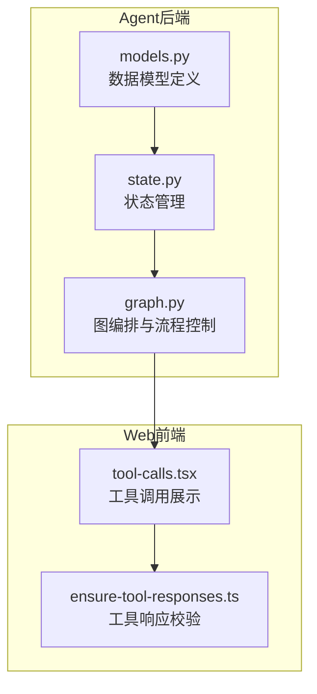
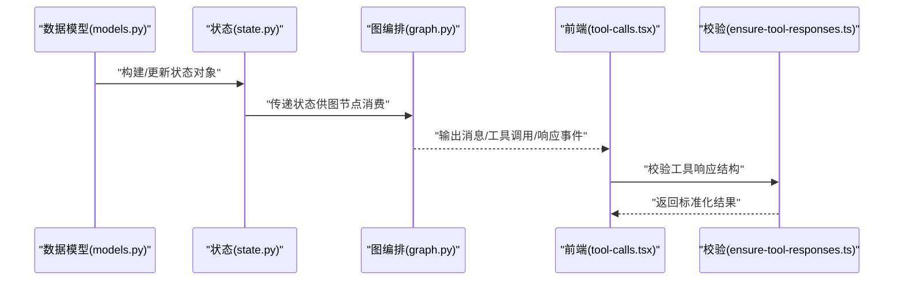
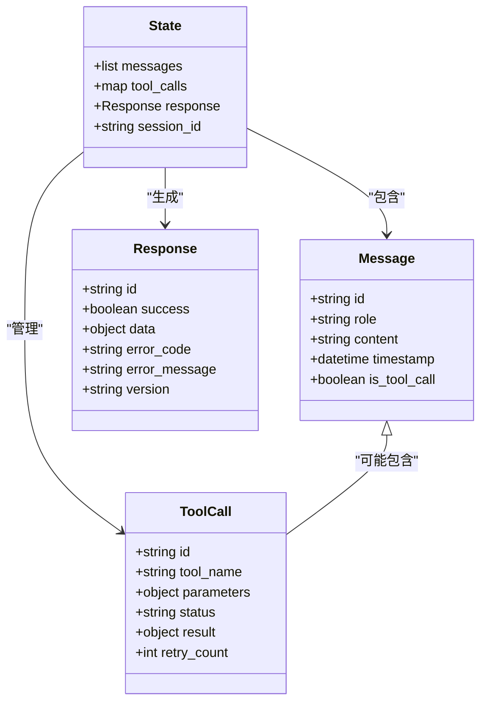

# 数据模型定义

<cite>
**本文引用的文件**   
- [apps/agent/src/lyl_agent/models.py](file://apps/agent/src/lyl_agent/models.py)
- [apps/agent/src/lyl_agent/state.py](file://apps/agent/src/lyl_agent/state.py)
- [apps/agent/src/lyl_agent/graph.py](file://apps/agent/src/lyl_agent/graph.py)
- [apps/web/src/components/thread/messages/tool-calls.tsx](file://apps/web/src/components/thread/messages/tool-calls.tsx)
- [apps/web/src/lib/ensure-tool-responses.ts](file://apps/web/src/lib/ensure-tool-responses.ts)
</cite>

## 目录
1. [简介](#简介)
2. [项目结构](#项目结构)
3. [核心组件](#核心组件)
4. [架构总览](#架构总览)
5. [详细组件分析](#详细组件分析)
6. [依赖关系分析](#依赖关系分析)
7. [性能考量](#性能考量)
8. [故障排查指南](#故障排查指南)
9. [结论](#结论)
10. [附录](#附录)

## 简介
本章节面向Agent数据模型，聚焦于Python端的数据结构与序列化/反序列化、验证与错误处理、版本兼容策略，以及与前端展示和工具调用链路的对接。文档将围绕以下目标展开：
- 全面解释models.py中的数据模型设计，包括实体类、字段属性与关系映射
- 深入分析消息模型、工具调用模型、响应模型等核心数据结构的设计原则与约束规则
- 说明序列化/反序列化处理、验证规则和错误处理机制
- 提供版本兼容性管理与向后兼容策略
- 给出扩展数据模型、添加新字段与实现自定义验证逻辑的具体示例路径
- 解释与数据库存储的映射关系与查询优化方案（如适用）

## 项目结构
本项目采用前后端分离的组织方式：
- Python Agent侧：位于 apps/agent/src/lyl_agent，包含图编排、状态管理、数据模型定义等
- Web前端侧：位于 apps/web，包含对话历史、消息渲染、工具调用展示与交互逻辑

图表来源 
- [apps/agent/src/lyl_agent/models.py](file://apps/agent/src/lyl_agent/models.py)
- [apps/agent/src/lyl_agent/state.py](file://apps/agent/src/lyl_agent/state.py)
- [apps/agent/src/lyl_agent/graph.py](file://apps/agent/src/lyl_agent/graph.py)
- [apps/web/src/components/thread/messages/tool-calls.tsx](file://apps/web/src/components/thread/messages/tool-calls.tsx)
- [apps/web/src/lib/ensure-tool-responses.ts](file://apps/web/src/lib/ensure-tool-responses.ts)

章节来源
- [apps/agent/src/lyl_agent/models.py](file://apps/agent/src/lyl_agent/models.py)
- [apps/agent/src/lyl_agent/state.py](file://apps/agent/src/lyl_agent/state.py)
- [apps/agent/src/lyl_agent/graph.py](file://apps/agent/src/lyl_agent/graph.py)
- [apps/web/src/components/thread/messages/tool-calls.tsx](file://apps/web/src/components/thread/messages/tool-calls.tsx)
- [apps/web/src/lib/ensure-tool-responses.ts](file://apps/web/src/lib/ensure-tool-responses.ts)

## 核心组件
本节对Agent数据模型的核心组件进行概览性说明，重点包括：
- 实体类与字段属性：用于表达消息、工具调用、响应等关键业务对象
- 关系映射：实体之间的关联与嵌套结构
- 序列化/反序列化：JSON或结构化数据的转换与校验
- 验证与错误处理：输入合法性检查与异常处理策略
- 版本兼容：字段演进与向后兼容策略

章节来源
- [apps/agent/src/lyl_agent/models.py](file://apps/agent/src/lyl_agent/models.py)
- [apps/agent/src/lyl_agent/state.py](file://apps/agent/src/lyl_agent/state.py)

## 架构总览
下图展示了从Agent数据模型到前端展示的端到端数据流，以及工具调用与响应的处理链路。

图表来源 
- [apps/agent/src/lyl_agent/models.py](file://apps/agent/src/lyl_agent/models.py)
- [apps/agent/src/lyl_agent/state.py](file://apps/agent/src/lyl_agent/state.py)
- [apps/agent/src/lyl_agent/graph.py](file://apps/agent/src/lyl_agent/graph.py)
- [apps/web/src/components/thread/messages/tool-calls.tsx](file://apps/web/src/components/thread/messages/tool-calls.tsx)
- [apps/web/src/lib/ensure-tool-responses.ts](file://apps/web/src/lib/ensure-tool-responses.ts)

## 详细组件分析

### 数据模型类与字段属性
- 实体类设计原则
  - 单一职责：每个类聚焦一个业务概念（如消息、工具调用、响应）
  - 明确字段类型：使用强类型字段减少歧义，便于序列化与校验
  - 可选字段与默认值：通过可选字段支持渐进式演进
  - 不可变性优先：在可能的情况下使用不可变结构，降低副作用
- 字段属性建议
  - 必填字段：标识主键、时间戳、类型码等
  - 可选字段：扩展能力、降级回退信息
  - 枚举字段：限制取值范围，提升稳定性
  - 嵌套结构：合理组织复杂对象，避免过深层级

章节来源
- [apps/agent/src/lyl_agent/models.py](file://apps/agent/src/lyl_agent/models.py)

### 消息模型
- 设计要点
  - 角色区分：用户、助手、系统等不同角色的消息体
  - 内容结构：文本、富媒体、结构化内容的统一表示
  - 元数据：时间戳、会话ID、追踪ID等
  - 状态标记：是否已读、是否被截断、是否含工具调用
- 约束规则
  - 非空校验：角色、内容、时间戳等关键字段
  - 长度限制：防止过大负载影响传输与渲染
  - 格式校验：富媒体URL有效性、编码规范

章节来源
- [apps/agent/src/lyl_agent/models.py](file://apps/agent/src/lyl_agent/models.py)

### 工具调用模型
- 设计要点
  - 调用上下文：工具名称、参数、调用者、时间戳
  - 执行状态：待执行、执行中、成功、失败
  - 结果结构：标准化返回体，包含数据与错误信息
  - 重试策略：最大重试次数、退避策略
- 约束规则
  - 参数白名单：严格校验工具参数类型与取值范围
  - 幂等性：相同请求多次调用应产生一致结果
  - 超时控制：设置合理的超时阈值与熔断策略

章节来源
- [apps/agent/src/lyl_agent/models.py](file://apps/agent/src/lyl_agent/models.py)
- [apps/web/src/components/thread/messages/tool-calls.tsx](file://apps/web/src/components/thread/messages/tool-calls.tsx)

### 响应模型
- 设计要点
  - 统一响应结构：成功标志、数据体、错误码、错误信息
  - 分页与游标：大数据集的分页支持
  - 版本信息：API版本、字段弃用提示
  - 扩展字段：预留扩展点，支持未来功能增强
- 约束规则
  - 错误码规范：HTTP语义化错误码与业务错误码分离
  - 日志关联：错误信息需包含可追踪的上下文
  - 安全过滤：敏感信息脱敏处理

章节来源
- [apps/agent/src/lyl_agent/models.py](file://apps/agent/src/lyl_agent/models.py)
- [apps/web/src/lib/ensure-tool-responses.ts](file://apps/web/src/lib/ensure-tool-responses.ts)

### 序列化与反序列化
- 序列化策略
  - JSON优先：通用性强，易于跨语言交换
  - 字段映射：驼峰命名与下划线命名的自动转换
  - 日期时间：统一ISO8601格式
  - 二进制数据：Base64编码或外部引用
- 反序列化策略
  - 严格模式：未知字段拒绝解析
  - 宽松模式：忽略未知字段，保证向前兼容
  - 默认值填充：缺失字段使用默认值
- 性能优化
  - 懒加载：大对象按需加载
  - 增量更新：仅序列化变更字段
  - 缓存策略：热点数据序列化结果缓存

章节来源
- [apps/agent/src/lyl_agent/models.py](file://apps/agent/src/lyl_agent/models.py)

### 验证规则与错误处理
- 验证规则
  - 基础验证：类型、长度、格式、范围
  - 业务验证：唯一性、关联性、状态机约束
  - 安全验证：注入防护、权限校验、速率限制
- 错误处理
  - 错误分类：参数错误、业务错误、系统错误
  - 错误传播：向上抛出，向下捕获
  - 错误恢复：重试、降级、补偿
- 调试支持
  - 详细日志：记录验证失败原因
  - 堆栈跟踪：定位问题根源
  - 监控告警：关键错误实时告警

章节来源
- [apps/agent/src/lyl_agent/models.py](file://apps/agent/src/lyl_agent/models.py)

### 版本兼容性与向后兼容策略
- 版本管理
  - API版本控制：URL路径或请求头中的版本标识
  - 字段版本：版本号字段，支持多版本并存
  - 弃用策略：逐步废弃旧字段，提供迁移指南
- 向后兼容
  - 新增字段：默认值为None或空集合
  - 删除字段：保留占位符，记录弃用警告
  - 类型变更：支持多种类型的输入，内部统一转换
- 迁移策略
  - 数据迁移脚本：自动化字段迁移
  - 灰度发布：小流量验证新版本
  - 回滚机制：快速回退到稳定版本

章节来源
- [apps/agent/src/lyl_agent/models.py](file://apps/agent/src/lyl_agent/models.py)

### 扩展数据模型的实践指南
- 添加新字段
  - 在模型类中声明新字段，设置合适的默认值
  - 更新序列化器以支持新字段的编解码
  - 添加相应的验证规则
  - 更新测试用例覆盖新字段
- 实现自定义验证
  - 继承基类验证器，重写验证方法
  - 组合多个验证器，形成验证链
  - 异步验证：支持网络请求等耗时操作
- 最佳实践
  - 保持向后兼容：新增字段不影响现有功能
  - 文档同步：及时更新API文档
  - 监控指标：跟踪新字段的使用情况

章节来源
- [apps/agent/src/lyl_agent/models.py](file://apps/agent/src/lyl_agent/models.py)

### 数据库存储映射与查询优化
- 表结构设计
  - 一对一映射：简单字段直接对应列
  - 一对多关系：外键关联或JSON字段存储
  - 多对多关系：中间表或数组字段
- 索引策略
  - 主键索引：加速主键查询
  - 复合索引：优化多条件查询
  - 全文索引：支持文本搜索
- 查询优化
  - N+1问题：使用JOIN或批量查询
  - 分页查询：限制返回数据量
  - 缓存层：Redis缓存热点数据
- 数据一致性
  - 事务管理：保证数据原子性
  - 乐观锁：版本号控制并发更新
  - 最终一致性：异步任务保证一致性

章节来源
- [apps/agent/src/lyl_agent/models.py](file://apps/agent/src/lyl_agent/models.py)

## 依赖关系分析
数据模型之间的依赖关系如下：

图表来源 
- [apps/agent/src/lyl_agent/models.py](file://apps/agent/src/lyl_agent/models.py)
- [apps/agent/src/lyl_agent/state.py](file://apps/agent/src/lyl_agent/state.py)

章节来源
- [apps/agent/src/lyl_agent/models.py](file://apps/agent/src/lyl_agent/models.py)
- [apps/agent/src/lyl_agent/state.py](file://apps/agent/src/lyl_agent/state.py)

## 性能考量
- 内存使用
  - 对象池：复用频繁创建的对象
  - 延迟初始化：按需加载大对象
  - 垃圾回收：及时释放不再使用的对象
- I/O优化
  - 连接池：数据库连接复用
  - 批量操作：合并多次I/O操作
  - 异步处理：非阻塞I/O操作
- 计算优化
  - 算法复杂度：选择更高效的算法
  - 并行计算：利用多核CPU
  - 缓存策略：LRU缓存热点数据

## 故障排查指南
- 常见问题
  - 序列化失败：检查字段类型和格式
  - 验证错误：查看具体的验证规则
  - 性能问题：分析慢查询和内存使用
- 调试技巧
  - 日志分析：查看详细的错误日志
  - 单元测试：隔离问题模块
  - 性能分析：使用 profiling 工具
- 预防措施
  - 代码审查：发现潜在问题
  - 自动化测试：回归测试保障质量
  - 监控告警：及时发现异常

## 结论
本文档详细介绍了Agent数据模型的设计与实现，涵盖了从数据结构定义到序列化验证、从版本兼容到性能优化的各个方面。通过遵循本文档的指导原则和实践建议，可以构建出健壮、可扩展且高性能的数据模型系统。

## 附录
- 相关文档链接
- 术语表
- 参考资源