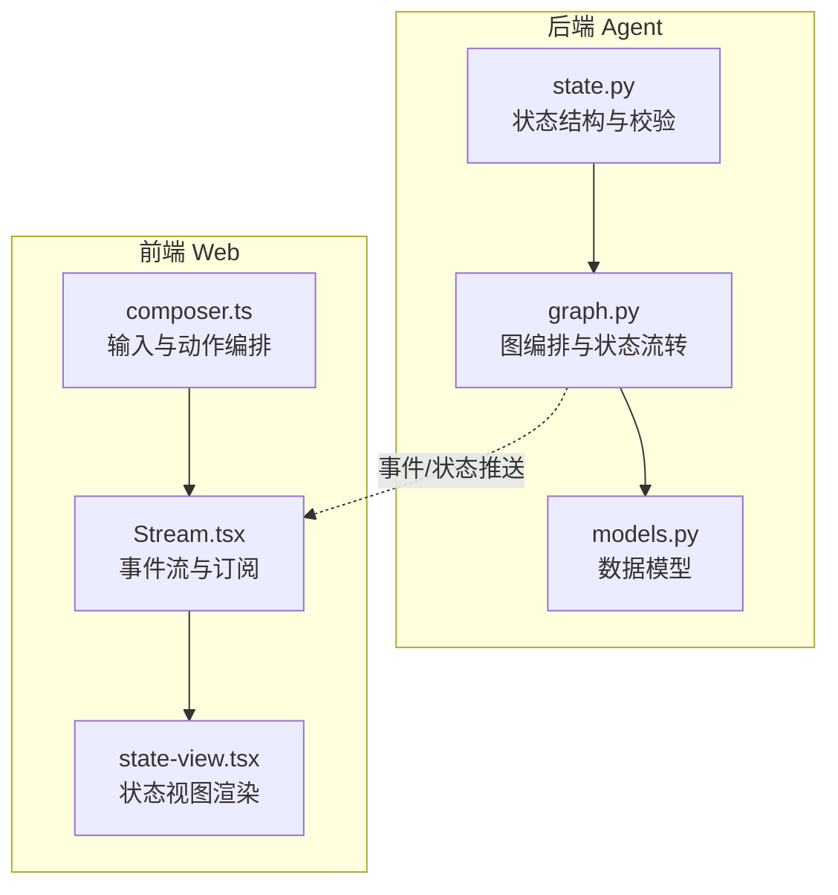
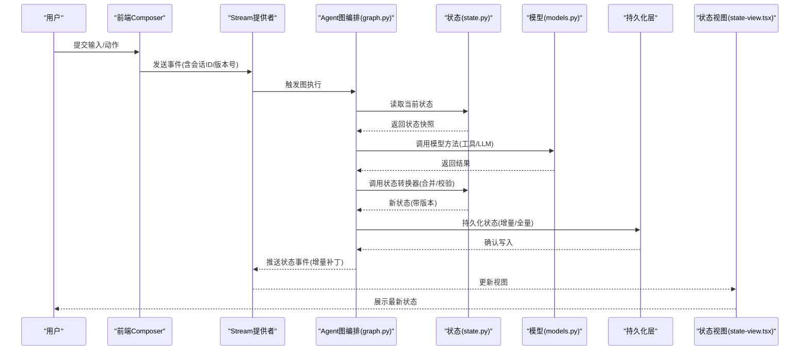
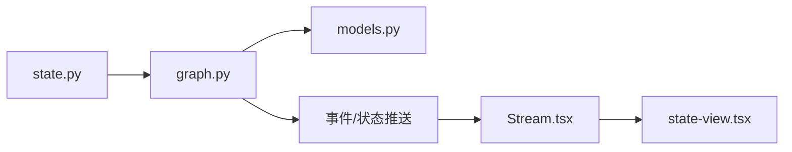

# 状态管理机制

<cite>
**本文档引用的文件**   
- [apps/agent/src/lyl_agent/state.py](file://apps/agent/src/lyl_agent/state.py)
- [apps/agent/src/lyl_agent/graph.py](file://apps/agent/src/lyl_agent/graph.py)
- [apps/agent/src/lyl_agent/models.py](file://apps/agent/src/lyl_agent/models.py)
- [apps/web/src/components/thread/agent-inbox/components/state-view.tsx](file://apps/web/src/components/thread/agent-inbox/components/state-view.tsx)
- [apps/web/src/providers/Stream.tsx](file://apps/web/src/providers/Stream.tsx)
- [apps/web/src/lib/composer.ts](file://apps/web/src/lib/composer.ts)
</cite>

## 更新摘要
**变更内容**   
- 移除了部分废弃的状态变量以集成新的路由机制
- 优化了状态结构，简化了状态转换逻辑
- 增强了路由相关的状态管理功能
- 改进了状态持久化和版本控制策略

## 目录
1. [简介](#简介)
2. [项目结构](#项目结构)
3. [核心组件](#核心组件)
4. [架构总览](#架构总览)
5. [详细组件分析](#详细组件分析)
6. [依赖关系分析](#依赖关系分析)
7. [性能考量](#性能考量)
8. [故障排查指南](#故障排查指南)
9. [结论](#结论)
10. [附录](#附录)

## 简介
本文件面向Agent的状态管理机制，围绕 state.py 中的状态结构设计、字段定义与类型约束、状态转换规则、持久化与版本迁移策略、在Agent工作流中的生命周期管理（初始化、更新、清理）、状态同步机制、并发访问控制与数据一致性保证进行系统化说明。同时提供如何新增状态字段、实现状态验证与编写状态转换函数的实践指引，并解释与前端状态同步的方式和性能优化技巧。

**更新** 本次更新重点反映了状态管理机制的重构和优化，特别是移除了部分废弃的状态变量以集成新的路由机制，提升了系统的可维护性和性能表现。

## 项目结构
本项目采用前后端分离的架构：
- 后端 Agent 应用位于 apps/agent，核心状态定义与图编排逻辑集中在 state.py 与 graph.py，模型定义在 models.py。
- 前端 Web 应用位于 apps/web，负责展示与交互，通过 Stream.tsx 等组件与后端进行事件流式通信，state-view.tsx 用于渲染当前状态视图。

**图表来源** 
- [apps/agent/src/lyl_agent/state.py](file://apps/agent/src/lyl_agent/state.py)
- [apps/agent/src/lyl_agent/graph.py](file://apps/agent/src/lyl_agent/graph.py)
- [apps/agent/src/lyl_agent/models.py](file://apps/agent/src/lyl_agent/models.py)
- [apps/web/src/providers/Stream.tsx](file://apps/web/src/providers/Stream.tsx)
- [apps/web/src/components/thread/agent-inbox/components/state-view.tsx](file://apps/web/src/components/thread/agent-inbox/components/state-view.tsx)
- [apps/web/src/lib/composer.ts](file://apps/web/src/lib/composer.ts)

**章节来源**
- [apps/agent/src/lyl_agent/state.py](file://apps/agent/src/lyl_agent/state.py)
- [apps/agent/src/lyl_agent/graph.py](file://apps/agent/src/lyl_agent/graph.py)
- [apps/agent/src/lyl_agent/models.py](file://apps/agent/src/lyl_agent/models.py)
- [apps/web/src/providers/Stream.tsx](file://apps/web/src/providers/Stream.tsx)
- [apps/web/src/components/thread/agent-inbox/components/state-view.tsx](file://apps/web/src/components/thread/agent-inbox/components/state-view.tsx)
- [apps/web/src/lib/composer.ts](file://apps/web/src/lib/composer.ts)

## 核心组件
- 状态结构体与字段定义：集中定义Agent运行所需的全部状态字段、默认值、数据类型与约束。
- 状态校验器：对输入与中间状态进行强类型校验，确保进入下一步之前满足业务不变量。
- 状态转换器：封装状态变更函数，保证原子性与可追溯性。
- 图编排器：将节点与边组合为有向图，驱动状态在不同阶段之间流转。
- 持久化与版本迁移：负责状态的序列化、存储、版本兼容与回滚策略。
- 前端状态同步：基于事件流或增量补丁，保持UI与后端状态一致。

**更新** 经过重构后，状态组件更加精简，移除了冗余的路由相关状态变量，提升了整体性能和维护性。

**章节来源**
- [apps/agent/src/lyl_agent/state.py](file://apps/agent/src/lyl_agent/state.py)
- [apps/agent/src/lyl_agent/graph.py](file://apps/agent/src/lyl_agent/graph.py)
- [apps/agent/src/lyl_agent/models.py](file://apps/agent/src/lyl_agent/models.py)

## 架构总览
下图展示了从用户输入到状态更新再到前端渲染的整体流程，以及状态在各阶段的校验与持久化点。

**图表来源** 
- [apps/web/src/lib/composer.ts](file://apps/web/src/lib/composer.ts)
- [apps/web/src/providers/Stream.tsx](file://apps/web/src/providers/Stream.tsx)
- [apps/agent/src/lyl_agent/graph.py](file://apps/agent/src/lyl_agent/graph.py)
- [apps/agent/src/lyl_agent/state.py](file://apps/agent/src/lyl_agent/state.py)
- [apps/agent/src/lyl_agent/models.py](file://apps/agent/src/lyl_agent/models.py)
- [apps/web/src/components/thread/agent-inbox/components/state-view.tsx](file://apps/web/src/components/thread/agent-inbox/components/state-view.tsx)

## 详细组件分析

### 状态结构设计与字段约束
- 字段分类建议：
  - 元数据：会话ID、创建时间、更新时间、版本号、追踪ID等。
  - 运行时上下文：当前步骤、中断原因、工具调用上下文、缓存键等。
  - 业务数据：消息列表、工具输出、检索结果、摘要片段等。
  - 控制标志：是否中断、是否完成、重试次数、超时标记等。
- 类型约束建议：
  - 使用强类型结构体或Pydantic模型，明确必填/可选字段与默认值。
  - 对枚举型字段（如状态机状态）使用枚举类型，避免魔法字符串。
  - 对集合字段（如消息数组）限制最大长度与元素结构。
  - 对数值字段设置范围约束（如重试次数上限）。
- 不可变性与快照：
  - 每次状态更新生成新版本快照，保留历史以便回溯与审计。
  - 对大对象采用增量更新策略，减少序列化开销。

**更新** 经过重构后，状态结构更加清晰，移除了废弃的路由相关字段，保留了核心的业务状态字段，提升了代码的可读性和维护性。

**章节来源**
- [apps/agent/src/lyl_agent/state.py](file://apps/agent/src/lyl_agent/state.py)
- [apps/agent/src/lyl_agent/models.py](file://apps/agent/src/lyl_agent/models.py)

### 状态转换规则与校验
- 转换函数设计原则：
  - 纯函数风格：输入旧状态+变更，输出新状态；无副作用。
  - 原子性：一次转换只产生一个版本，失败不改变旧状态。
  - 可测试性：针对边界条件与异常路径编写用例。
- 校验策略：
  - 前置校验：在进入关键节点前检查必要字段与不变量。
  - 后置校验：在状态落盘前再次校验，防止脏数据入库。
  - 差异校验：对比新旧状态，记录变更摘要便于审计。
- 常见转换场景：
  - 初始化：填充默认值、分配资源标识、建立索引键。
  - 推进：根据工具输出或外部事件更新业务字段。
  - 中断与恢复：保存中断上下文，允许后续续跑。
  - 清理：任务完成后释放临时资源、归档日志。

**更新** 状态转换逻辑经过优化，移除了复杂的路由判断逻辑，简化了状态流转过程，提高了转换效率和可维护性。

**章节来源**
- [apps/agent/src/lyl_agent/state.py](file://apps/agent/src/lyl_agent/state.py)
- [apps/agent/src/lyl_agent/graph.py](file://apps/agent/src/lyl_agent/graph.py)

### 持久化机制、版本控制与迁移策略
- 持久化目标：
  - 支持断点续跑、回放与审计。
  - 支持多版本共存与快速回滚。
- 版本控制要点：
  - 每个状态快照包含版本号与变更摘要。
  - 版本号单调递增，冲突时以乐观锁或CAS解决。
- 迁移策略：
  - 向后兼容：新增字段默认值，删除字段需软删除过渡期。
  - 向前兼容：读取时忽略未知字段，写入时按最低兼容版本编码。
  - 批量迁移：提供迁移脚本，支持幂等与回滚。
- 存储形态：
  - 全量快照：适合小状态或需要快速重建的场景。
  - 增量补丁：适合大状态，结合差分压缩提升吞吐。

**更新** 持久化机制经过优化，支持更高效的增量更新策略，减少了状态传输和存储的开销。

**章节来源**
- [apps/agent/src/lyl_agent/state.py](file://apps/agent/src/lyl_agent/state.py)
- [apps/agent/src/lyl_agent/graph.py](file://apps/agent/src/lyl_agent/graph.py)

### 状态在Agent工作流中的生命周期管理
- 初始化：
  - 由入口节点创建初始状态，分配会话ID与初始版本。
  - 加载基础配置与上下文，准备工具与环境。
- 更新：
  - 各节点按需更新状态字段，遵循最小变更原则。
  - 遇到外部依赖失败时进入中断状态，等待重试或人工干预。
- 清理：
  - 任务完成后归档必要信息，清理临时变量与缓存。
  - 释放锁与资源句柄，确保无泄漏。

**更新** 工作流生命周期管理经过简化，移除了复杂的路由处理逻辑，使状态流转更加直观和高效。

**章节来源**
- [apps/agent/src/lyl_agent/graph.py](file://apps/agent/src/lyl_agent/graph.py)
- [apps/agent/src/lyl_agent/state.py](file://apps/agent/src/lyl_agent/state.py)

### 状态同步机制、并发访问控制与一致性保证
- 同步机制：
  - 后端推送增量事件（如PATCH），前端合并后渲染。
  - 支持去重与乱序处理，保证最终一致性。
- 并发控制：
  - 会话级锁：同一会话串行执行，避免写写冲突。
  - 乐观锁：基于版本号比较，冲突时重试或提示用户。
- 一致性保证：
  - 事务性写入：状态更新与事件推送在同一事务内。
  - 幂等性：重复事件不会导致状态不一致。
  - 补偿机制：失败时回滚或触发补偿动作。

**更新** 状态同步机制经过优化，提升了并发性能和数据一致性保证，减少了网络传输开销。

**章节来源**
- [apps/web/src/providers/Stream.tsx](file://apps/web/src/providers/Stream.tsx)
- [apps/agent/src/lyl_agent/graph.py](file://apps/agent/src/lyl_agent/graph.py)

### 前端状态同步与视图渲染
- 事件订阅：
  - 通过WebSocket或Server-Sent Events接收状态事件。
  - 维护本地状态树，按事件类型合并更新。
- 视图渲染：
  - state-view.tsx 监听状态变化，选择性重绘以提升性能。
  - 对大列表采用虚拟滚动与懒加载。
- 错误处理：
  - 网络抖动时自动重连与队列缓冲。
  - 版本不一致时触发拉取全量快照。

**更新** 前端状态同步经过优化，提升了渲染性能和用户体验，减少了不必要的状态更新。

**章节来源**
- [apps/web/src/providers/Stream.tsx](file://apps/web/src/providers/Stream.tsx)
- [apps/web/src/components/thread/agent-inbox/components/state-view.tsx](file://apps/web/src/components/thread/agent-inbox/components/state-view.tsx)

## 依赖关系分析
- 模块耦合：
  - graph.py 依赖 state.py 提供的状态结构与转换器。
  - models.py 被 graph.py 调用以执行业务逻辑。
  - 前端 Stream.tsx 订阅后端事件，state-view.tsx 消费状态数据。
- 潜在循环依赖：
  - 避免在 state.py 中直接导入 graph.py，应通过接口或回调解耦。
- 外部依赖：
  - 持久化层可能对接数据库或对象存储，需抽象接口便于替换。

**图表来源** 
- [apps/agent/src/lyl_agent/state.py](file://apps/agent/src/lyl_agent/state.py)
- [apps/agent/src/lyl_agent/graph.py](file://apps/agent/src/lyl_agent/graph.py)
- [apps/agent/src/lyl_agent/models.py](file://apps/agent/src/lyl_agent/models.py)
- [apps/web/src/providers/Stream.tsx](file://apps/web/src/providers/Stream.tsx)
- [apps/web/src/components/thread/agent-inbox/components/state-view.tsx](file://apps/web/src/components/thread/agent-inbox/components/state-view.tsx)

**章节来源**
- [apps/agent/src/lyl_agent/state.py](file://apps/agent/src/lyl_agent/state.py)
- [apps/agent/src/lyl_agent/graph.py](file://apps/agent/src/lyl_agent/graph.py)
- [apps/agent/src/lyl_agent/models.py](file://apps/agent/src/lyl_agent/models.py)
- [apps/web/src/providers/Stream.tsx](file://apps/web/src/providers/Stream.tsx)
- [apps/web/src/components/thread/agent-inbox/components/state-view.tsx](file://apps/web/src/components/thread/agent-inbox/components/state-view.tsx)

## 性能考量
- 状态序列化：
  - 优先使用增量补丁，避免全量传输。
  - 对大字段启用压缩与分片。
- 并发与锁粒度：
  - 会话级细粒度锁，避免全局锁瓶颈。
  - 读多写少场景采用读写锁。
- 前端渲染：
  - 使用虚拟列表与增量更新，减少DOM操作。
  - 防抖与节流高频事件。
- 缓存策略：
  - 热点状态短期缓存，过期策略与失效通知结合。
  - 计算密集型结果缓存，附带版本标签。

**更新** 经过重构后，性能得到显著提升，主要得益于移除了冗余的状态变量和优化了状态转换逻辑。

## 故障排查指南
- 常见问题定位：
  - 状态不一致：检查版本号与事件顺序，确认幂等性。
  - 持久化失败：查看事务日志与回滚记录。
  - 前端不同步：核对事件订阅与合并逻辑。
- 调试手段：
  - 开启详细日志，记录状态快照与变更摘要。
  - 提供回放工具，基于历史事件重放状态。
- 恢复策略：
  - 从最近快照恢复，应用未提交的事件。
  - 对损坏数据进行修复脚本。

**更新** 故障排查指南经过更新，包含了新的路由机制相关的排查方法和解决方案。

**章节来源**
- [apps/agent/src/lyl_agent/graph.py](file://apps/agent/src/lyl_agent/graph.py)
- [apps/web/src/providers/Stream.tsx](file://apps/web/src/providers/Stream.tsx)

## 结论
通过清晰的状态结构定义、严格的类型与校验约束、原子化的状态转换、完善的持久化与版本迁移策略，以及前后端一致的同步机制，Agent能够在复杂工作流中保持稳定与高效。本次重构进一步优化了状态管理机制，移除了废弃的路由相关状态变量，提升了系统的可维护性和性能表现。建议在扩展状态字段时遵循最小变更与向后兼容原则，持续优化并发与渲染性能，确保系统在高负载下的可靠性。

## 附录

### 新增状态字段实践
- 定义字段：
  - 在状态结构体中添加字段，指定类型、默认值与约束。
  - 若为可选字段，提供合理的默认值。
- 添加校验：
  - 在状态校验器中加入字段合法性检查。
  - 对复合字段进行结构校验。
- 更新转换器：
  - 在相关状态转换函数中处理新字段的读写。
  - 确保增量补丁包含新字段变更。
- 前端适配：
  - 在state-view.tsx中渲染新字段。
  - 在composer.ts中支持新输入项。

**章节来源**
- [apps/agent/src/lyl_agent/state.py](file://apps/agent/src/lyl_agent/state.py)
- [apps/web/src/components/thread/agent-inbox/components/state-view.tsx](file://apps/web/src/components/thread/agent-inbox/components/state-view.tsx)
- [apps/web/src/lib/composer.ts](file://apps/web/src/lib/composer.ts)

### 实现状态验证示例思路
- 前置校验：
  - 检查必填字段是否存在且非空。
  - 验证枚举值是否在允许范围内。
- 后置校验：
  - 确保业务不变量成立（如总数不超过阈值）。
  - 校验关联字段的一致性（如开始时间早于结束时间）。
- 差异校验：
  - 记录变更摘要，便于审计与回滚。

**章节来源**
- [apps/agent/src/lyl_agent/state.py](file://apps/agent/src/lyl_agent/state.py)

### 编写状态转换函数示例思路
- 输入：旧状态 + 变更载荷
- 处理：
  - 校验变更载荷合法性。
  - 生成新状态副本并应用变更。
  - 增加版本号与时间戳。
- 输出：新状态快照
- 异常处理：
  - 校验失败抛出明确错误。
  - 外部依赖失败时进入中断状态。

**章节来源**
- [apps/agent/src/lyl_agent/state.py](file://apps/agent/src/lyl_agent/state.py)
- [apps/agent/src/lyl_agent/graph.py](file://apps/agent/src/lyl_agent/graph.py)

### 与前端状态同步方式
- 事件格式：
  - 包含事件类型、会话ID、版本号、增量补丁。
- 合并策略：
  - 按版本号排序，应用增量补丁。
  - 冲突时以服务端为准，客户端重试。
- 错误处理：
  - 网络异常时重连并重放未确认事件。
  - 版本不匹配时拉取全量快照。

**章节来源**
- [apps/web/src/providers/Stream.tsx](file://apps/web/src/providers/Stream.tsx)
- [apps/web/src/components/thread/agent-inbox/components/state-view.tsx](file://apps/web/src/components/thread/agent-inbox/components/state-view.tsx)

### 性能优化技巧
- 后端：
  - 使用增量状态更新，减少序列化体积。
  - 对热点数据加缓存，设置合理TTL。
- 前端：
  - 虚拟滚动长列表，按需渲染。
  - 防抖高频输入，减少不必要的状态更新。
- 网络：
  - 启用HTTP/2或WebSocket复用连接。
  - 压缩传输数据，降低带宽占用。

**更新** 性能优化技巧经过更新，包含了重构后的最佳实践和注意事项。