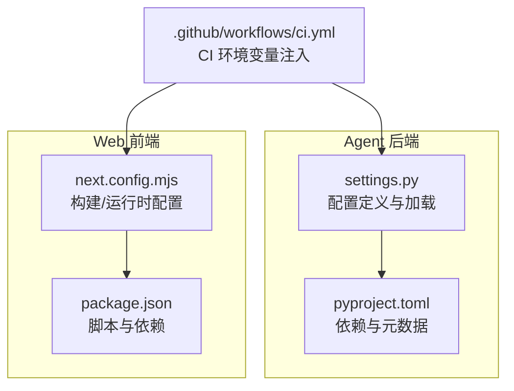
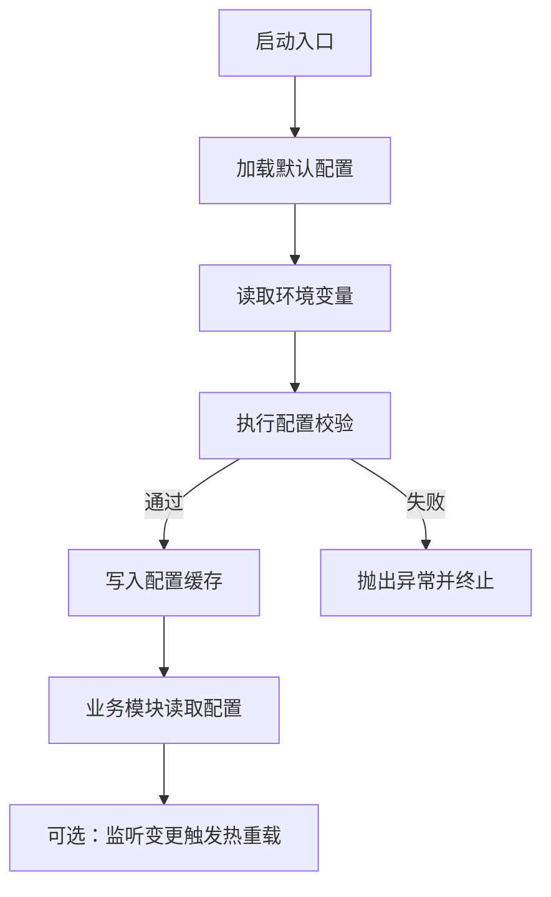
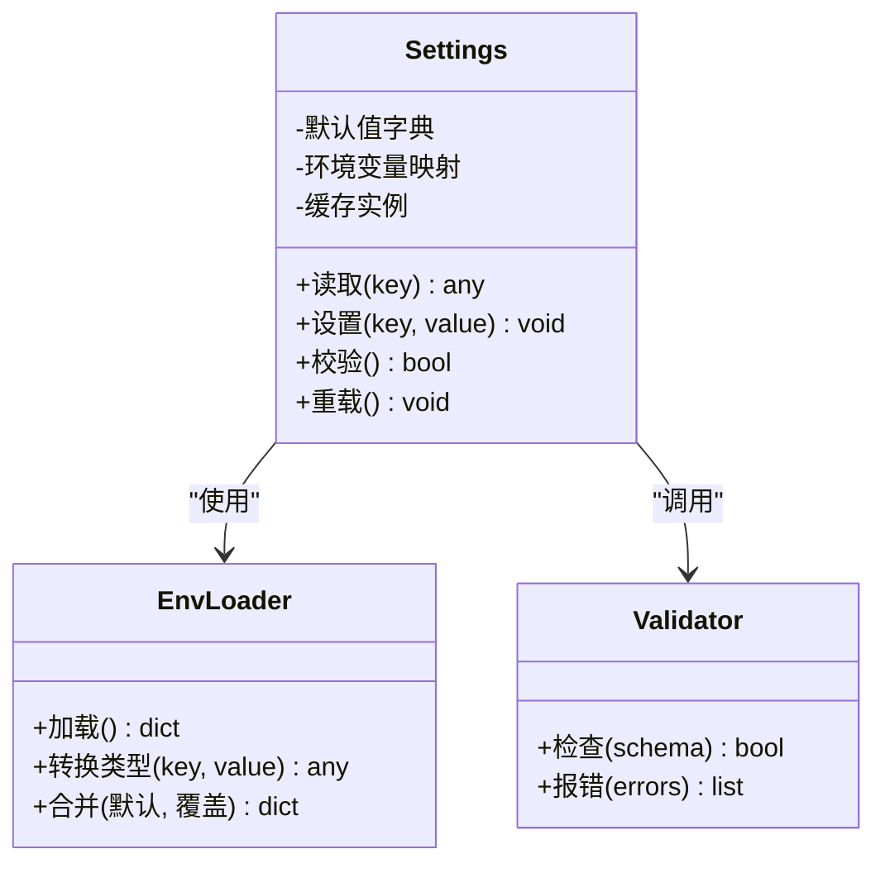
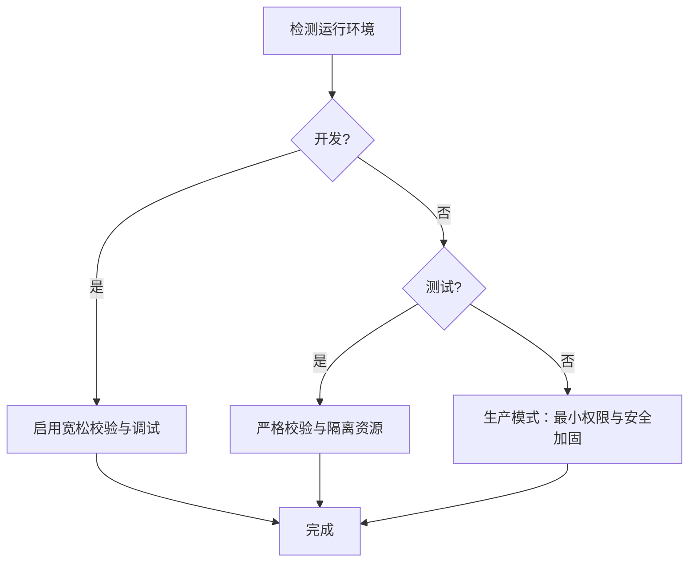
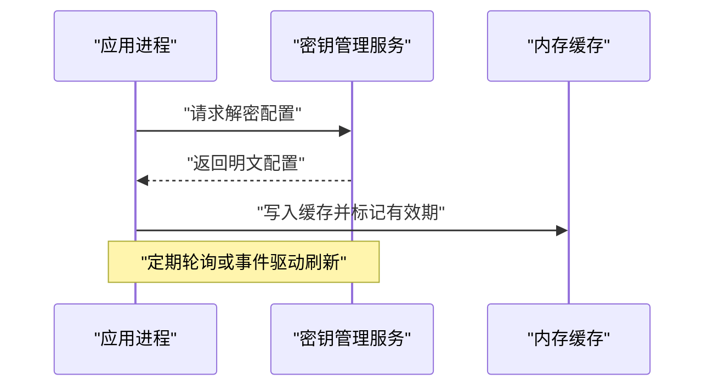
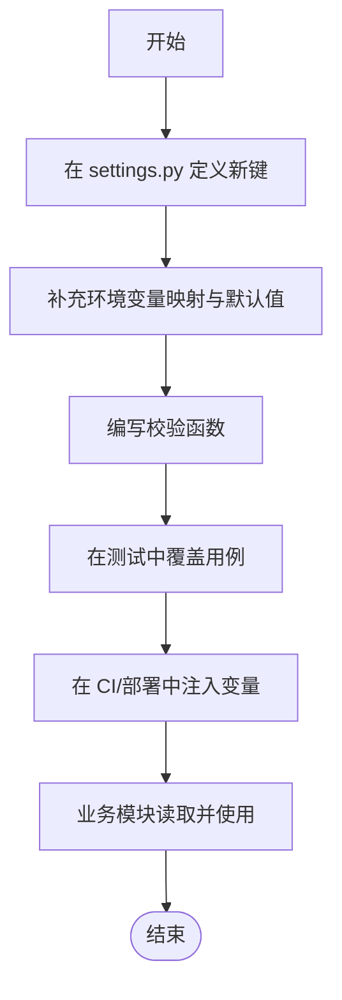
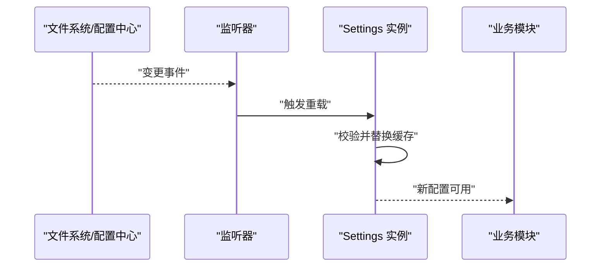
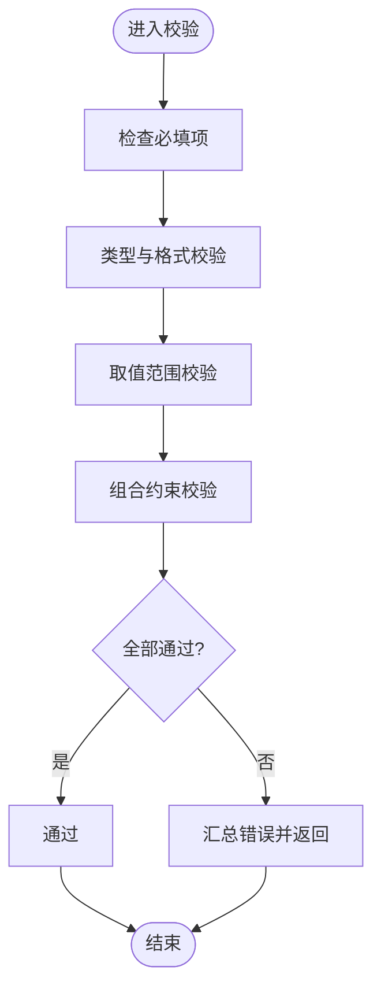
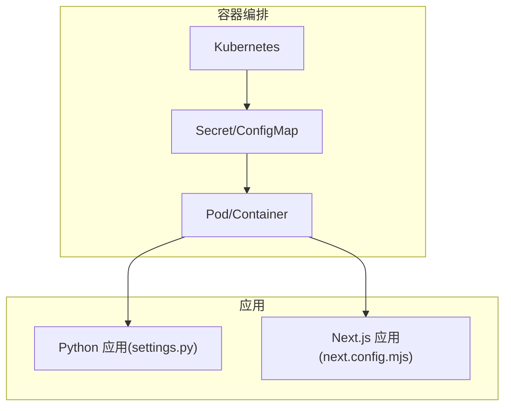
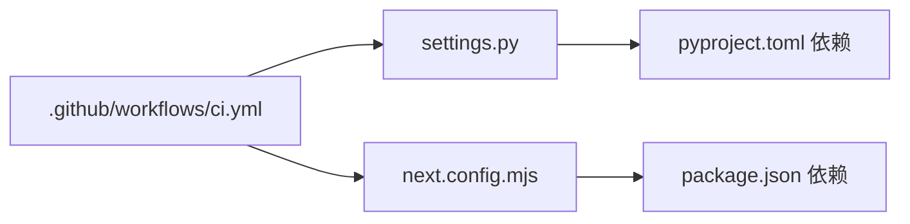

# 配置管理

<cite>
**本文引用的文件**   
- [apps/agent/src/lyl_agent/settings.py](file://apps/agent/src/lyl_agent/settings.py)
- [apps/agent/pyproject.toml](file://apps/agent/pyproject.toml)
- [apps/web/next.config.mjs](file://apps/web/next.config.mjs)
- [apps/web/package.json](file://apps/web/package.json)
- [.github/workflows/ci.yml](file://.github/workflows/ci.yml)
</cite>

## 目录
1. [简介](#简介)
2. [项目结构](#项目结构)
3. [核心组件](#核心组件)
4. [架构总览](#架构总览)
5. [详细组件分析](#详细组件分析)
6. [依赖关系分析](#依赖关系分析)
7. [性能考虑](#性能考虑)
8. [故障排查指南](#故障排查指南)
9. [结论](#结论)
10. [附录](#附录)

## 简介
本文件为 Agent 配置管理系统提供系统化文档，重点围绕 Python 侧的 settings.py 配置架构设计展开。内容涵盖：
- 配置项分类、环境变量管理与默认值设置
- 配置的加载顺序、优先级处理与动态更新机制
- 不同环境（开发、测试、生产）的配置策略与验证规则
- 敏感信息管理、配置加密与密钥轮换策略
- 添加新配置项、实现配置热重载与编写配置验证函数的实践示例
- 与容器化部署集成与环境变量注入方式

## 项目结构
本项目采用多应用仓库结构，Agent 后端位于 apps/agent，Web 前端位于 apps/web。配置管理主要涉及：
- Python 应用配置：apps/agent/src/lyl_agent/settings.py
- Python 包与依赖：apps/agent/pyproject.toml
- Web 应用构建与运行时配置：apps/web/next.config.mjs、apps/web/package.json
- CI 流水线中的环境变量注入：.github/workflows/ci.yml

**图表来源** 
- [apps/agent/src/lyl_agent/settings.py](file://apps/agent/src/lyl_agent/settings.py)
- [apps/agent/pyproject.toml](file://apps/agent/pyproject.toml)
- [apps/web/next.config.mjs](file://apps/web/next.config.mjs)
- [apps/web/package.json](file://apps/web/package.json)
- [.github/workflows/ci.yml](file://.github/workflows/ci.yml)

**章节来源**
- [apps/agent/src/lyl_agent/settings.py](file://apps/agent/src/lyl_agent/settings.py)
- [apps/agent/pyproject.toml](file://apps/agent/pyproject.toml)
- [apps/web/next.config.mjs](file://apps/web/next.config.mjs)
- [apps/web/package.json](file://apps/web/package.json)
- [.github/workflows/ci.yml](file://.github/workflows/ci.yml)

## 核心组件
- 配置模块（settings.py）
  - 负责集中定义配置项、默认值、类型约束与校验逻辑
  - 通过环境变量注入覆盖默认值，支持按环境切换策略
  - 提供统一的访问入口，便于在业务代码中读取配置
- 依赖与元数据（pyproject.toml）
  - 声明运行期依赖（如配置解析库、加密库等）
  - 暴露可执行脚本或 CLI，用于初始化或校验配置
- Web 构建配置（next.config.mjs）
  - 定义前端构建时的环境变量注入点
  - 控制哪些环境变量暴露给浏览器端（安全边界）
- CI 环境变量注入（ci.yml）
  - 在流水线中注入敏感或非敏感环境变量
  - 确保构建与测试阶段使用正确的配置上下文

**章节来源**
- [apps/agent/src/lyl_agent/settings.py](file://apps/agent/src/lyl_agent/settings.py)
- [apps/agent/pyproject.toml](file://apps/agent/pyproject.toml)
- [apps/web/next.config.mjs](file://apps/web/next.config.mjs)
- [apps/web/package.json](file://apps/web/package.json)
- [.github/workflows/ci.yml](file://.github/workflows/ci.yml)

## 架构总览
下图展示配置从“源”到“运行时”的流转路径，包括默认值、环境变量、校验与缓存。

**图表来源** 
- [apps/agent/src/lyl_agent/settings.py](file://apps/agent/src/lyl_agent/settings.py)

## 详细组件分析

### settings.py 配置架构设计
- 配置项分类
  - 基础运行参数（如日志级别、超时、重试次数）
  - 外部服务连接（数据库、消息队列、对象存储等）
  - 模型与推理参数（温度、最大步数、工具开关等）
  - 安全与密钥（API Key、签名密钥、加密盐等）
  - 功能开关与灰度（Feature Flags、A/B 实验）
- 环境变量管理
  - 统一前缀约定（例如 APP_、AGENT_、DB_），避免命名冲突
  - 类型转换与空值处理（字符串转布尔、整数、列表等）
  - 缺失变量的回退策略（默认值或明确报错）
- 默认值设置
  - 分层默认值：全局默认、环境默认、实例默认
  - 可读性强的注释说明每个键的含义与取值范围
- 加载顺序与优先级
  - 建议顺序：内置默认 < 配置文件 < 环境变量 < 运行时覆盖
  - 高优先级覆盖低优先级，最终形成不可变配置视图供业务读取
- 动态更新机制
  - 支持热重载：监听文件系统或配置中心事件，刷新内存缓存
  - 线程安全：读写分离或原子替换，避免竞态条件
  - 版本兼容：新增字段向后兼容，旧客户端忽略未知字段

**图表来源** 
- [apps/agent/src/lyl_agent/settings.py](file://apps/agent/src/lyl_agent/settings.py)

**章节来源**
- [apps/agent/src/lyl_agent/settings.py](file://apps/agent/src/lyl_agent/settings.py)

### 不同环境的配置策略与验证规则
- 开发环境
  - 宽松校验，允许部分可选配置缺失
  - 启用详细日志与调试开关
  - 本地模拟外部服务（Mock）
- 测试环境
  - 严格校验必填项
  - 隔离数据与资源（独立库、临时令牌）
  - 自动化断言配置一致性
- 生产环境
  - 最小权限原则，仅注入必要变量
  - 强制加密与签名校验
  - 审计与告警（配置变更追踪）

**图表来源** 
- [apps/agent/src/lyl_agent/settings.py](file://apps/agent/src/lyl_agent/settings.py)

**章节来源**
- [apps/agent/src/lyl_agent/settings.py](file://apps/agent/src/lyl_agent/settings.py)

### 敏感信息安全管理、配置加密与密钥轮换
- 敏感信息管理
  - 禁止明文硬编码，统一通过环境变量或密钥管理服务注入
  - 对关键变量进行脱敏输出（日志中隐藏）
- 配置加密
  - 对静态配置文件进行加密存储，运行时解密
  - 使用对称/非对称加密算法，结合 KMS 管理密钥
- 密钥轮换策略
  - 支持双密钥并行期，逐步迁移流量
  - 自动过期与回收，记录审计日志
  - 回滚预案与快速恢复流程

**图表来源** 
- [apps/agent/src/lyl_agent/settings.py](file://apps/agent/src/lyl_agent/settings.py)

**章节来源**
- [apps/agent/src/lyl_agent/settings.py](file://apps/agent/src/lyl_agent/settings.py)

### 添加新配置项的实践步骤
- 在 settings.py 中新增配置项
  - 定义键名、默认值、类型与校验规则
  - 补充环境变量映射与注释
- 在环境变量清单中登记
  - 为不同环境准备对应变量
  - 在 CI 与部署脚本中注入
- 在业务模块中引用
  - 通过统一接口读取，避免直接访问底层
- 编写单元测试
  - 覆盖正常、边界与错误场景

**图表来源** 
- [apps/agent/src/lyl_agent/settings.py](file://apps/agent/src/lyl_agent/settings.py)

**章节来源**
- [apps/agent/src/lyl_agent/settings.py](file://apps/agent/src/lyl_agent/settings.py)

### 实现配置热重载
- 监听机制
  - 文件系统监听（.env、配置文件）
  - 配置中心事件（Kubernetes ConfigMap、Consul、Nacos）
- 刷新策略
  - 原子替换内存缓存，保证读一致
  - 限流与去抖，避免频繁刷新
- 兼容性
  - 新旧配置共存过渡期
  - 降级与回滚能力

**图表来源** 
- [apps/agent/src/lyl_agent/settings.py](file://apps/agent/src/lyl_agent/settings.py)

**章节来源**
- [apps/agent/src/lyl_agent/settings.py](file://apps/agent/src/lyl_agent/settings.py)

### 编写配置验证函数
- 校验维度
  - 存在性（必填项）
  - 类型与格式（URL、邮箱、正则）
  - 取值范围（阈值、枚举）
  - 组合约束（互斥、依赖）
- 错误处理
  - 收集所有错误并一次性返回
  - 提供清晰的修复指引

**图表来源** 
- [apps/agent/src/lyl_agent/settings.py](file://apps/agent/src/lyl_agent/settings.py)

**章节来源**
- [apps/agent/src/lyl_agent/settings.py](file://apps/agent/src/lyl_agent/settings.py)

### 与容器化部署和环境变量注入集成
- Docker/Kubernetes
  - 使用环境变量注入敏感与非敏感配置
  - 通过 Secret 管理密钥，挂载为环境变量或文件
- Next.js 前端
  - 在 next.config.mjs 中定义构建时环境变量
  - 谨慎暴露至浏览器端，遵循最小暴露原则
- CI/CD
  - 在 .github/workflows/ci.yml 中注入环境变量
  - 确保构建产物不包含敏感信息

**图表来源** 
- [apps/agent/src/lyl_agent/settings.py](file://apps/agent/src/lyl_agent/settings.py)
- [apps/web/next.config.mjs](file://apps/web/next.config.mjs)
- [.github/workflows/ci.yml](file://.github/workflows/ci.yml)

**章节来源**
- [apps/agent/src/lyl_agent/settings.py](file://apps/agent/src/lyl_agent/settings.py)
- [apps/web/next.config.mjs](file://apps/web/next.config.mjs)
- [.github/workflows/ci.yml](file://.github/workflows/ci.yml)

## 依赖关系分析
- Python 侧依赖
  - 配置解析与校验库（如 pydantic、environs、python-dotenv）
  - 加密与密钥管理库（如 cryptography、kms 客户端）
- Web 侧依赖
  - Next.js 构建与运行时依赖
  - 环境变量注入与构建脚本
- CI 依赖
  - GitHub Actions 工作流与 Secrets 管理

**图表来源** 
- [apps/agent/pyproject.toml](file://apps/agent/pyproject.toml)
- [apps/web/package.json](file://apps/web/package.json)
- [.github/workflows/ci.yml](file://.github/workflows/ci.yml)

**章节来源**
- [apps/agent/pyproject.toml](file://apps/agent/pyproject.toml)
- [apps/web/package.json](file://apps/web/package.json)
- [.github/workflows/ci.yml](file://.github/workflows/ci.yml)

## 性能考虑
- 配置加载开销
  - 启动时批量加载与缓存，避免重复 IO
  - 大配置分片加载与懒加载
- 热重载影响
  - 原子替换与只读视图，降低锁竞争
  - 增量校验与差异刷新
- 并发安全
  - 读写分离、无锁数据结构
  - 监控与指标上报（加载耗时、错误率）

[本节为通用指导，不直接分析具体文件]

## 故障排查指南
- 常见问题
  - 环境变量未注入或命名不一致
  - 类型转换失败导致启动崩溃
  - 校验规则过严或过松
  - 热重载未生效或引发竞态
- 诊断步骤
  - 打印配置快照（脱敏）
  - 检查环境变量清单与注入点
  - 查看校验错误详情与修复建议
  - 确认依赖版本与兼容性

**章节来源**
- [apps/agent/src/lyl_agent/settings.py](file://apps/agent/src/lyl_agent/settings.py)

## 结论
通过集中化的 settings.py 配置架构，配合环境变量注入、严格的校验与安全的密钥管理，可实现稳定、可扩展且安全的 Agent 配置管理。建议在团队内统一规范，完善文档与自动化测试，确保配置在不同环境下的一致性与可维护性。

[本节为总结性内容，不直接分析具体文件]

## 附录
- 最佳实践清单
  - 统一环境变量命名与前缀
  - 明确默认值与必填项
  - 编写完备的校验与测试用例
  - 使用密钥管理服务与最小暴露原则
  - 建立配置变更审计与回滚流程
- 参考文件
  - [apps/agent/src/lyl_agent/settings.py](file://apps/agent/src/lyl_agent/settings.py)
  - [apps/agent/pyproject.toml](file://apps/agent/pyproject.toml)
  - [apps/web/next.config.mjs](file://apps/web/next.config.mjs)
  - [apps/web/package.json](file://apps/web/package.json)
  - [.github/workflows/ci.yml](file://.github/workflows/ci.yml)