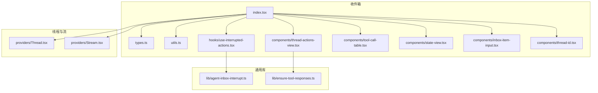
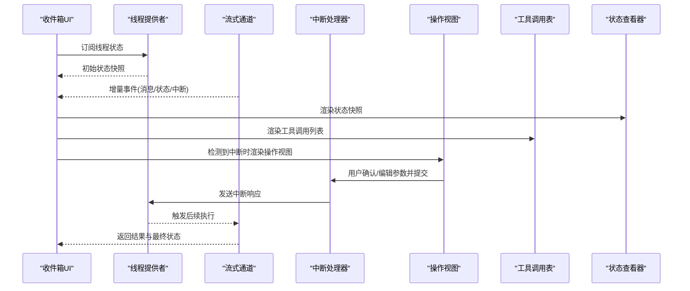
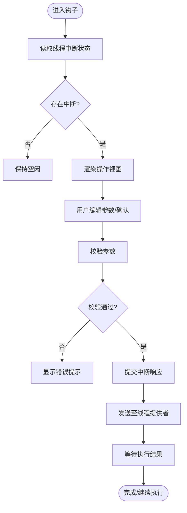
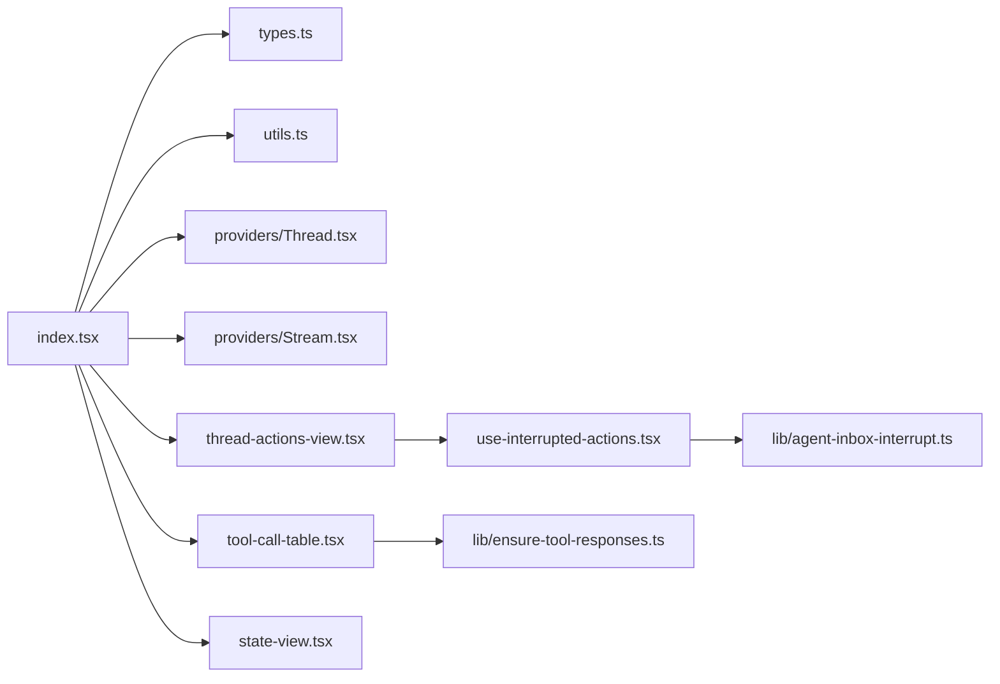

# Agent收件箱组件

<cite>
**本文引用的文件**   
- [apps/web/src/components/thread/agent-inbox/index.tsx](file://apps/web/src/components/thread/agent-inbox/index.tsx)
- [apps/web/src/components/thread/agent-inbox/types.ts](file://apps/web/src/components/thread/agent-inbox/types.ts)
- [apps/web/src/components/thread/agent-inbox/utils.ts](file://apps/web/src/components/thread/agent-inbox/utils.ts)
- [apps/web/src/components/thread/agent-inbox/hooks/use-interrupted-actions.tsx](file://apps/web/src/components/thread/agent-inbox/hooks/use-interrupted-actions.tsx)
- [apps/web/src/components/thread/agent-inbox/components/thread-actions-view.tsx](file://apps/web/src/components/thread/agent-inbox/components/thread-actions-view.tsx)
- [apps/web/src/components/thread/agent-inbox/components/tool-call-table.tsx](file://apps/web/src/components/thread/agent-inbox/components/tool-call-table.tsx)
- [apps/web/src/components/thread/agent-inbox/components/state-view.tsx](file://apps/web/src/components/thread/agent-inbox/components/state-view.tsx)
- [apps/web/src/components/thread/agent-inbox/components/inbox-item-input.tsx](file://apps/web/src/components/thread/agent-inbox/components/inbox-item-input.tsx)
- [apps/web/src/components/thread/agent-inbox/components/thread-id.tsx](file://apps/web/src/components/thread/agent-inbox/components/thread-id.tsx)
- [apps/web/src/lib/agent-inbox-interrupt.ts](file://apps/web/src/lib/agent-inbox-interrupt.ts)
- [apps/web/src/lib/ensure-tool-responses.ts](file://apps/web/src/lib/ensure-tool-responses.ts)
- [apps/web/src/providers/Thread.tsx](file://apps/web/src/providers/Thread.tsx)
- [apps/web/src/providers/Stream.tsx](file://apps/web/src/providers/Stream.tsx)
- [apps/web/src/app/page.tsx](file://apps/web/src/app/page.tsx)
</cite>

## 目录
1. [简介](#简介)
2. [项目结构](#项目结构)
3. [核心组件](#核心组件)
4. [架构总览](#架构总览)
5. [详细组件分析](#详细组件分析)
6. [依赖关系分析](#依赖关系分析)
7. [性能考量](#性能考量)
8. [故障排查指南](#故障排查指南)
9. [结论](#结论)
10. [附录](#附录)

## 简介
本文件为Agent收件箱组件的完整技术文档，覆盖收件箱界面、线程操作视图、工具调用表格、状态查看器与中断动作处理组件。重点说明数据流、状态同步与实时通信机制，包含中断处理、用户确认流程、异步执行细节；并给出工具调用的可视化展示、参数编辑与结果反馈的实现要点。同时提供自定义收件箱布局、扩展操作类型与集成外部系统的指导，以及错误处理、重试机制和用户体验优化策略。

## 项目结构
Agent收件箱位于前端Web应用中，采用按功能域组织的目录结构：
- agent-inbox：收件箱核心UI与逻辑（入口、类型、工具、状态、中断钩子等）
- thread：线程消息渲染与预览（含工具调用消息渲染）
- providers：线程上下文与流式更新提供者
- lib：通用库（中断协议、工具响应保障等）

图表来源
- [apps/web/src/components/thread/agent-inbox/index.tsx](file://apps/web/src/components/thread/agent-inbox/index.tsx)
- [apps/web/src/components/thread/agent-inbox/types.ts](file://apps/web/src/components/thread/agent-inbox/types.ts)
- [apps/web/src/components/thread/agent-inbox/utils.ts](file://apps/web/src/components/thread/agent-inbox/utils.ts)
- [apps/web/src/components/thread/agent-inbox/hooks/use-interrupted-actions.tsx](file://apps/web/src/components/thread/agent-inbox/hooks/use-interrupted-actions.tsx)
- [apps/web/src/components/thread/agent-inbox/components/thread-actions-view.tsx](file://apps/web/src/components/thread/agent-inbox/components/thread-actions-view.tsx)
- [apps/web/src/components/thread/agent-inbox/components/tool-call-table.tsx](file://apps/web/src/components/thread/agent-inbox/components/tool-call-table.tsx)
- [apps/web/src/components/thread/agent-inbox/components/state-view.tsx](file://apps/web/src/components/thread/agent-inbox/components/state-view.tsx)
- [apps/web/src/components/thread/agent-inbox/components/inbox-item-input.tsx](file://apps/web/src/components/thread/agent-inbox/components/inbox-item-input.tsx)
- [apps/web/src/components/thread/agent-inbox/components/thread-id.tsx](file://apps/web/src/components/thread/agent-inbox/components/thread-id.tsx)
- [apps/web/src/providers/Thread.tsx](file://apps/web/src/providers/Thread.tsx)
- [apps/web/src/providers/Stream.tsx](file://apps/web/src/providers/Stream.tsx)
- [apps/web/src/lib/agent-inbox-interrupt.ts](file://apps/web/src/lib/agent-inbox-interrupt.ts)
- [apps/web/src/lib/ensure-tool-responses.ts](file://apps/web/src/lib/ensure-tool-responses.ts)

章节来源
- [apps/web/src/app/page.tsx](file://apps/web/src/app/page.tsx)

## 核心组件
- 收件箱入口 index.tsx：聚合收件箱面板、线程ID输入、操作视图、工具调用表、状态查看器与输入框，负责订阅线程状态与流式事件，驱动UI刷新。
- 类型定义 types.ts：统一收件箱数据结构、中断动作、工具调用与状态字段。
- 工具 utils.ts：辅助函数（如序列化/反序列化、校验、格式化）。
- 中断钩子 use-interrupted-actions.tsx：封装中断动作的获取、确认、提交与重试逻辑。
- 线程操作视图 thread-actions-view.tsx：渲染待处理的中断动作列表与交互表单。
- 工具调用表格 tool-call-table.tsx：以表格形式展示工具调用、参数、状态与结果。
- 状态查看器 state-view.tsx：以树形或键值对方式展示当前线程状态快照。
- 输入框 inbox-item-input.tsx：用于用户回复或补充信息。
- 线程ID thread-id.tsx：显示与复制当前线程标识。

章节来源
- [apps/web/src/components/thread/agent-inbox/index.tsx](file://apps/web/src/components/thread/agent-inbox/index.tsx)
- [apps/web/src/components/thread/agent-inbox/types.ts](file://apps/web/src/components/thread/agent-inbox/types.ts)
- [apps/web/src/components/thread/agent-inbox/utils.ts](file://apps/web/src/components/thread/agent-inbox/utils.ts)
- [apps/web/src/components/thread/agent-inbox/hooks/use-interrupted-actions.tsx](file://apps/web/src/components/thread/agent-inbox/hooks/use-interrupted-actions.tsx)
- [apps/web/src/components/thread/agent-inbox/components/thread-actions-view.tsx](file://apps/web/src/components/thread/agent-inbox/components/thread-actions-view.tsx)
- [apps/web/src/components/thread/agent-inbox/components/tool-call-table.tsx](file://apps/web/src/components/thread/agent-inbox/components/tool-call-table.tsx)
- [apps/web/src/components/thread/agent-inbox/components/state-view.tsx](file://apps/web/src/components/thread/agent-inbox/components/state-view.tsx)
- [apps/web/src/components/thread/agent-inbox/components/inbox-item-input.tsx](file://apps/web/src/components/thread/agent-inbox/components/inbox-item-input.tsx)
- [apps/web/src/components/thread/agent-inbox/components/thread-id.tsx](file://apps/web/src/components/thread/agent-inbox/components/thread-id.tsx)

## 架构总览
收件箱通过线程提供者订阅后端图执行状态，使用流式通道接收增量更新。当Agent进入“中断”状态时，前端渲染操作视图，引导用户完成确认或参数编辑，随后将响应回写至线程，恢复执行。工具调用在表格中可视化，支持展开查看参数与结果。

图表来源
- [apps/web/src/providers/Thread.tsx](file://apps/web/src/providers/Thread.tsx)
- [apps/web/src/providers/Stream.tsx](file://apps/web/src/providers/Stream.tsx)
- [apps/web/src/components/thread/agent-inbox/hooks/use-interrupted-actions.tsx](file://apps/web/src/components/thread/agent-inbox/hooks/use-interrupted-actions.tsx)
- [apps/web/src/components/thread/agent-inbox/components/thread-actions-view.tsx](file://apps/web/src/components/thread/agent-inbox/components/thread-actions-view.tsx)
- [apps/web/src/components/thread/agent-inbox/components/tool-call-table.tsx](file://apps/web/src/components/thread/agent-inbox/components/tool-call-table.tsx)
- [apps/web/src/components/thread/agent-inbox/components/state-view.tsx](file://apps/web/src/components/thread/agent-inbox/components/state-view.tsx)

## 详细组件分析

### 收件箱入口 index.tsx
职责
- 组合各子组件，管理收件箱可见性与布局
- 订阅线程状态与流事件，驱动局部重渲染
- 根据中断状态切换操作视图与工具调用表
- 处理用户输入与提交回调

关键实现要点
- 使用线程提供者提供的状态与事件API进行订阅与派发
- 将中断动作映射到操作视图的表单控件
- 将工具调用项映射到表格行，支持展开详情
- 将状态快照转换为可浏览的结构化视图

章节来源
- [apps/web/src/components/thread/agent-inbox/index.tsx](file://apps/web/src/components/thread/agent-inbox/index.tsx)

### 类型定义 types.ts
内容
- 中断动作模型：动作类型、参数Schema、默认值、校验规则
- 工具调用模型：名称、参数、状态、结果、错误信息
- 状态快照模型：键值路径、类型、值、是否只读
- 收件箱配置：主题、布局、是否启用某些特性

章节来源
- [apps/web/src/components/thread/agent-inbox/types.ts](file://apps/web/src/components/thread/agent-inbox/types.ts)

### 工具 utils.ts
内容
- 深拷贝与不可变更新
- JSON Schema与表单字段映射
- 字符串/时间/数值格式化工具
- 错误信息归一化与提示文案生成

章节来源
- [apps/web/src/components/thread/agent-inbox/utils.ts](file://apps/web/src/components/thread/agent-inbox/utils.ts)

### 中断钩子 use-interrupted-actions.tsx
职责
- 从线程状态中提取待处理的中断动作
- 维护本地编辑态与校验结果
- 提供提交、取消、重试接口
- 与线程提供者对接，发送中断响应

流程图

图表来源
- [apps/web/src/components/thread/agent-inbox/hooks/use-interrupted-actions.tsx](file://apps/web/src/components/thread/agent-inbox/hooks/use-interrupted-actions.tsx)
- [apps/web/src/lib/agent-inbox-interrupt.ts](file://apps/web/src/lib/agent-inbox-interrupt.ts)

章节来源
- [apps/web/src/components/thread/agent-inbox/hooks/use-interrupted-actions.tsx](file://apps/web/src/components/thread/agent-inbox/hooks/use-interrupted-actions.tsx)
- [apps/web/src/lib/agent-inbox-interrupt.ts](file://apps/web/src/lib/agent-inbox-interrupt.ts)

### 线程操作视图 thread-actions-view.tsx
职责
- 将中断动作渲染为表单控件（文本、选择、开关、富文本等）
- 绑定字段校验与错误提示
- 提供“确认”“取消”“重试”等操作按钮
- 与中断钩子协作，收集用户输入并提交

章节来源
- [apps/web/src/components/thread/agent-inbox/components/thread-actions-view.tsx](file://apps/web/src/components/thread/agent-inbox/components/thread-actions-view.tsx)

### 工具调用表格 tool-call-table.tsx
职责
- 以表格展示工具调用列表：名称、参数摘要、状态、结果摘要
- 支持展开查看完整参数与结果
- 标记失败项并提供重试入口
- 与线程状态同步，自动刷新

章节来源
- [apps/web/src/components/thread/agent-inbox/components/tool-call-table.tsx](file://apps/web/src/components/thread/agent-inbox/components/tool-call-table.tsx)

### 状态查看器 state-view.tsx
职责
- 将线程状态快照渲染为可折叠树或键值对
- 支持搜索与过滤
- 高亮变更项（对比前后快照）
- 提供导出/复制功能

章节来源
- [apps/web/src/components/thread/agent-inbox/components/state-view.tsx](file://apps/web/src/components/thread/agent-inbox/components/state-view.tsx)

### 输入框 inbox-item-input.tsx
职责
- 用户输入区域，支持多行文本与快捷指令
- 与线程消息发送流程集成
- 提供占位符、禁用态、加载态

章节来源
- [apps/web/src/components/thread/agent-inbox/components/inbox-item-input.tsx](file://apps/web/src/components/thread/agent-inbox/components/inbox-item-input.tsx)

### 线程ID thread-id.tsx
职责
- 显示当前线程ID，支持一键复制
- 与URL或设置中的线程ID同步

章节来源
- [apps/web/src/components/thread/agent-inbox/components/thread-id.tsx](file://apps/web/src/components/thread/agent-inbox/components/thread-id.tsx)

### 中断协议与工具响应保障
- agent-inbox-interrupt.ts：定义中断消息结构、动作类型枚举、参数Schema约定与校验流程
- ensure-tool-responses.ts：确保工具调用结果符合预期结构，缺失字段时填充默认值或报错

章节来源
- [apps/web/src/lib/agent-inbox-interrupt.ts](file://apps/web/src/lib/agent-inbox-interrupt.ts)
- [apps/web/src/lib/ensure-tool-responses.ts](file://apps/web/src/lib/ensure-tool-responses.ts)

## 依赖关系分析
- 收件箱入口依赖线程提供者与流式通道，用于状态订阅与实时更新
- 中断钩子依赖中断协议库，保证前后端一致的动作描述与校验
- 操作视图与工具调用表依赖类型定义与工具函数，确保数据一致性
- 状态查看器依赖线程快照数据，支持差异计算与高亮

图表来源
- [apps/web/src/components/thread/agent-inbox/index.tsx](file://apps/web/src/components/thread/agent-inbox/index.tsx)
- [apps/web/src/components/thread/agent-inbox/types.ts](file://apps/web/src/components/thread/agent-inbox/types.ts)
- [apps/web/src/components/thread/agent-inbox/utils.ts](file://apps/web/src/components/thread/agent-inbox/utils.ts)
- [apps/web/src/providers/Thread.tsx](file://apps/web/src/providers/Thread.tsx)
- [apps/web/src/providers/Stream.tsx](file://apps/web/src/providers/Stream.tsx)
- [apps/web/src/components/thread/agent-inbox/components/thread-actions-view.tsx](file://apps/web/src/components/thread/agent-inbox/components/thread-actions-view.tsx)
- [apps/web/src/components/thread/agent-inbox/components/tool-call-table.tsx](file://apps/web/src/components/thread/agent-inbox/components/tool-call-table.tsx)
- [apps/web/src/components/thread/agent-inbox/components/state-view.tsx](file://apps/web/src/components/thread/agent-inbox/components/state-view.tsx)
- [apps/web/src/components/thread/agent-inbox/hooks/use-interrupted-actions.tsx](file://apps/web/src/components/thread/agent-inbox/hooks/use-interrupted-actions.tsx)
- [apps/web/src/lib/agent-inbox-interrupt.ts](file://apps/web/src/lib/agent-inbox-interrupt.ts)
- [apps/web/src/lib/ensure-tool-responses.ts](file://apps/web/src/lib/ensure-tool-responses.ts)

章节来源
- [apps/web/src/components/thread/agent-inbox/index.tsx](file://apps/web/src/components/thread/agent-inbox/index.tsx)

## 性能考量
- 增量更新：通过流式通道仅渲染变更片段，避免全量重绘
- 虚拟滚动：工具调用列表与状态树在大数据量下启用虚拟化
- 防抖与节流：输入框与搜索框使用防抖，减少频繁重渲染
- 缓存策略：对只读状态快照做浅比较与选择性更新
- 懒加载：展开详情时再请求或计算详细内容

[本节为通用建议，不直接分析具体文件]

## 故障排查指南
常见问题与定位方法
- 中断未出现：检查线程状态是否包含中断字段，确认中断协议版本一致
- 参数校验失败：查看操作视图的错误提示，核对Schema与默认值
- 工具调用失败：在工具调用表中查看错误信息，必要时重试或回滚
- 状态不同步：检查流式事件是否丢失，确认订阅与去重逻辑
- 重复提交：确保提交前禁用按钮，并在成功后重置状态

章节来源
- [apps/web/src/lib/agent-inbox-interrupt.ts](file://apps/web/src/lib/agent-inbox-interrupt.ts)
- [apps/web/src/lib/ensure-tool-responses.ts](file://apps/web/src/lib/ensure-tool-responses.ts)
- [apps/web/src/components/thread/agent-inbox/hooks/use-interrupted-actions.tsx](file://apps/web/src/components/thread/agent-inbox/hooks/use-interrupted-actions.tsx)
- [apps/web/src/components/thread/agent-inbox/components/tool-call-table.tsx](file://apps/web/src/components/thread/agent-inbox/components/tool-call-table.tsx)

## 结论
Agent收件箱组件通过清晰的组件分层与统一的类型定义，实现了中断驱动的交互式工作流。结合线程提供者与流式通道，保证了状态同步与实时反馈。工具调用表格与状态查看器提升了可观测性，中断钩子与操作视图完善了用户确认与参数编辑体验。遵循本文的性能与排错建议，可进一步提升稳定性与可用性。

[本节为总结，不直接分析具体文件]

## 附录

### 自定义收件箱布局
- 在入口组件中替换子组件插槽，按需调整布局顺序与样式
- 通过类型定义扩展新的动作类型与字段控件
- 使用工具函数统一格式化与校验逻辑

章节来源
- [apps/web/src/components/thread/agent-inbox/index.tsx](file://apps/web/src/components/thread/agent-inbox/index.tsx)
- [apps/web/src/components/thread/agent-inbox/types.ts](file://apps/web/src/components/thread/agent-inbox/types.ts)
- [apps/web/src/components/thread/agent-inbox/utils.ts](file://apps/web/src/components/thread/agent-inbox/utils.ts)

### 扩展操作类型
- 在类型定义中添加新动作枚举与Schema
- 在操作视图中新增对应控件与校验规则
- 在中断钩子中注册新动作的处理与提交逻辑

章节来源
- [apps/web/src/components/thread/agent-inbox/types.ts](file://apps/web/src/components/thread/agent-inbox/types.ts)
- [apps/web/src/components/thread/agent-inbox/components/thread-actions-view.tsx](file://apps/web/src/components/thread/agent-inbox/components/thread-actions-view.tsx)
- [apps/web/src/components/thread/agent-inbox/hooks/use-interrupted-actions.tsx](file://apps/web/src/components/thread/agent-inbox/hooks/use-interrupted-actions.tsx)

### 集成外部系统
- 在工具调用表中接入外部API，展示调用状态与结果
- 使用ensure-tool-responses.ts规范返回结构，缺失字段时回填默认值
- 在流式通道中透传外部系统的事件，保持前端实时性

章节来源
- [apps/web/src/components/thread/agent-inbox/components/tool-call-table.tsx](file://apps/web/src/components/thread/agent-inbox/components/tool-call-table.tsx)
- [apps/web/src/lib/ensure-tool-responses.ts](file://apps/web/src/lib/ensure-tool-responses.ts)
- [apps/web/src/providers/Stream.tsx](file://apps/web/src/providers/Stream.tsx)

### 错误处理与重试机制
- 统一错误分类与提示文案
- 对幂等操作提供重试入口，非幂等操作需二次确认
- 记录失败上下文以便诊断

章节来源
- [apps/web/src/lib/agent-inbox-interrupt.ts](file://apps/web/src/lib/agent-inbox-interrupt.ts)
- [apps/web/src/components/thread/agent-inbox/components/tool-call-table.tsx](file://apps/web/src/components/thread/agent-inbox/components/tool-call-table.tsx)

### 用户体验优化策略
- 渐进式加载与骨架屏
- 键盘快捷键与无障碍支持
- 操作撤销与历史回溯
- 明确的状态指示与进度反馈

[本节为通用建议，不直接分析具体文件]