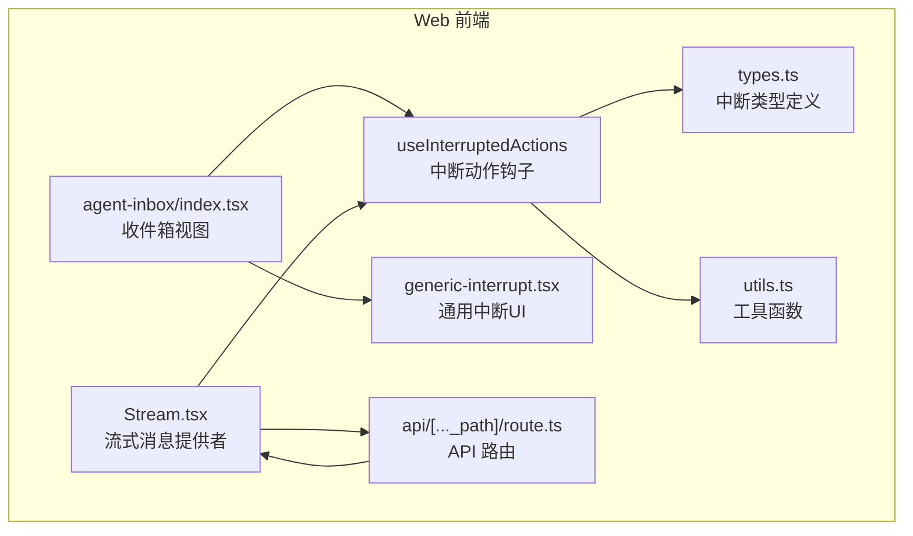
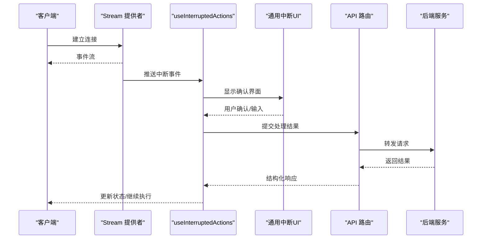
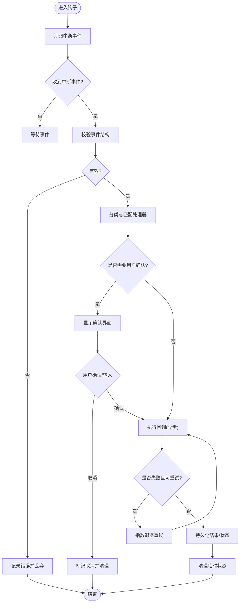
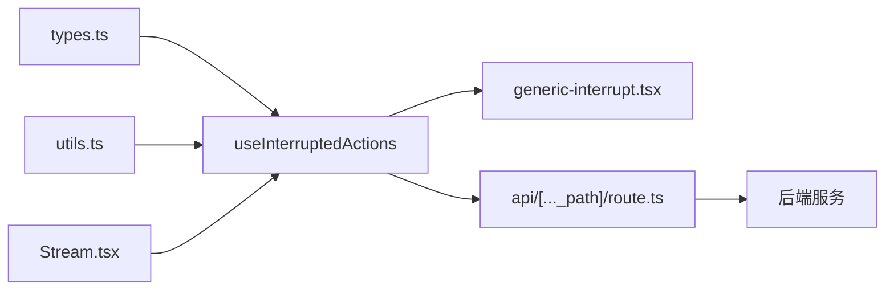

# 中断动作处理

<cite>
**本文引用的文件**   
- [apps/web/src/components/thread/agent-inbox/hooks/use-interrupted-actions.tsx](file://apps/web/src/components/thread/agent-inbox/hooks/use-interrupted-actions.tsx)
- [apps/web/src/lib/agent-inbox-interrupt.ts](file://apps/web/src/lib/agent-inbox-interrupt.ts)
- [apps/web/src/components/thread/agent-inbox/types.ts](file://apps/web/src/components/thread/agent-inbox/types.ts)
- [apps/web/src/components/thread/agent-inbox/utils.ts](file://apps/web/src/components/thread/agent-inbox/utils.ts)
- [apps/web/src/components/thread/agent-inbox/index.tsx](file://apps/web/src/components/thread/agent-inbox/index.tsx)
- [apps/web/src/components/thread/messages/generic-interrupt.tsx](file://apps/web/src/components/thread/messages/generic-interrupt.tsx)
- [apps/web/src/providers/Stream.tsx](file://apps/web/src/providers/Stream.tsx)
- [apps/web/src/app/api/[..._path]/route.ts](file://apps/web/src/app/api/[..._path]/route.ts)
</cite>

## 目录
1. [简介](#简介)
2. [项目结构](#项目结构)
3. [核心组件](#核心组件)
4. [架构总览](#架构总览)
5. [详细组件分析](#详细组件分析)
6. [依赖分析](#依赖分析)
7. [性能考虑](#性能考虑)
8. [故障排查指南](#故障排查指南)
9. [结论](#结论)
10. [附录](#附录)

## 简介
本文件围绕“中断动作处理”机制，系统性梳理事件监听、回调处理、用户确认流程、权限与安全控制、异步操作管理（重试与错误恢复）、中断状态持久化与清理，以及自定义中断类型与扩展集成方法。目标是帮助开发者快速理解并安全地扩展中断能力，确保在复杂交互中保持可观测性与稳定性。

## 项目结构
与中断动作处理相关的前端代码集中在 Web 应用内：
- 钩子层：封装中断事件的订阅、派发与生命周期管理
- 类型与工具：定义中断数据结构、校验与转换逻辑
- UI 展示：通用中断渲染与线程视图中的中断项
- 流式处理：服务端消息流接入与中断事件透传
- API 路由：统一入口转发请求到后端服务

图表来源 
- [apps/web/src/components/thread/agent-inbox/hooks/use-interrupted-actions.tsx](file://apps/web/src/components/thread/agent-inbox/hooks/use-interrupted-actions.tsx)
- [apps/web/src/components/thread/agent-inbox/types.ts](file://apps/web/src/components/thread/agent-inbox/types.ts)
- [apps/web/src/components/thread/agent-inbox/utils.ts](file://apps/web/src/components/thread/agent-inbox/utils.ts)
- [apps/web/src/components/thread/messages/generic-interrupt.tsx](file://apps/web/src/components/thread/messages/generic-interrupt.tsx)
- [apps/web/src/components/thread/agent-inbox/index.tsx](file://apps/web/src/components/thread/agent-inbox/index.tsx)
- [apps/web/src/providers/Stream.tsx](file://apps/web/src/providers/Stream.tsx)
- [apps/web/src/app/api/[..._path]/route.ts](file://apps/web/src/app/api/[..._path]/route.ts)

章节来源
- [apps/web/src/components/thread/agent-inbox/hooks/use-interrupted-actions.tsx](file://apps/web/src/components/thread/agent-inbox/hooks/use-interrupted-actions.tsx)
- [apps/web/src/components/thread/agent-inbox/types.ts](file://apps/web/src/components/thread/agent-inbox/types.ts)
- [apps/web/src/components/thread/agent-inbox/utils.ts](file://apps/web/src/components/thread/agent-inbox/utils.ts)
- [apps/web/src/components/thread/messages/generic-interrupt.tsx](file://apps/web/src/components/thread/messages/generic-interrupt.tsx)
- [apps/web/src/components/thread/agent-inbox/index.tsx](file://apps/web/src/components/thread/agent-inbox/index.tsx)
- [apps/web/src/providers/Stream.tsx](file://apps/web/src/providers/Stream.tsx)
- [apps/web/src/app/api/[..._path]/route.ts](file://apps/web/src/app/api/[..._path]/route.ts)

## 核心组件
- 中断动作钩子 useInterruptedActions
  - 职责：订阅中断事件、维护待处理队列、触发用户确认、执行回调、管理重试与错误恢复、持久化与清理
  - 关键能力：事件监听、回调注册、幂等性保证、超时与重试、状态同步
- 中断类型与工具
  - 职责：定义中断数据模型、校验规则、序列化/反序列化、ID 生成与去重
- 通用中断 UI
  - 职责：渲染中断提示、收集用户输入、展示结果与错误信息
- 流式提供者 Stream
  - 职责：建立与服务端的连接、解析事件流、将中断事件注入钩子
- API 路由
  - 职责：鉴权、参数校验、转发至后端服务、返回结构化响应

章节来源
- [apps/web/src/components/thread/agent-inbox/hooks/use-interrupted-actions.tsx](file://apps/web/src/components/thread/agent-inbox/hooks/use-interrupted-actions.tsx)
- [apps/web/src/components/thread/agent-inbox/types.ts](file://apps/web/src/components/thread/agent-inbox/types.ts)
- [apps/web/src/components/thread/agent-inbox/utils.ts](file://apps/web/src/components/thread/agent-inbox/utils.ts)
- [apps/web/src/components/thread/messages/generic-interrupt.tsx](file://apps/web/src/components/thread/messages/generic-interrupt.tsx)
- [apps/web/src/providers/Stream.tsx](file://apps/web/src/providers/Stream.tsx)
- [apps/web/src/app/api/[..._path]/route.ts](file://apps/web/src/app/api/[..._path]/route.ts)

## 架构总览
中断处理采用“事件驱动 + 钩子管理”的架构：
- 服务端通过流式接口推送中断事件
- 前端 Stream 提供者接收并解析事件
- 钩子集中管理中断队列、用户确认与回调执行
- UI 层负责交互与反馈
- API 路由提供统一的鉴权与转发能力

图表来源 
- [apps/web/src/providers/Stream.tsx](file://apps/web/src/providers/Stream.tsx)
- [apps/web/src/components/thread/agent-inbox/hooks/use-interrupted-actions.tsx](file://apps/web/src/components/thread/agent-inbox/hooks/use-interrupted-actions.tsx)
- [apps/web/src/components/thread/messages/generic-interrupt.tsx](file://apps/web/src/components/thread/messages/generic-interrupt.tsx)
- [apps/web/src/app/api/[..._path]/route.ts](file://apps/web/src/app/api/[..._path]/route.ts)

## 详细组件分析

### 中断动作钩子 useInterruptedActions
- 设计要点
  - 事件订阅：基于流式事件源，过滤出中断事件并加入队列
  - 用户确认：对需要人工介入的中断类型弹出确认框，收集必要输入
  - 回调执行：按类型分发到对应处理器，支持异步与错误捕获
  - 重试策略：指数退避与最大重试次数，避免雪崩
  - 幂等性：基于中断 ID 去重，防止重复处理
  - 持久化：本地存储未决中断，刷新后恢复
  - 清理：成功或取消后清理状态，释放资源
- 关键流程
  - 接收事件 -> 校验与分类 -> 用户确认 -> 执行回调 -> 记录结果 -> 清理

图表来源 
- [apps/web/src/components/thread/agent-inbox/hooks/use-interrupted-actions.tsx](file://apps/web/src/components/thread/agent-inbox/hooks/use-interrupted-actions.tsx)

章节来源
- [apps/web/src/components/thread/agent-inbox/hooks/use-interrupted-actions.tsx](file://apps/web/src/components/thread/agent-inbox/hooks/use-interrupted-actions.tsx)

### 中断类型与工具
- 类型定义
  - 中断基础字段：唯一标识、类型、时间戳、上下文、元数据
  - 分类：需确认类、自动处理类、外部调用类
  - 校验：必填字段、格式约束、枚举值
- 工具函数
  - ID 生成：稳定且不可预测
  - 序列化：兼容前后端传输
  - 去重：基于 ID 的集合管理
  - 转换：适配不同来源的数据结构

章节来源
- [apps/web/src/components/thread/agent-inbox/types.ts](file://apps/web/src/components/thread/agent-inbox/types.ts)
- [apps/web/src/components/thread/agent-inbox/utils.ts](file://apps/web/src/components/thread/agent-inbox/utils.ts)

### 通用中断 UI
- 功能点
  - 动态渲染：根据类型展示不同表单与说明
  - 输入校验：实时反馈与错误提示
  - 操作按钮：确认、取消、重试
  - 状态反馈：加载中、成功、失败
- 交互流程
  - 接收中断数据 -> 渲染界面 -> 用户操作 -> 回传结果

章节来源
- [apps/web/src/components/thread/messages/generic-interrupt.tsx](file://apps/web/src/components/thread/messages/generic-interrupt.tsx)

### 流式提供者 Stream
- 职责
  - 建立连接：WebSocket/SSE 等
  - 事件解析：识别中断事件与其他消息
  - 错误处理：断线重连、降级策略
  - 注入钩子：将事件推送到中断动作钩子
- 可靠性
  - 心跳检测
  - 缓冲与背压
  - 日志与监控

章节来源
- [apps/web/src/providers/Stream.tsx](file://apps/web/src/providers/Stream.tsx)

### API 路由
- 职责
  - 鉴权：令牌校验、权限检查
  - 参数校验：白名单与格式验证
  - 转发：调用后端服务并返回标准化响应
  - 限流：保护后端资源
- 安全控制
  - CORS 配置
  - 输入清洗
  - 敏感信息脱敏

章节来源
- [apps/web/src/app/api/[..._path]/route.ts](file://apps/web/src/app/api/[..._path]/route.ts)

## 依赖分析
- 组件耦合
  - 钩子依赖类型与工具模块
  - UI 依赖钩子提供的状态与回调
  - 流式提供者向钩子注入事件
  - API 路由为钩子的回调提供网络通道
- 外部依赖
  - 流式协议实现
  - 后端服务接口
  - 本地存储（用于持久化）

图表来源 
- [apps/web/src/components/thread/agent-inbox/types.ts](file://apps/web/src/components/thread/agent-inbox/types.ts)
- [apps/web/src/components/thread/agent-inbox/utils.ts](file://apps/web/src/components/thread/agent-inbox/utils.ts)
- [apps/web/src/components/thread/agent-inbox/hooks/use-interrupted-actions.tsx](file://apps/web/src/components/thread/agent-inbox/hooks/use-interrupted-actions.tsx)
- [apps/web/src/components/thread/messages/generic-interrupt.tsx](file://apps/web/src/components/thread/messages/generic-interrupt.tsx)
- [apps/web/src/providers/Stream.tsx](file://apps/web/src/providers/Stream.tsx)
- [apps/web/src/app/api/[..._path]/route.ts](file://apps/web/src/app/api/[..._path]/route.ts)

章节来源
- [apps/web/src/components/thread/agent-inbox/types.ts](file://apps/web/src/components/thread/agent-inbox/types.ts)
- [apps/web/src/components/thread/agent-inbox/utils.ts](file://apps/web/src/components/thread/agent-inbox/utils.ts)
- [apps/web/src/components/thread/agent-inbox/hooks/use-interrupted-actions.tsx](file://apps/web/src/components/thread/agent-inbox/hooks/use-interrupted-actions.tsx)
- [apps/web/src/components/thread/messages/generic-interrupt.tsx](file://apps/web/src/components/thread/messages/generic-interrupt.tsx)
- [apps/web/src/providers/Stream.tsx](file://apps/web/src/providers/Stream.tsx)
- [apps/web/src/app/api/[..._path]/route.ts](file://apps/web/src/app/api/[..._path]/route.ts)

## 性能考虑
- 事件节流与合并：批量处理高频中断，减少 UI 重绘
- 懒加载：按需渲染中断详情，降低内存占用
- 缓存策略：对只读中断元数据进行短期缓存
- 重试优化：合理设置退避间隔与上限，避免阻塞主线程
- 资源清理：及时断开连接、移除监听器，防止内存泄漏

## 故障排查指南
- 常见问题
  - 事件丢失：检查流式连接状态与重连逻辑
  - 重复处理：确认 ID 去重与幂等性实现
  - 用户未确认：检查 UI 交互与回调绑定
  - 网络错误：查看 API 路由日志与后端响应
  - 状态不一致：核对持久化与内存状态同步
- 调试建议
  - 启用详细日志，记录事件生命周期
  - 使用浏览器开发者工具观察事件流
  - 模拟失败场景，验证重试与恢复逻辑

## 结论
中断动作处理通过钩子统一管理事件、用户确认与回调执行，结合流式传输与 API 路由，形成高可靠、可扩展的交互闭环。遵循幂等、重试、持久化与清理的最佳实践，可有效提升系统在复杂场景下的稳定性与用户体验。

## 附录
- 自定义中断类型
  - 在类型定义中新增枚举与校验规则
  - 在钩子中注册处理器映射
  - 在 UI 中增加渲染分支
- 扩展处理逻辑
  - 实现异步回调，处理外部服务调用
  - 添加中间件进行前置校验与后置清理
- 集成外部服务
  - 在 API 路由中配置鉴权与转发
  - 在钩子中处理响应与错误码
  - 增加监控与告警指标