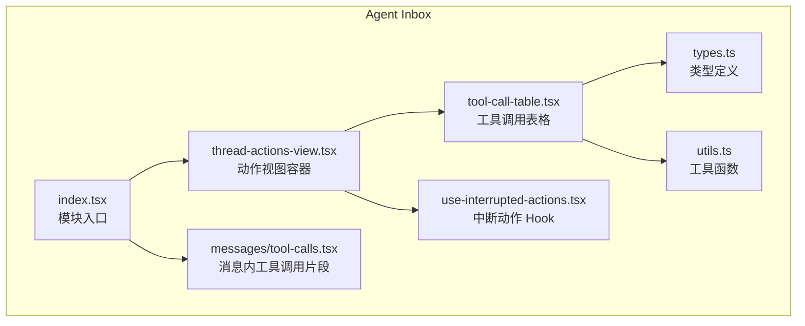
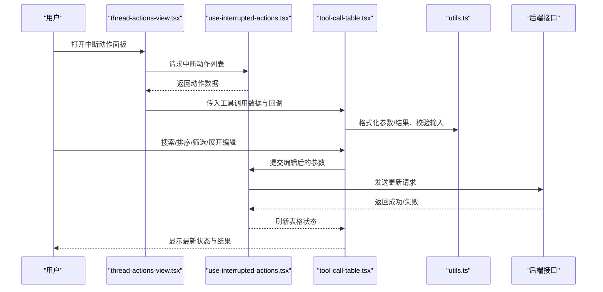
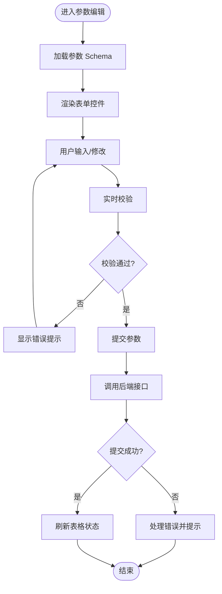
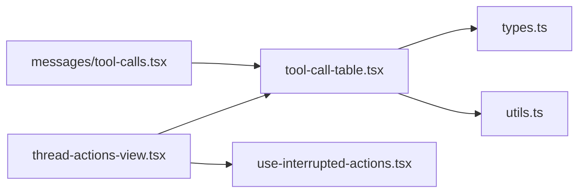

# 工具调用表格

<cite>
**本文引用的文件**   
- [tool-call-table.tsx](file://apps/web/src/components/thread/agent-inbox/components/tool-call-table.tsx)
- [thread-actions-view.tsx](file://apps/web/src/components/thread/agent-inbox/components/thread-actions-view.tsx)
- [types.ts](file://apps/web/src/components/thread/agent-inbox/types.ts)
- [utils.ts](file://apps/web/src/components/thread/agent-inbox/utils.ts)
- [use-interrupted-actions.tsx](file://apps/web/src/components/thread/agent-inbox/hooks/use-interrupted-actions.tsx)
- [index.tsx](file://apps/web/src/components/thread/agent-inbox/index.tsx)
- [messages/tool-calls.tsx](file://apps/web/src/components/thread/messages/tool-calls.tsx)
</cite>

## 目录
1. [简介](#简介)
2. [项目结构](#项目结构)
3. [核心组件](#核心组件)
4. [架构总览](#架构总览)
5. [详细组件分析](#详细组件分析)
6. [依赖关系分析](#依赖关系分析)
7. [性能考虑](#性能考虑)
8. [故障排查指南](#故障排查指南)
9. [结论](#结论)
10. [附录](#附录)

## 简介
本文件为“工具调用表格”组件的完整技术文档，面向前端与全栈开发者。内容覆盖：
- 工具调用的数据结构定义与类型约束
- 表格渲染逻辑（列、行、状态标记）
- 交互功能（排序、筛选、搜索、分页、展开/折叠）
- 参数编辑器实现（数据类型支持、校验规则、提交流程）
- 调用历史展示、执行状态标记与结果数据格式化
- 自定义列定义、扩展工具类型与数据绑定方式
- 性能优化策略与可访问性建议

## 项目结构
该功能位于 Web 应用的 agent-inbox 模块中，围绕“线程中断动作”的可视化与编辑展开。关键文件职责如下：
- tool-call-table.tsx：工具调用表格的核心渲染与交互
- thread-actions-view.tsx：将中断动作列表与表格组合，提供上下文与操作入口
- types.ts：工具调用相关的数据结构与类型定义
- utils.ts：工具调用数据的转换、格式化与校验辅助函数
- use-interrupted-actions.tsx：获取并管理中断动作的状态与副作用
- index.tsx：模块入口，聚合导出与集成点
- messages/tool-calls.tsx：消息流中的工具调用片段渲染（与表格互补）

图表来源
- [index.tsx](file://apps/web/src/components/thread/agent-inbox/index.tsx)
- [thread-actions-view.tsx](file://apps/web/src/components/thread/agent-inbox/components/thread-actions-view.tsx)
- [tool-call-table.tsx](file://apps/web/src/components/thread/agent-inbox/components/tool-call-table.tsx)
- [use-interrupted-actions.tsx](file://apps/web/src/components/thread/agent-inbox/hooks/use-interrupted-actions.tsx)
- [types.ts](file://apps/web/src/components/thread/agent-inbox/types.ts)
- [utils.ts](file://apps/web/src/components/thread/agent-inbox/utils.ts)
- [messages/tool-calls.tsx](file://apps/web/src/components/thread/messages/tool-calls.tsx)

章节来源
- [index.tsx](file://apps/web/src/components/thread/agent-inbox/index.tsx)
- [thread-actions-view.tsx](file://apps/web/src/components/thread/agent-inbox/components/thread-actions-view.tsx)
- [tool-call-table.tsx](file://apps/web/src/components/thread/agent-inbox/components/tool-call-table.tsx)
- [use-interrupted-actions.tsx](file://apps/web/src/components/thread/agent-inbox/hooks/use-interrupted-actions.tsx)
- [types.ts](file://apps/web/src/components/thread/agent-inbox/types.ts)
- [utils.ts](file://apps/web/src/components/thread/agent-inbox/utils.ts)
- [messages/tool-calls.tsx](file://apps/web/src/components/thread/messages/tool-calls.tsx)

## 核心组件
- 工具调用表格（tool-call-table.tsx）
  - 负责渲染工具调用列表，支持按名称、时间、状态等维度排序；提供搜索过滤；支持行内展开查看参数与结果；支持批量或单条编辑并提交。
- 动作视图容器（thread-actions-view.tsx）
  - 承接中断动作数据源，驱动表格渲染，并提供全局操作（如全部重试、取消、确认）。
- 中断动作 Hook（use-interrupted-actions.tsx）
  - 封装从上游获取中断动作、维护本地状态（选中、编辑态）、触发提交与刷新等副作用。
- 类型与工具（types.ts, utils.ts）
  - 定义工具调用条目、参数 Schema、校验规则、格式化输出等。

章节来源
- [tool-call-table.tsx](file://apps/web/src/components/thread/agent-inbox/components/tool-call-table.tsx)
- [thread-actions-view.tsx](file://apps/web/src/components/thread/agent-inbox/components/thread-actions-view.tsx)
- [use-interrupted-actions.tsx](file://apps/web/src/components/thread/agent-inbox/hooks/use-interrupted-actions.tsx)
- [types.ts](file://apps/web/src/components/thread/agent-inbox/types.ts)
- [utils.ts](file://apps/web/src/components/thread/agent-inbox/utils.ts)

## 架构总览
下图展示了从数据源到 UI 渲染与用户交互的关键路径，以及提交回写流程。

图表来源
- [thread-actions-view.tsx](file://apps/web/src/components/thread/agent-inbox/components/thread-actions-view.tsx)
- [use-interrupted-actions.tsx](file://apps/web/src/components/thread/agent-inbox/hooks/use-interrupted-actions.tsx)
- [tool-call-table.tsx](file://apps/web/src/components/thread/agent-inbox/components/tool-call-table.tsx)
- [utils.ts](file://apps/web/src/components/thread/agent-inbox/utils.ts)

## 详细组件分析

### 数据结构与类型
- 工具调用条目
  - 字段通常包括：唯一标识、工具名、参数对象、执行状态、结果对象、时间戳、错误信息等。
- 参数 Schema
  - 描述每个参数的类型、是否必填、默认值、枚举值、范围限制、正则表达式等。
- 校验规则
  - 基于 Schema 对输入进行实时校验，反馈错误信息，阻止非法提交。
- 结果格式
  - 统一转换为可读文本或结构化对象，便于表格展示与导出。

章节来源
- [types.ts](file://apps/web/src/components/thread/agent-inbox/types.ts)
- [utils.ts](file://apps/web/src/components/thread/agent-inbox/utils.ts)

### 表格渲染逻辑
- 列定义
  - 基础列：工具名、状态、时间；可选列：参数摘要、结果摘要、操作按钮。
  - 自定义列：通过配置扩展列渲染器，支持富文本、链接、图标等。
- 行渲染
  - 根据状态显示不同样式与图标；支持展开行查看完整参数与结果。
- 排序与筛选
  - 支持多列排序（升/降序），支持按工具名、状态、时间范围筛选。
- 搜索
  - 全文搜索工具名、参数键名、结果关键字，支持高亮匹配。
- 分页与虚拟化
  - 大数据量场景启用虚拟滚动，减少重绘与内存占用。

章节来源
- [tool-call-table.tsx](file://apps/web/src/components/thread/agent-inbox/components/tool-call-table.tsx)
- [utils.ts](file://apps/web/src/components/thread/agent-inbox/utils.ts)

### 参数编辑器与验证
- 编辑器形态
  - 根据参数类型动态生成表单控件：字符串、数字、布尔、枚举、数组、对象等。
  - 支持嵌套对象与数组项增删改。
- 数据类型支持
  - 内置常见类型映射；可扩展自定义类型解析器与渲染器。
- 验证规则
  - 实时校验必填、类型、范围、正则；错误提示定位到具体字段。
- 提交流程
  - 编辑完成后触发校验，通过后组装参数对象，调用 Hook 提交至后端。

图表来源
- [tool-call-table.tsx](file://apps/web/src/components/thread/agent-inbox/components/tool-call-table.tsx)
- [utils.ts](file://apps/web/src/components/thread/agent-inbox/utils.ts)

章节来源
- [tool-call-table.tsx](file://apps/web/src/components/thread/agent-inbox/components/tool-call-table.tsx)
- [utils.ts](file://apps/web/src/components/thread/agent-inbox/utils.ts)

### 调用历史、执行状态与结果格式化
- 调用历史
  - 每条工具调用记录包含时间线，支持回溯查看历史版本参数与结果。
- 执行状态
  - 状态机：待执行、执行中、成功、失败、已取消；不同状态对应不同颜色与图标。
- 结果格式化
  - 自动识别 JSON、文本、图片、文件链接等，提供预览与下载能力。

章节来源
- [tool-call-table.tsx](file://apps/web/src/components/thread/agent-inbox/components/tool-call-table.tsx)
- [utils.ts](file://apps/web/src/components/thread/agent-inbox/utils.ts)

### 排序、筛选、搜索与性能优化
- 排序
  - 客户端排序优先，大数据量时采用服务端排序接口。
- 筛选
  - 支持多选、区间选择、模糊匹配；复杂条件支持保存为模板。
- 搜索
  - 防抖搜索，增量索引；支持高级查询语法。
- 性能优化
  - 虚拟滚动、行级懒加载、缓存排序与筛选结果、Web Worker 处理重型计算。

章节来源
- [tool-call-table.tsx](file://apps/web/src/components/thread/agent-inbox/components/tool-call-table.tsx)
- [utils.ts](file://apps/web/src/components/thread/agent-inbox/utils.ts)

### 自定义列定义、扩展工具类型与数据绑定
- 自定义列
  - 提供列配置接口，允许注入渲染函数、过滤器、排序器。
- 扩展工具类型
  - 注册新的工具类型处理器，定义参数 Schema 与结果渲染器。
- 数据绑定
  - 单向数据流：Hook 提供数据，表格消费；双向绑定通过回调更新状态。

章节来源
- [tool-call-table.tsx](file://apps/web/src/components/thread/agent-inbox/components/tool-call-table.tsx)
- [types.ts](file://apps/web/src/components/thread/agent-inbox/types.ts)

### 与消息流的集成
- 在消息流中展示工具调用片段，点击可跳转或展开详情，与表格联动保持状态一致。

章节来源
- [messages/tool-calls.tsx](file://apps/web/src/components/thread/messages/tool-calls.tsx)

## 依赖关系分析
- 组件耦合
  - tool-call-table.tsx 依赖 types.ts 与 utils.ts；受 thread-actions-view.tsx 驱动。
- 外部依赖
  - 可能依赖 UI 库（表格、表单、弹窗）、网络请求库、状态管理库。
- 潜在循环依赖
  - 避免表格与 Hook 之间直接相互引用，通过回调与事件解耦。

图表来源
- [tool-call-table.tsx](file://apps/web/src/components/thread/agent-inbox/components/tool-call-table.tsx)
- [thread-actions-view.tsx](file://apps/web/src/components/thread/agent-inbox/components/thread-actions-view.tsx)
- [use-interrupted-actions.tsx](file://apps/web/src/components/thread/agent-inbox/hooks/use-interrupted-actions.tsx)
- [types.ts](file://apps/web/src/components/thread/agent-inbox/types.ts)
- [utils.ts](file://apps/web/src/components/thread/agent-inbox/utils.ts)
- [messages/tool-calls.tsx](file://apps/web/src/components/thread/messages/tool-calls.tsx)

章节来源
- [tool-call-table.tsx](file://apps/web/src/components/thread/agent-inbox/components/tool-call-table.tsx)
- [thread-actions-view.tsx](file://apps/web/src/components/thread/agent-inbox/components/thread-actions-view.tsx)
- [use-interrupted-actions.tsx](file://apps/web/src/components/thread/agent-inbox/hooks/use-interrupted-actions.tsx)
- [types.ts](file://apps/web/src/components/thread/agent-inbox/types.ts)
- [utils.ts](file://apps/web/src/components/thread/agent-inbox/utils.ts)
- [messages/tool-calls.tsx](file://apps/web/src/components/thread/messages/tool-calls.tsx)

## 性能考虑
- 渲染优化
  - 使用虚拟列表、行级 memoization、按需加载详情。
- 数据处理
  - 防抖搜索、节流输入、增量更新、缓存中间结果。
- 网络优化
  - 分页加载、并发控制、重试与退避策略。
- 内存管理
  - 及时释放订阅、清理定时器、避免闭包泄漏。

[本节为通用指导，不直接分析具体文件]

## 故障排查指南
- 常见问题
  - 参数校验失败：检查 Schema 定义与输入类型一致性。
  - 状态不同步：确认 Hook 状态更新与表格刷新时机。
  - 搜索结果异常：检查搜索关键词与索引构建逻辑。
  - 性能问题：监控渲染帧率与内存占用，定位重渲染热点。
- 调试建议
  - 启用开发日志与错误边界；使用浏览器性能面板分析瓶颈。
  - 针对复杂参数编辑器，逐步断点验证表单控件渲染与事件处理。

章节来源
- [tool-call-table.tsx](file://apps/web/src/components/thread/agent-inbox/components/tool-call-table.tsx)
- [utils.ts](file://apps/web/src/components/thread/agent-inbox/utils.ts)
- [use-interrupted-actions.tsx](file://apps/web/src/components/thread/agent-inbox/hooks/use-interrupted-actions.tsx)

## 结论
工具调用表格组件以清晰的数据结构与模块化设计为基础，提供了强大的渲染、交互与扩展能力。通过合理的性能优化与完善的错误处理，能够在大规模数据与复杂参数场景下保持稳定与高效。建议在实际使用中结合业务需求定制列定义与工具类型，确保用户体验与系统可维护性。

[本节为总结性内容，不直接分析具体文件]

## 附录
- 最佳实践
  - 将复杂逻辑下沉至 utils.ts，保持组件简洁。
  - 使用类型安全的前端校验，减少后端压力。
  - 为关键路径添加单元测试与端到端测试。
- 扩展指南
  - 新增工具类型：在 types.ts 中扩展类型定义，在 utils.ts 中实现解析与格式化。
  - 自定义列：在表格配置中注册渲染器与过滤器。
  - 数据绑定：通过 Hook 暴露统一接口，确保状态一致性。

[本节为补充说明，不直接分析具体文件]