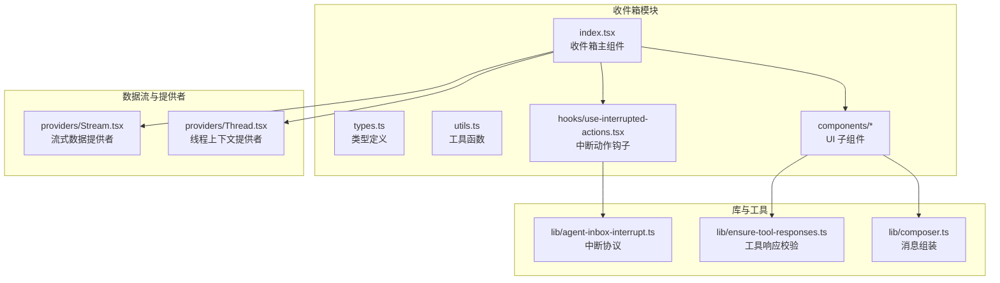
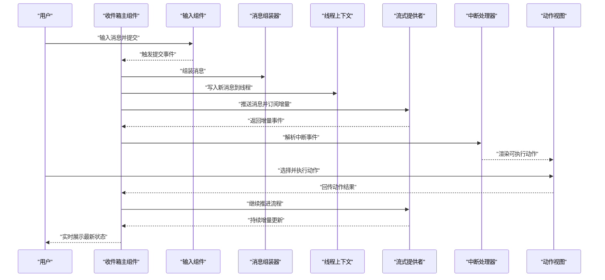
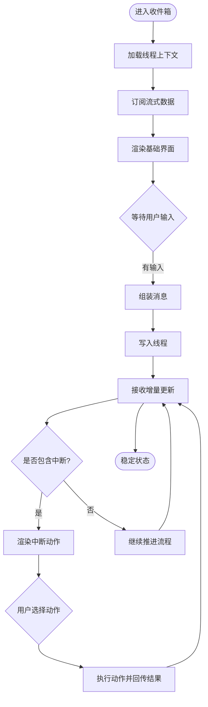
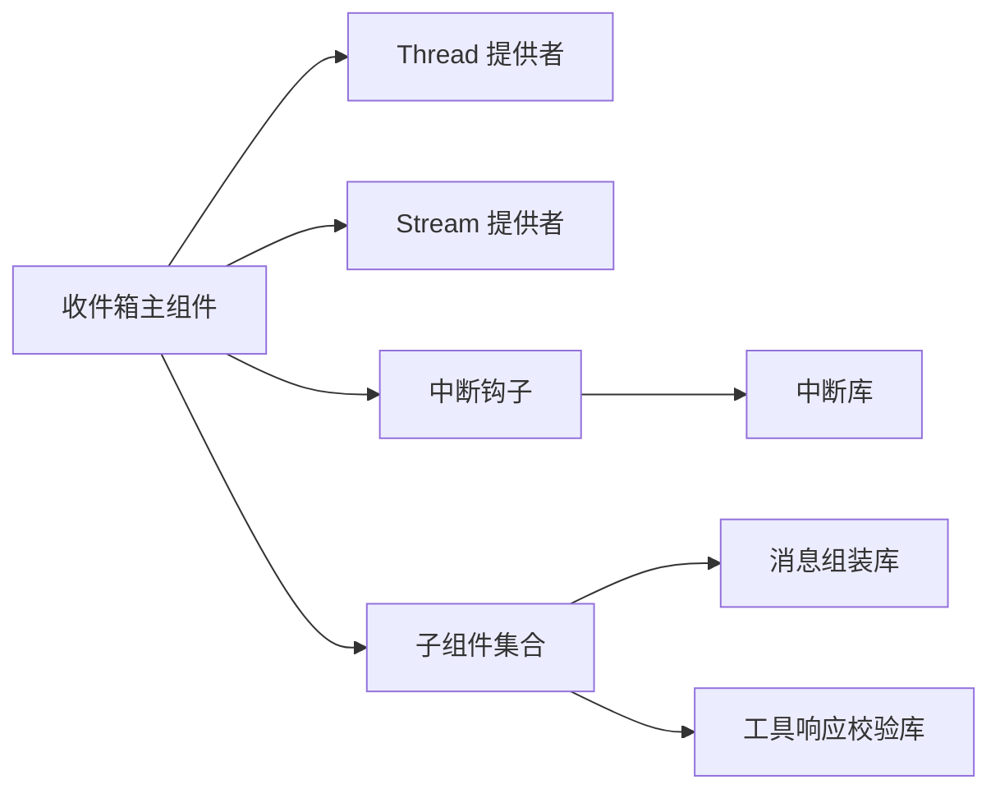

# 收件箱核心组件

<cite>
**本文档引用的文件**   
- [apps/web/src/components/thread/agent-inbox/index.tsx](file://apps/web/src/components/thread/agent-inbox/index.tsx)
- [apps/web/src/components/thread/agent-inbox/types.ts](file://apps/web/src/components/thread/agent-inbox/types.ts)
- [apps/web/src/components/thread/agent-inbox/utils.ts](file://apps/web/src/components/thread/agent-inbox/utils.ts)
- [apps/web/src/components/thread/agent-inbox/hooks/use-interrupted-actions.tsx](file://apps/web/src/components/thread/agent-inbox/hooks/use-interrupted-actions.tsx)
- [apps/web/src/components/thread/agent-inbox/components/inbox-item-input.tsx](file://apps/web/src/components/thread/agent-inbox/components/inbox-item-input.tsx)
- [apps/web/src/components/thread/agent-inbox/components/state-view.tsx](file://apps/web/src/components/thread/agent-inbox/components/state-view.tsx)
- [apps/web/src/components/thread/agent-inbox/components/thread-actions-view.tsx](file://apps/web/src/components/thread/agent-inbox/components/thread-actions-view.tsx)
- [apps/web/src/components/thread/agent-inbox/components/thread-id.tsx](file://apps/web/src/components/thread/agent-inbox/components/thread-id.tsx)
- [apps/web/src/components/thread/agent-inbox/components/tool-call-table.tsx](file://apps/web/src/components/thread/agent-inbox/components/tool-call-table.tsx)
- [apps/web/src/providers/Stream.tsx](file://apps/web/src/providers/Stream.tsx)
- [apps/web/src/providers/Thread.tsx](file://apps/web/src/providers/Thread.tsx)
- [apps/web/src/lib/agent-inbox-interrupt.ts](file://apps/web/src/lib/agent-inbox-interrupt.ts)
- [apps/web/src/lib/composer.ts](file://apps/web/src/lib/composer.ts)
- [apps/web/src/lib/ensure-tool-responses.ts](file://apps/web/src/lib/ensure-tool-responses.ts)
- [apps/web/src/app/layout.tsx](file://apps/web/src/app/layout.tsx)
- [apps/web/src/app/page.tsx](file://apps/web/src/app/page.tsx)
</cite>

## 目录
1. [简介](#简介)
2. [项目结构](#项目结构)
3. [核心组件](#核心组件)
4. [架构总览](#架构总览)
5. [详细组件分析](#详细组件分析)
6. [依赖关系分析](#依赖关系分析)
7. [性能考虑](#性能考虑)
8. [故障排查指南](#故障排查指南)
9. [结论](#结论)
10. [附录](#附录)

## 简介
本文件为 Agent 收件箱核心组件的技术文档，聚焦于收件箱主组件的架构设计、状态管理、数据流处理与用户交互。内容涵盖线程列表渲染、消息显示、中断动作处理、主题定制与响应式布局、与后端 API 的通信机制、实时消息更新以及错误处理策略。同时提供集成示例与自定义扩展指南，帮助开发者快速接入并扩展收件箱能力。

## 项目结构
收件箱核心位于前端 Web 应用中的 thread/agent-inbox 模块，围绕“线程”和“中断动作”两大概念组织：
- 入口与类型定义：index.tsx、types.ts、utils.ts
- 交互与视图：components 下的输入框、状态查看器、动作视图、工具调用表等
- 钩子与逻辑：hooks/use-interrupted-actions.tsx
- 数据流与提供者：providers/Stream.tsx、providers/Thread.tsx
- 中断与工具响应：lib/agent-inbox-interrupt.ts、lib/ensure-tool-responses.ts、lib/composer.ts
- 页面与布局：app/layout.tsx、app/page.tsx

图表来源
- [apps/web/src/components/thread/agent-inbox/index.tsx](file://apps/web/src/components/thread/agent-inbox/index.tsx)
- [apps/web/src/components/thread/agent-inbox/types.ts](file://apps/web/src/components/thread/agent-inbox/types.ts)
- [apps/web/src/components/thread/agent-inbox/utils.ts](file://apps/web/src/components/thread/agent-inbox/utils.ts)
- [apps/web/src/components/thread/agent-inbox/hooks/use-interrupted-actions.tsx](file://apps/web/src/components/thread/agent-inbox/hooks/use-interrupted-actions.tsx)
- [apps/web/src/providers/Stream.tsx](file://apps/web/src/providers/Stream.tsx)
- [apps/web/src/providers/Thread.tsx](file://apps/web/src/providers/Thread.tsx)
- [apps/web/src/lib/agent-inbox-interrupt.ts](file://apps/web/src/lib/agent-inbox-interrupt.ts)
- [apps/web/src/lib/ensure-tool-responses.ts](file://apps/web/src/lib/ensure-tool-responses.ts)
- [apps/web/src/lib/composer.ts](file://apps/web/src/lib/composer.ts)

章节来源
- [apps/web/src/components/thread/agent-inbox/index.tsx](file://apps/web/src/components/thread/agent-inbox/index.tsx)
- [apps/web/src/components/thread/agent-inbox/types.ts](file://apps/web/src/components/thread/agent-inbox/types.ts)
- [apps/web/src/components/thread/agent-inbox/utils.ts](file://apps/web/src/components/thread/agent-inbox/utils.ts)
- [apps/web/src/components/thread/agent-inbox/hooks/use-interrupted-actions.tsx](file://apps/web/src/components/thread/agent-inbox/hooks/use-interrupted-actions.tsx)
- [apps/web/src/providers/Stream.tsx](file://apps/web/src/providers/Stream.tsx)
- [apps/web/src/providers/Thread.tsx](file://apps/web/src/providers/Thread.tsx)
- [apps/web/src/lib/agent-inbox-interrupt.ts](file://apps/web/src/lib/agent-inbox-interrupt.ts)
- [apps/web/src/lib/ensure-tool-responses.ts](file://apps/web/src/lib/ensure-tool-responses.ts)
- [apps/web/src/lib/composer.ts](file://apps/web/src/lib/composer.ts)

## 核心组件
- 收件箱主组件（index.tsx）
  - 职责：聚合线程上下文、流式数据、中断动作与 UI 子组件；协调用户输入、消息发送、中断处理与结果展示。
  - 关键特性：
    - 通过 Thread 提供者获取当前线程与消息历史
    - 通过 Stream 提供者订阅增量事件，驱动消息实时更新
    - 使用 useInterruptedActions 钩子监听并处理中断动作
    - 组合 inbox-item-input、thread-actions-view、state-view、tool-call-table 等子组件完成交互与展示
- 类型与工具（types.ts、utils.ts）
  - 定义收件箱相关的数据模型、事件结构与配置项
  - 提供格式化、校验、ID 生成等工具方法
- 中断动作钩子（use-interrupted-actions.tsx）
  - 封装中断协议的解析、匹配与回调执行
  - 将中断动作暴露为可渲染的 UI 元素与操作按钮
- 子组件（components/*）
  - inbox-item-input：用户输入与提交
  - state-view：线程状态可视化
  - thread-actions-view：中断动作列表与交互
  - thread-id：线程标识展示与复制
  - tool-call-table：工具调用记录表格

章节来源
- [apps/web/src/components/thread/agent-inbox/index.tsx](file://apps/web/src/components/thread/agent-inbox/index.tsx)
- [apps/web/src/components/thread/agent-inbox/types.ts](file://apps/web/src/components/thread/agent-inbox/types.ts)
- [apps/web/src/components/thread/agent-inbox/utils.ts](file://apps/web/src/components/thread/agent-inbox/utils.ts)
- [apps/web/src/components/thread/agent-inbox/hooks/use-interrupted-actions.tsx](file://apps/web/src/components/thread/agent-inbox/hooks/use-interrupted-actions.tsx)
- [apps/web/src/components/thread/agent-inbox/components/inbox-item-input.tsx](file://apps/web/src/components/thread/agent-inbox/components/inbox-item-input.tsx)
- [apps/web/src/components/thread/agent-inbox/components/state-view.tsx](file://apps/web/src/components/thread/agent-inbox/components/state-view.tsx)
- [apps/web/src/components/thread/agent-inbox/components/thread-actions-view.tsx](file://apps/web/src/components/thread/agent-inbox/components/thread-actions-view.tsx)
- [apps/web/src/components/thread/agent-inbox/components/thread-id.tsx](file://apps/web/src/components/thread/agent-inbox/components/thread-id.tsx)
- [apps/web/src/components/thread/agent-inbox/components/tool-call-table.tsx](file://apps/web/src/components/thread/agent-inbox/components/tool-call-table.tsx)

## 架构总览
收件箱采用“提供者 + 钩子 + 组件”的分层架构：
- 提供者层：Thread 与 Stream 分别维护线程上下文与流式数据通道
- 逻辑层：useInterruptedActions 钩子负责中断协议解析与动作调度
- 表现层：各子组件专注 UI 渲染与用户交互
- 工具层：composer、ensureToolResponses、agentInboxInterrupt 等库提供消息组装、响应校验与中断协议支持

图表来源
- [apps/web/src/components/thread/agent-inbox/index.tsx](file://apps/web/src/components/thread/agent-inbox/index.tsx)
- [apps/web/src/lib/composer.ts](file://apps/web/src/lib/composer.ts)
- [apps/web/src/providers/Thread.tsx](file://apps/web/src/providers/Thread.tsx)
- [apps/web/src/providers/Stream.tsx](file://apps/web/src/providers/Stream.tsx)
- [apps/web/src/lib/agent-inbox-interrupt.ts](file://apps/web/src/lib/agent-inbox-interrupt.ts)
- [apps/web/src/components/thread/agent-inbox/components/thread-actions-view.tsx](file://apps/web/src/components/thread/agent-inbox/components/thread-actions-view.tsx)

## 详细组件分析

### 收件箱主组件（index.tsx）
- 架构要点
  - 通过 Thread 提供者读取线程 ID、消息历史与状态
  - 通过 Stream 提供者订阅增量事件，驱动 UI 实时更新
  - 使用 useInterruptedActions 钩子监听中断事件，渲染动作视图
  - 组合输入组件与工具调用表格，形成完整的交互闭环
- 数据流
  - 用户输入 -> 消息组装 -> 写入线程 -> 流式推送 -> 增量更新 -> 中断解析 -> 动作执行 -> 结果回写
- 错误处理
  - 对网络异常、中断协议不匹配、工具响应校验失败进行捕获与提示
- 主题与响应式
  - 基于 Tailwind 类名实现主题定制与响应式布局
  - 通过 CSS 变量或主题开关控制颜色与间距

图表来源
- [apps/web/src/components/thread/agent-inbox/index.tsx](file://apps/web/src/components/thread/agent-inbox/index.tsx)
- [apps/web/src/lib/composer.ts](file://apps/web/src/lib/composer.ts)
- [apps/web/src/providers/Thread.tsx](file://apps/web/src/providers/Thread.tsx)
- [apps/web/src/providers/Stream.tsx](file://apps/web/src/providers/Stream.tsx)
- [apps/web/src/lib/agent-inbox-interrupt.ts](file://apps/web/src/lib/agent-inbox-interrupt.ts)

章节来源
- [apps/web/src/components/thread/agent-inbox/index.tsx](file://apps/web/src/components/thread/agent-inbox/index.tsx)

### 中断动作钩子（use-interrupted-actions.tsx）
- 职责
  - 监听流式事件，识别中断信号
  - 根据中断协议解析动作参数与元数据
  - 暴露动作列表与执行回调给上层组件
- 关键点
  - 动作去重与幂等性保证
  - 异步执行与错误回传
  - 与 UI 层的解耦，仅关注数据与回调

章节来源
- [apps/web/src/components/thread/agent-inbox/hooks/use-interrupted-actions.tsx](file://apps/web/src/components/thread/agent-inbox/hooks/use-interrupted-actions.tsx)
- [apps/web/src/lib/agent-inbox-interrupt.ts](file://apps/web/src/lib/agent-inbox-interrupt.ts)

### 输入组件（inbox-item-input.tsx）
- 功能
  - 文本输入、附件上传、快捷键支持
  - 提交前校验与防抖
  - 与 composer 协作组装消息体
- 交互
  - 回车提交、清空、禁用态
  - 错误提示与加载反馈

章节来源
- [apps/web/src/components/thread/agent-inbox/components/inbox-item-input.tsx](file://apps/web/src/components/thread/agent-inbox/components/inbox-item-input.tsx)
- [apps/web/src/lib/composer.ts](file://apps/web/src/lib/composer.ts)

### 状态查看器（state-view.tsx）
- 功能
  - 展示线程状态、运行阶段与关键指标
  - 支持折叠/展开与刷新
- 数据源
  - 从 Thread 提供者读取状态字段

章节来源
- [apps/web/src/components/thread/agent-inbox/components/state-view.tsx](file://apps/web/src/components/thread/agent-inbox/components/state-view.tsx)
- [apps/web/src/providers/Thread.tsx](file://apps/web/src/providers/Thread.tsx)

### 动作视图（thread-actions-view.tsx）
- 功能
  - 渲染中断动作列表与按钮
  - 处理用户点击并调用动作回调
- 安全
  - 对动作参数进行白名单校验
  - 限制敏感操作的执行范围

章节来源
- [apps/web/src/components/thread/agent-inbox/components/thread-actions-view.tsx](file://apps/web/src/components/thread/agent-inbox/components/thread-actions-view.tsx)
- [apps/web/src/lib/agent-inbox-interrupt.ts](file://apps/web/src/lib/agent-inbox-interrupt.ts)

### 线程标识（thread-id.tsx）
- 功能
  - 显示线程 ID，支持一键复制
  - 用于调试与日志关联

章节来源
- [apps/web/src/components/thread/agent-inbox/components/thread-id.tsx](file://apps/web/src/components/thread/agent-inbox/components/thread-id.tsx)

### 工具调用表（tool-call-table.tsx）
- 功能
  - 展示工具调用记录、参数与返回值
  - 支持排序、筛选与导出
- 数据
  - 从流式事件或线程状态中抽取工具调用信息

章节来源
- [apps/web/src/components/thread/agent-inbox/components/tool-call-table.tsx](file://apps/web/src/components/thread/agent-inbox/components/tool-call-table.tsx)

### 提供者与数据流（Stream.tsx、Thread.tsx）
- Thread 提供者
  - 维护线程上下文（ID、消息历史、状态）
  - 提供读写接口供组件订阅与更新
- Stream 提供者
  - 建立与服务端的增量数据通道
  - 分发事件至订阅者，驱动 UI 实时更新
  - 处理断线重连与错误恢复

章节来源
- [apps/web/src/providers/Thread.tsx](file://apps/web/src/providers/Thread.tsx)
- [apps/web/src/providers/Stream.tsx](file://apps/web/src/providers/Stream.tsx)

### 库与工具（composer.ts、ensure-tool-responses.ts、agent-inbox-interrupt.ts）
- composer.ts
  - 统一消息组装逻辑，支持多模态与结构化字段
- ensure-tool-responses.ts
  - 校验工具响应是否符合预期 Schema，失败时抛出明确错误
- agent-inbox-interrupt.ts
  - 定义中断协议与解析规则，确保前后端一致性

章节来源
- [apps/web/src/lib/composer.ts](file://apps/web/src/lib/composer.ts)
- [apps/web/src/lib/ensure-tool-responses.ts](file://apps/web/src/lib/ensure-tool-responses.ts)
- [apps/web/src/lib/agent-inbox-interrupt.ts](file://apps/web/src/lib/agent-inbox-interrupt.ts)

## 依赖关系分析
- 组件耦合
  - 收件箱主组件依赖 Thread 与 Stream 提供者，低耦合地获取数据与事件
  - 子组件仅依赖必要的 props 与回调，避免直接访问全局状态
- 外部依赖
  - Tailwind 用于样式与主题
  - 浏览器 API 用于剪贴板、本地存储等
- 潜在循环依赖
  - 通过钩子与库函数解耦，避免组件间直接互相引用

图表来源
- [apps/web/src/components/thread/agent-inbox/index.tsx](file://apps/web/src/components/thread/agent-inbox/index.tsx)
- [apps/web/src/providers/Thread.tsx](file://apps/web/src/providers/Thread.tsx)
- [apps/web/src/providers/Stream.tsx](file://apps/web/src/providers/Stream.tsx)
- [apps/web/src/components/thread/agent-inbox/hooks/use-interrupted-actions.tsx](file://apps/web/src/components/thread/agent-inbox/hooks/use-interrupted-actions.tsx)
- [apps/web/src/lib/agent-inbox-interrupt.ts](file://apps/web/src/lib/agent-inbox-interrupt.ts)
- [apps/web/src/lib/composer.ts](file://apps/web/src/lib/composer.ts)
- [apps/web/src/lib/ensure-tool-responses.ts](file://apps/web/src/lib/ensure-tool-responses.ts)

章节来源
- [apps/web/src/components/thread/agent-inbox/index.tsx](file://apps/web/src/components/thread/agent-inbox/index.tsx)
- [apps/web/src/providers/Thread.tsx](file://apps/web/src/providers/Thread.tsx)
- [apps/web/src/providers/Stream.tsx](file://apps/web/src/providers/Stream.tsx)
- [apps/web/src/components/thread/agent-inbox/hooks/use-interrupted-actions.tsx](file://apps/web/src/components/thread/agent-inbox/hooks/use-interrupted-actions.tsx)
- [apps/web/src/lib/agent-inbox-interrupt.ts](file://apps/web/src/lib/agent-inbox-interrupt.ts)
- [apps/web/src/lib/composer.ts](file://apps/web/src/lib/composer.ts)
- [apps/web/src/lib/ensure-tool-responses.ts](file://apps/web/src/lib/ensure-tool-responses.ts)

## 性能考虑
- 增量更新
  - 通过 Stream 提供者仅渲染变更片段，减少全量重绘
- 去重与节流
  - 对重复中断动作进行去重，避免重复执行
  - 输入框提交进行防抖，降低频繁请求
- 内存管理
  - 及时清理订阅与事件监听，防止内存泄漏
- 渲染优化
  - 使用 React.memo 包裹纯展示组件
  - 大列表虚拟化（如需要）提升滚动性能

[本节为通用指导，无需特定文件来源]

## 故障排查指南
- 常见问题
  - 流式连接断开：检查网络与后端服务状态，启用自动重连
  - 中断协议不匹配：核对前后端中断定义与版本兼容性
  - 工具响应校验失败：确认返回字段符合预期 Schema
- 定位手段
  - 使用 thread-id 组件复制线程 ID，便于服务端日志追踪
  - 打开 state-view 查看线程状态与阶段
  - 在工具调用表中筛选错误记录，定位具体工具与参数
- 错误处理策略
  - 对用户可见的错误进行友好提示
  - 对不可恢复错误进行降级与重试
  - 记录关键错误上下文，便于后续分析

章节来源
- [apps/web/src/components/thread/agent-inbox/components/thread-id.tsx](file://apps/web/src/components/thread/agent-inbox/components/thread-id.tsx)
- [apps/web/src/components/thread/agent-inbox/components/state-view.tsx](file://apps/web/src/components/thread/agent-inbox/components/state-view.tsx)
- [apps/web/src/components/thread/agent-inbox/components/tool-call-table.tsx](file://apps/web/src/components/thread/agent-inbox/components/tool-call-table.tsx)
- [apps/web/src/lib/ensure-tool-responses.ts](file://apps/web/src/lib/ensure-tool-responses.ts)
- [apps/web/src/lib/agent-inbox-interrupt.ts](file://apps/web/src/lib/agent-inbox-interrupt.ts)

## 结论
收件箱核心组件以清晰的提供者与钩子分层实现了高内聚、低耦合的架构。通过流式数据与中断协议，支撑了实时消息更新与交互式动作执行。结合主题定制与响应式布局，提供了良好的用户体验与可扩展性。建议在生产环境中完善错误监控与性能观测，持续提升稳定性与可维护性。

[本节为总结性内容，无需特定文件来源]

## 附录
- 集成示例
  - 在页面中引入 Thread 与 Stream 提供者，包裹收件箱主组件
  - 配置线程 ID 与初始消息，启动收件箱会话
- 自定义扩展
  - 新增中断动作：在 interrupt 库中定义协议，并在动作视图中渲染对应 UI
  - 扩展工具调用：在 ensureToolResponses 中增加校验规则，并在表格中展示
  - 主题定制：通过 Tailwind 变量覆盖默认样式，实现品牌化外观

[本节为概念性内容，无需特定文件来源]