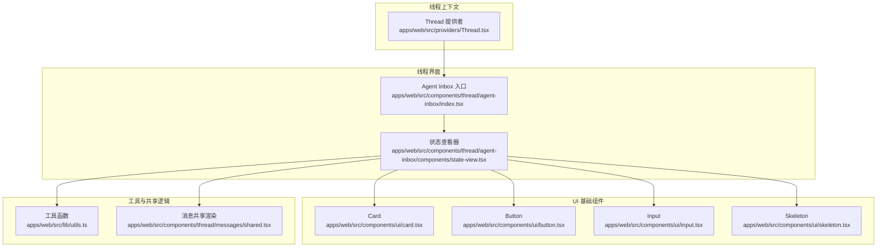
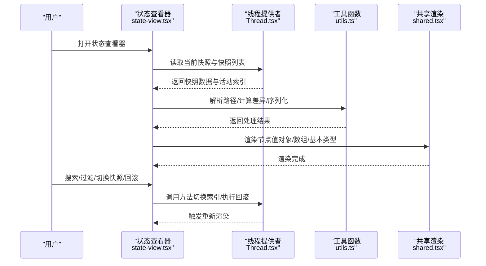
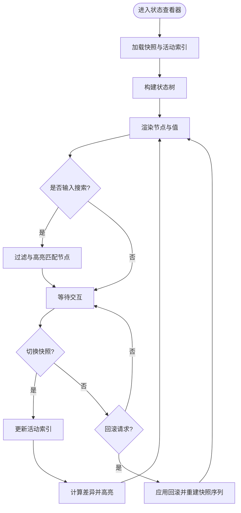
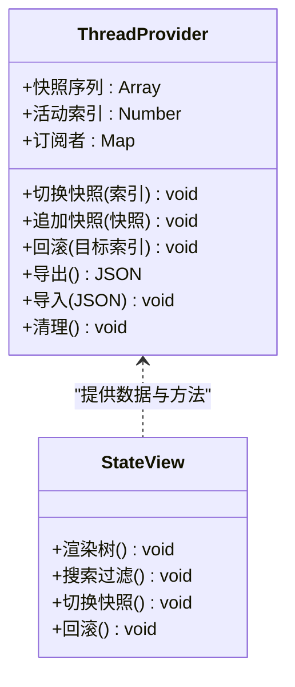
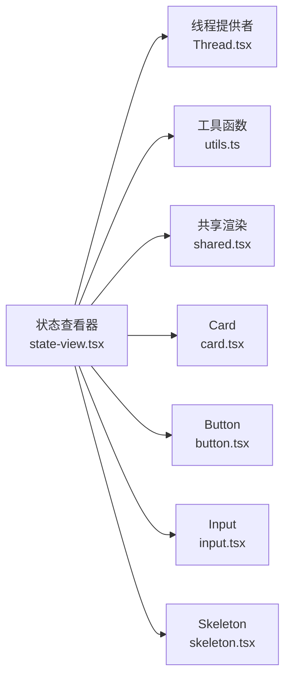

# 状态查看器

<cite>
**本文引用的文件**   
- [apps/web/src/components/thread/agent-inbox/components/state-view.tsx](file://apps/web/src/components/thread/agent-inbox/components/state-view.tsx)
- [apps/web/src/components/thread/agent-inbox/index.tsx](file://apps/web/src/components/thread/agent-inbox/index.tsx)
- [apps/web/src/providers/Thread.tsx](file://apps/web/src/providers/Thread.tsx)
- [apps/web/src/lib/utils.ts](file://apps/web/src/lib/utils.ts)
- [apps/web/src/components/ui/card.tsx](file://apps/web/src/components/ui/card.tsx)
- [apps/web/src/components/ui/button.tsx](file://apps/web/src/components/ui/button.tsx)
- [apps/web/src/components/ui/input.tsx](file://apps/web/src/components/ui/input.tsx)
- [apps/web/src/components/ui/skeleton.tsx](file://apps/web/src/components/ui/skeleton.tsx)
- [apps/web/src/components/thread/messages/shared.tsx](file://apps/web/src/components/thread/messages/shared.tsx)
</cite>

## 目录
1. [简介](#简介)
2. [项目结构](#项目结构)
3. [核心组件](#核心组件)
4. [架构总览](#架构总览)
5. [详细组件分析](#详细组件分析)
6. [依赖关系分析](#依赖关系分析)
7. [性能考虑](#性能考虑)
8. [故障排查指南](#故障排查指南)
9. [结论](#结论)
10. [附录](#附录)

## 简介
本文件为“状态查看器”组件的完整技术文档，面向开发者与产品使用者。内容涵盖：
- 系统状态的可视化展示方式与数据结构
- 实时更新机制（增量更新、事件驱动）
- 状态树的结构化展示、层级导航与搜索过滤
- 状态变更的历史记录、差异对比与版本回滚支持
- 状态数据的序列化、持久化与恢复
- 状态监控、调试工具与性能优化实践

## 项目结构
状态查看器位于 Web 应用的前端代码中，围绕“线程/会话”上下文提供状态视图能力。关键位置如下：
- 状态查看器 UI 组件：apps/web/src/components/thread/agent-inbox/components/state-view.tsx
- 线程容器与上下文提供者：apps/web/src/providers/Thread.tsx
- 线程入口聚合组件：apps/web/src/components/thread/agent-inbox/index.tsx
- 通用工具函数（如深拷贝、路径解析等）：apps/web/src/lib/utils.ts
- 基础 UI 组件（卡片、按钮、输入框、骨架屏等）：apps/web/src/components/ui/*
- 消息渲染相关工具（用于统一渲染复杂对象）：apps/web/src/components/thread/messages/shared.tsx

图表来源
- [apps/web/src/providers/Thread.tsx](file://apps/web/src/providers/Thread.tsx)
- [apps/web/src/components/thread/agent-inbox/index.tsx](file://apps/web/src/components/thread/agent-inbox/index.tsx)
- [apps/web/src/components/thread/agent-inbox/components/state-view.tsx](file://apps/web/src/components/thread/agent-inbox/components/state-view.tsx)
- [apps/web/src/lib/utils.ts](file://apps/web/src/lib/utils.ts)
- [apps/web/src/components/ui/card.tsx](file://apps/web/src/components/ui/card.tsx)
- [apps/web/src/components/ui/button.tsx](file://apps/web/src/components/ui/button.tsx)
- [apps/web/src/components/ui/input.tsx](file://apps/web/src/components/ui/input.tsx)
- [apps/web/src/components/ui/skeleton.tsx](file://apps/web/src/components/ui/skeleton.tsx)
- [apps/web/src/components/thread/messages/shared.tsx](file://apps/web/src/components/thread/messages/shared.tsx)

章节来源
- [apps/web/src/components/thread/agent-inbox/components/state-view.tsx](file://apps/web/src/components/thread/agent-inbox/components/state-view.tsx)
- [apps/web/src/components/thread/agent-inbox/index.tsx](file://apps/web/src/components/thread/agent-inbox/index.tsx)
- [apps/web/src/providers/Thread.tsx](file://apps/web/src/providers/Thread.tsx)

## 核心组件
- 状态查看器（StateView）
  - 职责：以树形结构展示当前线程的状态数据，支持展开/折叠、路径导航、关键字搜索与过滤、快照切换与差异对比、历史回溯与回滚。
  - 交互：点击节点跳转路径；输入框实时过滤；下拉或标签切换不同快照；操作按钮触发回滚或导出。
  - 数据源：从线程上下文获取当前状态快照集合与活动索引。
- 线程提供者（Thread Provider）
  - 职责：维护线程生命周期、状态快照序列、活动索引、订阅更新事件、暴露选择器与操作方法。
- 工具与共享
  - 工具函数：路径解析、深比较、序列化/反序列化、安全取值等。
  - 共享渲染：将任意对象渲染为可读的文本/表格/嵌套结构，便于在状态树中显示。

章节来源
- [apps/web/src/components/thread/agent-inbox/components/state-view.tsx](file://apps/web/src/components/thread/agent-inbox/components/state-view.tsx)
- [apps/web/src/providers/Thread.tsx](file://apps/web/src/providers/Thread.tsx)
- [apps/web/src/lib/utils.ts](file://apps/web/src/lib/utils.ts)
- [apps/web/src/components/thread/messages/shared.tsx](file://apps/web/src/components/thread/messages/shared.tsx)

## 架构总览
状态查看器采用“上下文提供者 + 视图组件”的分层设计：
- 数据层：线程提供者集中管理状态快照序列与活动索引，并通过事件驱动更新。
- 视图层：状态查看器消费上下文，渲染状态树并提供交互。
- 工具层：提供通用的数据处理与渲染能力，确保一致性与可复用性。

图表来源
- [apps/web/src/components/thread/agent-inbox/components/state-view.tsx](file://apps/web/src/components/thread/agent-inbox/components/state-view.tsx)
- [apps/web/src/providers/Thread.tsx](file://apps/web/src/providers/Thread.tsx)
- [apps/web/src/lib/utils.ts](file://apps/web/src/lib/utils.ts)
- [apps/web/src/components/thread/messages/shared.tsx](file://apps/web/src/components/thread/messages/shared.tsx)

## 详细组件分析

### 状态查看器（StateView）
- 功能要点
  - 状态树渲染：递归遍历状态对象，生成可展开/折叠的节点。
  - 层级导航：点击节点复制路径或跳转到指定路径。
  - 搜索过滤：基于关键字匹配节点键名与值，高亮并折叠非匹配分支。
  - 快照切换：支持在不同时间点的快照间切换，展示差异对比。
  - 历史记录与回滚：根据快照序列进行回滚到指定版本。
  - 序列化与持久化：导出/导入 JSON，支持本地存储或后端同步。
  - 性能优化：虚拟滚动、懒加载子节点、防抖搜索、增量更新。
- 交互流程
  - 初始化：从线程提供者拉取快照集合与活动索引，构建初始树。
  - 搜索：输入关键词，触发过滤逻辑，仅保留匹配路径。
  - 切换快照：更新活动索引，重新计算差异与高亮。
  - 回滚：调用线程提供者的回滚方法，提交新快照序列并刷新视图。
- 数据结构建议
  - 快照：包含时间戳、版本号、状态对象、元数据（来源、摘要）。
  - 差异：按路径列出新增、修改、删除项及新旧值。
  - 路径：字符串数组或点号分隔路径，便于定位与导航。

图表来源
- [apps/web/src/components/thread/agent-inbox/components/state-view.tsx](file://apps/web/src/components/thread/agent-inbox/components/state-view.tsx)
- [apps/web/src/providers/Thread.tsx](file://apps/web/src/providers/Thread.tsx)
- [apps/web/src/lib/utils.ts](file://apps/web/src/lib/utils.ts)

章节来源
- [apps/web/src/components/thread/agent-inbox/components/state-view.tsx](file://apps/web/src/components/thread/agent-inbox/components/state-view.tsx)

### 线程提供者（Thread Provider）
- 职责
  - 维护状态快照序列与活动索引。
  - 提供订阅与事件通知，保证视图与数据一致性。
  - 暴露方法：切换快照、追加快照、回滚、导出/导入、清理。
- 数据流
  - 外部事件（如消息到达、工具调用完成）触发快照追加。
  - 视图组件通过选择器订阅必要字段，避免全量重渲染。
  - 回滚时重建快照序列，并重置活动索引。

图表来源
- [apps/web/src/providers/Thread.tsx](file://apps/web/src/providers/Thread.tsx)
- [apps/web/src/components/thread/agent-inbox/components/state-view.tsx](file://apps/web/src/components/thread/agent-inbox/components/state-view.tsx)

章节来源
- [apps/web/src/providers/Thread.tsx](file://apps/web/src/providers/Thread.tsx)

### 工具与共享渲染
- 工具函数（utils.ts）
  - 路径解析：将点号路径转换为数组或反向转换。
  - 深比较：计算两个对象的差异，返回路径级变更。
  - 序列化/反序列化：JSON 安全处理，循环引用检测。
  - 安全取值：按路径取值并处理缺失键。
- 共享渲染（shared.tsx）
  - 统一渲染对象、数组、基本类型，支持折叠与格式化。
  - 提供错误边界与降级显示，提升健壮性。

章节来源
- [apps/web/src/lib/utils.ts](file://apps/web/src/lib/utils.ts)
- [apps/web/src/components/thread/messages/shared.tsx](file://apps/web/src/components/thread/messages/shared.tsx)

### 基础 UI 组件
- Card：用于包裹状态查看器的面板与操作区。
- Button：触发切换快照、回滚、导出等操作。
- Input：实现搜索过滤与路径输入。
- Skeleton：在数据加载时提供占位效果，改善用户体验。

章节来源
- [apps/web/src/components/ui/card.tsx](file://apps/web/src/components/ui/card.tsx)
- [apps/web/src/components/ui/button.tsx](file://apps/web/src/components/ui/button.tsx)
- [apps/web/src/components/ui/input.tsx](file://apps/web/src/components/ui/input.tsx)
- [apps/web/src/components/ui/skeleton.tsx](file://apps/web/src/components/ui/skeleton.tsx)

## 依赖关系分析
- 组件耦合
  - 状态查看器依赖线程提供者提供的数据与方法，保持单向数据流。
  - 工具函数被状态查看器与共享渲染共同使用，降低重复逻辑。
- 外部依赖
  - React 生态（状态管理与渲染）。
  - JSON 序列化与本地存储（可选）。
- 潜在循环依赖
  - 避免状态查看器直接修改线程提供者内部状态，应通过公开方法。

图表来源
- [apps/web/src/components/thread/agent-inbox/components/state-view.tsx](file://apps/web/src/components/thread/agent-inbox/components/state-view.tsx)
- [apps/web/src/providers/Thread.tsx](file://apps/web/src/providers/Thread.tsx)
- [apps/web/src/lib/utils.ts](file://apps/web/src/lib/utils.ts)
- [apps/web/src/components/thread/messages/shared.tsx](file://apps/web/src/components/thread/messages/shared.tsx)
- [apps/web/src/components/ui/card.tsx](file://apps/web/src/components/ui/card.tsx)
- [apps/web/src/components/ui/button.tsx](file://apps/web/src/components/ui/button.tsx)
- [apps/web/src/components/ui/input.tsx](file://apps/web/src/components/ui/input.tsx)
- [apps/web/src/components/ui/skeleton.tsx](file://apps/web/src/components/ui/skeleton.tsx)

章节来源
- [apps/web/src/components/thread/agent-inbox/components/state-view.tsx](file://apps/web/src/components/thread/agent-inbox/components/state-view.tsx)
- [apps/web/src/providers/Thread.tsx](file://apps/web/src/providers/Thread.tsx)

## 性能考虑
- 渲染优化
  - 虚拟滚动：对大型状态树启用虚拟列表，减少 DOM 节点数量。
  - 懒加载：按需展开子节点，避免一次性渲染全部。
  - 选择性订阅：只订阅必要的快照字段，减少重渲染范围。
- 搜索与过滤
  - 防抖输入：延迟执行过滤逻辑，降低频繁计算开销。
  - 预索引：对常用键建立索引，加速匹配。
- 差异计算
  - 增量比较：仅在快照变化时计算差异，避免全量比对。
  - 路径缓存：缓存已计算的路径与差异结果。
- 序列化与持久化
  - 异步写入：避免阻塞主线程，使用后台任务或队列。
  - 压缩存储：对大对象进行压缩后再持久化。

[本节为通用指导，不直接分析具体文件]

## 故障排查指南
- 常见问题
  - 状态未更新：检查线程提供者是否正确发布事件与更新活动索引。
  - 搜索无结果：确认关键字匹配逻辑与大小写处理。
  - 回滚失败：验证快照序列完整性与目标索引有效性。
  - 渲染异常：检查共享渲染的错误边界与降级逻辑。
- 调试建议
  - 打印快照序列与活动索引，确认数据一致性。
  - 使用浏览器开发者工具观察网络与本地存储。
  - 添加日志记录关键交互（切换、回滚、导出/导入）。

章节来源
- [apps/web/src/components/thread/agent-inbox/components/state-view.tsx](file://apps/web/src/components/thread/agent-inbox/components/state-view.tsx)
- [apps/web/src/providers/Thread.tsx](file://apps/web/src/providers/Thread.tsx)
- [apps/web/src/lib/utils.ts](file://apps/web/src/lib/utils.ts)
- [apps/web/src/components/thread/messages/shared.tsx](file://apps/web/src/components/thread/messages/shared.tsx)

## 结论
状态查看器通过清晰的层次结构与事件驱动的数据流，实现了系统状态的可视化、导航、搜索、差异对比与回滚能力。结合工具函数与共享渲染，保证了可扩展性与健壮性。在生产环境中，建议结合虚拟滚动、增量比较与异步持久化，进一步提升性能与用户体验。

[本节为总结，不直接分析具体文件]

## 附录
- 术语表
  - 快照：某一时刻的状态副本，包含时间戳与元数据。
  - 活动索引：当前展示的快照在序列中的位置。
  - 差异：两个快照之间的路径级变更集合。
  - 路径：对象属性的访问路径，用于定位与导航。
- 最佳实践
  - 保持快照不可变，避免直接修改。
  - 明确快照版本策略（追加、覆盖、合并）。
  - 对敏感数据进行脱敏后再持久化。

[本节为补充信息，不直接分析具体文件]