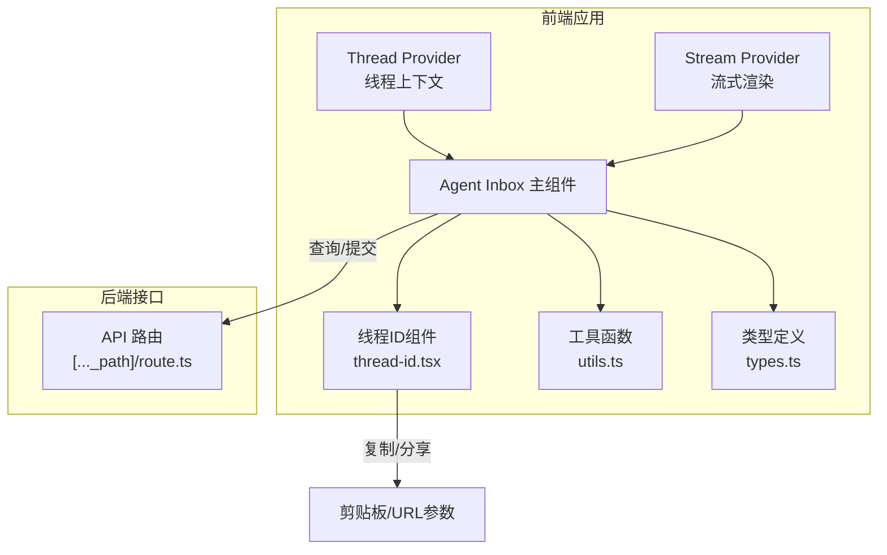
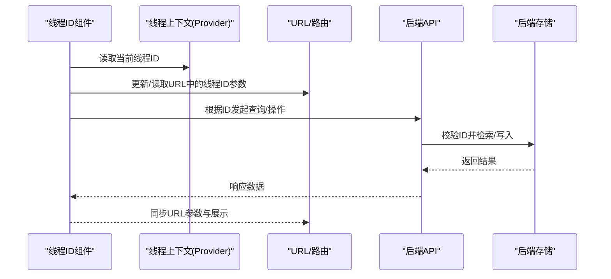
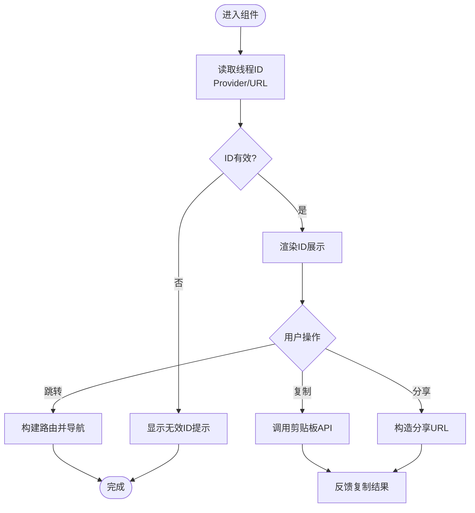
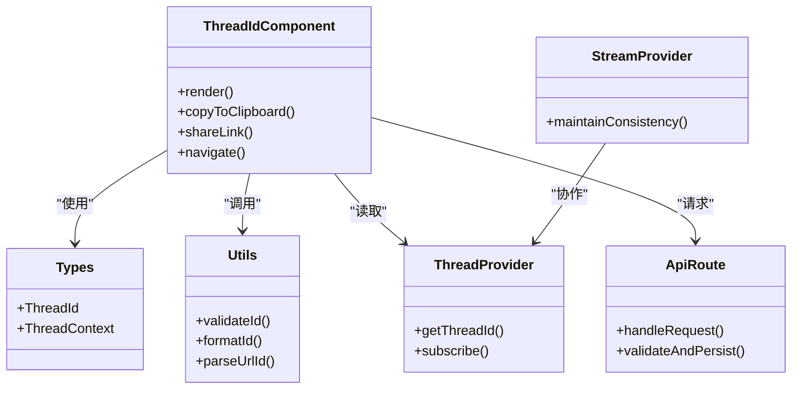

# 线程ID组件

<cite>
**本文档引用的文件**   
- [thread-id.tsx](file://apps/web/src/components/thread/agent-inbox/components/thread-id.tsx)
- [index.tsx](file://apps/web/src/components/thread/agent-inbox/index.tsx)
- [types.ts](file://apps/web/src/components/thread/agent-inbox/types.ts)
- [utils.ts](file://apps/web/src/components/thread/agent-inbox/utils.ts)
- [Thread.tsx](file://apps/web/src/providers/Thread.tsx)
- [Stream.tsx](file://apps/web/src/providers/Stream.tsx)
- [route.ts](file://apps/web/src/app/api/[..._path]/route.ts)
</cite>

## 目录
1. [简介](#简介)
2. [项目结构](#项目结构)
3. [核心组件](#核心组件)
4. [架构总览](#架构总览)
5. [详细组件分析](#详细组件分析)
6. [依赖关系分析](#依赖关系分析)
7. [性能考虑](#性能考虑)
8. [故障排查指南](#故障排查指南)
9. [结论](#结论)
10. [附录](#附录)

## 简介
本文件为“线程ID组件”的完整技术文档，聚焦于线程标识符的生成、存储与验证机制；解释ID格式规范、唯一性保证与冲突解决策略；覆盖ID复制分享、搜索定位与批量操作支持；说明与后端系统的ID映射关系、数据同步与一致性保证；并提供ID格式定制、扩展标识方案以及集成第三方系统的实现指导。

## 项目结构
线程ID相关能力主要位于前端Web应用中，围绕Agent Inbox模块提供：
- 展示与交互：线程ID显示、复制、跳转等
- 类型定义：线程ID及相关上下文的数据契约
- 工具函数：ID校验、格式化、解析等
- 提供者：线程上下文与流式渲染中ID的注入与消费
- API路由：前后端ID映射与持久化入口

图表来源
- [thread-id.tsx](file://apps/web/src/components/thread/agent-inbox/components/thread-id.tsx)
- [index.tsx](file://apps/web/src/components/thread/agent-inbox/index.tsx)
- [utils.ts](file://apps/web/src/components/thread/agent-inbox/utils.ts)
- [types.ts](file://apps/web/src/components/thread/agent-inbox/types.ts)
- [Thread.tsx](file://apps/web/src/providers/Thread.tsx)
- [Stream.tsx](file://apps/web/src/providers/Stream.tsx)
- [route.ts](file://apps/web/src/app/api/[..._path]/route.ts)

章节来源
- [thread-id.tsx](file://apps/web/src/components/thread/agent-inbox/components/thread-id.tsx)
- [index.tsx](file://apps/web/src/components/thread/agent-inbox/index.tsx)
- [types.ts](file://apps/web/src/components/thread/agent-inbox/types.ts)
- [utils.ts](file://apps/web/src/components/thread/agent-inbox/utils.ts)
- [Thread.tsx](file://apps/web/src/providers/Thread.tsx)
- [Stream.tsx](file://apps/web/src/providers/Stream.tsx)
- [route.ts](file://apps/web/src/app/api/[..._path]/route.ts)

## 核心组件
- 线程ID组件（thread-id.tsx）
  - 负责线程ID的展示、复制、分享、跳转等操作
  - 与剪贴板、URL参数、路由进行交互
  - 通过Provider获取当前线程上下文中的ID
- Agent Inbox主组件（index.tsx）
  - 组织线程相关UI与行为，包含对线程ID组件的调用
  - 协调消息、工具调用、中断动作等与线程ID的关系
- 类型定义（types.ts）
  - 定义线程ID及其上下文的类型契约
  - 明确字段含义、可选性与约束
- 工具函数（utils.ts）
  - 提供ID校验、格式化、解析、兼容性处理等
- 提供者（Thread.tsx、Stream.tsx）
  - Thread Provider：维护线程上下文（含ID）
  - Stream Provider：在流式渲染过程中保持ID一致性与传递

章节来源
- [thread-id.tsx](file://apps/web/src/components/thread/agent-inbox/components/thread-id.tsx)
- [index.tsx](file://apps/web/src/components/thread/agent-inbox/index.tsx)
- [types.ts](file://apps/web/src/components/thread/agent-inbox/types.ts)
- [utils.ts](file://apps/web/src/components/thread/agent-inbox/utils.ts)
- [Thread.tsx](file://apps/web/src/providers/Thread.tsx)
- [Stream.tsx](file://apps/web/src/providers/Stream.tsx)

## 架构总览
线程ID的生命周期贯穿前端展示、上下文传递、URL路由与后端接口：
- 生成：由后端创建线程时返回或前端按规则生成（如UUID）
- 存储：前端状态（Provider）、URL参数、本地缓存（如有）
- 验证：客户端校验格式、长度、字符集；服务端再次校验并建立索引
- 使用：复制分享、搜索定位、批量操作、跨页面导航
- 同步：与后端保持一致，确保读写幂等与冲突解决

图表来源
- [thread-id.tsx](file://apps/web/src/components/thread/agent-inbox/components/thread-id.tsx)
- [Thread.tsx](file://apps/web/src/providers/Thread.tsx)
- [route.ts](file://apps/web/src/app/api/[..._path]/route.ts)

## 详细组件分析

### 线程ID组件（thread-id.tsx）
- 功能要点
  - 展示线程ID，支持一键复制与分享链接
  - 从URL参数或Provider中读取ID，并在变化时刷新视图
  - 提供跳转到历史、详情等操作的入口
- 交互流程
  - 复制：调用系统剪贴板API，反馈成功/失败
  - 分享：构造带ID参数的URL，支持打开新窗口或复制链接
  - 跳转：基于ID构建路由路径，触发导航
- 错误处理
  - 剪贴板权限不足时的降级提示
  - ID无效时的用户提示与回退逻辑

图表来源
- [thread-id.tsx](file://apps/web/src/components/thread/agent-inbox/components/thread-id.tsx)

章节来源
- [thread-id.tsx](file://apps/web/src/components/thread/agent-inbox/components/thread-id.tsx)

### Agent Inbox主组件（index.tsx）
- 职责
  - 聚合线程相关UI与业务逻辑
  - 管理线程ID与消息、工具调用、中断动作的关联
  - 协调与Provider和API的交互
- 关键点
  - 在初始化时加载线程ID对应的数据
  - 在用户操作后更新ID相关的状态（如新建子线程、切换线程）
  - 与流式渲染Provider协作，保证ID在增量更新中的一致性

章节来源
- [index.tsx](file://apps/web/src/components/thread/agent-inbox/index.tsx)

### 类型定义（types.ts）
- 内容
  - 定义线程ID的类型、可选字段与约束
  - 定义线程上下文对象的结构，包括ID与其他元数据
- 设计原则
  - 强类型约束，避免非法ID传入
  - 可扩展字段预留，便于未来扩展标识方案

章节来源
- [types.ts](file://apps/web/src/components/thread/agent-inbox/types.ts)

### 工具函数（utils.ts）
- 能力
  - 校验ID格式（长度、字符集、前缀等）
  - 格式化ID用于展示（截断、脱敏等）
  - 解析URL中的ID参数，兼容不同版本
- 注意事项
  - 对异常输入进行防御性处理
  - 提供统一的错误码与提示信息

章节来源
- [utils.ts](file://apps/web/src/components/thread/agent-inbox/utils.ts)

### 提供者（Thread.tsx、Stream.tsx）
- Thread Provider
  - 维护线程上下文，包含ID及衍生状态
  - 暴露订阅与更新接口，供组件消费
- Stream Provider
  - 在流式渲染中维持ID一致性
  - 处理增量更新与错误恢复

章节来源
- [Thread.tsx](file://apps/web/src/providers/Thread.tsx)
- [Stream.tsx](file://apps/web/src/providers/Stream.tsx)

### 后端接口（route.ts）
- 职责
  - 接收前端请求，解析并校验线程ID
  - 与数据库交互，确保ID的唯一性与一致性
  - 返回统一的数据结构与错误信息
- 关键点
  - 幂等写入与查询
  - 并发场景下的冲突检测与解决

章节来源
- [route.ts](file://apps/web/src/app/api/[..._path]/route.ts)

## 依赖关系分析
- 组件内依赖
  - thread-id.tsx 依赖 types.ts、utils.ts、Provider
  - index.tsx 依赖 thread-id.tsx、types.ts、utils.ts、Provider、API
- 外部依赖
  - 剪贴板API、URL路由、浏览器历史
  - 后端API路由与数据存储

图表来源
- [thread-id.tsx](file://apps/web/src/components/thread/agent-inbox/components/thread-id.tsx)
- [types.ts](file://apps/web/src/components/thread/agent-inbox/types.ts)
- [utils.ts](file://apps/web/src/components/thread/agent-inbox/utils.ts)
- [Thread.tsx](file://apps/web/src/providers/Thread.tsx)
- [Stream.tsx](file://apps/web/src/providers/Stream.tsx)
- [route.ts](file://apps/web/src/app/api/[..._path]/route.ts)

章节来源
- [thread-id.tsx](file://apps/web/src/components/thread/agent-inbox/components/thread-id.tsx)
- [types.ts](file://apps/web/src/components/thread/agent-inbox/types.ts)
- [utils.ts](file://apps/web/src/components/thread/agent-inbox/utils.ts)
- [Thread.tsx](file://apps/web/src/providers/Thread.tsx)
- [Stream.tsx](file://apps/web/src/providers/Stream.tsx)
- [route.ts](file://apps/web/src/app/api/[..._path]/route.ts)

## 性能考虑
- 避免重复计算：对ID校验与格式化结果进行缓存
- 减少重渲染：在Provider中使用细粒度状态更新
- 网络优化：批量操作合并请求，合理设置超时与重试
- 内存管理：及时释放不必要的订阅与监听器

## 故障排查指南
- 常见问题
  - ID无效：检查格式校验逻辑与URL参数解析
  - 复制失败：确认剪贴板权限与浏览器环境
  - 数据不一致：核对Provider状态与后端返回
- 调试建议
  - 打印关键步骤日志（读取、校验、请求、响应）
  - 使用浏览器开发者工具检查网络请求与状态变化
  - 编写单元测试覆盖边界情况（空ID、超长ID、非法字符）

章节来源
- [utils.ts](file://apps/web/src/components/thread/agent-inbox/utils.ts)
- [thread-id.tsx](file://apps/web/src/components/thread/agent-inbox/components/thread-id.tsx)
- [route.ts](file://apps/web/src/app/api/[..._path]/route.ts)

## 结论
线程ID组件通过清晰的前端组件、类型定义、工具函数与Provider体系，实现了线程标识符的生成、存储、验证与使用闭环。结合后端接口的校验与持久化，确保了ID的唯一性与一致性。通过合理的性能优化与故障排查策略，提升了用户体验与系统稳定性。

## 附录
- ID格式规范建议
  - 采用UUID v4或自定义前缀+随机串，确保全局唯一
  - 限制长度与字符集，便于展示与传输
- 扩展标识方案
  - 支持多租户ID、会话ID、消息ID等复合标识
  - 提供版本兼容层，平滑升级ID格式
- 第三方系统集成
  - 通过适配器模式封装ID转换逻辑
  - 统一错误码与消息格式，便于联调与监控