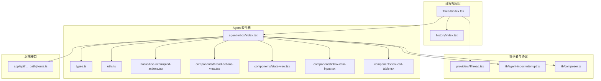
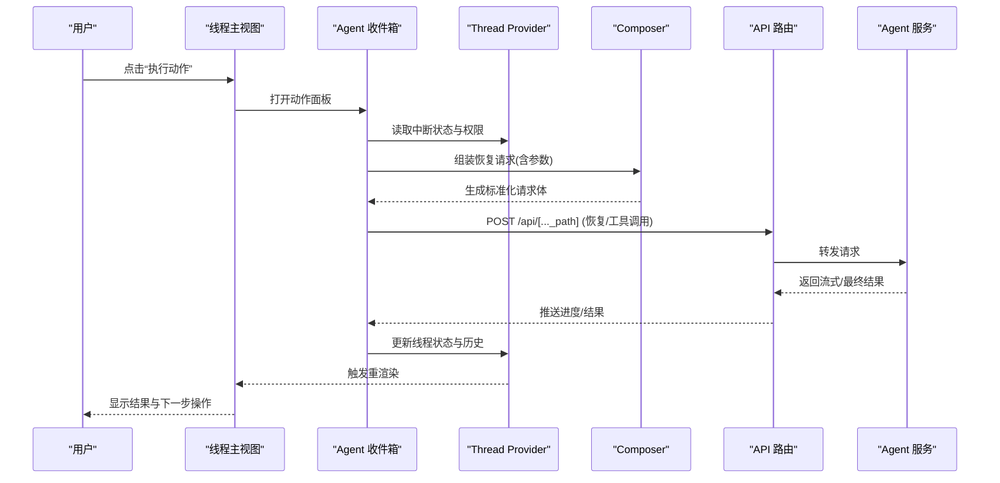
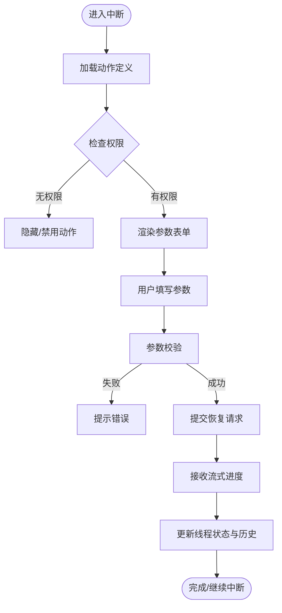
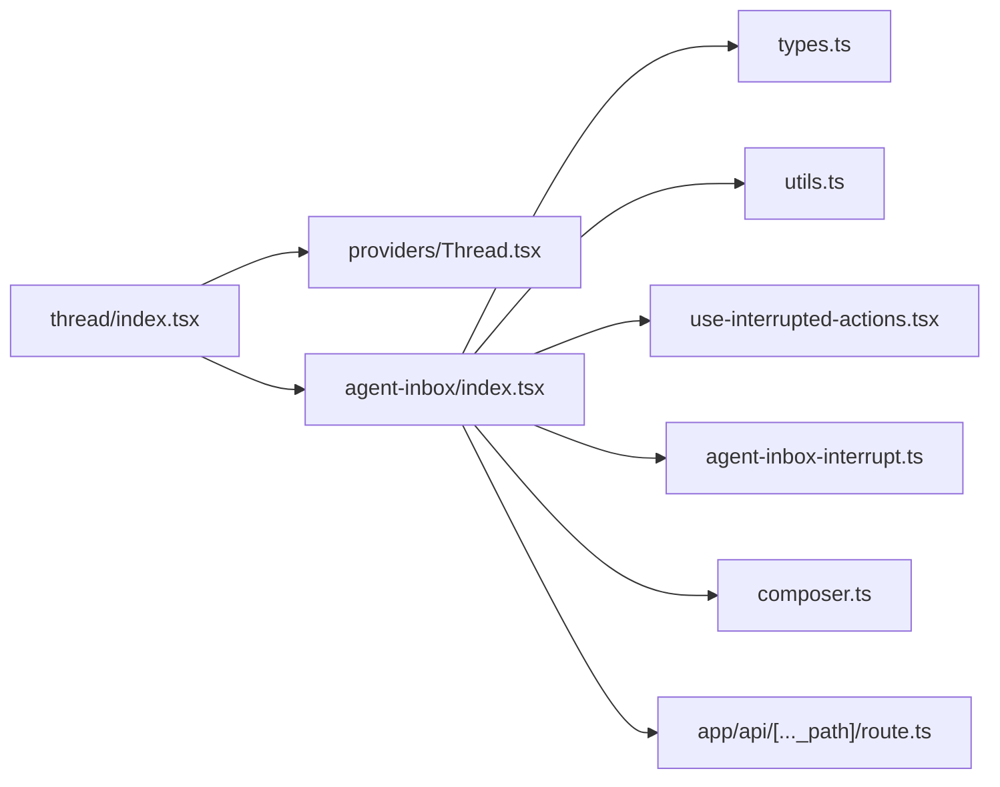

# 线程操作视图

<cite>
**本文引用的文件**   
- [apps/web/src/components/thread/index.tsx](file://apps/web/src/components/thread/index.tsx)
- [apps/web/src/components/thread/agent-inbox/index.tsx](file://apps/web/src/components/thread/agent-inbox/index.tsx)
- [apps/web/src/components/thread/agent-inbox/types.ts](file://apps/web/src/components/thread/agent-inbox/types.ts)
- [apps/web/src/components/thread/agent-inbox/utils.ts](file://apps/web/src/components/thread/agent-inbox/utils.ts)
- [apps/web/src/components/thread/agent-inbox/hooks/use-interrupted-actions.tsx](file://apps/web/src/components/thread/agent-inbox/hooks/use-interrupted-actions.tsx)
- [apps/web/src/components/thread/agent-inbox/components/thread-actions-view.tsx](file://apps/web/src/components/thread/agent-inbox/components/thread-actions-view.tsx)
- [apps/web/src/components/thread/agent-inbox/components/state-view.tsx](file://apps/web/src/components/thread/agent-inbox/components/state-view.tsx)
- [apps/web/src/components/thread/agent-inbox/components/inbox-item-input.tsx](file://apps/web/src/components/thread/agent-inbox/components/inbox-item-input.tsx)
- [apps/web/src/components/thread/agent-inbox/components/tool-call-table.tsx](file://apps/web/src/components/thread/agent-inbox/components/tool-call-table.tsx)
- [apps/web/src/components/thread/history/index.tsx](file://apps/web/src/components/thread/history/index.tsx)
- [apps/web/src/providers/Thread.tsx](file://apps/web/src/providers/Thread.tsx)
- [apps/web/src/lib/agent-inbox-interrupt.ts](file://apps/web/src/lib/agent-inbox-interrupt.ts)
- [apps/web/src/lib/composer.ts](file://apps/web/src/lib/composer.ts)
- [apps/web/src/app/api/[..._path]/route.ts](file://apps/web/src/app/api/[..._path]/route.ts)
</cite>

## 目录
1. [简介](#简介)
2. [项目结构](#项目结构)
3. [核心组件](#核心组件)
4. [架构总览](#架构总览)
5. [详细组件分析](#详细组件分析)
6. [依赖关系分析](#依赖关系分析)
7. [性能考虑](#性能考虑)
8. [故障排查指南](#故障排查指南)
9. [结论](#结论)
10. [附录](#附录)

## 简介
本文件面向“线程操作视图”的前端实现，系统性说明以下方面：
- 线程操作的可视化展示与用户交互流程
- 状态同步机制（中断、恢复、提交）
- 操作按钮的渲染逻辑、权限控制与动态配置
- 操作历史记录、撤销/重做与批量操作支持
- 与 Agent 系统的通信协议、异步处理与进度反馈
- 操作类型扩展与自定义操作界面的实现指导

## 项目结构
线程操作视图位于 web 应用前端，围绕 thread 组件与 agent-inbox 子模块组织。关键路径如下：
- 线程容器与上下文：providers/Thread.tsx
- 线程主视图：components/thread/index.tsx
- 代理收件箱（中断与操作）：components/thread/agent-inbox/*
- 历史与回放：components/thread/history/index.tsx
- 工具调用与状态查看：components/thread/agent-inbox/components/*
- 中断协议与消息编排：lib/agent-inbox-interrupt.ts, lib/composer.ts
- API 路由：app/api/[..._path]/route.ts

**图示来源** 
- [apps/web/src/components/thread/index.tsx](file://apps/web/src/components/thread/index.tsx)
- [apps/web/src/components/thread/agent-inbox/index.tsx](file://apps/web/src/components/thread/agent-inbox/index.tsx)
- [apps/web/src/providers/Thread.tsx](file://apps/web/src/providers/Thread.tsx)
- [apps/web/src/lib/agent-inbox-interrupt.ts](file://apps/web/src/lib/agent-inbox-interrupt.ts)
- [apps/web/src/lib/composer.ts](file://apps/web/src/lib/composer.ts)
- [apps/web/src/app/api/[..._path]/route.ts](file://apps/web/src/app/api/[..._path]/route.ts)

**章节来源**
- [apps/web/src/components/thread/index.tsx](file://apps/web/src/components/thread/index.tsx)
- [apps/web/src/components/thread/agent-inbox/index.tsx](file://apps/web/src/components/thread/agent-inbox/index.tsx)
- [apps/web/src/providers/Thread.tsx](file://apps/web/src/providers/Thread.tsx)

## 核心组件
- 线程容器 Provider：集中管理线程上下文、状态订阅与事件分发，为子组件提供统一的线程数据与操作方法。
- 线程主视图：聚合消息列表、输入框、操作面板与历史面板，协调用户交互与状态更新。
- Agent 收件箱：负责中断状态的展示与操作执行，包括动作列表渲染、参数输入、工具调用结果展示等。
- 历史面板：记录并回放线程内关键操作与状态变更，支持定位与回滚。
- 中断协议与编排：定义中断数据结构、恢复请求格式与流式响应处理。
- Composer：封装消息构建、工具调用参数组装与发送流程。

**章节来源**
- [apps/web/src/providers/Thread.tsx](file://apps/web/src/providers/Thread.tsx)
- [apps/web/src/components/thread/index.tsx](file://apps/web/src/components/thread/index.tsx)
- [apps/web/src/components/thread/agent-inbox/index.tsx](file://apps/web/src/components/thread/agent-inbox/index.tsx)
- [apps/web/src/components/thread/history/index.tsx](file://apps/web/src/components/thread/history/index.tsx)
- [apps/web/src/lib/agent-inbox-interrupt.ts](file://apps/web/src/lib/agent-inbox-interrupt.ts)
- [apps/web/src/lib/composer.ts](file://apps/web/src/lib/composer.ts)

## 架构总览
线程操作视图采用“Provider + 组件树 + 协议层”的分层架构：
- Provider 层：维护线程全局状态（当前线程 ID、中断状态、操作历史、权限标志等），并通过 React Context 暴露给子组件。
- 组件层：按功能拆分（消息、输入、动作、历史、工具调用表等），通过 hooks 订阅状态变化并触发副作用。
- 协议层：统一与 Agent 系统通信，封装中断恢复、工具调用、流式输出与错误处理。
- 接口层：Next.js API Route 作为网关，转发到后端 Agent 服务或外部工具。

**图示来源** 
- [apps/web/src/components/thread/index.tsx](file://apps/web/src/components/thread/index.tsx)
- [apps/web/src/components/thread/agent-inbox/index.tsx](file://apps/web/src/components/thread/agent-inbox/index.tsx)
- [apps/web/src/lib/composer.ts](file://apps/web/src/lib/composer.ts)
- [apps/web/src/app/api/[..._path]/route.ts](file://apps/web/src/app/api/[..._path]/route.ts)

## 详细组件分析

### 线程主视图（thread/index.tsx）
- 职责：聚合消息区、输入区、动作面板与历史面板；监听 Provider 状态变化，驱动 UI 刷新。
- 交互流程：用户输入 -> 校验 -> 调用 Composer 构建消息 -> 发送至 API -> 接收流式响应 -> 更新消息与状态。
- 权限控制：根据 Provider 中的角色/权限标志，动态禁用或隐藏敏感操作按钮。
- 状态同步：通过 Provider 的订阅回调，确保 UI 与后端状态一致。

**章节来源**
- [apps/web/src/components/thread/index.tsx](file://apps/web/src/components/thread/index.tsx)
- [apps/web/src/providers/Thread.tsx](file://apps/web/src/providers/Thread.tsx)

### Agent 收件箱（agent-inbox/index.tsx）
- 职责：当线程进入中断状态时，展示可执行动作列表、参数表单与工具调用结果。
- 动作渲染：基于 types.ts 的动作定义与 utils.ts 的辅助函数，动态生成表单与按钮。
- 权限控制：依据动作的权限字段与当前用户角色，决定是否可见/可编辑。
- 状态同步：通过 use-interrupted-actions hook 订阅中断状态变化，自动刷新可用动作。

**图示来源** 
- [apps/web/src/components/thread/agent-inbox/index.tsx](file://apps/web/src/components/thread/agent-inbox/index.tsx)
- [apps/web/src/components/thread/agent-inbox/types.ts](file://apps/web/src/components/thread/agent-inbox/types.ts)
- [apps/web/src/components/thread/agent-inbox/utils.ts](file://apps/web/src/components/thread/agent-inbox/utils.ts)
- [apps/web/src/components/thread/agent-inbox/hooks/use-interrupted-actions.tsx](file://apps/web/src/components/thread/agent-inbox/hooks/use-interrupted-actions.tsx)

**章节来源**
- [apps/web/src/components/thread/agent-inbox/index.tsx](file://apps/web/src/components/thread/agent-inbox/index.tsx)
- [apps/web/src/components/thread/agent-inbox/types.ts](file://apps/web/src/components/thread/agent-inbox/types.ts)
- [apps/web/src/components/thread/agent-inbox/utils.ts](file://apps/web/src/components/thread/agent-inbox/utils.ts)
- [apps/web/src/components/thread/agent-inbox/hooks/use-interrupted-actions.tsx](file://apps/web/src/components/thread/agent-inbox/hooks/use-interrupted-actions.tsx)

### 动作视图（thread-actions-view.tsx）
- 职责：渲染单个动作的标题、描述、参数表单与执行按钮。
- 动态配置：从动作定义中解析字段类型、默认值、校验规则与占位符。
- 交互反馈：执行前二次确认（可选）、执行中禁用按钮与显示进度、执行后展示结果摘要。

**章节来源**
- [apps/web/src/components/thread/agent-inbox/components/thread-actions-view.tsx](file://apps/web/src/components/thread/agent-inbox/components/thread-actions-view.tsx)

### 状态视图（state-view.tsx）
- 职责：以可读形式展示线程当前状态快照，便于调试与审计。
- 过滤与搜索：支持按键名过滤、关键字搜索与折叠展开。
- 导出能力：将状态序列化为 JSON 供下载或复制。

**章节来源**
- [apps/web/src/components/thread/agent-inbox/components/state-view.tsx](file://apps/web/src/components/thread/agent-inbox/components/state-view.tsx)

### 收件箱输入（inbox-item-input.tsx）
- 职责：提供文本输入、附件上传与快捷指令插入。
- 校验策略：必填项、长度限制、格式正则校验与实时提示。
- 快捷键：支持 Enter 发送、Ctrl+Enter 换行等。

**章节来源**
- [apps/web/src/components/thread/agent-inbox/components/inbox-item-input.tsx](file://apps/web/src/components/thread/agent-inbox/components/inbox-item-input.tsx)

### 工具调用表（tool-call-table.tsx）
- 职责：以表格形式展示工具调用的输入参数、返回值与耗时。
- 排序与筛选：按工具名、时间、状态排序；支持按状态筛选。
- 详情展开：点击行展开原始请求/响应 JSON。

**章节来源**
- [apps/web/src/components/thread/agent-inbox/components/tool-call-table.tsx](file://apps/web/src/components/thread/agent-inbox/components/tool-call-table.tsx)

### 历史面板（history/index.tsx）
- 职责：记录线程内的关键操作（发送消息、执行动作、状态变更）与时间戳。
- 撤销/重做：维护操作栈，支持撤销最近一步与重做已撤销步骤。
- 批量操作：支持多选历史条目进行批量删除或导出。

**章节来源**
- [apps/web/src/components/thread/history/index.tsx](file://apps/web/src/components/thread/history/index.tsx)

### 中断协议与编排（agent-inbox-interrupt.ts, composer.ts）
- 中断协议：定义中断事件结构、恢复请求字段、流式进度事件与错误码。
- Composer：将用户输入与动作参数组合为标准化的恢复请求，处理序列化与重试策略。
- 进度反馈：通过 SSE/流式响应推送“开始/进行中/完成/失败”等阶段信息。

**章节来源**
- [apps/web/src/lib/agent-inbox-interrupt.ts](file://apps/web/src/lib/agent-inbox-interrupt.ts)
- [apps/web/src/lib/composer.ts](file://apps/web/src/lib/composer.ts)

### API 路由（app/api/[..._path]/route.ts）
- 职责：统一入口，鉴权、限流、日志与转发至后端 Agent 服务。
- 错误处理：捕获异常并返回统一错误格式，包含错误码与提示。
- 流式支持：对长耗时操作启用流式响应，提升用户体验。

**章节来源**
- [apps/web/src/app/api/[..._path]/route.ts](file://apps/web/src/app/api/[..._path]/route.ts)

## 依赖关系分析
- 组件耦合：thread/index.tsx 依赖 Thread Provider 与 agent-inbox 子组件；agent-inbox 依赖 types、utils、hook 与协议层。
- 数据流向：用户输入 -> Composer -> API -> Agent -> 流式响应 -> Provider -> 组件重渲染。
- 潜在循环：避免在 Provider 中直接导入具体视图组件，仅暴露方法与状态。

**图示来源** 
- [apps/web/src/components/thread/index.tsx](file://apps/web/src/components/thread/index.tsx)
- [apps/web/src/providers/Thread.tsx](file://apps/web/src/providers/Thread.tsx)
- [apps/web/src/components/thread/agent-inbox/index.tsx](file://apps/web/src/components/thread/agent-inbox/index.tsx)
- [apps/web/src/components/thread/agent-inbox/types.ts](file://apps/web/src/components/thread/agent-inbox/types.ts)
- [apps/web/src/components/thread/agent-inbox/utils.ts](file://apps/web/src/components/thread/agent-inbox/utils.ts)
- [apps/web/src/components/thread/agent-inbox/hooks/use-interrupted-actions.tsx](file://apps/web/src/components/thread/agent-inbox/hooks/use-interrupted-actions.tsx)
- [apps/web/src/lib/agent-inbox-interrupt.ts](file://apps/web/src/lib/agent-inbox-interrupt.ts)
- [apps/web/src/lib/composer.ts](file://apps/web/src/lib/composer.ts)
- [apps/web/src/app/api/[..._path]/route.ts](file://apps/web/src/app/api/[..._path]/route.ts)

**章节来源**
- [apps/web/src/components/thread/index.tsx](file://apps/web/src/components/thread/index.tsx)
- [apps/web/src/providers/Thread.tsx](file://apps/web/src/providers/Thread.tsx)
- [apps/web/src/components/thread/agent-inbox/index.tsx](file://apps/web/src/components/thread/agent-inbox/index.tsx)

## 性能考虑
- 流式响应：优先使用流式传输减少首屏等待，避免一次性大对象阻塞。
- 状态订阅：仅在必要组件订阅 Provider 状态，避免全量重渲染。
- 列表虚拟化：历史与工具调用表在大数据量下启用虚拟滚动。
- 防抖与节流：输入框与搜索框使用防抖，减少频繁请求。
- 缓存策略：对只读动作定义与状态快照进行短期缓存。

[本节为通用性能建议，不直接分析具体文件]

## 故障排查指南
- 常见错误
  - 权限不足：检查 Provider 中的权限标志与动作定义中的权限字段是否匹配。
  - 参数校验失败：查看 inbox-item-input 的校验规则与错误提示位置。
  - 流式中断：确认 API 路由是否正确转发与处理 SSE/流式响应。
  - 历史不一致：核对操作栈入栈/出栈时机与幂等性。
- 调试技巧
  - 使用 state-view 导出当前状态快照对比前后差异。
  - 在 tool-call-table 中查看原始请求/响应定位问题。
  - 在浏览器网络面板观察流式分片与错误码。

**章节来源**
- [apps/web/src/components/thread/agent-inbox/components/state-view.tsx](file://apps/web/src/components/thread/agent-inbox/components/state-view.tsx)
- [apps/web/src/components/thread/agent-inbox/components/tool-call-table.tsx](file://apps/web/src/components/thread/agent-inbox/components/tool-call-table.tsx)
- [apps/web/src/components/thread/agent-inbox/components/inbox-item-input.tsx](file://apps/web/src/components/thread/agent-inbox/components/inbox-item-input.tsx)
- [apps/web/src/app/api/[..._path]/route.ts](file://apps/web/src/app/api/[..._path]/route.ts)

## 结论
线程操作视图通过清晰的层次结构与协议封装，实现了中断驱动的交互式操作体验。Provider 集中管理状态，组件按需渲染与交互，协议层保证与 Agent 的稳定通信。历史与工具调用表提升了可观测性与可回溯性。通过权限控制与动态配置，系统具备良好的可扩展性与安全性。

[本节为总结性内容，不直接分析具体文件]

## 附录

### 操作类型扩展与自定义界面实现指导
- 扩展动作类型
  - 在 types.ts 中新增动作类型定义，包含字段 schema、校验规则与权限标识。
  - 在 utils.ts 中添加对应字段的渲染器与转换器。
  - 在 thread-actions-view.tsx 中注册新类型的渲染分支。
- 自定义操作界面
  - 新建独立组件，遵循现有 props 约定（动作定义、参数、回调）。
  - 在 action registry 中映射新组件与类型。
  - 在 Provider 中注入权限与状态同步钩子。
- 撤销/重做与批量操作
  - 在 history/index.tsx 中维护操作栈，确保每个操作具备唯一 ID 与元数据。
  - 批量操作需具备幂等性与事务性保障，失败时回滚。
- 与 Agent 通信
  - 在 agent-inbox-interrupt.ts 中扩展恢复协议字段，保持向后兼容。
  - 在 composer.ts 中适配新动作的参数序列化与重试策略。
  - 在 API 路由中增加鉴权与限流，记录审计日志。

**章节来源**
- [apps/web/src/components/thread/agent-inbox/types.ts](file://apps/web/src/components/thread/agent-inbox/types.ts)
- [apps/web/src/components/thread/agent-inbox/utils.ts](file://apps/web/src/components/thread/agent-inbox/utils.ts)
- [apps/web/src/components/thread/agent-inbox/components/thread-actions-view.tsx](file://apps/web/src/components/thread/agent-inbox/components/thread-actions-view.tsx)
- [apps/web/src/components/thread/history/index.tsx](file://apps/web/src/components/thread/history/index.tsx)
- [apps/web/src/lib/agent-inbox-interrupt.ts](file://apps/web/src/lib/agent-inbox-interrupt.ts)
- [apps/web/src/lib/composer.ts](file://apps/web/src/lib/composer.ts)
- [apps/web/src/app/api/[..._path]/route.ts](file://apps/web/src/app/api/[..._path]/route.ts)