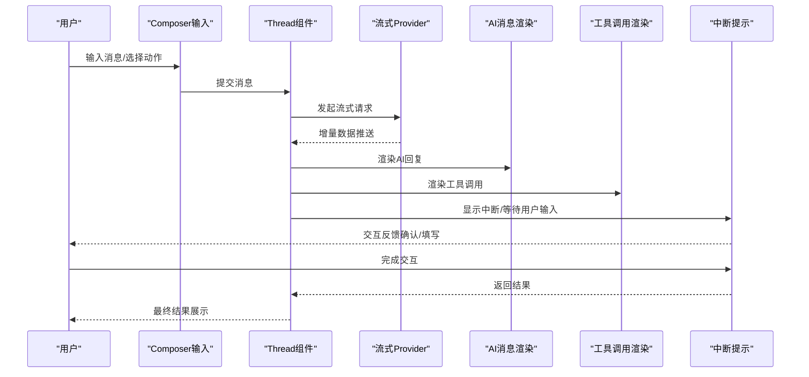
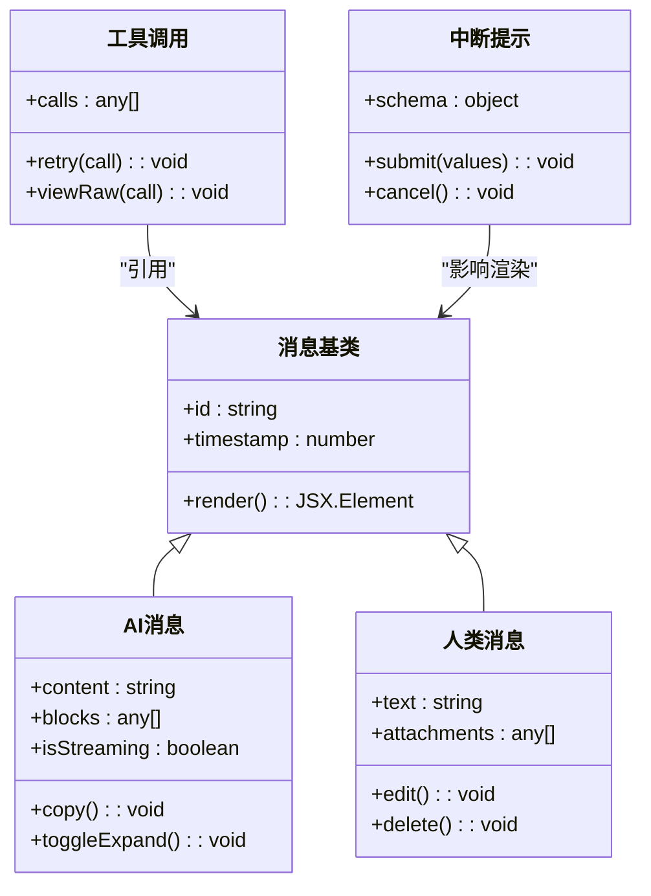
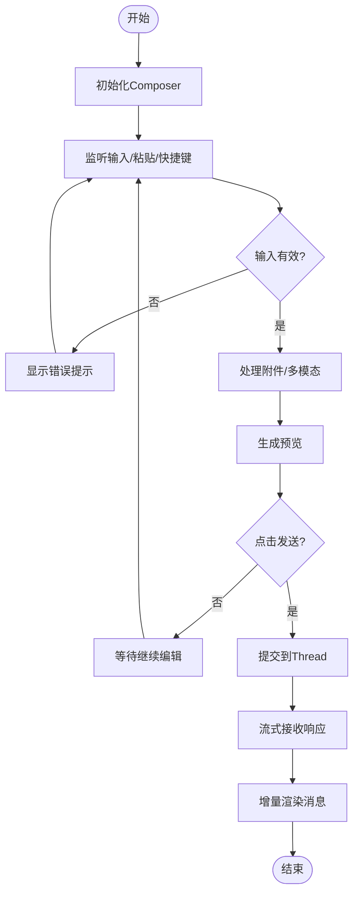
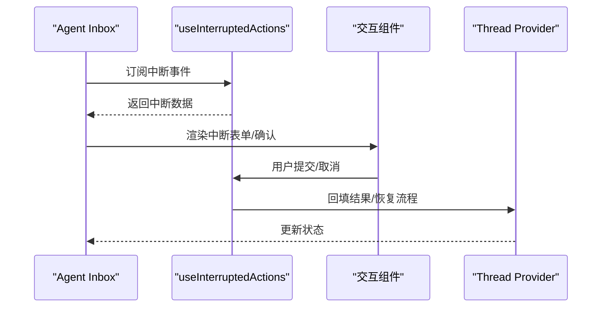
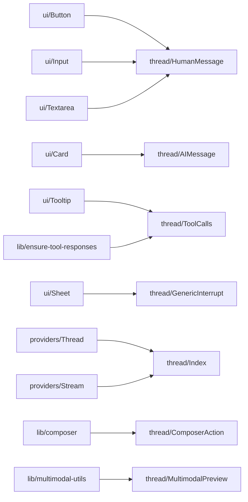

# UI组件库

<cite>
**本文引用的文件**   
- [apps/web/src/components/ui/button.tsx](file://apps/web/src/components/ui/button.tsx)
- [apps/web/src/components/ui/input.tsx](file://apps/web/src/components/ui/input.tsx)
- [apps/web/src/components/ui/textarea.tsx](file://apps/web/src/components/ui/textarea.tsx)
- [apps/web/src/components/ui/avatar.tsx](file://apps/web/src/components/ui/avatar.tsx)
- [apps/web/src/components/ui/card.tsx](file://apps/web/src/components/ui/card.tsx)
- [apps/web/src/components/ui/label.tsx](file://apps/web/src/components/ui/label.tsx)
- [apps/web/src/components/ui/password-input.tsx](file://apps/web/src/components/ui/password-input.tsx)
- [apps/web/src/components/ui/sheet.tsx](file://apps/web/src/components/ui/sheet.tsx)
- [apps/web/src/components/ui/skeleton.tsx](file://apps/web/src/components/ui/skeleton.tsx)
- [apps/web/src/components/ui/sonner.tsx](file://apps/web/src/components/ui/sonner.tsx)
- [apps/web/src/components/ui/switch.tsx](file://apps/web/src/components/ui/switch.tsx)
- [apps/web/src/components/ui/tooltip.tsx](file://apps/web/src/components/ui/tooltip.tsx)
- [apps/web/src/components/thread/messages/ai.tsx](file://apps/web/src/components/thread/messages/ai.tsx)
- [apps/web/src/components/thread/messages/human.tsx](file://apps/web/src/components/thread/messages/human.tsx)
- [apps/web/src/components/thread/messages/tool-calls.tsx](file://apps/web/src/components/thread/messages/tool-calls.tsx)
- [apps/web/src/components/thread/messages/generic-interrupt.tsx](file://apps/web/src/components/thread/messages/generic-interrupt.tsx)
- [apps/web/src/components/thread/messages/shared.tsx](file://apps/web/src/components/thread/messages/shared.tsx)
- [apps/web/src/components/thread/index.tsx](file://apps/web/src/components/thread/index.tsx)
- [apps/web/src/components/thread/markdown-text.tsx](file://apps/web/src/components/thread/markdown-text.tsx)
- [apps/web/src/components/thread/markdown-styles.css](file://apps/web/src/components/thread/markdown-styles.css)
- [apps/web/src/components/thread/artifact.tsx](file://apps/web/src/components/thread/artifact.tsx)
- [apps/web/src/components/thread/multimodal-preview.tsx](file://apps/web/src/components/thread/multimodal-preview.tsx)
- [apps/web/src/components/thread/composer-action.tsx](file://apps/web/web/src/components/thread/composer-action.tsx)
- [apps/web/src/components/thread/ContentBlocksPreview.tsx](file://apps/web/src/components/thread/ContentBlocksPreview.tsx)
- [apps/web/src/components/thread/utils.ts](file://apps/web/src/components/thread/utils.ts)
- [apps/web/src/components/thread/agent-inbox/index.tsx](file://apps/web/src/components/thread/agent-inbox/index.tsx)
- [apps/web/src/components/thread/agent-inbox/types.ts](file://apps/web/src/components/thread/agent-inbox/types.ts)
- [apps/web/src/components/thread/agent-inbox/utils.ts](file://apps/web/src/components/thread/agent-inbox/utils.ts)
- [apps/web/src/components/thread/agent-inbox/hooks/use-interrupted-actions.tsx](file://apps/web/src/components/thread/agent-inbox/hooks/use-interrupted-actions.tsx)
- [apps/web/src/components/thread/agent-inbox/components/inbox-item-input.tsx](file://apps/web/src/components/thread/agent-inbox/components/inbox-item-input.tsx)
- [apps/web/src/components/thread/agent-inbox/components/state-view.tsx](file://apps/web/src/components/thread/agent-inbox/components/state-view.tsx)
- [apps/web/src/components/thread/agent-inbox/components/thread-actions-view.tsx](file://apps/web/src/components/thread/agent-inbox/components/thread-actions-view.tsx)
- [apps/web/src/components/thread/agent-inbox/components/thread-id.tsx](file://apps/web/src/components/thread/agent-inbox/components/thread-id.tsx)
- [apps/web/src/components/thread/agent-inbox/components/tool-call-table.tsx](file://apps/web/src/components/thread/agent-inbox/components/tool-call-table.tsx)
- [apps/web/src/providers/Thread.tsx](file://apps/web/src/providers/Thread.tsx)
- [apps/web/src/providers/Stream.tsx](file://apps/web/src/providers/Stream.tsx)
- [apps/web/src/lib/composer.ts](file://apps/web/src/lib/composer.ts)
- [apps/web/src/lib/multimodal-utils.ts](file://apps/web/src/lib/multimodal-utils.ts)
- [apps/web/src/lib/ensure-tool-responses.ts](file://apps/web/src/lib/ensure-tool-responses.ts)
- [apps/web/src/lib/api-key.tsx](file://apps/web/src/lib/api-key.tsx)
- [apps/web/src/hooks/useMediaQuery.tsx](file://apps/web/src/hooks/useMediaQuery.tsx)
- [apps/web/tailwind.config.js](file://apps/web/tailwind.config.js)
- [apps/web/postcss.config.mjs](file://apps/web/postcss.config.mjs)
- [apps/web/components.json](file://apps/web/components.json)
</cite>

## 目录
1. [简介](#简介)
2. [项目结构](#项目结构)
3. [核心组件](#核心组件)
4. [架构总览](#架构总览)
5. [详细组件分析](#详细组件分析)
6. [依赖分析](#依赖分析)
7. [性能考虑](#性能考虑)
8. [故障排查指南](#故障排查指南)
9. [结论](#结论)
10. [附录](#附录)

## 简介
本文件为UI组件库的权威文档，聚焦于线程（thread）相关的消息显示、输入处理与工具调用界面。内容涵盖：
- 每个组件的视觉外观、行为与用户交互模式
- 属性/参数、事件、插槽与自定义选项
- 使用示例与代码片段路径
- 响应式设计与无障碍访问合规性指导
- 组件状态、动画与过渡效果
- 样式自定义与主题支持
- 跨浏览器兼容性与性能优化
- 组合模式及与其他UI元素的集成方式

## 项目结构
前端应用位于 apps/web，采用 Next.js + React + TypeScript，样式基于 Tailwind CSS，组件按功能分层组织：
- ui：基础原子组件（按钮、输入、卡片等）
- thread：线程相关的高级组件（消息渲染、工具调用、多模态预览、Composer等）
- providers：全局上下文（线程状态、流式数据）
- lib：通用逻辑（Composer、多模态工具、工具响应校验等）
- hooks：可复用钩子（媒体查询等）

```mermaid
graph TB
subgraph "UI原子层"
UBtn["Button"]
UInput["Input"]
UTextarea["Textarea"]
UAvatar["Avatar"]
UCard["Card"]
ULabel["Label"]
UPwd["PasswordInput"]
USheet["Sheet"]
USkel["Skeleton"]
USonner["Sonner(通知)"]
USwitch["Switch"]
UTooltip["Tooltip"]
end
subgraph "线程业务层"
TIndex["Thread Index"]
TMsgAI["AI消息"]
TMsgHuman["人类消息"]
TToolCalls["工具调用"]
TInterrupt["中断提示"]
TShared["共享渲染"]
TMarkdown["Markdown文本"]
TArtifact["工件展示"]
TMultimodal["多模态预览"]
TComposerAction["Composer动作"]
TBlocks["内容块预览"]
end
subgraph "提供者与逻辑"
PThread["Thread Provider"]
PStream["Stream Provider"]
LComposer["Composer逻辑"]
LMultimodal["多模态工具"]
LToolResp["工具响应校验"]
end
UBtn --> TMsgHuman
UInput --> TMsgHuman
UTextarea --> TMsgHuman
UAvatar --> TMsgHuman
UCard --> TMsgAI
UTooltip --> TToolCalls
USheet --> TInterrupt
USonner --> TInterrupt
USwitch --> TInterrupt
ULabel --> TMsgHuman
TIndex --> TMsgAI
TIndex --> TMsgHuman
TIndex --> TToolCalls
TIndex --> TInterrupt
TMsgAI --> TMarkdown
TMsgHuman --> TShared
TToolCalls --> TShared
TInterrupt --> TShared
TIndex --> PThread
TIndex --> PStream
TMsgAI --> LMultimodal
TToolCalls --> LToolResp
TComposerAction --> LComposer
```

图表来源
- [apps/web/src/components/thread/index.tsx](file://apps/web/src/components/thread/index.tsx)
- [apps/web/src/components/thread/messages/ai.tsx](file://apps/web/src/components/thread/messages/ai.tsx)
- [apps/web/src/components/thread/messages/human.tsx](file://apps/web/src/components/thread/messages/human.tsx)
- [apps/web/src/components/thread/messages/tool-calls.tsx](file://apps/web/src/components/thread/messages/tool-calls.tsx)
- [apps/web/src/components/thread/messages/generic-interrupt.tsx](file://apps/web/src/components/thread/messages/generic-interrupt.tsx)
- [apps/web/src/components/thread/messages/shared.tsx](file://apps/web/src/components/thread/messages/shared.tsx)
- [apps/web/src/providers/Thread.tsx](file://apps/web/src/providers/Thread.tsx)
- [apps/web/src/providers/Stream.tsx](file://apps/web/src/providers/Stream.tsx)
- [apps/web/src/lib/composer.ts](file://apps/web/src/lib/composer.ts)
- [apps/web/src/lib/multimodal-utils.ts](file://apps/web/src/lib/multimodal-utils.ts)
- [apps/web/src/lib/ensure-tool-responses.ts](file://apps/web/src/lib/ensure-tool-responses.ts)

章节来源
- [apps/web/src/components/thread/index.tsx](file://apps/web/src/components/thread/index.tsx)
- [apps/web/src/providers/Thread.tsx](file://apps/web/src/providers/Thread.tsx)
- [apps/web/src/providers/Stream.tsx](file://apps/web/src/providers/Stream.tsx)

## 核心组件
本节概述原子UI组件的职责、常用属性、事件与可定制点，并给出在线程场景中的典型用法。

- Button（按钮）
  - 用途：触发操作（发送、确认、取消等）
  - 常见属性：类型（primary/secondary/danger）、尺寸、禁用态、图标前缀/后缀
  - 事件：onClick、onKeyDown（回车提交）
  - 可访问性：role="button"、aria-disabled、键盘可达
  - 使用示例路径：[apps/web/src/components/ui/button.tsx](file://apps/web/src/components/ui/button.tsx)

- Input（输入框）
  - 用途：单行文本输入（搜索、过滤、ID输入）
  - 常见属性：占位符、值/受控、只读、禁用、错误提示
  - 事件：onChange、onFocus、onBlur、onSubmit
  - 可访问性：关联Label、aria-invalid、aria-describedby
  - 使用示例路径：[apps/web/src/components/ui/input.tsx](file://apps/web/src/components/ui/input.tsx)

- Textarea（多行输入）
  - 用途：长文本编辑（消息正文、备注）
  - 常见属性：行数、自动高度、最大长度、错误提示
  - 事件：onChange、onPaste（富文本/附件）
  - 可访问性：aria-multiline、aria-required
  - 使用示例路径：[apps/web/src/components/ui/textarea.tsx](file://apps/web/src/components/ui/textarea.tsx)

- Avatar（头像）
  - 用途：用户/代理标识
  - 常见属性：src、alt、fallback、尺寸
  - 可访问性：img语义、alt描述
  - 使用示例路径：[apps/web/src/components/ui/avatar.tsx](file://apps/web/src/components/ui/avatar.tsx)

- Card（卡片）
  - 用途：信息分组容器（消息气泡、工具调用详情）
  - 常见属性：标题、副标题、操作区、阴影/圆角
  - 可访问性：role="region"、aria-labelledby
  - 使用示例路径：[apps/web/src/components/ui/card.tsx](file://apps/web/src/components/ui/card.tsx)

- Label（标签）
  - 用途：表单字段说明
  - 常见属性：forId、required
  - 可访问性：htmlFor绑定
  - 使用示例路径：[apps/web/src/components/ui/label.tsx](file://apps/web/src/components/ui/label.tsx)

- PasswordInput（密码输入）
  - 用途：安全输入（API Key、密码）
  - 常见属性：可见切换、强度指示、错误提示
  - 可访问性：aria-pressed（可见切换）、aria-live
  - 使用示例路径：[apps/web/src/components/ui/password-input.tsx](file://apps/web/src/components/ui/password-input.tsx)

- Sheet（侧边抽屉）
  - 用途：弹出面板（设置、详情、工具结果）
  - 常见属性：打开状态、关闭回调、遮罩点击关闭
  - 可访问性：焦点陷阱、Esc关闭、aria-modal
  - 使用示例路径：[apps/web/src/components/ui/sheet.tsx](file://apps/web/src/components/ui/sheet.tsx)

- Skeleton（骨架屏）
  - 用途：加载占位
  - 常见属性：形状、宽度/高度、动画
  - 可访问性：aria-busy
  - 使用示例路径：[apps/web/src/components/ui/skeleton.tsx](file://apps/web/src/components/ui/skeleton.tsx)

- Sonner（通知）
  - 用途：成功/失败/警告提示
  - 常见属性：位置、持续时间、可关闭
  - 可访问性：aria-live、自动聚焦
  - 使用示例路径：[apps/web/src/components/ui/sonner.tsx](file://apps/web/src/components/ui/sonner.tsx)

- Switch（开关）
  - 用途：布尔选项（启用/禁用）
  - 常见属性：受控/非受控、禁用、标签
  - 可访问性：role="switch"、aria-checked
  - 使用示例路径：[apps/web/src/components/ui/switch.tsx](file://apps/web/src/components/ui/switch.tsx)

- Tooltip（提示）
  - 用途：辅助说明、快捷帮助
  - 常见属性：触发方式、延迟、位置
  - 可访问性：aria-describedby、键盘导航
  - 使用示例路径：[apps/web/src/components/ui/tooltip.tsx](file://apps/web/src/components/ui/tooltip.tsx)

章节来源
- [apps/web/src/components/ui/button.tsx](file://apps/web/src/components/ui/button.tsx)
- [apps/web/src/components/ui/input.tsx](file://apps/web/src/components/ui/input.tsx)
- [apps/web/src/components/ui/textarea.tsx](file://apps/web/src/components/ui/textarea.tsx)
- [apps/web/src/components/ui/avatar.tsx](file://apps/web/src/components/ui/avatar.tsx)
- [apps/web/src/components/ui/card.tsx](file://apps/web/src/components/ui/card.tsx)
- [apps/web/src/components/ui/label.tsx](file://apps/web/src/components/ui/label.tsx)
- [apps/web/src/components/ui/password-input.tsx](file://apps/web/src/components/ui/password-input.tsx)
- [apps/web/src/components/ui/sheet.tsx](file://apps/web/src/components/ui/sheet.tsx)
- [apps/web/src/components/ui/skeleton.tsx](file://apps/web/src/components/ui/skeleton.tsx)
- [apps/web/src/components/ui/sonner.tsx](file://apps/web/src/components/ui/sonner.tsx)
- [apps/web/src/components/ui/switch.tsx](file://apps/web/src/components/ui/switch.tsx)
- [apps/web/src/components/ui/tooltip.tsx](file://apps/web/src/components/ui/tooltip.tsx)

## 架构总览
线程界面由“消息渲染”、“输入处理”、“工具调用”三大模块组成，通过Provider提供全局状态与流式更新。

图表来源
- [apps/web/src/components/thread/index.tsx](file://apps/web/src/components/thread/index.tsx)
- [apps/web/src/providers/Stream.tsx](file://apps/web/src/providers/Stream.tsx)
- [apps/web/src/components/thread/messages/ai.tsx](file://apps/web/src/components/thread/messages/ai.tsx)
- [apps/web/src/components/thread/messages/tool-calls.tsx](file://apps/web/src/components/thread/messages/tool-calls.tsx)
- [apps/web/src/components/thread/messages/generic-interrupt.tsx](file://apps/web/src/components/thread/messages/generic-interrupt.tsx)

章节来源
- [apps/web/src/components/thread/index.tsx](file://apps/web/src/components/thread/index.tsx)
- [apps/web/src/providers/Thread.tsx](file://apps/web/src/providers/Thread.tsx)
- [apps/web/src/providers/Stream.tsx](file://apps/web/src/providers/Stream.tsx)

## 详细组件分析

### 线程消息渲染（AI/人类/工具调用/中断）
- AI消息
  - 外观：卡片化气泡，支持Markdown、代码高亮、多模态预览
  - 行为：流式增量渲染、复制/展开、链接跳转
  - 属性：内容块、是否流式、是否可交互
  - 事件：点击链接、复制、展开收起
  - 可访问性：语义化段落、图片alt、键盘导航
  - 使用示例路径：[apps/web/src/components/thread/messages/ai.tsx](file://apps/web/src/components/thread/messages/ai.tsx)

- 人类消息
  - 外观：右侧气泡，支持富文本与附件预览
  - 行为：编辑、删除、重发
  - 属性：内容、时间戳、附件列表
  - 事件：编辑保存、删除确认
  - 可访问性：明确角色、ARIA标签
  - 使用示例路径：[apps/web/src/components/thread/messages/human.tsx](file://apps/web/src/components/thread/messages/human.tsx)

- 工具调用
  - 外观：表格/卡片展示调用名、参数、结果、状态
  - 行为：折叠/展开、重试、查看原始JSON
  - 属性：调用记录数组、是否只读
  - 事件：重试、展开、复制
  - 可访问性：表格语义、列标题、状态提示
  - 使用示例路径：[apps/web/src/components/thread/messages/tool-calls.tsx](file://apps/web/src/components/thread/messages/tool-calls.tsx)

- 中断提示
  - 外观：抽屉或弹窗，包含表单/确认项
  - 行为：阻塞流程直到用户完成
  - 属性：提示文案、表单Schema、默认值
  - 事件：提交、取消、超时
  - 可访问性：模态焦点管理、键盘关闭
  - 使用示例路径：[apps/web/src/components/thread/messages/generic-interrupt.tsx](file://apps/web/src/components/thread/messages/generic-interrupt.tsx)

- 共享渲染
  - 职责：统一渲染规则（链接、图片、代码块、列表）
  - 可定制：主题变量、语法高亮主题
  - 使用示例路径：[apps/web/src/components/thread/messages/shared.tsx](file://apps/web/src/components/thread/messages/shared.tsx)

图表来源
- [apps/web/src/components/thread/messages/ai.tsx](file://apps/web/src/components/thread/messages/ai.tsx)
- [apps/web/src/components/thread/messages/human.tsx](file://apps/web/src/components/thread/messages/human.tsx)
- [apps/web/src/components/thread/messages/tool-calls.tsx](file://apps/web/src/components/thread/messages/tool-calls.tsx)
- [apps/web/src/components/thread/messages/generic-interrupt.tsx](file://apps/web/src/components/thread/messages/generic-interrupt.tsx)
- [apps/web/src/components/thread/messages/shared.tsx](file://apps/web/src/components/thread/messages/shared.tsx)

章节来源
- [apps/web/src/components/thread/messages/ai.tsx](file://apps/web/src/components/thread/messages/ai.tsx)
- [apps/web/src/components/thread/messages/human.tsx](file://apps/web/src/components/thread/messages/human.tsx)
- [apps/web/src/components/thread/messages/tool-calls.tsx](file://apps/web/src/components/thread/messages/tool-calls.tsx)
- [apps/web/src/components/thread/messages/generic-interrupt.tsx](file://apps/web/src/components/thread/messages/generic-interrupt.tsx)
- [apps/web/src/components/thread/messages/shared.tsx](file://apps/web/src/components/thread/messages/shared.tsx)

### 输入处理与Composer
- Composer
  - 职责：聚合文本输入、附件上传、快捷键、发送控制
  - 属性：受控值、占位符、禁用态、附件限制
  - 事件：onChange、onSend、onAttach、onClear
  - 行为：自动高度、粘贴处理、防抖发送
  - 使用示例路径：[apps/web/src/lib/composer.ts](file://apps/web/src/lib/composer.ts)

- 多模态预览
  - 职责：图片/视频/音频预览与压缩
  - 属性：文件列表、预览模式、最大尺寸
  - 事件：移除、替换、预览关闭
  - 使用示例路径：[apps/web/src/components/thread/multimodal-preview.tsx](file://apps/web/src/components/thread/multimodal-preview.tsx)

- 内容块预览
  - 职责：结构化内容块（表格、代码、列表）的可视化
  - 属性：块类型、数据源、渲染策略
  - 使用示例路径：[apps/web/src/components/thread/ContentBlocksPreview.tsx](file://apps/web/src/components/thread/ContentBlocksPreview.tsx)

图表来源
- [apps/web/src/lib/composer.ts](file://apps/web/src/lib/composer.ts)
- [apps/web/src/components/thread/multimodal-preview.tsx](file://apps/web/src/components/thread/multimodal-preview.tsx)
- [apps/web/src/components/thread/ContentBlocksPreview.tsx](file://apps/web/src/components/thread/ContentBlocksPreview.tsx)

章节来源
- [apps/web/src/lib/composer.ts](file://apps/web/src/lib/composer.ts)
- [apps/web/src/components/thread/multimodal-preview.tsx](file://apps/web/src/components/thread/multimodal-preview.tsx)
- [apps/web/src/components/thread/ContentBlocksPreview.tsx](file://apps/web/src/components/thread/ContentBlocksPreview.tsx)

### 工具调用界面与Agent Inbox
- Agent Inbox
  - 职责：待处理任务列表、中断恢复、状态查看
  - 组件：收件箱条目、状态视图、动作视图、线程ID展示、工具调用表
  - 使用示例路径：
    - [apps/web/src/components/thread/agent-inbox/index.tsx](file://apps/web/src/components/thread/agent-inbox/index.tsx)
    - [apps/web/src/components/thread/agent-inbox/components/inbox-item-input.tsx](file://apps/web/src/components/thread/agent-inbox/components/inbox-item-input.tsx)
    - [apps/web/src/components/thread/agent-inbox/components/state-view.tsx](file://apps/web/src/components/thread/agent-inbox/components/state-view.tsx)
    - [apps/web/src/components/thread/agent-inbox/components/thread-actions-view.tsx](file://apps/web/src/components/thread/agent-inbox/components/thread-actions-view.tsx)
    - [apps/web/src/components/thread/agent-inbox/components/thread-id.tsx](file://apps/web/src/components/thread/agent-inbox/components/thread-id.tsx)
    - [apps/web/src/components/thread/agent-inbox/components/tool-call-table.tsx](file://apps/web/src/components/thread/agent-inbox/components/tool-call-table.tsx)

- 中断动作钩子
  - 职责：监听中断事件、驱动用户交互、回填结果
  - 使用示例路径：[apps/web/src/components/thread/agent-inbox/hooks/use-interrupted-actions.tsx](file://apps/web/src/components/thread/agent-inbox/hooks/use-interrupted-actions.tsx)

- 工具调用表
  - 职责：以表格形式展示调用历史、参数、结果、状态
  - 行为：排序、筛选、分页、导出
  - 使用示例路径：[apps/web/src/components/thread/agent-inbox/components/tool-call-table.tsx](file://apps/web/src/components/thread/agent-inbox/components/tool-call-table.tsx)

图表来源
- [apps/web/src/components/thread/agent-inbox/index.tsx](file://apps/web/src/components/thread/agent-inbox/index.tsx)
- [apps/web/src/components/thread/agent-inbox/hooks/use-interrupted-actions.tsx](file://apps/web/src/components/thread/agent-inbox/hooks/use-interrupted-actions.tsx)
- [apps/web/src/components/thread/agent-inbox/components/tool-call-table.tsx](file://apps/web/src/components/thread/agent-inbox/components/tool-call-table.tsx)

章节来源
- [apps/web/src/components/thread/agent-inbox/index.tsx](file://apps/web/src/components/thread/agent-inbox/index.tsx)
- [apps/web/src/components/thread/agent-inbox/hooks/use-interrupted-actions.tsx](file://apps/web/src/components/thread/agent-inbox/hooks/use-interrupted-actions.tsx)
- [apps/web/src/components/thread/agent-inbox/components/tool-call-table.tsx](file://apps/web/src/components/thread/agent-inbox/components/tool-call-table.tsx)

### Markdown与代码高亮
- Markdown文本
  - 职责：安全渲染Markdown、链接、图片、列表、代码块
  - 可定制：主题、链接行为、图片懒加载
  - 使用示例路径：[apps/web/src/components/thread/markdown-text.tsx](file://apps/web/src/components/thread/markdown-text.tsx)

- 样式
  - 职责：统一排版、间距、颜色、响应式断点
  - 使用示例路径：[apps/web/src/components/thread/markdown-styles.css](file://apps/web/src/components/thread/markdown-styles.css)

章节来源
- [apps/web/src/components/thread/markdown-text.tsx](file://apps/web/src/components/thread/markdown-text.tsx)
- [apps/web/src/components/thread/markdown-styles.css](file://apps/web/src/components/thread/markdown-styles.css)

### 工件与多模态
- 工件展示
  - 职责：大对象/文件/结构化数据的可视化
  - 行为：下载、预览、分页
  - 使用示例路径：[apps/web/src/components/thread/artifact.tsx](file://apps/web/src/components/thread/artifact.tsx)

- 多模态工具
  - 职责：文件类型判断、压缩、预览URL生成
  - 使用示例路径：[apps/web/src/lib/multimodal-utils.ts](file://apps/web/src/lib/multimodal-utils.ts)

章节来源
- [apps/web/src/components/thread/artifact.tsx](file://apps/web/src/components/thread/artifact.tsx)
- [apps/web/src/lib/multimodal-utils.ts](file://apps/web/src/lib/multimodal-utils.ts)

### 线程与流式Provider
- Thread Provider
  - 职责：维护线程状态、消息集合、选中项、加载态
  - 使用示例路径：[apps/web/src/providers/Thread.tsx](file://apps/web/src/providers/Thread.tsx)

- Stream Provider
  - 职责：管理SSE/WS流、增量更新、错误重试
  - 使用示例路径：[apps/web/src/providers/Stream.tsx](file://apps/web/src/providers/Stream.tsx)

章节来源
- [apps/web/src/providers/Thread.tsx](file://apps/web/src/providers/Thread.tsx)
- [apps/web/src/providers/Stream.tsx](file://apps/web/src/providers/Stream.tsx)

## 依赖分析
组件间依赖关系清晰，原子UI被线程组件复用，Provider提供全局状态，lib封装通用逻辑。

图表来源
- [apps/web/src/components/ui/button.tsx](file://apps/web/src/components/ui/button.tsx)
- [apps/web/src/components/ui/input.tsx](file://apps/web/src/components/ui/input.tsx)
- [apps/web/src/components/ui/textarea.tsx](file://apps/web/src/components/ui/textarea.tsx)
- [apps/web/src/components/ui/card.tsx](file://apps/web/src/components/ui/card.tsx)
- [apps/web/src/components/ui/tooltip.tsx](file://apps/web/src/components/ui/tooltip.tsx)
- [apps/web/src/components/ui/sheet.tsx](file://apps/web/src/components/ui/sheet.tsx)
- [apps/web/src/components/thread/messages/human.tsx](file://apps/web/src/components/thread/messages/human.tsx)
- [apps/web/src/components/thread/messages/ai.tsx](file://apps/web/src/components/thread/messages/ai.tsx)
- [apps/web/src/components/thread/messages/tool-calls.tsx](file://apps/web/src/components/thread/messages/tool-calls.tsx)
- [apps/web/src/components/thread/messages/generic-interrupt.tsx](file://apps/web/src/components/thread/messages/generic-interrupt.tsx)
- [apps/web/src/components/thread/index.tsx](file://apps/web/src/components/thread/index.tsx)
- [apps/web/src/providers/Thread.tsx](file://apps/web/src/providers/Thread.tsx)
- [apps/web/src/providers/Stream.tsx](file://apps/web/src/providers/Stream.tsx)
- [apps/web/src/lib/composer.ts](file://apps/web/src/lib/composer.ts)
- [apps/web/src/lib/multimodal-utils.ts](file://apps/web/src/lib/multimodal-utils.ts)
- [apps/web/src/lib/ensure-tool-responses.ts](file://apps/web/src/lib/ensure-tool-responses.ts)

章节来源
- [apps/web/src/components/thread/index.tsx](file://apps/web/src/components/thread/index.tsx)
- [apps/web/src/providers/Thread.tsx](file://apps/web/src/providers/Thread.tsx)
- [apps/web/src/providers/Stream.tsx](file://apps/web/src/providers/Stream.tsx)

## 性能考虑
- 流式渲染
  - 增量更新避免全量重绘
  - 使用虚拟滚动或分页加载长对话
- 图片与多模态
  - 懒加载、压缩、WebP/AVIF优先
  - 预览时生成缩略图
- 工具调用表
  - 大数据集分页/虚拟化
  - 缓存最近调用结果
- 内存与GC
  - 及时释放事件监听与定时器
  - 避免闭包持有大对象
- 构建与打包
  - Tree-shaking未用组件
  - 按需引入第三方库

## 故障排查指南
- 常见问题
  - 流式连接断开：检查网络、重试策略、心跳机制
  - 工具调用失败：校验参数、查看原始JSON、重试上限
  - 中断无法恢复：确认用户输入合法性、回退默认值
  - Markdown渲染异常：白名单链接、转义HTML
- 调试建议
  - 开启控制台日志与网络面板
  - 使用React DevTools检查状态树
  - 模拟慢网络与错误码验证健壮性

章节来源
- [apps/web/src/lib/ensure-tool-responses.ts](file://apps/web/src/lib/ensure-tool-responses.ts)
- [apps/web/src/providers/Stream.tsx](file://apps/web/src/providers/Stream.tsx)

## 结论
本UI组件库围绕线程交互构建了完整的消息渲染、输入处理与工具调用界面。通过原子组件与业务组件的分层设计，结合Provider与流式更新，实现了高性能、可扩展且易定制的UI体验。遵循响应式与无障碍规范，确保跨浏览器一致性与可访问性。

## 附录

### 样式与主题
- Tailwind配置
  - 断点、颜色、字体、阴影
  - 使用示例路径：[apps/web/tailwind.config.js](file://apps/web/tailwind.config.js)
- PostCSS
  - 插件链、兼容性目标
  - 使用示例路径：[apps/web/postcss.config.mjs](file://apps/web/postcss.config.mjs)
- 组件元数据
  - 组件注册、别名、导出
  - 使用示例路径：[apps/web/components.json](file://apps/web/components.json)

### 响应式与无障碍
- 响应式
  - 使用Tailwind断点适配移动端/平板/桌面
  - 媒体查询钩子
  - 使用示例路径：[apps/web/src/hooks/useMediaQuery.tsx](file://apps/web/src/hooks/useMediaQuery.tsx)
- 无障碍
  - 语义化标签、ARIA属性、键盘可达
  - 焦点管理与屏幕阅读器友好

### 使用示例（路径指引）
- 基础按钮与输入组合
  - [apps/web/src/components/ui/button.tsx](file://apps/web/src/components/ui/button.tsx)
  - [apps/web/src/components/ui/input.tsx](file://apps/web/src/components/ui/input.tsx)
- 线程消息渲染
  - [apps/web/src/components/thread/messages/ai.tsx](file://apps/web/src/components/thread/messages/ai.tsx)
  - [apps/web/src/components/thread/messages/human.tsx](file://apps/web/src/components/thread/messages/human.tsx)
- 工具调用展示
  - [apps/web/src/components/thread/messages/tool-calls.tsx](file://apps/web/src/components/thread/messages/tool-calls.tsx)
- 中断与Agent Inbox
  - [apps/web/src/components/thread/messages/generic-interrupt.tsx](file://apps/web/src/components/thread/messages/generic-interrupt.tsx)
  - [apps/web/src/components/thread/agent-inbox/index.tsx](file://apps/web/src/components/thread/agent-inbox/index.tsx)
- 输入与多模态
  - [apps/web/src/lib/composer.ts](file://apps/web/src/lib/composer.ts)
  - [apps/web/src/components/thread/multimodal-preview.tsx](file://apps/web/src/components/thread/multimodal-preview.tsx)