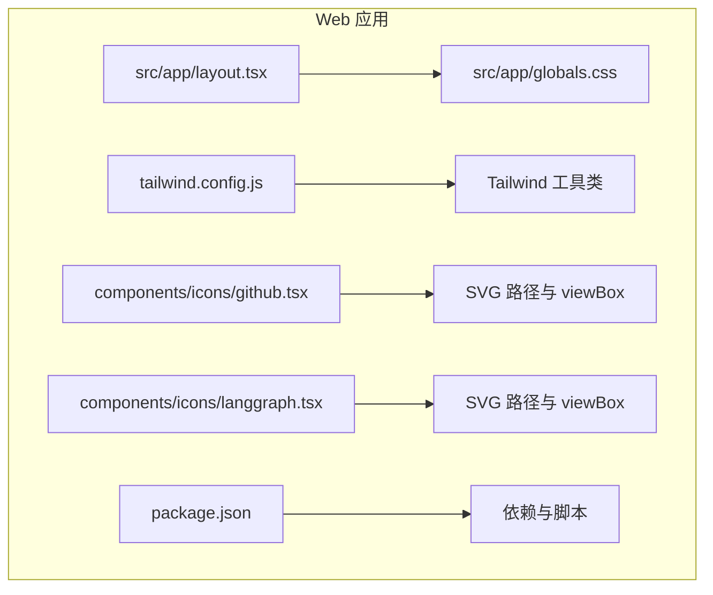
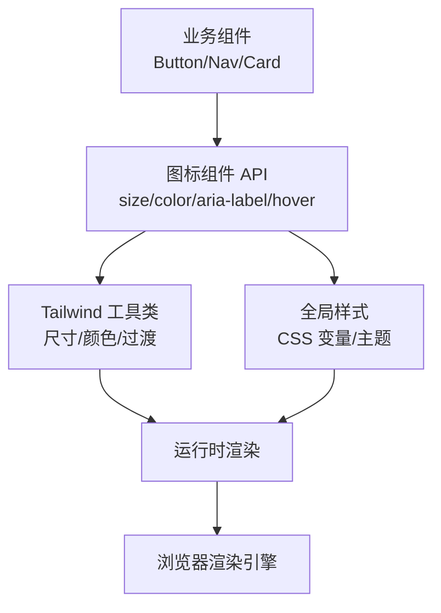
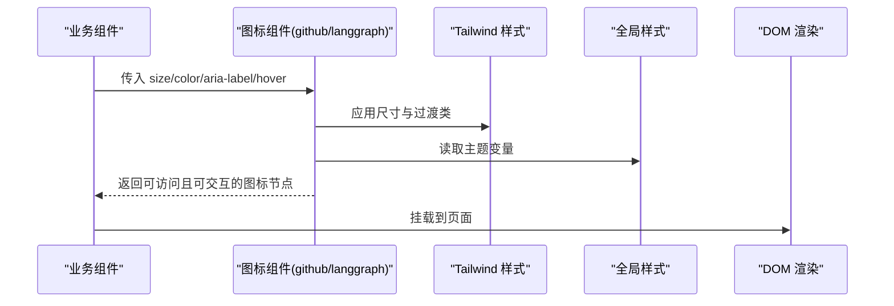
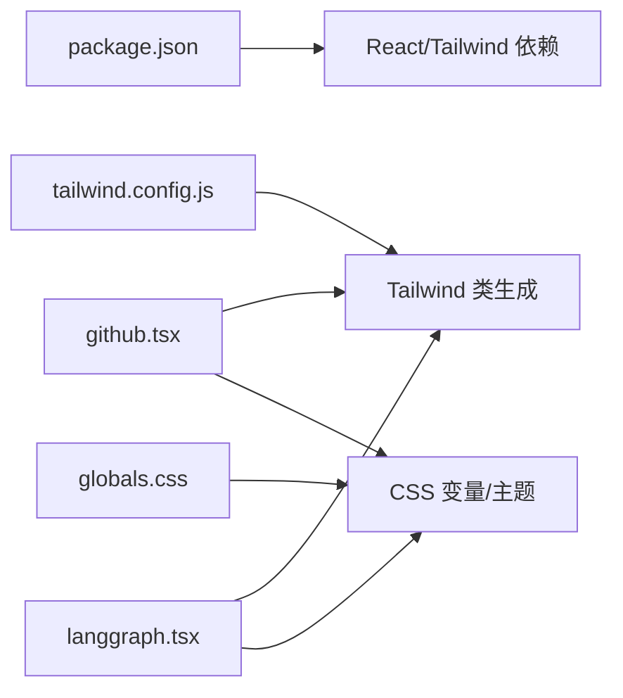

# 图标组件

<cite>
**本文引用的文件**   
- [github.tsx](file://apps/web/src/components/icons/github.tsx)
- [langgraph.tsx](file://apps/web/src/components/icons/langgraph.tsx)
- [tailwind.config.js](file://apps/web/tailwind.config.js)
- [globals.css](file://apps/web/src/app/globals.css)
- [package.json](file://apps/web/package.json)
</cite>

## 目录
1. [简介](#简介)
2. [项目结构](#项目结构)
3. [核心组件](#核心组件)
4. [架构总览](#架构总览)
5. [详细组件分析](#详细组件分析)
6. [依赖分析](#依赖分析)
7. [性能考虑](#性能考虑)
8. [故障排查指南](#故障排查指南)
9. [结论](#结论)
10. [附录](#附录)

## 简介
本文件为图标组件的权威文档，聚焦 GitHub 图标与 LangGraph 图标的 SVG 实现、尺寸适配、样式定制与使用方式。内容涵盖属性配置、颜色主题、悬停效果、可访问性支持、SEO 优化、性能考量，以及图标库维护与版本管理策略，帮助开发者在不同场景下高效、一致地使用和扩展图标。

## 项目结构
图标组件位于前端应用的 components/icons 目录下，采用 React/TSX 封装 SVG 图形，并通过 Tailwind CSS 进行样式控制。全局样式与主题变量集中在应用级样式文件中，便于统一管理与扩展。

图表来源 
- [globals.css](file://apps/web/src/app/globals.css)
- [tailwind.config.js](file://apps/web/tailwind.config.js)
- [github.tsx](file://apps/web/src/components/icons/github.tsx)
- [langgraph.tsx](file://apps/web/src/components/icons/langgraph.tsx)
- [package.json](file://apps/web/package.json)

章节来源
- [globals.css](file://apps/web/src/app/globals.css)
- [tailwind.config.js](file://apps/web/tailwind.config.js)
- [package.json](file://apps/web/package.json)

## 核心组件
- GitHub 图标组件：封装 GitHub 品牌 SVG，提供统一的尺寸、颜色与交互能力。
- LangGraph 图标组件：封装 LangGraph 品牌 SVG，遵循一致的 API 与设计规范。

两个组件均基于 React/TSX 实现，通过 props 暴露尺寸、颜色、无障碍标签等配置项，并支持在悬停时触发视觉反馈（如缩放或颜色变化）。

章节来源
- [github.tsx](file://apps/web/src/components/icons/github.tsx)
- [langgraph.tsx](file://apps/web/src/components/icons/langgraph.tsx)

## 架构总览
图标组件作为原子化 UI 元素，被上层业务组件（如按钮、导航、卡片）复用。样式由 Tailwind 工具类与全局 CSS 变量共同驱动，确保主题一致性。

图表来源 
- [tailwind.config.js](file://apps/web/tailwind.config.js)
- [globals.css](file://apps/web/src/app/globals.css)
- [github.tsx](file://apps/web/src/components/icons/github.tsx)
- [langgraph.tsx](file://apps/web/src/components/icons/langgraph.tsx)

## 详细组件分析

### GitHub 图标组件
- SVG 实现要点
  - 使用标准 viewBox 保证缩放不失真。
  - 路径数据简洁，避免多余节点，提升渲染性能。
  - 通过 fill/stroke 与当前文本颜色联动，便于主题切换。
- 尺寸适配
  - 通过 props 控制 width/height 或使用 Tailwind 尺寸类（如 w-4 h-4、w-6 h-6）。
  - 推荐以 em/rem 为单位，配合父容器字体大小自适应。
- 颜色主题
  - 默认继承父级 color，支持显式覆盖。
  - 可通过 CSS 变量或 Tailwind 自定义色板实现暗色模式。
- 悬停效果
  - 使用 transition-transform 与 hover:scale-* 实现平滑缩放。
  - 可选 hover:text-* 改变颜色，保持品牌一致性。
- 可访问性
  - aria-hidden="true" 用于装饰性图标；若具语义则提供 aria-label。
  - 与按钮组合时，确保焦点可见性与键盘操作可用。
- SEO 优化
  - 图标本身不贡献页面文本，避免重复关键词堆砌。
  - 链接目标需包含有意义的文本或 aria-label，利于爬虫理解。
- 性能考量
  - 内联 SVG 减少 HTTP 请求，适合少量常用图标。
  - 避免复杂滤镜与动画，保持首屏加载速度。

章节来源
- [github.tsx](file://apps/web/src/components/icons/github.tsx)
- [tailwind.config.js](file://apps/web/tailwind.config.js)
- [globals.css](file://apps/web/src/app/globals.css)

### LangGraph 图标组件
- SVG 实现要点
  - 与 GitHub 图标保持一致的 viewBox 与路径风格，便于统一设计系统。
  - 路径分层清晰，便于后续扩展与主题切换。
- 尺寸适配
  - 同 GitHub 图标，支持 props 与 Tailwind 双通道控制。
  - 在多行布局中建议固定宽高比，避免抖动。
- 颜色主题
  - 支持动态颜色注入，便于与产品主色联动。
  - 暗色模式下自动反色或替换路径填充。
- 悬停效果
  - 与 GitHub 图标一致的过渡曲线与时长，保持交互一致性。
  - 可结合 tooltip 展示说明信息。
- 可访问性
  - 与 GitHub 图标相同的无障碍策略，确保屏幕阅读器正确播报。
- SEO 优化
  - 作为品牌标识，避免在 alt/aria-label 中堆砌无关关键词。
- 性能考量
  - 与 GitHub 图标相同，优先内联 SVG，必要时考虑 sprite 方案。

章节来源
- [langgraph.tsx](file://apps/web/src/components/icons/langgraph.tsx)
- [tailwind.config.js](file://apps/web/tailwind.config.js)
- [globals.css](file://apps/web/src/app/globals.css)

### 组件关系与调用流程

图表来源 
- [github.tsx](file://apps/web/src/components/icons/github.tsx)
- [langgraph.tsx](file://apps/web/src/components/icons/langgraph.tsx)
- [tailwind.config.js](file://apps/web/tailwind.config.js)
- [globals.css](file://apps/web/src/app/globals.css)

## 依赖分析
- 运行时依赖
  - React/TSX：组件基础框架。
  - Tailwind CSS：样式工具链，提供尺寸、颜色、过渡等原子类。
- 构建与脚本
  - package.json 中的依赖与脚本用于开发、测试与打包。
- 样式依赖
  - globals.css 定义全局主题变量，供图标颜色与过渡效果使用。

图表来源 
- [package.json](file://apps/web/package.json)
- [tailwind.config.js](file://apps/web/tailwind.config.js)
- [globals.css](file://apps/web/src/app/globals.css)
- [github.tsx](file://apps/web/src/components/icons/github.tsx)
- [langgraph.tsx](file://apps/web/src/components/icons/langgraph.tsx)

章节来源
- [package.json](file://apps/web/package.json)
- [tailwind.config.js](file://apps/web/tailwind.config.js)
- [globals.css](file://apps/web/src/app/globals.css)

## 性能考虑
- 内联 SVG vs Sprite
  - 少量图标建议内联，减少请求开销；大量图标建议使用 SVG Sprite 或按需加载。
- 尺寸与重绘
  - 固定宽高比，避免布局抖动；谨慎使用 transform 与 filter。
- 主题切换
  - 通过 CSS 变量与 Tailwind 类切换，避免 JS 频繁计算。
- 懒加载与缓存
  - 对非首屏图标实施懒加载；利用浏览器缓存静态资源。
- 无障碍与 SEO
  - 合理设置 aria-* 与标题文本，避免冗余描述影响可读性与索引。

[本节为通用指导，无需具体文件引用]

## 故障排查指南
- 图标显示异常
  - 检查 viewBox 与路径数据是否完整。
  - 确认父容器尺寸与颜色继承是否正确。
- 悬停无效果
  - 验证 hover 类是否生效，检查 z-index 与 pointer-events。
- 主题不生效
  - 检查 CSS 变量是否定义，Tailwind 配置是否包含相关类。
- 可访问性问题
  - 确保 aria-label 与键盘可达性符合 WCAG 要求。
- 性能回退
  - 禁用不必要的动画与滤镜，观察 Lighthouse 指标改善。

章节来源
- [globals.css](file://apps/web/src/app/globals.css)
- [tailwind.config.js](file://apps/web/tailwind.config.js)
- [github.tsx](file://apps/web/src/components/icons/github.tsx)
- [langgraph.tsx](file://apps/web/src/components/icons/langgraph.tsx)

## 结论
GitHub 与 LangGraph 图标组件通过 React/TSX 与 Tailwind CSS 实现了高内聚、低耦合的图标抽象层。统一的属性接口、主题与交互模型使图标在不同场景中保持一致体验。遵循本文的可访问性、SEO 与性能最佳实践，可进一步提升用户体验与可维护性。

[本节为总结性内容，无需具体文件引用]

## 附录

### 属性配置参考
- size：图标尺寸，支持数字或 Tailwind 尺寸类（如 w-4 h-4）。
- color：覆盖默认颜色，支持十六进制、RGB 或主题变量。
- aria-label：为具语义图标提供无障碍描述。
- className：附加自定义类名，用于微调样式。
- hover：控制悬停行为（如 scale、color 变化）。

章节来源
- [github.tsx](file://apps/web/src/components/icons/github.tsx)
- [langgraph.tsx](file://apps/web/src/components/icons/langgraph.tsx)

### 颜色主题与悬停效果
- 主题变量
  - 在 globals.css 中定义主色、辅助色与暗色模式变量。
- 悬停策略
  - 使用 transition 与 hover 类实现平滑过渡。
  - 保持品牌色彩一致性，避免过度对比。

章节来源
- [globals.css](file://apps/web/src/app/globals.css)
- [tailwind.config.js](file://apps/web/tailwind.config.js)

### 不同场景下的使用方式
- 导航栏
  - 小尺寸、固定高度，悬停提示品牌名称。
- 按钮
  - 与文字并列，提供清晰的语义与可访问性。
- 卡片与列表
  - 作为状态或分类标识，保持视觉层级一致。
- 弹窗与表单
  - 仅用于装饰时设置 aria-hidden，避免干扰阅读顺序。

章节来源
- [github.tsx](file://apps/web/src/components/icons/github.tsx)
- [langgraph.tsx](file://apps/web/src/components/icons/langgraph.tsx)

### 扩展新图标的最佳实践
- 命名与组织
  - 文件名与组件名一致，置于 components/icons 下。
- SVG 质量
  - 精简路径，统一 viewBox，避免冗余节点。
- 接口一致性
  - 复用现有 props 与样式策略，确保 API 稳定。
- 测试与文档
  - 添加基本用例与可访问性检查，更新本文档。

章节来源
- [github.tsx](file://apps/web/src/components/icons/github.tsx)
- [langgraph.tsx](file://apps/web/src/components/icons/langgraph.tsx)

### 可访问性支持
- 语义与描述
  - 具语义图标需提供 aria-label；装饰性图标设置 aria-hidden。
- 键盘可达性
  - 与按钮组合时确保焦点可见与 Enter/Space 触发。
- 对比度与主题
  - 满足 WCAG 对比度要求，支持暗色模式。

章节来源
- [globals.css](file://apps/web/src/app/globals.css)
- [github.tsx](file://apps/web/src/components/icons/github.tsx)
- [langgraph.tsx](file://apps/web/src/components/icons/langgraph.tsx)

### SEO 优化
- 文本与链接
  - 链接目标包含有意义文本或 aria-label，避免纯图标链接。
- 结构化数据
  - 图标不直接参与结构化数据，但应配合页面内容提升可读性。
- 元信息
  - 页面标题与描述准确反映品牌与功能，避免关键词滥用。

章节来源
- [github.tsx](file://apps/web/src/components/icons/github.tsx)
- [langgraph.tsx](file://apps/web/src/components/icons/langgraph.tsx)

### 性能优化清单
- 内联 SVG 与按需加载
- 固定尺寸与比例，避免重排
- 简化动画与滤镜
- 使用 CSS 变量与 Tailwind 类切换主题
- 监控 Lighthouse 与 Core Web Vitals

[本节为通用指导，无需具体文件引用]

### 图标库维护指南
- 版本管理
  - 使用语义化版本号（主版本.次版本.修订号），变更日志记录破坏性更新。
- 代码规范
  - ESLint/Prettier 统一格式，CI 校验可访问性与性能。
- 文档同步
  - 新增图标同步更新本文档与示例。
- 回归测试
  - 自动化测试覆盖关键路径与主题切换。

章节来源
- [package.json](file://apps/web/package.json)
- [tailwind.config.js](file://apps/web/tailwind.config.js)
- [globals.css](file://apps/web/src/app/globals.css)

### 版本管理策略
- 分支策略
  - main 稳定版，develop 集成版，feature/* 特性分支。
- 发布流程
  - 提交变更 → 代码审查 → 自动化测试 → 打标签 → 发布包。
- 兼容性
  - 向后兼容优先，破坏性更新需大版本升级。
- 回滚机制
  - 保留历史版本与快速回滚能力。

[本节为通用指导，无需具体文件引用]