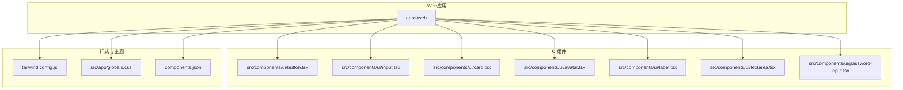
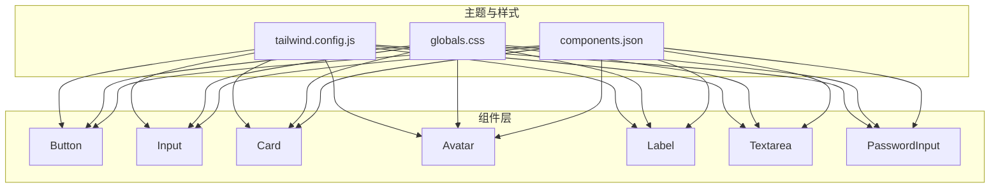
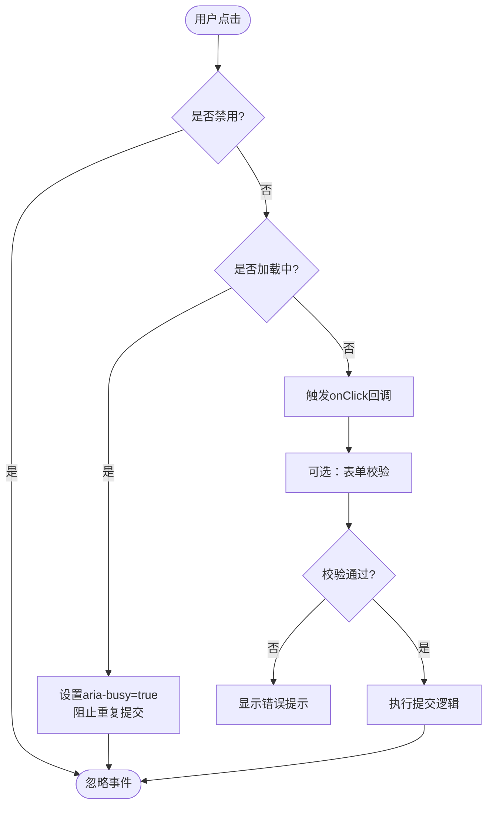
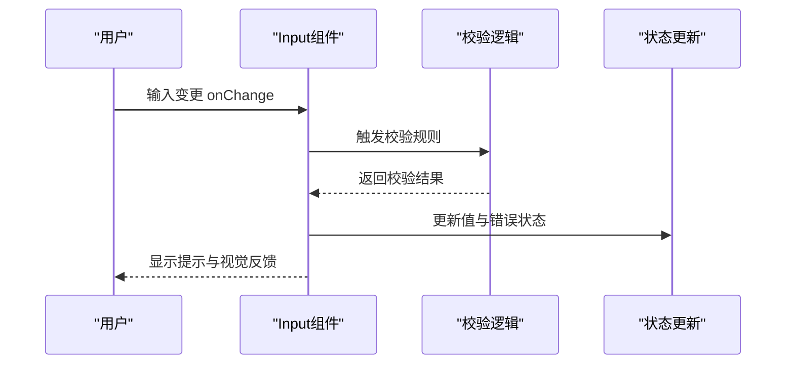
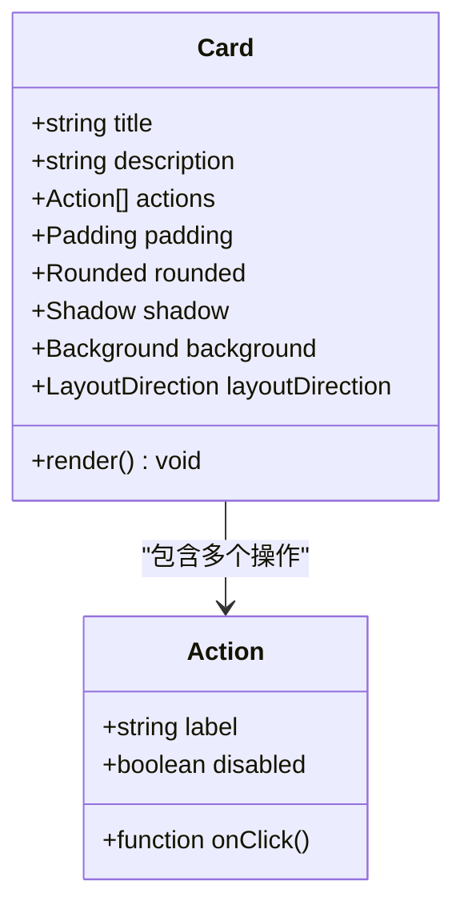
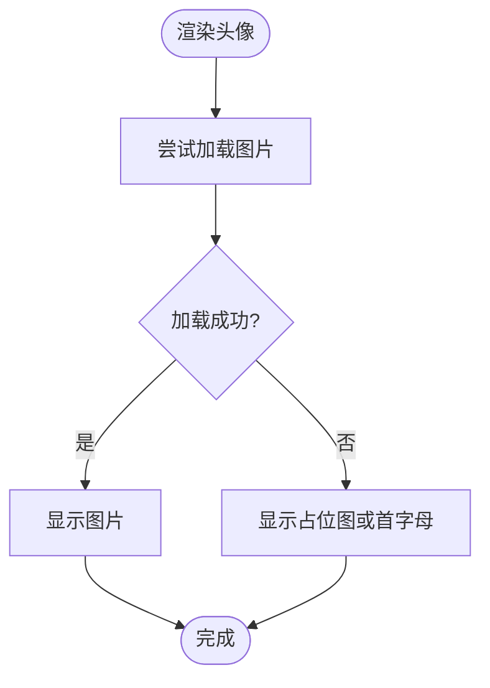
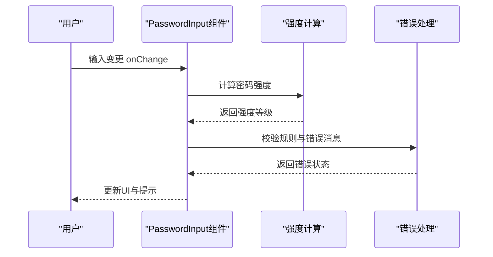
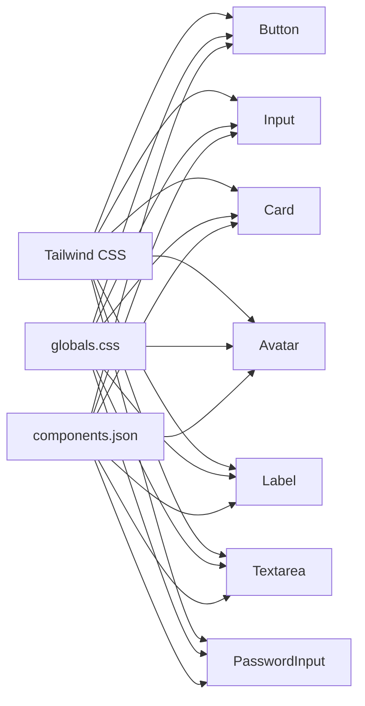

# 基础UI组件

<cite>
**本文引用的文件**   
- [button.tsx](file://apps/web/src/components/ui/button.tsx)
- [input.tsx](file://apps/web/src/components/ui/input.tsx)
- [card.tsx](file://apps/web/src/components/ui/card.tsx)
- [avatar.tsx](file://apps/web/src/components/ui/avatar.tsx)
- [label.tsx](file://apps/web/src/components/ui/label.tsx)
- [textarea.tsx](file://apps/web/src/components/ui/textarea.tsx)
- [password-input.tsx](file://apps/web/src/components/ui/password-input.tsx)
- [tailwind.config.js](file://apps/web/tailwind.config.js)
- [globals.css](file://apps/web/src/app/globals.css)
- [components.json](file://apps/web/components.json)
</cite>

## 目录
1. [简介](#简介)
2. [项目结构](#项目结构)
3. [核心组件](#核心组件)
4. [架构总览](#架构总览)
5. [详细组件分析](#详细组件分析)
6. [依赖关系分析](#依赖关系分析)
7. [性能考虑](#性能考虑)
8. [故障排查指南](#故障排查指南)
9. [结论](#结论)
10. [附录](#附录)

## 简介
本文件面向前端开发者与产品工程师，系统化梳理仓库中的基础UI组件：按钮、输入框、卡片、头像、标签、文本域和密码输入。内容涵盖属性、事件、自定义选项、样式定制、主题支持、响应式特性、无障碍访问（a11y）最佳实践、跨浏览器兼容性、状态管理与验证、错误处理机制、性能优化建议与常见使用模式。读者可据此快速上手并构建一致、可维护、可访问的前端界面。

## 项目结构
- UI组件位于 apps/web/src/components/ui 目录下，采用“按功能拆分”的组织方式，每个组件独立文件，便于复用与维护。
- 样式体系基于 Tailwind CSS，通过 tailwind.config.js 与全局样式 globals.css 进行主题与扩展配置。
- 组件元数据与生成配置由 components.json 管理，确保一致的导出与文档化。

图表来源 
- [button.tsx](file://apps/web/src/components/ui/button.tsx)
- [input.tsx](file://apps/web/src/components/ui/input.tsx)
- [card.tsx](file://apps/web/src/components/ui/card.tsx)
- [avatar.tsx](file://apps/web/src/components/ui/avatar.tsx)
- [label.tsx](file://apps/web/src/components/ui/label.tsx)
- [textarea.tsx](file://apps/web/src/components/ui/textarea.tsx)
- [password-input.tsx](file://apps/web/src/components/ui/password-input.tsx)
- [tailwind.config.js](file://apps/web/tailwind.config.js)
- [globals.css](file://apps/web/src/app/globals.css)
- [components.json](file://apps/web/components.json)

章节来源
- [tailwind.config.js](file://apps/web/tailwind.config.js)
- [globals.css](file://apps/web/src/app/globals.css)
- [components.json](file://apps/web/components.json)

## 核心组件
本节对每个基础组件的属性、事件、自定义项进行说明，并提供基本用法与高级配置的示例路径，帮助快速定位实现细节。

- 按钮 Button
  - 属性：类型（primary/secondary/outline/danger等）、尺寸（sm/md/lg）、禁用态、加载态、图标位置、圆角、阴影、间距等。
  - 事件：点击 onClick、键盘 Enter/Space 触发、焦点与失焦 onFocus/onBlur。
  - 自定义：className、样式变量覆盖、主题色映射、图标插槽。
  - 示例：
    - 基本用法：[button.tsx](file://apps/web/src/components/ui/button.tsx)
    - 高级配置（组合图标与加载态）：[button.tsx](file://apps/web/src/components/ui/button.tsx)

- 输入框 Input
  - 属性：占位符、只读、禁用、大小写控制、自动完成、最大长度、前缀/后缀、图标、校验提示。
  - 事件：onChange、onFocus、onBlur、onKeyDown、onSubmit（表单集成）。
  - 自定义：className、前缀/后缀插槽、主题颜色、边框与阴影。
  - 示例：
    - 基本用法：[input.tsx](file://apps/web/src/components/ui/input.tsx)
    - 带校验与错误提示：[input.tsx](file://apps/web/src/components/ui/input.tsx)

- 卡片 Card
  - 属性：标题、描述、操作区、内边距、圆角、阴影、背景、布局方向。
  - 事件：点击区域、内部元素事件透传。
  - 自定义：头部/主体/底部插槽、样式覆盖、响应式布局。
  - 示例：
    - 基本用法：[card.tsx](file://apps/web/src/components/ui/card.tsx)
    - 复杂布局（多列与嵌套）：[card.tsx](file://apps/web/src/components/ui/card.tsx)

- 头像 Avatar
  - 属性：图片源、备用文本、尺寸、形状（圆形/方形）、加载失败回退、懒加载。
  - 事件：onLoad、onError。
  - 自定义：外层容器样式、边框、阴影、主题适配。
  - 示例：
    - 基本用法：[avatar.tsx](file://apps/web/src/components/ui/avatar.tsx)
    - 错误回退与占位图：[avatar.tsx](file://apps/web/src/components/ui/avatar.tsx)

- 标签 Label
  - 属性：关联的输入控件 id、必填标记、辅助文本、对齐方式。
  - 事件：点击聚焦关联控件。
  - 自定义：字体粗细、颜色、间距、响应式排版。
  - 示例：
    - 基本用法：[label.tsx](file://apps/web/src/components/ui/label.tsx)
    - 与输入框联动：[label.tsx](file://apps/web/src/components/ui/label.tsx)

- 文本域 Textarea
  - 属性：行数、自适应高度、占位符、只读、禁用、最大长度、自动聚焦。
  - 事件：onChange、onFocus、onBlur、onKeyDown。
  - 自定义：className、行高、滚动条样式、主题色。
  - 示例：
    - 基本用法：[textarea.tsx](file://apps/web/src/components/ui/textarea.tsx)
    - 自适应高度与校验：[textarea.tsx](file://apps/web/src/components/ui/textarea.tsx)

- 密码输入 PasswordInput
  - 属性：可见性切换、强度指示器、历史密码保护、掩码字符、自动完成。
  - 事件：onChange、onFocus、onBlur、onToggleVisibility。
  - 自定义：强度阈值、颜色映射、图标、错误提示样式。
  - 示例：
    - 基本用法：[password-input.tsx](file://apps/web/src/components/ui/password-input.tsx)
    - 强度校验与提示：[password-input.tsx](file://apps/web/src/components/ui/password-input.tsx)

章节来源
- [button.tsx](file://apps/web/src/components/ui/button.tsx)
- [input.tsx](file://apps/web/src/components/ui/input.tsx)
- [card.tsx](file://apps/web/src/components/ui/card.tsx)
- [avatar.tsx](file://apps/web/src/components/ui/avatar.tsx)
- [label.tsx](file://apps/web/src/components/ui/label.tsx)
- [textarea.tsx](file://apps/web/src/components/ui/textarea.tsx)
- [password-input.tsx](file://apps/web/src/components/ui/password-input.tsx)

## 架构总览
基础UI组件遵循统一的样式与主题策略，通过 Tailwind CSS 原子类与全局CSS变量实现主题化与响应式。组件之间保持低耦合，通过 props 传递状态与行为，避免深层依赖。

图表来源 
- [tailwind.config.js](file://apps/web/tailwind.config.js)
- [globals.css](file://apps/web/src/app/globals.css)
- [components.json](file://apps/web/components.json)
- [button.tsx](file://apps/web/src/components/ui/button.tsx)
- [input.tsx](file://apps/web/src/components/ui/input.tsx)
- [card.tsx](file://apps/web/src/components/ui/card.tsx)
- [avatar.tsx](file://apps/web/src/components/ui/avatar.tsx)
- [label.tsx](file://apps/web/src/components/ui/label.tsx)
- [textarea.tsx](file://apps/web/src/components/ui/textarea.tsx)
- [password-input.tsx](file://apps/web/src/components/ui/password-input.tsx)

## 详细组件分析

### 按钮 Button
- 设计要点
  - 语义化：使用 button 元素，确保键盘可达性与屏幕阅读器友好。
  - 交互反馈：hover、active、focus-visible 状态清晰；禁用态不可交互。
  - 可组合性：支持图标、加载指示、多种尺寸与变体。
- 属性与事件
  - 属性：type、disabled、loading、variant、size、iconPosition、rounded、shadow、spacing。
  - 事件：onClick、onKeyDown、onFocus、onBlur。
- 样式定制
  - 通过 className 覆盖默认样式；使用 Tailwind 变量或 CSS 变量统一主题。
  - 响应式：在 sm/md/lg/xl 断点下调整尺寸与间距。
- 无障碍最佳实践
  - 为图标按钮提供 aria-label；禁用时设置 disabled 属性；加载态添加 aria-busy。
- 常见用法
  - 基本提交按钮、二次确认按钮、带图标的导航按钮、加载中的异步操作。

图表来源 
- [button.tsx](file://apps/web/src/components/ui/button.tsx)

章节来源
- [button.tsx](file://apps/web/src/components/ui/button.tsx)

### 输入框 Input
- 设计要点
  - 明确输入类型与约束；提供清晰的占位符与辅助文本。
  - 实时反馈：输入过程中即时校验与提示。
- 属性与事件
  - 属性：placeholder、readOnly、disabled、maxLength、prefix/suffix、icon、validationMessage。
  - 事件：onChange、onFocus、onBlur、onKeyDown、onSubmit。
- 样式定制
  - 通过 className 与 Tailwind 变量定制边框、颜色、阴影；响应式宽度与字号。
- 无障碍最佳实践
  - 使用 label 关联 id；错误时使用 aria-invalid 与 aria-describedby 指向提示信息。
- 常见用法
  - 搜索输入、表单字段、带前缀/后缀的数值输入、邮箱与手机号校验。

图表来源 
- [input.tsx](file://apps/web/src/components/ui/input.tsx)

章节来源
- [input.tsx](file://apps/web/src/components/ui/input.tsx)

### 卡片 Card
- 设计要点
  - 信息层级清晰：标题、描述、操作区分离；内边距与留白合理。
  - 响应式布局：在小屏设备堆叠展示，在大屏横向排列。
- 属性与事件
  - 属性：title、description、actions、padding、rounded、shadow、background、layoutDirection。
  - 事件：点击区域透传至子元素。
- 样式定制
  - 通过 className 覆盖容器样式；使用 Tailwind 栅格系统实现布局。
- 无障碍最佳实践
  - 为可点击区域添加 role="button" 与 tabindex；确保键盘导航顺序。
- 常见用法
  - 信息展示卡片、操作面板卡片、列表项卡片。

图表来源 
- [card.tsx](file://apps/web/src/components/ui/card.tsx)

章节来源
- [card.tsx](file://apps/web/src/components/ui/card.tsx)

### 头像 Avatar
- 设计要点
  - 图片加载失败时回退到占位图或首字母；支持懒加载提升性能。
- 属性与事件
  - 属性：src、alt、size、shape、fallback、lazy。
  - 事件：onLoad、onError。
- 样式定制
  - 通过 className 控制边框、阴影、主题色；响应式尺寸。
- 无障碍最佳实践
  - alt 文本描述用户身份；加载失败时提供有意义的备用文本。
- 常见用法
  - 用户列表头像、评论者头像、团队展示。

图表来源 
- [avatar.tsx](file://apps/web/src/components/ui/avatar.tsx)

章节来源
- [avatar.tsx](file://apps/web/src/components/ui/avatar.tsx)

### 标签 Label
- 设计要点
  - 与输入控件强关联；必填标记醒目；辅助文本简洁明了。
- 属性与事件
  - 属性：forId、required、helperText、align。
  - 事件：点击聚焦关联控件。
- 样式定制
  - 通过 className 与 Tailwind 变量调整字体、颜色、间距。
- 无障碍最佳实践
  - 使用 htmlFor 关联 input id；必填时提供 aria-required。
- 常见用法
  - 表单字段标签、分组标题、说明文本。

章节来源
- [label.tsx](file://apps/web/src/components/ui/label.tsx)

### 文本域 Textarea
- 设计要点
  - 多行输入场景；自适应高度提升体验；限制最大长度。
- 属性与事件
  - 属性：rows、autoResize、placeholder、readOnly、disabled、maxLength、autoFocus。
  - 事件：onChange、onFocus、onBlur、onKeyDown。
- 样式定制
  - 通过 className 与 Tailwind 变量定制行高、滚动条样式、主题色。
- 无障碍最佳实践
  - 提供 label 与辅助文本；错误时使用 aria-invalid 与 aria-describedby。
- 常见用法
  - 评论输入、备注填写、富文本前的纯文本编辑。

章节来源
- [textarea.tsx](file://apps/web/src/components/ui/textarea.tsx)

### 密码输入 PasswordInput
- 设计要点
  - 安全性：掩码显示、强度指示、历史密码保护。
- 属性与事件
  - 属性：visible、strengthThresholds、maskChar、autocomplete、errorMessages。
  - 事件：onChange、onFocus、onBlur、onToggleVisibility。
- 样式定制
  - 通过 className 与 Tailwind 变量定制强度条颜色、图标、错误提示样式。
- 无障碍最佳实践
  - 强度提示使用 aria-live 动态播报；错误信息使用 aria-describedby。
- 常见用法
  - 注册登录密码输入、修改密码流程、安全设置。

图表来源 
- [password-input.tsx](file://apps/web/src/components/ui/password-input.tsx)

章节来源
- [password-input.tsx](file://apps/web/src/components/ui/password-input.tsx)

## 依赖关系分析
- 组件与样式依赖
  - 所有组件依赖 Tailwind CSS 原子类与全局CSS变量，确保主题一致性。
  - components.json 管理组件导出与元数据，便于工具链集成。
- 组件间耦合
  - 组件之间无直接依赖，通过 props 传递数据与行为，保持松耦合。
- 外部依赖
  - 基于 React 生态，遵循 Hooks 与函数组件模式；样式基于 Tailwind。

图表来源 
- [tailwind.config.js](file://apps/web/tailwind.config.js)
- [globals.css](file://apps/web/src/app/globals.css)
- [components.json](file://apps/web/components.json)
- [button.tsx](file://apps/web/src/components/ui/button.tsx)
- [input.tsx](file://apps/web/src/components/ui/input.tsx)
- [card.tsx](file://apps/web/src/components/ui/card.tsx)
- [avatar.tsx](file://apps/web/src/components/ui/avatar.tsx)
- [label.tsx](file://apps/web/src/components/ui/label.tsx)
- [textarea.tsx](file://apps/web/src/components/ui/textarea.tsx)
- [password-input.tsx](file://apps/web/src/components/ui/password-input.tsx)

章节来源
- [tailwind.config.js](file://apps/web/tailwind.config.js)
- [globals.css](file://apps/web/src/app/globals.css)
- [components.json](file://apps/web/components.json)

## 性能考虑
- 渲染优化
  - 使用 React.memo 包裹纯展示组件，减少不必要的重渲染。
  - 对长列表或大量头像使用虚拟滚动与懒加载。
- 资源加载
  - 头像图片启用 lazy loading 与占位图，降低首屏压力。
  - 图标与字体按需加载，避免阻塞渲染。
- 事件处理
  - 防抖与节流用于高频输入事件（如搜索输入），减少校验开销。
- 样式与主题
  - 使用 Tailwind 原子类减少CSS体积；避免过度嵌套与重复样式。
- 内存管理
  - 及时清理定时器与事件监听器，防止内存泄漏。

## 故障排查指南
- 常见问题
  - 样式未生效：检查 className 优先级与 Tailwind 配置是否正确。
  - 事件不触发：确认组件未被禁用或处于加载态；检查事件冒泡。
  - 校验不工作：核对校验规则与错误提示绑定是否正确。
  - 图片加载失败：为头像提供 fallback 与 alt 文本。
- 调试技巧
  - 使用浏览器开发者工具检查 DOM 结构与样式。
  - 在控制台打印组件 props 与状态变化。
  - 利用 a11y 工具检查无障碍属性与语义。

## 结论
基础UI组件以统一的主题与样式体系为核心，通过清晰的属性与事件接口，提供一致的交互体验。遵循无障碍最佳实践与性能优化建议，可在不同设备与浏览器上获得稳定、可访问、高性能的用户界面。建议在项目中统一引入这些组件，确保设计与开发的一致性。

## 附录
- 主题与样式
  - 通过 tailwind.config.js 扩展颜色、字体、间距等设计令牌。
  - 在 globals.css 中定义全局CSS变量，供组件主题化使用。
- 组件元数据
  - components.json 管理组件导出、版本与文档链接，便于工具链集成。
- 参考示例
  - 各组件的基本用法与高级配置请参考对应文件路径。