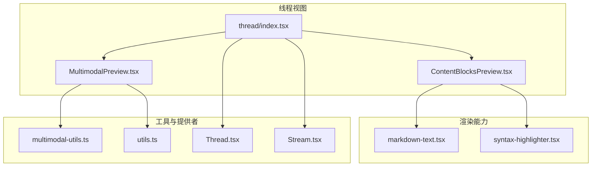
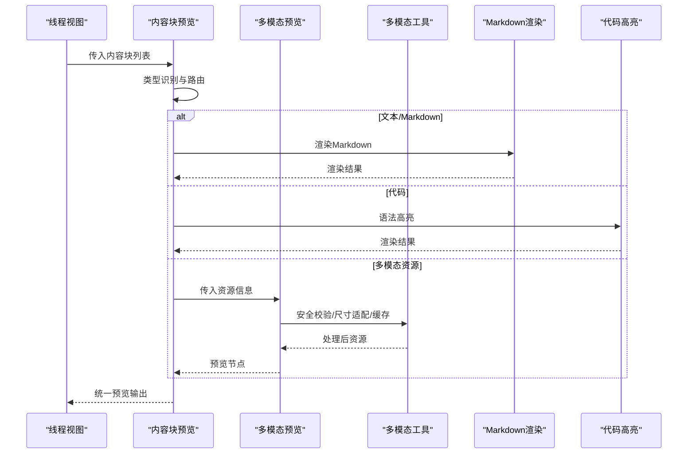
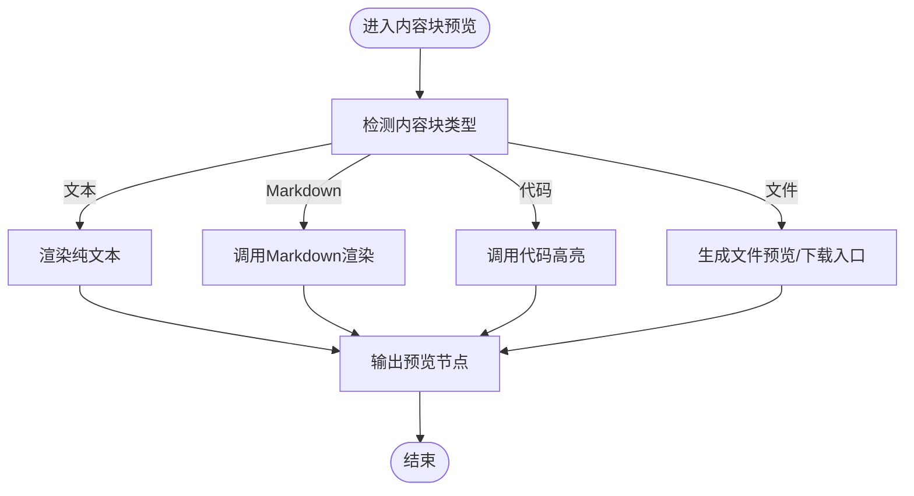
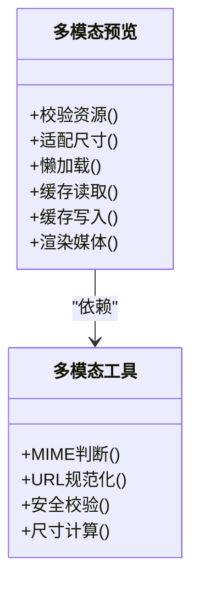
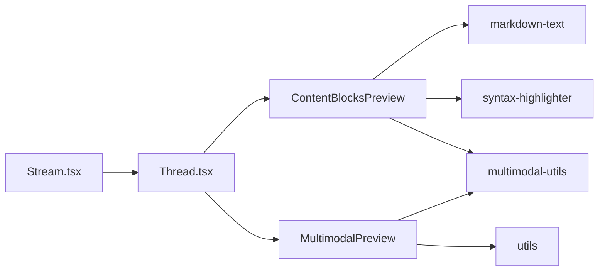

# 内容预览组件

<cite>
**本文档引用的文件**   
- [ContentBlocksPreview.tsx](file://apps/web/src/components/thread/ContentBlocksPreview.tsx)
- [MultimodalPreview.tsx](file://apps/web/src/components/thread/MultimodalPreview.tsx)
- [markdown-text.tsx](file://apps/web/src/components/thread/markdown-text.tsx)
- [syntax-highlighter.tsx](file://apps/web/src/components/thread/syntax-highlighter.tsx)
- [multimodal-utils.ts](file://apps/web/src/lib/multimodal-utils.ts)
- [utils.ts](file://apps/web/src/lib/utils.ts)
- [thread/index.tsx](file://apps/web/src/components/thread/index.tsx)
- [Thread.tsx](file://apps/web/src/providers/Thread.tsx)
- [Stream.tsx](file://apps/web/src/providers/Stream.tsx)
</cite>

## 目录
1. [简介](#简介)
2. [项目结构](#项目结构)
3. [核心组件](#核心组件)
4. [架构总览](#架构总览)
5. [详细组件分析](#详细组件分析)
6. [依赖关系分析](#依赖关系分析)
7. [性能考虑](#性能考虑)
8. [故障排查指南](#故障排查指南)
9. [结论](#结论)
10. [附录](#附录)

## 简介
本文件面向“内容预览组件”，聚焦两类能力：
- 内容块预览：对文本、代码、Markdown 等结构化内容进行渲染与格式化。
- 多模态预览：对图片、音视频、文件等多媒体资源进行安全校验、尺寸适配、懒加载与缓存管理，并提供统一的预览体验。

文档将深入解析渲染策略、格式化处理、多模态处理逻辑、媒体资源管理与缓存机制、内容安全验证、尺寸适配与性能优化，并给出自定义内容类型、扩展预览渲染器以及集成外部服务的实践指导。

## 项目结构
内容预览相关代码主要位于前端 Next.js 应用的 thread 模块与 lib 工具层：
- 组件层：ContentBlocksPreview、MultimodalPreview 负责不同内容类型的分发与渲染。
- 渲染层：markdown-text、syntax-highlighter 提供 Markdown 与代码高亮能力。
- 工具层：multimodal-utils、utils 提供多模态处理、通用工具函数。
- 数据流：Thread、Stream 提供者负责消息流式更新与状态同步。

图表来源
- [thread/index.tsx](file://apps/web/src/components/thread/index.tsx)
- [ContentBlocksPreview.tsx](file://apps/web/src/components/thread/ContentBlocksPreview.tsx)
- [MultimodalPreview.tsx](file://apps/web/src/components/thread/MultimodalPreview.tsx)
- [markdown-text.tsx](file://apps/web/src/components/thread/markdown-text.tsx)
- [syntax-highlighter.tsx](file://apps/web/src/components/thread/syntax-highlighter.tsx)
- [multimodal-utils.ts](file://apps/web/src/lib/multimodal-utils.ts)
- [utils.ts](file://apps/web/src/lib/utils.ts)
- [Thread.tsx](file://apps/web/src/providers/Thread.tsx)
- [Stream.tsx](file://apps/web/src/providers/Stream.tsx)

章节来源
- [thread/index.tsx](file://apps/web/src/components/thread/index.tsx)
- [ContentBlocksPreview.tsx](file://apps/web/src/components/thread/ContentBlocksPreview.tsx)
- [MultimodalPreview.tsx](file://apps/web/src/components/thread/MultimodalPreview.tsx)
- [markdown-text.tsx](file://apps/web/src/components/thread/markdown-text.tsx)
- [syntax-highlighter.tsx](file://apps/web/src/components/thread/syntax-highlighter.tsx)
- [multimodal-utils.ts](file://apps/web/src/lib/multimodal-utils.ts)
- [utils.ts](file://apps/web/src/lib/utils.ts)
- [Thread.tsx](file://apps/web/src/providers/Thread.tsx)
- [Stream.tsx](file://apps/web/src/providers/Stream.tsx)

## 核心组件
- 内容块预览（ContentBlocksPreview）
  - 职责：根据内容块的类型（文本、Markdown、代码、文件等）选择对应渲染器，统一输出预览卡片。
  - 关键点：类型识别、渲染器路由、错误边界、占位与降级展示。
- 多模态预览（MultimodalPreview）
  - 职责：对图片、音视频、文件等资源进行安全校验、尺寸适配、懒加载、缓存与下载入口。
  - 关键点：MIME 判定、URL 规范化、跨域与权限检查、响应式尺寸、内存与磁盘缓存。

章节来源
- [ContentBlocksPreview.tsx](file://apps/web/src/components/thread/ContentBlocksPreview.tsx)
- [MultimodalPreview.tsx](file://apps/web/src/components/thread/MultimodalPreview.tsx)

## 架构总览
内容预览采用“分发 + 渲染器”的架构：上游通过线程与流式提供者聚合消息，内容块进入预览组件后按类型路由到具体渲染器；多模态资源在进入渲染前经过工具层的校验与预处理，确保安全性与一致性。

图表来源
- [ContentBlocksPreview.tsx](file://apps/web/src/components/thread/ContentBlocksPreview.tsx)
- [MultimodalPreview.tsx](file://apps/web/src/components/thread/MultimodalPreview.tsx)
- [markdown-text.tsx](file://apps/web/src/components/thread/markdown-text.tsx)
- [syntax-highlighter.tsx](file://apps/web/src/components/thread/syntax-highlighter.tsx)
- [multimodal-utils.ts](file://apps/web/src/lib/multimodal-utils.ts)

## 详细组件分析

### 内容块预览（ContentBlocksPreview）
- 类型识别与路由
  - 基于内容块元数据（如 type、mime、format）决定渲染路径。
  - 支持文本、Markdown、代码、文件链接等常见类型。
- 渲染策略
  - 文本：纯文本展示，保留换行与基础样式。
  - Markdown：交由 markdown-text 渲染，支持标题、列表、表格、链接等。
  - 代码：交由 syntax-highlighter 进行语法高亮与复制功能。
  - 文件：生成可点击的下载或在线预览入口，视 MIME 而定。
- 错误处理与降级
  - 渲染失败时显示占位提示，记录错误日志，避免中断整体渲染。
  - 对超大内容启用分页或折叠，防止阻塞主线程。

图表来源
- [ContentBlocksPreview.tsx](file://apps/web/src/components/thread/ContentBlocksPreview.tsx)

章节来源
- [ContentBlocksPreview.tsx](file://apps/web/src/components/thread/ContentBlocksPreview.tsx)

### 多模态预览（MultimodalPreview）
- 资源安全校验
  - 校验 URL 协议白名单、域名与路径合法性。
  - 校验 MIME 类型与扩展名一致性，拒绝危险类型。
- 尺寸适配与懒加载
  - 根据容器宽度计算最佳尺寸，避免布局抖动。
  - 使用 IntersectionObserver 实现懒加载，减少首屏压力。
- 缓存机制
  - 浏览器内存缓存（Map）与 localStorage/IndexedDB 持久化缓存结合。
  - 针对大体积资源采用分片与断点续传（若后端支持）。
- 媒体播放控制
  - 视频/音频自动暂停、音量默认值、字幕与封面图支持。
- 下载与分享
  - 生成安全的下载链接，支持命名规范与访问统计。

图表来源
- [MultimodalPreview.tsx](file://apps/web/src/components/thread/MultimodalPreview.tsx)
- [multimodal-utils.ts](file://apps/web/src/lib/multimodal-utils.ts)

章节来源
- [MultimodalPreview.tsx](file://apps/web/src/components/thread/MultimodalPreview.tsx)
- [multimodal-utils.ts](file://apps/web/src/lib/multimodal-utils.ts)

### Markdown 渲染（markdown-text）
- 支持标准 Markdown 语法，包括标题、段落、列表、引用、表格、代码块、链接与图片。
- 安全过滤：移除脚本与事件属性，仅允许白名单标签。
- 主题与样式：通过 CSS 变量与 Tailwind 类名统一风格。

章节来源
- [markdown-text.tsx](file://apps/web/src/components/thread/markdown-text.tsx)

### 代码高亮（syntax-highlighter）
- 基于语言标识选择语法高亮规则。
- 支持复制、行号、折叠与搜索定位。
- 对超长代码进行虚拟滚动或分页渲染，提升性能。

章节来源
- [syntax-highlighter.tsx](file://apps/web/src/components/thread/syntax-highlighter.tsx)

### 工具与提供者
- 多模态工具（multimodal-utils）
  - 提供 MIME 判断、URL 规范化、安全校验、尺寸计算等通用方法。
- 通用工具（utils）
  - 提供防抖、节流、深拷贝、类型判断等常用函数。
- 线程与流式提供者（Thread.tsx、Stream.tsx）
  - 管理消息状态与增量更新，驱动预览组件实时渲染。

章节来源
- [multimodal-utils.ts](file://apps/web/src/lib/multimodal-utils.ts)
- [utils.ts](file://apps/web/src/lib/utils.ts)
- [Thread.tsx](file://apps/web/src/providers/Thread.tsx)
- [Stream.tsx](file://apps/web/src/providers/Stream.tsx)

## 依赖关系分析
- 组件耦合
  - ContentBlocksPreview 依赖 markdown-text、syntax-highlighter 与 multimodal-utils。
  - MultimodalPreview 依赖 multimodal-utils 与 utils。
- 外部依赖
  - 第三方 Markdown 渲染库与代码高亮库按需引入，建议版本锁定与最小化打包。
- 潜在循环依赖
  - 工具层不反向依赖组件层，保持单向依赖。

图表来源
- [ContentBlocksPreview.tsx](file://apps/web/src/components/thread/ContentBlocksPreview.tsx)
- [MultimodalPreview.tsx](file://apps/web/src/components/thread/MultimodalPreview.tsx)
- [markdown-text.tsx](file://apps/web/src/components/thread/markdown-text.tsx)
- [syntax-highlighter.tsx](file://apps/web/src/components/thread/syntax-highlighter.tsx)
- [multimodal-utils.ts](file://apps/web/src/lib/multimodal-utils.ts)
- [utils.ts](file://apps/web/src/lib/utils.ts)
- [Thread.tsx](file://apps/web/src/providers/Thread.tsx)
- [Stream.tsx](file://apps/web/src/providers/Stream.tsx)

章节来源
- [ContentBlocksPreview.tsx](file://apps/web/src/components/thread/ContentBlocksPreview.tsx)
- [MultimodalPreview.tsx](file://apps/web/src/components/thread/MultimodalPreview.tsx)
- [markdown-text.tsx](file://apps/web/src/components/thread/markdown-text.tsx)
- [syntax-highlighter.tsx](file://apps/web/src/components/thread/syntax-highlighter.tsx)
- [multimodal-utils.ts](file://apps/web/src/lib/multimodal-utils.ts)
- [utils.ts](file://apps/web/src/lib/utils.ts)
- [Thread.tsx](file://apps/web/src/providers/Thread.tsx)
- [Stream.tsx](file://apps/web/src/providers/Stream.tsx)

## 性能考虑
- 渲染性能
  - 对长文本与代码使用虚拟滚动或分页，避免一次性渲染导致卡顿。
  - Markdown 与代码高亮按需加载，延迟初始化重型库。
- 网络与缓存
  - 启用 HTTP 缓存头（Cache-Control、ETag），配合前端内存与持久化缓存。
  - 大资源分片下载与并发限制，避免带宽拥塞。
- 内存管理
  - 及时释放不再使用的对象与监听器，防止内存泄漏。
  - 图片与视频使用惰性加载与预加载策略平衡。
- 交互优化
  - 骨架屏与占位符提升感知性能。
  - 用户操作防抖与节流，降低频繁重渲染。

[本节为通用性能建议，不直接分析具体文件]

## 故障排查指南
- 渲染异常
  - 检查内容块类型识别是否正确，确认 MIME 与扩展名一致。
  - 查看错误边界捕获的日志，定位渲染器抛出的异常。
- 多模态资源无法加载
  - 校验 URL 协议与域名是否在白名单内。
  - 检查跨域配置与鉴权令牌是否有效。
- 性能问题
  - 使用浏览器性能面板分析渲染耗时与内存占用。
  - 检查是否存在未释放的监听器或重复订阅。
- 缓存失效
  - 清理本地缓存并重新拉取资源，确认缓存键生成规则。
  - 对比服务端缓存头与前端缓存策略是否匹配。

章节来源
- [ContentBlocksPreview.tsx](file://apps/web/src/components/thread/ContentBlocksPreview.tsx)
- [MultimodalPreview.tsx](file://apps/web/src/components/thread/MultimodalPreview.tsx)
- [multimodal-utils.ts](file://apps/web/src/lib/multimodal-utils.ts)

## 结论
内容预览组件通过“类型识别 + 渲染器路由”的模式，实现了文本、代码、Markdown 与多模态资源的统一预览。多模态工具层提供了安全校验、尺寸适配与缓存管理能力，结合线程与流式提供者，保证了实时性与一致性。遵循本文档的实践建议，可进一步提升渲染性能、安全性与可扩展性。

[本节为总结性内容，不直接分析具体文件]

## 附录

### 自定义内容类型与扩展渲染器
- 新增内容类型
  - 在内容块类型枚举中注册新类型，定义其元数据（如 mime、format、icon）。
- 扩展渲染器
  - 创建新的渲染组件，实现统一的接口（props、错误处理、占位）。
  - 在 ContentBlocksPreview 的类型路由中接入新渲染器。
- 测试与回归
  - 编写单元测试覆盖渲染分支与异常路径。
  - 进行端到端测试验证真实场景下的表现。

章节来源
- [ContentBlocksPreview.tsx](file://apps/web/src/components/thread/ContentBlocksPreview.tsx)

### 集成外部服务
- 资源托管服务
  - 配置 CDN 域名与鉴权参数，确保资源加速与安全访问。
- 预览服务
  - 对接在线预览 API，返回标准化预览节点或缩略图。
- 安全策略
  - 在服务端进行二次校验，前端仅做展示与交互。
  - 启用 CSP 与子资源完整性（SRI）增强安全性。

章节来源
- [multimodal-utils.ts](file://apps/web/src/lib/multimodal-utils.ts)
- [Thread.tsx](file://apps/web/src/providers/Thread.tsx)
- [Stream.tsx](file://apps/web/src/providers/Stream.tsx)