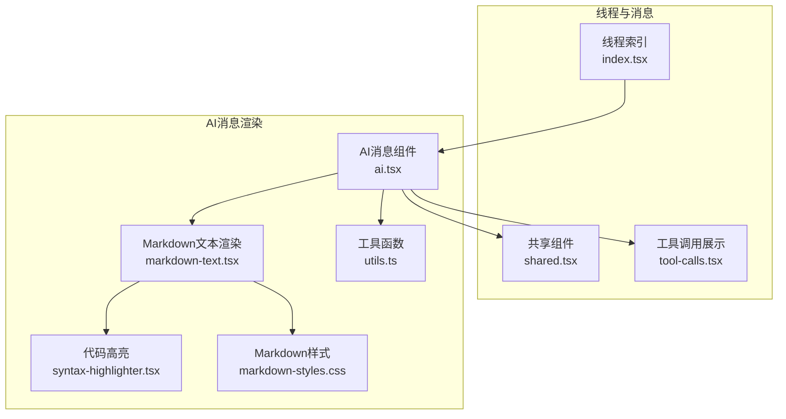
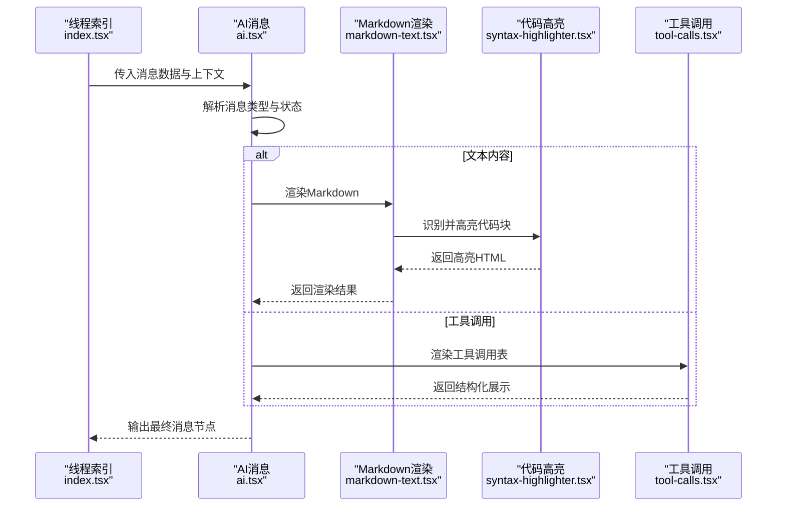
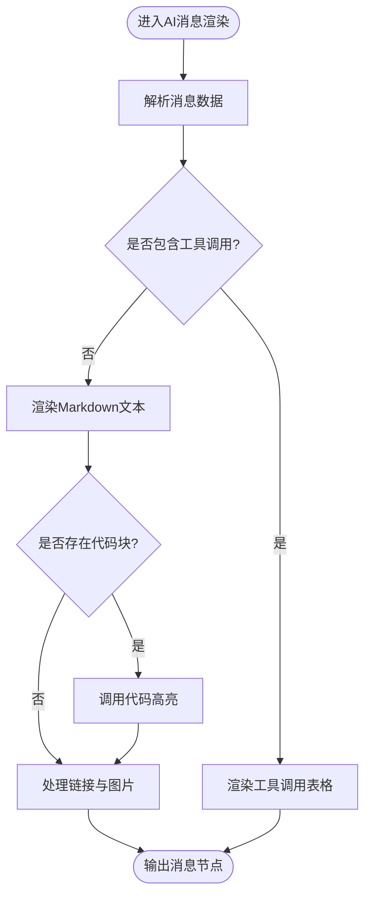
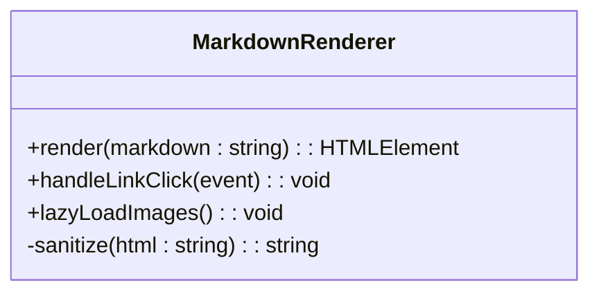
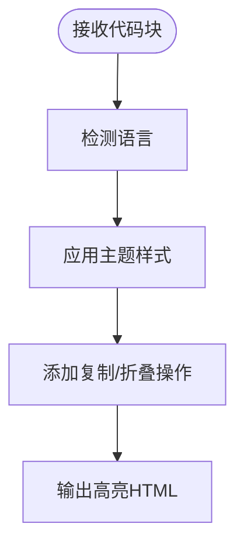
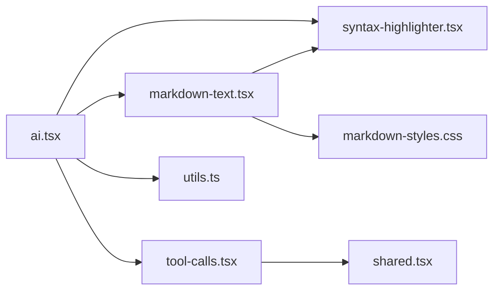

# AI消息组件

<cite>
**本文档引用的文件**   
- [apps/web/src/components/thread/messages/ai.tsx](file://apps/web/src/components/thread/messages/ai.tsx)
- [apps/web/src/components/thread/markdown-text.tsx](file://apps/web/src/components/thread/markdown-text.tsx)
- [apps/web/src/components/thread/syntax-highlighter.tsx](file://apps/web/src/components/thread/syntax-highlighter.tsx)
- [apps/web/src/components/thread/markdown-styles.css](file://apps/web/src/components/thread/markdown-styles.css)
- [apps/web/src/components/thread/utils.ts](file://apps/web/src/components/thread/utils.ts)
- [apps/web/src/components/thread/shared.tsx](file://apps/web/src/components/thread/shared.tsx)
- [apps/web/src/components/thread/tool-calls.tsx](file://apps/web/src/components/thread/tool-calls.tsx)
- [apps/web/src/components/thread/index.tsx](file://apps/web/src/components/thread/index.tsx)
</cite>

## 目录
1. [简介](#简介)
2. [项目结构](#项目结构)
3. [核心组件](#核心组件)
4. [架构总览](#架构总览)
5. [详细组件分析](#详细组件分析)
6. [依赖关系分析](#依赖关系分析)
7. [性能考虑](#性能考虑)
8. [故障排查指南](#故障排查指南)
9. [结论](#结论)
10. [附录](#附录)

## 简介
本文件为AI消息组件的完整技术文档，聚焦于AI消息在前端的渲染与交互。内容涵盖Markdown文本处理、代码块高亮、链接处理、图片展示、样式定制、响应式设计与交互行为；同时给出格式化规则、错误处理与性能优化策略，并提供自定义渲染器、扩展集成与主题适配的实现指导。读者无需深入前端框架细节即可理解并扩展该组件。

## 项目结构
AI消息相关的前端实现集中在Web应用的thread模块中，围绕“消息渲染”这一职责进行分层组织：
- 消息容器与编排：负责消息列表渲染、类型分发与状态管理
- AI消息渲染：将结构化或流式数据渲染为可读界面，包含Markdown、代码块、链接、图片等
- Markdown与语法高亮：Markdown解析、样式注入、代码块语言识别与高亮
- 工具调用展示：对工具调用结果进行表格化或结构化呈现
- 通用工具与共享组件：提供辅助函数、图标、按钮等基础能力

图表来源
- [apps/web/src/components/thread/index.tsx](file://apps/web/src/components/thread/index.tsx)
- [apps/web/src/components/thread/messages/ai.tsx](file://apps/web/src/components/thread/messages/ai.tsx)
- [apps/web/src/components/thread/markdown-text.tsx](file://apps/web/src/components/thread/markdown-text.tsx)
- [apps/web/src/components/thread/syntax-highlighter.tsx](file://apps/web/src/components/thread/syntax-highlighter.tsx)
- [apps/web/src/components/thread/markdown-styles.css](file://apps/web/src/components/thread/markdown-styles.css)
- [apps/web/src/components/thread/utils.ts](file://apps/web/src/components/thread/utils.ts)
- [apps/web/src/components/thread/shared.tsx](file://apps/web/src/components/thread/shared.tsx)
- [apps/web/src/components/thread/tool-calls.tsx](file://apps/web/src/components/thread/tool-calls.tsx)

章节来源
- [apps/web/src/components/thread/index.tsx](file://apps/web/src/components/thread/index.tsx)
- [apps/web/src/components/thread/messages/ai.tsx](file://apps/web/src/components/thread/messages/ai.tsx)
- [apps/web/src/components/thread/markdown-text.tsx](file://apps/web/src/components/thread/markdown-text.tsx)
- [apps/web/src/components/thread/syntax-highlighter.tsx](file://apps/web/src/components/thread/syntax-highlighter.tsx)
- [apps/web/src/components/thread/markdown-styles.css](file://apps/web/src/components/thread/markdown-styles.css)
- [apps/web/src/components/thread/utils.ts](file://apps/web/src/components/thread/utils.ts)
- [apps/web/src/components/thread/shared.tsx](file://apps/web/src/components/thread/shared.tsx)
- [apps/web/src/components/thread/tool-calls.tsx](file://apps/web/src/components/thread/tool-calls.tsx)

## 核心组件
- AI消息组件（ai.tsx）：接收后端消息数据，按类型分派渲染逻辑，组合Markdown、代码块、链接、图片与工具调用展示，并处理交互与状态。
- Markdown文本渲染（markdown-text.tsx）：将Markdown字符串转换为可访问的HTML片段，注入样式，处理链接点击与图片加载。
- 代码高亮（syntax-highlighter.tsx）：识别代码块语言，应用语法高亮，支持复制与折叠等交互。
- 工具调用展示（tool-calls.tsx）：将工具调用参数与结果以表格形式呈现，便于调试与审计。
- 工具函数（utils.ts）：提供URL校验、安全转义、媒体尺寸计算、防抖节流等通用能力。
- 共享组件（shared.tsx）：提供图标、按钮、提示框等UI元素，保证一致性。

章节来源
- [apps/web/src/components/thread/messages/ai.tsx](file://apps/web/src/components/thread/messages/ai.tsx)
- [apps/web/src/components/thread/markdown-text.tsx](file://apps/web/src/components/thread/markdown-text.tsx)
- [apps/web/src/components/thread/syntax-highlighter.tsx](file://apps/web/src/components/thread/syntax-highlighter.tsx)
- [apps/web/src/components/thread/tool-calls.tsx](file://apps/web/src/components/thread/tool-calls.tsx)
- [apps/web/src/components/thread/utils.ts](file://apps/web/src/components/thread/utils.ts)
- [apps/web/src/components/thread/shared.tsx](file://apps/web/src/components/thread/shared.tsx)

## 架构总览
AI消息渲染采用“分层+组合”的架构：消息容器负责编排，Markdown与高亮负责内容渲染，工具调用负责结构化输出，样式与工具函数贯穿其中。整体流程如下：

图表来源
- [apps/web/src/components/thread/index.tsx](file://apps/web/src/components/thread/index.tsx)
- [apps/web/src/components/thread/messages/ai.tsx](file://apps/web/src/components/thread/messages/ai.tsx)
- [apps/web/src/components/thread/markdown-text.tsx](file://apps/web/src/components/thread/markdown-text.tsx)
- [apps/web/src/components/thread/syntax-highlighter.tsx](file://apps/web/src/components/thread/syntax-highlighter.tsx)
- [apps/web/src/components/thread/tool-calls.tsx](file://apps/web/src/components/thread/tool-calls.tsx)

## 详细组件分析

### AI消息组件（ai.tsx）
- 功能要点
  - 接收消息对象，判断是否为AI消息，并提取文本、工具调用、图片等字段
  - 根据消息状态（加载中、完成、错误）切换渲染分支
  - 组合Markdown渲染、代码高亮、链接处理、图片展示与工具调用表格
  - 处理用户交互（如复制代码、展开/折叠、点击链接）
- 关键设计
  - 使用条件渲染与组合模式，避免单一组件臃肿
  - 通过工具函数统一处理URL与安全转义
  - 与共享组件协作，确保UI一致性与可访问性

图表来源
- [apps/web/src/components/thread/messages/ai.tsx](file://apps/web/src/components/thread/messages/ai.tsx)
- [apps/web/src/components/thread/tool-calls.tsx](file://apps/web/src/components/thread/tool-calls.tsx)
- [apps/web/src/components/thread/markdown-text.tsx](file://apps/web/src/components/thread/markdown-text.tsx)
- [apps/web/src/components/thread/syntax-highlighter.tsx](file://apps/web/src/components/thread/syntax-highlighter.tsx)

章节来源
- [apps/web/src/components/thread/messages/ai.tsx](file://apps/web/src/components/thread/messages/ai.tsx)

### Markdown文本渲染（markdown-text.tsx）
- 功能要点
  - 将Markdown字符串转换为HTML片段
  - 注入样式类名，确保与主题一致
  - 处理链接点击事件，防止默认跳转或打开新窗口
  - 图片懒加载与占位符显示，提升首屏性能
- 关键设计
  - 使用安全的HTML生成方式，避免XSS风险
  - 通过CSS变量与类名控制外观，便于主题定制
  - 与代码高亮组件解耦，仅传递代码块片段

图表来源
- [apps/web/src/components/thread/markdown-text.tsx](file://apps/web/src/components/thread/markdown-text.tsx)
- [apps/web/src/components/thread/markdown-styles.css](file://apps/web/src/components/thread/markdown-styles.css)

章节来源
- [apps/web/src/components/thread/markdown-text.tsx](file://apps/web/src/components/thread/markdown-text.tsx)
- [apps/web/src/components/thread/markdown-styles.css](file://apps/web/src/components/thread/markdown-styles.css)

### 代码高亮（syntax-highlighter.tsx）
- 功能要点
  - 识别代码块语言（如JavaScript、Python、SQL等）
  - 应用语法高亮样式，区分关键字、字符串、注释等
  - 提供复制代码、折叠/展开等交互
- 关键设计
  - 按需加载高亮库，减少包体积
  - 使用CSS类名映射主题色，支持暗色/亮色模式
  - 与Markdown渲染分离，便于复用与测试

图表来源
- [apps/web/src/components/thread/syntax-highlighter.tsx](file://apps/web/src/components/thread/syntax-highlighter.tsx)

章节来源
- [apps/web/src/components/thread/syntax-highlighter.tsx](file://apps/web/src/components/thread/syntax-highlighter.tsx)

### 工具调用展示（tool-calls.tsx）
- 功能要点
  - 将工具调用的参数与结果以表格形式呈现
  - 支持嵌套对象与数组的扁平化展示
  - 提供搜索与过滤功能，便于快速定位信息
- 关键设计
  - 使用统一的表格组件，保持视觉一致性
  - 对敏感信息进行脱敏处理
  - 支持导出为JSON，便于调试与分享

章节来源
- [apps/web/src/components/thread/tool-calls.tsx](file://apps/web/src/components/thread/tool-calls.tsx)

### 工具函数（utils.ts）
- 功能要点
  - URL校验与规范化，确保链接安全
  - HTML转义与清理，防止XSS攻击
  - 媒体尺寸计算与响应式适配
  - 防抖与节流，优化频繁操作的性能
- 关键设计
  - 纯函数设计，无副作用，易于测试
  - 提供配置项，支持不同场景的定制化

章节来源
- [apps/web/src/components/thread/utils.ts](file://apps/web/src/components/thread/utils.ts)

### 共享组件（shared.tsx）
- 功能要点
  - 提供图标、按钮、提示框等基础UI元素
  - 遵循无障碍标准，支持键盘导航与屏幕阅读器
  - 与主题系统联动，自动适配颜色与间距
- 关键设计
  - 组件原子化，便于组合与复用
  - 通过props暴露样式覆盖点，支持主题定制

章节来源
- [apps/web/src/components/thread/shared.tsx](file://apps/web/src/components/thread/shared.tsx)

## 依赖关系分析
AI消息组件的依赖关系清晰且低耦合：
- ai.tsx依赖markdown-text.tsx、syntax-highlighter.tsx、tool-calls.tsx与utils.ts
- markdown-text.tsx依赖syntax-highlighter.tsx与markdown-styles.css
- tool-calls.tsx依赖shared.tsx中的基础UI组件
- utils.ts被多个组件复用，提供通用能力

图表来源
- [apps/web/src/components/thread/messages/ai.tsx](file://apps/web/src/components/thread/messages/ai.tsx)
- [apps/web/src/components/thread/markdown-text.tsx](file://apps/web/src/components/thread/markdown-text.tsx)
- [apps/web/src/components/thread/syntax-highlighter.tsx](file://apps/web/src/components/thread/syntax-highlighter.tsx)
- [apps/web/src/components/thread/tool-calls.tsx](file://apps/web/src/components/thread/tool-calls.tsx)
- [apps/web/src/components/thread/utils.ts](file://apps/web/src/components/thread/utils.ts)
- [apps/web/src/components/thread/shared.tsx](file://apps/web/src/components/thread/shared.tsx)
- [apps/web/src/components/thread/markdown-styles.css](file://apps/web/src/components/thread/markdown-styles.css)

章节来源
- [apps/web/src/components/thread/messages/ai.tsx](file://apps/web/src/components/thread/messages/ai.tsx)
- [apps/web/src/components/thread/markdown-text.tsx](file://apps/web/src/components/thread/markdown-text.tsx)
- [apps/web/src/components/thread/syntax-highlighter.tsx](file://apps/web/src/components/thread/syntax-highlighter.tsx)
- [apps/web/src/components/thread/tool-calls.tsx](file://apps/web/src/components/thread/tool-calls.tsx)
- [apps/web/src/components/thread/utils.ts](file://apps/web/src/components/thread/utils.ts)
- [apps/web/src/components/thread/shared.tsx](file://apps/web/src/components/thread/shared.tsx)
- [apps/web/src/components/thread/markdown-styles.css](file://apps/web/src/components/thread/markdown-styles.css)

## 性能考虑
- 渲染优化
  - 使用虚拟滚动或分页加载长消息，避免一次性渲染大量DOM
  - 对图片进行懒加载与压缩，减少首屏资源
  - 代码高亮按需加载，避免阻塞主线程
- 内存管理
  - 及时释放事件监听器与定时器，防止内存泄漏
  - 对大对象进行引用计数与缓存失效策略
- 交互优化
  - 对频繁操作（如搜索、过滤）使用防抖与节流
  - 提供骨架屏与占位符，提升用户体验

[本节为通用指导，不直接分析具体文件]

## 故障排查指南
- Markdown渲染异常
  - 检查输入字符串是否包含非法字符或恶意脚本
  - 确认样式类名是否正确注入，避免冲突
- 代码高亮失败
  - 验证语言标识是否被正确识别
  - 检查高亮库是否成功加载，是否有版本兼容问题
- 链接与图片加载失败
  - 确认URL格式是否正确，是否被安全策略拦截
  - 检查网络请求是否被CORS或代理限制
- 工具调用展示错乱
  - 验证数据结构是否符合预期，必要时进行降级处理
  - 检查表格组件的列宽与换行设置

章节来源
- [apps/web/src/components/thread/markdown-text.tsx](file://apps/web/src/components/thread/markdown-text.tsx)
- [apps/web/src/components/thread/syntax-highlighter.tsx](file://apps/web/src/components/thread/syntax-highlighter.tsx)
- [apps/web/src/components/thread/tool-calls.tsx](file://apps/web/src/components/thread/tool-calls.tsx)
- [apps/web/src/components/thread/utils.ts](file://apps/web/src/components/thread/utils.ts)

## 结论
AI消息组件通过清晰的架构与模块化设计，实现了Markdown渲染、代码高亮、链接与图片处理、工具调用展示等核心功能。其低耦合、可扩展的特性使得主题定制、交互增强与性能优化变得简单直观。建议在实际使用中结合业务需求，进一步扩展自定义渲染器与插件机制，以提升用户体验与开发效率。

[本节为总结性内容，不直接分析具体文件]

## 附录
- 自定义渲染器
  - 在ai.tsx中注入自定义Markdown处理器，替换默认渲染逻辑
  - 通过props或上下文传递主题配置，动态切换样式
- 扩展功能集成
  - 在syntax-highlighter.tsx中添加新的语言支持
  - 在tool-calls.tsx中扩展表格列与操作按钮
- 主题适配
  - 使用CSS变量定义颜色与间距，确保暗色/亮色模式一致
  - 通过Tailwind或CSS-in-JS方案实现动态主题切换

[本节为补充说明，不直接分析具体文件]