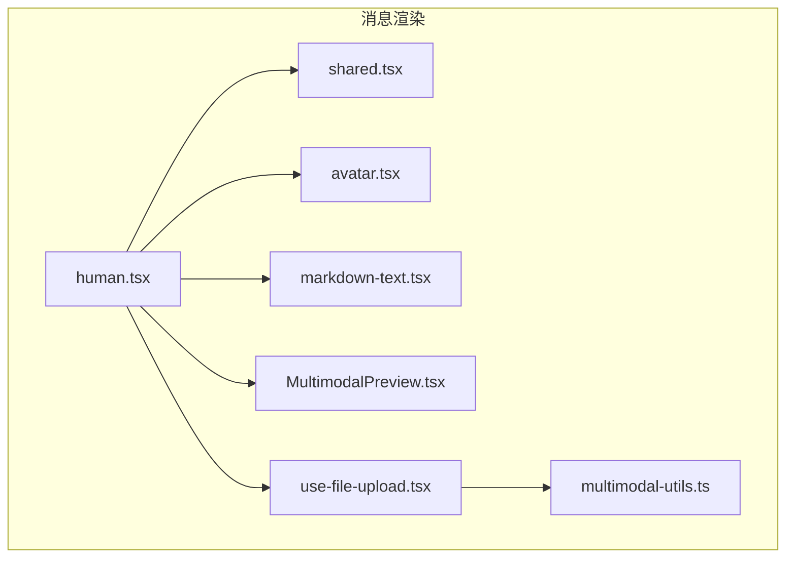
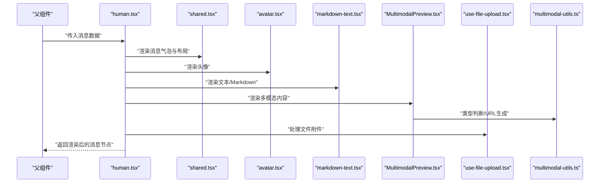
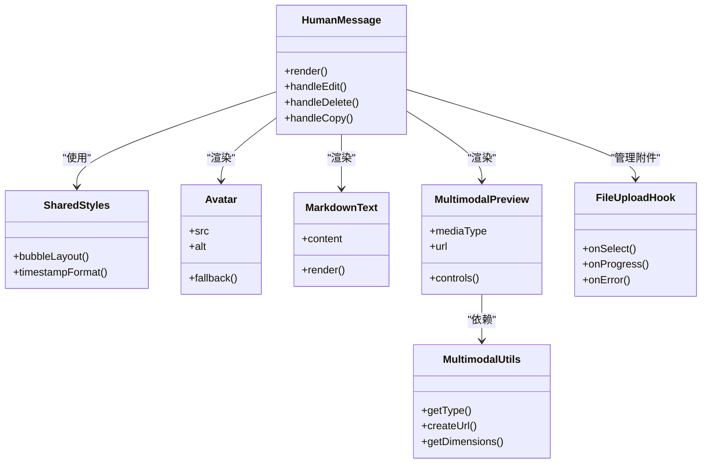
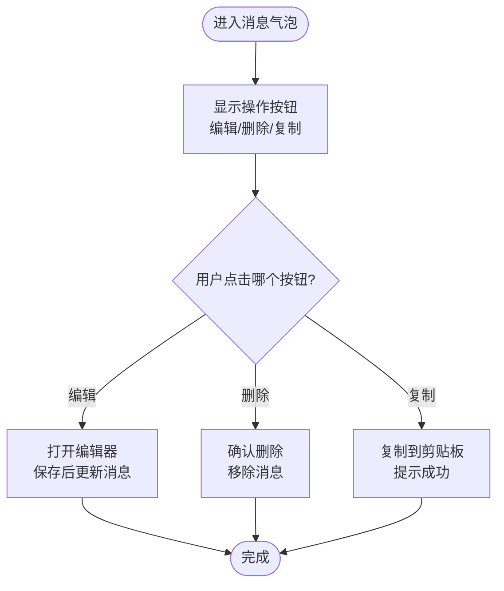
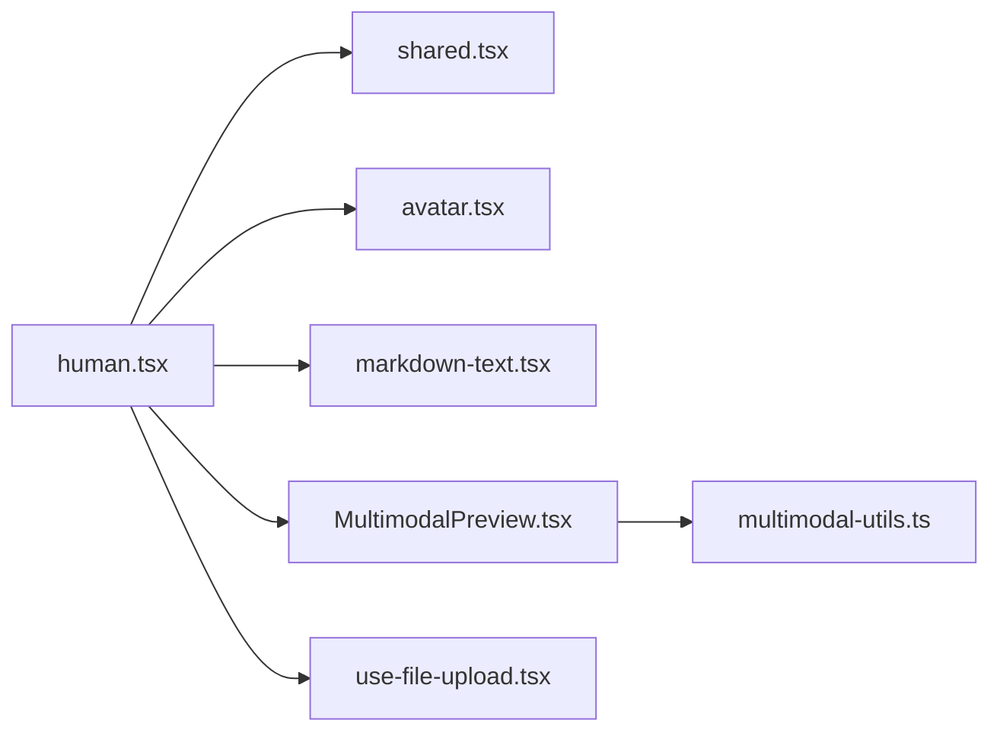

# 人类消息组件

<cite>
**本文档引用的文件**   
- [apps/web/src/components/thread/messages/human.tsx](file://apps/web/src/components/thread/messages/human.tsx)
- [apps/web/src/components/thread/messages/shared.tsx](file://apps/web/src/components/thread/messages/shared.tsx)
- [apps/web/src/components/ui/avatar.tsx](file://apps/web/src/components/ui/avatar.tsx)
- [apps/web/src/hooks/use-file-upload.tsx](file://apps/web/src/hooks/use-file-upload.tsx)
- [apps/web/src/lib/multimodal-utils.ts](file://apps/web/src/lib/multimodal-utils.ts)
- [apps/web/src/components/thread/MultimodalPreview.tsx](file://apps/web/src/components/thread/MultimodalPreview.tsx)
- [apps/web/src/components/thread/markdown-text.tsx](file://apps/web/src/components/thread/markdown-text.tsx)
</cite>

## 目录
1. [简介](#简介)
2. [项目结构](#项目结构)
3. [核心组件](#核心组件)
4. [架构总览](#架构总览)
5. [详细组件分析](#详细组件分析)
6. [依赖关系分析](#依赖关系分析)
7. [性能考虑](#性能考虑)
8. [故障排查指南](#故障排查指南)
9. [结论](#结论)
10. [附录](#附录)

## 简介
本文件面向“人类消息组件”（用户消息）的渲染与交互实现，覆盖文本输入处理、文件附件展示、多模态内容支持、样式设计（头像、时间戳）、编辑/删除/复制功能，以及自定义样式、扩展能力与无障碍访问建议。文档以仓库中的实际源码为依据，提供可追溯的文件路径与行号引用，帮助开发者快速定位并理解实现细节。

## 项目结构
与人类消息组件相关的代码主要位于前端 Next.js 应用的 thread 模块中：
- 消息渲染层：human.tsx、shared.tsx
- 头像 UI：avatar.tsx
- 文件上传 Hook：use-file-upload.tsx
- 多模态工具与预览：multimodal-utils.ts、MultimodalPreview.tsx
- Markdown 渲染：markdown-text.tsx

图表来源
- [apps/web/src/components/thread/messages/human.tsx](file://apps/web/src/components/thread/messages/human.tsx)
- [apps/web/src/components/thread/messages/shared.tsx](file://apps/web/src/components/thread/messages/shared.tsx)
- [apps/web/src/components/ui/avatar.tsx](file://apps/web/src/components/ui/avatar.tsx)
- [apps/web/src/hooks/use-file-upload.tsx](file://apps/web/src/hooks/use-file-upload.tsx)
- [apps/web/src/lib/multimodal-utils.ts](file://apps/web/src/lib/multimodal-utils.ts)
- [apps/web/src/components/thread/MultimodalPreview.tsx](file://apps/web/src/components/thread/MultimodalPreview.tsx)
- [apps/web/src/components/thread/markdown-text.tsx](file://apps/web/src/components/thread/markdown-text.tsx)

章节来源
- [apps/web/src/components/thread/messages/human.tsx](file://apps/web/src/components/thread/messages/human.tsx)
- [apps/web/src/components/thread/messages/shared.tsx](file://apps/web/src/components/thread/messages/shared.tsx)
- [apps/web/src/components/ui/avatar.tsx](file://apps/web/src/components/ui/avatar.tsx)
- [apps/web/src/hooks/use-file-upload.tsx](file://apps/web/src/hooks/use-file-upload.tsx)
- [apps/web/src/lib/multimodal-utils.ts](file://apps/web/src/lib/multimodal-utils.ts)
- [apps/web/src/components/thread/MultimodalPreview.tsx](file://apps/web/src/components/thread/MultimodalPreview.tsx)
- [apps/web/src/components/thread/markdown-text.tsx](file://apps/web/src/components/thread/markdown-text.tsx)

## 核心组件
- human.tsx：人类消息的主渲染组件，负责组合文本、Markdown、附件与多模态预览，并提供操作按钮（编辑、删除、复制等）。
- shared.tsx：消息通用逻辑与样式封装，如气泡布局、间距、对齐、基础交互钩子等。
- avatar.tsx：头像展示组件，支持默认占位图、用户首字母或远程图片。
- use-file-upload.tsx：文件上传 Hook，统一处理选择、校验、进度与结果回调。
- multimodal-utils.ts：多模态类型判断、媒体 URL 生成、尺寸计算等工具函数。
- MultimodalPreview.tsx：多模态内容（图片、视频、音频等）的预览容器与交互。
- markdown-text.tsx：Markdown 文本渲染器，支持语法高亮与安全过滤。

章节来源
- [apps/web/src/components/thread/messages/human.tsx](file://apps/web/src/components/thread/messages/human.tsx)
- [apps/web/src/components/thread/messages/shared.tsx](file://apps/web/src/components/thread/messages/shared.tsx)
- [apps/web/src/components/ui/avatar.tsx](file://apps/web/src/components/ui/avatar.tsx)
- [apps/web/src/hooks/use-file-upload.tsx](file://apps/web/src/hooks/use-file-upload.tsx)
- [apps/web/src/lib/multimodal-utils.ts](file://apps/web/src/lib/multimodal-utils.ts)
- [apps/web/src/components/thread/MultimodalPreview.tsx](file://apps/web/src/components/thread/MultimodalPreview.tsx)
- [apps/web/src/components/thread/markdown-text.tsx](file://apps/web/src/components/thread/markdown-text.tsx)

## 架构总览
人类消息组件采用“消息容器 + 内容渲染 + 附件/多模态 + 操作区”的分层结构。数据流从父级传入消息对象，human.tsx 解析文本与附件，调用 Markdown 渲染器与多模态预览，最终输出带头像、时间戳与操作按钮的消息气泡。

图表来源
- [apps/web/src/components/thread/messages/human.tsx](file://apps/web/src/components/thread/messages/human.tsx)
- [apps/web/src/components/thread/messages/shared.tsx](file://apps/web/src/components/thread/messages/shared.tsx)
- [apps/web/src/components/ui/avatar.tsx](file://apps/web/src/components/ui/avatar.tsx)
- [apps/web/src/components/thread/markdown-text.tsx](file://apps/web/src/components/thread/markdown-text.tsx)
- [apps/web/src/components/thread/MultimodalPreview.tsx](file://apps/web/src/components/thread/MultimodalPreview.tsx)
- [apps/web/src/hooks/use-file-upload.tsx](file://apps/web/src/hooks/use-file-upload.tsx)
- [apps/web/src/lib/multimodal-utils.ts](file://apps/web/src/lib/multimodal-utils.ts)

## 详细组件分析

### human.tsx：人类消息主渲染
- 职责
  - 接收消息对象，解析文本、附件与多模态内容。
  - 组合 Markdown 渲染与多模态预览。
  - 提供编辑、删除、复制等操作入口。
  - 控制头像、时间戳与气泡样式。
- 关键流程
  - 文本处理：将原始文本交由 Markdown 渲染器处理，确保安全与一致性。
  - 附件处理：通过文件上传 Hook 管理选择、校验与预览。
  - 多模态处理：根据类型调用预览组件，使用工具函数生成合适的媒体 URL。
  - 操作区：渲染编辑、删除、复制按钮，绑定事件与状态更新。
- 样式要点
  - 气泡背景、圆角、阴影与间距由共享样式控制。
  - 头像与时间戳位置遵循对话布局规范。
- 无障碍
  - 为操作按钮提供 aria-label 与键盘可达性。
  - 图片与媒体元素包含 alt 描述。

章节来源
- [apps/web/src/components/thread/messages/human.tsx](file://apps/web/src/components/thread/messages/human.tsx)

### shared.tsx：消息通用逻辑与样式
- 职责
  - 定义消息气泡的基础样式与布局规则。
  - 提供通用的交互钩子（如 hover、焦点管理）。
  - 封装时间戳格式化与显示逻辑。
- 关键点
  - 统一的间距与对齐策略，保证不同消息类型的一致性。
  - 可复用的样式变量，便于主题定制。

章节来源
- [apps/web/src/components/thread/messages/shared.tsx](file://apps/web/src/components/thread/messages/shared.tsx)

### avatar.tsx：头像组件
- 职责
  - 展示用户头像，支持默认占位图、首字母缩写或远程图片。
  - 处理加载失败时的降级显示。
- 关键点
  - 尺寸与形状可通过 props 配置。
  - 对跨域图片进行安全校验与错误回退。

章节来源
- [apps/web/src/components/ui/avatar.tsx](file://apps/web/src/components/ui/avatar.tsx)

### use-file-upload.tsx：文件上传 Hook
- 职责
  - 管理文件选择、类型校验、大小限制与进度回调。
  - 生成预览 URL 并触发上传流程。
- 关键点
  - 错误处理：类型不符、过大文件、网络异常等。
  - 取消与重试机制，提升用户体验。

章节来源
- [apps/web/src/hooks/use-file-upload.tsx](file://apps/web/src/hooks/use-file-upload.tsx)

### multimodal-utils.ts：多模态工具
- 职责
  - 判断媒体类型（图片、视频、音频等）。
  - 生成安全的媒体 URL 与缩略图链接。
  - 计算最佳尺寸与宽高比。
- 关键点
  - 白名单校验与协议检查，防止 XSS。
  - 兼容不同平台的媒体格式。

章节来源
- [apps/web/src/lib/multimodal-utils.ts](file://apps/web/src/lib/multimodal-utils.ts)

### MultimodalPreview.tsx：多模态预览
- 职责
  - 渲染图片、视频、音频等多媒体内容。
  - 提供播放控制、全屏、下载等交互。
- 关键点
  - 懒加载与占位图优化首屏性能。
  - 错误边界与重试机制。

章节来源
- [apps/web/src/components/thread/MultimodalPreview.tsx](file://apps/web/src/components/thread/MultimodalPreview.tsx)

### markdown-text.tsx：Markdown 渲染器
- 职责
  - 将 Markdown 文本转换为安全的 HTML。
  - 支持代码块语法高亮与链接跳转。
- 关键点
  - 内置安全过滤器，禁用危险标签与脚本。
  - 可插拔的扩展点，用于自定义渲染规则。

章节来源
- [apps/web/src/components/thread/markdown-text.tsx](file://apps/web/src/components/thread/markdown-text.tsx)

### 类图（组件关系）

图表来源
- [apps/web/src/components/thread/messages/human.tsx](file://apps/web/src/components/thread/messages/human.tsx)
- [apps/web/src/components/thread/messages/shared.tsx](file://apps/web/src/components/thread/messages/shared.tsx)
- [apps/web/src/components/ui/avatar.tsx](file://apps/web/src/components/ui/avatar.tsx)
- [apps/web/src/components/thread/markdown-text.tsx](file://apps/web/src/components/thread/markdown-text.tsx)
- [apps/web/src/components/thread/MultimodalPreview.tsx](file://apps/web/src/components/thread/MultimodalPreview.tsx)
- [apps/web/src/hooks/use-file-upload.tsx](file://apps/web/src/hooks/use-file-upload.tsx)
- [apps/web/src/lib/multimodal-utils.ts](file://apps/web/src/lib/multimodal-utils.ts)

### 流程图（编辑/删除/复制）

图表来源
- [apps/web/src/components/thread/messages/human.tsx](file://apps/web/src/components/thread/messages/human.tsx)

## 依赖关系分析
- human.tsx 依赖 shared.tsx（样式与布局）、avatar.tsx（头像）、markdown-text.tsx（文本渲染）、MultimodalPreview.tsx（多模态）、use-file-upload.tsx（附件）、multimodal-utils.ts（工具）。
- 耦合度较低，各组件职责清晰，便于独立测试与替换。
- 外部依赖主要为 React、Next.js 生态与第三方 Markdown/媒体库。

图表来源
- [apps/web/src/components/thread/messages/human.tsx](file://apps/web/src/components/thread/messages/human.tsx)
- [apps/web/src/components/thread/messages/shared.tsx](file://apps/web/src/components/thread/messages/shared.tsx)
- [apps/web/src/components/ui/avatar.tsx](file://apps/web/src/components/ui/avatar.tsx)
- [apps/web/src/components/thread/markdown-text.tsx](file://apps/web/src/components/thread/markdown-text.tsx)
- [apps/web/src/components/thread/MultimodalPreview.tsx](file://apps/web/src/components/thread/MultimodalPreview.tsx)
- [apps/web/src/hooks/use-file-upload.tsx](file://apps/web/src/hooks/use-file-upload.tsx)
- [apps/web/src/lib/multimodal-utils.ts](file://apps/web/src/lib/multimodal-utils.ts)

章节来源
- [apps/web/src/components/thread/messages/human.tsx](file://apps/web/src/components/thread/messages/human.tsx)
- [apps/web/src/components/thread/messages/shared.tsx](file://apps/web/src/components/thread/messages/shared.tsx)
- [apps/web/src/components/ui/avatar.tsx](file://apps/web/src/components/ui/avatar.tsx)
- [apps/web/src/components/thread/markdown-text.tsx](file://apps/web/src/components/thread/markdown-text.tsx)
- [apps/web/src/components/thread/MultimodalPreview.tsx](file://apps/web/src/components/thread/MultimodalPreview.tsx)
- [apps/web/src/hooks/use-file-upload.tsx](file://apps/web/src/hooks/use-file-upload.tsx)
- [apps/web/src/lib/multimodal-utils.ts](file://apps/web/src/lib/multimodal-utils.ts)

## 性能考虑
- 懒加载多模态内容，避免首屏阻塞。
- 图片与视频使用缩略图与占位图，减少带宽消耗。
- Markdown 渲染缓存已解析结果，避免重复计算。
- 文件上传分片与断点续传（如需要），提升大文件体验。
- 使用 React.memo 或 useMemo 优化重渲染。

[本节为通用指导，不直接分析具体文件]

## 故障排查指南
- 头像无法加载
  - 检查 src 是否有效，跨域是否允许。
  - 查看 fallback 逻辑是否正确触发。
- 多模态预览失败
  - 验证媒体类型与 URL 安全性。
  - 检查浏览器兼容性（如视频编码）。
- Markdown 渲染异常
  - 确认输入文本未包含危险脚本。
  - 检查语法高亮插件是否加载。
- 文件上传错误
  - 核对类型与大小限制。
  - 查看网络请求与错误回调。

章节来源
- [apps/web/src/components/ui/avatar.tsx](file://apps/web/src/components/ui/avatar.tsx)
- [apps/web/src/components/thread/MultimodalPreview.tsx](file://apps/web/src/components/thread/MultimodalPreview.tsx)
- [apps/web/src/components/thread/markdown-text.tsx](file://apps/web/src/components/thread/markdown-text.tsx)
- [apps/web/src/hooks/use-file-upload.tsx](file://apps/web/src/hooks/use-file-upload.tsx)

## 结论
人类消息组件通过清晰的模块化设计与稳健的错误处理，实现了文本、附件与多模态内容的统一渲染与交互。开发者可基于现有扩展点轻松定制样式与行为，同时兼顾性能与无障碍需求。建议在后续迭代中持续完善媒体兼容性、国际化与可观测性。

[本节为总结，不直接分析具体文件]

## 附录
- 自定义样式
  - 通过 shared.tsx 的样式变量覆盖主题色、圆角与阴影。
  - 在 human.tsx 中注入 CSS-in-JS 或 Tailwind 类名。
- 扩展功能
  - 在 markdown-text.tsx 中添加自定义渲染规则。
  - 在 MultimodalPreview.tsx 中扩展播放器控件。
- 无障碍访问
  - 为所有交互元素添加 aria-* 属性。
  - 确保键盘导航顺序合理，屏幕阅读器可读。

[本节为补充说明，不直接分析具体文件]