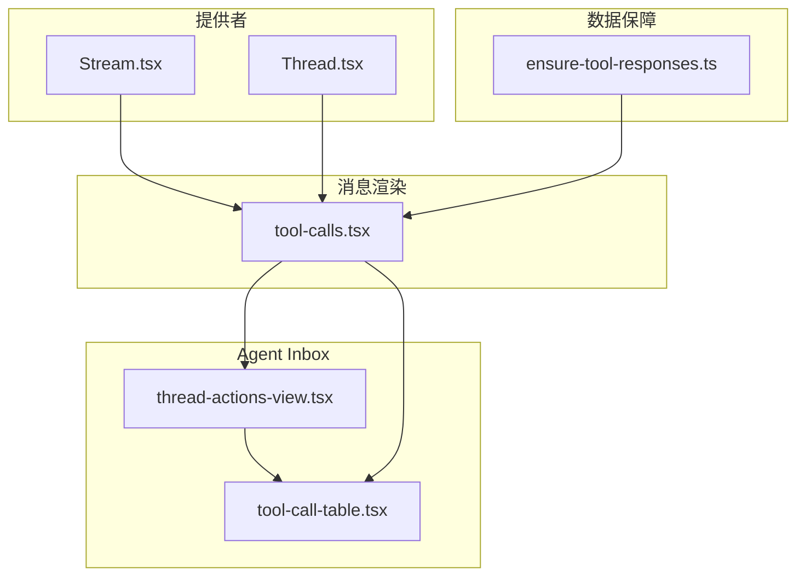
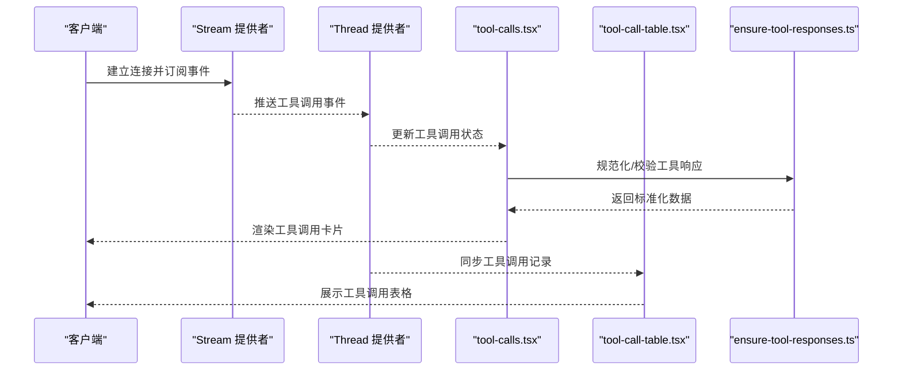
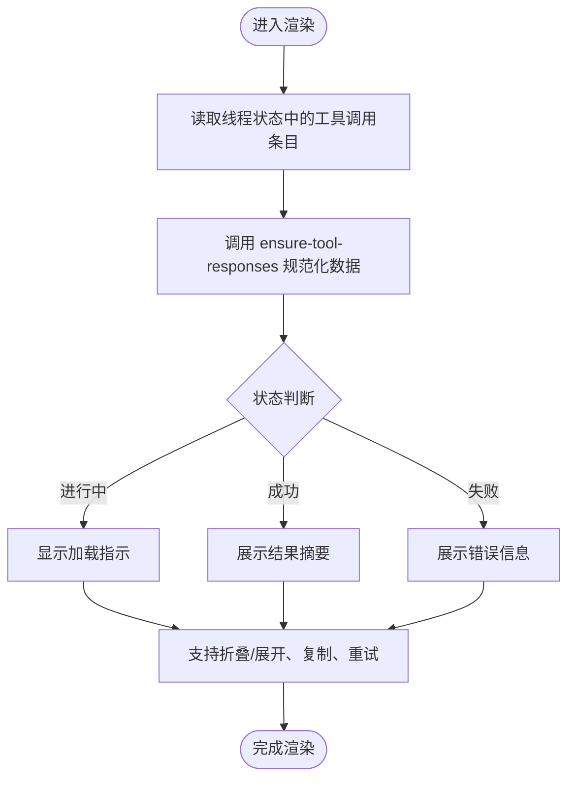
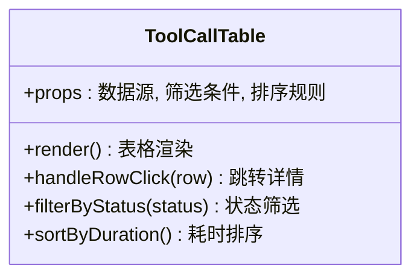
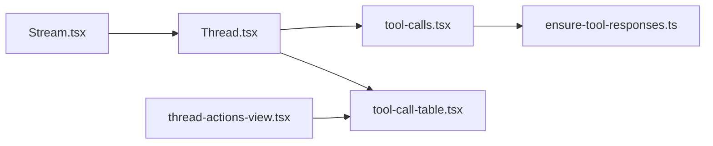

# 工具调用组件

<cite>
**本文引用的文件**   
- [tool-calls.tsx](file://apps/web/src/components/thread/messages/tool-calls.tsx)
- [thread-actions-view.tsx](file://apps/web/src/components/thread/agent-inbox/components/thread-actions-view.tsx)
- [tool-call-table.tsx](file://apps/web/src/components/thread/agent-inbox/components/tool-call-table.tsx)
- [ensure-tool-responses.ts](file://apps/web/src/lib/ensure-tool-responses.ts)
- [Stream.tsx](file://apps/web/src/providers/Stream.tsx)
- [Thread.tsx](file://apps/web/src/providers/Thread.tsx)
</cite>

## 目录
1. [简介](#简介)
2. [项目结构](#项目结构)
3. [核心组件](#核心组件)
4. [架构总览](#架构总览)
5. [详细组件分析](#详细组件分析)
6. [依赖关系分析](#依赖关系分析)
7. [性能考量](#性能考量)
8. [故障排查指南](#故障排查指南)
9. [结论](#结论)
10. [附录](#附录)

## 简介
本文件面向“工具调用消息组件”，系统性阐述工具调用的渲染逻辑、状态管理、错误处理与加载指示，并给出可折叠展开、参数验证与结果格式化的实现要点。同时提供自定义配置、扩展新工具类型以及集成第三方工具的实践指导，帮助开发者快速理解与二次开发该组件。

## 项目结构
与工具调用相关的代码主要分布在以下位置：
- 消息渲染层：用于在对话流中渲染工具调用卡片（名称、参数、执行结果、状态）。
- Agent Inbox 视图：以表格形式展示中断动作与工具调用，便于调试与审计。
- 数据保障库：确保工具响应数据的完整性与一致性。
- 提供者层：负责流式数据接入与线程状态管理，驱动 UI 更新。

图表来源
- [tool-calls.tsx](file://apps/web/src/components/thread/messages/tool-calls.tsx)
- [thread-actions-view.tsx](file://apps/web/src/components/thread/agent-inbox/components/thread-actions-view.tsx)
- [tool-call-table.tsx](file://apps/web/src/components/thread/agent-inbox/components/tool-call-table.tsx)
- [ensure-tool-responses.ts](file://apps/web/src/lib/ensure-tool-responses.ts)
- [Stream.tsx](file://apps/web/src/providers/Stream.tsx)
- [Thread.tsx](file://apps/web/src/providers/Thread.tsx)

章节来源
- [tool-calls.tsx](file://apps/web/src/components/thread/messages/tool-calls.tsx)
- [thread-actions-view.tsx](file://apps/web/src/components/thread/agent-inbox/components/thread-actions-view.tsx)
- [tool-call-table.tsx](file://apps/web/src/components/thread/agent-inbox/components/tool-call-table.tsx)
- [ensure-tool-responses.ts](file://apps/web/src/lib/ensure-tool-responses.ts)
- [Stream.tsx](file://apps/web/src/providers/Stream.tsx)
- [Thread.tsx](file://apps/web/src/providers/Thread.tsx)

## 核心组件
- 工具调用消息渲染器：负责将单个工具调用渲染为可交互的卡片，包括工具名、参数预览、执行状态与结果摘要。支持折叠/展开、复制、失败重试等交互。
- Agent Inbox 工具调用表：以表格形式集中展示工具调用历史，便于定位问题与审计。
- 工具响应保障：对上游返回的工具响应进行规范化与校验，保证 UI 渲染稳定。
- 流式与线程提供者：从后端拉取事件流，维护线程状态，驱动工具调用消息的状态更新。

章节来源
- [tool-calls.tsx](file://apps/web/src/components/thread/messages/tool-calls.tsx)
- [thread-actions-view.tsx](file://apps/web/src/components/thread/agent-inbox/components/thread-actions-view.tsx)
- [tool-call-table.tsx](file://apps/web/src/components/thread/agent-inbox/components/tool-call-table.tsx)
- [ensure-tool-responses.ts](file://apps/web/src/lib/ensure-tool-responses.ts)
- [Stream.tsx](file://apps/web/src/providers/Stream.tsx)
- [Thread.tsx](file://apps/web/src/providers/Thread.tsx)

## 架构总览
工具调用组件的整体数据流如下：
- Stream 提供者订阅后端事件流，解析出工具调用相关事件。
- Thread 提供者维护线程状态，包含消息列表与工具调用状态。
- tool-calls.tsx 消费线程状态，渲染工具调用卡片。
- ensure-tool-responses.ts 对工具响应做规范化与校验。
- thread-actions-view.tsx 与 tool-call-table.tsx 聚合展示工具调用记录。

图表来源
- [Stream.tsx](file://apps/web/src/providers/Stream.tsx)
- [Thread.tsx](file://apps/web/src/providers/Thread.tsx)
- [tool-calls.tsx](file://apps/web/src/components/thread/messages/tool-calls.tsx)
- [tool-call-table.tsx](file://apps/web/src/components/thread/agent-inbox/components/tool-call-table.tsx)
- [ensure-tool-responses.ts](file://apps/web/src/lib/ensure-tool-responses.ts)

## 详细组件分析

### 工具调用消息渲染器（tool-calls.tsx）
- 渲染目标：工具名称、参数展示、执行状态、结果摘要。
- 交互能力：折叠/展开详情、复制参数或结果、失败重试入口。
- 状态管理：基于线程状态中的工具调用条目，区分进行中、成功、失败等状态。
- 错误处理：捕获异常并降级显示，避免阻塞主流程。
- 加载指示：进行中状态显示加载动画或占位符。

图表来源
- [tool-calls.tsx](file://apps/web/src/components/thread/messages/tool-calls.tsx)
- [ensure-tool-responses.ts](file://apps/web/src/lib/ensure-tool-responses.ts)

章节来源
- [tool-calls.tsx](file://apps/web/src/components/thread/messages/tool-calls.tsx)
- [ensure-tool-responses.ts](file://apps/web/src/lib/ensure-tool-responses.ts)

### Agent Inbox 工具调用表（tool-call-table.tsx）
- 功能：以表格形式列出工具调用记录，包括工具名、参数摘要、状态、耗时与结果片段。
- 筛选与排序：支持按状态、时间范围筛选，按耗时排序。
- 联动：点击行可跳转到对应消息卡片的折叠详情。

图表来源
- [tool-call-table.tsx](file://apps/web/src/components/thread/agent-inbox/components/tool-call-table.tsx)

章节来源
- [tool-call-table.tsx](file://apps/web/src/components/thread/agent-inbox/components/tool-call-table.tsx)

### Agent Inbox 动作视图（thread-actions-view.tsx）
- 功能：聚合展示中断动作与工具调用，提供统一入口查看与操作。
- 交互：支持展开/收起、批量操作、导出记录。

章节来源
- [thread-actions-view.tsx](file://apps/web/src/components/thread/agent-inbox/components/thread-actions-view.tsx)

### 工具响应保障（ensure-tool-responses.ts）
- 职责：对工具响应数据进行规范化、字段校验与默认值填充。
- 输出：稳定的数据结构供 UI 渲染使用，减少边界情况导致的崩溃。

章节来源
- [ensure-tool-responses.ts](file://apps/web/src/lib/ensure-tool-responses.ts)

### 流式与线程提供者（Stream.tsx、Thread.tsx）
- Stream：负责与后端建立连接，接收事件流并解析工具调用事件。
- Thread：维护线程状态，包含消息列表、工具调用状态与执行进度。
- 协作：Stream 推送事件到 Thread，Thread 更新状态后驱动 UI 重渲染。

章节来源
- [Stream.tsx](file://apps/web/src/providers/Stream.tsx)
- [Thread.tsx](file://apps/web/src/providers/Thread.tsx)

## 依赖关系分析
- tool-calls.tsx 依赖 Thread 提供的状态与 ensure-tool-responses 的数据保障。
- tool-call-table.tsx 依赖 Thread 提供的工具调用记录集合。
- thread-actions-view.tsx 聚合 Thread 与 tool-call-table 的能力。
- Stream 与 Thread 构成数据管道，驱动整个工具调用渲染链路。

图表来源
- [Stream.tsx](file://apps/web/src/providers/Stream.tsx)
- [Thread.tsx](file://apps/web/src/providers/Thread.tsx)
- [tool-calls.tsx](file://apps/web/src/components/thread/messages/tool-calls.tsx)
- [tool-call-table.tsx](file://apps/web/src/components/thread/agent-inbox/components/tool-call-table.tsx)
- [thread-actions-view.tsx](file://apps/web/src/components/thread/agent-inbox/components/thread-actions-view.tsx)
- [ensure-tool-responses.ts](file://apps/web/src/lib/ensure-tool-responses.ts)

章节来源
- [Stream.tsx](file://apps/web/src/providers/Stream.tsx)
- [Thread.tsx](file://apps/web/src/providers/Thread.tsx)
- [tool-calls.tsx](file://apps/web/src/components/thread/messages/tool-calls.tsx)
- [tool-call-table.tsx](file://apps/web/src/components/thread/agent-inbox/components/tool-call-table.tsx)
- [thread-actions-view.tsx](file://apps/web/src/components/thread/agent-inbox/components/thread-actions-view.tsx)
- [ensure-tool-responses.ts](file://apps/web/src/lib/ensure-tool-responses.ts)

## 性能考量
- 增量更新：仅当工具调用状态变化时触发局部重渲染，避免全量刷新。
- 懒加载：大体积结果内容采用懒加载与分页展示，降低首屏压力。
- 防抖与节流：输入与筛选操作进行防抖，减少不必要的计算与渲染。
- 内存优化：及时清理未使用的订阅与缓存，防止内存泄漏。

[本节为通用指导，不直接分析具体文件]

## 故障排查指南
- 现象：工具调用卡片不显示或显示空白
  - 检查 Thread 状态是否包含工具调用条目
  - 确认 ensure-tool-responses 是否正确规范化数据
- 现象：加载中状态一直存在
  - 检查 Stream 是否正常推送完成事件
  - 查看网络请求与事件解析日志
- 现象：结果格式化异常
  - 校验结果数据结构是否符合预期
  - 增加兜底渲染逻辑与错误提示

章节来源
- [tool-calls.tsx](file://apps/web/src/components/thread/messages/tool-calls.tsx)
- [ensure-tool-responses.ts](file://apps/web/src/lib/ensure-tool-responses.ts)
- [Stream.tsx](file://apps/web/src/providers/Stream.tsx)
- [Thread.tsx](file://apps/web/src/providers/Thread.tsx)

## 结论
工具调用组件通过清晰的职责划分与稳定的数据保障，实现了可靠的工具调用渲染与交互。借助流式与线程提供者，UI 能够实时反映工具执行状态；通过规范化与校验，降低了边界情况的复杂度。建议在此基础上继续完善参数验证、结果格式化与扩展机制，以提升用户体验与可维护性。

[本节为总结，不直接分析具体文件]

## 附录

### 自定义配置
- 主题与样式：通过 CSS 变量或主题配置覆盖默认样式，保持视觉一致性。
- 行为开关：启用/禁用折叠、复制、重试等功能，满足不同场景需求。
- 国际化：为工具名、状态文案与错误信息提供多语言支持。

[本节为通用指导，不直接分析具体文件]

### 扩展新工具类型
- 定义工具元数据：包括工具名、参数 Schema、结果 Schema 与渲染策略。
- 注册渲染器：为新工具类型添加专用渲染逻辑，复用通用交互能力。
- 数据适配：在 ensure-tool-responses 中添加对新工具类型的适配与校验。

[本节为通用指导，不直接分析具体文件]

### 集成第三方工具
- 接口适配：封装第三方工具的 API 调用与错误码映射。
- 安全校验：对输入参数进行严格校验，防止注入与越权。
- 监控与日志：记录关键路径的调用与错误，便于问题定位。

[本节为通用指导，不直接分析具体文件]