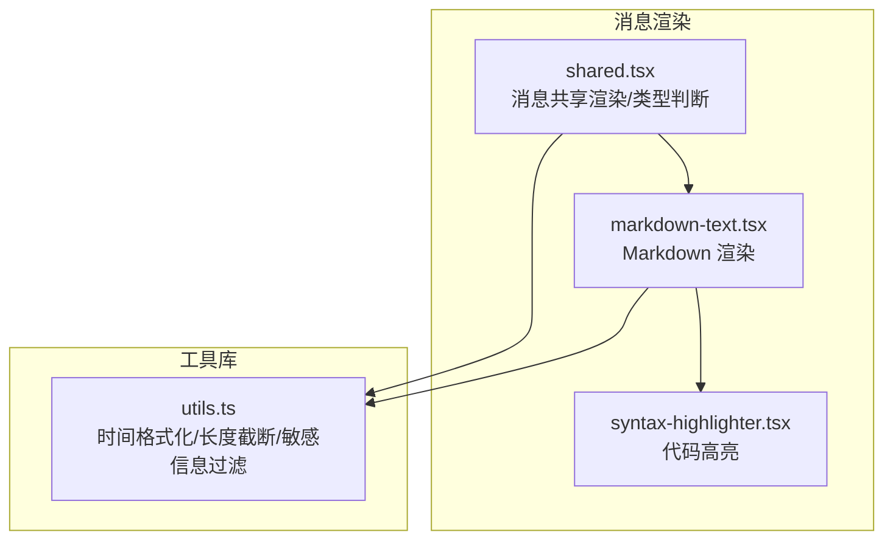
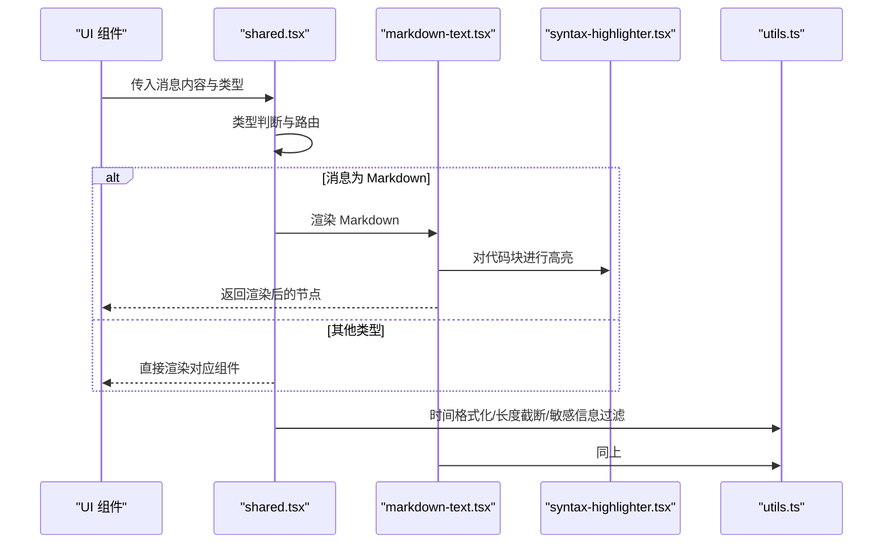
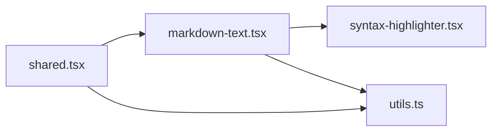

# 消息共享工具

<cite>
**本文引用的文件**   
- [apps/web/src/components/thread/messages/shared.tsx](file://apps/web/src/components/thread/messages/shared.tsx)
- [apps/web/src/components/thread/markdown-text.tsx](file://apps/web/src/components/thread/markdown-text.tsx)
- [apps/web/src/components/thread/syntax-highlighter.tsx](file://apps/web/src/components/thread/syntax-highlighter.tsx)
- [apps/web/src/lib/utils.ts](file://apps/web/src/lib/utils.ts)
</cite>

## 目录
1. [简介](#简介)
2. [项目结构](#项目结构)
3. [核心组件](#核心组件)
4. [架构总览](#架构总览)
5. [详细组件分析](#详细组件分析)
6. [依赖关系分析](#依赖关系分析)
7. [性能考虑](#性能考虑)
8. [故障排查指南](#故障排查指南)
9. [结论](#结论)
10. [附录](#附录)

## 简介
本文件为“消息共享工具”的完整技术文档，聚焦于消息渲染与展示相关的通用能力：Markdown 解析器配置、代码高亮引擎集成、图片懒加载实现，以及消息时间格式化、长度截断和敏感信息过滤等工具函数。文档面向不同技术背景的读者，提供从概览到细节的分层说明，并附带使用示例、扩展方法与性能优化建议。

## 项目结构
围绕消息渲染与工具函数的关键位置如下：
- 消息共享渲染入口与类型判断：位于 thread/messages 下的共享模块
- Markdown 文本渲染与样式：位于 thread/markdown-text.tsx
- 代码高亮：位于 thread/syntax-highlighter.tsx
- 通用工具（时间格式化、长度截断、敏感信息过滤等）：位于 lib/utils.ts

图表来源
- [apps/web/src/components/thread/messages/shared.tsx](file://apps/web/src/components/thread/messages/shared.tsx)
- [apps/web/src/components/thread/markdown-text.tsx](file://apps/web/src/components/thread/markdown-text.tsx)
- [apps/web/src/components/thread/syntax-highlighter.tsx](file://apps/web/src/components/thread/syntax-highlighter.tsx)
- [apps/web/src/lib/utils.ts](file://apps/web/src/lib/utils.ts)

章节来源
- [apps/web/src/components/thread/messages/shared.tsx](file://apps/web/src/components/thread/messages/shared.tsx)
- [apps/web/src/components/thread/markdown-text.tsx](file://apps/web/src/components/thread/markdown-text.tsx)
- [apps/web/src/components/thread/syntax-highlighter.tsx](file://apps/web/src/components/thread/syntax-highlighter.tsx)
- [apps/web/src/lib/utils.ts](file://apps/web/src/lib/utils.ts)

## 核心组件
- 消息共享渲染与类型判断：统一处理消息内容的类型识别与分支渲染，确保不同类型消息（如纯文本、Markdown、工具调用结果等）正确显示。
- Markdown 文本渲染：负责将 Markdown 字符串转换为可渲染的 HTML，并注入必要的样式与安全策略。
- 代码高亮：在 Markdown 的代码块中启用语法高亮，提升可读性。
- 通用工具函数：提供时间格式化、长度截断、敏感信息过滤等常用能力，供消息渲染与其他模块复用。

章节来源
- [apps/web/src/components/thread/messages/shared.tsx](file://apps/web/src/components/thread/messages/shared.tsx)
- [apps/web/src/components/thread/markdown-text.tsx](file://apps/web/src/components/thread/markdown-text.tsx)
- [apps/web/src/components/thread/syntax-highlighter.tsx](file://apps/web/src/components/thread/syntax-highlighter.tsx)
- [apps/web/src/lib/utils.ts](file://apps/web/src/lib/utils.ts)

## 架构总览
消息渲染链路从共享入口开始，根据消息类型选择具体渲染器；Markdown 内容交由 Markdown 渲染器处理，并在需要时接入代码高亮；工具函数贯穿各层，用于数据预处理与输出格式化。

图表来源
- [apps/web/src/components/thread/messages/shared.tsx](file://apps/web/src/components/thread/messages/shared.tsx)
- [apps/web/src/components/thread/markdown-text.tsx](file://apps/web/src/components/thread/markdown-text.tsx)
- [apps/web/src/components/thread/syntax-highlighter.tsx](file://apps/web/src/components/thread/syntax-highlighter.tsx)
- [apps/web/src/lib/utils.ts](file://apps/web/src/lib/utils.ts)

## 详细组件分析

### 消息共享渲染与类型判断（shared.tsx）
- 职责
  - 接收消息对象，依据类型字段决定渲染路径
  - 对文本类消息进行预处理（如长度截断、敏感信息过滤）
  - 对 Markdown 消息转交给 markdown-text 组件渲染
  - 对其他特定类型（如工具调用结果）走专用渲染逻辑
- 关键点
  - 类型判断应覆盖所有可能的消息类型，避免未处理分支
  - 对长文本进行安全截断，防止布局溢出
  - 敏感信息过滤需兼顾准确性与性能，避免误伤正常内容
- 使用示例
  - 在列表或聊天界面中，将后端返回的消息对象传入共享渲染器
  - 通过 props 控制是否启用敏感信息过滤、最大长度限制等
- 扩展方法
  - 新增消息类型：在类型判断分支中添加新分支，并实现对应渲染组件
  - 自定义过滤规则：在工具函数层增加正则或字典匹配规则
- 性能优化建议
  - 对超长文本先做服务端截断，减少前端计算
  - 对敏感信息过滤采用缓存策略，避免重复计算

章节来源
- [apps/web/src/components/thread/messages/shared.tsx](file://apps/web/src/components/thread/messages/shared.tsx)

### Markdown 文本渲染（markdown-text.tsx）
- 职责
  - 将 Markdown 字符串转换为安全的 HTML
  - 注入基础样式，保证在不同主题下的一致性
  - 与代码高亮组件集成，对代码块进行语法着色
  - 支持图片懒加载，降低首屏负载
- 配置要点
  - 解析器选项：启用必要的语法特性（如表格、任务列表等），关闭不需要的特性以减少开销
  - 安全策略：过滤危险标签与事件属性，防止 XSS
  - 图片懒加载：为 img 节点添加懒加载属性与占位图
- 使用示例
  - 将用户输入或模型输出的 Markdown 字符串传入该组件
  - 通过 props 控制是否启用代码高亮、图片懒加载、链接在新窗口打开等
- 扩展方法
  - 自定义渲染器：替换默认渲染行为以支持特殊语法
  - 插件机制：按需引入 Markdown 插件，平衡功能与体积
- 性能优化建议
  - 对大段 Markdown 进行分片渲染或虚拟滚动
  - 图片懒加载结合 IntersectionObserver，避免不必要的请求

章节来源
- [apps/web/src/components/thread/markdown-text.tsx](file://apps/web/src/components/thread/markdown-text.tsx)

### 代码高亮（syntax-highlighter.tsx）
- 职责
  - 检测代码块语言，选择对应的高亮规则
  - 生成带语义化 class 的 HTML，便于样式定制
  - 与 Markdown 渲染流程无缝集成
- 集成要点
  - 选择合适的语法高亮库，权衡包体大小与语言覆盖度
  - 预加载常用语言规则，按需动态加载稀有语言
  - 禁用不必要的高亮特性以提升性能
- 使用示例
  - 在 Markdown 中使用标准代码块语法，自动触发高亮
  - 通过 props 控制主题、行号、复制按钮等
- 扩展方法
  - 注册自定义语言或主题
  - 在高亮后钩子中插入额外交互（如折叠、展开）
- 性能优化建议
  - 对频繁出现的代码片段进行缓存
  - 使用 Web Worker 执行高亮计算，避免阻塞主线程

章节来源
- [apps/web/src/components/thread/syntax-highlighter.tsx](file://apps/web/src/components/thread/syntax-highlighter.tsx)

### 通用工具函数（utils.ts）
- 时间格式化
  - 功能：将时间戳或日期对象格式化为人类可读字符串（如相对时间、本地化时间）
  - 适用场景：消息时间戳、操作日志时间显示
  - 性能建议：对相同输入进行缓存，避免重复格式化
- 长度截断
  - 功能：按字符数或字节数截断文本，支持省略号与换行处理
  - 适用场景：消息预览、列表项摘要
  - 注意事项：正确处理多字节字符与 HTML 实体
- 敏感信息过滤
  - 功能：基于正则或字典匹配，过滤手机号、邮箱、身份证号、Token 等敏感信息
  - 适用场景：日志脱敏、对外展示的安全过滤
  - 性能建议：构建最小匹配集合，避免复杂正则导致回溯
- 使用示例
  - 在 shared.tsx 中对消息文本进行脱敏与截断
  - 在 markdown-text.tsx 中对链接与图片地址进行校验与清洗
- 扩展方法
  - 新增敏感词库或正则表达式
  - 提供开关控制不同环境的过滤强度

章节来源
- [apps/web/src/lib/utils.ts](file://apps/web/src/lib/utils.ts)

## 依赖关系分析
- shared.tsx 依赖 markdown-text.tsx 与 utils.ts
- markdown-text.tsx 依赖 syntax-highlighter.tsx 与 utils.ts
- syntax-highlighter.tsx 通常依赖第三方高亮库（由项目配置决定）
- utils.ts 为纯函数库，无外部副作用

图表来源
- [apps/web/src/components/thread/messages/shared.tsx](file://apps/web/src/components/thread/messages/shared.tsx)
- [apps/web/src/components/thread/markdown-text.tsx](file://apps/web/src/components/thread/markdown-text.tsx)
- [apps/web/src/components/thread/syntax-highlighter.tsx](file://apps/web/src/components/thread/syntax-highlighter.tsx)
- [apps/web/src/lib/utils.ts](file://apps/web/src/lib/utils.ts)

章节来源
- [apps/web/src/components/thread/messages/shared.tsx](file://apps/web/src/components/thread/messages/shared.tsx)
- [apps/web/src/components/thread/markdown-text.tsx](file://apps/web/src/components/thread/markdown-text.tsx)
- [apps/web/src/components/thread/syntax-highlighter.tsx](file://apps/web/src/components/thread/syntax-highlighter.tsx)
- [apps/web/src/lib/utils.ts](file://apps/web/src/lib/utils.ts)

## 性能考虑
- Markdown 渲染
  - 对超大文档进行分片渲染或使用虚拟列表
  - 关闭不必要的解析特性，减少 AST 构建成本
- 代码高亮
  - 预加载常用语言规则，按需动态加载
  - 对高频代码片段进行结果缓存
- 图片懒加载
  - 使用 IntersectionObserver 精确触发加载
  - 设置合理的占位图与降级策略
- 工具函数
  - 时间格式化与敏感信息过滤加入缓存层
  - 避免在渲染热路径中进行复杂计算

[本节为通用指导，无需引用具体文件]

## 故障排查指南
- Markdown 渲染异常
  - 检查解析器配置是否启用了必要特性
  - 确认安全策略未误删合法标签
- 代码高亮失效
  - 验证代码块语言标识是否正确
  - 检查高亮库是否成功加载对应语言规则
- 图片未懒加载
  - 确认 img 节点是否包含懒加载属性
  - 检查 IntersectionObserver 兼容性
- 敏感信息未过滤
  - 核对正则表达式与词库是否覆盖目标模式
  - 检查过滤时机是否在最终输出之前

章节来源
- [apps/web/src/components/thread/markdown-text.tsx](file://apps/web/src/components/thread/markdown-text.tsx)
- [apps/web/src/components/thread/syntax-highlighter.tsx](file://apps/web/src/components/thread/syntax-highlighter.tsx)
- [apps/web/src/lib/utils.ts](file://apps/web/src/lib/utils.ts)

## 结论
消息共享工具通过清晰的职责划分与模块化设计，实现了 Markdown 渲染、代码高亮、图片懒加载与通用工具函数的有机整合。遵循本文的配置与优化建议，可在保证安全与性能的前提下，提供稳定、可扩展的消息展示能力。

[本节为总结性内容，无需引用具体文件]

## 附录
- 使用示例清单
  - 在聊天界面中渲染用户与 AI 的消息
  - 在文档预览中展示带代码块的 Markdown
  - 在日志面板中脱敏并格式化时间戳
- 扩展实践
  - 新增消息类型与渲染组件
  - 接入新的 Markdown 插件或高亮语言
  - 自定义敏感信息过滤规则集

[本节为补充说明，无需引用具体文件]