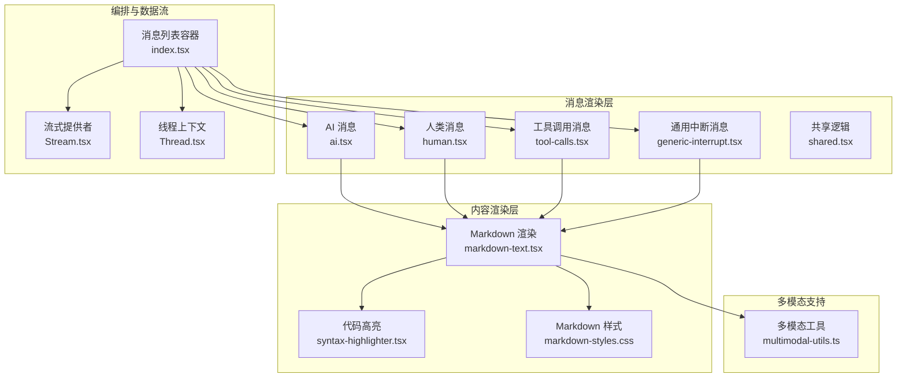
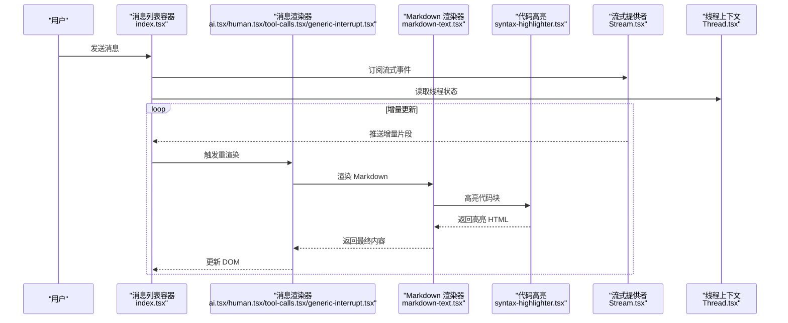
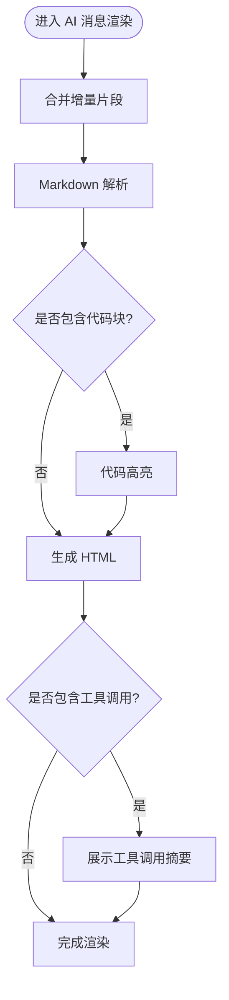
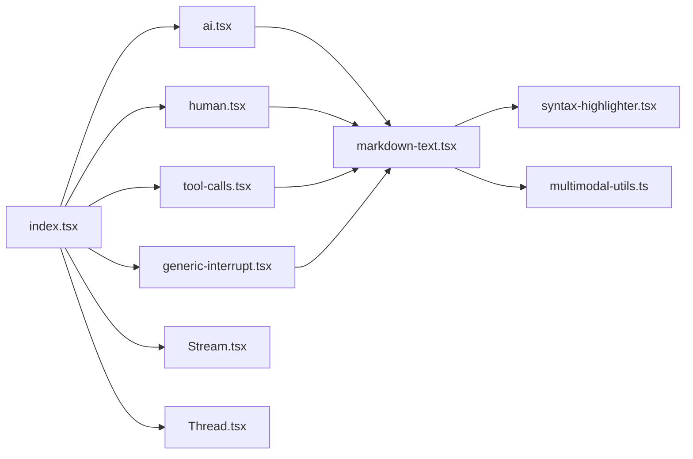

# 消息显示组件

<cite>
**本文档引用的文件**   
- [ai.tsx](file://apps/web/src/components/thread/messages/ai.tsx)
- [human.tsx](file://apps/web/src/components/thread/messages/human.tsx)
- [tool-calls.tsx](file://apps/web/src/components/thread/messages/tool-calls.tsx)
- [generic-interrupt.tsx](file://apps/web/src/components/thread/messages/generic-interrupt.tsx)
- [shared.tsx](file://apps/web/src/components/thread/messages/shared.tsx)
- [markdown-text.tsx](file://apps/web/src/components/thread/markdown-text.tsx)
- [syntax-highlighter.tsx](file://apps/web/src/components/thread/syntax-highlighter.tsx)
- [markdown-styles.css](file://apps/web/src/components/thread/markdown-styles.css)
- [index.tsx](file://apps/web/src/components/thread/index.tsx)
- [multimodal-utils.ts](file://apps/web/src/lib/multimodal-utils.ts)
- [Stream.tsx](file://apps/web/src/providers/Stream.tsx)
- [Thread.tsx](file://apps/web/src/providers/Thread.tsx)
</cite>

## 目录
1. [简介](#简介)
2. [项目结构](#项目结构)
3. [核心组件](#核心组件)
4. [架构总览](#架构总览)
5. [详细组件分析](#详细组件分析)
6. [依赖关系分析](#依赖关系分析)
7. [性能考虑](#性能考虑)
8. [故障排查指南](#故障排查指南)
9. [结论](#结论)
10. [附录](#附录)

## 简介
本文件面向“消息显示组件”的完整实现与使用，覆盖 AI 消息、人类消息、工具调用消息与通用中断消息的渲染逻辑；深入解析 Markdown 文本渲染、代码高亮、链接处理与图片展示的实现方式；并提供消息格式化、样式定制、响应式设计的最佳实践。同时给出自定义消息类型、扩展消息渲染器与集成第三方内容的指导，并说明消息交互模式、用户反馈与错误处理的实现细节。

## 项目结构
消息显示相关代码集中在前端应用的 thread 模块中，采用“按功能域组织”的结构：
- 消息渲染层：ai.tsx、human.tsx、tool-calls.tsx、generic-interrupt.tsx、shared.tsx
- 内容渲染层：markdown-text.tsx（Markdown 渲染）、syntax-highlighter.tsx（代码高亮）
- 样式与主题：markdown-styles.css（Markdown 样式）
- 编排与数据流：index.tsx（消息列表容器）、Stream.tsx（流式更新）、Thread.tsx（线程上下文）
- 多模态支持：multimodal-utils.ts（图片/媒体处理）

图表来源
- [index.tsx:1-200](file://apps/web/src/components/thread/index.tsx#L1-L200)
- [ai.tsx:1-200](file://apps/web/src/components/thread/messages/ai.tsx#L1-L200)
- [human.tsx:1-200](file://apps/web/src/components/thread/messages/human.tsx#L1-L200)
- [tool-calls.tsx:1-200](file://apps/web/src/components/thread/messages/tool-calls.tsx#L1-L200)
- [generic-interrupt.tsx:1-200](file://apps/web/src/components/thread/messages/generic-interrupt.tsx#L1-L200)
- [shared.tsx:1-200](file://apps/web/src/components/thread/messages/shared.tsx#L1-L200)
- [markdown-text.tsx:1-200](file://apps/web/src/components/thread/markdown-text.tsx#L1-L200)
- [syntax-highlighter.tsx:1-200](file://apps/web/src/components/thread/syntax-highlighter.tsx#L1-L200)
- [markdown-styles.css:1-200](file://apps/web/src/components/thread/markdown-styles.css#L1-L200)
- [Stream.tsx:1-200](file://apps/web/src/providers/Stream.tsx#L1-L200)
- [Thread.tsx:1-200](file://apps/web/src/providers/Thread.tsx#L1-L200)
- [multimodal-utils.ts:1-200](file://apps/web/src/lib/multimodal-utils.ts#L1-L200)

章节来源
- [index.tsx:1-200](file://apps/web/src/components/thread/index.tsx#L1-L200)
- [markdown-text.tsx:1-200](file://apps/web/src/components/thread/markdown-text.tsx#L1-L200)
- [syntax-highlighter.tsx:1-200](file://apps/web/src/components/thread/syntax-highlighter.tsx#L1-L200)
- [markdown-styles.css:1-200](file://apps/web/src/components/thread/markdown-styles.css#L1-L200)
- [Stream.tsx:1-200](file://apps/web/src/providers/Stream.tsx#L1-L200)
- [Thread.tsx:1-200](file://apps/web/src/providers/Thread.tsx#L1-L200)
- [multimodal-utils.ts:1-200](file://apps/web/src/lib/multimodal-utils.ts#L1-L200)

## 核心组件
- AI 消息（ai.tsx）：负责渲染 AI 生成的文本、工具调用结果与结构化片段，支持流式增量更新与状态切换。
- 人类消息（human.tsx）：负责渲染用户输入，包含文本、附件与富文本能力。
- 工具调用消息（tool-calls.tsx）：以表格或卡片形式展示工具名称、参数与返回摘要，支持展开详情与复制。
- 通用中断消息（generic-interrupt.tsx）：用于系统级中断提示、等待用户确认或外部动作完成。
- 共享逻辑（shared.tsx）：提供通用的消息元信息、头像、时间戳、操作按钮等 UI 元素。
- Markdown 渲染（markdown-text.tsx）：将 Markdown 字符串转换为可访问的 HTML，内置链接、图片、列表、表格等规则。
- 代码高亮（syntax-highlighter.tsx）：对代码块进行语法着色，支持语言检测与主题切换。
- 样式（markdown-styles.css）：定义 Markdown 元素的排版、间距、颜色与响应式断点。
- 多模态工具（multimodal-utils.ts）：统一处理图片预览、尺寸适配、懒加载与占位图。

章节来源
- [ai.tsx:1-200](file://apps/web/src/components/thread/messages/ai.tsx#L1-L200)
- [human.tsx:1-200](file://apps/web/src/components/thread/messages/human.tsx#L1-L200)
- [tool-calls.tsx:1-200](file://apps/web/src/components/thread/messages/tool-calls.tsx#L1-L200)
- [generic-interrupt.tsx:1-200](file://apps/web/src/components/thread/messages/generic-interrupt.tsx#L1-L200)
- [shared.tsx:1-200](file://apps/web/src/components/thread/messages/shared.tsx#L1-L200)
- [markdown-text.tsx:1-200](file://apps/web/src/components/thread/markdown-text.tsx#L1-L200)
- [syntax-highlighter.tsx:1-200](file://apps/web/src/components/thread/syntax-highlighter.tsx#L1-L200)
- [markdown-styles.css:1-200](file://apps/web/src/components/thread/markdown-styles.css#L1-L200)
- [multimodal-utils.ts:1-200](file://apps/web/src/lib/multimodal-utils.ts#L1-L200)

## 架构总览
消息显示组件采用“容器 + 渲染器 + 内容引擎”的分层架构：
- 容器层（index.tsx）：管理消息列表、滚动定位、新增消息插入与流式更新协调。
- 渲染层（各消息组件）：根据消息类型选择对应渲染器，组合共享 UI 元素。
- 内容引擎（markdown-text.tsx、syntax-highlighter.tsx）：负责 Markdown 到 HTML 的转换与代码高亮。
- 数据流（Stream.tsx、Thread.tsx）：通过 Provider 注入实时数据与上下文，驱动增量渲染。
- 多模态（multimodal-utils.ts）：为图片与媒体资源提供统一处理能力。

图表来源
- [index.tsx:1-200](file://apps/web/src/components/thread/index.tsx#L1-L200)
- [ai.tsx:1-200](file://apps/web/src/components/thread/messages/ai.tsx#L1-L200)
- [human.tsx:1-200](file://apps/web/src/components/thread/messages/human.tsx#L1-L200)
- [tool-calls.tsx:1-200](file://apps/web/src/components/thread/messages/tool-calls.tsx#L1-L200)
- [generic-interrupt.tsx:1-200](file://apps/web/src/components/thread/messages/generic-interrupt.tsx#L1-L200)
- [markdown-text.tsx:1-200](file://apps/web/src/components/thread/markdown-text.tsx#L1-L200)
- [syntax-highlighter.tsx:1-200](file://apps/web/src/components/thread/syntax-highlighter.tsx#L1-L200)
- [Stream.tsx:1-200](file://apps/web/src/providers/Stream.tsx#L1-L200)
- [Thread.tsx:1-200](file://apps/web/src/providers/Thread.tsx#L1-L200)

## 详细组件分析

### AI 消息渲染（ai.tsx）
- 渲染目标：AI 输出的纯文本、Markdown、工具调用结果与结构化片段。
- 关键流程：
  - 接收增量片段，合并到当前内容缓存。
  - 将 Markdown 交给 markdown-text.tsx 渲染。
  - 识别代码块并交由 syntax-highlighter.tsx 高亮。
  - 对工具调用结果进行折叠/展开与摘要展示。
- 交互行为：
  - 流式打字效果，保持滚动锚点在末尾。
  - 支持复制、重新生成、查看工具调用详情。
- 错误处理：
  - 网络异常时降级为静态文本。
  - 工具调用失败时显示错误摘要与重试入口。

图表来源
- [ai.tsx:1-200](file://apps/web/src/components/thread/messages/ai.tsx#L1-L200)
- [markdown-text.tsx:1-200](file://apps/web/src/components/thread/markdown-text.tsx#L1-L200)
- [syntax-highlighter.tsx:1-200](file://apps/web/src/components/thread/syntax-highlighter.tsx#L1-L200)
- [tool-calls.tsx:1-200](file://apps/web/src/components/thread/messages/tool-calls.tsx#L1-L200)

章节来源
- [ai.tsx:1-200](file://apps/web/src/components/thread/messages/ai.tsx#L1-L200)
- [markdown-text.tsx:1-200](file://apps/web/src/components/thread/markdown-text.tsx#L1-L200)
- [syntax-highlighter.tsx:1-200](file://apps/web/src/components/thread/syntax-highlighter.tsx#L1-L200)
- [tool-calls.tsx:1-200](file://apps/web/src/components/thread/messages/tool-calls.tsx#L1-L200)

### 人类消息渲染（human.tsx）
- 渲染目标：用户输入的文本、附件与富文本。
- 关键流程：
  - 校验输入类型与大小限制。
  - 对图片进行预览与压缩。
  - 渲染 Markdown 与内联元素。
- 交互行为：
  - 支持编辑、删除、重新发送。
  - 附件下载与预览。
- 错误处理：
  - 超大文件提示与回退方案。
  - 格式不支持时的友好提示。

章节来源
- [human.tsx:1-200](file://apps/web/src/components/thread/messages/human.tsx#L1-L200)
- [markdown-text.tsx:1-200](file://apps/web/src/components/thread/markdown-text.tsx#L1-L200)
- [multimodal-utils.ts:1-200](file://apps/web/src/lib/multimodal-utils.ts#L1-L200)

### 工具调用消息（tool-calls.tsx）
- 渲染目标：工具名称、参数、返回值摘要与错误信息。
- 关键流程：
  - 解析工具调用结构体。
  - 生成表格/卡片视图，支持展开详情。
  - 提供复制 JSON、重试、查看日志等操作。
- 交互行为：
  - 点击展开/收起。
  - 一键复制参数与结果。
- 错误处理：
  - 工具执行失败时显示错误码与原因。
  - 超时或网络异常时提供重试入口。

章节来源
- [tool-calls.tsx:1-200](file://apps/web/src/components/thread/messages/tool-calls.tsx#L1-L200)

### 通用中断消息（generic-interrupt.tsx）
- 渲染目标：系统级中断提示、等待用户确认或外部动作完成。
- 关键流程：
  - 判断中断类型（确认、输入、等待）。
  - 渲染对应的交互控件（按钮、输入框、进度指示）。
- 交互行为：
  - 用户确认后继续执行。
  - 取消或超时自动回滚。
- 错误处理：
  - 超时重试与降级策略。
  - 不可恢复错误时终止流程并提示。

章节来源
- [generic-interrupt.tsx:1-200](file://apps/web/src/components/thread/messages/generic-interrupt.tsx#L1-L200)

### Markdown 文本渲染（markdown-text.tsx）
- 渲染目标：将 Markdown 字符串转换为可访问的 HTML。
- 关键特性：
  - 标题、段落、列表、表格、引用、分割线。
  - 链接处理：外链安全跳转、内部路由跳转。
  - 图片展示：自适应尺寸、懒加载、占位图。
  - 代码块：语言检测与高亮。
- 安全策略：
  - 白名单过滤危险标签与属性。
  - 外链添加 rel="noopener noreferrer"。
- 性能优化：
  - 增量渲染与虚拟滚动。
  - 图片懒加载与按需加载高亮库。

章节来源
- [markdown-text.tsx:1-200](file://apps/web/src/components/thread/markdown-text.tsx#L1-L200)
- [syntax-highlighter.tsx:1-200](file://apps/web/src/components/thread/syntax-highlighter.tsx#L1-L200)
- [markdown-styles.css:1-200](file://apps/web/src/components/thread/markdown-styles.css#L1-L200)
- [multimodal-utils.ts:1-200](file://apps/web/src/lib/multimodal-utils.ts#L1-L200)

### 代码高亮（syntax-highlighter.tsx）
- 渲染目标：对代码块进行语法着色与行号展示。
- 关键特性：
  - 语言自动检测与手动指定。
  - 主题切换与暗色模式适配。
  - 复制按钮与全屏查看。
- 性能优化：
  - 按需加载语言包。
  - 防抖与去重渲染。

章节来源
- [syntax-highlighter.tsx:1-200](file://apps/web/src/components/thread/syntax-highlighter.tsx#L1-L200)

### 共享逻辑（shared.tsx）
- 提供统一的头像、时间戳、操作按钮、状态指示等 UI 元素。
- 确保不同消息类型的视觉一致性。

章节来源
- [shared.tsx:1-200](file://apps/web/src/components/thread/messages/shared.tsx#L1-L200)

### 消息列表容器（index.tsx）
- 职责：
  - 维护消息数组与滚动位置。
  - 监听流式事件并触发增量更新。
  - 协调不同消息类型的渲染顺序与布局。
- 性能优化：
  - 虚拟列表与分页加载。
  - 防抖滚动与批量更新。

章节来源
- [index.tsx:1-200](file://apps/web/src/components/thread/index.tsx#L1-L200)
- [Stream.tsx:1-200](file://apps/web/src/providers/Stream.tsx#L1-L200)
- [Thread.tsx:1-200](file://apps/web/src/providers/Thread.tsx#L1-L200)

## 依赖关系分析
- 组件耦合度：
  - 消息渲染器依赖 markdown-text.tsx 与 syntax-highlighter.tsx。
  - 容器层依赖 Stream.tsx 与 Thread.tsx 获取数据与上下文。
- 外部依赖：
  - Markdown 解析库（如 marked 或类似）。
  - 代码高亮库（如 highlight.js 或 prism）。
  - 图片懒加载库（如 lazyload）。
- 潜在循环依赖：
  - 避免在 markdown-text.tsx 中直接导入具体消息组件。
  - 通过 props 与回调解耦渲染器与容器。

图表来源
- [index.tsx:1-200](file://apps/web/src/components/thread/index.tsx#L1-L200)
- [ai.tsx:1-200](file://apps/web/src/components/thread/messages/ai.tsx#L1-L200)
- [human.tsx:1-200](file://apps/web/src/components/thread/messages/human.tsx#L1-L200)
- [tool-calls.tsx:1-200](file://apps/web/src/components/thread/messages/tool-calls.tsx#L1-L200)
- [generic-interrupt.tsx:1-200](file://apps/web/src/components/thread/messages/generic-interrupt.tsx#L1-L200)
- [markdown-text.tsx:1-200](file://apps/web/src/components/thread/markdown-text.tsx#L1-L200)
- [syntax-highlighter.tsx:1-200](file://apps/web/src/components/thread/syntax-highlighter.tsx#L1-L200)
- [Stream.tsx:1-200](file://apps/web/src/providers/Stream.tsx#L1-L200)
- [Thread.tsx:1-200](file://apps/web/src/providers/Thread.tsx#L1-L200)
- [multimodal-utils.ts:1-200](file://apps/web/src/lib/multimodal-utils.ts#L1-L200)

章节来源
- [index.tsx:1-200](file://apps/web/src/components/thread/index.tsx#L1-L200)
- [markdown-text.tsx:1-200](file://apps/web/src/components/thread/markdown-text.tsx#L1-L200)
- [syntax-highlighter.tsx:1-200](file://apps/web/src/components/thread/syntax-highlighter.tsx#L1-L200)
- [Stream.tsx:1-200](file://apps/web/src/providers/Stream.tsx#L1-L200)
- [Thread.tsx:1-200](file://apps/web/src/providers/Thread.tsx#L1-L200)
- [multimodal-utils.ts:1-200](file://apps/web/src/lib/multimodal-utils.ts#L1-L200)

## 性能考虑
- 渲染性能：
  - 使用虚拟列表减少 DOM 节点数量。
  - 增量更新避免全量重渲染。
  - 代码高亮按需加载语言包。
- 内存管理：
  - 及时释放图片与高亮实例。
  - 避免长文本一次性解析，分片处理。
- 网络优化：
  - 图片懒加载与 CDN 加速。
  - 流式传输减少首屏延迟。
- 可访问性：
  - 语义化标签与 ARIA 属性。
  - 键盘导航与屏幕阅读器支持。

## 故障排查指南
- 常见问题：
  - Markdown 渲染异常：检查白名单配置与转义字符。
  - 代码高亮失效：确认语言包已加载且类名正确。
  - 图片不显示：检查路径、CORS 与懒加载配置。
  - 流式更新卡顿：优化增量合并逻辑与滚动锚点。
- 调试建议：
  - 启用开发模式下的渲染耗时统计。
  - 使用浏览器开发者工具检查网络请求与内存占用。
  - 打印关键状态变化与错误堆栈。

## 结论
消息显示组件通过分层架构实现了高内聚、低耦合的消息渲染体系。Markdown 渲染、代码高亮、链接与图片处理均具备良好扩展性与性能表现。遵循本文的最佳实践与故障排查指南，可有效提升用户体验与系统稳定性。

## 附录
- 自定义消息类型：
  - 新建消息组件并注册到容器层的消息分发逻辑。
  - 复用 shared.tsx 的通用 UI 元素保持一致性。
- 扩展消息渲染器：
  - 在 markdown-text.tsx 中添加自定义指令或插件。
  - 在 syntax-highlighter.tsx 中注册新语言与主题。
- 集成第三方内容：
  - 使用 iframe 或沙箱机制嵌入外部页面。
  - 通过 postMessage 实现安全通信。
- 消息交互模式：
  - 支持点击、长按、滑动等手势。
  - 提供即时反馈与撤销操作。
- 用户反馈与错误处理：
  - 使用 Toast 或 Modal 提示成功与失败。
  - 记录错误日志并上报监控平台。