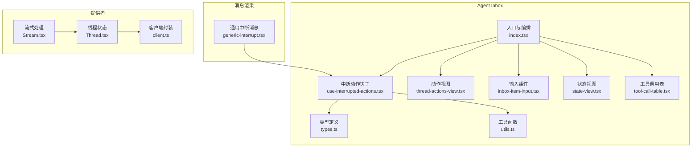
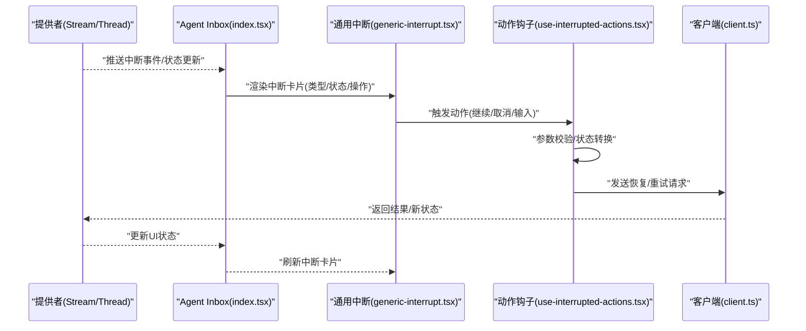
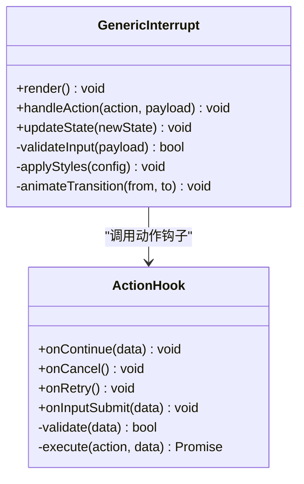
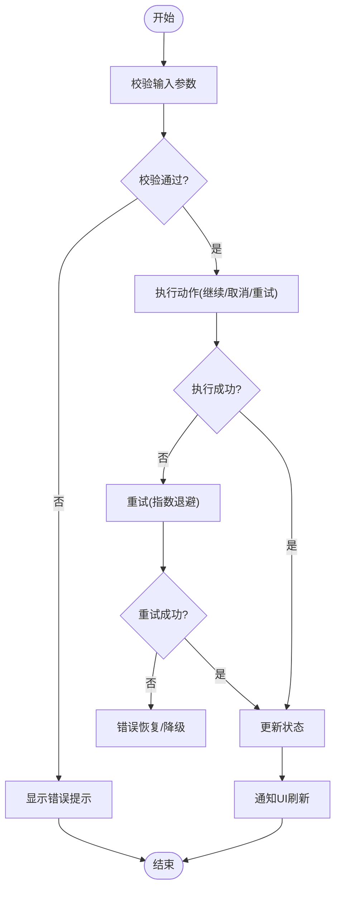
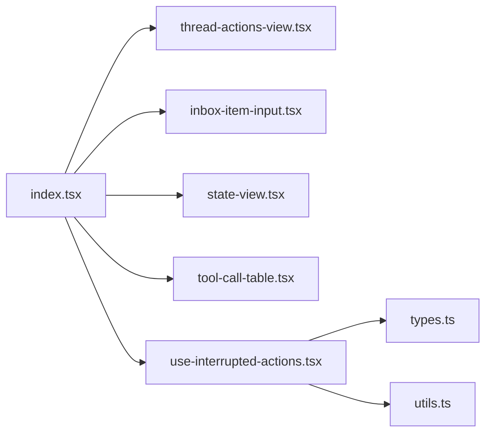
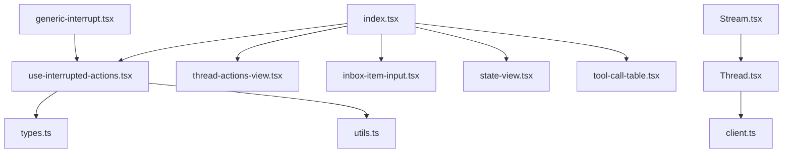

# 通用中断组件

<cite>
**本文引用的文件**   
- [generic-interrupt.tsx](file://apps/web/src/components/thread/messages/generic-interrupt.tsx)
- [use-interrupted-actions.tsx](file://apps/web/src/components/thread/agent-inbox/hooks/use-interrupted-actions.tsx)
- [types.ts](file://apps/web/src/components/thread/agent-inbox/types.ts)
- [utils.ts](file://apps/web/src/components/thread/agent-inbox/utils.ts)
- [index.tsx](file://apps/web/src/components/thread/agent-inbox/index.tsx)
- [thread-actions-view.tsx](file://apps/web/src/components/thread/agent-inbox/components/thread-actions-view.tsx)
- [inbox-item-input.tsx](file://apps/web/src/components/thread/agent-inbox/components/inbox-item-input.tsx)
- [state-view.tsx](file://apps/web/src/components/thread/agent-inbox/components/state-view.tsx)
- [tool-call-table.tsx](file://apps/web/src/components/thread/agent-inbox/components/tool-call-table.tsx)
- [Stream.tsx](file://apps/web/src/providers/Stream.tsx)
- [Thread.tsx](file://apps/web/src/providers/Thread.tsx)
- [client.ts](file://apps/web/src/providers/client.ts)
</cite>

## 目录
1. [简介](#简介)
2. [项目结构](#项目结构)
3. [核心组件](#核心组件)
4. [架构总览](#架构总览)
5. [详细组件分析](#详细组件分析)
6. [依赖关系分析](#依赖关系分析)
7. [性能考虑](#性能考虑)
8. [故障排查指南](#故障排查指南)
9. [结论](#结论)
10. [附录](#附录)

## 简介
本文件面向“通用中断消息组件”的设计与实现，聚焦以下目标：
- 中断类型识别、状态显示与用户交互流程
- 样式定制、动画效果与响应式布局策略
- 错误恢复、重试机制与用户确认流程
- 自定义中断类型、扩展中断行为与业务集成指导

该组件位于前端应用的消息渲染层，负责将后端或工作流产生的中断事件以统一的用户界面呈现，并提供可配置的操作入口（如继续、取消、输入参数等），确保在复杂多步骤任务中保持清晰的状态反馈与可控的交互路径。

## 项目结构
与中断相关的代码主要分布在以下模块：
- 消息渲染层：通用中断消息组件
- 动作钩子：中断动作的统一处理逻辑
- Agent Inbox：中断上下文、工具调用展示、输入框与状态视图
- 提供者：流式数据与线程状态管理

图表来源
- [generic-interrupt.tsx](file://apps/web/src/components/thread/messages/generic-interrupt.tsx)
- [use-interrupted-actions.tsx](file://apps/web/src/components/thread/agent-inbox/hooks/use-interrupted-actions.tsx)
- [types.ts](file://apps/web/src/components/thread/agent-inbox/types.ts)
- [utils.ts](file://apps/web/src/components/thread/agent-inbox/utils.ts)
- [index.tsx](file://apps/web/src/components/thread/agent-inbox/index.tsx)
- [thread-actions-view.tsx](file://apps/web/src/components/thread/agent-inbox/components/thread-actions-view.tsx)
- [inbox-item-input.tsx](file://apps/web/src/components/thread/agent-inbox/components/inbox-item-input.tsx)
- [state-view.tsx](file://apps/web/src/components/thread/agent-inbox/components/state-view.tsx)
- [tool-call-table.tsx](file://apps/web/src/components/thread/agent-inbox/components/tool-call-table.tsx)
- [Stream.tsx](file://apps/web/src/providers/Stream.tsx)
- [Thread.tsx](file://apps/web/src/providers/Thread.tsx)
- [client.ts](file://apps/web/src/providers/client.ts)

章节来源
- [index.tsx](file://apps/web/src/components/thread/agent-inbox/index.tsx)
- [generic-interrupt.tsx](file://apps/web/src/components/thread/messages/generic-interrupt.tsx)
- [use-interrupted-actions.tsx](file://apps/web/src/components/thread/agent-inbox/hooks/use-interrupted-actions.tsx)

## 核心组件
- 通用中断消息组件：负责渲染中断卡片、展示类型与状态、提供操作按钮与输入区域，并支持样式与动画的可配置化。
- 中断动作钩子：集中处理中断的生命周期（创建、暂停、恢复、取消）、参数校验、重试与错误恢复。
- Agent Inbox 视图：组合动作视图、输入框、状态视图与工具调用表，形成完整的交互式中断面板。
- 类型与工具：统一的类型定义与辅助函数，确保中断数据结构一致性与复用性。

章节来源
- [generic-interrupt.tsx](file://apps/web/src/components/thread/messages/generic-interrupt.tsx)
- [use-interrupted-actions.tsx](file://apps/web/src/components/thread/agent-inbox/hooks/use-interrupted-actions.tsx)
- [types.ts](file://apps/web/src/components/thread/agent-inbox/types.ts)
- [utils.ts](file://apps/web/src/components/thread/agent-inbox/utils.ts)

## 架构总览
中断消息从上游提供者（流式数据与线程状态）进入消息渲染层，再由通用中断组件进行展示与交互。动作钩子协调用户输入、校验与执行，必要时通过客户端与服务端交互完成恢复或重试。

图表来源
- [Stream.tsx](file://apps/web/src/providers/Stream.tsx)
- [Thread.tsx](file://apps/web/src/providers/Thread.tsx)
- [index.tsx](file://apps/web/src/components/thread/agent-inbox/index.tsx)
- [generic-interrupt.tsx](file://apps/web/src/components/thread/messages/generic-interrupt.tsx)
- [use-interrupted-actions.tsx](file://apps/web/src/components/thread/agent-inbox/hooks/use-interrupted-actions.tsx)
- [client.ts](file://apps/web/src/providers/client.ts)

## 详细组件分析

### 通用中断消息组件
职责与特性：
- 中断类型识别：根据数据类型或标签区分不同中断（如等待输入、工具调用、人工审批等）。
- 状态显示：展示当前中断状态（待处理、进行中、已完成、失败）及进度信息。
- 用户交互：提供“继续”“取消”“重试”等操作按钮，以及必要的输入表单。
- 样式与动画：支持主题定制、过渡动画与响应式布局，适配移动端与桌面端。
- 错误恢复：捕获异常并提示用户，支持自动重试或降级方案。

图表来源
- [generic-interrupt.tsx](file://apps/web/src/components/thread/messages/generic-interrupt.tsx)
- [use-interrupted-actions.tsx](file://apps/web/src/components/thread/agent-inbox/hooks/use-interrupted-actions.tsx)

章节来源
- [generic-interrupt.tsx](file://apps/web/src/components/thread/messages/generic-interrupt.tsx)

### 中断动作钩子
职责与特性：
- 生命周期管理：维护中断的创建、暂停、恢复、取消与完成状态。
- 参数校验：对用户输入进行格式与业务规则校验，阻止非法操作。
- 重试与恢复：对失败操作实施指数退避重试，支持手动重试与自动恢复。
- 错误处理：统一捕获并上报错误，提供友好的用户提示与回滚策略。

图表来源
- [use-interrupted-actions.tsx](file://apps/web/src/components/thread/agent-inbox/hooks/use-interrupted-actions.tsx)

章节来源
- [use-interrupted-actions.tsx](file://apps/web/src/components/thread/agent-inbox/hooks/use-interrupted-actions.tsx)

### Agent Inbox 视图
职责与特性：
- 组合多个子视图：动作视图、输入框、状态视图与工具调用表。
- 统一管理中断上下文：维护当前中断ID、类型、状态与相关数据。
- 响应式布局：在不同屏幕尺寸下自适应排列与交互方式。
- 与提供者通信：订阅流式数据与线程状态变化，驱动UI更新。

图表来源
- [index.tsx](file://apps/web/src/components/thread/agent-inbox/index.tsx)
- [thread-actions-view.tsx](file://apps/web/src/components/thread/agent-inbox/components/thread-actions-view.tsx)
- [inbox-item-input.tsx](file://apps/web/src/components/thread/agent-inbox/components/inbox-item-input.tsx)
- [state-view.tsx](file://apps/web/src/components/thread/agent-inbox/components/state-view.tsx)
- [tool-call-table.tsx](file://apps/web/src/components/thread/agent-inbox/components/tool-call-table.tsx)
- [use-interrupted-actions.tsx](file://apps/web/src/components/thread/agent-inbox/hooks/use-interrupted-actions.tsx)
- [types.ts](file://apps/web/src/components/thread/agent-inbox/types.ts)
- [utils.ts](file://apps/web/src/components/thread/agent-inbox/utils.ts)

章节来源
- [index.tsx](file://apps/web/src/components/thread/agent-inbox/index.tsx)

### 类型与工具
- 类型定义：统一中断数据结构、动作枚举、状态码与校验规则。
- 工具函数：格式化显示文本、计算重试间隔、生成唯一ID、深拷贝与合并对象等。

章节来源
- [types.ts](file://apps/web/src/components/thread/agent-inbox/types.ts)
- [utils.ts](file://apps/web/src/components/thread/agent-inbox/utils.ts)

### 提供者（流式与线程）
- 流式处理：接收服务端推送的中断事件，转换为前端状态更新。
- 线程状态：维护会话级中断上下文，确保跨组件一致性。
- 客户端封装：统一网络请求、错误处理与重试策略。

章节来源
- [Stream.tsx](file://apps/web/src/providers/Stream.tsx)
- [Thread.tsx](file://apps/web/src/providers/Thread.tsx)
- [client.ts](file://apps/web/src/providers/client.ts)

## 依赖关系分析
组件间依赖关系如下：
- 通用中断消息组件依赖动作钩子进行交互处理。
- Agent Inbox 组合多个视图并依赖动作钩子与类型/工具。
- 提供者向上游数据源（服务端）提供稳定的状态与事件接口。

图表来源
- [generic-interrupt.tsx](file://apps/web/src/components/thread/messages/generic-interrupt.tsx)
- [use-interrupted-actions.tsx](file://apps/web/src/components/thread/agent-inbox/hooks/use-interrupted-actions.tsx)
- [index.tsx](file://apps/web/src/components/thread/agent-inbox/index.tsx)
- [thread-actions-view.tsx](file://apps/web/src/components/thread/agent-inbox/components/thread-actions-view.tsx)
- [inbox-item-input.tsx](file://apps/web/src/components/thread/agent-inbox/components/inbox-item-input.tsx)
- [state-view.tsx](file://apps/web/src/components/thread/agent-inbox/components/state-view.tsx)
- [tool-call-table.tsx](file://apps/web/src/components/thread/agent-inbox/components/tool-call-table.tsx)
- [types.ts](file://apps/web/src/components/thread/agent-inbox/types.ts)
- [utils.ts](file://apps/web/src/components/thread/agent-inbox/utils.ts)
- [Stream.tsx](file://apps/web/src/providers/Stream.tsx)
- [Thread.tsx](file://apps/web/src/providers/Thread.tsx)
- [client.ts](file://apps/web/src/providers/client.ts)

章节来源
- [index.tsx](file://apps/web/src/components/thread/agent-inbox/index.tsx)
- [generic-interrupt.tsx](file://apps/web/src/components/thread/messages/generic-interrupt.tsx)
- [use-interrupted-actions.tsx](file://apps/web/src/components/thread/agent-inbox/hooks/use-interrupted-actions.tsx)

## 性能考虑
- 最小化重渲染：仅在状态变化时更新中断卡片，避免不必要的组件重建。
- 懒加载视图：按需加载工具调用表与状态视图，减少初始渲染开销。
- 防抖与节流：对频繁触发的动作（如输入校验、重试）进行限流。
- 内存管理：及时清理定时器与事件监听器，防止内存泄漏。
- 网络优化：使用缓存与批量请求，降低与服务端的交互频率。

[本节为通用性能建议，不直接分析具体文件]

## 故障排查指南
常见问题与解决思路：
- 中断未显示：检查上游事件是否推送、类型映射是否正确、组件是否被正确挂载。
- 动作无响应：验证参数校验逻辑、网络请求是否成功、错误是否被捕获。
- 重试失败：确认重试策略配置、服务端是否支持幂等、是否存在死锁或资源竞争。
- 样式错乱：检查主题变量、响应式断点、CSS覆盖优先级。

章节来源
- [use-interrupted-actions.tsx](file://apps/web/src/components/thread/agent-inbox/hooks/use-interrupted-actions.tsx)
- [generic-interrupt.tsx](file://apps/web/src/components/thread/messages/generic-interrupt.tsx)

## 结论
通用中断组件通过清晰的类型定义、统一的动作钩子与灵活的视图组合，实现了中断消息的可配置化、可扩展与高可用。结合流式数据与线程状态管理，能够在复杂工作流中提供稳定且友好的用户体验。未来可进一步引入更丰富的动画与无障碍支持，提升整体交互质量。

[本节为总结性内容，不直接分析具体文件]

## 附录
- 自定义中断类型：在类型定义中新增枚举与校验规则，并在通用中断组件中添加对应渲染分支。
- 扩展中断行为：在动作钩子中注册新的回调函数，处理特定业务逻辑。
- 集成业务逻辑：通过客户端封装调用后端API，确保事务一致性与错误恢复。

[本节为概念性指导，不直接分析具体文件]