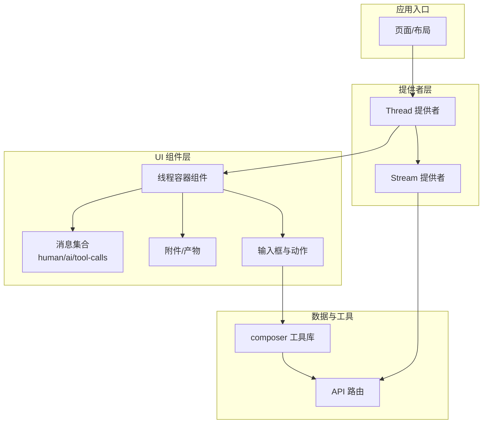
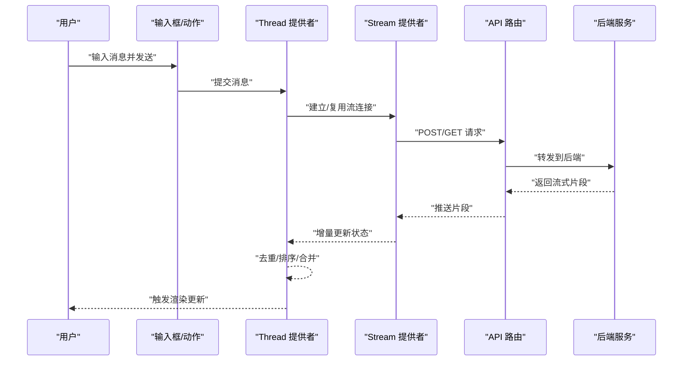
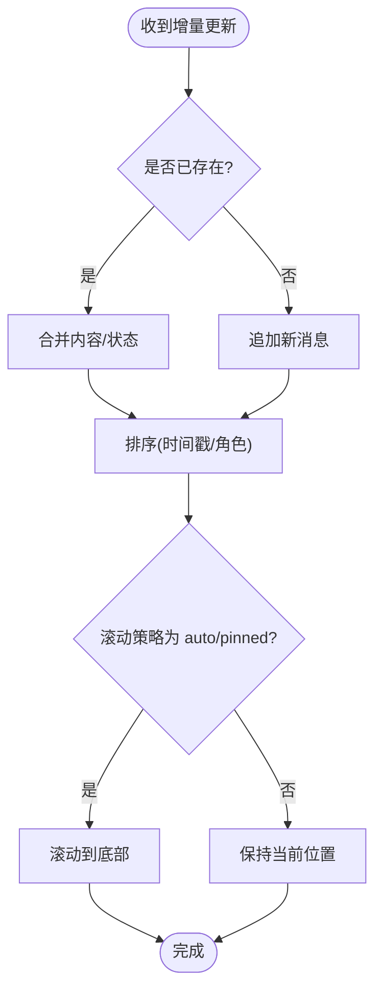
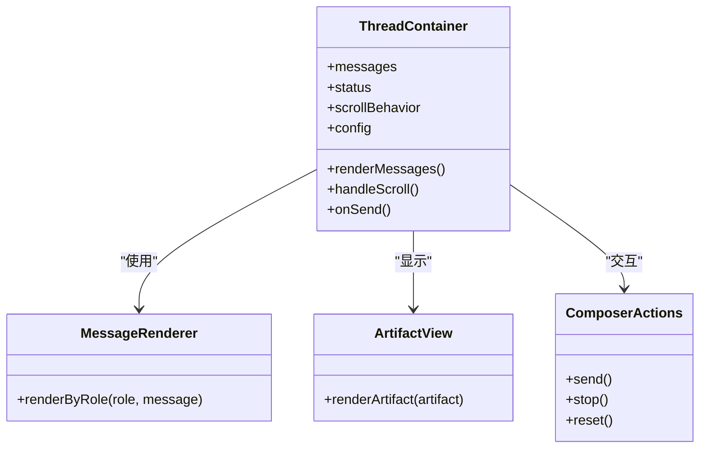
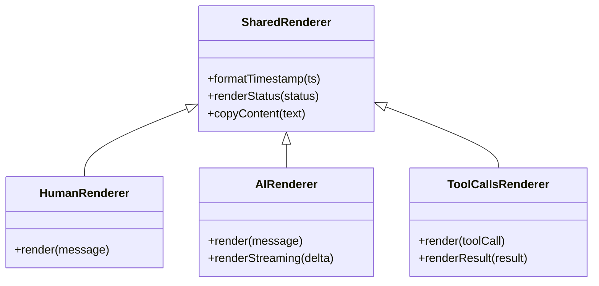
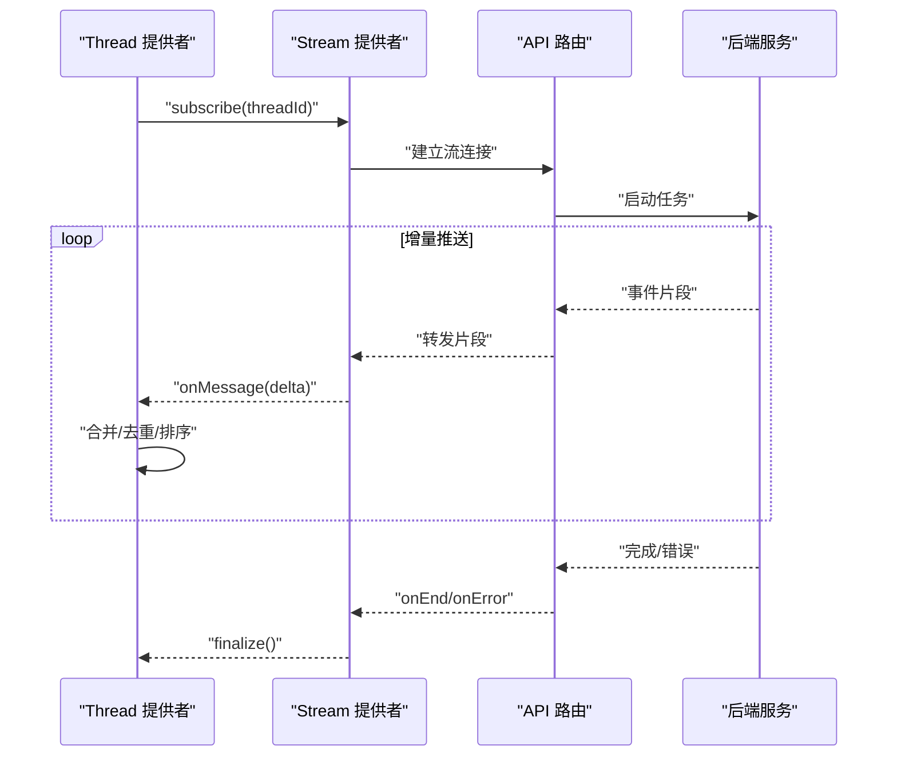
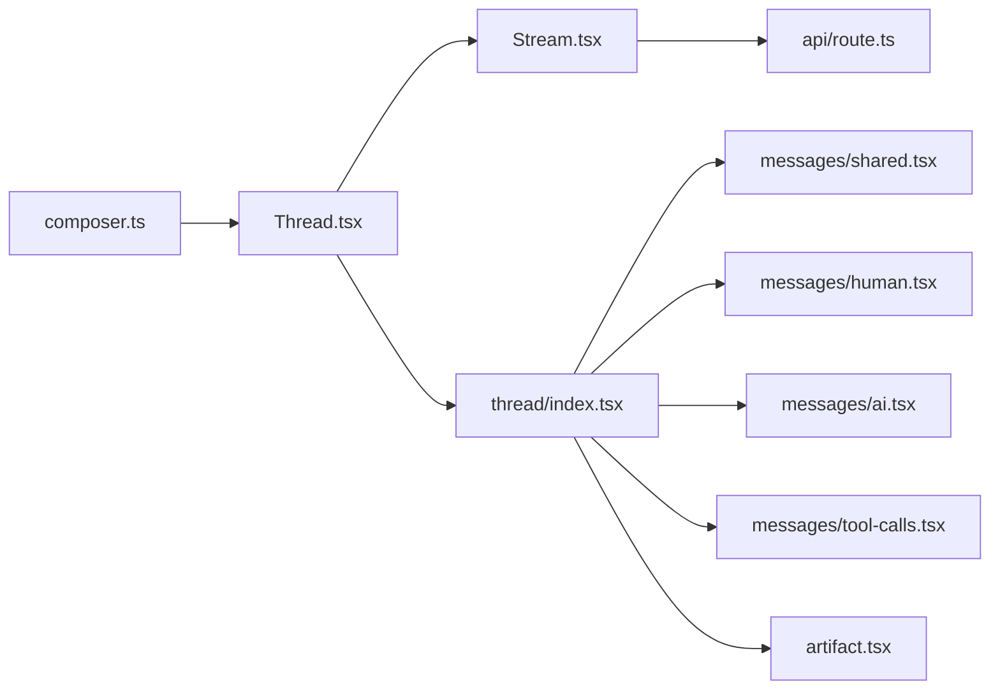

# 线程容器组件

<cite>
**本文引用的文件**   
- [apps/web/src/providers/Thread.tsx](file://apps/web/src/providers/Thread.tsx)
- [apps/web/src/components/thread/index.tsx](file://apps/web/src/components/thread/index.tsx)
- [apps/web/src/components/thread/messages/shared.tsx](file://apps/web/src/components/thread/messages/shared.tsx)
- [apps/web/src/components/thread/messages/human.tsx](file://apps/web/src/components/thread/messages/human.tsx)
- [apps/web/src/components/thread/messages/ai.tsx](file://apps/web/src/components/thread/messages/ai.tsx)
- [apps/web/src/components/thread/messages/tool-calls.tsx](file://apps/web/src/components/thread/messages/tool-calls.tsx)
- [apps/web/src/components/thread/artifact.tsx](file://apps/web/src/components/thread/artifact.tsx)
- [apps/web/src/components/thread/composer-action.tsx](file://apps/web/src/components/thread/composer-action.tsx)
- [apps/web/src/lib/composer.ts](file://apps/web/src/lib/composer.ts)
- [apps/web/src/providers/Stream.tsx](file://apps/web/src/providers/Stream.tsx)
- [apps/web/src/app/api/[..._path]/route.ts](file://apps/web/src/app/api/[..._path]/route.ts)
</cite>

## 目录
1. [简介](#简介)
2. [项目结构](#项目结构)
3. [核心组件](#核心组件)
4. [架构总览](#架构总览)
5. [详细组件分析](#详细组件分析)
6. [依赖关系分析](#依赖关系分析)
7. [性能考量](#性能考量)
8. [故障排查指南](#故障排查指南)
9. [结论](#结论)
10. [附录](#附录)

## 简介
本文件围绕“线程容器组件”进行系统化文档化，聚焦以下目标：
- 线程容器的核心能力：消息列表管理、状态同步、实时更新与滚动控制
- 线程生命周期管理：创建、加载、运行、中断、恢复、结束
- 渲染流程优化：虚拟滚动、增量更新、去重与排序策略
- 配置项与扩展点：自定义渲染器、事件钩子、主题与行为开关
- 后端集成：API 路由、数据流、错误处理与重试
- 事件机制：用户交互、系统事件与流式更新的协调

## 项目结构
线程相关的前端实现集中在 apps/web 下，采用“提供者 + 组件 + 工具库”的分层组织方式：
- providers：提供全局上下文（如 Thread、Stream），负责状态订阅与副作用
- components/thread：线程 UI 组合与消息渲染
- lib：业务逻辑与工具（如 composer）
- app/api：Next.js API 路由，用于转发请求到后端服务

图表来源
- [apps/web/src/providers/Thread.tsx](file://apps/web/src/providers/Thread.tsx)
- [apps/web/src/providers/Stream.tsx](file://apps/web/src/providers/Stream.tsx)
- [apps/web/src/components/thread/index.tsx](file://apps/web/src/components/thread/index.tsx)
- [apps/web/src/components/thread/messages/shared.tsx](file://apps/web/src/components/thread/messages/shared.tsx)
- [apps/web/src/components/thread/messages/human.tsx](file://apps/web/src/components/thread/messages/human.tsx)
- [apps/web/src/components/thread/messages/ai.tsx](file://apps/web/src/components/thread/messages/ai.tsx)
- [apps/web/src/components/thread/messages/tool-calls.tsx](file://apps/web/src/components/thread/messages/tool-calls.tsx)
- [apps/web/src/components/thread/artifact.tsx](file://apps/web/src/components/thread/artifact.tsx)
- [apps/web/src/components/thread/composer-action.tsx](file://apps/web/src/components/thread/composer-action.tsx)
- [apps/web/src/lib/composer.ts](file://apps/web/src/lib/composer.ts)
- [apps/web/src/app/api/[..._path]/route.ts](file://apps/web/src/app/api/[..._path]/route.ts)

章节来源
- [apps/web/src/providers/Thread.tsx](file://apps/web/src/providers/Thread.tsx)
- [apps/web/src/components/thread/index.tsx](file://apps/web/src/components/thread/index.tsx)
- [apps/web/src/lib/composer.ts](file://apps/web/src/lib/composer.ts)
- [apps/web/src/providers/Stream.tsx](file://apps/web/src/providers/Stream.tsx)
- [apps/web/src/app/api/[..._path]/route.ts](file://apps/web/src/app/api/[..._path]/route.ts)

## 核心组件
- 线程提供者（Thread Provider）
  - 职责：维护线程状态（消息列表、运行状态、错误、加载态）、订阅流式更新、暴露操作接口（发送、停止、重置等）
  - 关键点：状态不可变更新、批量合并、去重与排序、滚动锚定策略
- 线程容器组件（Thread Container）
  - 职责：组合消息列表、附件区、输入框与动作按钮；处理滚动行为与可见性优化
  - 关键点：按需渲染、懒加载历史、增量渲染新消息
- 消息渲染器（Human/AI/Tool Calls）
  - 职责：根据消息类型选择对应渲染器，支持富文本、代码高亮、工具调用表格等
  - 关键点：内容安全、可访问性、可扩展插槽
- 流式提供者（Stream Provider）
  - 职责：管理 SSE/WS 连接、增量解析、错误重试、断线重连
  - 关键点：背压控制、幂等合并、进度反馈

章节来源
- [apps/web/src/providers/Thread.tsx](file://apps/web/src/providers/Thread.tsx)
- [apps/web/src/components/thread/index.tsx](file://apps/web/src/components/thread/index.tsx)
- [apps/web/src/components/thread/messages/shared.tsx](file://apps/web/src/components/thread/messages/shared.tsx)
- [apps/web/src/components/thread/messages/human.tsx](file://apps/web/src/components/thread/messages/human.tsx)
- [apps/web/src/components/thread/messages/ai.tsx](file://apps/web/src/components/thread/messages/ai.tsx)
- [apps/web/src/components/thread/messages/tool-calls.tsx](file://apps/web/src/components/thread/messages/tool-calls.tsx)
- [apps/web/src/providers/Stream.tsx](file://apps/web/src/providers/Stream.tsx)

## 架构总览
线程容器通过“提供者模式”将状态与副作用下沉至顶层，组件仅关注展示与交互。数据流遵循“用户输入 → Composer → API → Stream → Thread State → 渲染”的闭环。

图表来源
- [apps/web/src/lib/composer.ts](file://apps/web/src/lib/composer.ts)
- [apps/web/src/providers/Thread.tsx](file://apps/web/src/providers/Thread.tsx)
- [apps/web/src/providers/Stream.tsx](file://apps/web/src/providers/Stream.tsx)
- [apps/web/src/app/api/[..._path]/route.ts](file://apps/web/src/app/api/[..._path]/route.ts)

## 详细组件分析

### 线程提供者（Thread Provider）
- 状态模型
  - messages：有序的消息数组，包含 id、role、content、timestamp、status、toolCalls 等字段
  - status：idle/loading/streaming/error/success
  - error：错误对象或字符串
  - scrollBehavior：auto/manual/pinned
  - config：线程配置（分页、去重键、排序规则、渲染器映射）
- 关键方法
  - appendMessage：追加新消息，执行去重与排序
  - updateMessage：按 id 更新消息内容或状态
  - setScrollBehavior：切换滚动策略
  - send：封装发送逻辑，调用 Stream 提供者
  - reset/clear：重置线程状态
- 去重与排序
  - 去重键：id 或 contentHash，避免重复渲染
  - 排序：时间戳升序，必要时按 role 优先级稳定排序
- 滚动控制
  - auto：新消息到达时自动滚动到底部
  - manual：保持当前滚动位置
  - pinned：锁定底部，阻止上滚

图表来源
- [apps/web/src/providers/Thread.tsx](file://apps/web/src/providers/Thread.tsx)

章节来源
- [apps/web/src/providers/Thread.tsx](file://apps/web/src/providers/Thread.tsx)

### 线程容器组件（Thread Container）
- 职责
  - 订阅 Thread 状态，渲染消息列表、附件区、输入框与动作按钮
  - 处理滚动监听与惯性滚动，结合骨架屏与占位符提升体验
- 渲染优化
  - 虚拟滚动：仅渲染可视区域消息
  - 增量渲染：对长内容进行分片渲染
  - 防抖节流：输入与滚动事件优化
- 扩展点
  - 自定义消息渲染器映射（role → 组件）
  - 插槽注入：头部、尾部、空状态、错误状态

图表来源
- [apps/web/src/components/thread/index.tsx](file://apps/web/src/components/thread/index.tsx)
- [apps/web/src/components/thread/artifact.tsx](file://apps/web/src/components/thread/artifact.tsx)
- [apps/web/src/components/thread/composer-action.tsx](file://apps/web/src/components/thread/composer-action.tsx)

章节来源
- [apps/web/src/components/thread/index.tsx](file://apps/web/src/components/thread/index.tsx)
- [apps/web/src/components/thread/artifact.tsx](file://apps/web/src/components/thread/artifact.tsx)
- [apps/web/src/components/thread/composer-action.tsx](file://apps/web/src/components/thread/composer-action.tsx)

### 消息渲染器（Human/AI/Tool Calls）
- Human/AI 渲染器
  - 支持富文本、Markdown、代码块、图片等多媒体
  - 安全过滤与 XSS 防护
  - 可访问性：语义标签、键盘导航、屏幕阅读器友好
- Tool Calls 渲染器
  - 结构化展示工具调用参数与结果
  - 折叠/展开交互，错误提示与重试入口
- 共享渲染逻辑
  - 统一的时间戳、状态指示、复制/分享操作

图表来源
- [apps/web/src/components/thread/messages/shared.tsx](file://apps/web/src/components/thread/messages/shared.tsx)
- [apps/web/src/components/thread/messages/human.tsx](file://apps/web/src/components/thread/messages/human.tsx)
- [apps/web/src/components/thread/messages/ai.tsx](file://apps/web/src/components/thread/messages/ai.tsx)
- [apps/web/src/components/thread/messages/tool-calls.tsx](file://apps/web/src/components/thread/messages/tool-calls.tsx)

章节来源
- [apps/web/src/components/thread/messages/shared.tsx](file://apps/web/src/components/thread/messages/shared.tsx)
- [apps/web/src/components/thread/messages/human.tsx](file://apps/web/src/components/thread/messages/human.tsx)
- [apps/web/src/components/thread/messages/ai.tsx](file://apps/web/src/components/thread/messages/ai.tsx)
- [apps/web/src/components/thread/messages/tool-calls.tsx](file://apps/web/src/components/thread/messages/tool-calls.tsx)

### 流式提供者（Stream Provider）
- 连接管理
  - 支持 SSE/WS，自动重连与指数退避
  - 心跳检测与超时处理
- 增量解析
  - 流式片段合并，保证最终一致性
  - 错误边界与回滚机制
- 事件总线
  - onOpen/onClose/onError/onMessage 回调
  - 取消令牌与请求中止

图表来源
- [apps/web/src/providers/Stream.tsx](file://apps/web/src/providers/Stream.tsx)
- [apps/web/src/app/api/[..._path]/route.ts](file://apps/web/src/app/api/[..._path]/route.ts)

章节来源
- [apps/web/src/providers/Stream.tsx](file://apps/web/src/providers/Stream.tsx)
- [apps/web/src/app/api/[..._path]/route.ts](file://apps/web/src/app/api/[..._path]/route.ts)

### 输入与动作（Composer）
- 功能
  - 多行输入、粘贴处理、文件上传、快捷指令
  - 发送/停止/重置动作，快捷键支持
- 集成
  - 调用 Thread 提供者的 send 方法
  - 与 Stream 提供者协作，处理流式响应

章节来源
- [apps/web/src/components/thread/composer-action.tsx](file://apps/web/src/components/thread/composer-action.tsx)
- [apps/web/src/lib/composer.ts](file://apps/web/src/lib/composer.ts)

## 依赖关系分析
- 低耦合高内聚：提供者集中管理状态与副作用，组件专注渲染
- 明确的数据流向：输入 → 工具库 → API → 流 → 状态 → 渲染
- 可扩展性：渲染器映射、事件钩子、配置项均支持替换与扩展

图表来源
- [apps/web/src/lib/composer.ts](file://apps/web/src/lib/composer.ts)
- [apps/web/src/providers/Thread.tsx](file://apps/web/src/providers/Thread.tsx)
- [apps/web/src/providers/Stream.tsx](file://apps/web/src/providers/Stream.tsx)
- [apps/web/src/app/api/[..._path]/route.ts](file://apps/web/src/app/api/[..._path]/route.ts)
- [apps/web/src/components/thread/index.tsx](file://apps/web/src/components/thread/index.tsx)
- [apps/web/src/components/thread/messages/shared.tsx](file://apps/web/src/components/thread/messages/shared.tsx)
- [apps/web/src/components/thread/messages/human.tsx](file://apps/web/src/components/thread/messages/human.tsx)
- [apps/web/src/components/thread/messages/ai.tsx](file://apps/web/src/components/thread/messages/ai.tsx)
- [apps/web/src/components/thread/messages/tool-calls.tsx](file://apps/web/src/components/thread/messages/tool-calls.tsx)
- [apps/web/src/components/thread/artifact.tsx](file://apps/web/src/components/thread/artifact.tsx)

章节来源
- [apps/web/src/lib/composer.ts](file://apps/web/src/lib/composer.ts)
- [apps/web/src/providers/Thread.tsx](file://apps/web/src/providers/Thread.tsx)
- [apps/web/src/providers/Stream.tsx](file://apps/web/src/providers/Stream.tsx)
- [apps/web/src/app/api/[..._path]/route.ts](file://apps/web/src/app/api/[..._path]/route.ts)
- [apps/web/src/components/thread/index.tsx](file://apps/web/src/components/thread/index.tsx)

## 性能考量
- 渲染优化
  - 虚拟滚动：仅渲染可视区域，降低 DOM 压力
  - 增量更新：基于 id 的精确更新，避免全量重绘
  - 防抖节流：输入与滚动事件优化，减少不必要的计算
- 内存管理
  - 消息池化与回收，限制最大历史长度
  - 大对象延迟加载与缓存
- 网络优化
  - 流式传输，首字节时间优化
  - 断线重连与指数退避，提升稳定性
- 可观测性
  - 性能埋点：渲染耗时、内存占用、网络延迟
  - 错误上报与日志采集

[本节为通用指导，不直接分析具体文件]

## 故障排查指南
- 常见问题
  - 消息未更新：检查去重键与排序逻辑，确认增量合并是否正确
  - 滚动异常：验证滚动策略与锚点计算，确保虚拟滚动索引正确
  - 流式中断：检查网络连接、心跳与重连策略，查看错误码与重试次数
  - 渲染卡顿：排查大消息渲染、代码高亮与图片加载，启用懒加载与分片
- 调试建议
  - 启用开发者面板，观察状态变化与事件流
  - 模拟弱网与断线，验证重连与回滚
  - 使用性能分析工具定位瓶颈

章节来源
- [apps/web/src/providers/Thread.tsx](file://apps/web/src/providers/Thread.tsx)
- [apps/web/src/providers/Stream.tsx](file://apps/web/src/providers/Stream.tsx)

## 结论
线程容器组件通过清晰的分层与明确的职责划分，实现了高效、稳定且可扩展的聊天体验。其核心在于状态管理与流式更新的协同，配合渲染优化与错误处理策略，能够在复杂场景下保持良好性能与用户体验。未来可通过更多扩展点与插件化设计，进一步提升灵活性与可定制性。

[本节为总结性内容，不直接分析具体文件]

## 附录
- 配置选项示例
  - threadConfig：分页大小、去重键、排序规则、渲染器映射、滚动策略
  - streamConfig：连接超时、重连次数、心跳间隔、事件回调
- 扩展点
  - 自定义渲染器：注册 role → 组件映射
  - 事件钩子：onMessage/onError/onEnd 等
  - 主题与样式：覆盖默认样式与动画
- 最佳实践
  - 保持状态不可变更新，避免引用污染
  - 合理使用虚拟滚动与懒加载
  - 完善错误边界与用户反馈

[本节为补充信息，不直接分析具体文件]