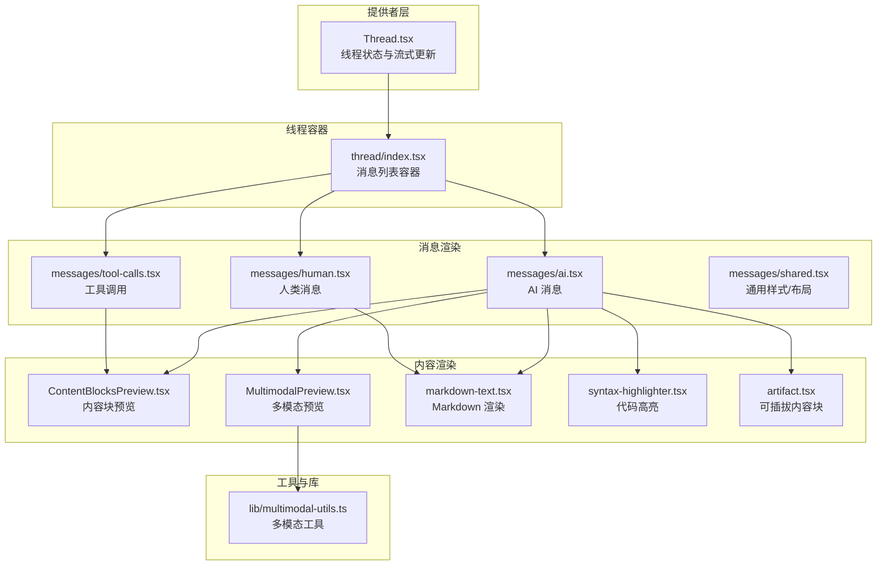
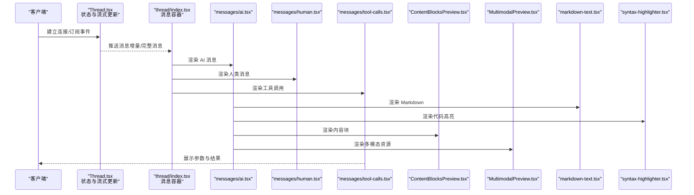
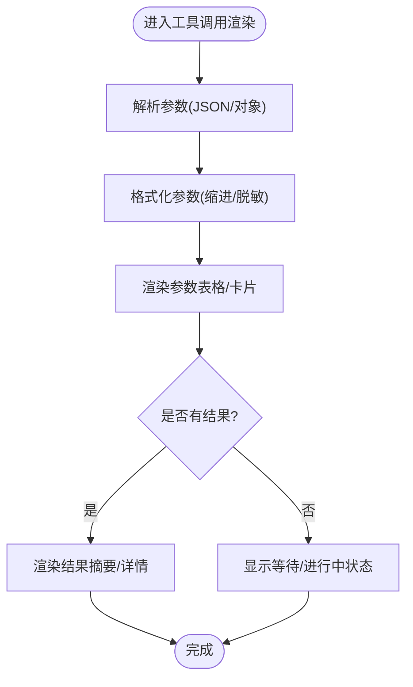
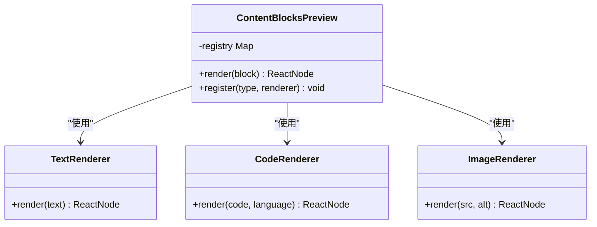
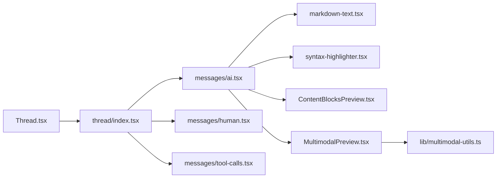

# 线程消息组件

<cite>
**本文引用的文件**   
- [apps/web/src/components/thread/index.tsx](file://apps/web/src/components/thread/index.tsx)
- [apps/web/src/components/thread/messages/ai.tsx](file://apps/web/src/components/thread/messages/ai.tsx)
- [apps/web/src/components/thread/messages/human.tsx](file://apps/web/src/components/thread/messages/human.tsx)
- [apps/web/src/components/thread/messages/tool-calls.tsx](file://apps/web/src/components/thread/messages/tool-calls.tsx)
- [apps/web/src/components/thread/messages/shared.tsx](file://apps/web/src/components/thread/messages/shared.tsx)
- [apps/web/src/components/thread/ContentBlocksPreview.tsx](file://apps/web/src/components/thread/ContentBlocksPreview.tsx)
- [apps/web/src/components/thread/MultimodalPreview.tsx](file://apps/web/src/components/thread/MultimodalPreview.tsx)
- [apps/web/src/components/thread/markdown-text.tsx](file://apps/web/src/components/thread/markdown-text.tsx)
- [apps/web/src/components/thread/syntax-highlighter.tsx](file://apps/web/src/components/thread/syntax-highlighter.tsx)
- [apps/web/src/components/thread/artifact.tsx](file://apps/web/src/components/thread/artifact.tsx)
- [apps/web/src/providers/Thread.tsx](file://apps/web/src/providers/Thread.tsx)
- [apps/web/src/lib/multimodal-utils.ts](file://apps/web/src/lib/multimodal-utils.ts)
</cite>

## 目录
1. [简介](#简介)
2. [项目结构](#项目结构)
3. [核心组件](#核心组件)
4. [架构总览](#架构总览)
5. [详细组件分析](#详细组件分析)
6. [依赖关系分析](#依赖关系分析)
7. [性能考虑](#性能考虑)
8. [故障排查指南](#故障排查指南)
9. [结论](#结论)
10. [附录](#附录)

## 简介
本文件面向“线程消息组件”的实现与使用，覆盖线程容器、消息显示（AI 消息、人类消息、工具调用消息）、内容块预览与多模态预览等关键能力。文档重点阐述：
- 消息渲染流程、状态管理与实时更新机制
- 消息格式化、Markdown 渲染、代码高亮与图片处理
- 工具调用的展示逻辑、参数解析与结果呈现
- 自定义消息类型、扩展渲染器与第三方内容集成
- 性能优化策略（虚拟滚动、懒加载、缓存）

## 项目结构
线程消息相关的前端实现集中在 apps/web/src/components/thread 与 providers/Thread.tsx 中，数据与工具函数位于 lib 目录。整体采用“提供者 + 组件树”的架构：
- 提供者负责订阅流式数据、维护线程状态与上下文
- 组件树按消息类型进行分发渲染，并复用通用样式与交互

图表来源
- [apps/web/src/providers/Thread.tsx](file://apps/web/src/providers/Thread.tsx)
- [apps/web/src/components/thread/index.tsx](file://apps/web/src/components/thread/index.tsx)
- [apps/web/src/components/thread/messages/ai.tsx](file://apps/web/src/components/thread/messages/ai.tsx)
- [apps/web/src/components/thread/messages/human.tsx](file://apps/web/src/components/thread/messages/human.tsx)
- [apps/web/src/components/thread/messages/tool-calls.tsx](file://apps/web/src/components/thread/tool-calls.tsx)
- [apps/web/src/components/thread/ContentBlocksPreview.tsx](file://apps/web/src/components/thread/ContentBlocksPreview.tsx)
- [apps/web/src/components/thread/MultimodalPreview.tsx](file://apps/web/src/components/thread/MultimodalPreview.tsx)
- [apps/web/src/components/thread/markdown-text.tsx](file://apps/web/src/components/thread/markdown-text.tsx)
- [apps/web/src/components/thread/syntax-highlighter.tsx](file://apps/web/src/components/thread/syntax-highlighter.tsx)
- [apps/web/src/components/thread/artifact.tsx](file://apps/web/src/components/thread/artifact.tsx)
- [apps/web/src/lib/multimodal-utils.ts](file://apps/web/src/lib/multimodal-utils.ts)

章节来源
- [apps/web/src/components/thread/index.tsx](file://apps/web/src/components/thread/index.tsx)
- [apps/web/src/providers/Thread.tsx](file://apps/web/src/providers/Thread.tsx)

## 核心组件
- 线程容器（thread/index.tsx）
  - 职责：聚合消息列表、提供滚动定位、渲染分隔与占位、驱动消息项渲染
  - 关键点：基于提供者获取的消息集合进行映射渲染；对长列表建议配合虚拟滚动
- AI 消息（messages/ai.tsx）
  - 职责：渲染 AI 回复，支持 Markdown、代码高亮、内容块与多模态预览
  - 关键点：将文本与结构化内容分片渲染；在流式更新时增量追加
- 人类消息（messages/human.tsx）
  - 职责：渲染用户输入，支持富文本与附件展示
- 工具调用（messages/tool-calls.tsx）
  - 职责：以表格或卡片形式展示工具名称、参数与结果；支持展开/折叠
- 内容块预览（ContentBlocksPreview.tsx）
  - 职责：根据内容块类型选择对应渲染器（文本、代码、图片、文件等）
- 多模态预览（MultimodalPreview.tsx）
  - 职责：统一处理图片、视频、音频等多媒体资源，提供缩放、预览与错误兜底

章节来源
- [apps/web/src/components/thread/index.tsx](file://apps/web/src/components/thread/index.tsx)
- [apps/web/src/components/thread/messages/ai.tsx](file://apps/web/src/components/thread/messages/ai.tsx)
- [apps/web/src/components/thread/messages/human.tsx](file://apps/web/src/components/thread/messages/human.tsx)
- [apps/web/src/components/thread/messages/tool-calls.tsx](file://apps/web/src/components/thread/messages/tool-calls.tsx)
- [apps/web/src/components/thread/ContentBlocksPreview.tsx](file://apps/web/src/components/thread/ContentBlocksPreview.tsx)
- [apps/web/src/components/thread/MultimodalPreview.tsx](file://apps/web/src/components/thread/MultimodalPreview.tsx)

## 架构总览
线程消息的整体数据流由提供者驱动，组件按需消费状态并进行渲染。

图表来源
- [apps/web/src/providers/Thread.tsx](file://apps/web/src/providers/Thread.tsx)
- [apps/web/src/components/thread/index.tsx](file://apps/web/src/components/thread/index.tsx)
- [apps/web/src/components/thread/messages/ai.tsx](file://apps/web/src/components/thread/messages/ai.tsx)
- [apps/web/src/components/thread/messages/human.tsx](file://apps/web/src/components/thread/messages/human.tsx)
- [apps/web/src/components/thread/messages/tool-calls.tsx](file://apps/web/src/components/thread/messages/tool-calls.tsx)
- [apps/web/src/components/thread/ContentBlocksPreview.tsx](file://apps/web/src/components/thread/ContentBlocksPreview.tsx)
- [apps/web/src/components/thread/MultimodalPreview.tsx](file://apps/web/src/components/thread/MultimodalPreview.tsx)
- [apps/web/src/components/thread/markdown-text.tsx](file://apps/web/src/components/thread/markdown-text.tsx)
- [apps/web/src/components/thread/syntax-highlighter.tsx](file://apps/web/src/components/thread/syntax-highlighter.tsx)

## 详细组件分析

### 线程容器（thread/index.tsx）
- 功能要点
  - 从提供者读取消息集合，按顺序渲染
  - 为不同消息类型选择对应渲染器
  - 管理滚动位置与可见区域，便于流式更新时保持阅读体验
- 渲染流程
  - 遍历消息数组 -> 判断类型 -> 渲染对应组件
  - 对长列表建议使用虚拟化方案（如 react-window/react-virtualized），避免一次性渲染大量节点
- 状态与更新
  - 通过提供者提供的状态与回调进行增量更新
  - 对新增消息进行锚点定位或平滑滚动

章节来源
- [apps/web/src/components/thread/index.tsx](file://apps/web/src/components/thread/index.tsx)

### AI 消息（messages/ai.tsx）
- 功能要点
  - 支持纯文本、Markdown、代码块、内联链接与图片
  - 支持内容块与多模态资源的组合渲染
  - 流式更新场景下，对已渲染片段进行增量追加
- 渲染细节
  - 文本段落与代码块分离渲染，提升可读性与性能
  - 代码块通过语法高亮组件增强展示
  - 内容块与多模态资源分别交由专用组件处理
- 状态管理
  - 本地维护“是否正在生成”的状态，用于控制占位与动画
  - 与提供者联动，接收增量片段并合并到当前消息

章节来源
- [apps/web/src/components/thread/messages/ai.tsx](file://apps/web/src/components/thread/messages/ai.tsx)

### 人类消息（messages/human.tsx）
- 功能要点
  - 渲染用户输入，支持富文本与附件
  - 对超长内容进行截断与展开
- 渲染细节
  - 基础文本与附件列表分离渲染
  - 附件点击触发下载或预览

章节来源
- [apps/web/src/components/thread/messages/human.tsx](file://apps/web/src/components/thread/messages/human.tsx)

### 工具调用（messages/tool-calls.tsx）
- 功能要点
  - 以表格或卡片形式展示工具名、参数与结果
  - 支持参数折叠/展开、结果复制与跳转
- 参数解析
  - 将 JSON 字符串或对象格式化为易读结构
  - 对敏感字段进行脱敏或隐藏
- 结果展示
  - 成功：展示摘要与详情面板
  - 失败：展示错误信息与重试入口

图表来源
- [apps/web/src/components/thread/messages/tool-calls.tsx](file://apps/web/src/components/thread/messages/tool-calls.tsx)

章节来源
- [apps/web/src/components/thread/messages/tool-calls.tsx](file://apps/web/src/components/thread/messages/tool-calls.tsx)

### 内容块预览（ContentBlocksPreview.tsx）
- 功能要点
  - 根据内容块类型选择渲染器：文本、代码、图片、文件、表格等
  - 对未知类型提供降级渲染（原始文本或占位）
- 扩展机制
  - 通过注册表模式扩展新的内容块类型与渲染器
  - 支持外部组件注入，实现第三方内容嵌入

图表来源
- [apps/web/src/components/thread/ContentBlocksPreview.tsx](file://apps/web/src/components/thread/ContentBlocksPreview.tsx)

章节来源
- [apps/web/src/components/thread/ContentBlocksPreview.tsx](file://apps/web/src/components/thread/ContentBlocksPreview.tsx)

### 多模态预览（MultimodalPreview.tsx）
- 功能要点
  - 统一处理图片、视频、音频等资源
  - 提供缩放、全屏、错误兜底与懒加载
- 资源处理
  - 对大尺寸图片进行自适应缩放
  - 对视频/音频提供播放控件与进度条
- 错误处理
  - 网络错误、格式不支持时的降级展示

章节来源
- [apps/web/src/components/thread/MultimodalPreview.tsx](file://apps/web/src/components/thread/MultimodalPreview.tsx)
- [apps/web/src/lib/multimodal-utils.ts](file://apps/web/src/lib/multimodal-utils.ts)

### Markdown 渲染与代码高亮
- Markdown 渲染（markdown-text.tsx）
  - 将 Markdown 转换为 HTML，并注入安全过滤
  - 支持标题、列表、表格、链接、引用等常用语法
- 代码高亮（syntax-highlighter.tsx）
  - 基于语言识别进行着色
  - 支持复制、行号与主题切换

章节来源
- [apps/web/src/components/thread/markdown-text.tsx](file://apps/web/src/components/thread/markdown-text.tsx)
- [apps/web/src/components/thread/syntax-highlighter.tsx](file://apps/web/src/components/thread/syntax-highlighter.tsx)

### 可插拔内容块（artifact.tsx）
- 功能要点
  - 作为通用内容块容器，承载多种类型的可插拔内容
  - 支持外部组件注册与动态加载
- 扩展方式
  - 通过注册表添加新类型与渲染器
  - 支持异步加载大型内容块以提升首屏性能

章节来源
- [apps/web/src/components/thread/artifact.tsx](file://apps/web/src/components/thread/artifact.tsx)

## 依赖关系分析
- 组件耦合
  - 线程容器依赖提供者提供的消息集合与更新接口
  - AI 消息依赖 Markdown 渲染、代码高亮、内容块与多模态预览
  - 工具调用依赖参数解析与结果格式化
- 外部依赖
  - 多模态工具函数用于资源处理与校验
  - 第三方 Markdown/高亮库通过封装组件接入

图表来源
- [apps/web/src/providers/Thread.tsx](file://apps/web/src/providers/Thread.tsx)
- [apps/web/src/components/thread/index.tsx](file://apps/web/src/components/thread/index.tsx)
- [apps/web/src/components/thread/messages/ai.tsx](file://apps/web/src/components/thread/messages/ai.tsx)
- [apps/web/src/components/thread/messages/human.tsx](file://apps/web/src/components/thread/messages/human.tsx)
- [apps/web/src/components/thread/messages/tool-calls.tsx](file://apps/web/src/components/thread/messages/tool-calls.tsx)
- [apps/web/src/components/thread/markdown-text.tsx](file://apps/web/src/components/thread/markdown-text.tsx)
- [apps/web/src/components/thread/syntax-highlighter.tsx](file://apps/web/src/components/thread/syntax-highlighter.tsx)
- [apps/web/src/components/thread/ContentBlocksPreview.tsx](file://apps/web/src/components/thread/ContentBlocksPreview.tsx)
- [apps/web/src/components/thread/MultimodalPreview.tsx](file://apps/web/src/components/thread/MultimodalPreview.tsx)
- [apps/web/src/lib/multimodal-utils.ts](file://apps/web/src/lib/multimodal-utils.ts)

章节来源
- [apps/web/src/providers/Thread.tsx](file://apps/web/src/providers/Thread.tsx)
- [apps/web/src/components/thread/index.tsx](file://apps/web/src/components/thread/index.tsx)

## 性能考虑
- 虚拟滚动
  - 对长列表使用虚拟化方案，仅渲染可视区域内的消息项
  - 结合稳定 key 与不可变数据结构，减少重渲染
- 懒加载
  - 多模态资源按需加载，避免首屏阻塞
  - 大体积内容块延迟初始化，用户交互后再加载
- 缓存机制
  - 对 Markdown 渲染结果与代码高亮结果进行缓存
  - 对多模态资源进行内存与磁盘缓存，提升重复访问速度
- 流式更新优化
  - 增量拼接文本片段，避免整段重建
  - 对频繁更新的 UI（如加载指示器）进行局部更新

[本节为通用指导，不直接分析具体文件]

## 故障排查指南
- 常见问题
  - Markdown 渲染异常：检查输入合法性与安全过滤配置
  - 代码高亮缺失：确认语言识别与主题加载
  - 多模态资源加载失败：检查 URL 有效性、跨域与 MIME 类型
  - 工具调用参数解析失败：校验 JSON 格式与字段完整性
- 调试建议
  - 在内容块与多模态预览中加入错误边界与日志
  - 对工具调用增加参数与结果的快照记录
  - 对长列表启用虚拟化并监控渲染帧率

章节来源
- [apps/web/src/components/thread/ContentBlocksPreview.tsx](file://apps/web/src/components/thread/ContentBlocksPreview.tsx)
- [apps/web/src/components/thread/MultimodalPreview.tsx](file://apps/web/src/components/thread/MultimodalPreview.tsx)
- [apps/web/src/components/thread/messages/tool-calls.tsx](file://apps/web/src/components/thread/messages/tool-calls.tsx)

## 结论
线程消息组件通过清晰的提供者-组件分层与可扩展的内容渲染体系，实现了高效、灵活且高性能的消息展示。借助 Markdown、代码高亮、内容块与多模态预览，能够覆盖丰富的交互场景。通过虚拟滚动、懒加载与缓存等优化策略，可在大规模消息与多媒体资源下保持流畅体验。未来可通过扩展内容块注册表与第三方渲染器，进一步丰富展示能力。

[本节为总结性内容，不直接分析具体文件]

## 附录
- 自定义消息类型
  - 在消息容器中新增类型分支，并实现对应渲染组件
  - 遵循统一的 props 结构与状态约定
- 扩展渲染器
  - 在内容块注册表中添加新类型与渲染器
  - 确保对未知类型的降级处理
- 集成第三方内容
  - 通过 artifact 容器加载外部组件
  - 注意安全性与沙箱隔离

[本节为概念性指导，不直接分析具体文件]