# 编辑器动作组件

<cite>
**本文引用的文件**   
- [composer-action.tsx](file://apps/web/src/components/thread/composer-action.tsx)
- [thread-actions-view.tsx](file://apps/web/src/components/thread/agent-inbox/components/thread-actions-view.tsx)
- [use-interrupted-actions.tsx](file://apps/web/src/components/thread/agent-inbox/hooks/use-interrupted-actions.tsx)
- [types.ts](file://apps/web/src/components/thread/agent-inbox/types.ts)
- [utils.ts](file://apps/web/src/components/thread/agent-inbox/utils.ts)
- [index.tsx](file://apps/web/src/components/thread/index.tsx)
- [artifact.tsx](file://apps/web/src/components/thread/artifact.tsx)
- [tool-calls.tsx](file://apps/web/src/components/thread/messages/tool-calls.tsx)
- [Stream.tsx](file://apps/web/src/providers/Stream.tsx)
- [Thread.tsx](file://apps/web/src/providers/Thread.tsx)
- [client.ts](file://apps/web/src/providers/client.ts)
- [ensure-tool-responses.ts](file://apps/web/src/lib/ensure-tool-responses.ts)
- [multimodal-utils.ts](file://apps/web/src/lib/multimodal-utils.ts)
- [api route](file://apps/web/src/app/api/[..._path]/route.ts)
</cite>

## 目录
1. [简介](#简介)
2. [项目结构](#项目结构)
3. [核心组件](#核心组件)
4. [架构总览](#架构总览)
5. [详细组件分析](#详细组件分析)
6. [依赖关系分析](#依赖关系分析)
7. [性能考量](#性能考量)
8. [故障排查指南](#故障排查指南)
9. [结论](#结论)
10. [附录](#附录)

## 简介
本文件面向“编辑器动作组件”，系统性阐述动作的概念、触发机制与执行流程，覆盖动作类型系统、参数传递与结果处理，以及动作的注册、发现与执行实现细节。同时提供自定义动作类型、扩展动作库与集成外部服务的指导，并说明动作与编辑器的集成方式、状态同步与用户反馈机制。文档以仓库中前端代码为依据，聚焦 Web 应用中的 Composer（编辑器）与 Agent Inbox 的动作体系。

## 项目结构
本项目为多应用工作区，Web 端位于 apps/web。与“编辑器动作”直接相关的模块集中在：
- 编辑器入口与上下文：apps/web/src/components/thread/index.tsx
- 编辑器动作 UI：apps/web/src/components/thread/composer-action.tsx
- 动作展示与交互：apps/web/src/components/thread/agent-inbox/components/thread-actions-view.tsx
- 中断动作 Hook：apps/web/src/components/thread/agent-inbox/hooks/use-interrupted-actions.tsx
- 类型定义与工具：apps/web/src/components/thread/agent-inbox/types.ts, utils.ts
- 消息与工具调用渲染：apps/web/src/components/thread/messages/tool-calls.tsx
- 流式处理与线程状态：apps/web/src/providers/Stream.tsx, Thread.tsx
- 客户端与 API 路由：apps/web/src/providers/client.ts, apps/web/src/app/api/[..._path]/route.ts
- 辅助能力：确保工具响应格式、多模态工具等

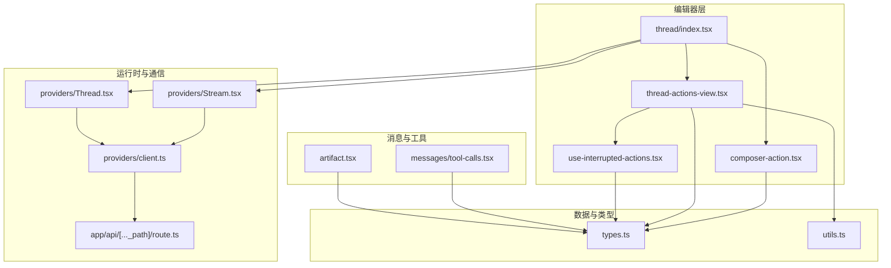

图表来源
- [index.tsx](file://apps/web/src/components/thread/index.tsx)
- [composer-action.tsx](file://apps/web/src/components/thread/composer-action.tsx)
- [thread-actions-view.tsx](file://apps/web/src/components/thread/agent-inbox/components/thread-actions-view.tsx)
- [use-interrupted-actions.tsx](file://apps/web/src/components/thread/agent-inbox/hooks/use-interrupted-actions.tsx)
- [types.ts](file://apps/web/src/components/thread/agent-inbox/types.ts)
- [utils.ts](file://apps/web/src/components/thread/agent-inbox/utils.ts)
- [tool-calls.tsx](file://apps/web/src/components/thread/messages/tool-calls.tsx)
- [artifact.tsx](file://apps/web/src/components/thread/artifact.tsx)
- [Stream.tsx](file://apps/web/src/providers/Stream.tsx)
- [Thread.tsx](file://apps/web/src/providers/Thread.tsx)
- [client.ts](file://apps/web/src/providers/client.ts)
- [api route](file://apps/web/src/app/api/[..._path]/route.ts)

章节来源
- [index.tsx](file://apps/web/src/components/thread/index.tsx)
- [composer-action.tsx](file://apps/web/src/components/thread/composer-action.tsx)
- [thread-actions-view.tsx](file://apps/web/src/components/thread/agent-inbox/components/thread-actions-view.tsx)
- [use-interrupted-actions.tsx](file://apps/web/src/components/thread/agent-inbox/hooks/use-interrupted-actions.tsx)
- [types.ts](file://apps/web/src/components/thread/agent-inbox/types.ts)
- [utils.ts](file://apps/web/src/components/thread/agent-inbox/utils.ts)
- [tool-calls.tsx](file://apps/web/src/components/thread/messages/tool-calls.tsx)
- [artifact.tsx](file://apps/web/src/components/thread/artifact.tsx)
- [Stream.tsx](file://apps/web/src/providers/Stream.tsx)
- [Thread.tsx](file://apps/web/src/providers/Thread.tsx)
- [client.ts](file://apps/web/src/providers/client.ts)
- [api route](file://apps/web/src/app/api/[..._path]/route.ts)

## 核心组件
- 编辑器动作入口与触发：编辑器通过 composer-action 暴露可点击或自动触发的动作项，支持在输入上下文中选择并执行。
- 动作展示与交互：thread-actions-view 负责将可用动作列表渲染到界面，并提供确认、取消、重试等操作。
- 中断动作管理：use-interrupted-actions 维护被中断的动作队列，驱动恢复与回退逻辑。
- 类型系统与工具：types.ts 定义动作、工具调用、中断事件等数据结构；utils.ts 提供校验、转换与格式化能力。
- 消息与工具调用渲染：tool-calls.tsx 将工具调用与结果可视化，便于用户理解执行过程。
- 流式与线程状态：Stream.tsx 与 Thread.tsx 负责事件流订阅、状态更新与生命周期管理。
- 客户端与后端路由：client.ts 封装请求与鉴权；API 路由统一转发至后端服务。

章节来源
- [composer-action.tsx](file://apps/web/src/components/thread/composer-action.tsx)
- [thread-actions-view.tsx](file://apps/web/src/components/thread/agent-inbox/components/thread-actions-view.tsx)
- [use-interrupted-actions.tsx](file://apps/web/src/components/thread/agent-inbox/hooks/use-interrupted-actions.tsx)
- [types.ts](file://apps/web/src/components/thread/agent-inbox/types.ts)
- [utils.ts](file://apps/web/src/components/thread/agent-inbox/utils.ts)
- [tool-calls.tsx](file://apps/web/src/components/thread/messages/tool-calls.tsx)
- [Stream.tsx](file://apps/web/src/providers/Stream.tsx)
- [Thread.tsx](file://apps/web/src/providers/Thread.tsx)
- [client.ts](file://apps/web/src/providers/client.ts)
- [api route](file://apps/web/src/app/api/[..._path]/route.ts)

## 架构总览
编辑器动作的执行遵循“触发—调度—执行—反馈—状态同步”的闭环。动作由编辑器或系统事件触发，经动作管理器分发到具体处理器，处理器调用后端工具或服务，结果通过流式事件回传，最终更新 UI 与线程状态。

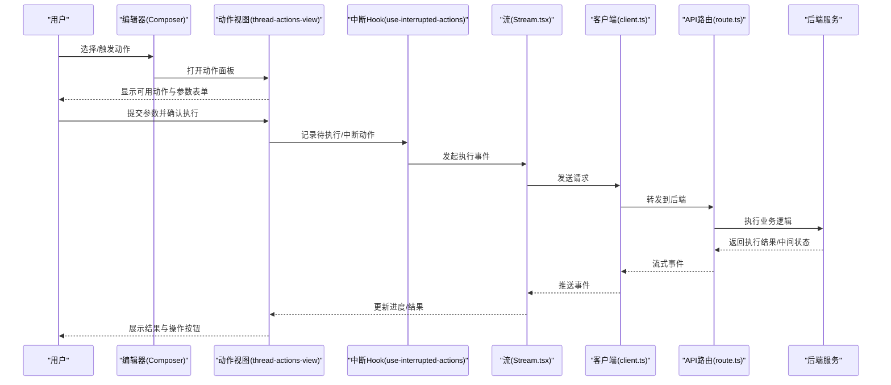

图表来源
- [composer-action.tsx](file://apps/web/src/components/thread/composer-action.tsx)
- [thread-actions-view.tsx](file://apps/web/src/components/thread/agent-inbox/components/thread-actions-view.tsx)
- [use-interrupted-actions.tsx](file://apps/web/src/components/thread/agent-inbox/hooks/use-interrupted-actions.tsx)
- [Stream.tsx](file://apps/web/src/providers/Stream.tsx)
- [client.ts](file://apps/web/src/providers/client.ts)
- [api route](file://apps/web/src/app/api/[..._path]/route.ts)

## 详细组件分析

### 动作类型系统与数据结构
- 动作类型：定义动作标识、名称、描述、参数 Schema、是否可中断、是否幂等等元信息。
- 参数传递：使用 JSON Schema 或等价结构对参数进行校验与默认值填充。
- 结果处理：标准化结果对象，包含状态、数据、错误信息与扩展字段。
- 中断与恢复：支持长时间运行的动作，允许暂停、恢复与取消。

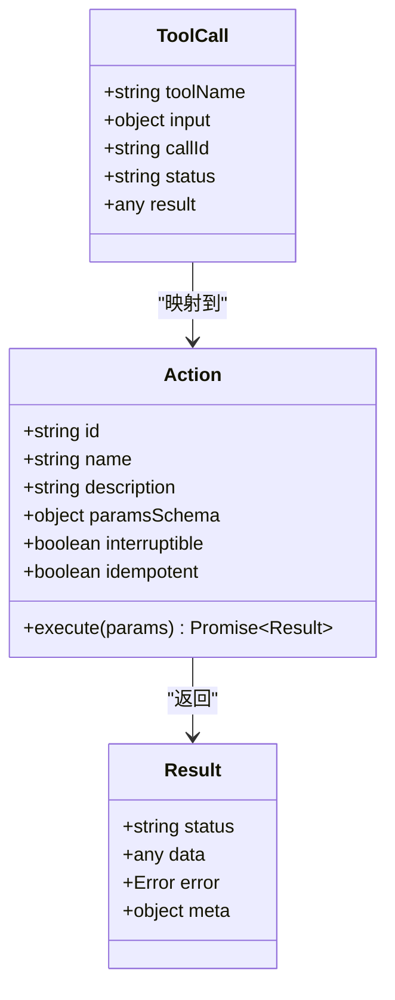

图表来源
- [types.ts](file://apps/web/src/components/thread/agent-inbox/types.ts)
- [tool-calls.tsx](file://apps/web/src/components/thread/messages/tool-calls.tsx)

章节来源
- [types.ts](file://apps/web/src/components/thread/agent-inbox/types.ts)
- [tool-calls.tsx](file://apps/web/src/components/thread/messages/tool-calls.tsx)

### 动作注册与发现
- 注册中心：集中维护动作清单与版本信息，支持动态加载与热更新。
- 发现机制：根据当前上下文（如消息类型、权限、功能开关）过滤可用动作。
- 优先级与冲突：当多个动作匹配时，按优先级与规则选择最佳动作。

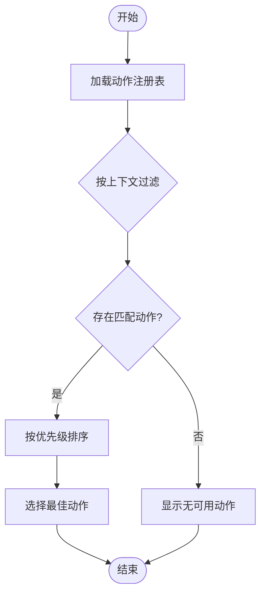

图表来源
- [types.ts](file://apps/web/src/components/thread/agent-inbox/types.ts)
- [utils.ts](file://apps/web/src/components/thread/agent-inbox/utils.ts)

章节来源
- [types.ts](file://apps/web/src/components/thread/agent-inbox/types.ts)
- [utils.ts](file://apps/web/src/components/thread/agent-inbox/utils.ts)

### 动作执行流程与参数校验
- 参数校验：基于 Schema 对输入进行必填、类型、范围校验，失败则提示修正。
- 执行调度：根据动作 ID 查找处理器，构造调用上下文（用户、会话、权限）。
- 执行与监控：支持异步执行、进度回调、超时与重试策略。
- 结果归一化：统一包装成功/失败结果，附加追踪 ID 与审计信息。

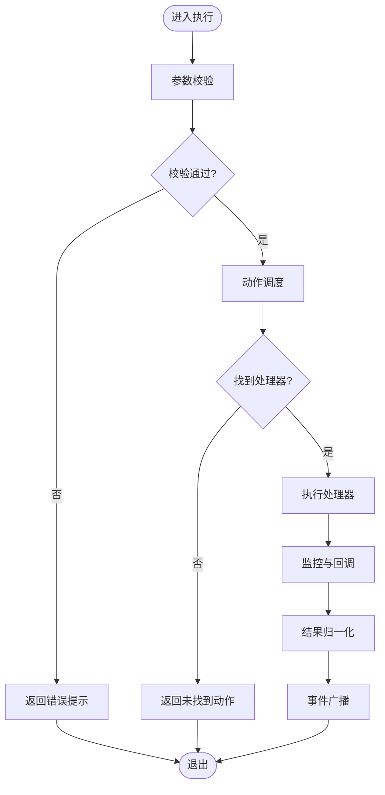

图表来源
- [composer-action.tsx](file://apps/web/src/components/thread/composer-action.tsx)
- [utils.ts](file://apps/web/src/components/thread/agent-inbox/utils.ts)

章节来源
- [composer-action.tsx](file://apps/web/src/components/thread/composer-action.tsx)
- [utils.ts](file://apps/web/src/components/thread/agent-inbox/utils.ts)

### 中断动作与恢复机制
- 中断捕获：长耗时动作在执行过程中可被中断，记录中断点与上下文快照。
- 恢复策略：支持从断点恢复、部分重试与补偿操作。
- 用户反馈：在 UI 上清晰展示中断原因、恢复选项与预计时间。

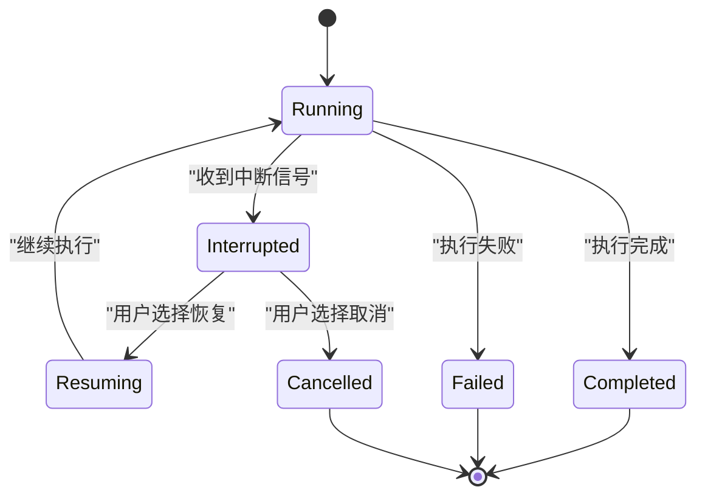

图表来源
- [use-interrupted-actions.tsx](file://apps/web/src/components/thread/agent-inbox/hooks/use-interrupted-actions.tsx)

章节来源
- [use-interrupted-actions.tsx](file://apps/web/src/components/thread/agent-inbox/hooks/use-interrupted-actions.tsx)

### 编辑器集成与状态同步
- 编辑器上下文：动作执行需要访问编辑器内容、光标位置、选区等上下文。
- 状态同步：通过 Provider 模式共享线程状态，确保动作结果即时反映到 UI。
- 事件总线：使用流式事件驱动 UI 更新，避免频繁重渲染。

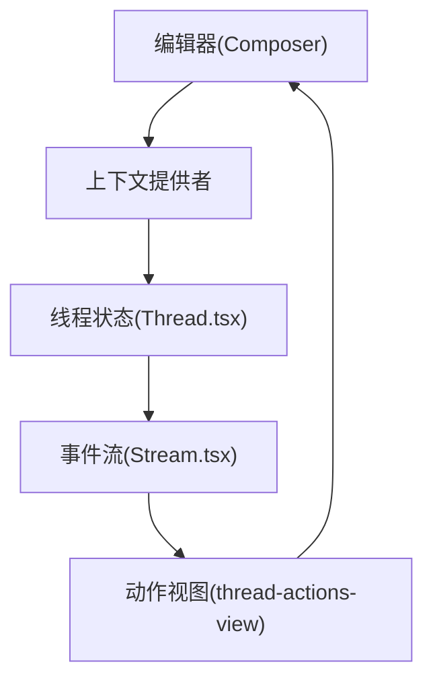

图表来源
- [index.tsx](file://apps/web/src/components/thread/index.tsx)
- [Thread.tsx](file://apps/web/src/providers/Thread.tsx)
- [Stream.tsx](file://apps/web/src/providers/Stream.tsx)
- [thread-actions-view.tsx](file://apps/web/src/components/thread/agent-inbox/components/thread-actions-view.tsx)

章节来源
- [index.tsx](file://apps/web/src/components/thread/index.tsx)
- [Thread.tsx](file://apps/web/src/providers/Thread.tsx)
- [Stream.tsx](file://apps/web/src/providers/Stream.tsx)
- [thread-actions-view.tsx](file://apps/web/src/components/thread/agent-inbox/components/thread-actions-view.tsx)

### 工具调用与结果可视化
- 工具调用：动作可能调用内部或外部工具，调用信息需持久化与展示。
- 结果渲染：支持文本、结构化数据、富媒体等多种结果形式。
- 错误处理：统一错误码与友好提示，支持重试与降级。

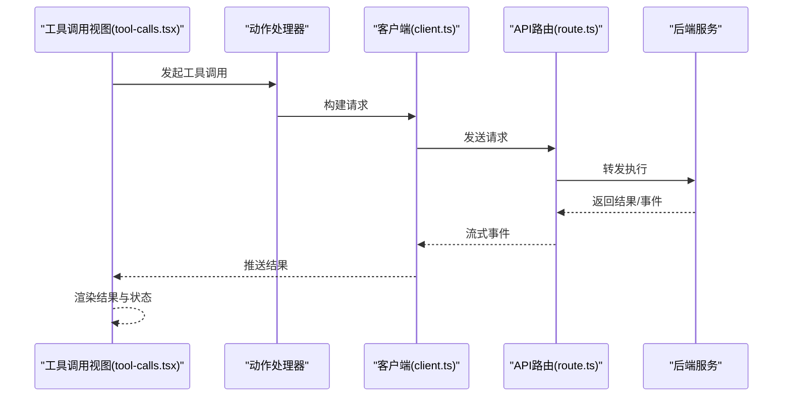

图表来源
- [tool-calls.tsx](file://apps/web/src/components/thread/messages/tool-calls.tsx)
- [client.ts](file://apps/web/src/providers/client.ts)
- [api route](file://apps/web/src/app/api/[..._path]/route.ts)

章节来源
- [tool-calls.tsx](file://apps/web/src/components/thread/messages/tool-calls.tsx)
- [client.ts](file://apps/web/src/providers/client.ts)
- [api route](file://apps/web/src/app/api/[..._path]/route.ts)

### 自定义动作类型与扩展动作库
- 自定义动作：通过实现标准接口，注册新动作类型，声明参数与行为。
- 插件机制：支持按需加载与隔离运行，避免污染主进程。
- 版本兼容：动作升级需保持向后兼容，提供迁移脚本与灰度发布。

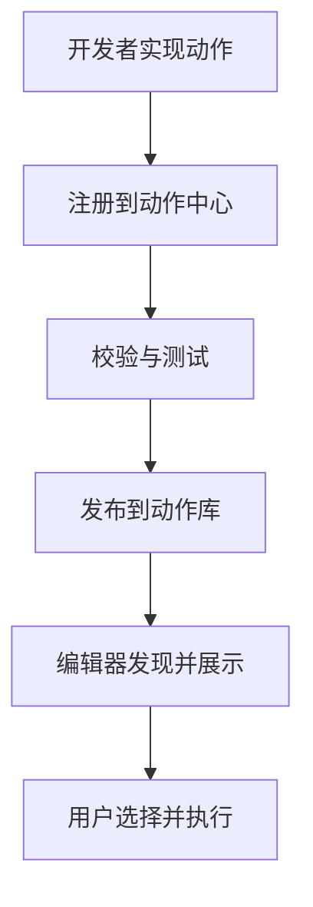

图表来源
- [types.ts](file://apps/web/src/components/thread/agent-inbox/types.ts)
- [utils.ts](file://apps/web/src/components/thread/agent-inbox/utils.ts)

章节来源
- [types.ts](file://apps/web/src/components/thread/agent-inbox/types.ts)
- [utils.ts](file://apps/web/src/components/thread/agent-inbox/utils.ts)

### 集成外部服务
- 认证与安全：统一鉴权、签名与加密传输。
- 限流与熔断：对外部服务调用实施速率限制与熔断保护。
- 缓存与重试：对幂等请求启用缓存与智能重试。

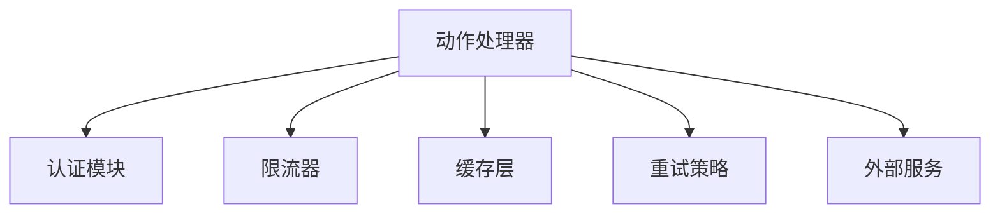

图表来源
- [client.ts](file://apps/web/src/providers/client.ts)
- [ensure-tool-responses.ts](file://apps/web/src/lib/ensure-tool-responses.ts)

章节来源
- [client.ts](file://apps/web/src/providers/client.ts)
- [ensure-tool-responses.ts](file://apps/web/src/lib/ensure-tool-responses.ts)

## 依赖关系分析
动作组件依赖类型定义、工具函数、流式事件与客户端通信。各模块职责清晰，耦合度低，便于扩展与维护。

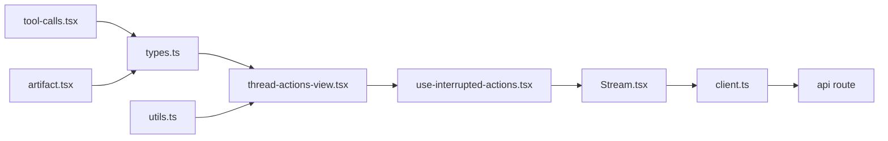

图表来源
- [types.ts](file://apps/web/src/components/thread/agent-inbox/types.ts)
- [utils.ts](file://apps/web/src/components/thread/agent-inbox/utils.ts)
- [thread-actions-view.tsx](file://apps/web/src/components/thread/agent-inbox/components/thread-actions-view.tsx)
- [use-interrupted-actions.tsx](file://apps/web/src/components/thread/agent-inbox/hooks/use-interrupted-actions.tsx)
- [Stream.tsx](file://apps/web/src/providers/Stream.tsx)
- [client.ts](file://apps/web/src/providers/client.ts)
- [api route](file://apps/web/src/app/api/[..._path]/route.ts)
- [tool-calls.tsx](file://apps/web/src/components/thread/messages/tool-calls.tsx)
- [artifact.tsx](file://apps/web/src/components/thread/artifact.tsx)

章节来源
- [types.ts](file://apps/web/src/components/thread/agent-inbox/types.ts)
- [utils.ts](file://apps/web/src/components/thread/agent-inbox/utils.ts)
- [thread-actions-view.tsx](file://apps/web/src/components/thread/agent-inbox/components/thread-actions-view.tsx)
- [use-interrupted-actions.tsx](file://apps/web/src/components/thread/agent-inbox/hooks/use-interrupted-actions.tsx)
- [Stream.tsx](file://apps/web/src/providers/Stream.tsx)
- [client.ts](file://apps/web/src/providers/client.ts)
- [api route](file://apps/web/src/app/api/[..._path]/route.ts)
- [tool-calls.tsx](file://apps/web/src/components/thread/messages/tool-calls.tsx)
- [artifact.tsx](file://apps/web/src/components/thread/artifact.tsx)

## 性能考量
- 事件驱动：使用流式事件减少不必要的渲染与状态同步开销。
- 懒加载：动作与插件按需加载，降低初始包体积。
- 缓存策略：对查询类动作启用本地与网络缓存，提升响应速度。
- 并发控制：限制并行动作数量，避免阻塞 UI 与后端资源。

[本节为通用性能建议，不直接分析具体文件]

## 故障排查指南
- 常见错误：参数校验失败、动作未注册、后端超时、网络异常。
- 日志定位：查看动作执行日志、网络请求与事件流。
- 恢复策略：重试、降级、回滚与人工干预。
- 调试工具：启用开发模式，输出详细诊断信息。

章节来源
- [ensure-tool-responses.ts](file://apps/web/src/lib/ensure-tool-responses.ts)
- [multimodal-utils.ts](file://apps/web/src/lib/multimodal-utils.ts)

## 结论
编辑器动作组件通过清晰的类型系统、可靠的执行流程与完善的用户反馈机制，实现了灵活可扩展的动作生态。结合流式事件与状态同步，用户在编辑器中可获得一致且高效的交互体验。未来可通过插件化与外部服务集成进一步丰富动作能力。

[本节为总结性内容，不直接分析具体文件]

## 附录
- 最佳实践：统一错误码、完善文档、单元测试与端到端测试。
- 安全建议：最小权限原则、输入校验、敏感信息脱敏。
- 监控告警：关键指标采集、异常告警与性能基线。

[本节为补充信息，不直接分析具体文件]