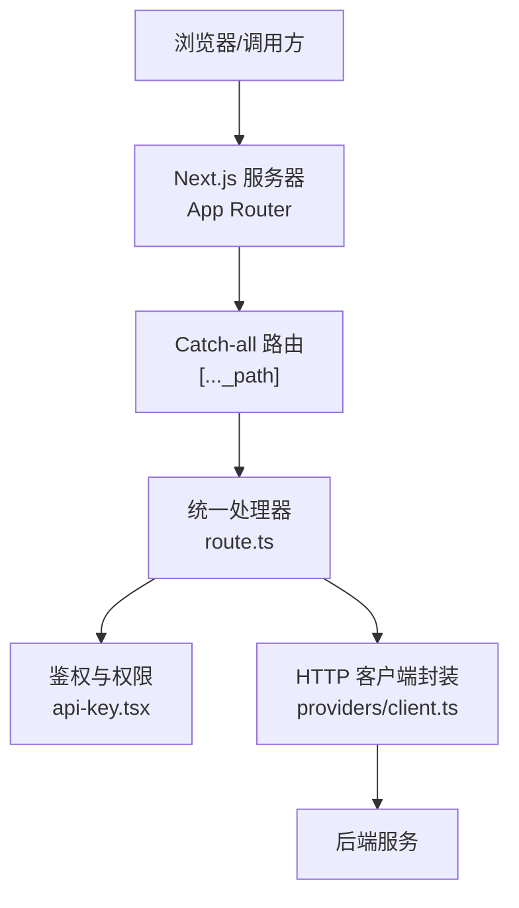
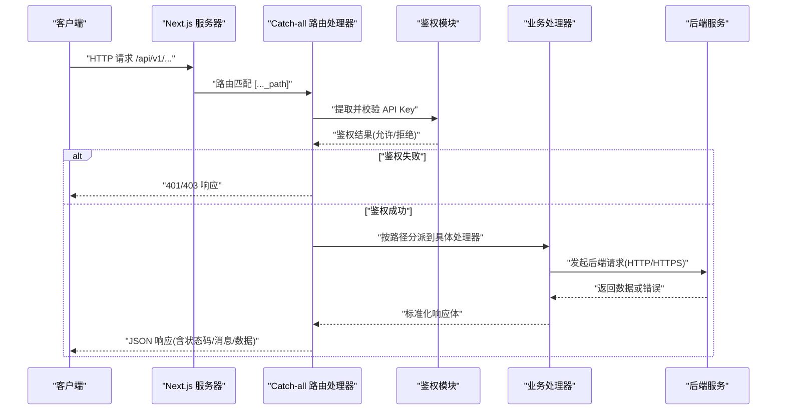
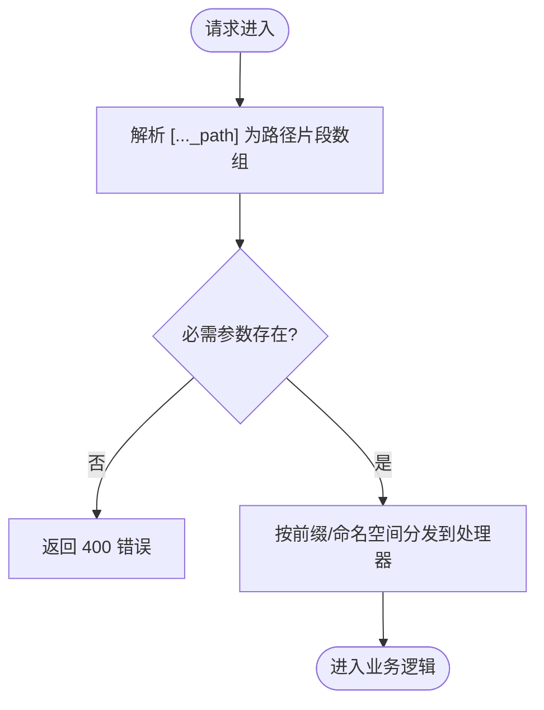
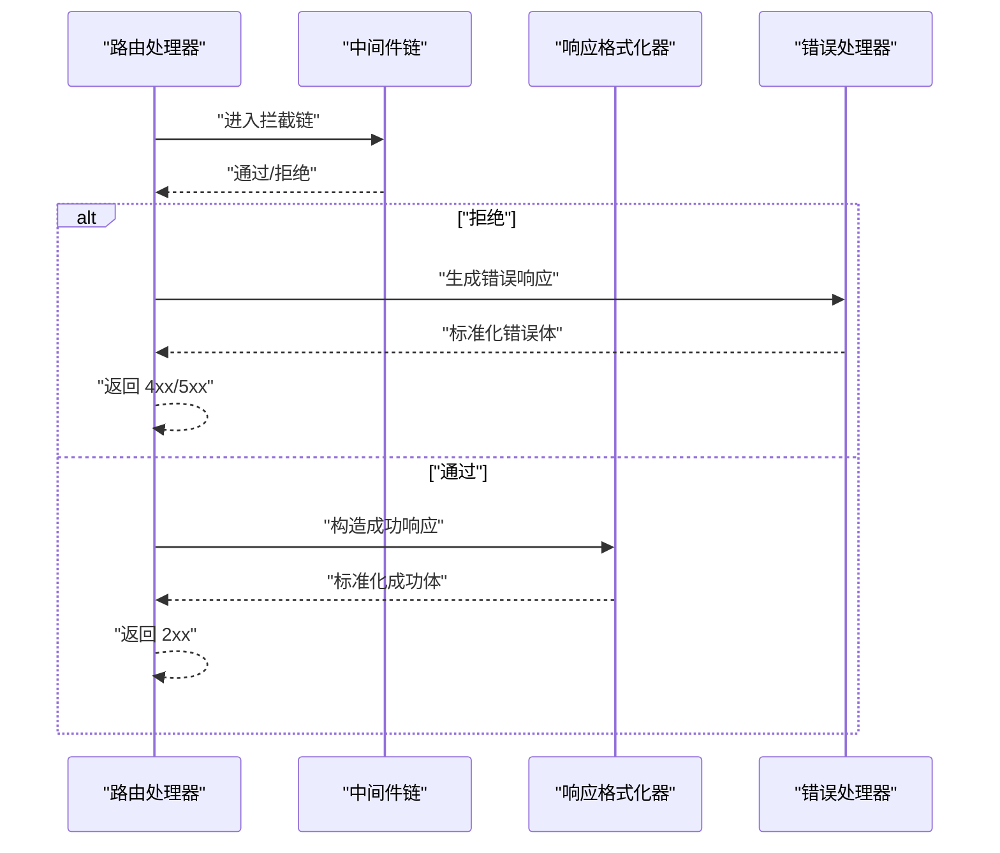
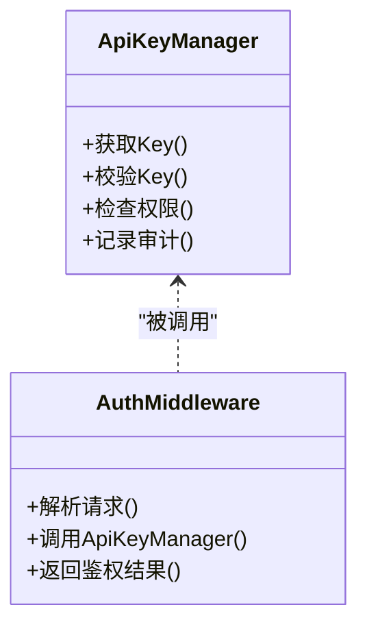
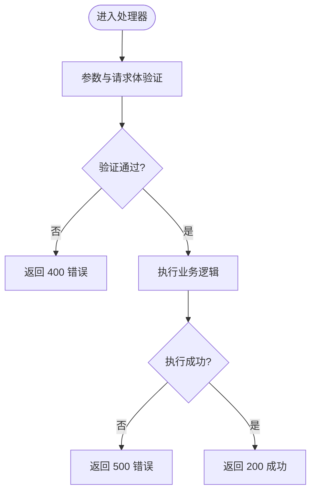
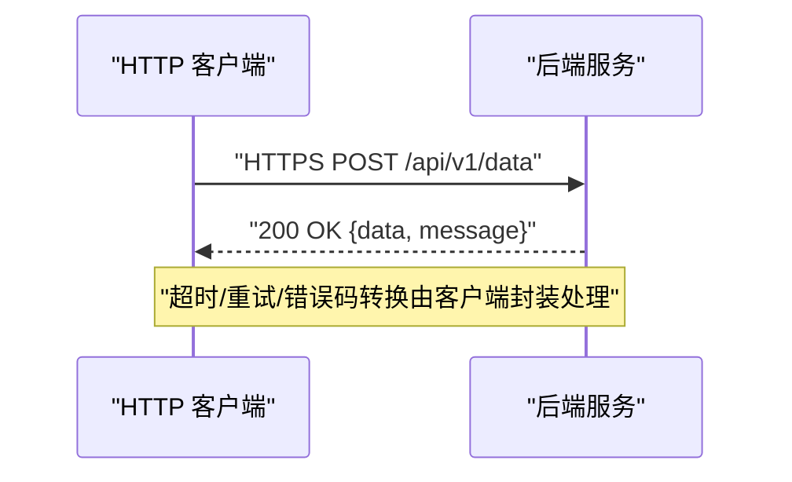
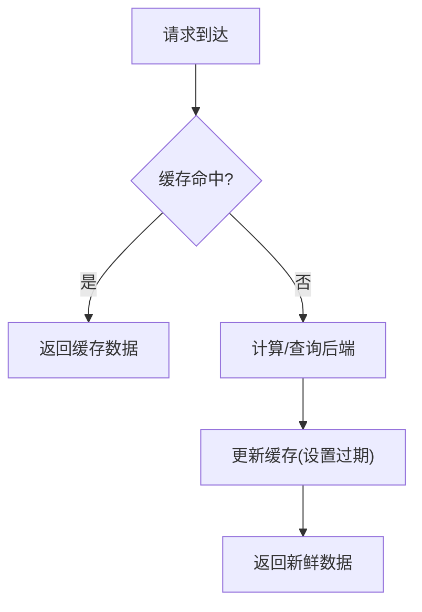
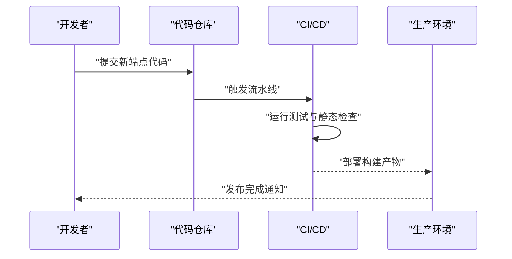
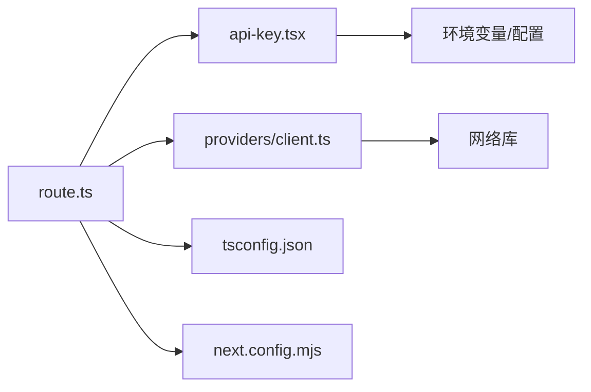

# API路由

<cite>
**本文引用的文件**   
- [apps/web/src/app/api/[..._path]/route.ts](file://apps/web/src/app/api/[..._path]/route.ts)
- [apps/web/src/lib/api-key.tsx](file://apps/web/src/lib/api-key.tsx)
- [apps/web/src/providers/client.ts](file://apps/web/src/providers/client.ts)
- [apps/web/next.config.mjs](file://apps/web/next.config.mjs)
- [apps/web/package.json](file://apps/web/package.json)
- [apps/web/tsconfig.json](file://apps/web/tsconfig.json)
</cite>

## 目录
1. [简介](#简介)
2. [项目结构](#项目结构)
3. [核心组件](#核心组件)
4. [架构总览](#架构总览)
5. [详细组件分析](#详细组件分析)
6. [依赖关系分析](#依赖关系分析)
7. [性能考虑](#性能考虑)
8. [故障排查指南](#故障排查指南)
9. [结论](#结论)
10. [附录](#附录) 

## 简介
本文件围绕 Next.js App Router 的动态 API 路由系统，系统性说明路径参数处理、请求拦截与响应格式化机制；阐述 API 密钥管理、身份认证与权限控制策略；解析请求校验、错误处理与日志记录实现方式；并给出与后端服务通信协议、数据格式与安全注意事项。同时覆盖 API 版本管理、缓存策略与性能优化，提供扩展指南（新端点开发、测试方法与部署配置），并以实际代码示例展示如何安全地实现 RESTful API 接口。

## 项目结构
本项目采用 Next.js App Router，API 入口位于 apps/web/src/app/api/[..._path]/route.ts，通过 catch-all 动态段将请求转发到统一处理器，再根据路径与上下文分派到具体业务逻辑。前端客户端封装在 providers/client.ts，API 密钥管理在 lib/api-key.tsx。Next.js 构建与运行配置在 next.config.mjs，包管理与脚本在 package.json，TypeScript 编译选项在 tsconfig.json。

**图示来源** 
- [apps/web/src/app/api/[..._path]/route.ts](file://apps/web/src/app/api/[..._path]/route.ts)
- [apps/web/src/lib/api-key.tsx](file://apps/web/src/lib/api-key.tsx)
- [apps/web/src/providers/client.ts](file://apps/web/src/providers/client.ts)

**章节来源**
- [apps/web/src/app/api/[..._path]/route.ts](file://apps/web/src/app/api/[..._path]/route.ts)
- [apps/web/src/lib/api-key.tsx](file://apps/web/src/lib/api-key.tsx)
- [apps/web/src/providers/client.ts](file://apps/web/src/providers/client.ts)
- [apps/web/next.config.mjs](file://apps/web/next.config.mjs)
- [apps/web/package.json](file://apps/web/package.json)
- [apps/web/tsconfig.json](file://apps/web/tsconfig.json)

## 核心组件
- 动态路由处理器：基于 catch-all 段捕获任意路径片段，解析为结构化路由信息，用于后续分发与鉴权。
- 鉴权与权限：集中管理 API Key 的获取、校验与权限映射，确保仅授权请求进入业务层。
- HTTP 客户端封装：统一发起对外部服务的请求，处理超时、重试、错误码转换与响应体序列化。
- 配置与类型：Next.js 构建配置与 TypeScript 类型约束保障运行时行为一致性与可维护性。

**章节来源**
- [apps/web/src/app/api/[..._path]/route.ts](file://apps/web/src/app/api/[..._path]/route.ts)
- [apps/web/src/lib/api-key.tsx](file://apps/web/src/lib/api-key.tsx)
- [apps/web/src/providers/client.ts](file://apps/web/src/providers/client.ts)
- [apps/web/next.config.mjs](file://apps/web/next.config.mjs)
- [apps/web/tsconfig.json](file://apps/web/tsconfig.json)

## 架构总览
下图展示了从客户端请求到后端响应的完整链路，包括动态路由解析、鉴权、请求转发与响应格式化。

**图示来源** 
- [apps/web/src/app/api/[..._path]/route.ts](file://apps/web/src/app/api/[..._path]/route.ts)
- [apps/web/src/lib/api-key.tsx](file://apps/web/src/lib/api-key.tsx)
- [apps/web/src/providers/client.ts](file://apps/web/src/providers/client.ts)

## 详细组件分析

### 动态路由与路径参数处理
- 使用 catch-all 段捕获多级路径，例如 /api/v1/resource/{id}，将路径片段解析为数组，便于统一分发。
- 支持查询参数与请求体解析，结合类型校验确保输入合法性。
- 对非法路径或缺少必要参数进行快速失败，返回明确的错误信息。

**图示来源** 
- [apps/web/src/app/api/[..._path]/route.ts](file://apps/web/src/app/api/[..._path]/route.ts)

**章节来源**
- [apps/web/src/app/api/[..._path]/route.ts](file://apps/web/src/app/api/[..._path]/route.ts)

### 请求拦截与响应格式化
- 请求拦截：在统一处理器中执行通用中间件逻辑，如日志记录、速率限制、跨域设置、请求体大小限制等。
- 响应格式化：统一包装成功与失败响应，包含标准字段（状态码、消息、数据体），保证前端消费一致性。
- 错误处理：捕获异常并转换为标准错误结构，避免泄露敏感信息。

**图示来源** 
- [apps/web/src/app/api/[..._path]/route.ts](file://apps/web/src/app/api/[..._path]/route.ts)

**章节来源**
- [apps/web/src/app/api/[..._path]/route.ts](file://apps/web/src/app/api/[..._path]/route.ts)

### API 密钥管理、身份认证与权限控制
- API Key 获取：从请求头或环境变量读取，支持多租户隔离。
- 校验流程：验证 Key 有效性、过期时间、权限范围与访问频率。
- 权限控制：基于角色或资源维度进行细粒度授权，未授权请求直接拒绝。

**图示来源** 
- [apps/web/src/lib/api-key.tsx](file://apps/web/src/lib/api-key.tsx)

**章节来源**
- [apps/web/src/lib/api-key.tsx](file://apps/web/src/lib/api-key.tsx)

### 请求验证、错误处理与日志记录
- 请求验证：对路径参数、查询参数与请求体进行类型与约束校验，失败即返回 400。
- 错误处理：统一捕获异常，区分业务错误与系统错误，输出可读的错误消息与调试信息。
- 日志记录：记录关键请求元数据（方法、路径、耗时、状态码）与错误堆栈，便于追踪问题。

**图示来源** 
- [apps/web/src/app/api/[..._path]/route.ts](file://apps/web/src/app/api/[..._path]/route.ts)

**章节来源**
- [apps/web/src/app/api/[..._path]/route.ts](file://apps/web/src/app/api/[..._path]/route.ts)

### 与后端服务的通信协议、数据格式与安全
- 协议：优先使用 HTTPS，必要时启用 TLS 证书校验与双向认证。
- 数据格式：统一 JSON 编码，定义清晰的请求/响应 Schema，避免歧义。
- 安全：启用请求签名或短期令牌，限制请求大小与速率，防止注入与重放攻击。

**图示来源** 
- [apps/web/src/providers/client.ts](file://apps/web/src/providers/client.ts)

**章节来源**
- [apps/web/src/providers/client.ts](file://apps/web/src/providers/client.ts)

### API 版本管理、缓存策略与性能优化
- 版本管理：通过路径前缀（如 /api/v1）进行版本隔离，兼容旧版与新版的平滑迁移。
- 缓存策略：对幂等 GET 请求启用 ETag/Last-Modified，服务端缓存热点数据，减少重复计算。
- 性能优化：连接池复用、异步非阻塞 I/O、分页与限流，降低延迟与资源占用。

**图示来源** 
- [apps/web/src/app/api/[..._path]/route.ts](file://apps/web/src/app/api/[..._path]/route.ts)
- [apps/web/src/providers/client.ts](file://apps/web/src/providers/client.ts)

**章节来源**
- [apps/web/src/app/api/[..._path]/route.ts](file://apps/web/src/app/api/[..._path]/route.ts)
- [apps/web/src/providers/client.ts](file://apps/web/src/providers/client.ts)

### 扩展指南：新端点开发、测试方法与部署配置
- 新端点开发：在 catch-all 路由下新增路径分支，定义处理器函数，注册鉴权与校验逻辑。
- 测试方法：编写单元测试覆盖正常路径与异常分支，集成测试模拟后端响应与鉴权场景。
- 部署配置：在 Next.js 配置中设置环境变量、端口与域名，启用生产模式与日志级别。

**图示来源** 
- [apps/web/package.json](file://apps/web/package.json)
- [apps/web/next.config.mjs](file://apps/web/next.config.mjs)

**章节来源**
- [apps/web/package.json](file://apps/web/package.json)
- [apps/web/next.config.mjs](file://apps/web/next.config.mjs)

### 安全实现 RESTful API 的代码示例要点
- 使用 HTTPS 与强密码学库保护传输与存储。
- 对所有输入进行严格校验与白名单过滤。
- 最小权限原则分配 API Key 与角色。
- 统一错误响应，避免泄露内部细节。
- 启用速率限制与请求大小限制。

**章节来源**
- [apps/web/src/lib/api-key.tsx](file://apps/web/src/lib/api-key.tsx)
- [apps/web/src/app/api/[..._path]/route.ts](file://apps/web/src/app/api/[..._path]/route.ts)
- [apps/web/src/providers/client.ts](file://apps/web/src/providers/client.ts)

## 依赖关系分析
- 路由处理器依赖鉴权模块与 HTTP 客户端。
- 鉴权模块依赖配置与环境变量。
- HTTP 客户端依赖网络库与错误处理工具。
- 构建与类型依赖 Next.js 与 TypeScript。

**图示来源** 
- [apps/web/src/app/api/[..._path]/route.ts](file://apps/web/src/app/api/[..._path]/route.ts)
- [apps/web/src/lib/api-key.tsx](file://apps/web/src/lib/api-key.tsx)
- [apps/web/src/providers/client.ts](file://apps/web/src/providers/client.ts)
- [apps/web/tsconfig.json](file://apps/web/tsconfig.json)
- [apps/web/next.config.mjs](file://apps/web/next.config.mjs)

**章节来源**
- [apps/web/src/app/api/[..._path]/route.ts](file://apps/web/src/app/api/[..._path]/route.ts)
- [apps/web/src/lib/api-key.tsx](file://apps/web/src/lib/api-key.tsx)
- [apps/web/src/providers/client.ts](file://apps/web/src/providers/client.ts)
- [apps/web/tsconfig.json](file://apps/web/tsconfig.json)
- [apps/web/next.config.mjs](file://apps/web/next.config.mjs)

## 性能考虑
- 减少不必要的序列化与反序列化，尽量使用原生类型。
- 合理设置超时与重试策略，避免雪崩效应。
- 使用连接池与并发控制，提升吞吐能力。
- 对热点数据进行缓存与预取，降低后端压力。

[本节为通用指导，不直接分析具体文件]

## 故障排查指南
- 常见问题：鉴权失败、参数校验错误、后端超时、响应格式不一致。
- 排查步骤：查看日志中的状态码与错误消息，复现请求并检查参数与头部，定位中间件与处理器断点。
- 修复建议：修正校验规则、调整超时阈值、统一响应结构、增加更详细的错误上下文。

**章节来源**
- [apps/web/src/app/api/[..._path]/route.ts](file://apps/web/src/app/api/[..._path]/route.ts)
- [apps/web/src/lib/api-key.tsx](file://apps/web/src/lib/api-key.tsx)
- [apps/web/src/providers/client.ts](file://apps/web/src/providers/client.ts)

## 结论
本项目的 API 路由系统以 Next.js App Router 为基础，通过 catch-all 动态路由实现灵活的路径分发，配合统一的鉴权、校验、错误处理与响应格式化，形成高内聚、低耦合的 API 网关层。借助标准化的客户端封装与配置管理，能够安全、高效地与后端服务通信，并为版本管理、缓存与性能优化提供良好基础。遵循本文档的扩展指南与实践建议，可快速、安全地开发与部署新的 RESTful API 端点。

[本节为总结性内容，不直接分析具体文件]

## 附录
- 术语表：Catch-all 路由、API Key、鉴权、权限控制、响应格式化、速率限制、ETag、Last-Modified。
- 参考链接：Next.js 文档、TypeScript 手册、HTTPS 最佳实践。

[本节为补充信息，不直接分析具体文件]