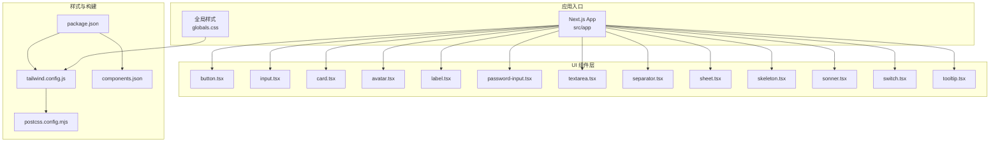
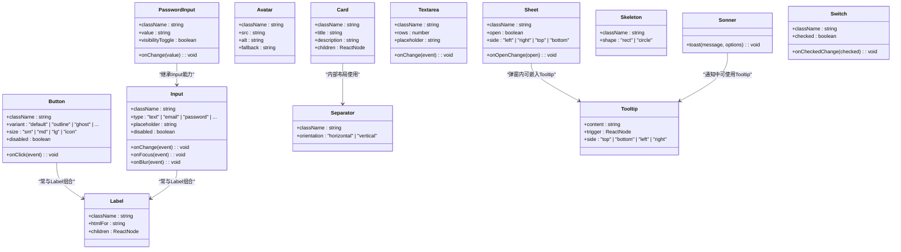
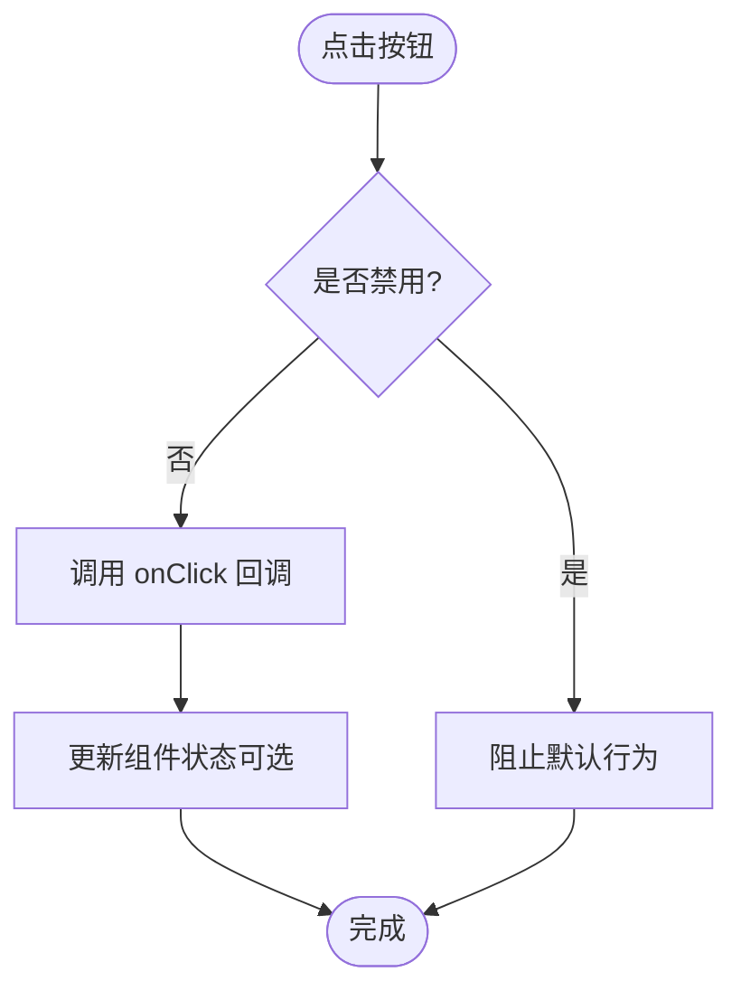
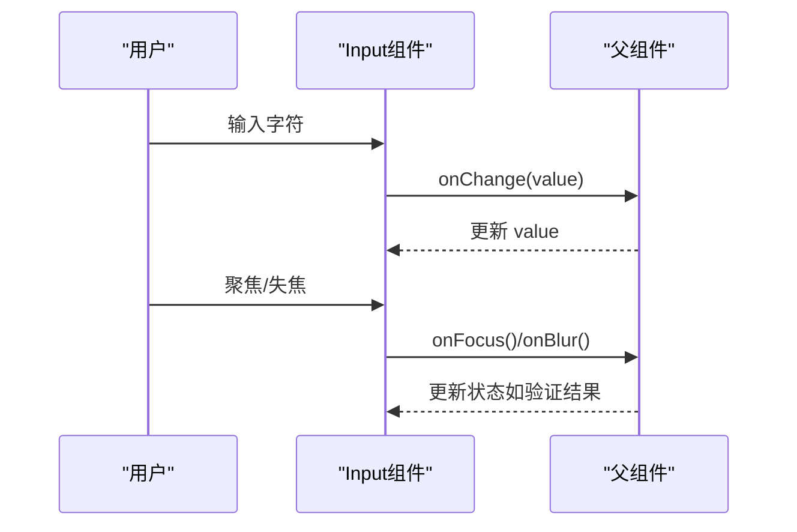
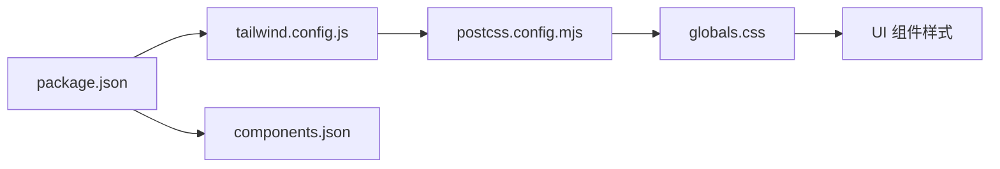

# UI组件库

<cite>
**本文引用的文件**   
- [button.tsx](file://apps/web/src/components/ui/button.tsx)
- [input.tsx](file://apps/web/src/components/ui/input.tsx)
- [card.tsx](file://apps/web/src/components/ui/card.tsx)
- [avatar.tsx](file://apps/web/src/components/ui/avatar.tsx)
- [label.tsx](file://apps/web/src/components/ui/label.tsx)
- [password-input.tsx](file://apps/web/src/components/ui/password-input.tsx)
- [textarea.tsx](file://apps/web/src/components/ui/textarea.tsx)
- [separator.tsx](file://apps/web/src/components/ui/separator.tsx)
- [sheet.tsx](file://apps/web/src/components/ui/sheet.tsx)
- [skeleton.tsx](file://apps/web/src/components/ui/skeleton.tsx)
- [sonner.tsx](file://apps/web/src/components/ui/sonner.tsx)
- [switch.tsx](file://apps/web/src/components/ui/switch.tsx)
- [tooltip.tsx](file://apps/web/src/components/ui/tooltip.tsx)
- [tailwind.config.js](file://apps/web/tailwind.config.js)
- [postcss.config.mjs](file://apps/web/postcss.config.mjs)
- [components.json](file://apps/web/components.json)
- [package.json](file://apps/web/package.json)
- [globals.css](file://apps/web/src/app/globals.css)
</cite>

## 目录
1. [简介](#简介)
2. [项目结构](#项目结构)
3. [核心组件](#核心组件)
4. [架构总览](#架构总览)
5. [详细组件分析](#详细组件分析)
6. [依赖关系分析](#依赖关系分析)
7. [性能考量](#性能考量)
8. [故障排查指南](#故障排查指南)
9. [结论](#结论)
10. [附录](#附录)

## 简介
本文件面向基于 shadcn/ui 的 UI 组件库，系统化介绍按钮、输入框、卡片、头像等基础组件的使用方法、Props 接口、样式定制与主题支持。文档同时覆盖响应式设计、无障碍访问（a11y）与跨浏览器兼容性策略，并给出 Tailwind CSS 配置与自定义样式覆盖方法。此外，提供组件组合模式、复用策略、性能优化技巧，以及新组件开发完整指南（设计原则、测试策略、文档编写），并通过实际代码示例路径展示如何在项目中正确使用和扩展组件。

## 项目结构
本项目采用 Next.js + shadcn/ui 的前端工程化方案，UI 组件集中位于 apps/web/src/components/ui 目录，样式由 Tailwind CSS 驱动，并通过 postcss 与全局样式进行增强。shadcn/ui 通过 components.json 管理组件元数据与生成规则，package.json 声明依赖与脚本。

图表来源
- [tailwind.config.js](file://apps/web/tailwind.config.js)
- [postcss.config.mjs](file://apps/web/postcss.config.mjs)
- [components.json](file://apps/web/components.json)
- [package.json](file://apps/web/package.json)
- [globals.css](file://apps/web/src/app/globals.css)

章节来源
- [tailwind.config.js](file://apps/web/tailwind.config.js)
- [postcss.config.mjs](file://apps/web/postcss.config.mjs)
- [components.json](file://apps/web/components.json)
- [package.json](file://apps/web/package.json)
- [globals.css](file://apps/web/src/app/globals.css)

## 核心组件
本节聚焦 shadcn/ui 的基础组件：按钮、输入框、卡片、头像、标签、密码输入、文本域、分割线、抽屉、骨架屏、提示气泡、开关、工具提示等。每个组件均遵循以下通用约定：
- Props 接口：通常包含 className、id、ref、事件回调（如 onClick、onChange）、状态控制（如 disabled、checked）等。
- 样式定制：通过 Tailwind 类名、CSS 变量、主题色与尺寸变体进行覆盖。
- 无障碍：内置语义化标签与 ARIA 属性，确保键盘导航与屏幕阅读器友好。
- 响应式：使用 Tailwind 断点与容器查询实现多端适配。

章节来源
- [button.tsx](file://apps/web/src/components/ui/button.tsx)
- [input.tsx](file://apps/web/src/components/ui/input.tsx)
- [card.tsx](file://apps/web/src/components/ui/card.tsx)
- [avatar.tsx](file://apps/web/src/components/ui/avatar.tsx)
- [label.tsx](file://apps/web/src/components/ui/label.tsx)
- [password-input.tsx](file://apps/web/src/components/ui/password-input.tsx)
- [textarea.tsx](file://apps/web/src/components/ui/textarea.tsx)
- [separator.tsx](file://apps/web/src/components/ui/separator.tsx)
- [sheet.tsx](file://apps/web/src/components/ui/sheet.tsx)
- [skeleton.tsx](file://apps/web/src/components/ui/skeleton.tsx)
- [sonner.tsx](file://apps/web/src/components/ui/sonner.tsx)
- [switch.tsx](file://apps/web/src/components/ui/switch.tsx)
- [tooltip.tsx](file://apps/web/src/components/ui/tooltip.tsx)

## 架构总览
shadcn/ui 组件以“原子化”方式组织，每个组件独立可复用，样式由 Tailwind 原子类驱动，主题通过 CSS 变量与 Tailwind 配置统一管理。组件之间通过组合模式形成更复杂的业务组件，避免深层嵌套与重复逻辑。

图表来源
- [button.tsx](file://apps/web/src/components/ui/button.tsx)
- [input.tsx](file://apps/web/src/components/ui/input.tsx)
- [card.tsx](file://apps/web/src/components/ui/card.tsx)
- [avatar.tsx](file://apps/web/src/components/ui/avatar.tsx)
- [label.tsx](file://apps/web/src/components/ui/label.tsx)
- [password-input.tsx](file://apps/web/src/components/ui/password-input.tsx)
- [textarea.tsx](file://apps/web/src/components/ui/textarea.tsx)
- [separator.tsx](file://apps/web/src/components/ui/separator.tsx)
- [sheet.tsx](file://apps/web/src/components/ui/sheet.tsx)
- [skeleton.tsx](file://apps/web/src/components/ui/skeleton.tsx)
- [sonner.tsx](file://apps/web/src/components/ui/sonner.tsx)
- [switch.tsx](file://apps/web/src/components/ui/switch.tsx)
- [tooltip.tsx](file://apps/web/src/components/ui/tooltip.tsx)

## 详细组件分析

### 按钮 Button
- 用途：触发操作或提交表单，支持多种变体与尺寸。
- 关键 Props：className、variant、size、disabled、onClick、ref、id。
- 样式定制：通过 variant 与 size 切换外观；使用 Tailwind 类名覆盖颜色、圆角、阴影等；可通过 CSS 变量统一主题。
- 响应式：在移动端与桌面端通过 Tailwind 断点调整尺寸与间距。
- 无障碍：语义化 button 标签，禁用态 aria-disabled，焦点可见性良好。
- 组合模式：与图标、加载指示器组合，形成复合按钮。

图表来源
- [button.tsx](file://apps/web/src/components/ui/button.tsx)

章节来源
- [button.tsx](file://apps/web/src/components/ui/button.tsx)

### 输入框 Input
- 用途：接收用户文本输入，支持多种类型与校验。
- 关键 Props：type、placeholder、value、onChange、onFocus、onBlur、disabled、className、ref、id。
- 样式定制：Tailwind 类名覆盖边框、背景、字体；聚焦态高亮；错误态红色边框。
- 响应式：宽度自适应，移动端增大触控区域。
- 无障碍：关联 label htmlFor，aria-invalid 用于错误提示，键盘可达。
- 组合模式：与 Label、提示信息、图标组合，形成完整表单控件。

图表来源
- [input.tsx](file://apps/web/src/components/ui/input.tsx)
- [label.tsx](file://apps/web/src/components/ui/label.tsx)

章节来源
- [input.tsx](file://apps/web/src/components/ui/input.tsx)
- [label.tsx](file://apps/web/src/components/ui/label.tsx)

### 卡片 Card
- 用途：内容区块容器，常用于信息展示与操作入口。
- 关键 Props：className、title、description、children、header/footer 插槽。
- 样式定制：圆角、阴影、内边距、背景色；可通过 Tailwind 类名覆盖。
- 响应式：在不同断点下调整内边距与排版。
- 无障碍：语义化 section/article，标题层级合理。
- 组合模式：与按钮、列表、分隔线组合，形成复杂页面模块。

章节来源
- [card.tsx](file://apps/web/src/components/ui/card.tsx)
- [separator.tsx](file://apps/web/src/components/ui/separator.tsx)

### 头像 Avatar
- 用途：展示用户或实体头像，支持占位符与错误回退。
- 关键 Props：src、alt、fallback、className、size。
- 样式定制：圆形裁剪、边框、尺寸变体；图片加载失败时显示 fallback。
- 响应式：移动端缩小尺寸，保持可读性。
- 无障碍：alt 描述图像含义，符合屏幕阅读器规范。

章节来源
- [avatar.tsx](file://apps/web/src/components/ui/avatar.tsx)

### 标签 Label
- 用途：为表单控件提供说明文字，提升可访问性。
- 关键 Props：htmlFor、className、children。
- 样式定制：字体大小、颜色、间距；可与输入框对齐。
- 无障碍：关联 input id，点击可聚焦对应控件。

章节来源
- [label.tsx](file://apps/web/src/components/ui/label.tsx)

### 密码输入 PasswordInput
- 用途：安全输入密码，支持可见性切换。
- 关键 Props：value、onChange、visibilityToggle、className、ref、id。
- 样式定制：与 Input 一致，增加眼睛图标切换。
- 无障碍：aria-pressed 表示可见状态，键盘操作友好。

章节来源
- [password-input.tsx](file://apps/web/src/components/ui/password-input.tsx)

### 文本域 Textarea
- 用途：多行文本输入，适合评论、描述等场景。
- 关键 Props：rows、placeholder、value、onChange、className、ref、id。
- 样式定制：高度自适应、边框、背景；错误态提示。
- 无障碍：关联 label，支持键盘导航。

章节来源
- [textarea.tsx](file://apps/web/src/components/ui/textarea.tsx)

### 分割线 Separator
- 用途：视觉分隔内容区块，提升层次结构。
- 关键 Props：orientation、className。
- 样式定制：粗细、颜色、间距；水平/垂直方向。
- 无障碍：role="separator"，语义明确。

章节来源
- [separator.tsx](file://apps/web/src/components/ui/separator.tsx)

### 抽屉 Sheet
- 用途：侧边面板，用于设置、详情展示或操作面板。
- 关键 Props：open、onOpenChange、side、className、children。
- 样式定制：遮罩透明度、动画过渡、定位偏移。
- 无障碍：焦点陷阱、Esc 关闭、屏幕阅读器提示。

章节来源
- [sheet.tsx](file://apps/web/src/components/ui/sheet.tsx)

### 骨架屏 Skeleton
- 用途：加载占位，提升用户体验。
- 关键 Props：shape、className、width、height。
- 样式定制：动画闪烁、圆角、背景色。
- 无障碍：aria-busy="true"，告知加载状态。

章节来源
- [skeleton.tsx](file://apps/web/src/components/ui/skeleton.tsx)

### 提示 Sonner
- 用途：轻量级通知与消息提示。
- 关键 Props：toast(message, options)、position、duration。
- 样式定制：主题色、位置、动画。
- 无障碍：自动朗读通知内容，支持键盘关闭。

章节来源
- [sonner.tsx](file://apps/web/src/components/ui/sonner.tsx)

### 开关 Switch
- 用途：二元选择开关，如开启/关闭功能。
- 关键 Props：checked、onCheckedChange、className、disabled。
- 样式定制：轨道颜色、滑块大小、动画。
- 无障碍：aria-checked、键盘 Tab/Space 操作。

章节来源
- [switch.tsx](file://apps/web/src/components/ui/switch.tsx)

### 工具提示 Tooltip
- 用途：悬浮提示，解释按钮或链接作用。
- 关键 Props：content、trigger、side、delayDuration。
- 样式定制：背景色、箭头、圆角、阴影。
- 无障碍：aria-describedby，延迟显示避免干扰。

章节来源
- [tooltip.tsx](file://apps/web/src/components/ui/tooltip.tsx)

## 依赖关系分析
组件依赖 Tailwind CSS 进行样式生成，通过 postcss 处理 CSS 变量与插件。components.json 管理组件元数据与生成规则，package.json 声明依赖与脚本。

图表来源
- [package.json](file://apps/web/package.json)
- [tailwind.config.js](file://apps/web/tailwind.config.js)
- [postcss.config.mjs](file://apps/web/postcss.config.mjs)
- [components.json](file://apps/web/components.json)
- [globals.css](file://apps/web/src/app/globals.css)

章节来源
- [package.json](file://apps/web/package.json)
- [tailwind.config.js](file://apps/web/tailwind.config.js)
- [postcss.config.mjs](file://apps/web/postcss.config.mjs)
- [components.json](file://apps/web/components.json)
- [globals.css](file://apps/web/src/app/globals.css)

## 性能考量
- 组件懒加载：对重型组件（如 Sheet、Tooltip）按需引入，减少首屏体积。
- 样式优化：使用 Tailwind 原子类，避免重复样式；通过 CSS 变量统一主题，减少重绘。
- 渲染优化：避免不必要的 re-render，使用 memo 与 useCallback 优化回调。
- 图片优化：Avatar 使用 srcset 与懒加载，错误回退快速显示。
- 交互反馈：Skeleton 与 Sonner 提升感知性能，减少用户等待焦虑。

[本节为通用指导，不直接分析具体文件]

## 故障排查指南
- 样式未生效：检查 Tailwind 配置是否正确，确认 className 未被覆盖；查看 postcss 插件链。
- 无障碍问题：确保 label htmlFor 与 input id 匹配；检查 aria-* 属性是否正确设置。
- 响应式异常：确认断点命名与媒体查询顺序；检查容器宽度与父元素影响。
- 组件交互失效：检查事件绑定与状态更新逻辑；确认受控与非受控模式一致性。
- 主题不一致：核对 CSS 变量定义与 Tailwind 主题映射；确保全局样式优先级正确。

章节来源
- [tailwind.config.js](file://apps/web/tailwind.config.js)
- [postcss.config.mjs](file://apps/web/postcss.config.mjs)
- [globals.css](file://apps/web/src/app/globals.css)

## 结论
本 UI 组件库基于 shadcn/ui 与 Tailwind CSS，提供了丰富、可定制、无障碍友好的基础组件。通过组合模式与主题系统，开发者可以快速构建一致的界面体验。建议遵循本文档的设计原则与最佳实践，持续优化组件质量与性能，确保跨平台兼容性与可维护性。

[本节为总结，不直接分析具体文件]

## 附录

### Tailwind CSS 配置与自定义样式覆盖
- 主题变量：在 globals.css 中定义 CSS 变量，供 Tailwind 使用。
- 配置扩展：在 tailwind.config.js 中扩展颜色、字体、间距、断点。
- PostCSS 插件：启用 autoprefixer、cssnano 等优化样式输出。
- 覆盖策略：优先使用 Tailwind 类名，必要时通过 CSS 变量与 !important 谨慎覆盖。

章节来源
- [tailwind.config.js](file://apps/web/tailwind.config.js)
- [postcss.config.mjs](file://apps/web/postcss.config.mjs)
- [globals.css](file://apps/web/src/app/globals.css)

### 组件组合模式与复用策略
- 组合原则：小粒度组件组合成大组件，避免重复逻辑。
- 插槽机制：通过 children 与具名插槽扩展组件功能。
- 状态提升：将共享状态提升到父组件，保持单一数据源。
- 事件委托：合理使用事件冒泡与捕获，减少监听器数量。

[本节为概念性内容，不直接分析具体文件]

### 新组件开发完整指南
- 设计原则：语义化、可访问、可组合、可主题化。
- 实现步骤：定义 Props 接口、实现核心逻辑、添加样式与主题、编写测试用例。
- 测试策略：单元测试（Jest/Vitest）、快照测试、交互测试（Playwright/Cypress）。
- 文档编写：API 文档、使用示例、最佳实践、常见问题。

[本节为概念性内容，不直接分析具体文件]

### 实际代码示例路径
- 按钮使用示例：参考 [button.tsx](file://apps/web/src/components/ui/button.tsx)
- 输入框与标签组合：参考 [input.tsx](file://apps/web/src/components/ui/input.tsx)、[label.tsx](file://apps/web/src/components/ui/label.tsx)
- 卡片布局示例：参考 [card.tsx](file://apps/web/src/components/ui/card.tsx)
- 头像与占位符：参考 [avatar.tsx](file://apps/web/src/components/ui/avatar.tsx)
- 密码输入与可见性切换：参考 [password-input.tsx](file://apps/web/src/components/ui/password-input.tsx)
- 文本域与多行输入：参考 [textarea.tsx](file://apps/web/src/components/ui/textarea.tsx)
- 分割线与布局：参考 [separator.tsx](file://apps/web/src/components/ui/separator.tsx)
- 抽屉与侧边面板：参考 [sheet.tsx](file://apps/web/src/components/ui/sheet.tsx)
- 骨架屏加载占位：参考 [skeleton.tsx](file://apps/web/src/components/ui/skeleton.tsx)
- 通知与提示：参考 [sonner.tsx](file://apps/web/src/components/ui/sonner.tsx)
- 开关与二元选择：参考 [switch.tsx](file://apps/web/src/components/ui/switch.tsx)
- 工具提示与悬浮说明：参考 [tooltip.tsx](file://apps/web/src/components/ui/tooltip.tsx)