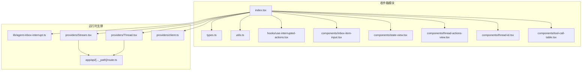
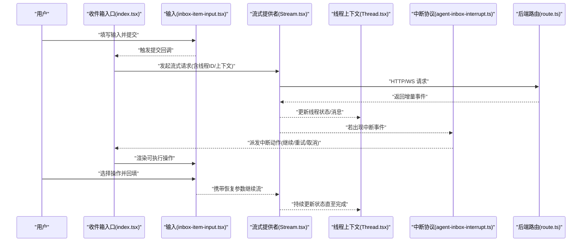
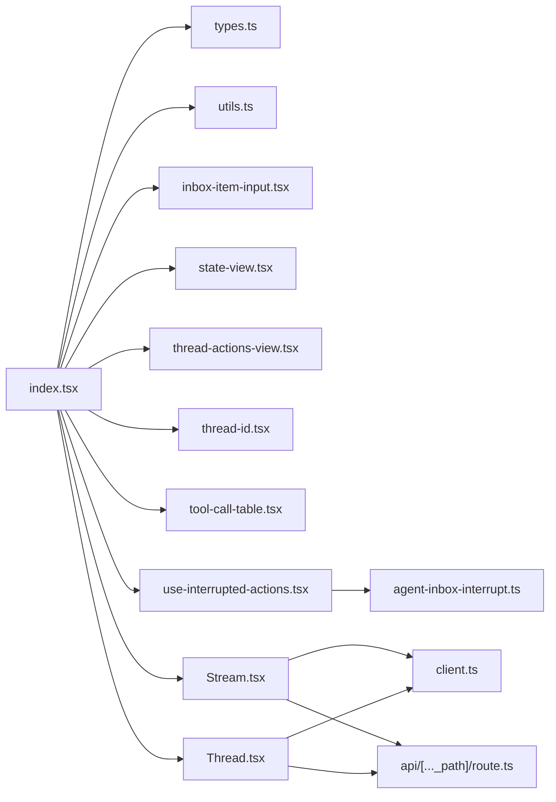

# 代理收件箱组件

<cite>
**本文引用的文件**   
- [apps/web/src/components/thread/agent-inbox/index.tsx](file://apps/web/src/components/thread/agent-inbox/index.tsx)
- [apps/web/src/components/thread/agent-inbox/types.ts](file://apps/web/src/components/thread/agent-inbox/types.ts)
- [apps/web/src/components/thread/agent-inbox/utils.ts](file://apps/web/src/components/thread/agent-inbox/utils.ts)
- [apps/web/src/components/thread/agent-inbox/hooks/use-interrupted-actions.tsx](file://apps/web/src/components/thread/agent-inbox/hooks/use-interrupted-actions.tsx)
- [apps/web/src/components/thread/agent-inbox/components/inbox-item-input.tsx](file://apps/web/src/components/thread/agent-inbox/components/inbox-item-input.tsx)
- [apps/web/src/components/thread/agent-inbox/components/state-view.tsx](file://apps/web/src/components/thread/agent-inbox/components/state-view.tsx)
- [apps/web/src/components/thread/agent-inbox/components/thread-actions-view.tsx](file://apps/web/src/components/thread/agent-inbox/components/thread-actions-view.tsx)
- [apps/web/src/components/thread/agent-inbox/components/thread-id.tsx](file://apps/web/src/components/thread/agent-inbox/components/thread-id.tsx)
- [apps/web/src/components/thread/agent-inbox/components/tool-call-table.tsx](file://apps/web/src/components/thread/agent-inbox/components/tool-call-table.tsx)
- [apps/web/src/lib/agent-inbox-interrupt.ts](file://apps/web/src/lib/agent-inbox-interrupt.ts)
- [apps/web/src/providers/Stream.tsx](file://apps/web/src/providers/Stream.tsx)
- [apps/web/src/providers/Thread.tsx](file://apps/web/src/providers/Thread.tsx)
- [apps/web/src/providers/client.ts](file://apps/web/src/providers/client.ts)
- [apps/web/src/app/api/[..._path]/route.ts](file://apps/web/src/app/api/[..._path]/route.ts)
</cite>

## 目录
1. [简介](#简介)
2. [项目结构](#项目结构)
3. [核心组件](#核心组件)
4. [架构总览](#架构总览)
5. [详细组件分析](#详细组件分析)
6. [依赖关系分析](#依赖关系分析)
7. [性能考虑](#性能考虑)
8. [故障排查指南](#故障排查指南)
9. [结论](#结论)
10. [附录：配置与扩展](#附录配置与扩展)

## 简介
本文件面向“代理收件箱”（Agent Inbox）组件，系统性说明其输入、状态视图、线程操作视图等子组件的用法与实现。重点覆盖：
- 业务逻辑与状态管理：中断恢复、工具调用展示、线程ID管理、消息输入与提交
- 数据流转：前端到后端API、流式事件处理、中断信号解析
- Agent系统集成：中断协议、消息传递机制、事件处理流程
- 配置选项与参数：组件属性、默认值、扩展点
- 错误处理与异常恢复：网络异常、中断恢复失败、UI降级
- 实际工作流示例：如何组合组件完成一次完整的代理交互

## 项目结构
代理收件箱位于 Web 应用的前端代码中，采用按功能域组织的方式，将收件箱相关组件、Hook、类型定义与工具函数集中在同一目录下，便于复用与维护。

图表来源
- [apps/web/src/components/thread/agent-inbox/index.tsx](file://apps/web/src/components/thread/agent-inbox/index.tsx)
- [apps/web/src/components/thread/agent-inbox/types.ts](file://apps/web/src/components/thread/agent-inbox/types.ts)
- [apps/web/src/components/thread/agent-inbox/utils.ts](file://apps/web/src/components/thread/agent-inbox/utils.ts)
- [apps/web/src/components/thread/agent-inbox/hooks/use-interrupted-actions.tsx](file://apps/web/src/components/thread/agent-inbox/hooks/use-interrupted-actions.tsx)
- [apps/web/src/components/thread/agent-inbox/components/inbox-item-input.tsx](file://apps/web/src/components/thread/agent-inbox/components/inbox-item-input.tsx)
- [apps/web/src/components/thread/agent-inbox/components/state-view.tsx](file://apps/web/src/components/thread/agent-inbox/components/state-view.tsx)
- [apps/web/src/components/thread/agent-inbox/components/thread-actions-view.tsx](file://apps/web/src/components/thread/agent-inbox/components/thread-actions-view.tsx)
- [apps/web/src/components/thread/agent-inbox/components/thread-id.tsx](file://apps/web/src/components/thread/agent-inbox/components/thread-id.tsx)
- [apps/web/src/components/thread/agent-inbox/components/tool-call-table.tsx](file://apps/web/src/components/thread/agent-inbox/components/tool-call-table.tsx)
- [apps/web/src/lib/agent-inbox-interrupt.ts](file://apps/web/src/lib/agent-inbox-interrupt.ts)
- [apps/web/src/providers/Stream.tsx](file://apps/web/src/providers/Stream.tsx)
- [apps/web/src/providers/Thread.tsx](file://apps/web/src/providers/Thread.tsx)
- [apps/web/src/providers/client.ts](file://apps/web/src/providers/client.ts)
- [apps/web/src/app/api/[..._path]/route.ts](file://apps/web/src/app/api/[..._path]/route.ts)

章节来源
- [apps/web/src/components/thread/agent-inbox/index.tsx](file://apps/web/src/components/thread/agent-inbox/index.tsx)
- [apps/web/src/components/thread/agent-inbox/types.ts](file://apps/web/src/components/thread/agent-inbox/types.ts)
- [apps/web/src/components/thread/agent-inbox/utils.ts](file://apps/web/src/components/thread/agent-inbox/utils.ts)

## 核心组件
- 入口组件（index.tsx）：聚合收件箱输入、状态视图、线程操作视图，协调中断恢复与事件流。
- 输入组件（inbox-item-input.tsx）：用户输入与提交，支持文本与附件（如有），触发后续流式请求。
- 状态视图（state-view.tsx）：渲染当前线程的状态快照，便于调试与审计。
- 线程操作视图（thread-actions-view.tsx）：展示可执行的操作（如继续、重试、取消），响应中断恢复。
- 线程ID组件（thread-id.tsx）：显示并可选复制当前线程ID，便于追踪。
- 工具调用表（tool-call-table.tsx）：以表格形式展示工具调用历史与结果。
- Hook（use-interrupted-actions.tsx）：封装中断动作的订阅与派发，统一处理中断恢复流程。
- 类型与工具（types.ts, utils.ts）：定义数据结构、校验与转换工具。

章节来源
- [apps/web/src/components/thread/agent-inbox/index.tsx](file://apps/web/src/components/thread/agent-inbox/index.tsx)
- [apps/web/src/components/thread/agent-inbox/components/inbox-item-input.tsx](file://apps/web/src/components/thread/agent-inbox/components/inbox-item-input.tsx)
- [apps/web/src/components/thread/agent-inbox/components/state-view.tsx](file://apps/web/src/components/thread/agent-inbox/components/state-view.tsx)
- [apps/web/src/components/thread/agent-inbox/components/thread-actions-view.tsx](file://apps/web/src/components/thread/agent-inbox/components/thread-actions-view.tsx)
- [apps/web/src/components/thread/agent-inbox/components/thread-id.tsx](file://apps/web/src/components/thread/agent-inbox/components/thread-id.tsx)
- [apps/web/src/components/thread/agent-inbox/components/tool-call-table.tsx](file://apps/web/src/components/thread/agent-inbox/components/tool-call-table.tsx)
- [apps/web/src/components/thread/agent-inbox/hooks/use-interrupted-actions.tsx](file://apps/web/src/components/thread/agent-inbox/hooks/use-interrupted-actions.tsx)
- [apps/web/src/components/thread/agent-inbox/types.ts](file://apps/web/src/components/thread/agent-inbox/types.ts)
- [apps/web/src/components/thread/agent-inbox/utils.ts](file://apps/web/src/components/thread/agent-inbox/utils.ts)

## 架构总览
收件箱组件通过 Provider 层获取线程上下文与流式事件，结合中断协议与后端 API 路由，形成“输入—流式处理—中断恢复—状态更新”的闭环。

图表来源
- [apps/web/src/components/thread/agent-inbox/index.tsx](file://apps/web/src/components/thread/agent-inbox/index.tsx)
- [apps/web/src/components/thread/agent-inbox/components/inbox-item-input.tsx](file://apps/web/src/components/thread/agent-inbox/components/inbox-item-input.tsx)
- [apps/web/src/providers/Stream.tsx](file://apps/web/src/providers/Stream.tsx)
- [apps/web/src/providers/Thread.tsx](file://apps/web/src/providers/Thread.tsx)
- [apps/web/src/lib/agent-inbox-interrupt.ts](file://apps/web/src/lib/agent-inbox-interrupt.ts)
- [apps/web/src/app/api/[..._path]/route.ts](file://apps/web/src/app/api/[..._path]/route.ts)

## 详细组件分析

### 入口组件（index.tsx）
职责
- 聚合输入、状态视图、线程操作视图
- 管理中断恢复流程与事件订阅
- 透传线程ID与上下文至下游组件

关键流程
- 初始化时订阅流式事件与中断信号
- 根据事件类型更新状态视图与操作视图
- 将用户输入与恢复参数传递给流式提供者

章节来源
- [apps/web/src/components/thread/agent-inbox/index.tsx](file://apps/web/src/components/thread/agent-inbox/index.tsx)

### 输入组件（inbox-item-input.tsx）
职责
- 接收用户输入（文本/附件）
- 校验与格式化输入
- 触发提交回调并清空输入

交互要点
- 支持快捷键提交
- 空输入提示与禁用提交
- 上传进度与错误提示（如有附件）

章节来源
- [apps/web/src/components/thread/agent-inbox/components/inbox-item-input.tsx](file://apps/web/src/components/thread/agent-inbox/components/inbox-item-input.tsx)

### 状态视图（state-view.tsx）
职责
- 渲染线程状态快照（键值对或结构化对象）
- 提供折叠/展开与搜索过滤
- 高亮关键字段（如中断原因、工具调用摘要）

章节来源
- [apps/web/src/components/thread/agent-inbox/components/state-view.tsx](file://apps/web/src/components/thread/agent-inbox/components/state-view.tsx)

### 线程操作视图（thread-actions-view.tsx）
职责
- 展示可执行操作（继续、重试、取消）
- 绑定中断恢复参数回填
- 控制操作按钮的可用性与加载态

章节来源
- [apps/web/src/components/thread/agent-inbox/components/thread-actions-view.tsx](file://apps/web/src/components/thread/agent-inbox/components/thread-actions-view.tsx)

### 线程ID组件（thread-id.tsx）
职责
- 显示当前线程ID
- 支持一键复制
- 在错误时显示占位符

章节来源
- [apps/web/src/components/thread/agent-inbox/components/thread-id.tsx](file://apps/web/src/components/thread/agent-inbox/components/thread-id.tsx)

### 工具调用表（tool-call-table.tsx）
职责
- 列表化展示工具调用记录（名称、参数、结果、耗时）
- 支持排序与筛选
- 点击行展开详情

章节来源
- [apps/web/src/components/thread/agent-inbox/components/tool-call-table.tsx](file://apps/web/src/components/thread/agent-inbox/components/tool-call-table.tsx)

### Hook：中断动作（use-interrupted-actions.tsx）
职责
- 订阅中断事件并转换为可执行动作
- 维护动作队列与去重
- 提供派发与清除接口

章节来源
- [apps/web/src/components/thread/agent-inbox/hooks/use-interrupted-actions.tsx](file://apps/web/src/components/thread/agent-inbox/hooks/use-interrupted-actions.tsx)

### 类型与工具（types.ts, utils.ts）
职责
- 定义收件箱数据结构（输入、状态、中断、工具调用）
- 提供校验、序列化、格式化工具

章节来源
- [apps/web/src/components/thread/agent-inbox/types.ts](file://apps/web/src/components/thread/agent-inbox/types.ts)
- [apps/web/src/components/thread/agent-inbox/utils.ts](file://apps/web/src/components/thread/agent-inbox/utils.ts)

### 中断协议（agent-inbox-interrupt.ts）
职责
- 解析后端中断事件为前端动作
- 映射中断类型与恢复参数
- 提供统一的错误码与提示文案

章节来源
- [apps/web/src/lib/agent-inbox-interrupt.ts](file://apps/web/src/lib/agent-inbox-interrupt.ts)

### 流式提供者（Stream.tsx）
职责
- 建立与服务端的流式连接
- 分发事件（消息、状态、中断、完成）
- 处理断线重连与超时

章节来源
- [apps/web/src/providers/Stream.tsx](file://apps/web/src/providers/Stream.tsx)

### 线程上下文（Thread.tsx）
职责
- 维护线程ID、消息列表、状态快照
- 暴露订阅与更新接口
- 与流式提供者协作更新状态

章节来源
- [apps/web/src/providers/Thread.tsx](file://apps/web/src/providers/Thread.tsx)

### 客户端（client.ts）
职责
- 封装HTTP/WS客户端
- 统一鉴权与错误处理
- 提供重试与退避策略

章节来源
- [apps/web/src/providers/client.ts](file://apps/web/src/providers/client.ts)

### 后端路由（route.ts）
职责
- 转发收件箱请求至Agent服务
- 处理中断恢复参数与上下文拼装
- 返回增量事件流

章节来源
- [apps/web/src/app/api/[..._path]/route.ts](file://apps/web/src/app/api/[..._path]/route.ts)

## 依赖关系分析
收件箱模块依赖Provider层提供的线程上下文与流式能力，并通过中断协议与后端路由对接Agent系统。

图表来源
- [apps/web/src/components/thread/agent-inbox/index.tsx](file://apps/web/src/components/thread/agent-inbox/index.tsx)
- [apps/web/src/components/thread/agent-inbox/types.ts](file://apps/web/src/components/thread/agent-inbox/types.ts)
- [apps/web/src/components/thread/agent-inbox/utils.ts](file://apps/web/src/components/thread/agent-inbox/utils.ts)
- [apps/web/src/components/thread/agent-inbox/components/inbox-item-input.tsx](file://apps/web/src/components/thread/agent-inbox/components/inbox-item-input.tsx)
- [apps/web/src/components/thread/agent-inbox/components/state-view.tsx](file://apps/web/src/components/thread/agent-inbox/components/state-view.tsx)
- [apps/web/src/components/thread/agent-inbox/components/thread-actions-view.tsx](file://apps/web/src/components/thread/agent-inbox/components/thread-actions-view.tsx)
- [apps/web/src/components/thread/agent-inbox/components/thread-id.tsx](file://apps/web/src/components/thread/agent-inbox/components/thread-id.tsx)
- [apps/web/src/components/thread/agent-inbox/components/tool-call-table.tsx](file://apps/web/src/components/thread/agent-inbox/components/tool-call-table.tsx)
- [apps/web/src/components/thread/agent-inbox/hooks/use-interrupted-actions.tsx](file://apps/web/src/components/thread/agent-inbox/hooks/use-interrupted-actions.tsx)
- [apps/web/src/lib/agent-inbox-interrupt.ts](file://apps/web/src/lib/agent-inbox-interrupt.ts)
- [apps/web/src/providers/Stream.tsx](file://apps/web/src/providers/Stream.tsx)
- [apps/web/src/providers/Thread.tsx](file://apps/web/src/providers/Thread.tsx)
- [apps/web/src/providers/client.ts](file://apps/web/src/providers/client.ts)
- [apps/web/src/app/api/[..._path]/route.ts](file://apps/web/src/app/api/[..._path]/route.ts)

## 性能考虑
- 流式事件增量渲染：避免全量重绘，仅更新变更节点
- 大对象状态视图懒加载：按需展开与分页
- 工具调用表虚拟滚动：长列表优化
- 断线重连与指数退避：降低瞬时失败影响
- 防抖与节流：输入与搜索场景减少重复计算

[本节为通用指导，不直接分析具体文件]

## 故障排查指南
常见问题与定位步骤
- 无法建立流式连接：检查网络与鉴权，查看客户端日志与重试次数
- 中断恢复失败：核对中断协议字段与恢复参数是否完整
- 状态视图无更新：确认线程上下文订阅是否正确，事件分发是否被拦截
- 工具调用表为空：检查后端是否返回工具调用事件，前端解析逻辑是否正常

建议排查路径
- 查看流式提供者的事件日志
- 打印中断协议解析结果
- 验证后端路由转发与上下文拼装
- 使用浏览器开发者工具观察网络请求与WebSocket帧

章节来源
- [apps/web/src/lib/agent-inbox-interrupt.ts](file://apps/web/src/lib/agent-inbox-interrupt.ts)
- [apps/web/src/providers/Stream.tsx](file://apps/web/src/providers/Stream.tsx)
- [apps/web/src/providers/Thread.tsx](file://apps/web/src/providers/Thread.tsx)
- [apps/web/src/providers/client.ts](file://apps/web/src/providers/client.ts)
- [apps/web/src/app/api/[..._path]/route.ts](file://apps/web/src/app/api/[..._path]/route.ts)

## 结论
代理收件箱组件通过清晰的模块化设计与稳定的中断协议，实现了从用户输入到Agent执行的端到端流程。借助流式事件与线程上下文，组件能够实时反映状态变化并提供友好的中断恢复体验。合理配置与扩展点使得该组件易于集成到不同业务场景中。

[本节为总结性内容，不直接分析具体文件]

## 附录：配置与扩展

### 组件配置项（推荐）
- 线程ID来源：外部传入或自动生成
- 流式连接参数：超时、重试次数、退避策略
- 中断协议版本：兼容多版本解析
- 工具调用展示开关：启用/禁用表格
- 状态视图字段白名单：限制敏感字段展示

### 参数传递约定
- 输入对象：包含文本、附件、元数据
- 中断恢复对象：包含动作类型、恢复参数、时间戳
- 状态快照：键值对或结构化对象，支持嵌套

### 扩展开发建议
- 自定义中断动作：在Hook中注册新动作类型
- 自定义状态渲染：替换状态视图组件
- 自定义工具调用展示：扩展表格列与详情面板
- 自定义流式事件处理：在Provider中增加事件类型

章节来源
- [apps/web/src/components/thread/agent-inbox/types.ts](file://apps/web/src/components/thread/agent-inbox/types.ts)
- [apps/web/src/components/thread/agent-inbox/utils.ts](file://apps/web/src/components/thread/agent-inbox/utils.ts)
- [apps/web/src/components/thread/agent-inbox/hooks/use-interrupted-actions.tsx](file://apps/web/src/components/thread/agent-inbox/hooks/use-interrupted-actions.tsx)
- [apps/web/src/lib/agent-inbox-interrupt.ts](file://apps/web/src/lib/agent-inbox-interrupt.ts)
- [apps/web/src/providers/Stream.tsx](file://apps/web/src/providers/Stream.tsx)
- [apps/web/src/providers/Thread.tsx](file://apps/web/src/providers/Thread.tsx)