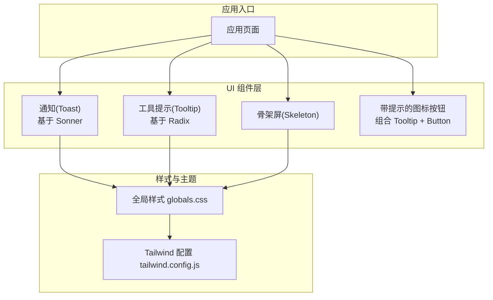
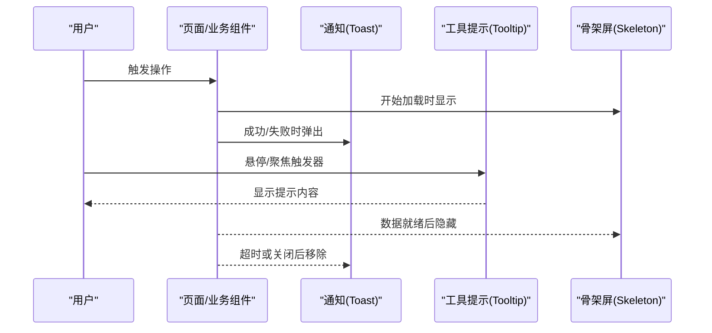
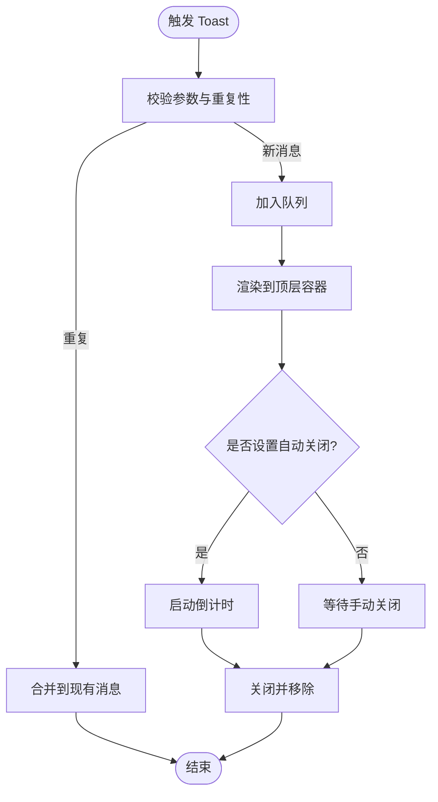
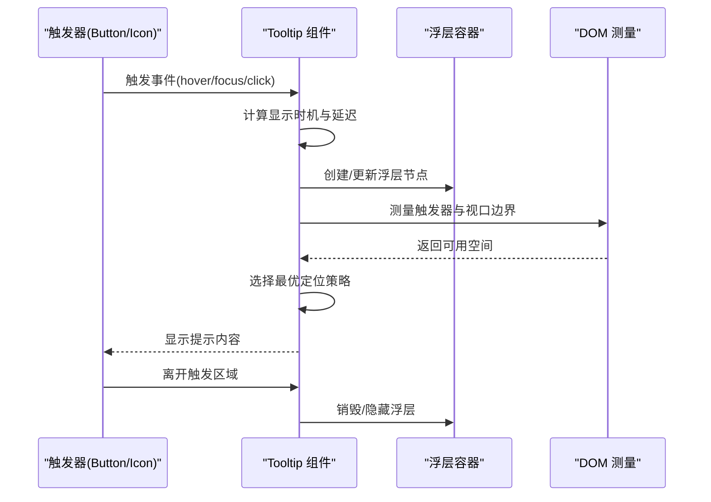
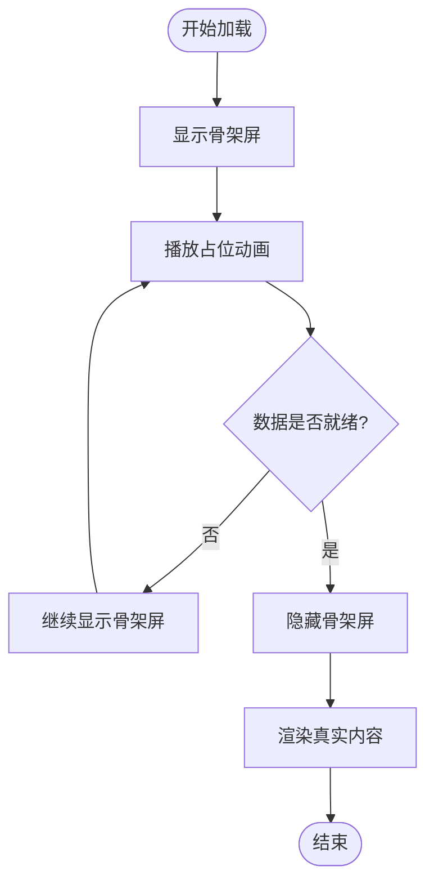
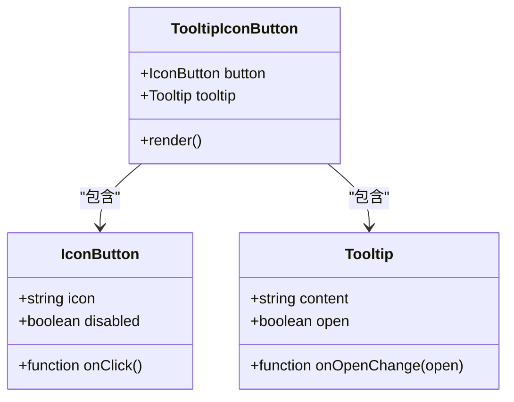
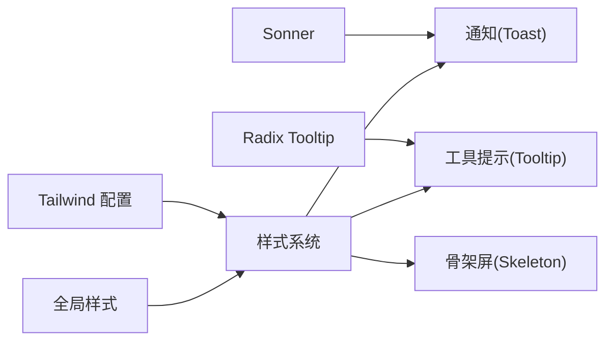

# 反馈组件

<cite>
**本文引用的文件**   
- [apps/web/src/components/ui/sonner.tsx](file://apps/web/src/components/ui/sonner.tsx)
- [apps/web/src/components/ui/tooltip.tsx](file://apps/web/src/components/ui/tooltip.tsx)
- [apps/web/src/components/ui/skeleton.tsx](file://apps/web/src/components/ui/skeleton.tsx)
- [apps/web/src/components/thread/tooltip-icon-button.tsx](file://apps/web/src/components/thread/tooltip-icon-button.tsx)
- [apps/web/src/app/globals.css](file://apps/web/src/app/globals.css)
- [apps/web/tailwind.config.js](file://apps/web/tailwind.config.js)
</cite>

## 目录
1. [简介](#简介)
2. [项目结构](#项目结构)
3. [核心组件](#核心组件)
4. [架构总览](#架构总览)
5. [详细组件分析](#详细组件分析)
6. [依赖分析](#依赖分析)
7. [性能考虑](#性能考虑)
8. [故障排查指南](#故障排查指南)
9. [结论](#结论)
10. [附录](#附录)

## 简介
本文件面向“用户反馈”类 UI 组件，覆盖通知（Toast）、工具提示（Tooltip）与骨架屏（Skeleton）三类组件。文档从触发条件、显示时机与生命周期管理入手，深入解析定位策略、层级管理与遮挡处理；并给出样式定制、主题适配与国际化支持的实践建议。同时提供事件处理、回调函数与状态同步的说明，以及多种反馈场景的实现思路与用户体验优化技巧。

## 项目结构
反馈相关组件集中在 Web 应用的 UI 层：
- 通知（Toast）：基于第三方库 Sonner 封装
- 工具提示（Tooltip）：基于 Radix Tooltip 封装
- 骨架屏（Skeleton）：基础占位组件
- 全局样式与主题：通过 Tailwind CSS 配置与全局样式表统一

图表来源
- [apps/web/src/components/ui/sonner.tsx](file://apps/web/src/components/ui/sonner.tsx)
- [apps/web/src/components/ui/tooltip.tsx](file://apps/web/src/components/ui/tooltip.tsx)
- [apps/web/src/components/ui/skeleton.tsx](file://apps/web/src/components/ui/skeleton.tsx)
- [apps/web/src/components/thread/tooltip-icon-button.tsx](file://apps/web/src/components/thread/tooltip-icon-button.tsx)
- [apps/web/src/app/globals.css](file://apps/web/src/app/globals.css)
- [apps/web/tailwind.config.js](file://apps/web/tailwind.config.js)

章节来源
- [apps/web/src/components/ui/sonner.tsx](file://apps/web/src/components/ui/sonner.tsx)
- [apps/web/src/components/ui/tooltip.tsx](file://apps/web/src/components/ui/tooltip.tsx)
- [apps/web/src/components/ui/skeleton.tsx](file://apps/web/src/components/ui/skeleton.tsx)
- [apps/web/src/components/thread/tooltip-icon-button.tsx](file://apps/web/src/components/thread/tooltip-icon-button.tsx)
- [apps/web/src/app/globals.css](file://apps/web/src/app/globals.css)
- [apps/web/tailwind.config.js](file://apps/web/tailwind.config.js)

## 核心组件
- 通知（Toast）
  - 作用：短时展示操作结果、系统消息或错误信息
  - 触发方式：由业务逻辑调用 API 主动弹出
  - 生命周期：自动消失或手动关闭，支持队列与去重
- 工具提示（Tooltip）
  - 作用：为交互元素提供上下文帮助或说明
  - 触发方式：鼠标悬停、聚焦或点击等
  - 生命周期：进入触发区域显示，离开后隐藏
- 骨架屏（Skeleton）
  - 作用：在数据加载期间提供视觉占位，提升感知速度
  - 触发方式：数据请求开始时显示，完成后隐藏
  - 生命周期：与数据流绑定，支持动画与布局稳定

章节来源
- [apps/web/src/components/ui/sonner.tsx](file://apps/web/src/components/ui/sonner.tsx)
- [apps/web/src/components/ui/tooltip.tsx](file://apps/web/src/components/ui/tooltip.tsx)
- [apps/web/src/components/ui/skeleton.tsx](file://apps/web/src/components/ui/skeleton.tsx)

## 架构总览
反馈组件采用“轻量封装 + 外部驱动”的模式：
- 通知：通过 Sonner 提供的 API 在任意位置触发，内部维护渲染树与队列
- 工具提示：基于 Radix 的受控/非受控模式，结合触发器与浮层定位
- 骨架屏：纯展示组件，由父级控制显隐与尺寸

图表来源
- [apps/web/src/components/ui/sonner.tsx](file://apps/web/src/components/ui/sonner.tsx)
- [apps/web/src/components/ui/tooltip.tsx](file://apps/web/src/components/ui/tooltip.tsx)
- [apps/web/src/components/ui/skeleton.tsx](file://apps/web/src/components/ui/skeleton.tsx)

## 详细组件分析

### 通知（Toast）
- 触发条件
  - 成功：提交成功、保存完成
  - 警告：即将过期、权限不足
  - 错误：网络异常、校验失败
  - 信息：操作进度、批量结果摘要
- 显示时机
  - 异步操作完成后立即显示
  - 可设置延迟显示以避免抖动
- 生命周期管理
  - 自动关闭：默认时长可配置
  - 手动关闭：点击关闭按钮或遮罩
  - 队列与去重：相同类型消息合并，避免刷屏
- 定位策略与层级
  - 固定定位到视口角落，避免被其他元素遮挡
  - 使用独立容器与高 z-index，确保在最上层
- 样式定制与主题
  - 通过主题变量或样式类切换明暗主题
  - 支持自定义颜色、圆角、阴影与间距
- 国际化支持
  - 文案通过 i18n 键值获取，支持多语言切换
- 事件与回调
  - onOpen/onClose：打开/关闭回调
  - onClick：点击消息体或动作按钮
  - onHover：悬停暂停计时
- 状态同步
  - 与业务状态联动：如表单提交状态、API 响应码
  - 与路由/查询参数联动：如分页刷新后的结果提示

图表来源
- [apps/web/src/components/ui/sonner.tsx](file://apps/web/src/components/ui/sonner.tsx)

章节来源
- [apps/web/src/components/ui/sonner.tsx](file://apps/web/src/components/ui/sonner.tsx)

### 工具提示（Tooltip）
- 触发条件
  - 鼠标悬停、键盘聚焦、点击触发器等
- 显示时机
  - 进入触发区域后短暂延迟显示，避免误触
  - 离开触发区域后快速隐藏
- 生命周期管理
  - 受控模式：由父组件控制 open/close
  - 非受控模式：内部根据触发事件管理状态
- 定位策略与层级
  - 智能定位：优先靠近触发器，必要时翻转方向
  - 防溢出：检测视口边界，自动调整位置
  - 层级：置于独立浮层容器，z-index 高于常规内容
- 样式定制与主题
  - 支持主题色、字体大小、内边距与箭头样式
  - 可通过 CSS 变量或 Tailwind 类名覆盖
- 国际化支持
  - 文本内容由 i18n 键值注入，支持动态切换
- 事件与回调
  - onOpenChange：打开/关闭变化回调
  - onPointerMove：移动事件用于精准定位
  - onKeyDown：键盘导航支持
- 状态同步
  - 与按钮禁用态、输入校验态联动，避免无效提示

图表来源
- [apps/web/src/components/ui/tooltip.tsx](file://apps/web/src/components/ui/tooltip.tsx)

章节来源
- [apps/web/src/components/ui/tooltip.tsx](file://apps/web/src/components/ui/tooltip.tsx)

### 骨架屏（Skeleton）
- 触发条件
  - 列表项、卡片、头像、文本块等在数据未就绪时显示
- 显示时机
  - 数据请求开始时立即显示
  - 数据返回后平滑过渡到真实内容
- 生命周期管理
  - 由父组件控制显隐，通常与 loading 状态绑定
  - 支持动画循环与淡入淡出效果
- 定位策略与层级
  - 与真实内容同层级，保持布局稳定，避免重排
- 样式定制与主题
  - 支持尺寸、形状、颜色与动画时长
  - 与主题变量联动，适配明暗主题
- 事件与回调
  - 无交互事件，仅作为占位展示
- 状态同步
  - 与数据加载状态、错误状态联动，必要时替换为错误占位

图表来源
- [apps/web/src/components/ui/skeleton.tsx](file://apps/web/src/components/ui/skeleton.tsx)

章节来源
- [apps/web/src/components/ui/skeleton.tsx](file://apps/web/src/components/ui/skeleton.tsx)

### 组合示例：带提示的图标按钮
- 用途：为图标按钮提供简短说明，提升可发现性与可用性
- 实现要点
  - 将 Tooltip 包裹在按钮外层或作为子元素
  - 根据按钮状态（禁用、加载中）控制提示的可见性
  - 使用统一的样式与主题变量

图表来源
- [apps/web/src/components/thread/tooltip-icon-button.tsx](file://apps/web/src/components/thread/tooltip-icon-button.tsx)
- [apps/web/src/components/ui/tooltip.tsx](file://apps/web/src/components/ui/tooltip.tsx)

章节来源
- [apps/web/src/components/thread/tooltip-icon-button.tsx](file://apps/web/src/components/thread/tooltip-icon-button.tsx)
- [apps/web/src/components/ui/tooltip.tsx](file://apps/web/src/components/ui/tooltip.tsx)

## 依赖分析
- 通知（Toast）
  - 依赖 Sonner：提供底层渲染、队列与生命周期管理
  - 依赖全局样式：用于统一外观与主题
- 工具提示（Tooltip）
  - 依赖 Radix Tooltip：提供无障碍与定位能力
  - 依赖全局样式：用于主题与尺寸一致性
- 骨架屏（Skeleton）
  - 无外部依赖，纯展示组件
- 主题与样式
  - Tailwind CSS：原子化样式与主题变量
  - 全局样式：定义通用变量与覆盖规则

图表来源
- [apps/web/src/components/ui/sonner.tsx](file://apps/web/src/components/ui/sonner.tsx)
- [apps/web/src/components/ui/tooltip.tsx](file://apps/web/src/components/ui/tooltip.tsx)
- [apps/web/src/components/ui/skeleton.tsx](file://apps/web/src/components/ui/skeleton.tsx)
- [apps/web/src/app/globals.css](file://apps/web/src/app/globals.css)
- [apps/web/tailwind.config.js](file://apps/web/tailwind.config.js)

章节来源
- [apps/web/src/components/ui/sonner.tsx](file://apps/web/src/components/ui/sonner.tsx)
- [apps/web/src/components/ui/tooltip.tsx](file://apps/web/src/components/ui/tooltip.tsx)
- [apps/web/src/components/ui/skeleton.tsx](file://apps/web/src/components/ui/skeleton.tsx)
- [apps/web/src/app/globals.css](file://apps/web/src/app/globals.css)
- [apps/web/tailwind.config.js](file://apps/web/tailwind.config.js)

## 性能考虑
- 通知（Toast）
  - 合理设置自动关闭时长，避免长时间占用屏幕
  - 对高频消息进行去重与合并，减少渲染次数
  - 使用虚拟滚动或懒渲染，降低首屏压力
- 工具提示（Tooltip）
  - 延迟显示与隐藏，避免频繁触发导致的抖动
  - 限制同时显示的 Tooltip 数量，防止布局抖动
  - 使用 requestAnimationFrame 优化定位计算
- 骨架屏（Skeleton）
  - 使用 CSS 动画而非 JS 动画，减少主线程负担
  - 按需渲染骨架屏，避免全量占位
  - 与真实内容同布局，避免重排与回流

[本节为通用指导，不直接分析具体文件]

## 故障排查指南
- 通知（Toast）
  - 问题：消息被遮挡
    - 检查 z-index 与容器层级，确保在最上层
    - 确认是否有其他浮层覆盖
  - 问题：消息未自动关闭
    - 检查 onHover 是否阻止了关闭
    - 确认定时器未被清理
- 工具提示（Tooltip）
  - 问题：定位偏移或溢出
    - 检查触发器尺寸与父容器边界
    - 确认是否启用了防溢出与翻转策略
  - 问题：无障碍访问异常
    - 检查 aria-* 属性是否正确传递
    - 确认键盘焦点管理
- 骨架屏（Skeleton）
  - 问题：布局抖动
    - 确保骨架屏与真实内容尺寸一致
    - 避免动态插入导致重排
  - 问题：动画卡顿
    - 使用 GPU 加速的 CSS 动画
    - 减少复杂动画与滤镜

章节来源
- [apps/web/src/components/ui/sonner.tsx](file://apps/web/src/components/ui/sonner.tsx)
- [apps/web/src/components/ui/tooltip.tsx](file://apps/web/src/components/ui/tooltip.tsx)
- [apps/web/src/components/ui/skeleton.tsx](file://apps/web/src/components/ui/skeleton.tsx)

## 结论
反馈组件是提升用户体验的关键环节。通过合理的触发条件、生命周期管理与定位策略，配合样式定制与国际化支持，可以在不同场景下提供一致且友好的反馈体验。建议在项目中统一封装与规范，确保可维护性与可扩展性。

[本节为总结性内容，不直接分析具体文件]

## 附录
- 最佳实践清单
  - 明确触发条件与显示时机，避免干扰用户
  - 统一管理层级与样式，保证视觉一致性
  - 使用 i18n 键值管理文案，便于多语言切换
  - 对高频操作进行去重与节流，提升性能
  - 完善无障碍支持，确保键盘与读屏兼容
- 常见场景示例路径
  - 表单提交成功提示：参考通知组件的使用方式
  - 按钮功能说明：参考工具提示的组合用法
  - 列表加载占位：参考骨架屏的集成方式

[本节为补充信息，不直接分析具体文件]