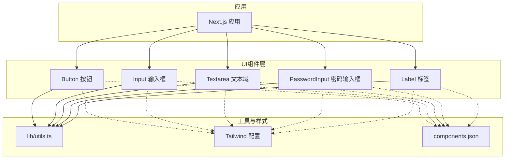
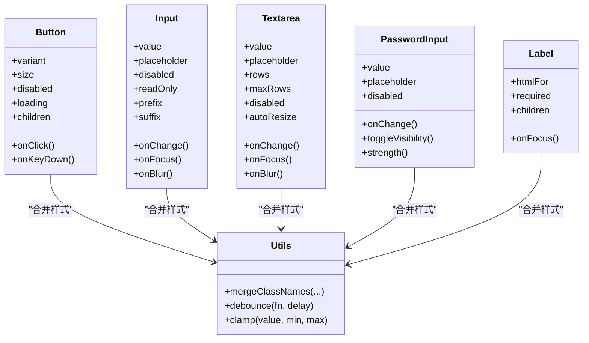
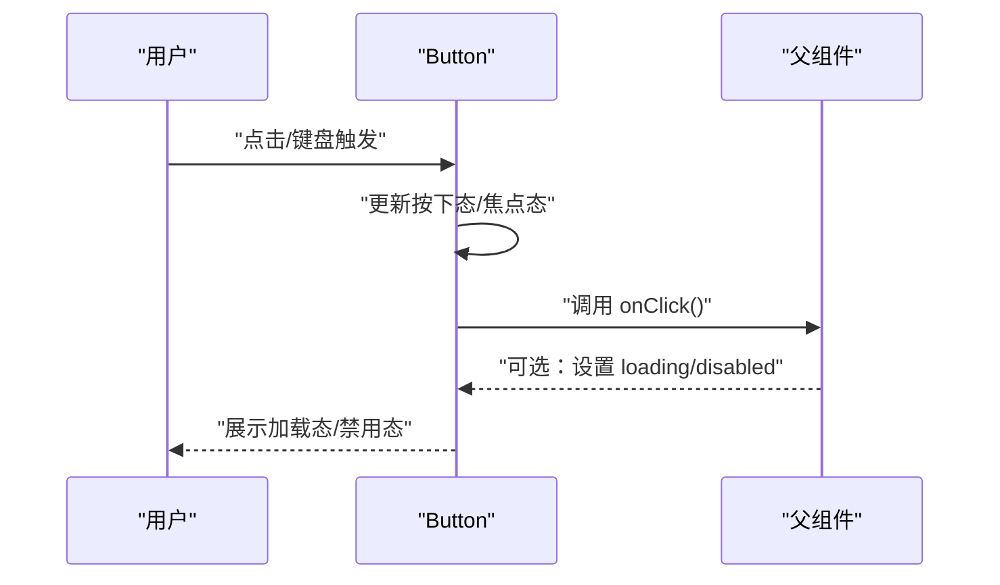
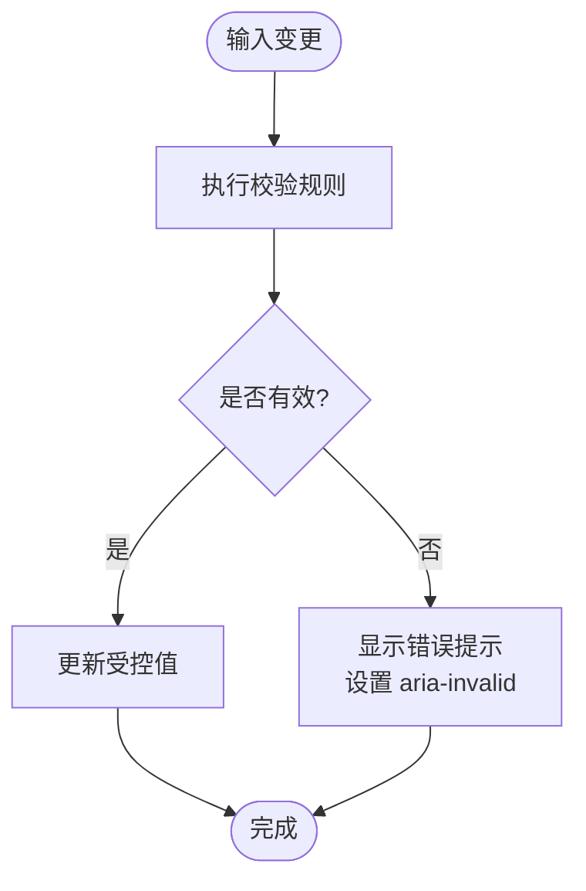
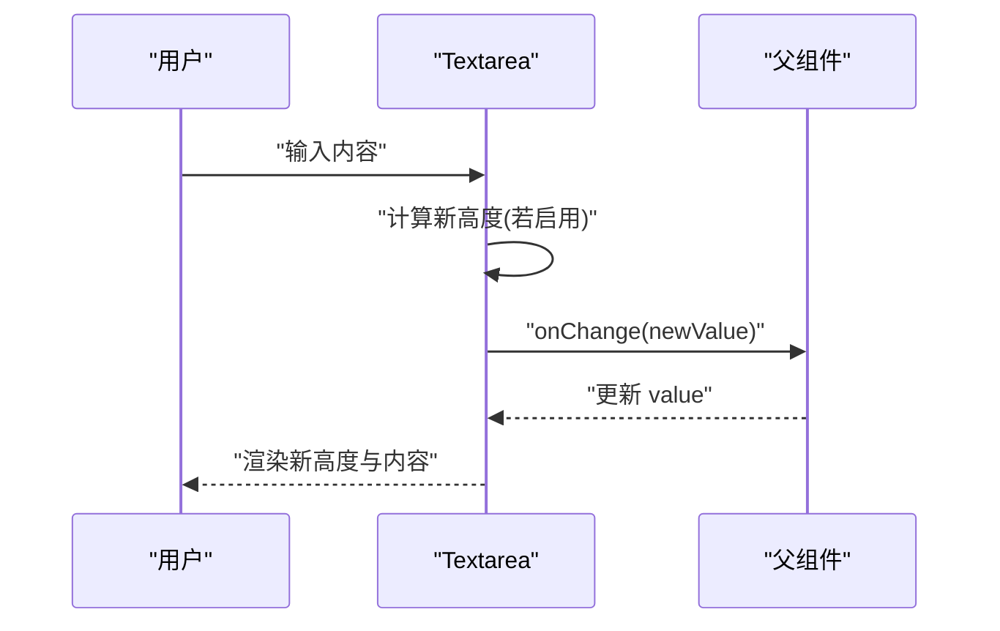
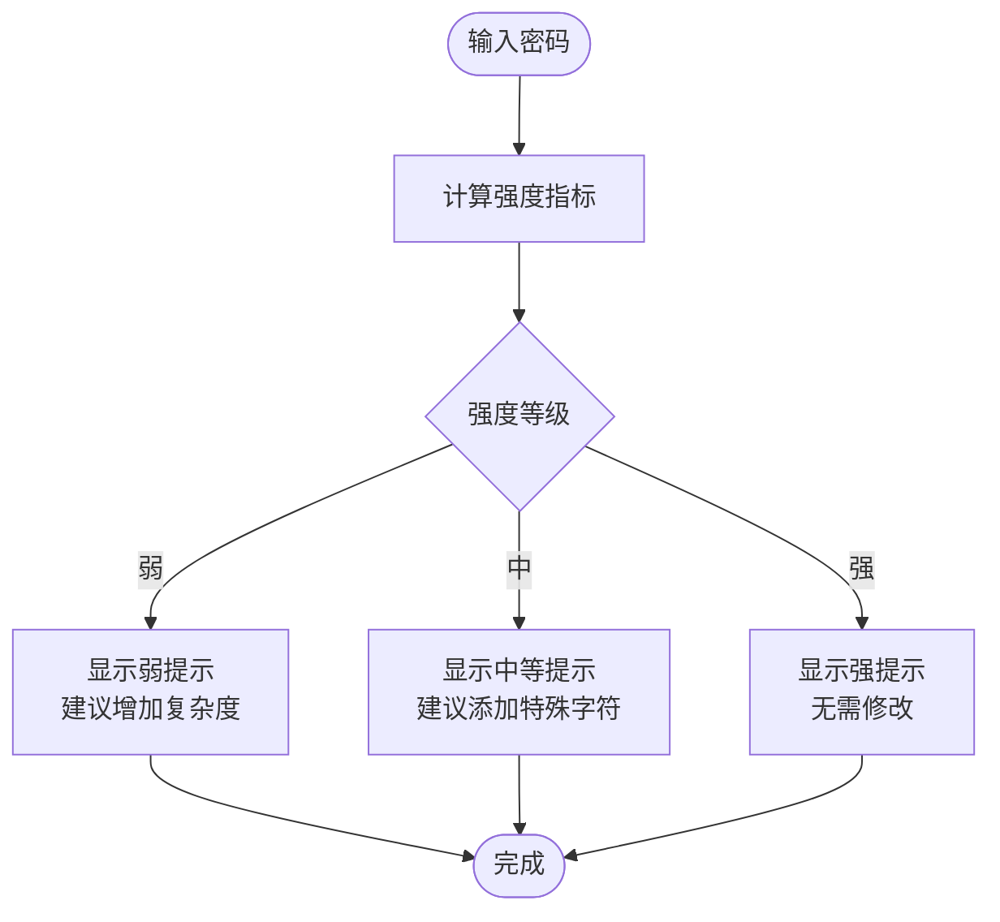
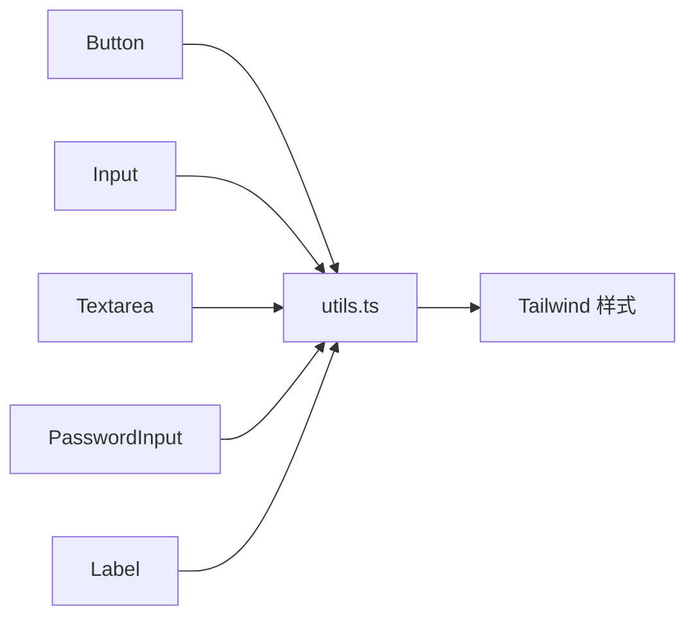

# 基础组件

<cite>
**本文引用的文件**   
- [button.tsx](file://apps/web/src/components/ui/button.tsx)
- [input.tsx](file://apps/web/src/components/ui/input.tsx)
- [textarea.tsx](file://apps/web/src/components/ui/textarea.tsx)
- [password-input.tsx](file://apps/web/src/components/ui/password-input.tsx)
- [label.tsx](file://apps/web/src/components/ui/label.tsx)
- [utils.ts](file://apps/web/src/lib/utils.ts)
- [tailwind.config.js](file://apps/web/tailwind.config.js)
- [components.json](file://apps/web/components.json)
</cite>

## 目录
1. [简介](#简介)
2. [项目结构](#项目结构)
3. [核心组件](#核心组件)
4. [架构总览](#架构总览)
5. [详细组件分析](#详细组件分析)
6. [依赖关系分析](#依赖关系分析)
7. [性能考量](#性能考量)
8. [故障排查指南](#故障排查指南)
9. [结论](#结论)
10. [附录](#附录)

## 简介
本章节面向前端基础UI组件的使用与集成，涵盖按钮、输入框、文本域、密码输入框和标签等组件。文档将系统说明各组件的props接口、事件处理、状态管理、样式定制选项、验证机制、错误处理与用户交互反馈、可访问性（键盘导航与屏幕阅读器兼容），以及组合使用模式、表单集成方案与自定义样式覆盖方法，并提供常见场景的最佳实践指引。

## 项目结构
基础UI组件位于 apps/web/src/components/ui 目录下，采用按功能划分的模块化组织方式；公共工具函数位于 apps/web/src/lib/utils.ts；样式体系基于 Tailwind CSS，并通过 components.json 进行 shadcn/ui 风格配置。

图表来源
- [button.tsx:1-200](file://apps/web/src/components/ui/button.tsx#L1-L200)
- [input.tsx:1-200](file://apps/web/src/components/ui/input.tsx#L1-L200)
- [textarea.tsx:1-200](file://apps/web/src/components/ui/textarea.tsx#L1-L200)
- [password-input.tsx:1-200](file://apps/web/src/components/ui/password-input.tsx#L1-L200)
- [label.tsx:1-200](file://apps/web/src/components/ui/label.tsx#L1-L200)
- [utils.ts:1-200](file://apps/web/src/lib/utils.ts#L1-L200)
- [tailwind.config.js:1-200](file://apps/web/tailwind.config.js#L1-L200)
- [components.json:1-200](file://apps/web/components.json#L1-L200)

章节来源
- [button.tsx:1-200](file://apps/web/src/components/ui/button.tsx#L1-L200)
- [input.tsx:1-200](file://apps/web/src/components/ui/input.tsx#L1-L200)
- [textarea.tsx:1-200](file://apps/web/src/components/ui/textarea.tsx#L1-L200)
- [password-input.tsx:1-200](file://apps/web/src/components/ui/password-input.tsx#L1-L200)
- [label.tsx:1-200](file://apps/web/src/components/ui/label.tsx#L1-L200)
- [utils.ts:1-200](file://apps/web/src/lib/utils.ts#L1-L200)
- [tailwind.config.js:1-200](file://apps/web/tailwind.config.js#L1-L200)
- [components.json:1-200](file://apps/web/components.json#L1-L200)

## 核心组件
本节概述各基础组件的职责与能力边界：
- Button：触发操作，支持多种变体、尺寸、禁用态、加载态与图标组合。
- Input：单行文本输入，支持受控与非受控模式、占位符、前缀/后缀、只读与禁用。
- Textarea：多行文本输入，支持自适应高度、最大行数限制与字符计数。
- PasswordInput：安全密码输入，支持可见性切换、强度提示与校验反馈。
- Label：为输入控件提供语义化标签，支持关联id与焦点引导。

章节来源
- [button.tsx:1-200](file://apps/web/src/components/ui/button.tsx#L1-L200)
- [input.tsx:1-200](file://apps/web/src/components/ui/input.tsx#L1-L200)
- [textarea.tsx:1-200](file://apps/web/src/components/ui/textarea.tsx#L1-L200)
- [password-input.tsx:1-200](file://apps/web/src/components/ui/password-input.tsx#L1-L200)
- [label.tsx:1-200](file://apps/web/src/components/ui/label.tsx#L1-L200)

## 架构总览
基础组件遵循“受控优先”的设计原则，通过 props 暴露数据与行为，内部维护最小必要状态（如聚焦、展开、加载）。样式由 Tailwind 原子类驱动，并通过 utils 工具函数合并 className，确保高内聚、低耦合与易扩展。

图表来源
- [button.tsx:1-200](file://apps/web/src/components/ui/button.tsx#L1-L200)
- [input.tsx:1-200](file://apps/web/src/components/ui/input.tsx#L1-L200)
- [textarea.tsx:1-200](file://apps/web/src/components/ui/textarea.tsx#L1-L200)
- [password-input.tsx:1-200](file://apps/web/src/components/ui/password-input.tsx#L1-L200)
- [label.tsx:1-200](file://apps/web/src/components/ui/label.tsx#L1-L200)
- [utils.ts:1-200](file://apps/web/src/lib/utils.ts#L1-L200)

## 详细组件分析

### Button 按钮
- 用途：触发操作，支持多种视觉变体与交互状态。
- 关键属性
  - variant：主题变体（如默认、次要、危险等）
  - size：尺寸（如 sm、md、lg）
  - disabled：禁用态
  - loading：加载态（显示旋转指示）
  - icon：前后图标插槽
  - children：内容
- 事件
  - onClick：点击回调
  - onKeyDown：键盘回车/空格触发
- 状态管理
  - 内部维护 isPressed/isFocused 用于焦点与按下态样式
- 样式定制
  - 通过 className 合并覆盖
  - 通过 Tailwind 变量或主题扩展新增变体
- 可访问性
  - role="button"（如非原生button）
  - aria-disabled、aria-busy（loading）
  - 键盘支持：Enter/Space 触发
- 错误处理
  - 对无效 props 给出警告（开发环境）
  - 异步操作时通过 loading 与禁用防止重复提交

图表来源
- [button.tsx:1-200](file://apps/web/src/components/ui/button.tsx#L1-L200)

章节来源
- [button.tsx:1-200](file://apps/web/src/components/ui/button.tsx#L1-L200)

### Input 输入框
- 用途：单行文本输入，适合搜索、过滤、简短信息录入。
- 关键属性
  - value：受控值
  - onChange：值变更回调
  - placeholder：占位文本
  - disabled/readOnly：禁用/只读
  - prefix/suffix：前后缀元素
  - type：输入类型（text/email/number 等）
- 事件
  - onFocus/onBlur：焦点事件
  - onInput：原生输入事件
- 状态管理
  - 受控模式下由父组件管理 value
  - 非受控模式可使用 defaultValue
- 样式定制
  - className 合并
  - 通过 Tailwind 扩展输入框边框、圆角、阴影
- 可访问性
  - 与 Label htmlFor 关联
  - aria-invalid、aria-describedby 配合错误提示
  - 键盘无障碍：Tab 顺序、方向键移动光标
- 验证与反馈
  - 结合外部库（如 zod/yup）在 onChange 中校验
  - 错误消息通过 aria-describedby 关联

图表来源
- [input.tsx:1-200](file://apps/web/src/components/ui/input.tsx#L1-L200)
- [utils.ts:1-200](file://apps/web/src/lib/utils.ts#L1-L200)

章节来源
- [input.tsx:1-200](file://apps/web/src/components/ui/input.tsx#L1-L200)
- [utils.ts:1-200](file://apps/web/src/lib/utils.ts#L1-L200)

### Textarea 文本域
- 用途：多行文本输入，适合评论、描述、长内容编辑。
- 关键属性
  - value/onChange：受控值与变更回调
  - rows/maxRows：初始行数与最大行数
  - autoResize：自动调整高度
  - placeholder/disabled/readonly
- 事件
  - onFocus/onBlur/onInput
- 状态管理
  - 内部计算高度（当 autoResize 开启）
  - 防抖避免频繁重排
- 样式定制
  - className 合并
  - 滚动条样式可通过 Tailwind 覆盖
- 可访问性
  - 与 Label htmlFor 关联
  - 支持 Enter 换行，Shift+Enter 插入换行（可选）
- 验证与反馈
  - 长度限制、必填校验
  - 实时字符计数与错误提示

图表来源
- [textarea.tsx:1-200](file://apps/web/src/components/ui/textarea.tsx#L1-L200)
- [utils.ts:1-200](file://apps/web/src/lib/utils.ts#L1-L200)

章节来源
- [textarea.tsx:1-200](file://apps/web/src/components/ui/textarea.tsx#L1-L200)
- [utils.ts:1-200](file://apps/web/src/lib/utils.ts#L1-L200)

### PasswordInput 密码输入框
- 用途：安全输入密码，支持可见性切换与强度提示。
- 关键属性
  - value/onChange：受控值与变更回调
  - placeholder/disabled/readonly
  - showToggle：是否显示可见性切换
  - strength：强度阈值配置
- 事件
  - onFocus/onBlur/onInput
  - onToggleVisibility：切换可见性
- 状态管理
  - 内部维护 visible 状态控制输入类型
  - 计算密码强度（长度、大小写、数字、特殊字符）
- 样式定制
  - className 合并
  - 强度条颜色与文案可配置
- 可访问性
  - 与 Label htmlFor 关联
  - aria-pressed（切换按钮）、aria-label（辅助文本）
- 验证与反馈
  - 实时强度提示
  - 错误提示（过短、无特殊字符等）

图表来源
- [password-input.tsx:1-200](file://apps/web/src/components/ui/password-input.tsx#L1-L200)
- [utils.ts:1-200](file://apps/web/src/lib/utils.ts#L1-L200)

章节来源
- [password-input.tsx:1-200](file://apps/web/src/components/ui/password-input.tsx#L1-L200)
- [utils.ts:1-200](file://apps/web/src/lib/utils.ts#L1-L200)

### Label 标签
- 用途：为输入控件提供语义化标签，提升可访问性与用户体验。
- 关键属性
  - htmlFor：关联输入控件 id
  - required：标记必填
  - children：标签文本
  - className：样式覆盖
- 事件
  - onClick：点击时聚焦关联控件
- 可访问性
  - 正确关联 htmlFor/id
  - 与 aria-required 同步
- 样式定制
  - 字体、颜色、间距通过 Tailwind 覆盖

章节来源
- [label.tsx:1-200](file://apps/web/src/components/ui/label.tsx#L1-L200)

## 依赖关系分析
组件间依赖清晰，主要依赖 lib/utils.ts 提供的通用工具（如 className 合并、防抖、数值钳制等），并通过 Tailwind 统一样式。

图表来源
- [button.tsx:1-200](file://apps/web/src/components/ui/button.tsx#L1-L200)
- [input.tsx:1-200](file://apps/web/src/components/ui/input.tsx#L1-L200)
- [textarea.tsx:1-200](file://apps/web/src/components/ui/textarea.tsx#L1-L200)
- [password-input.tsx:1-200](file://apps/web/src/components/ui/password-input.tsx#L1-L200)
- [label.tsx:1-200](file://apps/web/src/components/ui/label.tsx#L1-L200)
- [utils.ts:1-200](file://apps/web/src/lib/utils.ts#L1-L200)
- [tailwind.config.js:1-200](file://apps/web/tailwind.config.js#L1-L200)

章节来源
- [utils.ts:1-200](file://apps/web/src/lib/utils.ts#L1-L200)
- [tailwind.config.js:1-200](file://apps/web/tailwind.config.js#L1-L200)

## 性能考量
- 受控组件优化：在高频输入场景下，使用防抖减少不必要的重渲染（适用于 Textarea/Input）。
- 条件渲染：根据 props 动态渲染加载态、图标与后缀，避免多余 DOM。
- 样式合并：通过工具函数一次性合并 className，减少多次拼接开销。
- 事件节流：对频繁触发的事件（如 onInput）进行节流/防抖处理。
- 内存管理：及时解绑事件监听器，避免泄漏。

[本节为通用性能建议，不直接分析具体文件]

## 故障排查指南
- 输入无法更新
  - 检查是否为受控组件且 value 已正确传递
  - 确认 onChange 是否正确调用并更新 state
- 样式未生效
  - 检查 className 合并逻辑与 Tailwind 配置
  - 确认组件未被外层容器覆盖样式优先级
- 键盘不可用
  - 确认组件具备正确的 tabIndex 与键盘事件处理
  - 检查 focus 与 blur 事件是否被阻止
- 可访问性问题
  - 核对 htmlFor/id 关联
  - 检查 aria-* 属性是否与状态一致
- 验证失败
  - 检查校验规则与错误提示绑定
  - 确认 aria-invalid 与提示信息关联

章节来源
- [input.tsx:1-200](file://apps/web/src/components/ui/input.tsx#L1-L200)
- [textarea.tsx:1-200](file://apps/web/src/components/ui/textarea.tsx#L1-L200)
- [password-input.tsx:1-200](file://apps/web/src/components/ui/password-input.tsx#L1-L200)
- [label.tsx:1-200](file://apps/web/src/components/ui/label.tsx#L1-L200)

## 结论
基础组件以受控模式为核心，结合 Tailwind 与工具函数实现高内聚、低耦合的 UI 能力。通过完善的可访问性与验证反馈，满足常见表单与交互需求。建议在项目中统一使用这些组件，并通过主题与样式覆盖保持设计一致性。

[本节为总结性内容，不直接分析具体文件]

## 附录

### 组件 Props 参考（摘要）
- Button
  - variant、size、disabled、loading、icon、children、onClick、onKeyDown
- Input
  - value、onChange、placeholder、type、disabled、readOnly、prefix、suffix、onFocus、onBlur、onInput
- Textarea
  - value、onChange、placeholder、rows、maxRows、autoResize、disabled、readOnly、onFocus、onBlur、onInput
- PasswordInput
  - value、onChange、placeholder、disabled、readOnly、showToggle、strength、onToggleVisibility
- Label
  - htmlFor、required、children、className、onClick

章节来源
- [button.tsx:1-200](file://apps/web/src/components/ui/button.tsx#L1-L200)
- [input.tsx:1-200](file://apps/web/src/components/ui/input.tsx#L1-L200)
- [textarea.tsx:1-200](file://apps/web/src/components/ui/textarea.tsx#L1-L200)
- [password-input.tsx:1-200](file://apps/web/src/components/ui/password-input.tsx#L1-L200)
- [label.tsx:1-200](file://apps/web/src/components/ui/label.tsx#L1-L200)

### 表单集成最佳实践
- 使用受控模式统一管理表单状态
- 通过 Label htmlFor 关联每个输入控件
- 在 onChange 中进行即时校验，并在 onBlur 时进行最终校验
- 使用 aria-invalid 与 aria-describedby 关联错误提示
- 提交前汇总校验结果，集中展示错误信息

章节来源
- [input.tsx:1-200](file://apps/web/src/components/ui/input.tsx#L1-L200)
- [textarea.tsx:1-200](file://apps/web/src/components/ui/textarea.tsx#L1-L200)
- [password-input.tsx:1-200](file://apps/web/src/components/ui/password-input.tsx#L1-L200)
- [label.tsx:1-200](file://apps/web/src/components/ui/label.tsx#L1-L200)

### 自定义样式覆盖方法
- 通过 className 传入覆盖默认样式
- 在 Tailwind 配置中扩展主题变量（颜色、圆角、阴影）
- 使用 components.json 定义组件默认样式映射
- 避免内联样式，优先使用原子类与主题变量

章节来源
- [tailwind.config.js:1-200](file://apps/web/tailwind.config.js#L1-L200)
- [components.json:1-200](file://apps/web/components.json#L1-L200)