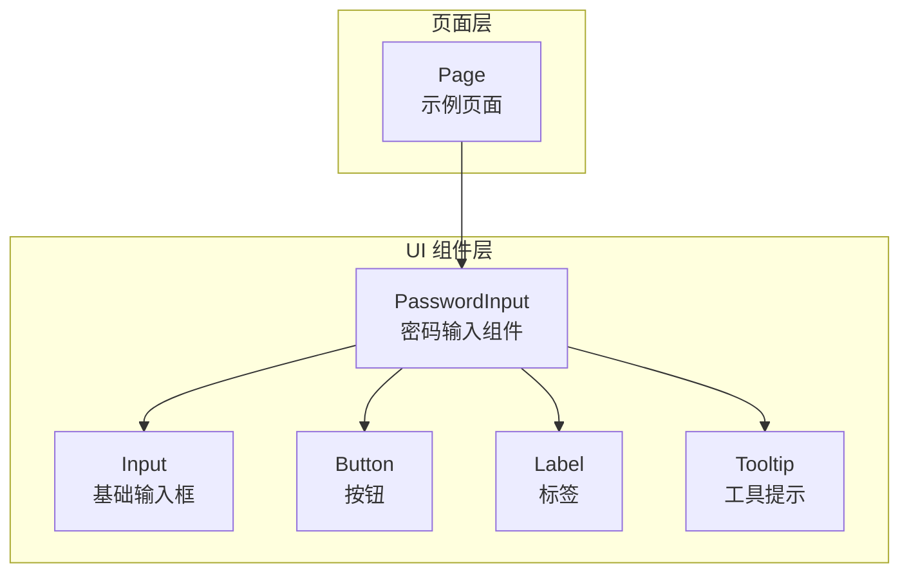
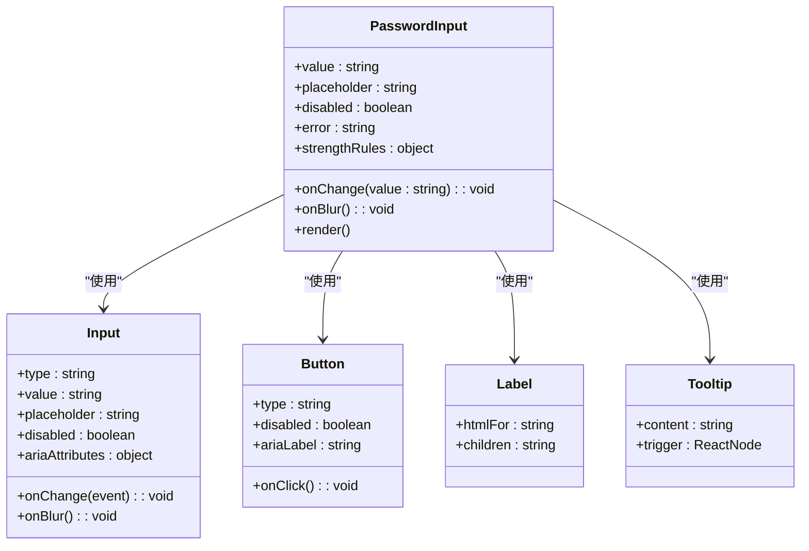
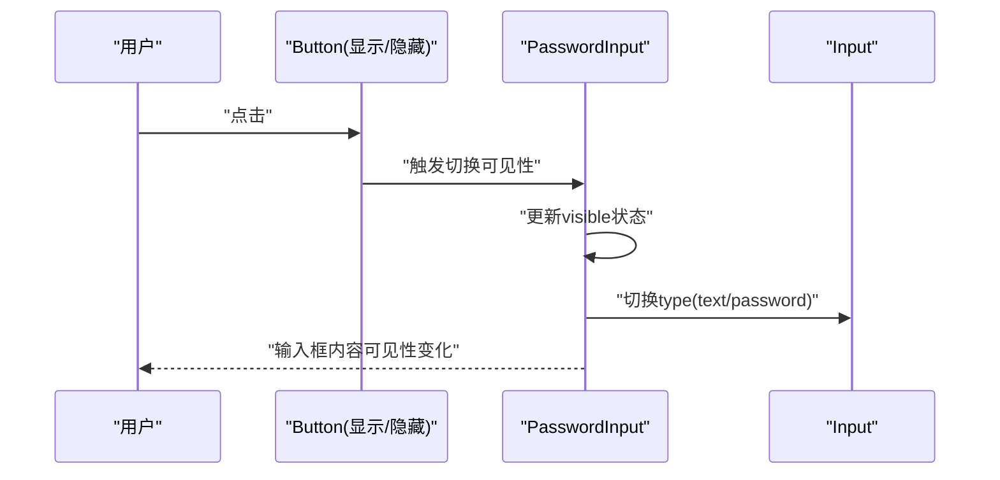
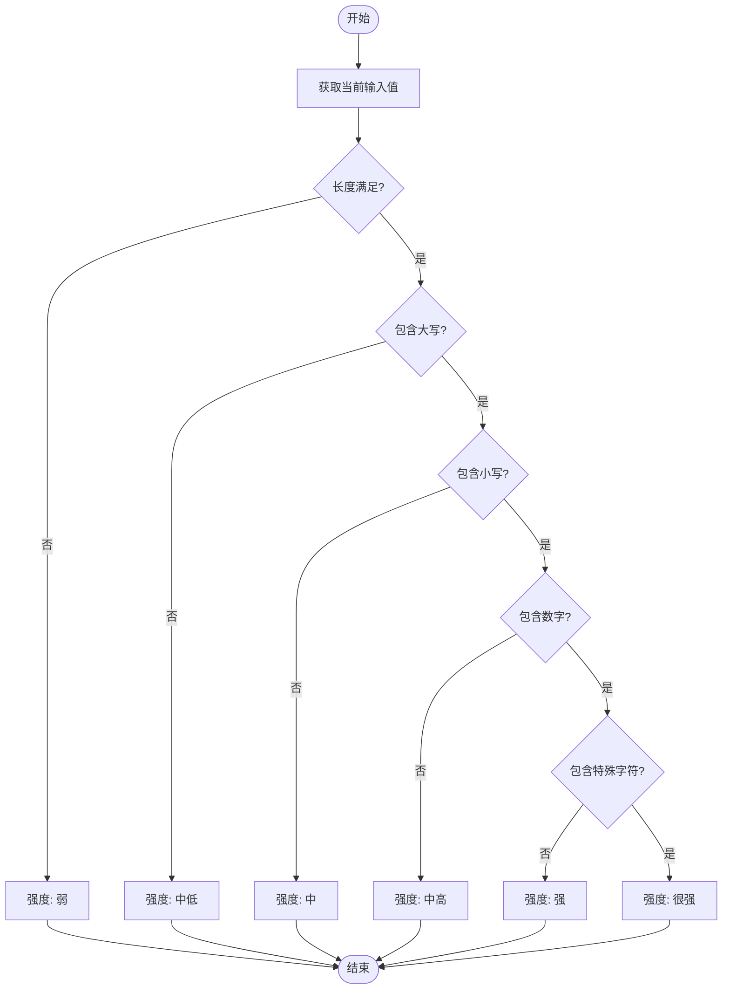
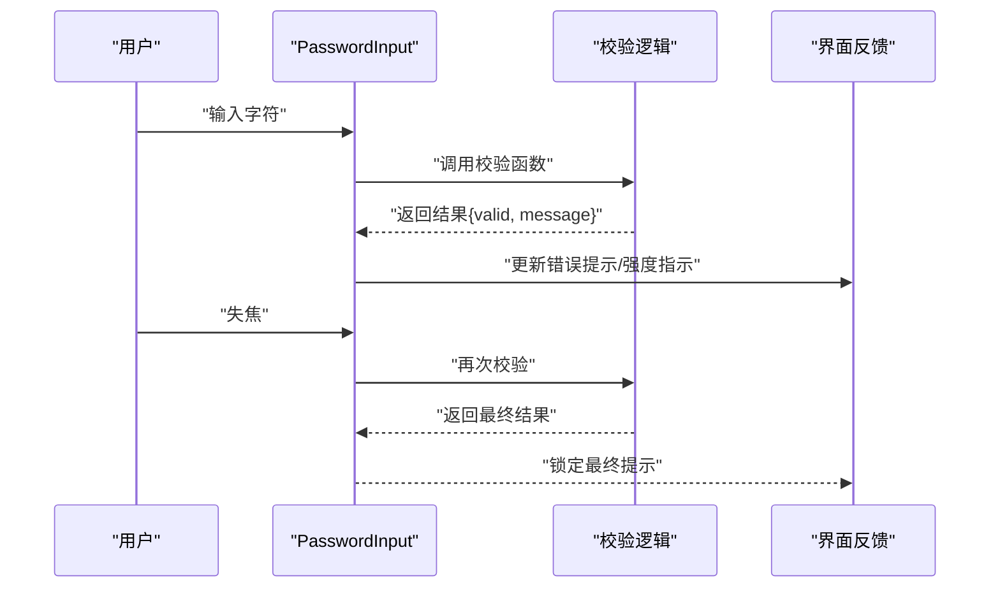
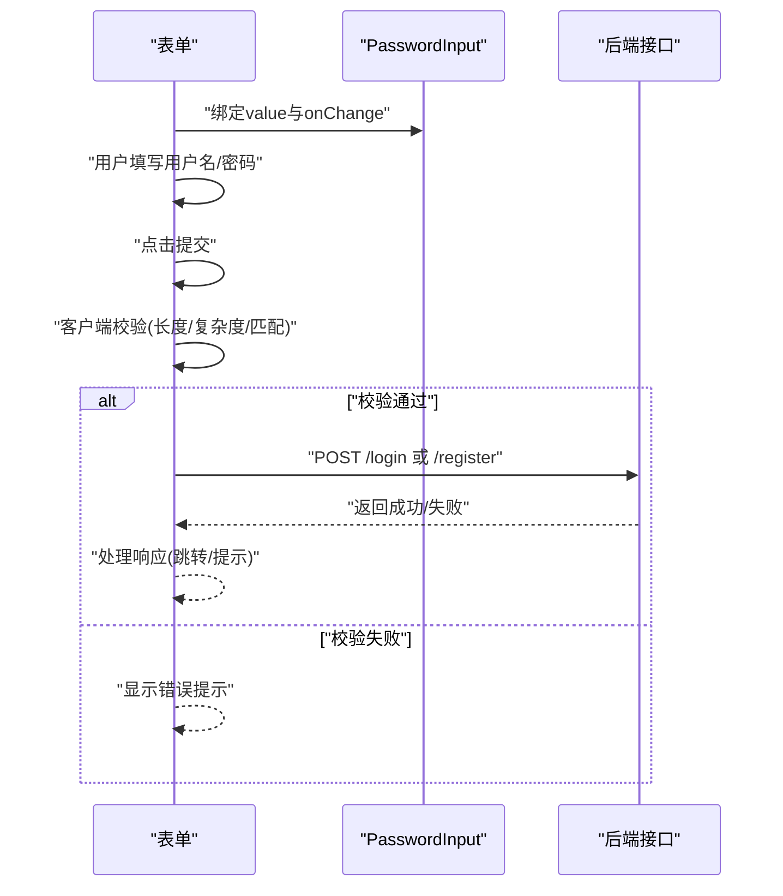
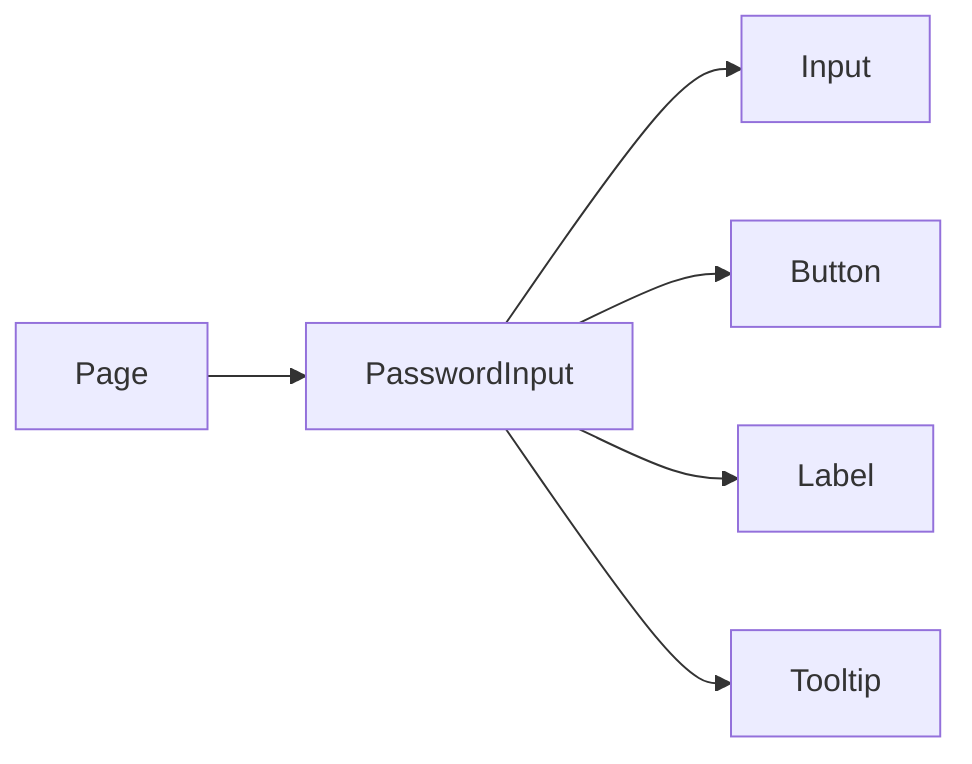

# 密码输入组件

<cite>
**本文引用的文件**   
- [password-input.tsx](file://apps/web/src/components/ui/password-input.tsx)
- [input.tsx](file://apps/web/src/components/ui/input.tsx)
- [button.tsx](file://apps/web/src/components/ui/button.tsx)
- [label.tsx](file://apps/web/src/components/ui/label.tsx)
- [tooltip.tsx](file://apps/web/src/components/ui/tooltip.tsx)
- [page.tsx](file://apps/web/src/app/page.tsx)
</cite>

## 目录
1. [简介](#简介)
2. [项目结构](#项目结构)
3. [核心组件](#核心组件)
4. [架构总览](#架构总览)
5. [详细组件分析](#详细组件分析)
6. [依赖关系分析](#依赖关系分析)
7. [性能考量](#性能考量)
8. [故障排查指南](#故障排查指南)
9. [结论](#结论)
10. [附录](#附录)

## 简介
本文件为密码输入组件（PasswordInput）的完整技术文档，聚焦安全特性与用户体验设计。内容涵盖：
- 密码可见性切换、强度指示器与安全验证规则
- 本地存储安全、输入加密与防暴力破解机制说明
- 密码复杂度校验、实时反馈与安全提示
- 登录表单集成与注册流程中的密码设置示例
- 无障碍访问支持、键盘导航与屏幕阅读器兼容性

## 项目结构
密码输入组件位于前端应用的可复用 UI 层中，作为基础输入控件被页面或业务模块引用。其职责是提供安全的密码输入体验，包括可见性切换、强度提示、错误提示和无障碍属性。

图表来源
- [password-input.tsx:1-200](file://apps/web/src/components/ui/password-input.tsx#L1-L200)
- [input.tsx:1-200](file://apps/web/src/components/ui/input.tsx#L1-L200)
- [button.tsx:1-200](file://apps/web/src/components/ui/button.tsx#L1-L200)
- [label.tsx:1-200](file://apps/web/src/components/ui/label.tsx#L1-L200)
- [tooltip.tsx:1-200](file://apps/web/src/components/ui/tooltip.tsx#L1-L200)
- [page.tsx:1-200](file://apps/web/src/app/page.tsx#L1-L200)

章节来源
- [password-input.tsx:1-200](file://apps/web/src/components/ui/password-input.tsx#L1-L200)
- [input.tsx:1-200](file://apps/web/src/components/ui/input.tsx#L1-L200)
- [button.tsx:1-200](file://apps/web/src/components/ui/button.tsx#L1-L200)
- [label.tsx:1-200](file://apps/web/src/components/ui/label.tsx#L1-L200)
- [tooltip.tsx:1-200](file://apps/web/src/components/ui/tooltip.tsx#L1-L200)
- [page.tsx:1-200](file://apps/web/src/app/page.tsx#L1-L200)

## 核心组件
- PasswordInput：封装密码输入的核心交互，包含可见性切换、强度指示、错误提示、无障碍属性等。
- Input：基础文本输入控件，提供受控值与事件绑定能力。
- Button：用于触发“显示/隐藏”密码的操作。
- Label：为输入框提供可关联的语义化标签。
- Tooltip：为强度指示或提示信息提供辅助说明。

章节来源
- [password-input.tsx:1-200](file://apps/web/src/components/ui/password-input.tsx#L1-L200)
- [input.tsx:1-200](file://apps/web/src/components/ui/input.tsx#L1-L200)
- [button.tsx:1-200](file://apps/web/src/components/ui/button.tsx#L1-L200)
- [label.tsx:1-200](file://apps/web/src/components/ui/label.tsx#L1-L200)
- [tooltip.tsx:1-200](file://apps/web/src/components/ui/tooltip.tsx#L1-L200)

## 架构总览
PasswordInput 通过组合基础 UI 组件实现功能，并与页面层进行数据绑定。整体交互遵循受控组件模式，确保状态由上层管理，组件专注渲染与交互。

图表来源
- [password-input.tsx:1-200](file://apps/web/src/components/ui/password-input.tsx#L1-L200)
- [input.tsx:1-200](file://apps/web/src/components/ui/input.tsx#L1-L200)
- [button.tsx:1-200](file://apps/web/src/components/ui/button.tsx#L1-L200)
- [label.tsx:1-200](file://apps/web/src/components/ui/label.tsx#L1-L200)
- [tooltip.tsx:1-200](file://apps/web/src/components/ui/tooltip.tsx#L1-L200)

## 详细组件分析

### 密码可见性切换
- 行为描述：点击“显示/隐藏”按钮时，切换输入框类型（text/password），并更新按钮的 aria-label 以适配屏幕阅读器。
- 交互要点：
  - 使用受控状态管理 visible 标志位
  - 切换时保持焦点在输入框内，避免用户操作中断
  - 按钮具备清晰的语义化标签和键盘可访问性

图表来源
- [password-input.tsx:1-200](file://apps/web/src/components/ui/password-input.tsx#L1-L200)
- [button.tsx:1-200](file://apps/web/src/components/ui/button.tsx#L1-L200)
- [input.tsx:1-200](file://apps/web/src/components/ui/input.tsx#L1-L200)

章节来源
- [password-input.tsx:1-200](file://apps/web/src/components/ui/password-input.tsx#L1-L200)
- [button.tsx:1-200](file://apps/web/src/components/ui/button.tsx#L1-L200)
- [input.tsx:1-200](file://apps/web/src/components/ui/input.tsx#L1-L200)

### 强度指示器与安全提示
- 行为描述：根据输入的字符集（长度、大小写、数字、特殊字符）计算强度等级，并以可视化进度条或颜色标识展示。
- 规则建议：
  - 最小长度阈值（如≥8）
  - 至少包含大写字母、小写字母、数字、特殊字符中的若干项
  - 实时反馈：每输入一个字符即重新评估强度
- 安全提示：当强度不足时，给出明确改进建议；达到要求后给予正向反馈

图表来源
- [password-input.tsx:1-200](file://apps/web/src/components/ui/password-input.tsx#L1-L200)

章节来源
- [password-input.tsx:1-200](file://apps/web/src/components/ui/password-input.tsx#L1-L200)

### 安全验证规则与实时反馈
- 规则定义：将复杂度规则抽象为可配置对象，便于在不同场景（登录、注册、重置密码）复用。
- 实时反馈：
  - 输入时即时校验并更新错误信息
  - 失焦时再次校验，确保提交前无违规
- 错误提示：
  - 针对具体规则失败给出清晰文案（如“请添加至少一个数字”）
  - 使用语义化错误区域与 aria-invalid 属性

图表来源
- [password-input.tsx:1-200](file://apps/web/src/components/ui/password-input.tsx#L1-L200)

章节来源
- [password-input.tsx:1-200](file://apps/web/src/components/ui/password-input.tsx#L1-L200)

### 登录表单集成与注册流程示例
- 登录表单：
  - 将 PasswordInput 的值与表单状态绑定
  - 提交前执行客户端校验，通过后发起网络请求
- 注册流程：
  - 增加确认密码字段，比对两次输入一致性
  - 注册成功后清空敏感字段，避免残留

图表来源
- [password-input.tsx:1-200](file://apps/web/src/components/ui/password-input.tsx#L1-L200)
- [page.tsx:1-200](file://apps/web/src/app/page.tsx#L1-L200)

章节来源
- [password-input.tsx:1-200](file://apps/web/src/components/ui/password-input.tsx#L1-L200)
- [page.tsx:1-200](file://apps/web/src/app/page.tsx#L1-L200)

### 无障碍访问支持与键盘导航
- 无障碍属性：
  - htmlFor 与 id 关联 Label 与 Input
  - aria-label 描述按钮用途（显示/隐藏）
  - aria-invalid 标记无效状态
  - aria-describedby 指向错误提示元素
- 键盘导航：
  - Tab 顺序合理，Enter/Space 可触发按钮
  - 焦点管理：切换可见性不丢失焦点
- 屏幕阅读器：
  - 错误提示变更时通过 aria-live 区域播报
  - 强度指示使用语义化文本而非仅颜色

章节来源
- [password-input.tsx:1-200](file://apps/web/src/components/ui/password-input.tsx#L1-L200)
- [label.tsx:1-200](file://apps/web/src/components/ui/label.tsx#L1-L200)
- [tooltip.tsx:1-200](file://apps/web/src/components/ui/tooltip.tsx#L1-L200)

## 依赖关系分析
PasswordInput 依赖基础 UI 组件，并通过 props 暴露配置项。页面层负责状态管理与业务逻辑，组件保持高内聚、低耦合。

图表来源
- [password-input.tsx:1-200](file://apps/web/src/components/ui/password-input.tsx#L1-L200)
- [input.tsx:1-200](file://apps/web/src/components/ui/input.tsx#L1-L200)
- [button.tsx:1-200](file://apps/web/src/components/ui/button.tsx#L1-L200)
- [label.tsx:1-200](file://apps/web/src/components/ui/label.tsx#L1-L200)
- [tooltip.tsx:1-200](file://apps/web/src/components/ui/tooltip.tsx#L1-L200)
- [page.tsx:1-200](file://apps/web/src/app/page.tsx#L1-L200)

章节来源
- [password-input.tsx:1-200](file://apps/web/src/components/ui/password-input.tsx#L1-L200)
- [page.tsx:1-200](file://apps/web/src/app/page.tsx#L1-L200)

## 性能考量
- 受控组件优化：避免不必要的重渲染，必要时对 onChange 进行节流或去抖
- 校验策略：仅在输入变化与失焦时执行复杂校验，减少计算开销
- DOM 操作最小化：通过条件渲染与 key 控制更新范围
- 内存管理：及时清理事件监听与定时器（如有）

[本节为通用指导，不直接分析具体文件]

## 故障排查指南
- 常见问题
  - 可见性切换无效：检查按钮 onClick 是否绑定正确，state 是否更新
  - 强度指示不更新：确认 onChange 回调链路与校验函数调用
  - 错误提示未显示：检查 aria-invalid 与错误区域渲染逻辑
  - 键盘不可用：验证按钮 tabIndex 与 Enter/Space 事件处理
- 调试建议
  - 打开浏览器控制台查看 console 日志
  - 使用开发者工具检查 ARIA 属性是否正确设置
  - 模拟慢速输入观察实时反馈延迟

章节来源
- [password-input.tsx:1-200](file://apps/web/src/components/ui/password-input.tsx#L1-L200)

## 结论
PasswordInput 通过组合基础 UI 组件实现了安全的密码输入体验，具备可见性切换、强度指示、实时校验与无障碍支持。建议在业务场景中结合服务端安全策略（速率限制、账号锁定、传输加密）共同构建完整的密码安全体系。

[本节为总结性内容，不直接分析具体文件]

## 附录
- 最佳实践
  - 始终在后端进行密码复杂度与格式校验
  - 禁止将明文密码写入本地存储或日志
  - 使用 HTTPS 与安全的 Cookie 策略
  - 提供“显示密码”选项以提升可用性，但默认隐藏
- 扩展方向
  - 支持多语言错误提示
  - 集成外部密码管理器（自动填充/生成）
  - 增强抗暴力破解（验证码、延迟响应、IP 限流）

[本节为概念性内容，不直接分析具体文件]