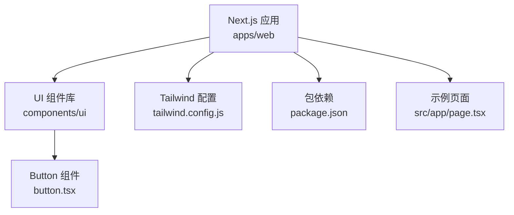
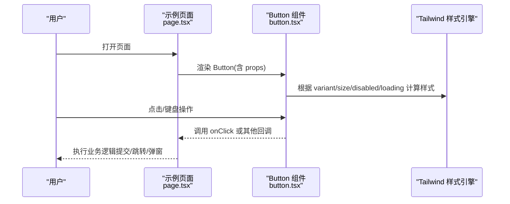
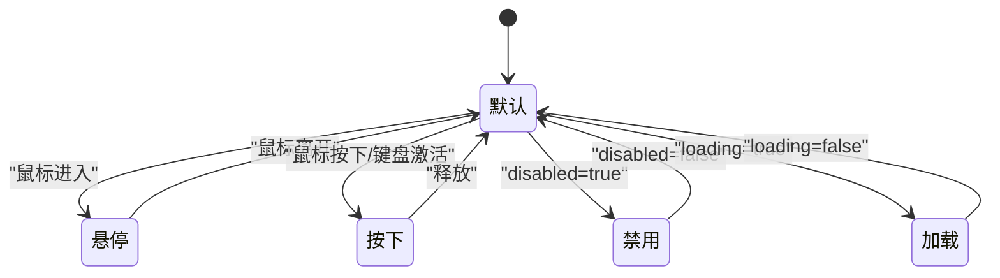
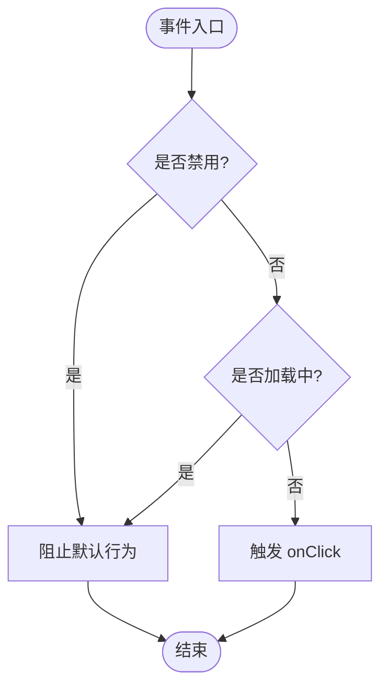
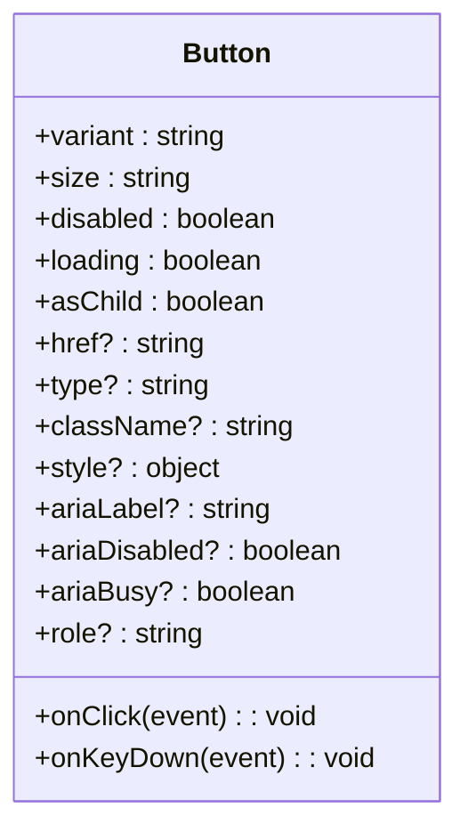
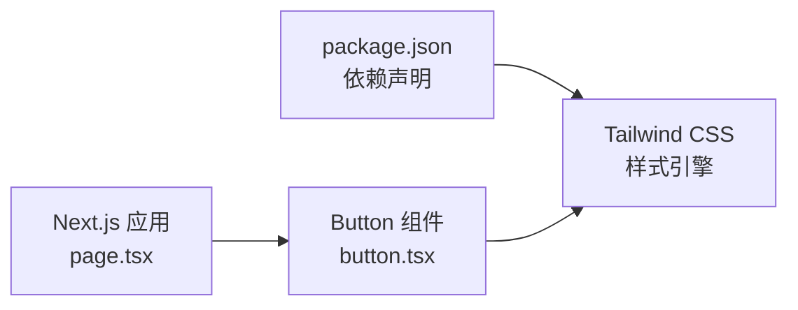

# 按钮组件

<cite>
**本文引用的文件**   
- [button.tsx](file://apps/web/src/components/ui/button.tsx)
- [tailwind.config.js](file://apps/web/tailwind.config.js)
- [package.json](file://apps/web/package.json)
- [page.tsx](file://apps/web/src/app/page.tsx)
</cite>

## 目录
1. [简介](#简介)
2. [项目结构](#项目结构)
3. [核心组件](#核心组件)
4. [架构总览](#架构总览)
5. [详细组件分析](#详细组件分析)
6. [依赖分析](#依赖分析)
7. [性能考虑](#性能考虑)
8. [故障排查指南](#故障排查指南)
9. [结论](#结论)
10. [附录](#附录)

## 简介
本章节为 Button 按钮组件的使用与设计文档，面向前端开发者与产品/设计人员。内容涵盖：
- 功能特性与使用场景（表单提交、导航跳转、模态框触发等）
- Props 接口说明（变体、尺寸、状态、无障碍属性等）
- 样式定制方法（主题色、尺寸、圆角、阴影等）
- 事件处理机制（onClick、键盘导航、可访问性）
- 响应式设计与最佳实践

## 项目结构
Button 组件位于 UI 组件库中，采用 Tailwind CSS 进行样式管理，并通过 Next.js 应用集成。关键路径如下：
- 组件实现：apps/web/src/components/ui/button.tsx
- 样式配置：apps/web/tailwind.config.js
- 包管理与依赖：apps/web/package.json
- 示例页面：apps/web/src/app/page.tsx

图表来源
- [button.tsx](file://apps/web/src/components/ui/button.tsx)
- [tailwind.config.js](file://apps/web/tailwind.config.js)
- [package.json](file://apps/web/package.json)
- [page.tsx](file://apps/web/src/app/page.tsx)

章节来源
- [button.tsx](file://apps/web/src/components/ui/button.tsx)
- [tailwind.config.js](file://apps/web/tailwind.config.js)
- [package.json](file://apps/web/package.json)
- [page.tsx](file://apps/web/src/app/page.tsx)

## 核心组件
本节聚焦 Button 组件的 API 与行为，帮助快速上手与正确集成。

- 组件职责
  - 提供统一的按钮外观与交互
  - 支持多种变体（如 primary、secondary、outline 等）
  - 支持尺寸、禁用、加载等状态
  - 提供无障碍支持与键盘导航
  - 兼容 Tailwind 主题与响应式

- 常用 Props（按类别）
  - 基础
    - variant：变体类型（primary、secondary、outline 等）
    - size：尺寸（sm、md、lg 等）
    - disabled：是否禁用
    - loading：是否显示加载状态
    - asChild：是否将根元素渲染为子组件（用于自定义标签）
  - 事件
    - onClick：点击回调
    - onKeyDown/onKeyPress：键盘事件（Enter/Space 触发）
  - 无障碍
    - aria-label：无障碍标签
    - aria-disabled：禁用语义
    - aria-busy：加载语义
    - role：角色（button 或 link）
  - 样式
    - className：附加类名
    - style：内联样式（谨慎使用）
  - 其他
    - type：表单类型（button、submit、reset）
    - href：当作为链接使用时
    - target：链接目标窗口
    - rel：链接关系（如 nofollow）

- 默认行为
  - 默认渲染为 <button>，可通过 asChild 或 href 改变
  - Enter/Space 键可触发点击
  - 禁用时不可聚焦与触发事件
  - 加载状态下通常禁用交互并展示加载指示

章节来源
- [button.tsx](file://apps/web/src/components/ui/button.tsx)

## 架构总览
Button 组件基于 Tailwind 原子类构建，结合 React 组件化封装，形成统一入口。Next.js 应用中通过导入使用，并在示例页面演示常见用法。

图表来源
- [page.tsx](file://apps/web/src/app/page.tsx)
- [button.tsx](file://apps/web/src/components/ui/button.tsx)
- [tailwind.config.js](file://apps/web/tailwind.config.js)

## 详细组件分析

### 组件结构与状态机
Button 的状态包括：默认、悬停、按下、禁用、加载。不同状态影响样式与交互。

图表来源
- [button.tsx](file://apps/web/src/components/ui/button.tsx)

### 事件处理流程
- 点击事件
  - onClick 回调在用户点击时触发
  - 禁用或加载状态下应阻止默认行为
- 键盘导航
  - Enter/Space 触发点击
  - Tab 聚焦，Esc 失焦（由浏览器默认行为保证）
- 无障碍
  - 使用 aria-* 属性描述状态
  - 确保焦点可见性与语义正确

图表来源
- [button.tsx](file://apps/web/src/components/ui/button.tsx)

### 变体与样式映射
- 变体
  - primary：主按钮，强调主要操作
  - secondary：次要按钮，弱化视觉
  - outline：描边按钮，轻量强调
- 尺寸
  - sm、md、lg：对应不同字号、高度与内边距
- 颜色与主题
  - 通过 Tailwind 配置扩展主题色
  - 支持 hover、active、focus 状态样式

图表来源
- [button.tsx](file://apps/web/src/components/ui/button.tsx)

章节来源
- [button.tsx](file://apps/web/src/components/ui/button.tsx)

### 实际使用示例（场景说明）
以下为常见使用场景的描述性示例，具体代码请参考对应文件的引用位置：
- 表单提交
  - 将 Button 的 type 设置为 submit，配合表单验证与提交逻辑
  - 在 loading 状态下禁用重复提交
- 导航跳转
  - 设置 href 与 target，使 Button 作为链接使用
  - 注意 SEO 与无障碍属性（rel、aria-label）
- 模态框触发
  - onClick 中切换模态框状态
  - 在关闭时恢复焦点到触发按钮

章节来源
- [page.tsx](file://apps/web/src/app/page.tsx)

## 依赖分析
Button 组件依赖 Tailwind CSS 进行样式生成，并在 Next.js 应用中通过模块导入使用。

图表来源
- [package.json](file://apps/web/package.json)
- [tailwind.config.js](file://apps/web/tailwind.config.js)
- [button.tsx](file://apps/web/src/components/ui/button.tsx)
- [page.tsx](file://apps/web/src/app/page.tsx)

章节来源
- [package.json](file://apps/web/package.json)
- [tailwind.config.js](file://apps/web/tailwind.config.js)
- [button.tsx](file://apps/web/src/components/ui/button.tsx)
- [page.tsx](file://apps/web/src/app/page.tsx)

## 性能考虑
- 避免不必要的重渲染：合理拆分组件，减少 props 变化频率
- 懒加载与按需引入：在大项目中对 Button 所在模块进行代码分割
- 样式优化：优先使用 Tailwind 原子类，减少自定义样式冲突
- 事件处理：避免在 onClick 中进行昂贵计算，必要时使用防抖/节流

## 故障排查指南
- 点击无效
  - 检查 disabled/loading 状态是否正确
  - 确认 onClick 是否被阻止（preventDefault）
- 键盘无法触发
  - 确保 Enter/Space 键绑定有效
  - 检查 tabIndex 与焦点顺序
- 样式异常
  - 核对 Tailwind 配置中的主题色与变体映射
  - 检查 className 优先级与覆盖规则
- 无障碍问题
  - 补充 aria-label、aria-disabled、aria-busy
  - 确保屏幕阅读器可读

章节来源
- [button.tsx](file://apps/web/src/components/ui/button.tsx)
- [tailwind.config.js](file://apps/web/tailwind.config.js)

## 结论
Button 组件通过清晰的 Props 接口与丰富的状态/变体支持，为应用提供了统一且易用的交互入口。结合 Tailwind 的主题能力与 Next.js 的工程化优势，可在保证可访问性的同时实现灵活的样式定制与响应式设计。建议在实际使用中遵循无障碍规范与性能最佳实践，以获得一致的用户体验。

## 附录
- 主题定制步骤
  - 在 tailwind.config.js 中扩展 color、fontSize、spacing 等
  - 为 Button 的 variant 定义映射规则
- 响应式适配
  - 使用 Tailwind 断点控制尺寸与布局
  - 在小屏设备上调整间距与字号
- 测试建议
  - 单元测试：验证 props 与状态切换
  - 交互测试：模拟点击与键盘操作
  - 可访问性测试：使用辅助工具校验语义