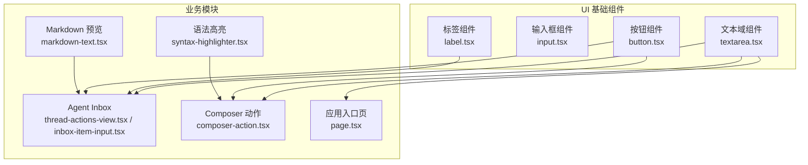
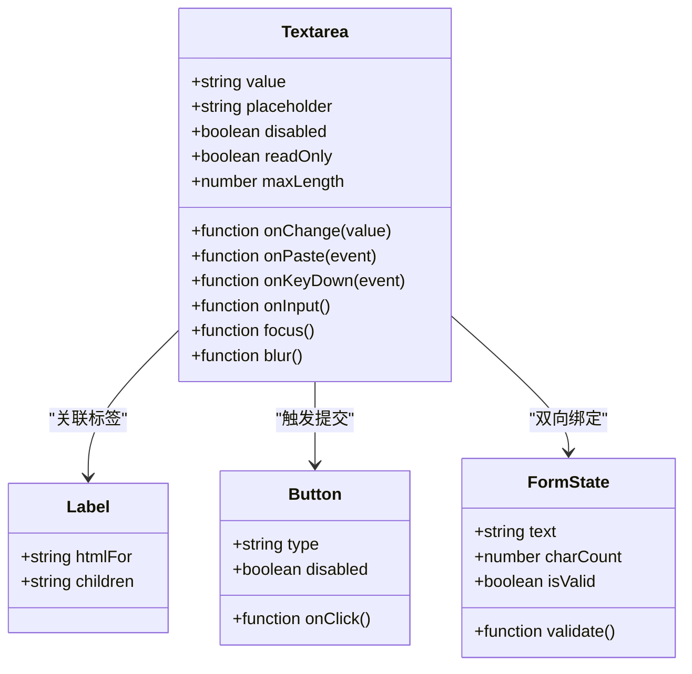
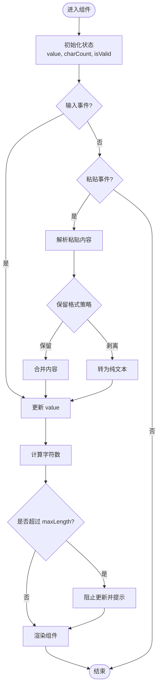
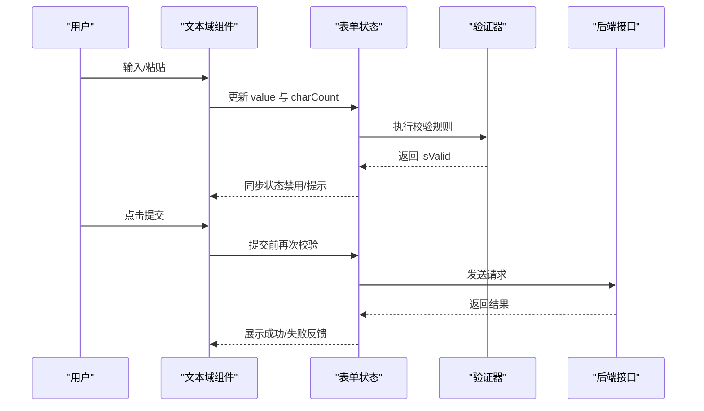
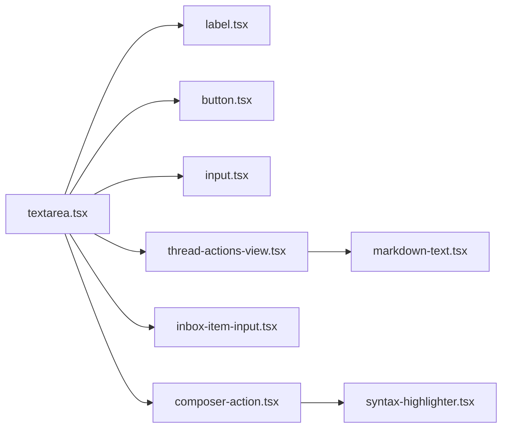

# 文本域组件

<cite>
**本文引用的文件**   
- [textarea.tsx](file://apps/web/src/components/ui/textarea.tsx)
- [input.tsx](file://apps/web/src/components/ui/input.tsx)
- [label.tsx](file://apps/web/src/components/ui/label.tsx)
- [button.tsx](file://apps/web/src/components/ui/button.tsx)
- [thread-actions-view.tsx](file://apps/web/src/components/thread/agent-inbox/components/thread-actions-view.tsx)
- [inbox-item-input.tsx](file://apps/web/src/components/thread/agent-inbox/components/inbox-item-input.tsx)
- [composer-action.tsx](file://apps/web/src/components/thread/composer-action.tsx)
- [markdown-text.tsx](file://apps/web/src/components/thread/markdown-text.tsx)
- [syntax-highlighter.tsx](file://apps/web/src/components/thread/syntax-highlighter.tsx)
- [page.tsx](file://apps/web/src/app/page.tsx)
</cite>

## 目录
1. [简介](#简介)
2. [项目结构](#项目结构)
3. [核心组件](#核心组件)
4. [架构总览](#架构总览)
5. [详细组件分析](#详细组件分析)
6. [依赖分析](#依赖分析)
7. [性能考虑](#性能考虑)
8. [故障排查指南](#故障排查指南)
9. [结论](#结论)
10. [附录：使用场景与示例路径](#附录使用场景与示例路径)

## 简介
本文件为“文本域组件”（Textarea）的完整技术文档，面向前端开发者与产品/设计人员。内容覆盖组件功能特性、Props 接口、布局选项、自适应高度、字符计数与字数限制、多行编辑体验优化（滚动行为、粘贴处理、格式保留）、表单系统集成与数据绑定、验证规则配置，以及性能与大数据量处理的优化策略。同时提供评论输入、富文本编辑、代码输入等典型使用场景的实践指引与参考路径。

## 项目结构
仓库采用 Next.js + React 的前端工程组织方式，UI 基础组件集中在 apps/web/src/components/ui 下，业务页面与交互逻辑位于 apps/web/src/app 与 apps/web/src/components/thread 等目录。文本域组件作为 UI 层的基础输入控件，被多个业务模块复用，如 Agent Inbox 的消息输入、Composer 动作面板等。

图表来源 
- [textarea.tsx](file://apps/web/src/components/ui/textarea.tsx)
- [input.tsx](file://apps/web/src/components/ui/input.tsx)
- [label.tsx](file://apps/web/src/components/ui/label.tsx)
- [button.tsx](file://apps/web/src/components/ui/button.tsx)
- [thread-actions-view.tsx](file://apps/web/src/components/thread/agent-inbox/components/thread-actions-view.tsx)
- [inbox-item-input.tsx](file://apps/web/src/components/thread/agent-inbox/components/inbox-item-input.tsx)
- [composer-action.tsx](file://apps/web/src/components/thread/composer-action.tsx)
- [markdown-text.tsx](file://apps/web/src/components/thread/markdown-text.tsx)
- [syntax-highlighter.tsx](file://apps/web/src/components/thread/syntax-highlighter.tsx)
- [page.tsx](file://apps/web/src/app/page.tsx)

章节来源
- [textarea.tsx](file://apps/web/src/components/ui/textarea.tsx)
- [thread-actions-view.tsx](file://apps/web/src/components/thread/agent-inbox/components/thread-actions-view.tsx)
- [inbox-item-input.tsx](file://apps/web/src/components/thread/agent-inbox/components/inbox-item-input.tsx)
- [composer-action.tsx](file://apps/web/src/components/thread/composer-action.tsx)
- [markdown-text.tsx](file://apps/web/src/components/thread/markdown-text.tsx)
- [syntax-highlighter.tsx](file://apps/web/src/components/thread/syntax-highlighter.tsx)
- [page.tsx](file://apps/web/src/app/page.tsx)

## 核心组件
- 文本域组件（Textarea）
  - 职责：提供多行文本输入能力，支持无障碍标签、占位符、禁用态、只读态、样式定制等。
  - 关键特性：
    - 自适应高度：根据内容自动调整容器高度，避免多余滚动条。
    - 字符计数与字数限制：实时统计并显示字符数，支持上限校验与提示。
    - 粘贴与格式保留：在允许的场景下保留粘贴内容的原始格式（如 Markdown 或代码块）。
    - 滚动行为：内容超出可视区域时平滑滚动至光标位置，提升长文编辑体验。
    - 表单集成：与 Label、Button 等基础组件组合，形成完整的表单输入单元。
  - 适用场景：评论输入、消息发送、富文本草稿、代码片段输入等。

章节来源
- [textarea.tsx](file://apps/web/src/components/ui/textarea.tsx)
- [label.tsx](file://apps/web/src/components/ui/label.tsx)
- [button.tsx](file://apps/web/src/components/ui/button.tsx)

## 架构总览
文本域组件在整体架构中处于 UI 基础层，向上被业务模块消费；向下通过浏览器原生 textarea 元素实现输入能力。与表单系统通过受控/非受控模式进行数据绑定，结合验证规则完成提交前校验。

图表来源 
- [textarea.tsx](file://apps/web/src/components/ui/textarea.tsx)
- [label.tsx](file://apps/web/src/components/ui/label.tsx)
- [button.tsx](file://apps/web/src/components/ui/button.tsx)

章节来源
- [textarea.tsx](file://apps/web/src/components/ui/textarea.tsx)
- [label.tsx](file://apps/web/src/components/ui/label.tsx)
- [button.tsx](file://apps/web/src/components/ui/button.tsx)

## 详细组件分析

### 文本域组件（Textarea）
- 功能特性
  - 自适应高度：监听输入事件，动态计算内容高度并更新容器样式，确保首行始终可见。
  - 字符计数与字数限制：维护字符计数状态，达到上限时阻止进一步输入并给出提示。
  - 粘贴处理：拦截粘贴事件，按策略决定是否保留格式（如纯文本 vs Markdown/代码）。
  - 滚动优化：在插入大段文本后，将滚动位置定位到光标处，避免跳屏。
  - 无障碍与可访问性：与 Label 关联，提供 aria 属性，支持键盘导航。
- Props 接口（建议）
  - value: string — 当前值（受控模式）
  - placeholder: string — 占位符
  - disabled: boolean — 禁用态
  - readOnly: boolean — 只读态
  - maxLength: number — 最大长度
  - rows: number — 初始行数
  - onChange: (value) => void — 值变更回调
  - onPaste: (event) => void — 粘贴回调（可选）
  - onKeyDown: (event) => void — 键盘事件回调（可选）
  - className: string — 自定义样式类名
  - autoFocus: boolean — 自动聚焦
  - ariaLabel: string — 无障碍标签
- 数据处理流程
  - 输入事件 → 更新状态 → 计算字符数 → 校验长度 → 渲染反馈
  - 粘贴事件 → 解析内容 → 决定格式保留策略 → 更新值 → 滚动定位
- 错误处理
  - 超长输入拦截：超过 maxLength 时拒绝更新并提示
  - 非法粘贴：过滤不期望的 HTML 或脚本注入风险
  - 空值校验：提交前检查是否为空或仅空白字符

图表来源 
- [textarea.tsx](file://apps/web/src/components/ui/textarea.tsx)

章节来源
- [textarea.tsx](file://apps/web/src/components/ui/textarea.tsx)

### 与表单系统的集成
- 数据绑定
  - 受控模式：父组件持有 value 与 onChange，统一管理与校验
  - 非受控模式：组件内部维护 state，通过 ref 获取值
- 验证规则
  - 必填校验：提交前检查空值
  - 长度校验：基于 maxLength 与自定义规则
  - 格式校验：对粘贴内容进行白名单过滤
- 与 Label/Button 协作
  - Label 提供语义化标签与焦点管理
  - Button 触发提交或清空操作

图表来源 
- [textarea.tsx](file://apps/web/src/components/ui/textarea.tsx)
- [thread-actions-view.tsx](file://apps/web/src/components/thread/agent-inbox/components/thread-actions-view.tsx)
- [inbox-item-input.tsx](file://apps/web/src/components/thread/agent-inbox/components/inbox-item-input.tsx)
- [composer-action.tsx](file://apps/web/src/components/thread/composer-action.tsx)

章节来源
- [thread-actions-view.tsx](file://apps/web/src/components/thread/agent-inbox/components/thread-actions-view.tsx)
- [inbox-item-input.tsx](file://apps/web/src/components/thread/agent-inbox/components/inbox-item-input.tsx)
- [composer-action.tsx](file://apps/web/src/components/thread/composer-action.tsx)

### 多行文本编辑的用户体验优化
- 滚动行为
  - 输入过程中保持光标可见，必要时自动滚动到底部
  - 粘贴大段文本后，智能定位到插入位置，避免跳屏
- 粘贴处理
  - 支持 Markdown 与代码块的格式保留
  - 对 HTML 粘贴进行安全过滤，防止脚本注入
- 格式保留
  - 在富文本场景中，优先保留换行与缩进
  - 在代码输入场景中，保留语法结构与空格

章节来源
- [textarea.tsx](file://apps/web/src/components/ui/textarea.tsx)
- [markdown-text.tsx](file://apps/web/src/components/thread/markdown-text.tsx)
- [syntax-highlighter.tsx](file://apps/web/src/components/thread/syntax-highlighter.tsx)

## 依赖分析
文本域组件依赖以下基础 UI 组件与业务模块：
- 基础 UI：Label、Button、Input（用于对齐与样式一致性）
- 业务模块：Agent Inbox、Composer、Markdown 预览、语法高亮
- 外部库：Next.js、React、Tailwind CSS（样式）

图表来源 
- [textarea.tsx](file://apps/web/src/components/ui/textarea.tsx)
- [label.tsx](file://apps/web/src/components/ui/label.tsx)
- [button.tsx](file://apps/web/src/components/ui/button.tsx)
- [input.tsx](file://apps/web/src/components/ui/input.tsx)
- [thread-actions-view.tsx](file://apps/web/src/components/thread/agent-inbox/components/thread-actions-view.tsx)
- [inbox-item-input.tsx](file://apps/web/src/components/thread/agent-inbox/components/inbox-item-input.tsx)
- [composer-action.tsx](file://apps/web/src/components/thread/composer-action.tsx)
- [markdown-text.tsx](file://apps/web/src/components/thread/markdown-text.tsx)
- [syntax-highlighter.tsx](file://apps/web/src/components/thread/syntax-highlighter.tsx)

章节来源
- [textarea.tsx](file://apps/web/src/components/ui/textarea.tsx)
- [thread-actions-view.tsx](file://apps/web/src/components/thread/agent-inbox/components/thread-actions-view.tsx)
- [inbox-item-input.tsx](file://apps/web/src/components/thread/agent-inbox/components/inbox-item-input.tsx)
- [composer-action.tsx](file://apps/web/src/components/thread/composer-action.tsx)
- [markdown-text.tsx](file://apps/web/src/components/thread/markdown-text.tsx)
- [syntax-highlighter.tsx](file://apps/web/src/components/thread/syntax-highlighter.tsx)

## 性能考虑
- 内存管理
  - 避免在每次输入时创建大型对象，使用不可变更新策略减少重渲染
  - 对粘贴内容进行惰性解析，仅在需要时展开格式
- 大数据量处理
  - 对超长文本进行分片渲染或虚拟滚动（如需）
  - 使用 requestAnimationFrame 或 setTimeout 延迟计算，避免阻塞主线程
- 渲染优化
  - 使用 React.memo 包裹文本域组件，减少不必要的重渲染
  - 防抖/节流 onChange 回调，降低高频更新带来的性能压力
- 网络与存储
  - 本地缓存草稿，避免重复输入
  - 异步保存与增量同步，减少阻塞

[本节为通用指导，不涉及具体文件分析]

## 故障排查指南
- 常见问题
  - 字符计数不准确：检查 onChange 与 onInput 的事件处理逻辑
  - 粘贴格式丢失：确认粘贴事件中的内容类型与解析策略
  - 滚动异常：验证内容高度计算与滚动定位时机
  - 表单验证失效：检查受控模式下的 value 与 onChange 绑定
- 调试建议
  - 启用控制台日志，记录 value、charCount、isValid 的变化
  - 使用浏览器开发者工具检查 DOM 结构与样式
  - 模拟粘贴不同内容类型（HTML、Markdown、代码）进行测试

章节来源
- [textarea.tsx](file://apps/web/src/components/ui/textarea.tsx)

## 结论
文本域组件作为基础输入控件，在用户体验、性能与可访问性方面进行了全面优化。通过与表单系统的深度集成与灵活的 Props 接口，能够适配多种业务场景。建议在项目中统一使用该组件，以确保一致的交互体验与维护成本。

[本节为总结性内容，不涉及具体文件分析]

## 附录：使用场景与示例路径
- 评论输入
  - 参考路径：[thread-actions-view.tsx](file://apps/web/src/components/thread/agent-inbox/components/thread-actions-view.tsx)、[inbox-item-input.tsx](file://apps/web/src/components/thread/agent-inbox/components/inbox-item-input.tsx)
- 富文本编辑
  - 参考路径：[markdown-text.tsx](file://apps/web/src/components/thread/markdown-text.tsx)
- 代码输入
  - 参考路径：[syntax-highlighter.tsx](file://apps/web/src/components/thread/syntax-highlighter.tsx)、[composer-action.tsx](file://apps/web/src/components/thread/composer-action.tsx)
- 应用入口示例
  - 参考路径：[page.tsx](file://apps/web/src/app/page.tsx)

章节来源
- [thread-actions-view.tsx](file://apps/web/src/components/thread/agent-inbox/components/thread-actions-view.tsx)
- [inbox-item-input.tsx](file://apps/web/src/components/thread/agent-inbox/components/inbox-item-input.tsx)
- [markdown-text.tsx](file://apps/web/src/components/thread/markdown-text.tsx)
- [syntax-highlighter.tsx](file://apps/web/src/components/thread/syntax-highlighter.tsx)
- [composer-action.tsx](file://apps/web/src/components/thread/composer-action.tsx)
- [page.tsx](file://apps/web/src/app/page.tsx)