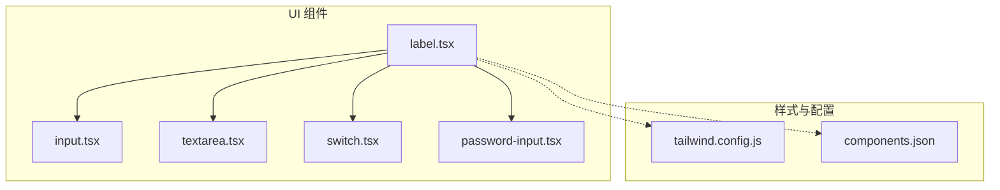
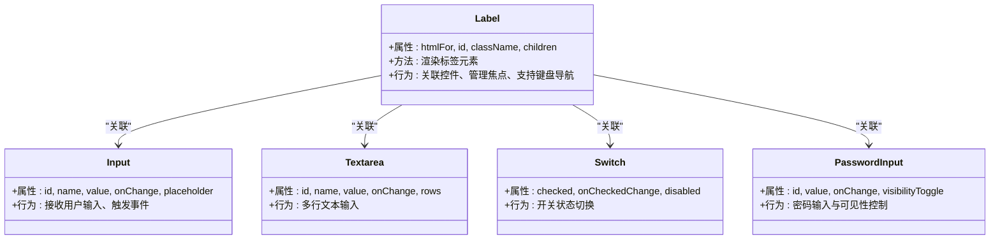
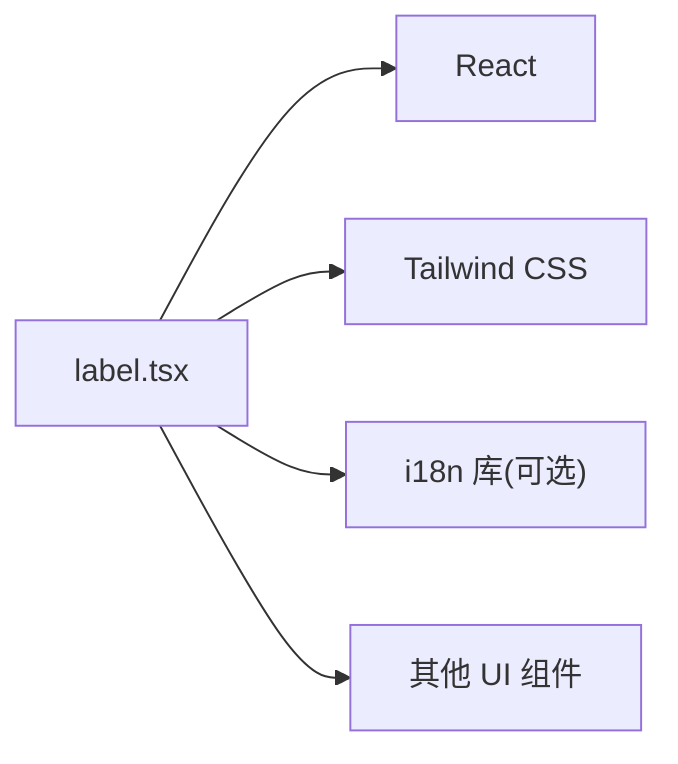

# 标签组件

<cite>
**本文引用的文件**   
- [label.tsx](file://apps/web/src/components/ui/label.tsx)
- [input.tsx](file://apps/web/src/components/ui/input.tsx)
- [textarea.tsx](file://apps/web/src/components/ui/textarea.tsx)
- [switch.tsx](file://apps/web/src/components/ui/switch.tsx)
- [password-input.tsx](file://apps/web/src/components/ui/password-input.tsx)
- [tailwind.config.js](file://apps/web/tailwind.config.js)
- [components.json](file://apps/web/components.json)
</cite>

## 目录
1. [简介](#简介)
2. [项目结构](#项目结构)
3. [核心组件](#核心组件)
4. [架构总览](#架构总览)
5. [详细组件分析](#详细组件分析)
6. [依赖分析](#依赖分析)
7. [性能考虑](#性能考虑)
8. [故障排查指南](#故障排查指南)
9. [结论](#结论)
10. [附录](#附录)

## 简介
本文件面向前端开发者与无障碍（a11y）实践者，系统性梳理 Label 组件的语义化标记、无障碍访问特性以及与表单控件的关联方式。内容涵盖：
- 标签与输入控件的关联策略（for/id、隐式包裹、aria-labelledby/aria-describedby）
- 焦点管理与键盘导航支持
- ARIA 属性使用与屏幕阅读器兼容性
- 视觉呈现优化与主题适配
- 样式定制、响应式设计与多语言环境下的最佳实践
- 实际使用场景：表单标签、描述性标签、辅助信息标签

## 项目结构
Label 组件位于 UI 基础组件目录中，并与常用表单控件共同构成可复用的表单交互单元。Tailwind CSS 提供样式能力，组件通过配置进行主题扩展。

图表来源
- [label.tsx](file://apps/web/src/components/ui/label.tsx)
- [input.tsx](file://apps/web/src/components/ui/input.tsx)
- [textarea.tsx](file://apps/web/src/components/ui/textarea.tsx)
- [switch.tsx](file://apps/web/src/components/ui/switch.tsx)
- [password-input.tsx](file://apps/web/src/components/ui/password-input.tsx)
- [tailwind.config.js](file://apps/web/tailwind.config.js)
- [components.json](file://apps/web/components.json)

章节来源
- [label.tsx](file://apps/web/src/components/ui/label.tsx)
- [tailwind.config.js](file://apps/web/tailwind.config.js)
- [components.json](file://apps/web/components.json)

## 核心组件
- Label 组件职责
  - 提供语义化的标签元素，用于描述相邻或关联的表单控件
  - 支持多种关联方式：显式 for/id、隐式包裹、以及 aria-labelledby/aria-describedby
  - 保持与屏幕阅读器的良好兼容，确保焦点与键盘操作顺畅
  - 提供可扩展的样式接口，便于主题定制与响应式布局

- 典型用法模式
  - 表单标签：将 Label 与 input/textarea/switch 等控件配对，提升可读性与可用性
  - 描述性标签：为复杂控件提供额外说明，增强理解度
  - 辅助信息标签：展示帮助文本、错误提示或动态更新内容

章节来源
- [label.tsx](file://apps/web/src/components/ui/label.tsx)
- [input.tsx](file://apps/web/src/components/ui/input.tsx)
- [textarea.tsx](file://apps/web/src/components/ui/textarea.tsx)
- [switch.tsx](file://apps/web/src/components/ui/switch.tsx)
- [password-input.tsx](file://apps/web/src/components/ui/password-input.tsx)

## 架构总览
Label 作为 UI 层的基础组件，遵循“语义优先、无障碍优先”的设计原则，通过 HTML 原生语义与 ARIA 属性协同工作，确保在不同设备与辅助技术下的一致性体验。

图表来源
- [label.tsx](file://apps/web/src/components/ui/label.tsx)
- [input.tsx](file://apps/web/src/components/ui/input.tsx)
- [textarea.tsx](file://apps/web/src/components/ui/textarea.tsx)
- [switch.tsx](file://apps/web/src/components/ui/switch.tsx)
- [password-input.tsx](file://apps/web/src/components/ui/password-input.tsx)

## 详细组件分析

### 标签与表单控件的关联方式
- 显式关联（推荐）
  - 使用 htmlFor 与控件 id 建立一一对应关系，确保点击标签可聚焦对应控件
  - 适用于所有原生表单控件（input、textarea、select、button 等）
- 隐式包裹
  - 将控件置于 Label 内部，无需 for/id 即可自动关联
  - 适合简单场景，但需注意嵌套结构与可访问性
- ARIA 关联
  - 使用 aria-labelledby 指向标签元素的 id
  - 使用 aria-describedby 指向描述文本的 id，提供补充说明
  - 适用于复杂控件或动态生成的界面

章节来源
- [label.tsx](file://apps/web/src/components/ui/label.tsx)
- [input.tsx](file://apps/web/src/components/ui/input.tsx)
- [textarea.tsx](file://apps/web/src/components/ui/textarea.tsx)
- [switch.tsx](file://apps/web/src/components/ui/switch.tsx)
- [password-input.tsx](file://apps/web/src/components/ui/password-input.tsx)

### 焦点管理与键盘导航支持
- 焦点管理
  - 点击标签应将焦点移至关联控件
  - 避免在标签上设置 tabindex 导致焦点顺序混乱
- 键盘导航
  - 支持 Tab 键在控件间移动
  - 对于组合控件（如 switch），确保 Enter/Space 键可触发状态切换
- 无障碍反馈
  - 使用合适的 ARIA 状态（aria-checked、aria-invalid 等）
  - 动态更新时通知屏幕阅读器（如 aria-live）

章节来源
- [label.tsx](file://apps/web/src/components/ui/label.tsx)
- [switch.tsx](file://apps/web/src/components/ui/switch.tsx)
- [password-input.tsx](file://apps/web/src/components/ui/password-input.tsx)

### ARIA 属性与屏幕阅读器兼容性
- 必要属性
  - htmlFor/id：建立标签与控件关联
  - aria-labelledby：为控件指定标签
  - aria-describedby：为控件提供描述信息
- 状态属性
  - aria-checked：表示开关类控件的状态
  - aria-invalid：表示验证失败状态
  - aria-required：表示必填字段
- 屏幕阅读器测试
  - 使用 NVDA、JAWS、VoiceOver 等工具验证朗读顺序与内容
  - 确保动态内容更新能被正确播报

章节来源
- [label.tsx](file://apps/web/src/components/ui/label.tsx)
- [switch.tsx](file://apps/web/src/components/ui/switch.tsx)
- [password-input.tsx](file://apps/web/src/components/ui/password-input.tsx)

### 视觉呈现优化与主题适配
- 样式定制
  - 通过 className 覆盖默认样式
  - 使用 Tailwind 原子类实现快速样式调整
- 主题适配
  - 基于 CSS 变量或 Tailwind 配置定义颜色、字体、间距
  - 支持深色模式与高对比度主题
- 响应式设计
  - 在小屏幕上调整标签位置与大小
  - 确保触摸目标尺寸符合无障碍标准

章节来源
- [tailwind.config.js](file://apps/web/tailwind.config.js)
- [components.json](file://apps/web/components.json)
- [label.tsx](file://apps/web/src/components/ui/label.tsx)

### 国际化支持与多语言最佳实践
- 文本提取
  - 将标签文案从代码中分离，使用 i18n 库管理翻译
- 动态内容
  - 支持运行时更新标签文本，确保屏幕阅读器能读取最新内容
- 方向性支持
  - 为 RTL 语言提供镜像布局
- 本地化测试
  - 验证不同语言下的文本长度与换行效果

章节来源
- [label.tsx](file://apps/web/src/components/ui/label.tsx)

## 依赖分析
Label 组件依赖以下外部资源与配置：
- React：组件框架
- Tailwind CSS：样式系统
- 可能的 i18n 库：国际化支持

图表来源
- [label.tsx](file://apps/web/src/components/ui/label.tsx)
- [tailwind.config.js](file://apps/web/tailwind.config.js)

章节来源
- [label.tsx](file://apps/web/src/components/ui/label.tsx)
- [tailwind.config.js](file://apps/web/tailwind.config.js)

## 性能考虑
- 避免不必要的重渲染
  - 使用 React.memo 包裹 Label 组件
  - 减少 props 变化频率
- 样式优化
  - 利用 Tailwind 的 JIT 编译减少 CSS 体积
  - 避免过度嵌套样式类
- 无障碍性能
  - 合理使用 aria-live，避免频繁更新导致卡顿
  - 延迟加载复杂描述内容

[本节为通用指导，不直接分析具体文件]

## 故障排查指南
常见问题与解决方案：
- 标签无法聚焦控件
  - 检查 htmlFor 与 id 是否匹配
  - 确认控件未被禁用或隐藏
- 屏幕阅读器未朗读描述
  - 验证 aria-describedby 是否正确指向描述元素
  - 确保描述元素具有正确的语义
- 键盘导航异常
  - 检查 tabIndex 设置是否合理
  - 验证事件处理函数是否正确绑定
- 样式冲突
  - 使用浏览器开发者工具检查样式优先级
  - 避免全局样式覆盖组件样式

章节来源
- [label.tsx](file://apps/web/src/components/ui/label.tsx)
- [input.tsx](file://apps/web/src/components/ui/input.tsx)
- [textarea.tsx](file://apps/web/src/components/ui/textarea.tsx)
- [switch.tsx](file://apps/web/src/components/ui/switch.tsx)
- [password-input.tsx](file://apps/web/src/components/ui/password-input.tsx)

## 结论
Label 组件是构建可访问表单界面的基石。通过正确使用语义化标记、ARIA 属性和键盘导航支持，可以显著提升用户体验。结合 Tailwind CSS 的灵活样式能力和国际化支持，能够适应各种设计需求和使用场景。建议在实际项目中遵循本文的最佳实践，确保无障碍性和可维护性。

[本节为总结性内容，不直接分析具体文件]

## 附录

### 实际使用场景示例

#### 表单标签
- 基本用法：Label 与 input 关联
- 必填字段：添加 required 和 aria-required
- 错误状态：使用 aria-invalid 和错误消息

章节来源
- [label.tsx](file://apps/web/src/components/ui/label.tsx)
- [input.tsx](file://apps/web/src/components/ui/input.tsx)

#### 描述性标签
- 复杂控件：使用 aria-describedby 提供详细说明
- 帮助文本：在标签下方显示辅助信息
- 动态更新：根据用户选择更新描述内容

章节来源
- [label.tsx](file://apps/web/src/components/ui/label.tsx)
- [textarea.tsx](file://apps/web/src/components/ui/textarea.tsx)

#### 辅助信息标签
- 验证提示：实时显示输入验证结果
- 状态指示：显示加载、成功、失败等状态
- 多语言支持：根据用户语言切换提示文本

章节来源
- [label.tsx](file://apps/web/src/components/ui/label.tsx)
- [password-input.tsx](file://apps/web/src/components/ui/password-input.tsx)

### 样式定制选项
- 自定义类名：通过 className 属性应用自定义样式
- Tailwind 集成：使用原子类快速调整外观
- 主题变量：基于 CSS 变量实现主题切换

章节来源
- [tailwind.config.js](file://apps/web/tailwind.config.js)
- [components.json](file://apps/web/components.json)
- [label.tsx](file://apps/web/src/components/ui/label.tsx)

### 响应式设计最佳实践
- 移动端优化：增大触摸目标尺寸
- 自适应布局：根据屏幕尺寸调整标签位置
- 字体缩放：支持用户自定义字体大小

[本节为通用指导，不直接分析具体文件]