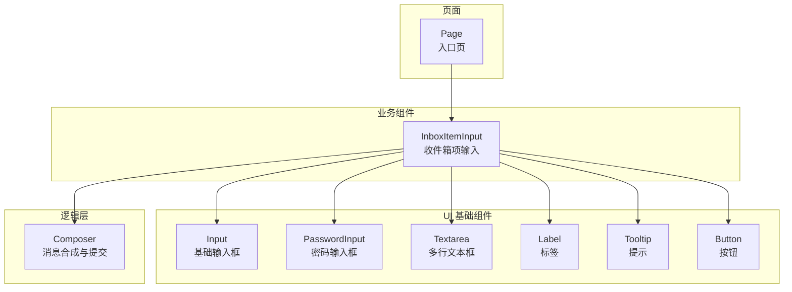
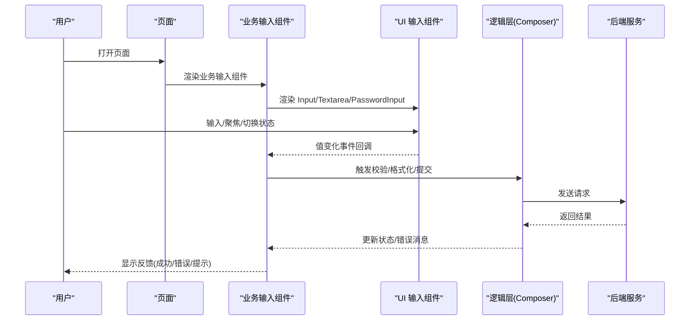
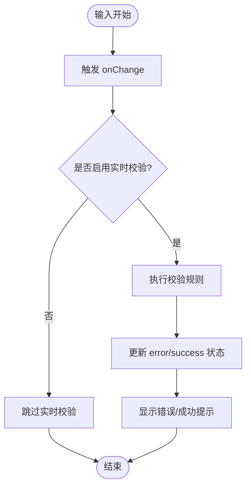
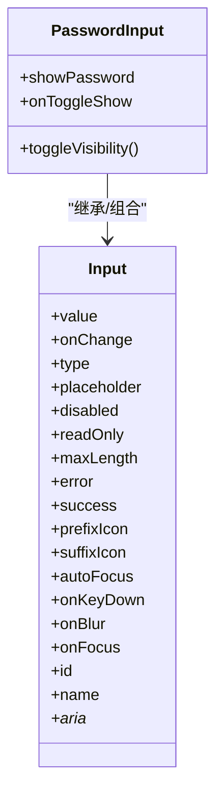
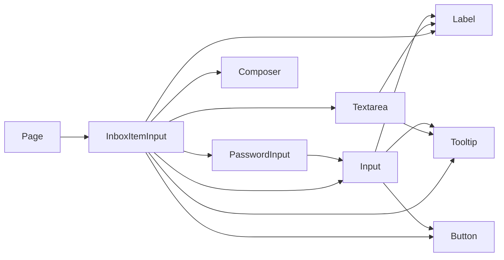

# 输入框组件

<cite>
**本文引用的文件**   
- [apps/web/src/components/ui/input.tsx](file://apps/web/src/components/ui/input.tsx)
- [apps/web/src/components/ui/password-input.tsx](file://apps/web/src/components/ui/password-input.tsx)
- [apps/web/src/components/thread/agent-inbox/components/inbox-item-input.tsx](file://apps/web/src/components/thread/agent-inbox/components/inbox-item-input.tsx)
- [apps/web/src/components/ui/textarea.tsx](file://apps/web/src/components/ui/textarea.tsx)
- [apps/web/src/components/ui/button.tsx](file://apps/web/src/components/ui/button.tsx)
- [apps/web/src/components/ui/label.tsx](file://apps/web/src/components/ui/label.tsx)
- [apps/web/src/components/ui/tooltip.tsx](file://apps/web/src/components/ui/tooltip.tsx)
- [apps/web/src/lib/composer.ts](file://apps/web/src/lib/composer.ts)
- [apps/web/src/app/page.tsx](file://apps/web/src/app/page.tsx)
</cite>

## 目录
1. [简介](#简介)
2. [项目结构](#项目结构)
3. [核心组件](#核心组件)
4. [架构总览](#架构总览)
5. [详细组件分析](#详细组件分析)
6. [依赖关系分析](#依赖关系分析)
7. [性能考量](#性能考量)
8. [故障排查指南](#故障排查指南)
9. [结论](#结论)
10. [附录：使用示例与最佳实践](#附录使用示例与最佳实践)

## 简介
本文件为“输入框组件”的权威文档，聚焦于 Input 及其相关输入类组件（密码输入、文本域等）的功能特性、Props 接口、验证机制、状态表现、表单集成模式（受控与非受控）、键盘快捷键、自动完成能力以及性能优化建议。文档面向不同技术背景的读者，提供从概念到代码级实现的渐进式说明，并给出常见场景的使用指引与排错方法。

## 项目结构
输入框相关实现位于前端应用 apps/web 中，UI 层采用组件化组织方式，Input 基础组件位于 ui 子目录，业务场景中通过组合与封装复用。关键路径如下：
- UI 基础输入组件：input.tsx、password-input.tsx、textarea.tsx
- 标签与提示：label.tsx、tooltip.tsx
- 按钮与交互：button.tsx
- 业务输入场景：inbox-item-input.tsx（用于对话/任务输入）
- 输入处理逻辑：composer.ts（消息合成与提交流程）
- 页面集成：page.tsx（入口页展示与调用）

图表来源
- [apps/web/src/components/ui/input.tsx](file://apps/web/src/components/ui/input.tsx)
- [apps/web/src/components/ui/password-input.tsx](file://apps/web/src/components/ui/password-input.tsx)
- [apps/web/src/components/ui/textarea.tsx](file://apps/web/src/components/ui/textarea.tsx)
- [apps/web/src/components/ui/label.tsx](file://apps/web/src/components/ui/label.tsx)
- [apps/web/src/components/ui/tooltip.tsx](file://apps/web/src/components/ui/tooltip.tsx)
- [apps/web/src/components/ui/button.tsx](file://apps/web/src/components/ui/button.tsx)
- [apps/web/src/components/thread/agent-inbox/components/inbox-item-input.tsx](file://apps/web/src/components/thread/agent-inbox/components/inbox-item-input.tsx)
- [apps/web/src/lib/composer.ts](file://apps/web/src/lib/composer.ts)
- [apps/web/src/app/page.tsx](file://apps/web/src/app/page.tsx)

章节来源
- [apps/web/src/components/ui/input.tsx](file://apps/web/src/components/ui/input.tsx)
- [apps/web/src/components/ui/password-input.tsx](file://apps/web/src/components/ui/password-input.tsx)
- [apps/web/src/components/ui/textarea.tsx](file://apps/web/src/components/ui/textarea.tsx)
- [apps/web/src/components/ui/label.tsx](file://apps/web/src/components/ui/label.tsx)
- [apps/web/src/components/ui/tooltip.tsx](file://apps/web/src/components/ui/tooltip.tsx)
- [apps/web/src/components/ui/button.tsx](file://apps/web/src/components/ui/button.tsx)
- [apps/web/src/components/thread/agent-inbox/components/inbox-item-input.tsx](file://apps/web/src/components/thread/agent-inbox/components/inbox-item-input.tsx)
- [apps/web/src/lib/composer.ts](file://apps/web/src/lib/composer.ts)
- [apps/web/src/app/page.tsx](file://apps/web/src/app/page.tsx)

## 核心组件
- Input：基础单行输入框，支持多种 HTML input 类型（如 text、email、number、password 等），具备聚焦、禁用、占位符、前缀/后缀图标、错误/成功状态、只读等常用能力。
- PasswordInput：在 Input 基础上增加密码可见性切换、安全掩码显示等能力。
- Textarea：多行文本输入，适合长文本编辑，支持自适应高度、换行处理等。
- Label：与输入框关联的标签，提升可访问性与可用性。
- Tooltip：辅助提示，常用于帮助信息或校验反馈。
- Button：触发提交、清空、展开等操作。

章节来源
- [apps/web/src/components/ui/input.tsx](file://apps/web/src/components/ui/input.tsx)
- [apps/web/src/components/ui/password-input.tsx](file://apps/web/src/components/ui/password-input.tsx)
- [apps/web/src/components/ui/textarea.tsx](file://apps/web/src/components/ui/textarea.tsx)
- [apps/web/src/components/ui/label.tsx](file://apps/web/src/components/ui/label.tsx)
- [apps/web/src/components/ui/tooltip.tsx](file://apps/web/src/components/ui/tooltip.tsx)
- [apps/web/src/components/ui/button.tsx](file://apps/web/src/components/ui/button.tsx)

## 架构总览
输入框组件在 UI 层提供基础能力，业务组件通过组合这些基础组件实现具体场景；逻辑层负责数据绑定、校验与提交；页面层进行集成与展示。整体遵循“基础组件 → 业务组件 → 逻辑层 → 页面”的分层设计。

图表来源
- [apps/web/src/app/page.tsx](file://apps/web/src/app/page.tsx)
- [apps/web/src/components/thread/agent-inbox/components/inbox-item-input.tsx](file://apps/web/src/components/thread/agent-inbox/components/inbox-item-input.tsx)
- [apps/web/src/components/ui/input.tsx](file://apps/web/src/components/ui/input.tsx)
- [apps/web/src/components/ui/textarea.tsx](file://apps/web/src/components/ui/textarea.tsx)
- [apps/web/src/components/ui/password-input.tsx](file://apps/web/src/components/ui/password-input.tsx)
- [apps/web/src/lib/composer.ts](file://apps/web/src/lib/composer.ts)

## 详细组件分析

### Input 组件分析
- 功能特性
  - 输入类型：text、email、number、password、tel、url 等（由 HTML input type 驱动）
  - 状态：聚焦、禁用、只读、错误、成功、加载（可通过 className 或 props 控制）
  - 外观：占位符、前缀/后缀图标、边框样式、尺寸变体
  - 行为：防抖输入、最大长度限制、字符计数、自动聚焦、Tab 导航
- Props 接口（典型字段）
  - value / onChange：受控值与变更回调
  - defaultValue：非受控初始值
  - type：输入类型
  - placeholder：占位符
  - disabled / readOnly：禁用与只读
  - maxLength：最大长度
  - error / success：错误/成功状态
  - prefixIcon / suffixIcon：前后缀图标
  - autoFocus：自动聚焦
  - onKeyDown：键盘事件
  - onBlur / onFocus：焦点事件
  - id / name / aria-*：可访问性属性
- 验证机制
  - 内置浏览器原生验证（required、pattern、min/max、step 等）
  - 自定义校验规则（onChange/onBlur 时触发，结合 error 状态显示）
  - 实时反馈与延迟校验（防抖）
- 键盘快捷键
  - Enter 提交（可由父组件监听）
  - Esc 取消/清空（可选）
  - Tab/Shift+Tab 导航
- 自动完成
  - 基于浏览器 autocomplete 属性（如 email、username、new-password 等）
  - 可扩展为下拉建议列表（需上层实现）

图表来源
- [apps/web/src/components/ui/input.tsx](file://apps/web/src/components/ui/input.tsx)

章节来源
- [apps/web/src/components/ui/input.tsx](file://apps/web/src/components/ui/input.tsx)

### PasswordInput 组件分析
- 功能特性
  - 在 Input 基础上增加密码可见性切换（显示/隐藏）
  - 默认使用 password 类型，支持切换为 text 以预览输入
  - 安全考虑：避免日志输出明文密码
- Props 接口（典型字段）
  - 继承 Input 所有属性
  - showPassword：是否显示明文
  - onToggleShow：切换可见性回调
- 使用场景
  - 登录注册、修改密码、敏感信息输入

图表来源
- [apps/web/src/components/ui/input.tsx](file://apps/web/src/components/ui/input.tsx)
- [apps/web/src/components/ui/password-input.tsx](file://apps/web/src/components/ui/password-input.tsx)

章节来源
- [apps/web/src/components/ui/password-input.tsx](file://apps/web/src/components/ui/password-input.tsx)

### Textarea 组件分析
- 功能特性
  - 多行文本输入，支持换行、粘贴富文本过滤（可选）
  - 自适应高度（根据内容增长）
  - 最大行数/最小行数限制
- Props 接口（典型字段）
  - value / onChange
  - rows / minRows / maxRows
  - placeholder
  - disabled / readOnly
  - maxLength
  - error / success
  - autoResize
- 使用场景
  - 评论、描述、备注、长文本编辑

章节来源
- [apps/web/src/components/ui/textarea.tsx](file://apps/web/src/components/ui/textarea.tsx)

### 业务输入组件：InboxItemInput
- 职责
  - 组合 Input/Textarea/PasswordInput 与 Button/Label/Tooltip
  - 管理本地状态（值、错误、提交中）
  - 调用逻辑层（Composer）进行提交
- 交互流程
  - 用户输入 → 实时校验 → 提交 → 显示反馈
- 键盘支持
  - Enter 提交（可配置）
  - Shift+Enter 插入换行（Textarea）

章节来源
- [apps/web/src/components/thread/agent-inbox/components/inbox-item-input.tsx](file://apps/web/src/components/thread/agent-inbox/components/inbox-item-input.tsx)

### 逻辑层：Composer
- 职责
  - 接收输入值，执行格式化与校验
  - 组装请求参数，调用后端 API
  - 处理响应与错误，更新 UI 状态
- 关键点
  - 防抖与节流：避免频繁请求
  - 错误边界：捕获异常并友好提示
  - 重试机制：网络失败时的重试策略

章节来源
- [apps/web/src/lib/composer.ts](file://apps/web/src/lib/composer.ts)

## 依赖关系分析
- UI 组件依赖
  - Input 依赖 Label、Tooltip、Button（可选）
  - PasswordInput 依赖 Input
  - Textarea 独立，可与 Label/Tooltip 组合
- 业务组件依赖
  - InboxItemInput 依赖 Input/Textarea/PasswordInput、Button、Label、Tooltip
  - 依赖 Composer 进行数据提交
- 页面集成
  - page.tsx 引入业务组件并挂载

图表来源
- [apps/web/src/components/ui/input.tsx](file://apps/web/src/components/ui/input.tsx)
- [apps/web/src/components/ui/password-input.tsx](file://apps/web/src/components/ui/password-input.tsx)
- [apps/web/src/components/ui/textarea.tsx](file://apps/web/src/components/ui/textarea.tsx)
- [apps/web/src/components/ui/label.tsx](file://apps/web/src/components/ui/label.tsx)
- [apps/web/src/components/ui/tooltip.tsx](file://apps/web/src/components/ui/tooltip.tsx)
- [apps/web/src/components/ui/button.tsx](file://apps/web/src/components/ui/button.tsx)
- [apps/web/src/components/thread/agent-inbox/components/inbox-item-input.tsx](file://apps/web/src/components/thread/agent-inbox/components/inbox-item-input.tsx)
- [apps/web/src/lib/composer.ts](file://apps/web/src/lib/composer.ts)
- [apps/web/src/app/page.tsx](file://apps/web/src/app/page.tsx)

章节来源
- [apps/web/src/components/ui/input.tsx](file://apps/web/src/components/ui/input.tsx)
- [apps/web/src/components/ui/password-input.tsx](file://apps/web/src/components/ui/password-input.tsx)
- [apps/web/src/components/ui/textarea.tsx](file://apps/web/src/components/ui/textarea.tsx)
- [apps/web/src/components/ui/label.tsx](file://apps/web/src/components/ui/label.tsx)
- [apps/web/src/components/ui/tooltip.tsx](file://apps/web/src/components/ui/tooltip.tsx)
- [apps/web/src/components/ui/button.tsx](file://apps/web/src/components/ui/button.tsx)
- [apps/web/src/components/thread/agent-inbox/components/inbox-item-input.tsx](file://apps/web/src/components/thread/agent-inbox/components/inbox-item-input.tsx)
- [apps/web/src/lib/composer.ts](file://apps/web/src/lib/composer.ts)
- [apps/web/src/app/page.tsx](file://apps/web/src/app/page.tsx)

## 性能考量
- 输入防抖：对高频 onChange 进行防抖，减少校验与重渲染
- 条件渲染：仅在需要时渲染复杂图标或提示
- 虚拟滚动：长列表中的输入框按需渲染
- 内存管理：及时解绑事件监听器，避免泄漏
- 网络优化：合并请求、缓存结果、失败重试
- 可访问性：确保键盘导航与屏幕阅读器兼容

[本节为通用指导，不直接分析具体文件]

## 故障排查指南
- 常见问题
  - 输入无响应：检查 onChange 是否正确绑定，是否存在受控/非受控混用
  - 校验不生效：确认校验时机（onChange/onBlur）与规则配置
  - 错误消息不显示：检查 error 状态与提示组件渲染逻辑
  - 密码不可见：确认 PasswordInput 的 showPassword 状态与切换逻辑
  - 提交失败：查看 Composer 的错误处理与网络状态
- 调试建议
  - 打印关键状态（value、error、loading）
  - 使用浏览器开发者工具检查 DOM 属性与事件
  - 模拟网络失败与超时，验证恢复逻辑

章节来源
- [apps/web/src/components/ui/input.tsx](file://apps/web/src/components/ui/input.tsx)
- [apps/web/src/components/ui/password-input.tsx](file://apps/web/src/components/ui/password-input.tsx)
- [apps/web/src/components/ui/textarea.tsx](file://apps/web/src/components/ui/textarea.tsx)
- [apps/web/src/components/thread/agent-inbox/components/inbox-item-input.tsx](file://apps/web/src/components/thread/agent-inbox/components/inbox-item-input.tsx)
- [apps/web/src/lib/composer.ts](file://apps/web/src/lib/composer.ts)

## 结论
Input 及相关输入组件提供了完整的基础能力与扩展点，适用于多种业务场景。通过合理的 Props 设计、校验机制与状态管理，可实现良好的用户体验与可维护性。建议在业务组件中统一封装校验与提交流程，并结合 Composer 进行逻辑集中管理，以提升一致性与性能。

[本节为总结，不直接分析具体文件]

## 附录：使用示例与最佳实践
- 文本输入
  - 受控组件：通过 value 与 onChange 管理状态
  - 非受控组件：使用 defaultValue 与 ref 获取值
- 数字输入
  - type="number"，设置 min/max/step，配合校验规则
- 邮箱验证
  - type="email"，使用 pattern 或自定义正则校验
- 密码输入
  - 使用 PasswordInput，开启可见性切换
- 多行文本
  - 使用 Textarea，设置自适应高度与最大行数
- 键盘快捷键
  - Enter 提交，Esc 取消，Shift+Enter 换行
- 自动完成
  - 利用浏览器 autocomplete 属性，或实现下拉建议列表
- 错误反馈
  - 实时校验与失焦校验结合，错误消息清晰明确
- 性能优化
  - 防抖输入、条件渲染、网络请求合并与重试

章节来源
- [apps/web/src/components/ui/input.tsx](file://apps/web/src/components/ui/input.tsx)
- [apps/web/src/components/ui/password-input.tsx](file://apps/web/src/components/ui/password-input.tsx)
- [apps/web/src/components/ui/textarea.tsx](file://apps/web/src/components/ui/textarea.tsx)
- [apps/web/src/components/thread/agent-inbox/components/inbox-item-input.tsx](file://apps/web/src/components/thread/agent-inbox/components/inbox-item-input.tsx)
- [apps/web/src/lib/composer.ts](file://apps/web/src/lib/composer.ts)
- [apps/web/src/app/page.tsx](file://apps/web/src/app/page.tsx)