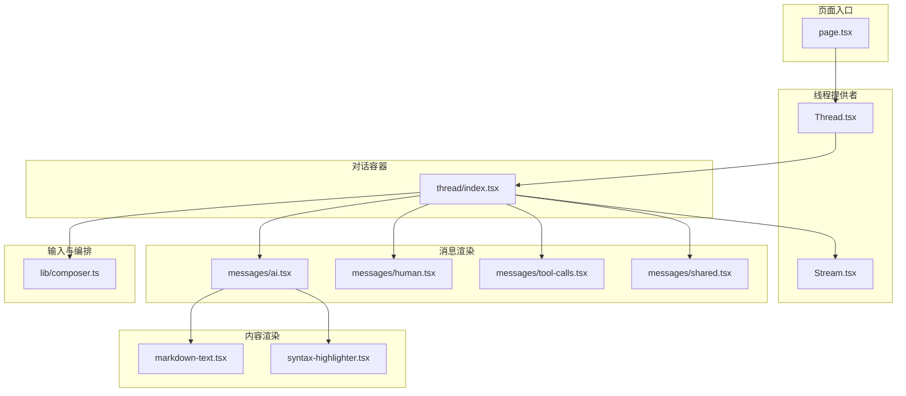
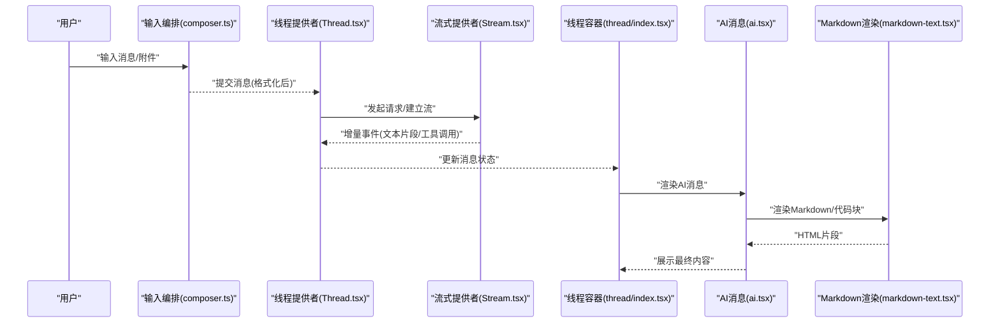
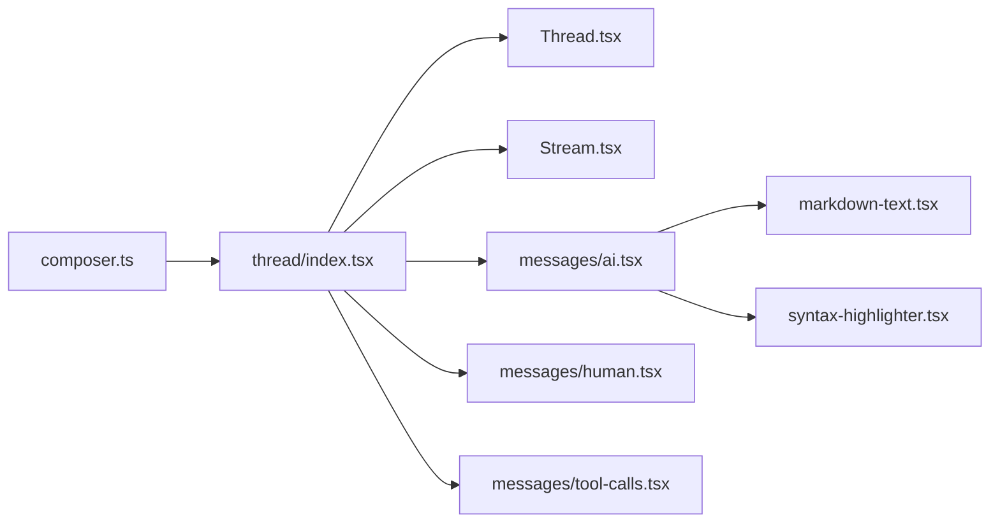

# 对话组件

<cite>
**本文引用的文件**   
- [apps/web/src/components/thread/index.tsx](file://apps/web/src/components/thread/index.tsx)
- [apps/web/src/components/thread/messages/ai.tsx](file://apps/web/src/components/thread/messages/ai.tsx)
- [apps/web/src/components/thread/messages/human.tsx](file://apps/web/src/components/thread/messages/human.tsx)
- [apps/web/src/components/thread/messages/tool-calls.tsx](file://apps/web/src/components/thread/messages/tool-calls.tsx)
- [apps/web/src/components/thread/messages/shared.tsx](file://apps/web/src/components/thread/messages/shared.tsx)
- [apps/web/src/components/thread/markdown-text.tsx](file://apps/web/src/components/thread/markdown-text.tsx)
- [apps/web/src/components/thread/syntax-highlighter.tsx](file://apps/web/src/components/thread/syntax-highlighter.tsx)
- [apps/web/src/providers/Thread.tsx](file://apps/web/src/providers/Thread.tsx)
- [apps/web/src/providers/Stream.tsx](file://apps/web/src/providers/Stream.tsx)
- [apps/web/src/lib/composer.ts](file://apps/web/src/lib/composer.ts)
- [apps/web/src/app/page.tsx](file://apps/web/src/app/page.tsx)
</cite>

## 目录
1. [简介](#简介)
2. [项目结构](#项目结构)
3. [核心组件](#核心组件)
4. [架构总览](#架构总览)
5. [详细组件分析](#详细组件分析)
6. [依赖关系分析](#依赖关系分析)
7. [性能与滚动优化](#性能与滚动优化)
8. [故障排查指南](#故障排查指南)
9. [结论](#结论)
10. [附录：使用示例与扩展点](#附录使用示例与扩展点)

## 简介
本文件面向“对话组件”的开发者与使用者，系统阐述消息列表、AI回复、人类消息与工具调用等对话相关组件的使用方法、渲染逻辑、流式更新机制与状态同步策略。文档同时覆盖数据结构、消息格式、扩展点设计、滚动管理与虚拟化、自定义渲染与模板替换、内容格式化，以及实际代码示例与高级定制方法，帮助读者快速上手并实现高质量的对话界面。

## 项目结构
对话功能位于 Web 应用的前端模块中，围绕 thread（会话）组织，包含消息渲染、Markdown 渲染、语法高亮、流式数据提供、会话状态管理等关键部分。整体采用 React + Next.js 技术栈，通过 Provider 模式管理会话上下文与流式数据，消息组件按类型拆分，便于扩展与定制。

图表来源
- [apps/web/src/app/page.tsx](file://apps/web/src/app/page.tsx)
- [apps/web/src/providers/Thread.tsx](file://apps/web/src/providers/Thread.tsx)
- [apps/web/src/providers/Stream.tsx](file://apps/web/src/providers/Stream.tsx)
- [apps/web/src/components/thread/index.tsx](file://apps/web/src/components/thread/index.tsx)
- [apps/web/src/components/thread/messages/ai.tsx](file://apps/web/src/components/thread/messages/ai.tsx)
- [apps/web/src/components/thread/messages/human.tsx](file://apps/web/src/components/thread/messages/human.tsx)
- [apps/web/src/components/thread/messages/tool-calls.tsx](file://apps/web/src/components/thread/messages/tool-calls.tsx)
- [apps/web/src/components/thread/messages/shared.tsx](file://apps/web/src/components/thread/messages/shared.tsx)
- [apps/web/src/components/thread/markdown-text.tsx](file://apps/web/src/components/thread/markdown-text.tsx)
- [apps/web/src/components/thread/syntax-highlighter.tsx](file://apps/web/src/components/thread/syntax-highlighter.tsx)
- [apps/web/src/lib/composer.ts](file://apps/web/src/lib/composer.ts)

章节来源
- [apps/web/src/app/page.tsx](file://apps/web/src/app/page.tsx)
- [apps/web/src/providers/Thread.tsx](file://apps/web/src/providers/Thread.tsx)
- [apps/web/src/providers/Stream.tsx](file://apps/web/src/providers/Stream.tsx)
- [apps/web/src/components/thread/index.tsx](file://apps/web/src/components/thread/index.tsx)

## 核心组件
- 线程容器（thread/index.tsx）：负责加载历史消息、维护当前会话状态、协调消息列表渲染、处理用户输入与发送、订阅流式响应并增量更新 UI。
- AI 消息（messages/ai.tsx）：渲染 AI 生成的文本、Markdown、代码块与工具调用结果；支持流式片段拼接与逐步展示。
- 人类消息（messages/human.tsx）：渲染用户输入的消息内容，支持富文本或基础文本显示。
- 工具调用（messages/tool-calls.tsx）：以表格或卡片形式展示工具调用参数与返回结果，支持展开/折叠与错误信息提示。
- 共享组件（messages/shared.tsx）：封装通用 UI 元素，如头像、时间戳、操作按钮等。
- Markdown 渲染（markdown-text.tsx）：将 Markdown 字符串转换为可交互的 HTML，集成语法高亮与链接处理。
- 语法高亮（syntax-highlighter.tsx）：对代码块进行语言识别与着色，提升可读性。
- 流式提供者（providers/Stream.tsx）：基于 SSE/WS/ReadableStream 等机制，提供增量数据流，驱动 UI 实时刷新。
- 线程提供者（providers/Thread.tsx）：集中管理会话 ID、消息队列、发送状态、中断与恢复等全局状态。
- 输入编排（lib/composer.ts）：统一处理输入框行为、附件上传、消息格式化与发送前的预处理。

章节来源
- [apps/web/src/components/thread/index.tsx](file://apps/web/src/components/thread/index.tsx)
- [apps/web/src/components/thread/messages/ai.tsx](file://apps/web/src/components/thread/messages/ai.tsx)
- [apps/web/src/components/thread/messages/human.tsx](file://apps/web/src/components/thread/messages/human.tsx)
- [apps/web/src/components/thread/messages/tool-calls.tsx](file://apps/web/src/components/thread/messages/tool-calls.tsx)
- [apps/web/src/components/thread/messages/shared.tsx](file://apps/web/src/components/thread/messages/shared.tsx)
- [apps/web/src/components/thread/markdown-text.tsx](file://apps/web/src/components/thread/markdown-text.tsx)
- [apps/web/src/components/thread/syntax-highlighter.tsx](file://apps/web/src/components/thread/syntax-highlighter.tsx)
- [apps/web/src/providers/Stream.tsx](file://apps/web/src/providers/Stream.tsx)
- [apps/web/src/providers/Thread.tsx](file://apps/web/src/providers/Thread.tsx)
- [apps/web/src/lib/composer.ts](file://apps/web/src/lib/composer.ts)

## 架构总览
对话组件采用“状态提供者 + 消息渲染器 + 流式数据源”的分层架构。线程提供者维护会话级状态，流式提供者负责增量数据推送，消息渲染器根据消息类型选择对应组件进行渲染。输入编排模块在发送前对内容进行标准化处理，确保后端与前端的一致性。

图表来源
- [apps/web/src/lib/composer.ts](file://apps/web/src/lib/composer.ts)
- [apps/web/src/providers/Thread.tsx](file://apps/web/src/providers/Thread.tsx)
- [apps/web/src/providers/Stream.tsx](file://apps/web/src/providers/Stream.tsx)
- [apps/web/src/components/thread/index.tsx](file://apps/web/src/components/thread/index.tsx)
- [apps/web/src/components/thread/messages/ai.tsx](file://apps/web/src/components/thread/messages/ai.tsx)
- [apps/web/src/components/thread/markdown-text.tsx](file://apps/web/src/components/thread/markdown-text.tsx)

## 详细组件分析

### 线程容器（thread/index.tsx）
职责与流程
- 初始化会话：加载历史消息、设置初始状态。
- 监听用户输入：调用输入编排模块进行格式化与校验。
- 发送消息：通过线程提供者创建新消息条目，进入“发送中”状态。
- 订阅流式数据：接收增量片段，合并到当前 AI 消息，触发重渲染。
- 滚动管理：自动滚动到底部，支持锁定/解锁滚动行为。
- 错误处理：捕获网络异常、解析失败与渲染异常，提供重试或降级方案。

关键点
- 消息列表采用稳定 key 与增量更新，避免不必要的重渲染。
- 流式更新使用不可变更新策略，保证 React 高效 diff。
- 滚动位置计算考虑虚拟列表与动态高度变化。

章节来源
- [apps/web/src/components/thread/index.tsx](file://apps/web/src/components/thread/index.tsx)

### AI 消息（messages/ai.tsx）
职责与流程
- 接收增量片段：将流式文本片段追加到当前消息内容。
- Markdown 渲染：将文本转换为 HTML，支持代码块、链接、列表等。
- 工具调用嵌入：当检测到工具调用事件时，插入工具调用组件。
- 状态同步：与线程提供者保持消息状态一致，支持暂停/继续。

关键点
- 片段合并需处理边界情况（重复片段、乱序到达）。
- 渲染性能优化：对长文本进行分片渲染与懒加载。
- 错误回退：当 Markdown 解析失败时，回退为纯文本显示。

章节来源
- [apps/web/src/components/thread/messages/ai.tsx](file://apps/web/src/components/thread/messages/ai.tsx)
- [apps/web/src/components/thread/markdown-text.tsx](file://apps/web/src/components/thread/markdown-text.tsx)

### 人类消息（messages/human.tsx）
职责与流程
- 渲染用户输入内容：支持多行文本、附件预览与引用块。
- 交互反馈：显示发送状态、失败重试按钮。
- 格式化：对特殊字符进行转义，防止 XSS 攻击。

关键点
- 内容长度限制与截断策略。
- 附件预览的懒加载与缓存。

章节来源
- [apps/web/src/components/thread/messages/human.tsx](file://apps/web/src/components/thread/messages/human.tsx)

### 工具调用（messages/tool-calls.tsx）
职责与流程
- 展示工具调用参数与返回结果：以表格或卡片形式呈现。
- 交互能力：支持展开/折叠、复制参数、查看错误详情。
- 错误处理：对失败的调用进行高亮提示，并提供重试入口。

关键点
- 参数与结果的序列化与反序列化。
- 大对象的可分页展示与虚拟列表集成。

章节来源
- [apps/web/src/components/thread/messages/tool-calls.tsx](file://apps/web/src/components/thread/messages/tool-calls.tsx)

### Markdown 渲染（markdown-text.tsx）
职责与流程
- 解析 Markdown：将字符串转换为 AST 并生成 HTML。
- 插件扩展：支持数学公式、Mermaid 图、自定义标签等。
- 安全过滤：移除危险脚本与属性，确保输出安全。

关键点
- 渲染性能：对长文档进行分块渲染与按需加载。
- 主题适配：支持暗色模式与自定义样式。

章节来源
- [apps/web/src/components/thread/markdown-text.tsx](file://apps/web/src/components/thread/markdown-text.tsx)

### 语法高亮（syntax-highlighter.tsx）
职责与流程
- 语言识别：根据代码块元数据选择高亮规则。
- 着色渲染：将代码转换为带类名的 HTML 节点。
- 主题切换：支持明暗主题与自定义配色。

关键点
- 大文件高亮的分片处理与内存控制。
- 与 Markdown 渲染的无缝集成。

章节来源
- [apps/web/src/components/thread/syntax-highlighter.tsx](file://apps/web/src/components/thread/syntax-highlighter.tsx)

### 流式提供者（providers/Stream.tsx）
职责与流程
- 建立连接：根据后端协议选择 SSE/WS/ReadableStream。
- 事件分发：将原始字节流解析为结构化事件。
- 错误重试：在网络波动时自动重试与降级。

关键点
- 背压处理：控制消费速率，避免 UI 卡顿。
- 内存管理：及时释放已处理的流数据。

章节来源
- [apps/web/src/providers/Stream.tsx](file://apps/web/src/providers/Stream.tsx)

### 线程提供者（providers/Thread.tsx）
职责与流程
- 状态管理：维护会话 ID、消息队列、发送状态、中断标志。
- 生命周期：处理会话创建、销毁与恢复。
- 事件总线：发布/订阅消息变更事件，驱动 UI 更新。

关键点
- 状态不可变性：确保每次更新都产生新对象。
- 并发控制：防止重复发送与竞态条件。

章节来源
- [apps/web/src/providers/Thread.tsx](file://apps/web/src/providers/Thread.tsx)

### 输入编排（lib/composer.ts）
职责与流程
- 输入处理：监听键盘事件、粘贴内容与附件上传。
- 内容格式化：将用户输入转换为标准消息格式。
- 发送前校验：检查必填字段、长度限制与敏感词过滤。

关键点
- 防抖与节流：减少频繁更新导致的性能问题。
- 撤销/重做：支持编辑历史与快速修正。

章节来源
- [apps/web/src/lib/composer.ts](file://apps/web/src/lib/composer.ts)

## 依赖关系分析
组件间依赖清晰，遵循单一职责原则。线程容器依赖输入编排与流式提供者，消息组件依赖 Markdown 与语法高亮，状态集中在线程提供者中，避免循环依赖。

图表来源
- [apps/web/src/lib/composer.ts](file://apps/web/src/lib/composer.ts)
- [apps/web/src/components/thread/index.tsx](file://apps/web/src/components/thread/index.tsx)
- [apps/web/src/providers/Thread.tsx](file://apps/web/src/providers/Thread.tsx)
- [apps/web/src/providers/Stream.tsx](file://apps/web/src/providers/Stream.tsx)
- [apps/web/src/components/thread/messages/ai.tsx](file://apps/web/src/components/thread/messages/ai.tsx)
- [apps/web/src/components/thread/messages/human.tsx](file://apps/web/src/components/thread/human.tsx)
- [apps/web/src/components/thread/messages/tool-calls.tsx](file://apps/web/src/components/thread/messages/tool-calls.tsx)
- [apps/web/src/components/thread/markdown-text.tsx](file://apps/web/src/components/thread/markdown-text.tsx)
- [apps/web/src/components/thread/syntax-highlighter.tsx](file://apps/web/src/components/thread/syntax-highlighter.tsx)

章节来源
- [apps/web/src/components/thread/index.tsx](file://apps/web/src/components/thread/index.tsx)
- [apps/web/src/providers/Thread.tsx](file://apps/web/src/providers/Thread.tsx)
- [apps/web/src/providers/Stream.tsx](file://apps/web/src/providers/Stream.tsx)

## 性能与滚动优化
- 虚拟列表：对长消息列表启用虚拟滚动，仅渲染可视区域，降低 DOM 节点数量。
- 增量更新：流式数据以片段形式合并，避免全量重建。
- 懒加载：图片与附件延迟加载，首屏快速响应。
- 防抖与节流：输入与滚动事件去抖，减少重渲染频率。
- 内存管理：及时释放流数据与临时对象，防止内存泄漏。

[本节为通用指导，不直接分析具体文件]

## 故障排查指南
常见问题与解决方案
- 流式数据中断：检查网络连接与后端服务状态，启用自动重试。
- Markdown 渲染异常：验证输入格式，启用降级为纯文本。
- 工具调用失败：查看错误日志，确认参数合法性与权限。
- 滚动错位：重置滚动锚点，重新计算可视区域。
- 内存占用过高：监控堆快照，定位未释放资源。

章节来源
- [apps/web/src/providers/Stream.tsx](file://apps/web/src/providers/Stream.tsx)
- [apps/web/src/components/thread/markdown-text.tsx](file://apps/web/src/components/thread/markdown-text.tsx)
- [apps/web/src/components/thread/messages/tool-calls.tsx](file://apps/web/src/components/thread/messages/tool-calls.tsx)

## 结论
对话组件通过分层架构与模块化设计，实现了高可扩展性与良好性能。流式更新与虚拟滚动确保了流畅的用户体验，而清晰的扩展点允许开发者轻松定制渲染逻辑与交互行为。建议在生产环境中启用监控与日志，持续优化性能与稳定性。

[本节为总结性内容，不直接分析具体文件]

## 附录：使用示例与高级定制

### 基本用法
- 在页面中引入线程提供者与线程容器，传入会话 ID 与回调函数。
- 自定义消息渲染：通过插槽或配置项替换默认组件。
- 接入流式数据：配置流式提供者，指定后端接口与解析规则。

章节来源
- [apps/web/src/app/page.tsx](file://apps/web/src/app/page.tsx)
- [apps/web/src/components/thread/index.tsx](file://apps/web/src/components/thread/index.tsx)
- [apps/web/src/providers/Stream.tsx](file://apps/web/src/providers/Stream.tsx)

### 高级定制
- 自定义 Markdown 插件：扩展语法支持，如 Mermaid、LaTeX。
- 工具调用可视化：自定义表格布局与交互行为。
- 主题与样式：覆盖默认 CSS 变量，实现品牌化外观。
- 性能调优：调整虚拟列表阈值与渲染批次。

章节来源
- [apps/web/src/components/thread/markdown-text.tsx](file://apps/web/src/components/thread/markdown-text.tsx)
- [apps/web/src/components/thread/messages/tool-calls.tsx](file://apps/web/src/components/thread/messages/tool-calls.tsx)