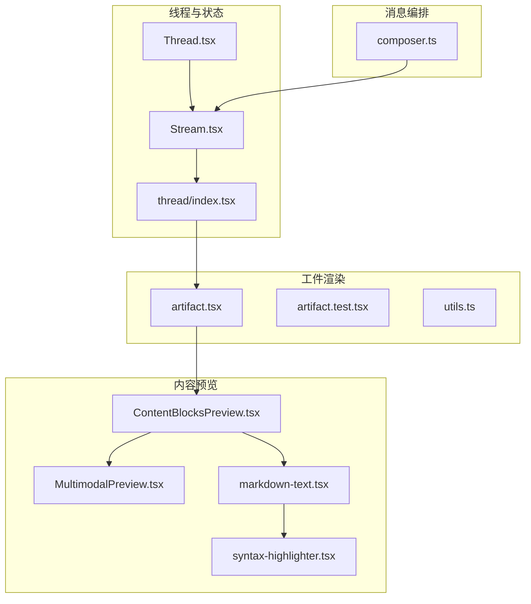
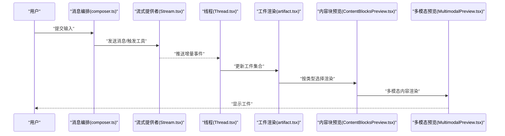
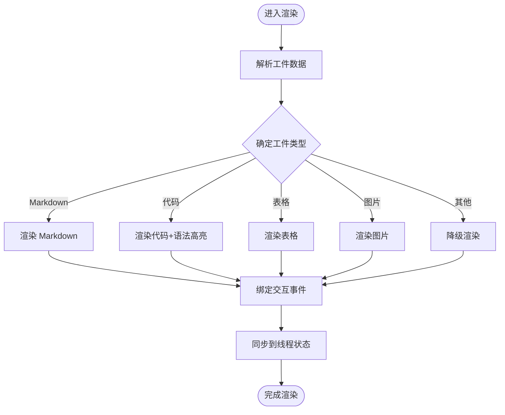
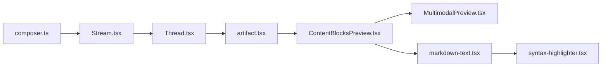

# 工件组件

<cite>
**本文档引用的文件**
- [artifact.tsx](file://apps/web/src/components/thread/artifact.tsx)
- [artifact.test.tsx](file://apps/web/src/components/thread/artifact.test.tsx)
- [index.tsx](file://apps/web/src/components/thread/index.tsx)
- [ContentBlocksPreview.tsx](file://apps/web/src/components/thread/ContentBlocksPreview.tsx)
- [MultimodalPreview.tsx](file://apps/web/src/components/thread/MultimodalPreview.tsx)
- [markdown-text.tsx](file://apps/web/src/components/thread/markdown-text.tsx)
- [syntax-highlighter.tsx](file://apps/web/src/components/thread/syntax-highlighter.tsx)
- [utils.ts](file://apps/web/src/components/thread/utils.ts)
- [Stream.tsx](file://apps/web/src/providers/Stream.tsx)
- [Thread.tsx](file://apps/web/src/providers/Thread.tsx)
- [composer.ts](file://apps/web/src/lib/composer.ts)
</cite>

## 目录
1. [简介](#简介)
2. [项目结构](#项目结构)
3. [核心组件](#核心组件)
4. [架构总览](#架构总览)
5. [详细组件分析](#详细组件分析)
6. [依赖关系分析](#依赖关系分析)
7. [性能考虑](#性能考虑)
8. [故障排查指南](#故障排查指南)
9. [结论](#结论)
10. [附录](#附录)

## 简介
本章节面向“工件”这一概念，阐述其在对话系统中的定位与作用：工件是会话中可被创建、更新、删除与渲染的富内容单元，通常由后端工具或模型生成，并通过消息流实时同步到前端。它既承载结构化数据（如代码片段、表格、图表），也支持模板化与自定义渲染，使对话体验从纯文本升级为多模态、可交互的内容块。

## 项目结构
与工件相关的实现集中在 Web 应用的前端线程与预览模块中，包括：
- 工件渲染与交互：artifact.tsx 及其测试 artifact.test.tsx
- 线程上下文与状态管理：index.tsx、Stream.tsx、Thread.tsx
- 内容块预览与多模态展示：ContentBlocksPreview.tsx、MultimodalPreview.tsx
- Markdown 与语法高亮：markdown-text.tsx、syntax-highlighter.tsx
- 工具函数与类型定义：utils.ts
- 消息编排与组合器：composer.ts

**图示来源**
- [Thread.tsx](file://apps/web/src/providers/Thread.tsx)
- [Stream.tsx](file://apps/web/src/providers/Stream.tsx)
- [index.tsx](file://apps/web/src/components/thread/index.tsx)
- [artifact.tsx](file://apps/web/src/components/thread/artifact.tsx)
- [ContentBlocksPreview.tsx](file://apps/web/src/components/thread/ContentBlocksPreview.tsx)
- [MultimodalPreview.tsx](file://apps/web/src/components/thread/MultimodalPreview.tsx)
- [markdown-text.tsx](file://apps/web/src/components/thread/markdown-text.tsx)
- [syntax-highlighter.tsx](file://apps/web/src/components/thread/syntax-highlighter.tsx)
- [composer.ts](file://apps/web/src/lib/composer.ts)

**章节来源**
- [artifact.tsx](file://apps/web/src/components/thread/artifact.tsx)
- [artifact.test.tsx](file://apps/web/src/components/thread/artifact.test.tsx)
- [index.tsx](file://apps/web/src/components/thread/index.tsx)
- [ContentBlocksPreview.tsx](file://apps/web/src/components/thread/ContentBlocksPreview.tsx)
- [MultimodalPreview.tsx](file://apps/web/src/components/thread/MultimodalPreview.tsx)
- [markdown-text.tsx](file://apps/web/src/components/thread/markdown-text.tsx)
- [syntax-highlighter.tsx](file://apps/web/src/components/thread/syntax-highlighter.tsx)
- [utils.ts](file://apps/web/src/components/thread/utils.ts)
- [Stream.tsx](file://apps/web/src/providers/Stream.tsx)
- [Thread.tsx](file://apps/web/src/providers/Thread.tsx)
- [composer.ts](file://apps/web/src/lib/composer.ts)

## 核心组件
- 工件渲染器（artifact.tsx）：负责解析工件数据结构、选择渲染策略、处理事件回调，并与线程状态进行增量同步。
- 内容块预览（ContentBlocksPreview.tsx）：将后端返回的内容块序列转换为可渲染的 UI 片段，支持多种媒体与富文本。
- 多模态预览（MultimodalPreview.tsx）：在内容块基础上提供图片、视频、音频等多模态内容的统一展示。
- Markdown 与语法高亮（markdown-text.tsx、syntax-highlighter.tsx）：为代码与文档类工件提供可读性优化。
- 线程与流式提供者（Thread.tsx、Stream.tsx）：维护会话状态、订阅服务端事件、驱动 UI 增量更新。
- 消息编排（composer.ts）：组织用户输入与系统消息，触发工具调用并产出工件。

**章节来源**
- [artifact.tsx](file://apps/web/src/components/thread/artifact.tsx)
- [ContentBlocksPreview.tsx](file://apps/web/src/components/thread/ContentBlocksPreview.tsx)
- [MultimodalPreview.tsx](file://apps/web/src/components/thread/MultimodalPreview.tsx)
- [markdown-text.tsx](file://apps/web/src/components/thread/markdown-text.tsx)
- [syntax-highlighter.tsx](file://apps/web/src/components/thread/syntax-highlighter.tsx)
- [Stream.tsx](file://apps/web/src/providers/Stream.tsx)
- [Thread.tsx](file://apps/web/src/providers/Thread.tsx)
- [composer.ts](file://apps/web/src/lib/composer.ts)

## 架构总览
工件的生命周期贯穿“消息编排 → 流式传输 → 状态同步 → 渲染更新”的完整链路。下图展示了关键参与者与数据流转：

**图示来源**
- [composer.ts](file://apps/web/src/lib/composer.ts)
- [Stream.tsx](file://apps/web/src/providers/Stream.tsx)
- [Thread.tsx](file://apps/web/src/providers/Thread.tsx)
- [artifact.tsx](file://apps/web/src/components/thread/artifact.tsx)
- [ContentBlocksPreview.tsx](file://apps/web/src/components/thread/ContentBlocksPreview.tsx)
- [MultimodalPreview.tsx](file://apps/web/src/components/thread/MultimodalPreview.tsx)

## 详细组件分析

### 工件渲染器（artifact.tsx）
- 职责
  - 解析工件数据结构，识别类型与元数据
  - 根据类型选择渲染策略（Markdown、代码、表格、图片等）
  - 处理用户交互事件（编辑、复制、下载、展开/折叠）
  - 与线程状态进行增量同步，避免全量重渲染
- 关键点
  - 使用稳定的键（如 id）作为渲染索引，提升列表性能
  - 对大内容进行懒加载与虚拟滚动（若适用）
  - 错误边界包裹，防止单个工件渲染失败影响整体
- 生命周期
  - 创建：接收新工件后插入状态树
  - 更新：基于差异合并，仅更新变更字段
  - 删除：移除引用并清理副作用（如定时器、监听器）

**图示来源**
- [artifact.tsx](file://apps/web/src/components/thread/artifact.tsx)
- [markdown-text.tsx](file://apps/web/src/components/thread/markdown-text.tsx)
- [syntax-highlighter.tsx](file://apps/web/src/components/thread/syntax-highlighter.tsx)

**章节来源**
- [artifact.tsx](file://apps/web/src/components/thread/artifact.tsx)
- [artifact.test.tsx](file://apps/web/src/components/thread/artifact.test.tsx)

### 内容块预览（ContentBlocksPreview.tsx）
- 职责
  - 将后端内容块数组映射为前端可渲染片段
  - 处理不同块类型的布局与样式
  - 与多模态预览协作，统一媒体展示
- 关键点
  - 使用 key 稳定化列表项
  - 对长内容启用分页或懒加载
  - 错误回退与占位符

**章节来源**
- [ContentBlocksPreview.tsx](file://apps/web/src/components/thread/ContentBlocksPreview.tsx)

### 多模态预览（MultimodalPreview.tsx）
- 职责
  - 统一渲染图片、视频、音频等多模态内容
  - 提供缩放、全屏、播放控制等交互
- 关键点
  - 资源预加载与缓存
  - 响应式尺寸适配
  - 无障碍支持（字幕、替代文本）

**章节来源**
- [MultimodalPreview.tsx](file://apps/web/src/components/thread/MultimodalPreview.tsx)

### Markdown 与语法高亮（markdown-text.tsx、syntax-highlighter.tsx）
- 职责
  - Markdown 解析与安全过滤
  - 代码块语法高亮与主题切换
- 关键点
  - 防 XSS 与内容净化
  - 按需加载语言包，减少体积
  - 可插拔扩展点（自定义指令、链接处理器）

**章节来源**
- [markdown-text.tsx](file://apps/web/src/components/thread/markdown-text.tsx)
- [syntax-highlighter.tsx](file://apps/web/src/components/thread/syntax-highlighter.tsx)

### 线程与流式提供者（Thread.tsx、Stream.tsx）
- 职责
  - 维护会话状态（消息、工件、工具调用结果）
  - 订阅服务端事件，驱动增量更新
  - 提供统一的 API 供组件消费
- 关键点
  - 事件去抖与批处理，降低渲染压力
  - 断线重连与状态恢复
  - 并发请求的幂等与冲突解决

**章节来源**
- [Thread.tsx](file://apps/web/src/providers/Thread.tsx)
- [Stream.tsx](file://apps/web/src/providers/Stream.tsx)

### 消息编排（composer.ts）
- 职责
  - 组装用户输入与系统提示
  - 触发工具调用，收集结果并生成工件
  - 与流式提供者协作，推动状态更新
- 关键点
  - 参数校验与默认值填充
  - 错误重试与降级策略
  - 可观测性（日志、埋点）

**章节来源**
- [composer.ts](file://apps/web/src/lib/composer.ts)

## 依赖关系分析
工件渲染依赖于线程状态、内容块预览与多模态预览；内容块预览又依赖 Markdown 与语法高亮。下图展示主要依赖关系：

**图示来源**
- [composer.ts](file://apps/web/src/lib/composer.ts)
- [Stream.tsx](file://apps/web/src/providers/Stream.tsx)
- [Thread.tsx](file://apps/web/src/providers/Thread.tsx)
- [artifact.tsx](file://apps/web/src/components/thread/artifact.tsx)
- [ContentBlocksPreview.tsx](file://apps/web/src/components/thread/ContentBlocksPreview.tsx)
- [MultimodalPreview.tsx](file://apps/web/src/components/thread/MultimodalPreview.tsx)
- [markdown-text.tsx](file://apps/web/src/components/thread/markdown-text.tsx)
- [syntax-highlighter.tsx](file://apps/web/src/components/thread/syntax-highlighter.tsx)

**章节来源**
- [artifact.tsx](file://apps/web/src/components/thread/artifact.tsx)
- [ContentBlocksPreview.tsx](file://apps/web/src/components/thread/ContentBlocksPreview.tsx)
- [MultimodalPreview.tsx](file://apps/web/src/components/thread/MultimodalPreview.tsx)
- [markdown-text.tsx](file://apps/web/src/components/thread/markdown-text.tsx)
- [syntax-highlighter.tsx](file://apps/web/src/components/thread/syntax-highlighter.tsx)
- [Stream.tsx](file://apps/web/src/providers/Stream.tsx)
- [Thread.tsx](file://apps/web/src/providers/Thread.tsx)
- [composer.ts](file://apps/web/src/lib/composer.ts)

## 性能考虑
- 列表渲染优化
  - 使用稳定 key，避免不必要的重排
  - 对长列表采用虚拟滚动或分页加载
- 增量更新
  - 基于差异合并，只更新变更字段
  - 事件批处理与去抖，减少频繁状态更新
- 资源管理
  - 图片与媒体资源的懒加载与缓存
  - 按需加载语法高亮语言包
- 错误隔离
  - 错误边界包裹单个工件，避免级联失败
  - 降级渲染与占位符，保证可用性

[本节为通用指导，不直接分析具体文件]

## 故障排查指南
- 常见问题
  - 工件未渲染：检查类型识别逻辑与渲染分支
  - 更新丢失：确认状态合并策略与 key 稳定性
  - 内存泄漏：确保清理定时器、监听器与订阅
- 调试建议
  - 打印工件快照与差异变化
  - 使用浏览器开发者工具观察重渲染次数
  - 增加错误日志与堆栈信息
- 恢复策略
  - 断线重连与状态重建
  - 局部重试与幂等操作

**章节来源**
- [artifact.test.tsx](file://apps/web/src/components/thread/artifact.test.tsx)
- [Stream.tsx](file://apps/web/src/providers/Stream.tsx)
- [Thread.tsx](file://apps/web/src/providers/Thread.tsx)

## 结论
工件组件通过清晰的数据结构与生命周期管理，实现了对话系统中富内容的创建、更新、删除与渲染。借助流式传输与状态同步，工件能够实时反映后端变化，并提供丰富的交互能力。通过模板扩展与自定义渲染，开发者可以灵活适配不同业务场景，提升用户体验。

[本节为总结性内容，不直接分析具体文件]

## 附录
- 使用示例与高级定制技巧
  - 自定义工件类型：在渲染器中新增分支，注册对应的渲染组件
  - 模板扩展：为 Markdown 添加自定义指令与插件
  - 内容格式化：统一输出 Schema，便于前后端一致解析
  - 事件处理：为交互元素绑定回调，触发工具调用或状态更新
  - 性能调优：结合虚拟滚动与懒加载，优化大数据量场景

[本节为概念性内容，不直接分析具体文件]