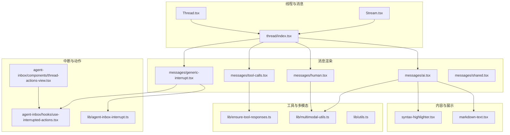
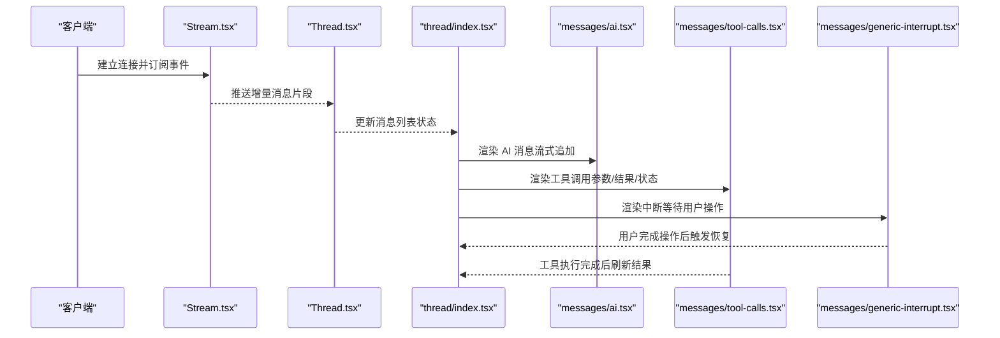
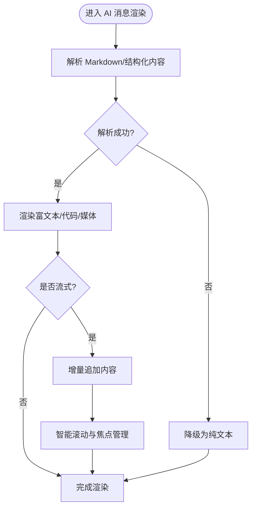
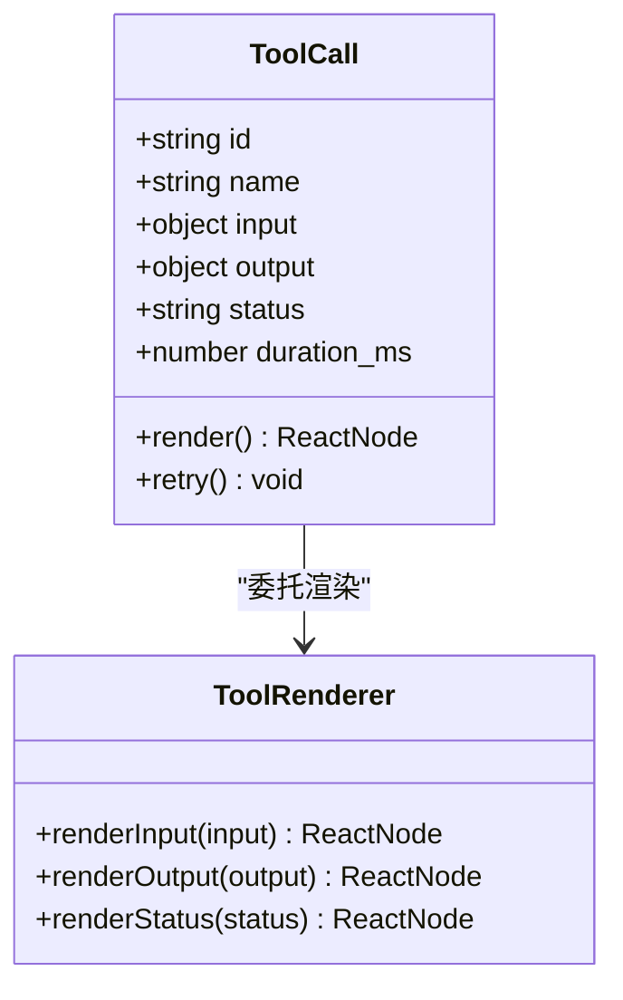
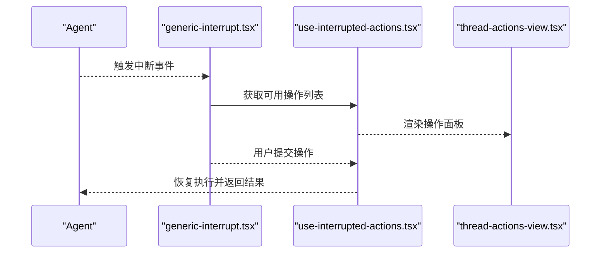
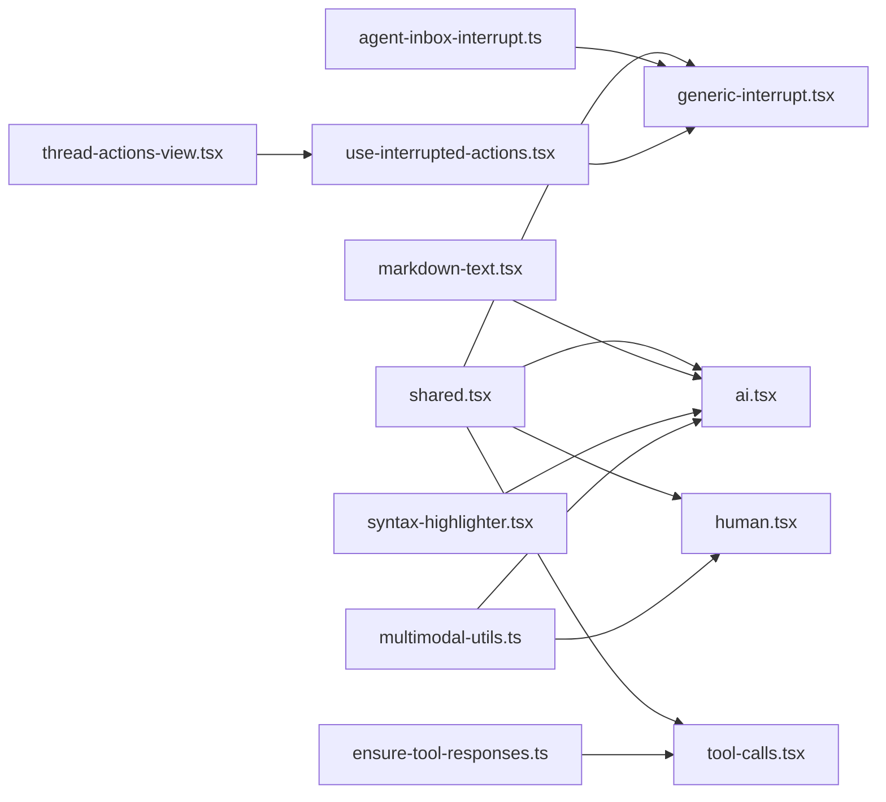

# 消息组件

<cite>
**本文引用的文件**   
- [ai.tsx](file://apps/web/src/components/thread/messages/ai.tsx)
- [human.tsx](file://apps/web/src/components/thread/messages/human.tsx)
- [tool-calls.tsx](file://apps/web/src/components/thread/messages/tool-calls.tsx)
- [generic-interrupt.tsx](file://apps/web/src/components/thread/messages/generic-interrupt.tsx)
- [shared.tsx](file://apps/web/src/components/thread/messages/shared.tsx)
- [index.tsx](file://apps/web/src/components/thread/index.tsx)
- [Thread.tsx](file://apps/web/src/providers/Thread.tsx)
- [Stream.tsx](file://apps/web/src/providers/Stream.tsx)
- [markdown-text.tsx](file://apps/web/src/components/thread/markdown-text.tsx)
- [syntax-highlighter.tsx](file://apps/web/src/components/thread/syntax-highlighter.tsx)
- [thread-actions-view.tsx](file://apps/web/src/components/thread/agent-inbox/components/thread-actions-view.tsx)
- [use-interrupted-actions.tsx](file://apps/web/src/components/thread/agent-inbox/hooks/use-interrupted-actions.tsx)
- [agent-inbox-interrupt.ts](file://apps/web/src/lib/agent-inbox-interrupt.ts)
- [multimodal-utils.ts](file://apps/web/src/lib/multimodal-utils.ts)
- [ensure-tool-responses.ts](file://apps/web/src/lib/ensure-tool-responses.ts)
- [utils.ts](file://apps/web/src/lib/utils.ts)
</cite>

## 目录
1. [简介](#简介)
2. [项目结构](#项目结构)
3. [核心组件](#核心组件)
4. [架构总览](#架构总览)
5. [详细组件分析](#详细组件分析)
6. [依赖关系分析](#依赖关系分析)
7. [性能考量](#性能考量)
8. [故障排查指南](#故障排查指南)
9. [结论](#结论)
10. [附录](#附录)

## 简介
本文件面向“消息组件”的完整文档，覆盖 AI 回复、人类消息、工具调用与通用中断等消息类型的渲染逻辑与显示格式。内容包含：
- 每种消息类型的数据结构与属性配置
- 自定义扩展方法（渲染器、交互处理器、主题适配）
- 状态管理、流式更新机制与错误处理策略
- 样式定制、主题适配与响应式设计实现
- 组合使用模式与高级定制方案
- 实际代码示例路径，便于快速定位实现细节

## 项目结构
消息组件位于前端 Next.js 应用中，围绕 thread（会话）组织，按功能划分到 messages 子目录，并通过 providers 提供全局状态与流式能力。

图表来源
- [Thread.tsx](file://apps/web/src/providers/Thread.tsx)
- [Stream.tsx](file://apps/web/src/providers/Stream.tsx)
- [index.tsx](file://apps/web/src/components/thread/index.tsx)
- [ai.tsx](file://apps/web/src/components/thread/messages/ai.tsx)
- [human.tsx](file://apps/web/src/components/thread/messages/human.tsx)
- [tool-calls.tsx](file://apps/web/src/components/thread/messages/tool-calls.tsx)
- [generic-interrupt.tsx](file://apps/web/src/components/thread/messages/generic-interrupt.tsx)
- [shared.tsx](file://apps/web/src/components/thread/messages/shared.tsx)
- [markdown-text.tsx](file://apps/web/src/components/thread/markdown-text.tsx)
- [syntax-highlighter.tsx](file://apps/web/src/components/thread/syntax-highlighter.tsx)
- [agent-inbox-interrupt.ts](file://apps/web/src/lib/agent-inbox-interrupt.ts)
- [use-interrupted-actions.tsx](file://apps/web/src/components/thread/agent-inbox/hooks/use-interrupted-actions.tsx)
- [thread-actions-view.tsx](file://apps/web/src/components/thread/agent-inbox/components/thread-actions-view.tsx)
- [ensure-tool-responses.ts](file://apps/web/src/lib/ensure-tool-responses.ts)
- [multimodal-utils.ts](file://apps/web/src/lib/multimodal-utils.ts)
- [utils.ts](file://apps/web/src/lib/utils.ts)

章节来源
- [index.tsx](file://apps/web/src/components/thread/index.tsx)
- [Thread.tsx](file://apps/web/src/providers/Thread.tsx)
- [Stream.tsx](file://apps/web/src/providers/Stream.tsx)

## 核心组件
- AI 消息渲染：负责将 AI 生成的文本、Markdown、代码块、多模态内容等进行安全渲染与高亮。
- 人类消息渲染：用于展示用户输入，支持富文本与附件预览。
- 工具调用渲染：以表格或卡片形式展示工具名称、参数、结果与状态。
- 通用中断渲染：当 Agent 进入中断状态时，展示等待用户操作的提示与交互入口。
- 共享组件：统一的头像、时间戳、气泡容器、加载骨架等基础 UI。

章节来源
- [ai.tsx](file://apps/web/src/components/thread/messages/ai.tsx)
- [human.tsx](file://apps/web/src/components/thread/messages/human.tsx)
- [tool-calls.tsx](file://apps/web/src/components/thread/messages/tool-calls.tsx)
- [generic-interrupt.tsx](file://apps/web/src/components/thread/messages/generic-interrupt.tsx)
- [shared.tsx](file://apps/web/src/components/thread/messages/shared.tsx)

## 架构总览
消息组件通过 Provider 注入会话状态与流式数据源，各消息类型根据数据类型进行条件渲染。AI 消息支持流式增量更新；工具调用与中断通过回调与事件驱动更新界面。

图表来源
- [Stream.tsx](file://apps/web/src/providers/Stream.tsx)
- [Thread.tsx](file://apps/web/src/providers/Thread.tsx)
- [index.tsx](file://apps/web/src/components/thread/index.tsx)
- [ai.tsx](file://apps/web/src/components/thread/messages/ai.tsx)
- [tool-calls.tsx](file://apps/web/src/components/thread/messages/tool-calls.tsx)
- [generic-interrupt.tsx](file://apps/web/src/components/thread/messages/generic-interrupt.tsx)

## 详细组件分析

### AI 消息组件
- 数据结构与属性
  - 文本与 Markdown：支持段落、列表、链接、图片等常见元素。
  - 代码块：语法高亮与复制按钮。
  - 多模态：图片、音频、视频等媒体内容的嵌入与预览。
  - 元数据：时间戳、作者标识、消息 ID、是否流式中。
- 渲染逻辑
  - 基于 Markdown 解析与安全过滤，避免 XSS。
  - 流式更新：增量拼接文本节点，保持光标位置与滚动行为。
  - 代码高亮：识别语言并应用主题样式。
- 自定义扩展
  - 替换 Markdown 渲染器以支持自定义组件。
  - 插入自定义工具输出区块（如图表、表格）。
  - 扩展多模态媒体渲染器。
- 错误处理
  - 解析失败降级为纯文本。
  - 网络错误重试与断线重连提示。
- 样式与主题
  - 支持 Tailwind 类名覆盖与 CSS 变量主题切换。
  - 响应式布局：移动端自动调整字体与间距。

图表来源
- [ai.tsx](file://apps/web/src/components/thread/messages/ai.tsx)
- [markdown-text.tsx](file://apps/web/src/components/thread/markdown-text.tsx)
- [syntax-highlighter.tsx](file://apps/web/src/components/thread/syntax-highlighter.tsx)
- [multimodal-utils.ts](file://apps/web/src/lib/multimodal-utils.ts)

章节来源
- [ai.tsx](file://apps/web/src/components/thread/messages/ai.tsx)
- [markdown-text.tsx](file://apps/web/src/components/thread/markdown-text.tsx)
- [syntax-highlighter.tsx](file://apps/web/src/components/thread/syntax-highlighter.tsx)
- [multimodal-utils.ts](file://apps/web/src/lib/multimodal-utils.ts)

### 人类消息组件
- 数据结构与属性
  - 文本内容、附件列表、时间戳、发送状态。
- 渲染逻辑
  - 富文本与附件缩略图展示。
  - 支持编辑与重新发送。
- 自定义扩展
  - 自定义附件渲染器（如 PDF、Excel 预览）。
  - 插入快捷回复模板。
- 错误处理
  - 上传失败重试与错误提示。
- 样式与主题
  - 与 AI 消息区分的气泡颜色与对齐方式。
  - 移动端自适应宽度。

章节来源
- [human.tsx](file://apps/web/src/components/thread/messages/human.tsx)
- [multimodal-utils.ts](file://apps/web/src/lib/multimodal-utils.ts)

### 工具调用组件
- 数据结构与属性
  - 工具名称、输入参数、输出结果、执行状态、耗时。
- 渲染逻辑
  - 表格或卡片展示关键信息，支持展开详情。
  - 失败时展示错误信息与重试入口。
- 自定义扩展
  - 自定义工具渲染器（例如可视化图表、JSON 编辑器）。
  - 集成第三方 SDK 的交互式控件。
- 错误处理
  - 超时与异常捕获，提供回退视图。
- 样式与主题
  - 统一的主题色与图标库。
  - 响应式表格在窄屏下转为堆叠卡片。

图表来源
- [tool-calls.tsx](file://apps/web/src/components/thread/messages/tool-calls.tsx)
- [ensure-tool-responses.ts](file://apps/web/src/lib/ensure-tool-responses.ts)

章节来源
- [tool-calls.tsx](file://apps/web/src/components/thread/messages/tool-calls.tsx)
- [ensure-tool-responses.ts](file://apps/web/src/lib/ensure-tool-responses.ts)

### 通用中断组件
- 数据结构与属性
  - 中断原因、等待的操作项、用户输入字段、提交按钮。
- 渲染逻辑
  - 展示中断提示与表单控件。
  - 用户提交后触发恢复流程。
- 自定义扩展
  - 自定义中断页面布局与校验规则。
  - 接入外部认证或审批流程。
- 错误处理
  - 表单校验失败与网络错误提示。
- 样式与主题
  - 强调色与警告图标提升可感知性。
  - 全屏或弹窗模式可选。

图表来源
- [generic-interrupt.tsx](file://apps/web/src/components/thread/messages/generic-interrupt.tsx)
- [use-interrupted-actions.tsx](file://apps/web/src/components/thread/agent-inbox/hooks/use-interrupted-actions.tsx)
- [thread-actions-view.tsx](file://apps/web/src/components/thread/agent-inbox/components/thread-actions-view.tsx)
- [agent-inbox-interrupt.ts](file://apps/web/src/lib/agent-inbox-interrupt.ts)

章节来源
- [generic-interrupt.tsx](file://apps/web/src/components/thread/messages/generic-interrupt.tsx)
- [use-interrupted-actions.tsx](file://apps/web/src/components/thread/agent-inbox/hooks/use-interrupted-actions.tsx)
- [thread-actions-view.tsx](file://apps/web/src/components/thread/agent-inbox/components/thread-actions-view.tsx)
- [agent-inbox-interrupt.ts](file://apps/web/src/lib/agent-inbox-interrupt.ts)

### 共享组件与基础 UI
- 头像、时间戳、气泡容器、骨架屏、分隔符、开关、输入框等。
- 提供一致的样式系统与主题变量，便于全局定制。

章节来源
- [shared.tsx](file://apps/web/src/components/thread/messages/shared.tsx)

## 依赖关系分析
- 组件耦合
  - 各消息组件依赖 shared 基础 UI，降低重复代码。
  - AI 消息依赖 markdown 与语法高亮组件。
  - 工具调用依赖 ensure-tool-responses 保证数据一致性。
  - 通用中断依赖 agent-inbox 中断库与 hooks。
- 外部依赖
  - Markdown 解析库、语法高亮库、媒体处理工具。
- 潜在循环依赖
  - 通过 Provider 解耦状态与渲染，避免直接导入导致的循环。

图表来源
- [shared.tsx](file://apps/web/src/components/thread/messages/shared.tsx)
- [ai.tsx](file://apps/web/src/components/thread/messages/ai.tsx)
- [human.tsx](file://apps/web/src/components/thread/messages/human.tsx)
- [tool-calls.tsx](file://apps/web/src/components/thread/messages/tool-calls.tsx)
- [generic-interrupt.tsx](file://apps/web/src/components/thread/messages/generic-interrupt.tsx)
- [markdown-text.tsx](file://apps/web/src/components/thread/markdown-text.tsx)
- [syntax-highlighter.tsx](file://apps/web/src/components/thread/syntax-highlighter.tsx)
- [ensure-tool-responses.ts](file://apps/web/src/lib/ensure-tool-responses.ts)
- [agent-inbox-interrupt.ts](file://apps/web/src/lib/agent-inbox-interrupt.ts)
- [use-interrupted-actions.tsx](file://apps/web/src/components/thread/agent-inbox/hooks/use-interrupted-actions.tsx)
- [thread-actions-view.tsx](file://apps/web/src/components/thread/agent-inbox/components/thread-actions-view.tsx)
- [multimodal-utils.ts](file://apps/web/src/lib/multimodal-utils.ts)

章节来源
- [index.tsx](file://apps/web/src/components/thread/index.tsx)
- [Thread.tsx](file://apps/web/src/providers/Thread.tsx)
- [Stream.tsx](file://apps/web/src/providers/Stream.tsx)

## 性能考量
- 流式渲染优化
  - 增量更新避免整段重渲染，使用 key 稳定化与虚拟滚动。
  - 控制 Markdown 解析频率，必要时缓存解析结果。
- 资源加载
  - 媒体懒加载与占位图，减少首屏压力。
  - 语法高亮按需加载语言包。
- 内存与计算
  - 大文本分片渲染，避免主线程阻塞。
  - 工具调用结果去重与缓存。
- 错误边界
  - 组件级错误边界捕获渲染异常，防止崩溃扩散。

[本节为通用指导，不直接分析具体文件]

## 故障排查指南
- 常见问题
  - Markdown 渲染异常：检查解析器版本与白名单配置。
  - 代码高亮缺失：确认语言包已加载且主题正确。
  - 工具调用无结果：检查 ensure-tool-responses 的数据转换逻辑。
  - 中断无法恢复：核对 use-interrupted-actions 的事件绑定与返回值。
- 调试建议
  - 启用开发日志与网络请求监控。
  - 使用浏览器开发者工具查看组件树与状态变化。
  - 对复杂渲染路径添加断点与性能分析。

章节来源
- [ai.tsx](file://apps/web/src/components/thread/messages/ai.tsx)
- [tool-calls.tsx](file://apps/web/src/components/thread/messages/tool-calls.tsx)
- [generic-interrupt.tsx](file://apps/web/src/components/thread/messages/generic-interrupt.tsx)
- [ensure-tool-responses.ts](file://apps/web/src/lib/ensure-tool-responses.ts)
- [use-interrupted-actions.tsx](file://apps/web/src/components/thread/agent-inbox/hooks/use-interrupted-actions.tsx)

## 结论
消息组件通过清晰的职责划分与 Provider 状态管理，实现了 AI 回复、人类消息、工具调用与通用中断的统一渲染框架。借助流式更新、错误边界与主题系统，既保证了用户体验，又提供了丰富的定制能力。推荐在实际项目中结合业务需求扩展渲染器与交互逻辑，以提升可维护性与可扩展性。

[本节为总结性内容，不直接分析具体文件]

## 附录
- 组合使用模式
  - 在 thread/index.tsx 中集中调度消息渲染，按类型分发至对应组件。
  - 使用 shared 组件构建一致的基础 UI。
- 高级定制方案
  - 替换 Markdown 渲染器以支持自定义组件。
  - 扩展工具调用渲染器以展示复杂结果。
  - 自定义中断页面以对接审批流程。
- 实际代码示例路径
  - AI 消息渲染：[ai.tsx](file://apps/web/src/components/thread/messages/ai.tsx)
  - 人类消息渲染：[human.tsx](file://apps/web/src/components/thread/messages/human.tsx)
  - 工具调用渲染：[tool-calls.tsx](file://apps/web/src/components/thread/messages/tool-calls.tsx)
  - 通用中断渲染：[generic-interrupt.tsx](file://apps/web/src/components/thread/messages/generic-interrupt.tsx)
  - 共享 UI：[shared.tsx](file://apps/web/src/components/thread/messages/shared.tsx)
  - 流式与状态：[Stream.tsx](file://apps/web/src/providers/Stream.tsx), [Thread.tsx](file://apps/web/src/providers/Thread.tsx)
  - 中断与动作：[use-interrupted-actions.tsx](file://apps/web/src/components/thread/agent-inbox/hooks/use-interrupted-actions.tsx), [thread-actions-view.tsx](file://apps/web/src/components/thread/agent-inbox/components/thread-actions-view.tsx)
  - 工具与多模态：[ensure-tool-responses.ts](file://apps/web/src/lib/ensure-tool-responses.ts), [multimodal-utils.ts](file://apps/web/src/lib/multimodal-utils.ts)

[本节为附录说明，不直接分析具体文件]