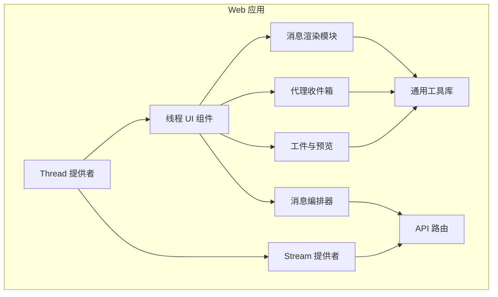
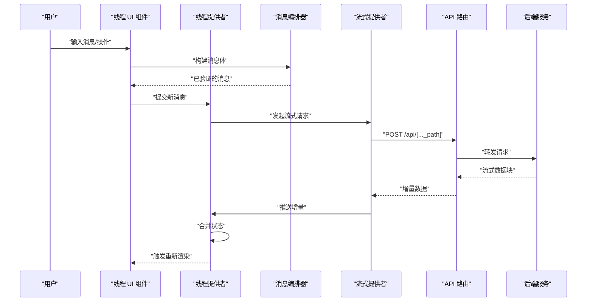
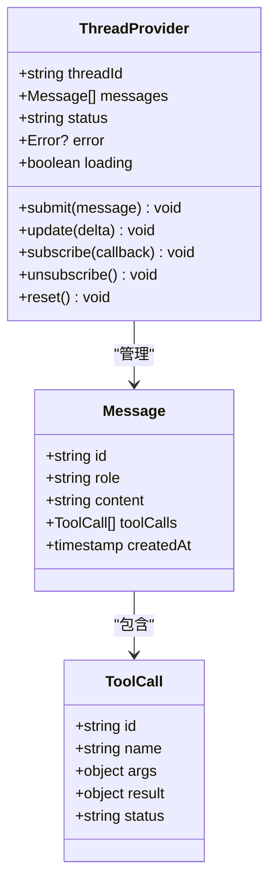
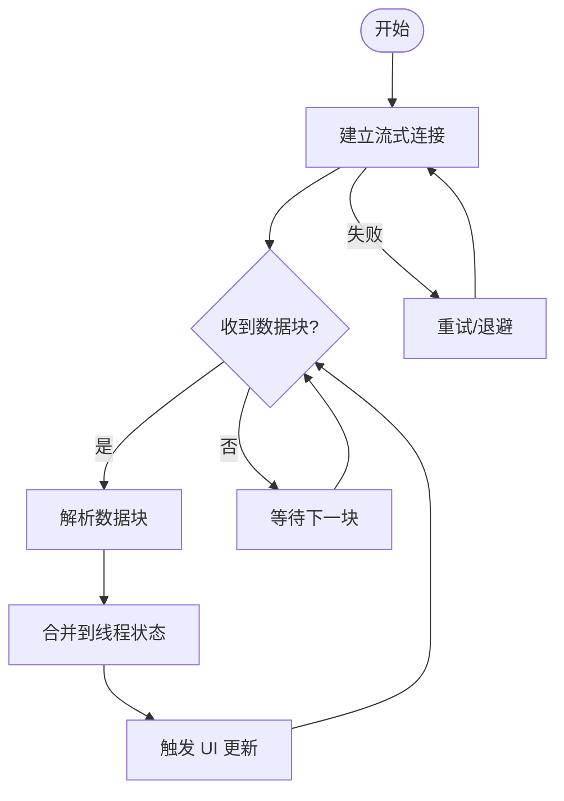
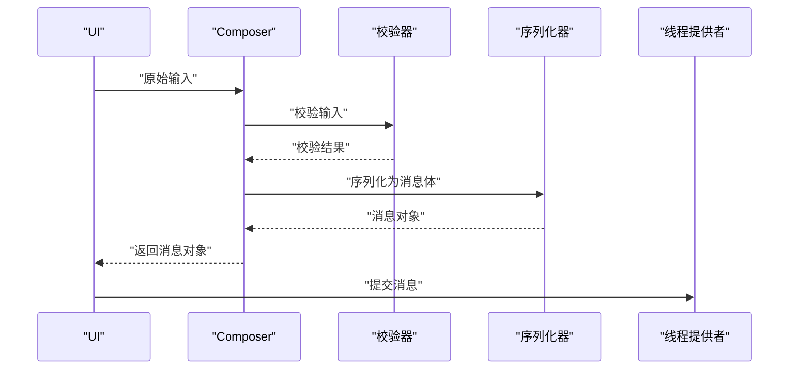
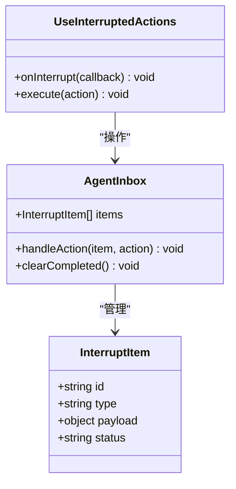
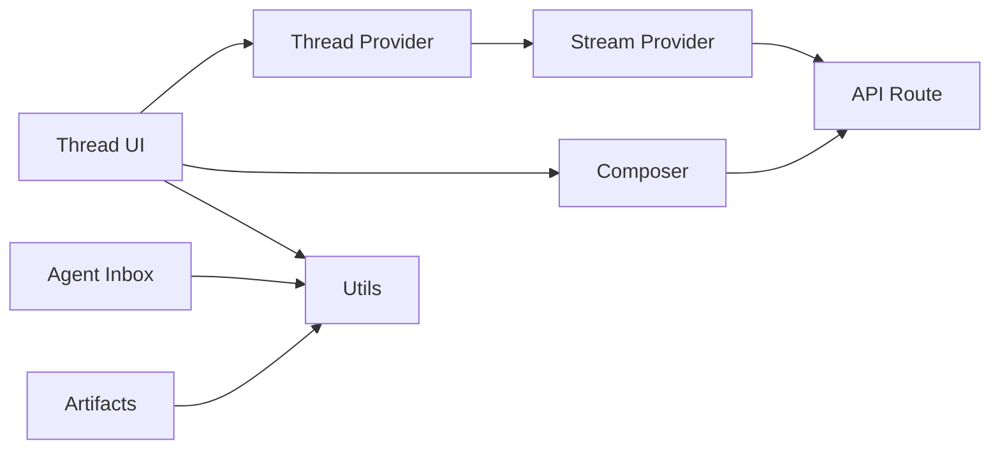

# 线程核心

<cite>
**本文引用的文件**   
- [apps/web/src/providers/Thread.tsx](file://apps/web/src/providers/Thread.tsx)
- [apps/web/src/components/thread/index.tsx](file://apps/web/src/components/thread/index.tsx)
- [apps/web/src/lib/composer.ts](file://apps/web/src/lib/composer.ts)
- [apps/web/src/providers/Stream.tsx](file://apps/web/src/providers/Stream.tsx)
- [apps/web/src/app/api/[..._path]/route.ts](file://apps/web/src/app/api/[..._path]/route.ts)
- [apps/web/src/components/thread/messages/shared.tsx](file://apps/web/src/components/thread/messages/shared.tsx)
- [apps/web/src/components/thread/messages/tool-calls.tsx](file://apps/web/src/components/thread/messages/tool-calls.tsx)
- [apps/web/src/components/thread/agent-inbox/types.ts](file://apps/web/src/components/thread/agent-inbox/types.ts)
- [apps/web/src/components/thread/agent-inbox/utils.ts](file://apps/web/src/components/thread/agent-inbox/utils.ts)
- [apps/web/src/components/thread/agent-inbox/hooks/use-interrupted-actions.tsx](file://apps/web/src/components/thread/agent-inbox/hooks/use-interrupted-actions.tsx)
- [apps/web/src/components/thread/ContentBlocksPreview.tsx](file://apps/web/src/components/thread/ContentBlocksPreview.tsx)
- [apps/web/src/components/thread/artifact.tsx](file://apps/web/src/components/thread/artifact.tsx)
- [apps/web/src/components/thread/multimodal-utils.ts](file://apps/web/src/components/thread/multimodal-utils.ts)
- [apps/web/src/lib/multimodal-utils.ts](file://apps/web/src/lib/multimodal-utils.ts)
- [apps/web/src/lib/ensure-tool-responses.ts](file://apps/web/src/lib/ensure-tool-responses.ts)
- [apps/web/src/lib/api-key.tsx](file://apps/web/src/lib/api-key.tsx)
- [apps/web/src/lib/utils.ts](file://apps/web/src/lib/utils.ts)
</cite>

## 目录
1. [简介](#简介)
2. [项目结构](#项目结构)
3. [核心组件](#核心组件)
4. [架构总览](#架构总览)
5. [详细组件分析](#详细组件分析)
6. [依赖关系分析](#依赖关系分析)
7. [性能考量](#性能考量)
8. [故障排查指南](#故障排查指南)
9. [结论](#结论)
10. [附录](#附录)

## 简介
本文件围绕“线程核心”展开，聚焦于前端侧的线程管理、消息队列与实时更新机制。结合仓库中的 Web 应用代码，梳理线程状态管理、消息处理流程、工具调用与中断恢复、以及与其他组件（流式响应、API 路由）的通信协议和数据交换格式。文档同时给出扩展点设计与插件化思路，并提供高级用法与性能优化建议，帮助读者在有限技术背景下也能理解并高效使用线程组件。

## 项目结构
本项目为多包工作区，线程相关逻辑主要位于 apps/web 中：
- providers 层负责线程上下文与流式更新
- components/thread 提供 UI 渲染与交互
- lib 层封装通用能力（Composer、工具响应、多模态等）
- app/api 暴露后端接口入口

图表来源
- [apps/web/src/providers/Thread.tsx](file://apps/web/src/providers/Thread.tsx)
- [apps/web/src/providers/Stream.tsx](file://apps/web/src/providers/Stream.tsx)
- [apps/web/src/components/thread/index.tsx](file://apps/web/src/components/thread/index.tsx)
- [apps/web/src/lib/composer.ts](file://apps/web/src/lib/composer.ts)
- [apps/web/src/app/api/[..._path]/route.ts](file://apps/web/src/app/api/[..._path]/route.ts)
- [apps/web/src/components/thread/messages/shared.tsx](file://apps/web/src/components/thread/messages/shared.tsx)
- [apps/web/src/components/thread/agent-inbox/types.ts](file://apps/web/src/components/thread/agent-inbox/types.ts)
- [apps/web/src/components/thread/agent-inbox/utils.ts](file://apps/web/src/components/thread/agent-inbox/utils.ts)
- [apps/web/src/components/thread/artifact.tsx](file://apps/web/src/components/thread/artifact.tsx)
- [apps/web/src/components/thread/ContentBlocksPreview.tsx](file://apps/web/src/components/thread/ContentBlocksPreview.tsx)

章节来源
- [apps/web/src/providers/Thread.tsx](file://apps/web/src/providers/Thread.tsx)
- [apps/web/src/components/thread/index.tsx](file://apps/web/src/components/thread/index.tsx)
- [apps/web/src/lib/composer.ts](file://apps/web/src/lib/composer.ts)
- [apps/web/src/providers/Stream.tsx](file://apps/web/src/providers/Stream.tsx)
- [apps/web/src/app/api/[..._path]/route.ts](file://apps/web/src/app/api/[..._path]/route.ts)

## 核心组件
- 线程提供者（Thread Provider）
  - 职责：维护线程上下文、消息列表、运行状态、错误与加载态；对外暴露订阅与更新方法。
  - 关键点：状态不可变更新、批量合并、事件驱动刷新。
- 流式提供者（Stream Provider）
  - 职责：建立与服务端的事件流连接，增量消费数据并推送到线程状态。
  - 关键点：断线重连、背压控制、增量合并策略。
- 消息编排器（Composer）
  - 职责：将用户输入与系统指令组合成可发送的消息体，管理工具调用参数与校验。
  - 关键点：输入校验、富文本/多模态内容序列化、幂等性保障。
- 线程 UI 组件
  - 职责：渲染消息、工具调用结果、中断提示与操作按钮；处理用户交互触发后续动作。
  - 关键点：虚拟滚动、懒加载、渲染去抖。
- API 路由
  - 职责：接收客户端请求，转发到后端服务，返回流式或一次性响应。
  - 关键点：鉴权、限流、错误码映射。

章节来源
- [apps/web/src/providers/Thread.tsx](file://apps/web/src/providers/Thread.tsx)
- [apps/web/src/providers/Stream.tsx](file://apps/web/src/providers/Stream.tsx)
- [apps/web/src/lib/composer.ts](file://apps/web/src/lib/composer.ts)
- [apps/web/src/components/thread/index.tsx](file://apps/web/src/components/thread/index.tsx)
- [apps/web/src/app/api/[..._path]/route.ts](file://apps/web/src/app/api/[..._path]/route.ts)

## 架构总览
线程核心采用“提供者 + 组件 + 编排器 + 流式通道”的分层架构。线程状态集中在提供者内，UI 通过订阅获取更新；消息通过编排器组装后经由 API 路由发送到服务端；服务端以流式方式回传增量数据，由流式提供者消费并合并到线程状态。

图表来源
- [apps/web/src/components/thread/index.tsx](file://apps/web/src/components/thread/index.tsx)
- [apps/web/src/lib/composer.ts](file://apps/web/src/lib/composer.ts)
- [apps/web/src/providers/Thread.tsx](file://apps/web/src/providers/Thread.tsx)
- [apps/web/src/providers/Stream.tsx](file://apps/web/src/providers/Stream.tsx)
- [apps/web/src/app/api/[..._path]/route.ts](file://apps/web/src/app/api/[..._path]/route.ts)

## 详细组件分析

### 线程提供者（Thread Provider）
- 状态模型
  - 线程 ID、消息数组、运行状态（空闲/运行/中断/完成）、错误信息、加载标志。
  - 支持历史快照与撤销/重做（可选）。
- 更新策略
  - 增量合并：按时间戳或序列号合并消息，避免重复与乱序。
  - 批量更新：减少渲染次数，提升性能。
- 事件与订阅
  - 提供 onStateChange 回调，供 UI 订阅。
  - 支持取消订阅与清理资源。
- 生命周期
  - 初始化：加载历史消息与配置。
  - 运行：接收增量数据并更新状态。
  - 结束：释放资源、重置状态。

图表来源
- [apps/web/src/providers/Thread.tsx](file://apps/web/src/providers/Thread.tsx)
- [apps/web/src/components/thread/messages/shared.tsx](file://apps/web/src/components/thread/messages/shared.tsx)
- [apps/web/src/components/thread/messages/tool-calls.tsx](file://apps/web/src/components/thread/messages/tool-calls.tsx)

章节来源
- [apps/web/src/providers/Thread.tsx](file://apps/web/src/providers/Thread.tsx)
- [apps/web/src/components/thread/messages/shared.tsx](file://apps/web/src/components/thread/messages/shared.tsx)
- [apps/web/src/components/thread/messages/tool-calls.tsx](file://apps/web/src/components/thread/messages/tool-calls.tsx)

### 流式提供者（Stream Provider）
- 连接管理
  - 基于事件流（如 Server-Sent Events 或自定义流）建立连接。
  - 自动重连与退避策略。
- 数据处理
  - 解析增量数据块，转换为内部消息片段。
  - 合并策略：按顺序拼接、去重、冲突解决。
- 错误处理
  - 网络异常捕获、降级策略、用户提示。
- 性能优化
  - 背压控制：限制并发与缓冲区大小。
  - 增量渲染：仅更新变更部分。

图表来源
- [apps/web/src/providers/Stream.tsx](file://apps/web/src/providers/Stream.tsx)
- [apps/web/src/app/api/[..._path]/route.ts](file://apps/web/src/app/api/[..._path]/route.ts)

章节来源
- [apps/web/src/providers/Stream.tsx](file://apps/web/src/providers/Stream.tsx)
- [apps/web/src/app/api/[..._path]/route.ts](file://apps/web/src/app/api/[..._path]/route.ts)

### 消息编排器（Composer）
- 输入处理
  - 文本、富文本、附件、多模态内容的统一序列化。
  - 校验规则：长度、类型、必填字段。
- 工具调用参数
  - 参数模板填充、默认值注入、安全过滤。
- 幂等性与去重
  - 生成唯一消息 ID，避免重复提交。
- 扩展点
  - 插件式处理器：注册自定义内容类型与校验器。

图表来源
- [apps/web/src/lib/composer.ts](file://apps/web/src/lib/composer.ts)
- [apps/web/src/lib/ensure-tool-responses.ts](file://apps/web/src/lib/ensure-tool-responses.ts)

章节来源
- [apps/web/src/lib/composer.ts](file://apps/web/src/lib/composer.ts)
- [apps/web/src/lib/ensure-tool-responses.ts](file://apps/web/src/lib/ensure-tool-responses.ts)

### 线程 UI 组件
- 渲染策略
  - 消息列表虚拟滚动，按需加载历史。
  - 工具调用结果折叠展示，详情可展开。
- 交互行为
  - 用户输入框、发送按钮、中断/继续操作。
  - 实时反馈：加载指示、错误提示。
- 主题与样式
  - 支持暗色模式、字体缩放、无障碍访问。

章节来源
- [apps/web/src/components/thread/index.tsx](file://apps/web/src/components/thread/index.tsx)
- [apps/web/src/components/thread/messages/shared.tsx](file://apps/web/src/components/thread/messages/shared.tsx)
- [apps/web/src/components/thread/messages/tool-calls.tsx](file://apps/web/src/components/thread/messages/tool-calls.tsx)

### 代理收件箱（Agent Inbox）
- 功能概述
  - 处理中断状态下的用户操作，支持工具调用确认与参数修正。
- 数据结构
  - 中断项、待处理动作、状态标记。
- 钩子与工具
  - useInterruptedActions：监听中断事件，执行用户选择。
  - utils：辅助函数用于状态转换与格式化。

图表来源
- [apps/web/src/components/thread/agent-inbox/types.ts](file://apps/web/src/components/thread/agent-inbox/types.ts)
- [apps/web/src/components/thread/agent-inbox/utils.ts](file://apps/web/src/components/thread/agent-inbox/utils.ts)
- [apps/web/src/components/thread/agent-inbox/hooks/use-interrupted-actions.tsx](file://apps/web/src/components/thread/agent-inbox/hooks/use-interrupted-actions.tsx)

章节来源
- [apps/web/src/components/thread/agent-inbox/types.ts](file://apps/web/src/components/thread/agent-inbox/types.ts)
- [apps/web/src/components/thread/agent-inbox/utils.ts](file://apps/web/src/components/thread/agent-inbox/utils.ts)
- [apps/web/src/components/thread/agent-inbox/hooks/use-interrupted-actions.tsx](file://apps/web/src/components/thread/agent-inbox/hooks/use-interrupted-actions.tsx)

### 工件与预览（Artifacts & Preview）
- 工件管理
  - 存储与展示工具生成的中间结果（如代码、图表、文件）。
- 预览能力
  - 多模态内容预览（图片、视频、音频）。
  - 内容块渲染与交互。

章节来源
- [apps/web/src/components/thread/artifact.tsx](file://apps/web/src/components/thread/artifact.tsx)
- [apps/web/src/components/thread/ContentBlocksPreview.tsx](file://apps/web/src/components/thread/ContentBlocksPreview.tsx)
- [apps/web/src/components/thread/multimodal-utils.ts](file://apps/web/src/components/thread/multimodal-utils.ts)
- [apps/web/src/lib/multimodal-utils.ts](file://apps/web/src/lib/multimodal-utils.ts)

## 依赖关系分析
线程核心依赖以下模块：
- 线程提供者依赖流式提供者进行数据更新
- UI 组件依赖线程提供者与编排器
- API 路由作为前后端通信桥梁
- 工具库提供通用能力（鉴权、工具响应、多模态）

图表来源
- [apps/web/src/providers/Thread.tsx](file://apps/web/src/providers/Thread.tsx)
- [apps/web/src/providers/Stream.tsx](file://apps/web/src/providers/Stream.tsx)
- [apps/web/src/components/thread/index.tsx](file://apps/web/src/components/thread/index.tsx)
- [apps/web/src/lib/composer.ts](file://apps/web/src/lib/composer.ts)
- [apps/web/src/app/api/[..._path]/route.ts](file://apps/web/src/app/api/[..._path]/route.ts)
- [apps/web/src/lib/utils.ts](file://apps/web/src/lib/utils.ts)
- [apps/web/src/lib/api-key.tsx](file://apps/web/src/lib/api-key.tsx)

章节来源
- [apps/web/src/providers/Thread.tsx](file://apps/web/src/providers/Thread.tsx)
- [apps/web/src/providers/Stream.tsx](file://apps/web/src/providers/Stream.tsx)
- [apps/web/src/components/thread/index.tsx](file://apps/web/src/components/thread/index.tsx)
- [apps/web/src/lib/composer.ts](file://apps/web/src/lib/composer.ts)
- [apps/web/src/app/api/[..._path]/route.ts](file://apps/web/src/app/api/[..._path]/route.ts)
- [apps/web/src/lib/utils.ts](file://apps/web/src/lib/utils.ts)
- [apps/web/src/lib/api-key.tsx](file://apps/web/src/lib/api-key.tsx)

## 性能考量
- 内存优化
  - 消息列表分页加载，避免一次性加载全部历史。
  - 大对象引用清理，防止内存泄漏。
- 渲染优化
  - 虚拟滚动与懒加载，减少 DOM 节点数量。
  - 增量更新，避免全量重渲染。
- 网络优化
  - 流式传输，降低首屏延迟。
  - 压缩与缓存策略，减少带宽占用。
- 并发控制
  - 限制并发请求数，避免阻塞主线程。
  - 背压机制，防止数据堆积。

[本节为通用指导，无需特定文件来源]

## 故障排查指南
- 常见问题
  - 流式连接断开：检查网络状态与服务器可用性，启用自动重连。
  - 消息丢失：核对序列号与时间戳，确保合并逻辑正确。
  - 工具调用失败：检查参数校验与权限设置，查看错误日志。
- 调试技巧
  - 启用详细日志，记录关键状态变化。
  - 使用浏览器开发者工具监控网络与内存。
  - 模拟异常场景，验证错误处理路径。

章节来源
- [apps/web/src/providers/Stream.tsx](file://apps/web/src/providers/Stream.tsx)
- [apps/web/src/lib/ensure-tool-responses.ts](file://apps/web/src/lib/ensure-tool-responses.ts)
- [apps/web/src/lib/api-key.tsx](file://apps/web/src/lib/api-key.tsx)

## 结论
线程核心通过清晰的分层架构与模块化设计，实现了高效的线程管理、消息处理与实时更新。借助流式传输与增量合并策略，系统在用户体验与性能之间取得平衡。扩展点与插件机制为未来功能演进提供了灵活空间。遵循本文档的最佳实践与优化建议，可进一步提升系统的稳定性与可维护性。

[本节为总结性内容，无需特定文件来源]

## 附录
- 配置选项
  - 线程超时、重试次数、缓冲区大小等可调参数。
- 扩展点设计
  - 自定义消息处理器、校验器、渲染器。
- 插件机制
  - 动态加载外部能力，如第三方工具集成。

[本节为概念性内容，无需特定文件来源]