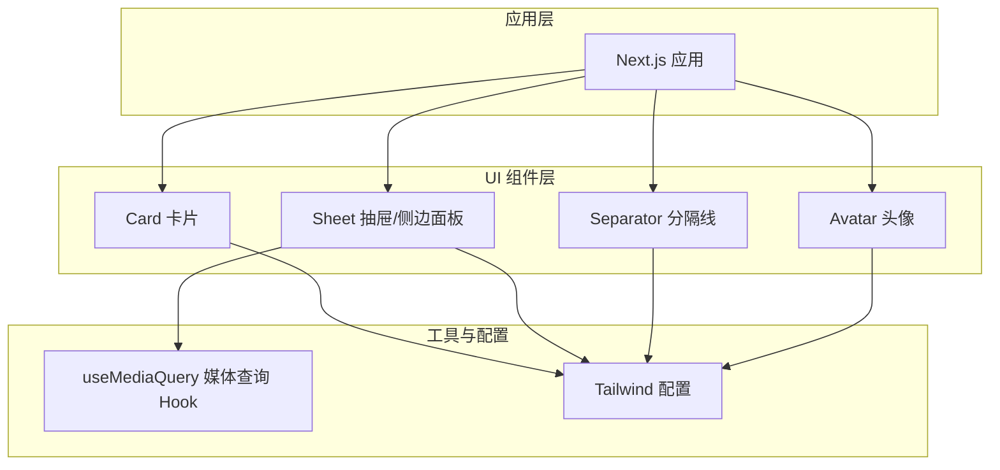
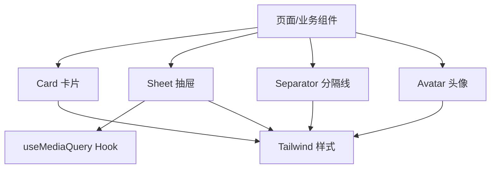
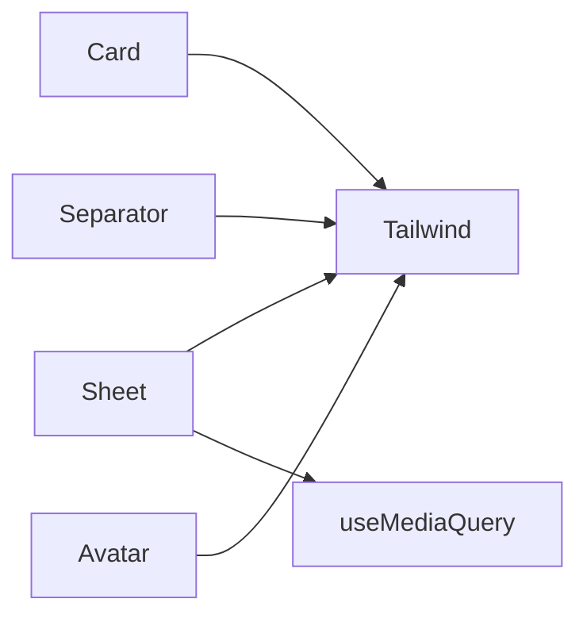

# 布局组件

<cite>
**本文引用的文件**   
- [apps/web/src/components/ui/card.tsx](file://apps/web/src/components/ui/card.tsx)
- [apps/web/src/components/ui/sheet.tsx](file://apps/web/src/components/ui/sheet.tsx)
- [apps/web/src/components/ui/separator.tsx](file://apps/web/src/components/ui/separator.tsx)
- [apps/web/src/components/ui/avatar.tsx](file://apps/web/src/components/ui/avatar.tsx)
- [apps/web/src/hooks/useMediaQuery.tsx](file://apps/web/src/hooks/useMediaQuery.tsx)
- [apps/web/tailwind.config.js](file://apps/web/tailwind.config.js)
</cite>

## 目录
1. [简介](#简介)
2. [项目结构](#项目结构)
3. [核心组件](#核心组件)
4. [架构总览](#架构总览)
5. [详细组件分析](#详细组件分析)
6. [依赖关系分析](#依赖关系分析)
7. [性能考量](#性能考量)
8. [故障排查指南](#故障排查指南)
9. [结论](#结论)
10. [附录](#附录)

## 简介
本章节面向布局相关的基础 UI 组件，包括卡片、抽屉（侧边面板）、分隔线和头像。文档将系统阐述各组件的布局特性、尺寸控制与响应式适配策略；解析层级关系、定位模式与空间分配；说明动画效果、过渡与交互行为；并提供组合使用模式、嵌套结构与复杂布局场景的实践建议与示例路径，帮助读者快速构建高质量的前端界面。

## 项目结构
本项目采用 Next.js + Tailwind CSS 的前端工程组织方式。布局组件集中在 apps/web/src/components/ui 目录下，按功能拆分独立文件，便于复用与维护。响应式能力通过 hooks 与 Tailwind 断点共同实现。

图表来源
- [apps/web/src/components/ui/card.tsx](file://apps/web/src/components/ui/card.tsx)
- [apps/web/src/components/ui/sheet.tsx](file://apps/web/src/components/ui/sheet.tsx)
- [apps/web/src/components/ui/separator.tsx](file://apps/web/src/components/ui/separator.tsx)
- [apps/web/src/components/ui/avatar.tsx](file://apps/web/src/components/ui/avatar.tsx)
- [apps/web/src/hooks/useMediaQuery.tsx](file://apps/web/src/hooks/useMediaQuery.tsx)
- [apps/web/tailwind.config.js](file://apps/web/tailwind.config.js)

章节来源
- [apps/web/src/components/ui/card.tsx](file://apps/web/src/components/ui/card.tsx)
- [apps/web/src/components/ui/sheet.tsx](file://apps/web/src/components/ui/sheet.tsx)
- [apps/web/src/components/ui/separator.tsx](file://apps/web/src/components/ui/separator.tsx)
- [apps/web/src/components/ui/avatar.tsx](file://apps/web/src/components/ui/avatar.tsx)
- [apps/web/src/hooks/useMediaQuery.tsx](file://apps/web/src/hooks/useMediaQuery.tsx)
- [apps/web/tailwind.config.js](file://apps/web/tailwind.config.js)

## 核心组件
本节对四个布局组件进行概览性说明，涵盖用途、布局特性、尺寸控制、响应式适配、动画与交互等关键维度。

- 卡片（Card）
  - 用途：承载内容区块，常用于信息展示、操作入口或表单容器。
  - 布局特性：默认块级容器，支持内边距、圆角、阴影与边框；内部可包含标题、描述、操作按钮等子元素。
  - 尺寸控制：可通过宽度、高度、最大/最小尺寸约束；在网格或弹性布局中自适应。
  - 响应式适配：结合 Tailwind 断点与 Flex/Grid 布局，在不同屏幕下调整间距与排版。
  - 动画与交互：悬停高亮、点击反馈、展开/收起等；可通过 CSS transition 或动画库增强。
  - 组合模式：与头像、分隔线、按钮等组合形成信息卡片、用户卡片、设置项等。

- 抽屉/侧边面板（Sheet）
  - 用途：提供覆盖式面板，用于展示详情、设置、导航或辅助操作。
  - 布局特性：固定定位覆盖层，支持从不同方向滑入（左/右/上/下），遮挡主内容或半遮罩。
  - 尺寸控制：宽度/高度可配置，支持百分比或固定值；移动端常占满屏或半屏。
  - 响应式适配：在小屏自动切换为全屏或底部抽屉；在大屏保持侧边抽屉。
  - 动画与交互：滑入/滑出过渡、遮罩点击关闭、Esc 键关闭、焦点管理。
  - 组合模式：与列表、表单、表格、媒体预览等组合，形成详情页、筛选面板、编辑器等。

- 分隔线（Separator）
  - 用途：视觉分割内容区域，提升可读性与层次。
  - 布局特性：水平或垂直分隔，支持虚线、颜色、粗细与间距。
  - 尺寸控制：长度随父容器或自定义；垂直分隔可设置高度。
  - 响应式适配：根据布局方向自动切换横/竖；在小屏隐藏或缩短。
  - 动画与交互：通常静态，但可与折叠面板联动显示/隐藏。
  - 组合模式：与卡片、列表、表单分组配合，划分逻辑区块。

- 头像（Avatar）
  - 用途：展示用户或实体标识图像。
  - 布局特性：圆形或方形，支持图标回退、加载状态与错误处理。
  - 尺寸控制：小/中/大等多档尺寸，支持自定义像素或比例。
  - 响应式适配：在小屏缩小或隐藏次要信息；在大屏增加尺寸与细节。
  - 动画与交互：加载骨架屏、缩放、旋转加载；点击可触发菜单或跳转。
  - 组合模式：与用户名、角色标签、操作按钮组合成用户条目、评论者信息等。

章节来源
- [apps/web/src/components/ui/card.tsx](file://apps/web/src/components/ui/card.tsx)
- [apps/web/src/components/ui/sheet.tsx](file://apps/web/src/components/ui/sheet.tsx)
- [apps/web/src/components/ui/separator.tsx](file://apps/web/src/components/ui/separator.tsx)
- [apps/web/src/components/ui/avatar.tsx](file://apps/web/src/components/ui/avatar.tsx)

## 架构总览
下图展示了布局组件在应用中的位置与依赖关系。组件层基于 Tailwind 样式体系，部分组件通过 Hook 获取媒体查询结果以驱动响应式行为。

图表来源
- [apps/web/src/components/ui/card.tsx](file://apps/web/src/components/ui/card.tsx)
- [apps/web/src/components/ui/sheet.tsx](file://apps/web/src/components/ui/sheet.tsx)
- [apps/web/src/components/ui/separator.tsx](file://apps/web/src/components/ui/separator.tsx)
- [apps/web/src/components/ui/avatar.tsx](file://apps/web/src/components/ui/avatar.tsx)
- [apps/web/src/hooks/useMediaQuery.tsx](file://apps/web/src/hooks/useMediaQuery.tsx)
- [apps/web/tailwind.config.js](file://apps/web/tailwind.config.js)

## 详细组件分析

### 卡片（Card）
- 设计要点
  - 作为内容容器，强调留白与层次；通过阴影、边框与圆角区分层级。
  - 内部结构建议：头部（标题/操作）、主体（文本/图片/表单）、底部（操作按钮）。
- 尺寸与布局
  - 宽度：默认 100% 或受父容器限制；可使用 max-width 控制最大宽度。
  - 高度：auto 或固定；在网格中通过列跨度控制。
  - 间距：统一 padding/margin，保证一致性。
- 响应式适配
  - 使用 Tailwind 断点调整内边距、字号与行高；在小屏减少装饰元素。
- 动画与交互
  - 悬停提升阴影或边框色；点击反馈；展开/收起内容时平滑过渡。
- 组合与嵌套
  - 嵌套多个卡片形成仪表盘；与头像、分隔线组合成用户信息卡。
- 示例场景
  - 用户信息卡：头像+姓名+角色+操作按钮。
  - 数据展示卡：标题+统计数字+迷你图+时间戳。
  - 设置项卡：开关+说明文字+分隔线。

章节来源
- [apps/web/src/components/ui/card.tsx](file://apps/web/src/components/ui/card.tsx)

### 抽屉/侧边面板（Sheet）
- 设计要点
  - 覆盖式面板，避免打断主流程；提供明确的关闭入口与键盘支持。
  - 内容密度适中，避免过度滚动；必要时分页或懒加载。
- 尺寸与布局
  - 宽度：移动端常为 100% 或 80%-90%，桌面端固定宽度（如 320px-480px）。
  - 方向：左/右/上/下，依据交互语义选择。
  - 遮罩：可选半透明背景，点击遮罩关闭。
- 响应式适配
  - 小屏自动切换为全屏或底部抽屉；大屏保持侧边。
- 动画与交互
  - 滑入/滑出过渡（transform/opacity）；焦点锁定在面板内；Esc 关闭。
- 组合与嵌套
  - 与表单、表格、媒体预览组合；内部可使用分隔线划分区块。
- 示例场景
  - 详情抽屉：从右侧滑入，展示文章详情与操作。
  - 筛选面板：左侧滑入，提供多维筛选条件。
  - 编辑器抽屉：顶部滑入，提供代码编辑与预览。

章节来源
- [apps/web/src/components/ui/sheet.tsx](file://apps/web/src/components/ui/sheet.tsx)
- [apps/web/src/hooks/useMediaQuery.tsx](file://apps/web/src/hooks/useMediaQuery.tsx)

### 分隔线（Separator）
- 设计要点
  - 简洁清晰，不抢夺注意力；颜色与粗细需与整体风格一致。
- 尺寸与布局
  - 水平：宽度 100%，高度 1px；垂直：高度 100%，宽度 1px。
  - 间距：上下或左右 margin/padding 控制。
- 响应式适配
  - 根据布局方向自动切换横/竖；在小屏隐藏或缩短。
- 动画与交互
  - 通常静态；可与折叠面板联动显示/隐藏。
- 组合与嵌套
  - 与卡片、列表、表单分组配合，划分逻辑区块。
- 示例场景
  - 用户信息卡内的基本信息与联系方式之间插入分隔线。
  - 设置页中不同分类之间的分隔。

章节来源
- [apps/web/src/components/ui/separator.tsx](file://apps/web/src/components/ui/separator.tsx)

### 头像（Avatar）
- 设计要点
  - 优先保证识别度；失败回退到图标或首字母；加载状态友好。
- 尺寸与布局
  - 多档尺寸（小/中/大），支持自定义；圆形为主，方形为辅。
  - 与文本对齐：垂直居中，行高匹配。
- 响应式适配
  - 小屏缩小尺寸或隐藏次要信息；大屏增加尺寸与细节。
- 动画与交互
  - 加载骨架屏、旋转加载；点击触发菜单或跳转。
- 组合与嵌套
  - 与用户名、角色标签、操作按钮组合成用户条目、评论者信息等。
- 示例场景
  - 评论列表：头像+用户名+时间+内容。
  - 用户资料卡：头像+姓名+职位+社交链接。

章节来源
- [apps/web/src/components/ui/avatar.tsx](file://apps/web/src/components/ui/avatar.tsx)

### 组合使用模式与复杂布局场景
- 常见组合
  - 卡片 + 头像 + 分隔线：用户信息卡、设置项卡。
  - 抽屉 + 分隔线 + 表单：详情抽屉、筛选面板、编辑器。
- 嵌套结构
  - 卡片内嵌多个子卡片，形成仪表盘或控制面板。
  - 抽屉内嵌列表、表格与媒体预览，形成富内容面板。
- 复杂布局
  - 网格布局：多列卡片自适应排列。
  - 弹性布局：横向/纵向排列，均匀分布或按需拉伸。
  - 栅格系统：跨列、对齐与间距控制。

章节来源
- [apps/web/src/components/ui/card.tsx](file://apps/web/src/components/ui/card.tsx)
- [apps/web/src/components/ui/sheet.tsx](file://apps/web/src/components/ui/sheet.tsx)
- [apps/web/src/components/ui/separator.tsx](file://apps/web/src/components/ui/separator.tsx)
- [apps/web/src/components/ui/avatar.tsx](file://apps/web/src/components/ui/avatar.tsx)

## 依赖关系分析
- 组件与样式
  - 所有布局组件均依赖 Tailwind CSS 进行样式控制，确保一致的视觉语言与响应式能力。
- 组件与 Hook
  - 抽屉组件依赖 useMediaQuery Hook 获取媒体查询结果，驱动响应式行为（如小屏全屏、大屏侧边）。
- 组件间耦合
  - 低耦合：各组件职责单一，易于替换与扩展。
  - 组合灵活：通过 props 与插槽（如有）自由组合，形成复杂界面。

图表来源
- [apps/web/src/components/ui/card.tsx](file://apps/web/src/components/ui/card.tsx)
- [apps/web/src/components/ui/sheet.tsx](file://apps/web/src/components/ui/sheet.tsx)
- [apps/web/src/components/ui/separator.tsx](file://apps/web/src/components/ui/separator.tsx)
- [apps/web/src/components/ui/avatar.tsx](file://apps/web/src/components/ui/avatar.tsx)
- [apps/web/src/hooks/useMediaQuery.tsx](file://apps/web/src/hooks/useMediaQuery.tsx)
- [apps/web/tailwind.config.js](file://apps/web/tailwind.config.js)

章节来源
- [apps/web/src/components/ui/card.tsx](file://apps/web/src/components/ui/card.tsx)
- [apps/web/src/components/ui/sheet.tsx](file://apps/web/src/components/ui/sheet.tsx)
- [apps/web/src/components/ui/separator.tsx](file://apps/web/src/components/ui/separator.tsx)
- [apps/web/src/components/ui/avatar.tsx](file://apps/web/src/components/ui/avatar.tsx)
- [apps/web/src/hooks/useMediaQuery.tsx](file://apps/web/src/hooks/useMediaQuery.tsx)
- [apps/web/tailwind.config.js](file://apps/web/tailwind.config.js)

## 性能考量
- 渲染优化
  - 避免不必要的重绘与回流；合理使用 key 与 memoization。
  - 长列表懒加载与虚拟滚动，减少初始渲染压力。
- 动画与过渡
  - 使用 GPU 加速属性（transform、opacity）提升流畅度。
  - 避免在高频事件中执行昂贵计算。
- 资源加载
  - 头像图片懒加载与占位骨架屏，提升感知性能。
  - 按需加载抽屉内容，减少首屏体积。
- 响应式计算
  - 媒体查询结果缓存，避免重复计算。
  - 合理设置断点，减少频繁的状态切换。

[本节为通用指导，无需特定文件引用]

## 故障排查指南
- 常见问题
  - 抽屉无法关闭：检查遮罩点击事件、Esc 键监听与焦点管理。
  - 响应式异常：确认媒体查询 Hook 返回值与断点配置是否正确。
  - 样式冲突：检查 Tailwind 优先级与自定义样式覆盖。
  - 头像加载失败：处理错误回退与占位图。
- 调试建议
  - 使用浏览器开发者工具检查 DOM 结构与样式。
  - 打印关键状态与事件流，定位问题根因。
  - 逐步简化组件树，隔离问题范围。

章节来源
- [apps/web/src/components/ui/sheet.tsx](file://apps/web/src/components/ui/sheet.tsx)
- [apps/web/src/hooks/useMediaQuery.tsx](file://apps/web/src/hooks/useMediaQuery.tsx)
- [apps/web/tailwind.config.js](file://apps/web/tailwind.config.js)

## 结论
卡片、抽屉、分隔线与头像作为基础布局组件，提供了丰富的组合能力与良好的响应式支持。通过合理的尺寸控制、动画设计与交互规范，可以构建出高效、美观且易维护的用户界面。建议在实际项目中遵循统一的样式约定与交互模式，确保一致的用户体验。

[本节为总结性内容，无需特定文件引用]

## 附录
- 最佳实践清单
  - 明确组件职责，保持单一功能。
  - 使用 Tailwind 断点进行响应式设计。
  - 为动画与过渡选择合适的属性，提升性能。
  - 处理加载、错误与空状态，提升用户体验。
  - 编写清晰的文档与示例，降低使用门槛。

[本节为补充信息，无需特定文件引用]