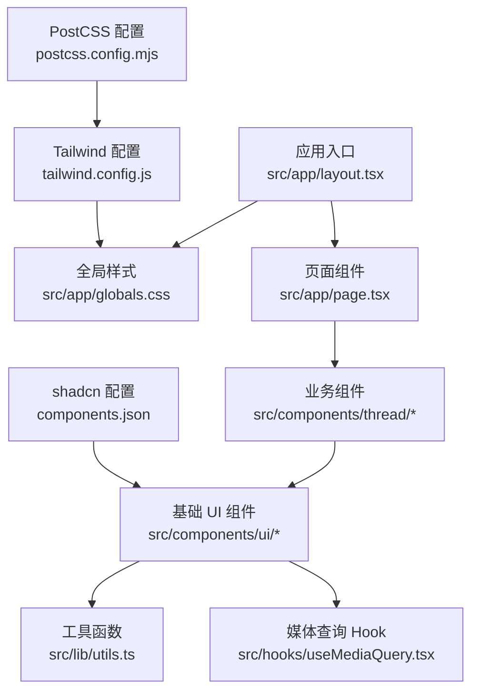
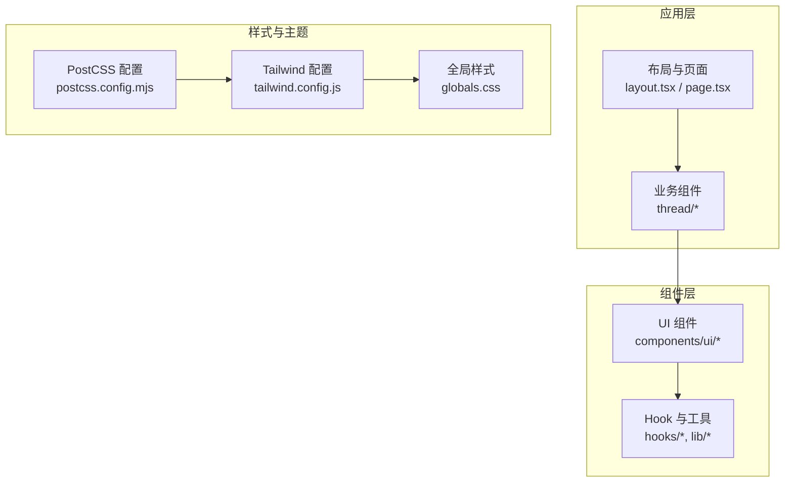
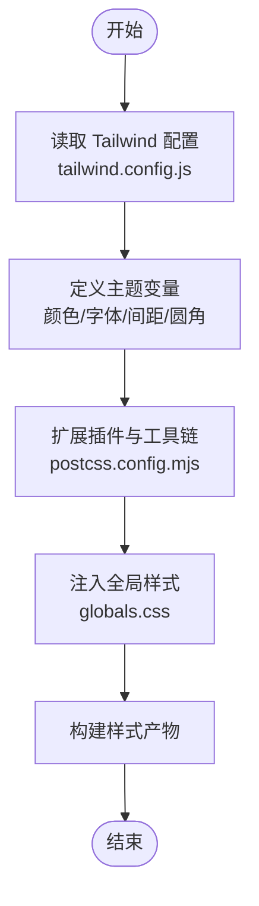
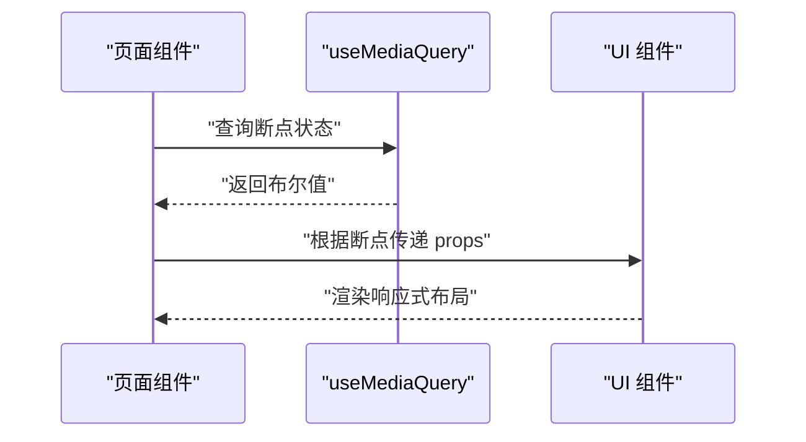
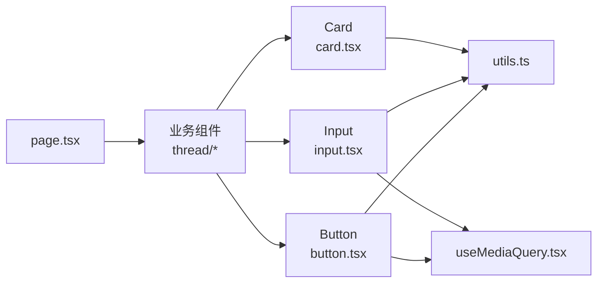

# 组件库概览

<cite>
**本文引用的文件**
- [package.json](file://apps/web/package.json)
- [tailwind.config.js](file://apps/web/tailwind.config.js)
- [postcss.config.mjs](file://apps/web/postcss.config.mjs)
- [components.json](file://apps/web/components.json)
- [globals.css](file://apps/web/src/app/globals.css)
- [button.tsx](file://apps/web/src/components/ui/button.tsx)
- [input.tsx](file://apps/web/src/components/ui/input.tsx)
- [card.tsx](file://apps/web/src/components/ui/card.tsx)
- [avatar.tsx](file://apps/web/src/components/ui/avatar.tsx)
- [label.tsx](file://apps/web/src/components/ui/label.tsx)
- [textarea.tsx](file://apps/web/src/components/ui/textarea.tsx)
- [switch.tsx](file://apps/web/src/components/ui/switch.tsx)
- [sheet.tsx](file://apps/web/src/components/ui/sheet.tsx)
- [tooltip.tsx](file://apps/web/src/components/ui/tooltip.tsx)
- [skeleton.tsx](file://apps/web/src/components/ui/skeleton.tsx)
- [sonner.tsx](file://apps/web/src/components/ui/sonner.tsx)
- [password-input.tsx](file://apps/web/src/components/ui/password-input.tsx)
- [separator.tsx](file://apps/web/src/components/ui/separator.tsx)
- [layout.tsx](file://apps/web/src/app/layout.tsx)
- [page.tsx](file://apps/web/src/app/page.tsx)
- [useMediaQuery.tsx](file://apps/web/src/hooks/useMediaQuery.tsx)
- [utils.ts](file://apps/web/src/lib/utils.ts)
</cite>

## 目录
1. [简介](#简介)
2. [项目结构](#项目结构)
3. [核心组件](#核心组件)
4. [架构总览](#架构总览)
5. [详细组件分析](#详细组件分析)
6. [依赖关系分析](#依赖关系分析)
7. [性能考量](#性能考量)
8. [故障排查指南](#故障排查指南)
9. [结论](#结论)
10. [附录](#附录)

## 简介
本文件为基于 shadcn/ui 的 UI 组件库概览，面向希望理解并高效使用本项目组件体系的开发者与产品人员。内容涵盖：
- 组件体系架构与设计原则
- 技术栈选择（Next.js、Tailwind CSS、Radix UI、class-variance-authority 等）
- Tailwind 配置、主题系统与样式定制策略
- 响应式设计模式、无障碍访问支持与跨浏览器兼容性方案
- 安装配置、导入方式与基本使用模式
- 版本管理、更新策略与依赖关系说明
- 最佳实践与性能优化建议

## 项目结构
本项目采用 Next.js 应用作为前端载体，UI 组件以“可复制粘贴”的方式组织在 src/components/ui 下，遵循 shadcn/ui 的设计哲学：组件即代码，便于按需定制与演进。

图表来源
- [layout.tsx](file://apps/web/src/app/layout.tsx)
- [globals.css](file://apps/web/src/app/globals.css)
- [page.tsx](file://apps/web/src/app/page.tsx)
- [tailwind.config.js](file://apps/web/tailwind.config.js)
- [postcss.config.mjs](file://apps/web/postcss.config.mjs)
- [components.json](file://apps/web/components.json)

章节来源
- [package.json](file://apps/web/package.json)
- [tailwind.config.js](file://apps/web/tailwind.config.js)
- [postcss.config.mjs](file://apps/web/postcss.config.mjs)
- [components.json](file://apps/web/components.json)
- [globals.css](file://apps/web/src/app/globals.css)
- [layout.tsx](file://apps/web/src/app/layout.tsx)
- [page.tsx](file://apps/web/src/app/page.tsx)

## 核心组件
以下为基础 UI 组件及其职责概述（均为 shadcn/ui 风格的可定制组件）：
- Button：按钮，支持变体、尺寸与禁用态
- Input：输入框，支持占位符、禁用态与表单集成
- Card：卡片容器，用于信息分组展示
- Avatar：头像，支持图片与占位
- Label：标签，用于表单控件关联
- Textarea：多行文本输入
- Switch：开关控件
- Sheet：侧边抽屉面板
- Tooltip：提示气泡
- Skeleton：骨架屏加载占位
- Sonner：轻量通知
- PasswordInput：密码输入（掩码）
- Separator：分割线

这些组件通过 class-variance-authority 提供变体系统，并通过 Tailwind CSS 实现样式定制。

章节来源
- [button.tsx](file://apps/web/src/components/ui/button.tsx)
- [input.tsx](file://apps/web/src/components/ui/input.tsx)
- [card.tsx](file://apps/web/src/components/ui/card.tsx)
- [avatar.tsx](file://apps/web/src/components/ui/avatar.tsx)
- [label.tsx](file://apps/web/src/components/ui/label.tsx)
- [textarea.tsx](file://apps/web/src/components/ui/textarea.tsx)
- [switch.tsx](file://apps/web/src/components/ui/switch.tsx)
- [sheet.tsx](file://apps/web/src/components/ui/sheet.tsx)
- [tooltip.tsx](file://apps/web/src/components/ui/tooltip.tsx)
- [skeleton.tsx](file://apps/web/src/components/ui/skeleton.tsx)
- [sonner.tsx](file://apps/web/src/components/ui/sonner.tsx)
- [password-input.tsx](file://apps/web/src/components/ui/password-input.tsx)
- [separator.tsx](file://apps/web/src/components/ui/separator.tsx)

## 架构总览
整体架构围绕 Next.js 应用、Tailwind 样式系统与 shadcn/ui 组件展开。组件层不直接依赖具体业务逻辑，而是通过 props 暴露能力；样式由 Tailwind 原子类与主题变量驱动；交互与状态由 React Hooks 与 Radix 底层原语保障。

图表来源
- [layout.tsx](file://apps/web/src/app/layout.tsx)
- [page.tsx](file://apps/web/src/app/page.tsx)
- [tailwind.config.js](file://apps/web/tailwind.config.js)
- [postcss.config.mjs](file://apps/web/postcss.config.mjs)
- [globals.css](file://apps/web/src/app/globals.css)

章节来源
- [layout.tsx](file://apps/web/src/app/layout.tsx)
- [page.tsx](file://apps/web/src/app/page.tsx)
- [tailwind.config.js](file://apps/web/tailwind.config.js)
- [postcss.config.mjs](file://apps/web/postcss.config.mjs)
- [globals.css](file://apps/web/src/app/globals.css)

## 详细组件分析

### 设计原则与技术栈
- 组件即代码：每个组件都是独立可编辑的文件，便于按业务需求定制
- 原子化样式：以 Tailwind CSS 为核心，结合 class-variance-authority 构建变体系统
- 无头 UI：交互语义由 Radix UI 提供，确保无障碍与键盘可达性
- 类型安全：TypeScript 贯穿组件与工具函数，提升可维护性
- 可测试性：组件与 Hook 易于单元测试与集成测试

章节来源
- [components.json](file://apps/web/components.json)
- [tailwind.config.js](file://apps/web/tailwind.config.js)
- [postcss.config.mjs](file://apps/web/postcss.config.mjs)
- [package.json](file://apps/web/package.json)

### Tailwind CSS 配置与主题系统
- 主题扩展：在 tailwind.config.js 中定义颜色、字体、间距、圆角等主题变量
- 插件与工具链：通过 postcss.config.mjs 引入必要的 PostCSS 插件
- 全局样式：在 globals.css 中注入基础样式与自定义 CSS 变量
- 动态样式：结合 class-variance-authority 生成变体类名，避免重复样式

图表来源
- [tailwind.config.js](file://apps/web/tailwind.config.js)
- [postcss.config.mjs](file://apps/web/postcss.config.mjs)
- [globals.css](file://apps/web/src/app/globals.css)

章节来源
- [tailwind.config.js](file://apps/web/tailwind.config.js)
- [postcss.config.mjs](file://apps/web/postcss.config.mjs)
- [globals.css](file://apps/web/src/app/globals.css)

### 响应式设计模式
- 断点策略：基于 Tailwind 的断点系统，统一移动端、平板与桌面端适配
- 媒体查询 Hook：useMediaQuery 封装常用断点判断，供组件或业务逻辑复用
- 组件级响应：在组件内部根据断点切换布局与行为

图表来源
- [useMediaQuery.tsx](file://apps/web/src/hooks/useMediaQuery.tsx)
- [page.tsx](file://apps/web/src/app/page.tsx)

章节来源
- [useMediaQuery.tsx](file://apps/web/src/hooks/useMediaQuery.tsx)
- [page.tsx](file://apps/web/src/app/page.tsx)

### 无障碍访问支持
- 语义化元素：优先使用原生 HTML 语义，必要时借助 Radix UI 的无头组件
- 键盘可达性：Tab 顺序、焦点管理与快捷键支持
- 屏幕阅读器：aria-* 属性完善，确保读屏软件正确播报
- 对比度与可见性：遵循 WCAG 对比度标准，提供高对比度主题

章节来源
- [button.tsx](file://apps/web/src/components/ui/button.tsx)
- [input.tsx](file://apps/web/src/components/ui/input.tsx)
- [label.tsx](file://apps/web/src/components/ui/label.tsx)
- [switch.tsx](file://apps/web/src/components/ui/switch.tsx)
- [tooltip.tsx](file://apps/web/src/components/ui/tooltip.tsx)

### 跨浏览器兼容性方案
- Polyfill 与降级：对现代 API 提供兼容处理
- 特性检测：在运行时检测浏览器能力，动态启用或降级功能
- 样式兼容：避免使用未广泛支持的 CSS 特性，必要时提供回退方案

章节来源
- [globals.css](file://apps/web/src/app/globals.css)
- [tailwind.config.js](file://apps/web/tailwind.config.js)

### 安装配置、导入方式与基本使用模式
- 安装与初始化：通过 pnpm 安装依赖，运行 shadcn/ui 初始化命令
- 组件导入：从 components/ui 路径导入所需组件
- 基本用法：通过 props 控制组件外观与行为，组合使用构建复杂界面

章节来源
- [package.json](file://apps/web/package.json)
- [components.json](file://apps/web/components.json)
- [button.tsx](file://apps/web/src/components/ui/button.tsx)
- [input.tsx](file://apps/web/src/components/ui/input.tsx)
- [card.tsx](file://apps/web/src/components/ui/card.tsx)

### 版本管理、更新策略与依赖关系
- 依赖锁定：使用 pnpm-lock.yaml 锁定依赖版本，保证一致性
- 组件版本：shadcn/ui 组件随项目迭代更新，建议定期审查变更日志
- 升级策略：小步快跑，先升级开发依赖，再升级生产依赖，配合自动化测试验证

章节来源
- [package.json](file://apps/web/package.json)
- [pnpm-lock.yaml](file://pnpm-lock.yaml)

### 最佳实践与性能优化建议
- 按需导入：仅导入使用的组件，减少打包体积
- 懒加载：对重型组件进行路由级或条件懒加载
- 样式优化：避免过度嵌套，利用 Tailwind 原子类减少重复样式
- 缓存策略：合理使用浏览器缓存与服务端缓存
- 监控与度量：接入性能监控，关注首屏时间与交互延迟

章节来源
- [page.tsx](file://apps/web/src/app/page.tsx)
- [layout.tsx](file://apps/web/src/app/layout.tsx)
- [tailwind.config.js](file://apps/web/tailwind.config.js)

## 依赖关系分析
组件之间的依赖关系清晰，UI 组件主要依赖工具函数与 Hook，业务组件通过 props 与 UI 组件解耦。

图表来源
- [page.tsx](file://apps/web/src/app/page.tsx)
- [button.tsx](file://apps/web/src/components/ui/button.tsx)
- [input.tsx](file://apps/web/src/components/ui/input.tsx)
- [card.tsx](file://apps/web/src/components/ui/card.tsx)
- [utils.ts](file://apps/web/src/lib/utils.ts)
- [useMediaQuery.tsx](file://apps/web/src/hooks/useMediaQuery.tsx)

章节来源
- [page.tsx](file://apps/web/src/app/page.tsx)
- [button.tsx](file://apps/web/src/components/ui/button.tsx)
- [input.tsx](file://apps/web/src/components/ui/input.tsx)
- [card.tsx](file://apps/web/src/components/ui/card.tsx)
- [utils.ts](file://apps/web/src/lib/utils.ts)
- [useMediaQuery.tsx](file://apps/web/src/hooks/useMediaQuery.tsx)

## 性能考量
- 构建优化：Tree-shaking 与 Code Splitting 减少包体
- 渲染优化：避免不必要的重渲染，使用 React.memo 与 useMemo
- 样式优化：减少 CSS 体积，避免关键渲染路径阻塞
- 资源优化：图片与字体懒加载，CDN 加速

[本节为通用指导，无需特定文件引用]

## 故障排查指南
- 样式未生效：检查 Tailwind 配置与 PostCSS 插件是否正确引入
- 组件报错：确认依赖版本一致，查看控制台错误堆栈
- 响应式异常：验证 useMediaQuery 断点设置与 CSS 媒体查询
- 无障碍问题：使用屏幕阅读器与键盘导航测试

章节来源
- [tailwind.config.js](file://apps/web/tailwind.config.js)
- [postcss.config.mjs](file://apps/web/postcss.config.mjs)
- [useMediaQuery.tsx](file://apps/web/src/hooks/useMediaQuery.tsx)
- [globals.css](file://apps/web/src/app/globals.css)

## 结论
本项目以 shadcn/ui 为核心，结合 Tailwind CSS 与 Next.js，构建了灵活、可定制且高性能的 UI 组件库。通过清晰的架构与良好的工程实践，团队能够快速迭代并保持代码质量。建议持续遵循本文的最佳实践，确保组件库的稳定与可扩展。

[本节为总结性内容，无需特定文件引用]

## 附录
- 术语表：shadcn/ui、Tailwind CSS、Radix UI、class-variance-authority
- 参考链接：官方文档与社区示例

[本节为补充信息，无需特定文件引用]