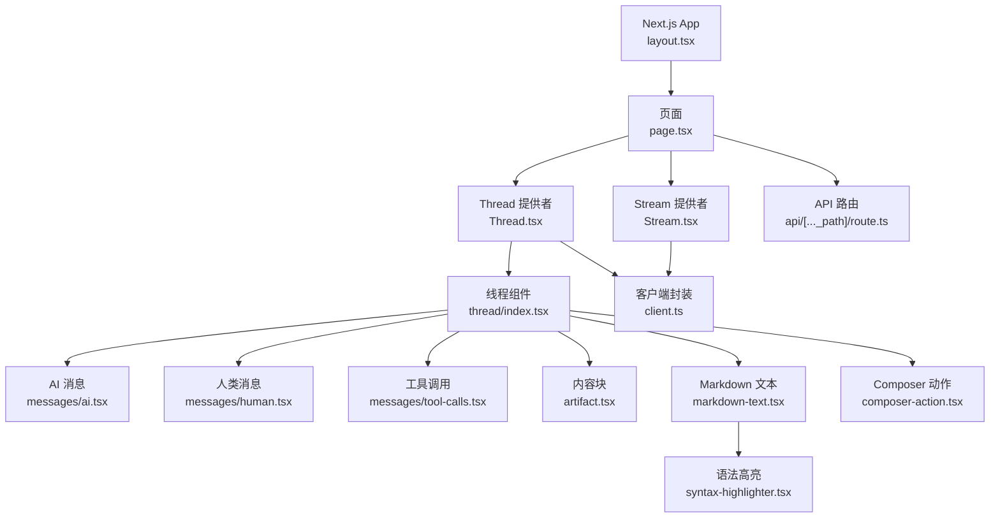
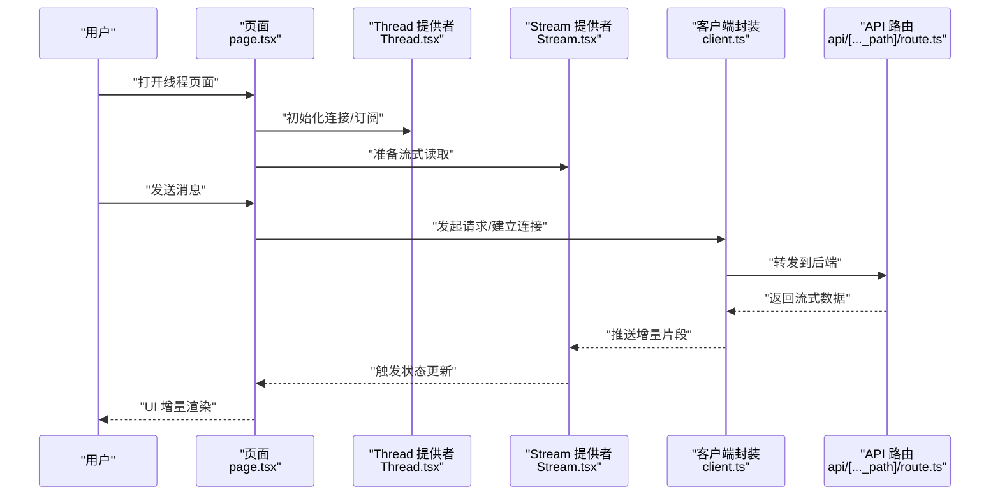
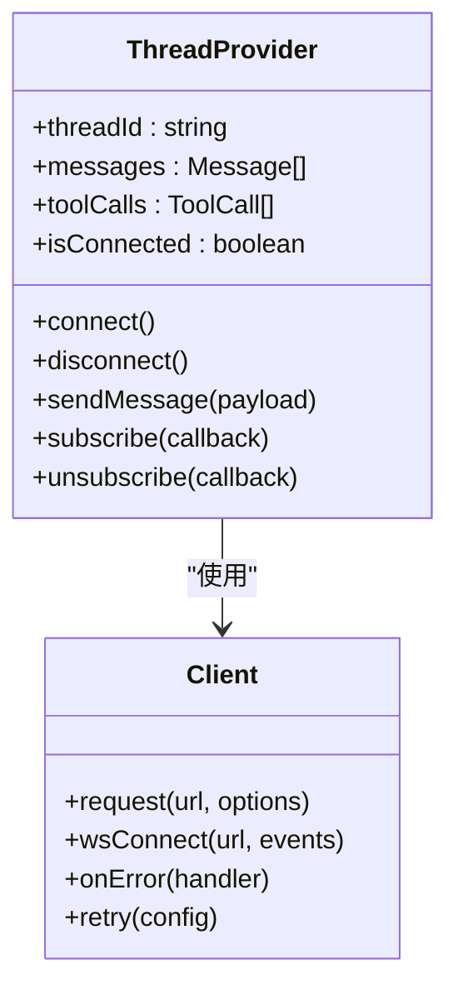
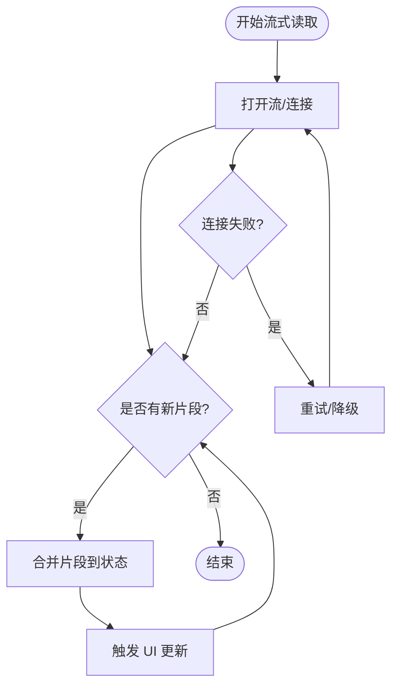
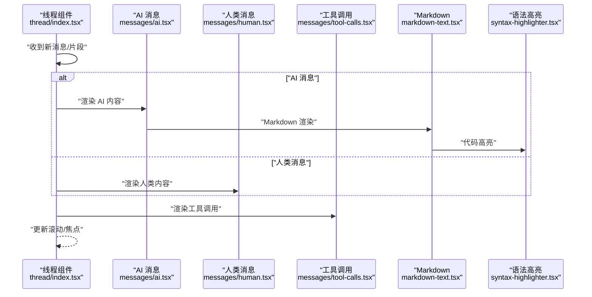
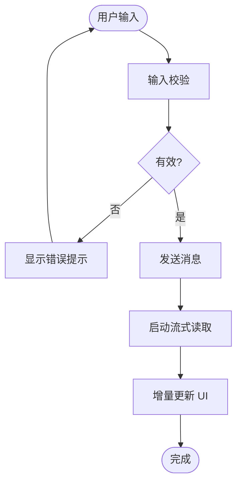
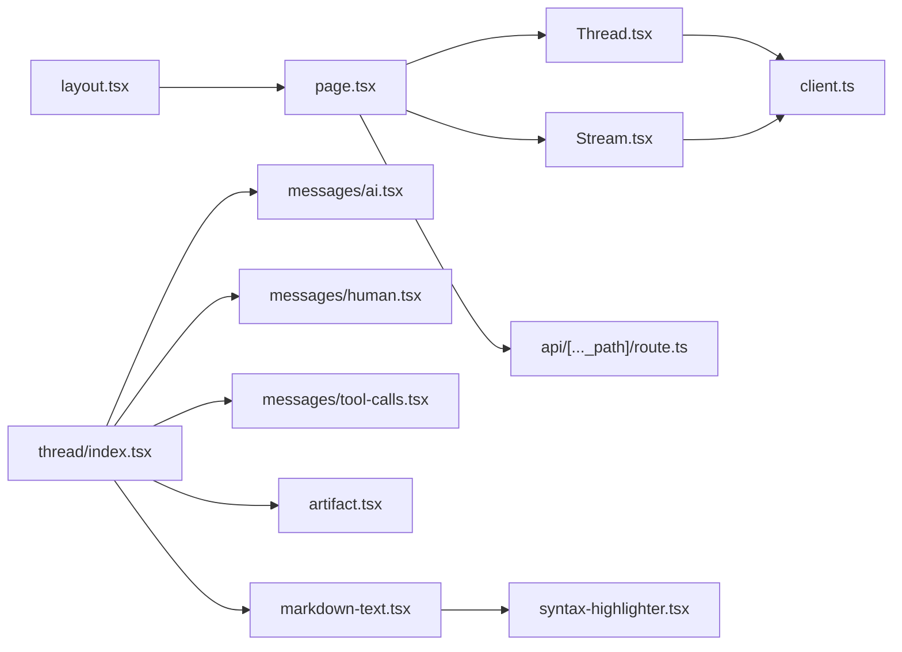

# Web应用

<cite>
**本文引用的文件**   
- [apps/web/src/app/layout.tsx](file://apps/web/src/app/layout.tsx)
- [apps/web/src/app/page.tsx](file://apps/web/src/app/page.tsx)
- [apps/web/src/app/api/[..._path]/route.ts](file://apps/web/src/app/api/[..._path]/route.ts)
- [apps/web/src/providers/Stream.tsx](file://apps/web/src/providers/Stream.tsx)
- [apps/web/src/providers/Thread.tsx](file://apps/web/src/providers/Thread.tsx)
- [apps/web/src/providers/client.ts](file://apps/web/src/providers/client.ts)
- [apps/web/src/components/thread/index.tsx](file://apps/web/src/components/thread/index.tsx)
- [apps/web/src/components/thread/messages/ai.tsx](file://apps/web/src/components/thread/messages/ai.tsx)
- [apps/web/src/components/thread/messages/human.tsx](file://apps/web/src/components/thread/messages/human.tsx)
- [apps/web/src/components/thread/messages/tool-calls.tsx](file://apps/web/src/components/thread/messages/tool-calls.tsx)
- [apps/web/src/components/thread/artifact.tsx](file://apps/web/src/components/thread/artifact.tsx)
- [apps/web/src/components/thread/composer-action.tsx](file://apps/web/src/components/thread/composer-action.tsx)
- [apps/web/src/components/thread/markdown-text.tsx](file://apps/web/src/components/thread/markdown-text.tsx)
- [apps/web/src/components/thread/syntax-highlighter.tsx](file://apps/web/src/components/thread/syntax-highlighter.tsx)
- [apps/web/src/lib/composer.ts](file://apps/web/src/lib/composer.ts)
- [apps/web/src/lib/utils.ts](file://apps/web/src/lib/utils.ts)
- [apps/web/src/hooks/useMediaQuery.tsx](file://apps/web/src/hooks/useMediaQuery.tsx)
- [apps/web/tailwind.config.js](file://apps/web/tailwind.config.js)
- [apps/web/next.config.mjs](file://apps/web/next.config.mjs)
- [apps/web/package.json](file://apps/web/package.json)
</cite>

## 目录
1. [简介](#简介)
2. [项目结构](#项目结构)
3. [核心组件](#核心组件)
4. [架构总览](#架构总览)
5. [详细组件分析](#详细组件分析)
6. [依赖关系分析](#依赖关系分析)
7. [性能考虑](#性能考虑)
8. [故障排查指南](#故障排查指南)
9. [结论](#结论)
10. [附录](#附录)

## 简介
本仓库包含一个基于 Next.js 的 Web 应用，重点围绕“线程（Thread）”与“流式响应（Stream）”能力构建。前端采用 App Router 组织页面与布局，通过自定义 Provider 管理 WebSocket 连接与应用状态，使用组件化方式渲染消息、工具调用与内容块，并支持流式增量更新与实时通信。本文档将从系统架构、组件层次、数据流、错误处理、性能优化与安全部署等方面进行全面说明，并提供扩展与定制指南。

## 项目结构
- 应用入口与路由
  - 根布局与全局样式：[apps/web/src/app/layout.tsx](file://apps/web/src/app/layout.tsx)
  - 首页与页面示例：[apps/web/src/app/page.tsx](file://apps/web/src/app/page.tsx)
  - API 代理路由（通配符）：[apps/web/src/app/api/[..._path]/route.ts](file://apps/web/src/app/api/[..._path]/route.ts)
- 状态与连接管理
  - 流式提供者（SSE/流式读取）：[apps/web/src/providers/Stream.tsx](file://apps/web/src/providers/Stream.tsx)
  - 线程提供者（WebSocket/状态同步）：[apps/web/src/providers/Thread.tsx](file://apps/web/src/providers/Thread.tsx)
  - 客户端封装（请求/事件）：[apps/web/src/providers/client.ts](file://apps/web/src/providers/client.ts)
- 线程与消息渲染
  - 线程容器与编排：[apps/web/src/components/thread/index.tsx](file://apps/web/src/components/thread/index.tsx)
  - AI/人类消息渲染：[apps/web/src/components/thread/messages/ai.tsx](file://apps/web/src/components/thread/messages/ai.tsx)、[apps/web/src/components/thread/messages/human.tsx](file://apps/web/src/components/thread/messages/human.tsx)
  - 工具调用渲染：[apps/web/src/components/thread/messages/tool-calls.tsx](file://apps/web/src/components/thread/messages/tool-calls.tsx)
  - 内容块与预览：[apps/web/src/components/thread/artifact.tsx](file://apps/web/src/components/thread/artifact.tsx)
  - Markdown 与语法高亮：[apps/web/src/components/thread/markdown-text.tsx](file://apps/web/src/components/thread/markdown-text.tsx)、[apps/web/src/components/thread/syntax-highlighter.tsx](file://apps/web/src/components/thread/syntax-highlighter.tsx)
  - 输入与交互：[apps/web/src/components/thread/composer-action.tsx](file://apps/web/src/components/thread/composer-action.tsx)
- 工具与钩子
  - 通用工具函数：[apps/web/src/lib/utils.ts](file://apps/web/src/lib/utils.ts)
  - 编辑器/Composer 逻辑：[apps/web/src/lib/composer.ts](file://apps/web/src/lib/composer.ts)
  - 媒体查询钩子：[apps/web/src/hooks/useMediaQuery.tsx](file://apps/web/src/hooks/useMediaQuery.tsx)
- 配置与构建
  - Tailwind 配置：[apps/web/tailwind.config.js](file://apps/web/tailwind.config.js)
  - Next.js 配置：[apps/web/next.config.mjs](file://apps/web/next.config.mjs)
  - 包管理与脚本：[apps/web/package.json](file://apps/web/package.json)

**图表来源** 
- [apps/web/src/app/layout.tsx](file://apps/web/src/app/layout.tsx)
- [apps/web/src/app/page.tsx](file://apps/web/src/app/page.tsx)
- [apps/web/src/providers/Thread.tsx](file://apps/web/src/providers/Thread.tsx)
- [apps/web/src/providers/Stream.tsx](file://apps/web/src/providers/Stream.tsx)
- [apps/web/src/components/thread/index.tsx](file://apps/web/src/components/thread/index.tsx)
- [apps/web/src/components/thread/messages/ai.tsx](file://apps/web/src/components/thread/messages/ai.tsx)
- [apps/web/src/components/thread/messages/human.tsx](file://apps/web/src/components/thread/messages/human.tsx)
- [apps/web/src/components/thread/messages/tool-calls.tsx](file://apps/web/src/components/thread/messages/tool-calls.tsx)
- [apps/web/src/components/thread/artifact.tsx](file://apps/web/src/components/thread/artifact.tsx)
- [apps/web/src/components/thread/markdown-text.tsx](file://apps/web/src/components/thread/markdown-text.tsx)
- [apps/web/src/components/thread/syntax-highlighter.tsx](file://apps/web/src/components/thread/syntax-highlighter.tsx)
- [apps/web/src/components/thread/composer-action.tsx](file://apps/web/src/components/thread/composer-action.tsx)
- [apps/web/src/providers/client.ts](file://apps/web/src/providers/client.ts)
- [apps/web/src/app/api/[..._path]/route.ts](file://apps/web/src/app/api/[..._path]/route.ts)

**章节来源**
- [apps/web/src/app/layout.tsx](file://apps/web/src/app/layout.tsx)
- [apps/web/src/app/page.tsx](file://apps/web/src/app/page.tsx)
- [apps/web/src/app/api/[..._path]/route.ts](file://apps/web/src/app/api/[..._path]/route.ts)
- [apps/web/src/providers/Stream.tsx](file://apps/web/src/providers/Stream.tsx)
- [apps/web/src/providers/Thread.tsx](file://apps/web/src/providers/Thread.tsx)
- [apps/web/src/providers/client.ts](file://apps/web/src/providers/client.ts)
- [apps/web/src/components/thread/index.tsx](file://apps/web/src/components/thread/index.tsx)
- [apps/web/src/components/thread/messages/ai.tsx](file://apps/web/src/components/thread/messages/ai.tsx)
- [apps/web/src/components/thread/messages/human.tsx](file://apps/web/src/components/thread/messages/human.tsx)
- [apps/web/src/components/thread/messages/tool-calls.tsx](file://apps/web/src/components/thread/messages/tool-calls.tsx)
- [apps/web/src/components/thread/artifact.tsx](file://apps/web/src/components/thread/artifact.tsx)
- [apps/web/src/components/thread/markdown-text.tsx](file://apps/web/src/components/thread/markdown-text.tsx)
- [apps/web/src/components/thread/syntax-highlighter.tsx](file://apps/web/src/components/thread/syntax-highlighter.tsx)
- [apps/web/src/components/thread/composer-action.tsx](file://apps/web/src/components/thread/composer-action.tsx)
- [apps/web/src/lib/composer.ts](file://apps/web/src/lib/composer.ts)
- [apps/web/src/lib/utils.ts](file://apps/web/src/lib/utils.ts)
- [apps/web/src/hooks/useMediaQuery.tsx](file://apps/web/src/hooks/useMediaQuery.tsx)
- [apps/web/tailwind.config.js](file://apps/web/tailwind.config.js)
- [apps/web/next.config.mjs](file://apps/web/next.config.mjs)
- [apps/web/package.json](file://apps/web/package.json)

## 核心组件
- Thread 提供者
  - 职责：维护线程上下文、WebSocket 连接生命周期、消息队列与状态同步；向子树暴露 threadState、send、subscribe 等能力。
  - 关键点：重连策略、断线恢复、消息去重与幂等性、订阅/取消订阅。
- Stream 提供者
  - 职责：管理流式读取（如 SSE/ReadableStream），将增量片段合并到 UI，提供进度与错误回调。
  - 关键点：背压处理、分片合并、超时与重试、可中断流。
- 客户端封装
  - 职责：统一 HTTP/WebSocket 调用、鉴权头注入、错误映射与重试。
  - 关键点：拦截器、错误分类（网络/业务）、指数退避。
- 线程组件
  - 职责：渲染消息列表、工具调用、内容块与 Composer 输入区；响应状态变化进行滚动与聚焦。
  - 关键点：虚拟滚动（可选）、增量渲染、无障碍与键盘导航。
- 消息渲染
  - AI/人类消息：区分角色、富文本与附件展示。
  - 工具调用：参数、结果、状态指示。
  - 内容块：多模态预览、代码高亮、Markdown 渲染。
- Composer 动作
  - 职责：用户输入处理、发送、取消、重试、附件上传。
  - 关键点：防抖、节流、输入校验、错误提示。

**章节来源**
- [apps/web/src/providers/Thread.tsx](file://apps/web/src/providers/Thread.tsx)
- [apps/web/src/providers/Stream.tsx](file://apps/web/src/providers/Stream.tsx)
- [apps/web/src/providers/client.ts](file://apps/web/src/providers/client.ts)
- [apps/web/src/components/thread/index.tsx](file://apps/web/src/components/thread/index.tsx)
- [apps/web/src/components/thread/messages/ai.tsx](file://apps/web/src/components/thread/messages/ai.tsx)
- [apps/web/src/components/thread/messages/human.tsx](file://apps/web/src/components/thread/messages/human.tsx)
- [apps/web/src/components/thread/messages/tool-calls.tsx](file://apps/web/src/components/thread/messages/tool-calls.tsx)
- [apps/web/src/components/thread/artifact.tsx](file://apps/web/src/components/thread/artifact.tsx)
- [apps/web/src/components/thread/markdown-text.tsx](file://apps/web/src/components/thread/markdown-text.tsx)
- [apps/web/src/components/thread/syntax-highlighter.tsx](file://apps/web/src/components/thread/syntax-highlighter.tsx)
- [apps/web/src/components/thread/composer-action.tsx](file://apps/web/src/components/thread/composer-action.tsx)
- [apps/web/src/lib/composer.ts](file://apps/web/src/lib/composer.ts)
- [apps/web/src/lib/utils.ts](file://apps/web/src/lib/utils.ts)

## 架构总览
整体采用“Provider + 组件树”的模式：
- 顶层布局包裹 Thread 与 Stream 提供者，确保全应用共享连接与状态。
- 页面层组合线程组件与 UI 组件，完成消息渲染与用户交互。
- API 路由作为后端代理或中间层，转发请求至服务并返回流式响应。

**图表来源** 
- [apps/web/src/app/page.tsx](file://apps/web/src/app/page.tsx)
- [apps/web/src/providers/Thread.tsx](file://apps/web/src/providers/Thread.tsx)
- [apps/web/src/providers/Stream.tsx](file://apps/web/src/providers/Stream.tsx)
- [apps/web/src/providers/client.ts](file://apps/web/src/providers/client.ts)
- [apps/web/src/app/api/[..._path]/route.ts](file://apps/web/src/app/api/[..._path]/route.ts)

**章节来源**
- [apps/web/src/app/page.tsx](file://apps/web/src/app/page.tsx)
- [apps/web/src/providers/Thread.tsx](file://apps/web/src/providers/Thread.tsx)
- [apps/web/src/providers/Stream.tsx](file://apps/web/src/providers/Stream.tsx)
- [apps/web/src/providers/client.ts](file://apps/web/src/providers/client.ts)
- [apps/web/src/app/api/[..._path]/route.ts](file://apps/web/src/app/api/[..._path]/route.ts)

## 详细组件分析

### Thread 提供者与状态管理
- 状态模型
  - 线程 ID、消息列表、工具调用状态、中断与恢复标记、加载与错误状态。
- 连接管理
  - WebSocket 建立、心跳保活、自动重连、断线通知。
- 消息同步
  - 增量追加、去重、排序、持久化（可选）。
- 订阅机制
  - 订阅/取消订阅、批量更新、最小化重渲染。

**图表来源** 
- [apps/web/src/providers/Thread.tsx](file://apps/web/src/providers/Thread.tsx)
- [apps/web/src/providers/client.ts](file://apps/web/src/providers/client.ts)

**章节来源**
- [apps/web/src/providers/Thread.tsx](file://apps/web/src/providers/Thread.tsx)
- [apps/web/src/providers/client.ts](file://apps/web/src/providers/client.ts)

### Stream 提供者与流式响应
- 流式读取
  - 使用 ReadableStream/SSE 接收增量片段，合并为完整内容。
- 进度与错误
  - 进度回调、错误分类（网络/解析/超时）、重试策略。
- 内存与性能
  - 分片大小控制、惰性渲染、避免大对象复制。

**图表来源** 
- [apps/web/src/providers/Stream.tsx](file://apps/web/src/providers/Stream.tsx)

**章节来源**
- [apps/web/src/providers/Stream.tsx](file://apps/web/src/providers/Stream.tsx)

### 线程组件与消息渲染
- 渲染流程
  - 遍历消息列表，按角色选择渲染器（AI/人类/工具调用）。
  - 内容块与 Markdown 渲染，代码高亮与预览。
- 交互行为
  - 点击展开/折叠、复制、下载、内联编辑（可选）。
  - 滚动跟随、焦点管理、键盘可达性。
- 状态同步
  - 增量更新时保持滚动位置与光标状态。

**图表来源** 
- [apps/web/src/components/thread/index.tsx](file://apps/web/src/components/thread/index.tsx)
- [apps/web/src/components/thread/messages/ai.tsx](file://apps/web/src/components/thread/messages/ai.tsx)
- [apps/web/src/components/thread/messages/human.tsx](file://apps/web/src/components/thread/messages/human.tsx)
- [apps/web/src/components/thread/messages/tool-calls.tsx](file://apps/web/src/components/thread/messages/tool-calls.tsx)
- [apps/web/src/components/thread/markdown-text.tsx](file://apps/web/src/components/thread/markdown-text.tsx)
- [apps/web/src/components/thread/syntax-highlighter.tsx](file://apps/web/src/components/thread/syntax-highlighter.tsx)

**章节来源**
- [apps/web/src/components/thread/index.tsx](file://apps/web/src/components/thread/index.tsx)
- [apps/web/src/components/thread/messages/ai.tsx](file://apps/web/src/components/thread/messages/ai.tsx)
- [apps/web/src/components/thread/messages/human.tsx](file://apps/web/src/components/thread/messages/human.tsx)
- [apps/web/src/components/thread/messages/tool-calls.tsx](file://apps/web/src/components/thread/messages/tool-calls.tsx)
- [apps/web/src/components/thread/markdown-text.tsx](file://apps/web/src/components/thread/markdown-text.tsx)
- [apps/web/src/components/thread/syntax-highlighter.tsx](file://apps/web/src/components/thread/syntax-highlighter.tsx)

### Composer 动作与用户输入
- 功能要点
  - 输入校验、防抖/节流、附件上传、发送/取消/重试。
  - 与 Thread 提供者集成，触发消息发送与状态更新。
- 用户体验
  - 即时反馈、错误提示、占位与骨架屏。

**图表来源** 
- [apps/web/src/components/thread/composer-action.tsx](file://apps/web/src/components/thread/composer-action.tsx)
- [apps/web/src/lib/composer.ts](file://apps/web/src/lib/composer.ts)

**章节来源**
- [apps/web/src/components/thread/composer-action.tsx](file://apps/web/src/components/thread/composer-action.tsx)
- [apps/web/src/lib/composer.ts](file://apps/web/src/lib/composer.ts)

### 内容块与多模态预览
- 内容块
  - 图片、文档、代码片段等多类型渲染。
- 多模态
  - 预览缩略图、懒加载、安全过滤（XSS/CSP）。

**章节来源**
- [apps/web/src/components/thread/artifact.tsx](file://apps/web/src/components/thread/artifact.tsx)

## 依赖关系分析
- 组件耦合
  - Thread 与 Stream 提供者解耦，通过 client.ts 统一通信。
  - 线程组件仅依赖提供者暴露的状态与事件，不直接操作连接。
- 外部依赖
  - Next.js App Router、Tailwind CSS、Markdown 渲染库、语法高亮库。
- 潜在循环
  - 避免在提供者中引入页面组件，防止循环依赖。

**图表来源** 
- [apps/web/src/app/layout.tsx](file://apps/web/src/app/layout.tsx)
- [apps/web/src/app/page.tsx](file://apps/web/src/app/page.tsx)
- [apps/web/src/providers/Thread.tsx](file://apps/web/src/providers/Thread.tsx)
- [apps/web/src/providers/Stream.tsx](file://apps/web/src/providers/Stream.tsx)
- [apps/web/src/providers/client.ts](file://apps/web/src/providers/client.ts)
- [apps/web/src/app/api/[..._path]/route.ts](file://apps/web/src/app/api/[..._path]/route.ts)
- [apps/web/src/components/thread/index.tsx](file://apps/web/src/components/thread/index.tsx)
- [apps/web/src/components/thread/messages/ai.tsx](file://apps/web/src/components/thread/messages/ai.tsx)
- [apps/web/src/components/thread/messages/human.tsx](file://apps/web/src/components/thread/messages/human.tsx)
- [apps/web/src/components/thread/messages/tool-calls.tsx](file://apps/web/src/components/thread/messages/tool-calls.tsx)
- [apps/web/src/components/thread/artifact.tsx](file://apps/web/src/components/thread/artifact.tsx)
- [apps/web/src/components/thread/markdown-text.tsx](file://apps/web/src/components/thread/markdown-text.tsx)
- [apps/web/src/components/thread/syntax-highlighter.tsx](file://apps/web/src/components/thread/syntax-highlighter.tsx)

**章节来源**
- [apps/web/src/app/layout.tsx](file://apps/web/src/app/layout.tsx)
- [apps/web/src/app/page.tsx](file://apps/web/src/app/page.tsx)
- [apps/web/src/providers/Thread.tsx](file://apps/web/src/providers/Thread.tsx)
- [apps/web/src/providers/Stream.tsx](file://apps/web/src/providers/Stream.tsx)
- [apps/web/src/providers/client.ts](file://apps/web/src/providers/client.ts)
- [apps/web/src/app/api/[..._path]/route.ts](file://apps/web/src/app/api/[..._path]/route.ts)
- [apps/web/src/components/thread/index.tsx](file://apps/web/src/components/thread/index.tsx)
- [apps/web/src/components/thread/messages/ai.tsx](file://apps/web/src/components/thread/messages/ai.tsx)
- [apps/web/src/components/thread/messages/human.tsx](file://apps/web/src/components/thread/messages/human.tsx)
- [apps/web/src/components/thread/messages/tool-calls.tsx](file://apps/web/src/components/thread/messages/tool-calls.tsx)
- [apps/web/src/components/thread/artifact.tsx](file://apps/web/src/components/thread/artifact.tsx)
- [apps/web/src/components/thread/markdown-text.tsx](file://apps/web/src/components/thread/markdown-text.tsx)
- [apps/web/src/components/thread/syntax-highlighter.tsx](file://apps/web/src/components/thread/syntax-highlighter.tsx)

## 性能考虑
- 渲染优化
  - 增量更新与最小化重渲染，避免整树重建。
  - 虚拟滚动（长列表场景），按需加载与懒渲染。
- 流式处理
  - 合理分片大小，减少主线程阻塞。
  - 背压控制与内存回收，避免大对象累积。
- 网络优化
  - 连接复用、缓存策略、压缩传输。
  - 错误重试与降级，提升鲁棒性。
- 样式与主题
  - 使用 Tailwind 原子类，减少 CSS 体积。
  - 按需导入与 Tree Shaking。

[本节为通用指导，无需特定文件引用]

## 故障排查指南
- 常见问题
  - WebSocket 连接失败：检查网络、鉴权、跨域与端口。
  - 流式数据不完整：确认服务端分片与客户端合并逻辑。
  - 消息重复或丢失：检查去重键与幂等策略。
  - UI 卡顿：定位大对象渲染与频繁状态更新。
- 调试建议
  - 启用客户端日志与错误上报。
  - 使用浏览器开发者工具监控网络与内存。
  - 添加单元测试与端到端测试覆盖关键路径。

**章节来源**
- [apps/web/src/providers/client.ts](file://apps/web/src/providers/client.ts)
- [apps/web/src/providers/Stream.tsx](file://apps/web/src/providers/Stream.tsx)
- [apps/web/src/providers/Thread.tsx](file://apps/web/src/providers/Thread.tsx)

## 结论
该 Web 应用以 Next.js 为基础，结合 Thread 与 Stream 提供者实现了高效的线程管理与流式响应。组件化设计使消息渲染与用户交互清晰可控，配合 Tailwind 与自定义钩子实现灵活的样式与响应式体验。通过统一的客户端封装与 API 路由，前后端协作顺畅。建议在后续迭代中持续优化性能、增强错误处理与安全性，并完善测试与文档。

[本节为总结，无需特定文件引用]

## 附录
- 扩展指南
  - 新增消息类型：在消息渲染目录添加组件，并在线程组件中注册渲染器。
  - 新增工具调用：扩展 tool-calls 组件与状态模型，确保幂等与去重。
  - 自定义流式协议：在 Stream 提供者中适配新的分片格式与错误码。
- 样式定制
  - 通过 Tailwind 配置文件扩展主题色、间距与字体。
  - 使用 CSS 变量与组件级样式覆盖默认外观。
- 部署配置
  - Next.js 环境变量与构建产物优化。
  - 反向代理与 HTTPS 配置，确保 WebSocket 与流式接口可用。

**章节来源**
- [apps/web/tailwind.config.js](file://apps/web/tailwind.config.js)
- [apps/web/next.config.mjs](file://apps/web/next.config.mjs)
- [apps/web/package.json](file://apps/web/package.json)