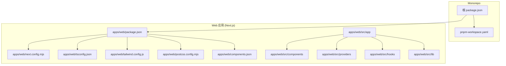
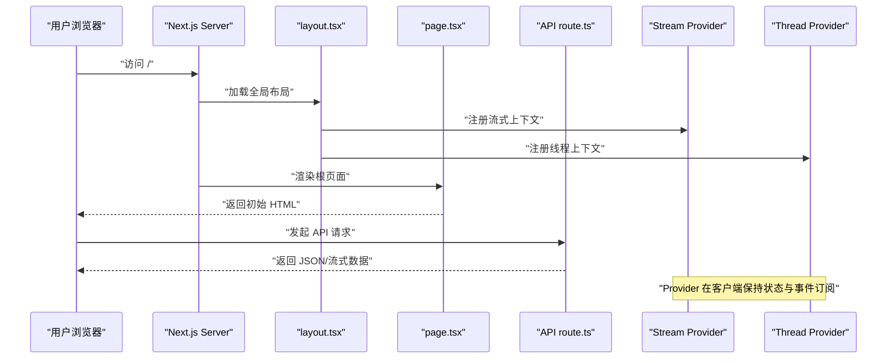
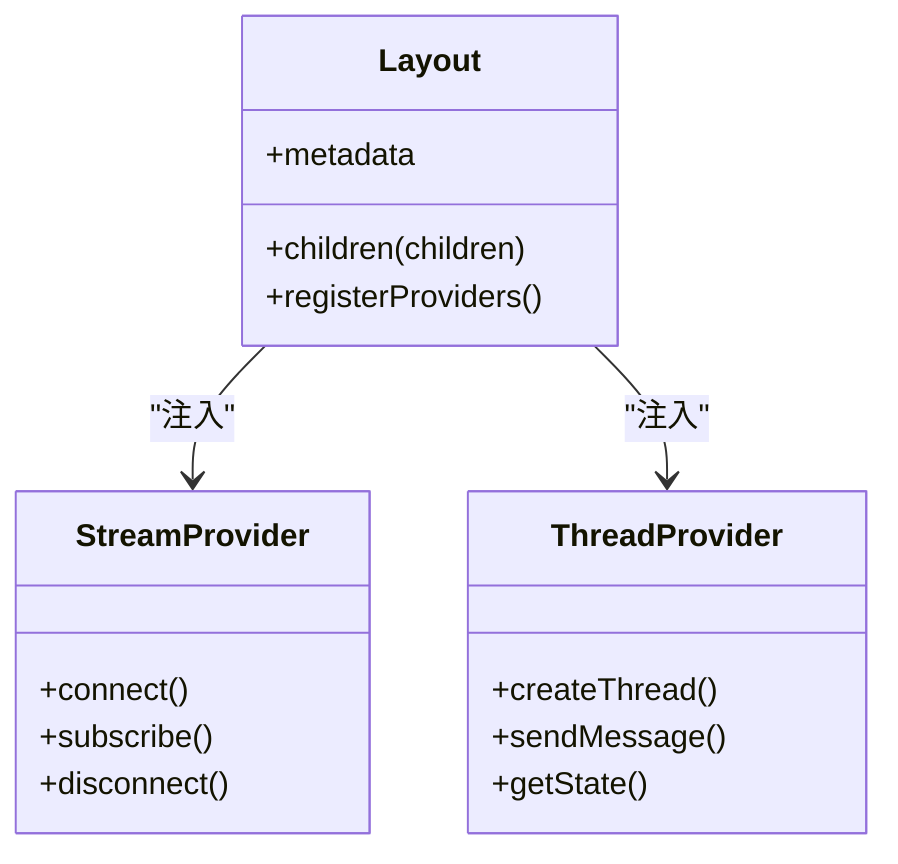
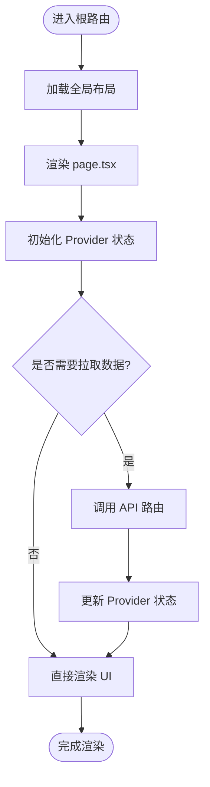
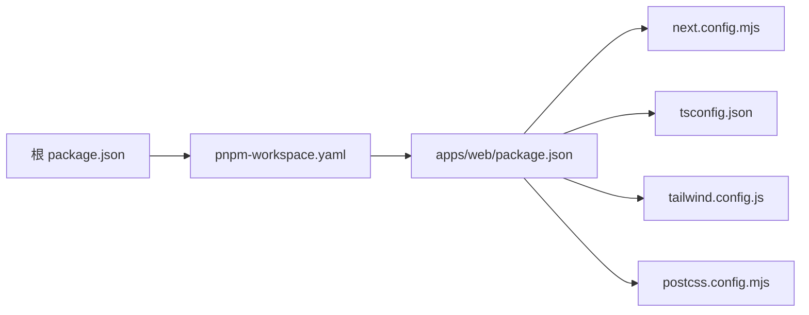

# 应用架构

<cite>
**本文引用的文件**   
- [apps/web/package.json](file://apps/web/package.json)
- [apps/web/next.config.mjs](file://apps/web/next.config.mjs)
- [apps/web/postcss.config.mjs](file://apps/web/postcss.config.mjs)
- [apps/web/tailwind.config.js](file://apps/web/tailwind.config.js)
- [apps/web/tsconfig.json](file://apps/web/tsconfig.json)
- [apps/web/src/app/layout.tsx](file://apps/web/src/app/layout.tsx)
- [apps/web/src/app/page.tsx](file://apps/web/src/app/page.tsx)
- [apps/web/src/app/error.tsx](file://apps/web/src/app/error.tsx)
- [apps/web/src/app/globals.css](file://apps/web/src/app/globals.css)
- [apps/web/src/app/api/[..._path]/route.ts](file://apps/web/src/app/api/[..._path]/route.ts)
- [apps/web/src/providers/Stream.tsx](file://apps/web/src/providers/Stream.tsx)
- [apps/web/src/providers/Thread.tsx](file://apps/web/src/providers/Thread.tsx)
- [apps/web/src/providers/client.ts](file://apps/web/src/providers/client.ts)
- [apps/web/components.json](file://apps/web/components.json)
- [pnpm-workspace.yaml](file://pnpm-workspace.yaml)
- [package.json](file://package.json)
</cite>

## 目录
1. [简介](#简介)
2. [项目结构](#项目结构)
3. [核心组件](#核心组件)
4. [架构总览](#架构总览)
5. [详细组件分析](#详细组件分析)
6. [依赖分析](#依赖分析)
7. [性能考虑](#性能考虑)
8. [故障排查指南](#故障排查指南)
9. [结论](#结论)
10. [附录](#附录)

## 简介
本文件面向基于 Next.js 的 Web 应用，系统化阐述 App Router 的设计与使用、页面布局组织、配置文件设置、目录结构与模块划分、依赖管理策略，以及开发环境与构建配置。重点解析 layout.tsx 的全局布局与 Providers 集成、page.tsx 的主页面实现与路由策略，并给出扩展应用架构与新增页面的实践步骤。

## 项目结构
本项目采用 monorepo 组织方式，Web 端位于 apps/web 目录，遵循 Next.js App Router 约定式路由与分层目录：
- src/app：应用根路由与全局资源（布局、错误页、样式等）
- src/components：可复用 UI 组件与业务组件（如 thread、agent-inbox、ui 基础组件）
- src/hooks：自定义 React Hooks
- src/lib：通用工具与库函数
- src/providers：React Context/Provider 封装（流式响应、线程状态等）
- scripts：脚本工具（浏览器校验、冒烟测试等）

图表来源
- [pnpm-workspace.yaml](file://pnpm-workspace.yaml)
- [package.json](file://package.json)
- [apps/web/package.json](file://apps/web/package.json)
- [apps/web/next.config.mjs](file://apps/web/next.config.mjs)
- [apps/web/tsconfig.json](file://apps/web/tsconfig.json)
- [apps/web/tailwind.config.js](file://apps/web/tailwind.config.js)
- [apps/web/postcss.config.mjs](file://apps/web/postcss.config.mjs)
- [apps/web/components.json](file://apps/web/components.json)

章节来源
- [pnpm-workspace.yaml](file://pnpm-workspace.yaml)
- [package.json](file://package.json)
- [apps/web/package.json](file://apps/web/package.json)

## 核心组件
- App Router 入口与布局
  - 全局布局：src/app/layout.tsx，定义文档骨架、主题、字体、Providers 注入与中间件上下文
  - 主页面：src/app/page.tsx，作为根路由展示入口
  - 错误处理：src/app/error.tsx，捕获渲染期错误并提供降级界面
  - 全局样式：src/app/globals.css，统一样式基线
- API 路由
  - 代理路由：src/app/api/[..._path]/route.ts，用于转发或聚合后端接口
- 数据与状态
  - Providers：src/providers/Stream.tsx、src/providers/Thread.tsx、src/providers/client.ts，封装流式通信与线程上下文
- 组件与工具
  - 组件：src/components 下按功能域划分（thread、agent-inbox、ui 等）
  - 工具：src/lib 提供通用能力（Composer、Multimodal 工具等）
  - Hooks：src/hooks 提供跨组件复用的交互逻辑

章节来源
- [apps/web/src/app/layout.tsx](file://apps/web/src/app/layout.tsx)
- [apps/web/src/app/page.tsx](file://apps/web/src/app/page.tsx)
- [apps/web/src/app/error.tsx](file://apps/web/src/app/error.tsx)
- [apps/web/src/app/globals.css](file://apps/web/src/app/globals.css)
- [apps/web/src/app/api/[..._path]/route.ts](file://apps/web/src/app/api/[..._path]/route.ts)
- [apps/web/src/providers/Stream.tsx](file://apps/web/src/providers/Stream.tsx)
- [apps/web/src/providers/Thread.tsx](file://apps/web/src/providers/Thread.tsx)
- [apps/web/src/providers/client.ts](file://apps/web/src/providers/client.ts)

## 架构总览
下图展示了 Next.js App Router 下的请求处理与渲染流程，包括布局层、页面层、API 层与 Provider 层的协作关系。

图表来源
- [apps/web/src/app/layout.tsx](file://apps/web/src/app/layout.tsx)
- [apps/web/src/app/page.tsx](file://apps/web/src/app/page.tsx)
- [apps/web/src/app/api/[..._path]/route.ts](file://apps/web/src/app/api/[..._path]/route.ts)
- [apps/web/src/providers/Stream.tsx](file://apps/web/src/providers/Stream.tsx)
- [apps/web/src/providers/Thread.tsx](file://apps/web/src/providers/Thread.tsx)

## 详细组件分析

### 全局布局与 Providers 集成（layout.tsx）
- 职责
  - 定义 HTML 文档结构（html/body）、全局元信息、字体与主题
  - 注入 React Context/Provider（如流式通信、线程状态），确保子树共享状态
  - 可选：挂载中间件上下文（如认证、国际化、日志）
- 设计要点
  - 将稳定且昂贵的 Provider 放在顶层，减少重复初始化
  - 通过 children 插槽组合页面与嵌套布局
  - 与 Tailwind/全局样式协同，保证样式一致性

图表来源
- [apps/web/src/app/layout.tsx](file://apps/web/src/app/layout.tsx)
- [apps/web/src/providers/Stream.tsx](file://apps/web/src/providers/Stream.tsx)
- [apps/web/src/providers/Thread.tsx](file://apps/web/src/providers/Thread.tsx)

章节来源
- [apps/web/src/app/layout.tsx](file://apps/web/src/app/layout.tsx)
- [apps/web/src/providers/Stream.tsx](file://apps/web/src/providers/Stream.tsx)
- [apps/web/src/providers/Thread.tsx](file://apps/web/src/providers/Thread.tsx)

### 主页面与路由策略（page.tsx）
- 职责
  - 作为根路由的页面组件，承载首屏内容与导航入口
  - 与 Provider 协作获取/更新状态（如线程列表、消息流）
- 路由策略
  - 使用 App Router 约定式路由，根目录对应 /
  - 可通过动态段与并行路由扩展更多页面
  - 与 API 路由解耦，页面仅负责 UI 与状态管理

图表来源
- [apps/web/src/app/page.tsx](file://apps/web/src/app/page.tsx)
- [apps/web/src/app/api/[..._path]/route.ts](file://apps/web/src/app/api/[..._path]/route.ts)

章节来源
- [apps/web/src/app/page.tsx](file://apps/web/src/app/page.tsx)
- [apps/web/src/app/api/[..._path]/route.ts](file://apps/web/src/app/api/[..._path]/route.ts)

### API 代理路由（api/[..._path]/route.ts）
- 职责
  - 统一转发外部服务请求，集中处理鉴权、限流、日志与错误转换
  - 支持路径参数透传，便于多后端聚合
- 设计要点
  - 明确输入输出契约，对异常进行标准化包装
  - 结合环境变量管理后端地址与密钥

章节来源
- [apps/web/src/app/api/[..._path]/route.ts](file://apps/web/src/app/api/[..._path]/route.ts)

### 错误处理（error.tsx）
- 职责
  - 捕获渲染期错误，提供友好降级界面与重试入口
- 设计要点
  - 区分服务端与客户端错误场景
  - 记录错误上下文以便定位问题

章节来源
- [apps/web/src/app/error.tsx](file://apps/web/src/app/error.tsx)

### 样式与主题（globals.css、tailwind.config.js、postcss.config.mjs）
- globals.css：定义 CSS 变量、基础重置与全局样式
- tailwind.config.js：配置主题色、插件与断点
- postcss.config.mjs：PostCSS 管线（如 autoprefixer、Tailwind 插件）

章节来源
- [apps/web/src/app/globals.css](file://apps/web/src/app/globals.css)
- [apps/web/tailwind.config.js](file://apps/web/tailwind.config.js)
- [apps/web/postcss.config.mjs](file://apps/web/postcss.config.mjs)

### 组件系统与 UI 库（components.json、components/ui/*）
- components.json：shadcn/ui 或类似组件库的配置（组件来源、别名、导出等）
- components/ui/*：原子化 UI 组件（Button、Input、Card 等）
- 建议
  - 以“功能域”组织业务组件（如 thread、agent-inbox）
  - 原子组件与业务组件分离，提升复用性

章节来源
- [apps/web/components.json](file://apps/web/components.json)

## 依赖分析
- Monorepo 管理
  - pnpm-workspace.yaml：声明工作区与包间依赖关系
  - 根 package.json：统一脚本与版本约束
- Web 应用依赖
  - apps/web/package.json：Next.js、React、Tailwind、TypeScript、测试与代码质量工具
  - next.config.mjs：Next.js 构建与运行时配置（如路径别名、中间件、安全头）
  - tsconfig.json：TypeScript 编译选项与路径映射

图表来源
- [package.json](file://package.json)
- [pnpm-workspace.yaml](file://pnpm-workspace.yaml)
- [apps/web/package.json](file://apps/web/package.json)
- [apps/web/next.config.mjs](file://apps/web/next.config.mjs)
- [apps/web/tsconfig.json](file://apps/web/tsconfig.json)
- [apps/web/tailwind.config.js](file://apps/web/tailwind.config.js)
- [apps/web/postcss.config.mjs](file://apps/web/postcss.config.mjs)

章节来源
- [package.json](file://package.json)
- [pnpm-workspace.yaml](file://pnpm-workspace.yaml)
- [apps/web/package.json](file://apps/web/package.json)
- [apps/web/next.config.mjs](file://apps/web/next.config.mjs)
- [apps/web/tsconfig.json](file://apps/web/tsconfig.json)

## 性能考虑
- 渲染优化
  - 使用 App Router 的服务端渲染与流式传输，减少首屏时间
  - 合理拆分 Provider，避免不必要的重渲染
- 网络优化
  - API 路由集中处理缓存、压缩与错误重试
  - 静态资源按需加载与 CDN 加速
- 构建优化
  - 启用 Tree Shaking 与 Code Splitting
  - 控制第三方库体积，按需引入
- 监控与诊断
  - 接入错误上报与性能埋点，持续优化关键指标

[本节为通用指导，不直接分析具体文件]

## 故障排查指南
- 常见问题
  - 环境变量未生效：检查 .env 文件命名与作用域，确认构建时注入
  - 路由 404：确认文件命名与目录结构符合 App Router 约定
  - Provider 状态丢失：检查 Provider 层级与生命周期
  - API 转发失败：核对后端地址、鉴权头与跨域配置
- 定位方法
  - 查看浏览器控制台与 Network 面板
  - 检查服务端日志与错误页堆栈
  - 使用调试器断点验证数据流

章节来源
- [apps/web/src/app/error.tsx](file://apps/web/src/app/error.tsx)
- [apps/web/src/app/api/[..._path]/route.ts](file://apps/web/src/app/api/[..._path]/route.ts)

## 结论
本架构以 Next.js App Router 为核心，通过清晰的目录分层与 Provider 抽象，实现了可扩展的前端工程体系。配合 Tailwind 与组件系统，能够快速迭代业务功能；通过统一的 API 路由与环境配置，保障前后端协作与部署稳定性。建议在后续演进中持续完善监控、测试与性能优化，以提升用户体验与可维护性。

[本节为总结性内容，不直接分析具体文件]

## 附录

### 项目初始化与开发环境设置
- 安装依赖
  - 在工作区根目录执行包管理器安装命令，确保 workspace 内所有包正确链接
- 启动开发服务器
  - 切换到 apps/web 目录，运行 Next.js 开发模式
- 环境变量
  - 在 apps/web 目录下创建 .env.local，定义本地所需变量
- 构建与预览
  - 执行生产构建命令，生成静态产物并通过本地预览

章节来源
- [pnpm-workspace.yaml](file://pnpm-workspace.yaml)
- [package.json](file://package.json)
- [apps/web/package.json](file://apps/web/package.json)

### 构建配置与环境变量管理
- next.config.mjs
  - 配置路径别名、中间件、安全头、图片与静态资源策略
- TypeScript
  - tsconfig.json 定义编译目标、路径映射与严格模式
- 样式管线
  - tailwind.config.js 与 postcss.config.mjs 协同工作，确保样式一致性与兼容性

章节来源
- [apps/web/next.config.mjs](file://apps/web/next.config.mjs)
- [apps/web/tsconfig.json](file://apps/web/tsconfig.json)
- [apps/web/tailwind.config.js](file://apps/web/tailwind.config.js)
- [apps/web/postcss.config.mjs](file://apps/web/postcss.config.mjs)

### 扩展应用架构与新增页面示例
- 新增页面
  - 在 src/app 下新建目录与 page.tsx，遵循 App Router 约定
  - 如需布局，可在同目录放置 layout.tsx 覆盖默认布局
- 新增 API
  - 在 src/app/api 下新增路由文件或 [...path] 代理规则
- 新增 Provider
  - 在 src/providers 下封装新上下文，并在 layout.tsx 中注入
- 新增组件
  - 在 src/components 下按功能域组织，必要时在 components.json 中登记

章节来源
- [apps/web/src/app/layout.tsx](file://apps/web/src/app/layout.tsx)
- [apps/web/src/app/page.tsx](file://apps/web/src/app/page.tsx)
- [apps/web/src/app/api/[..._path]/route.ts](file://apps/web/src/app/api/[..._path]/route.ts)
- [apps/web/components.json](file://apps/web/components.json)