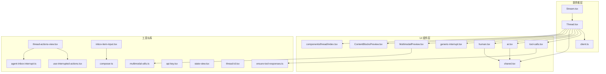
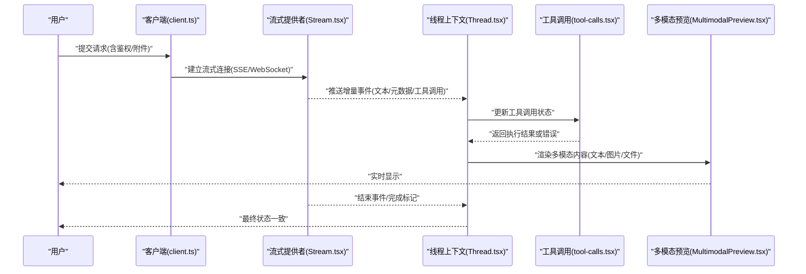
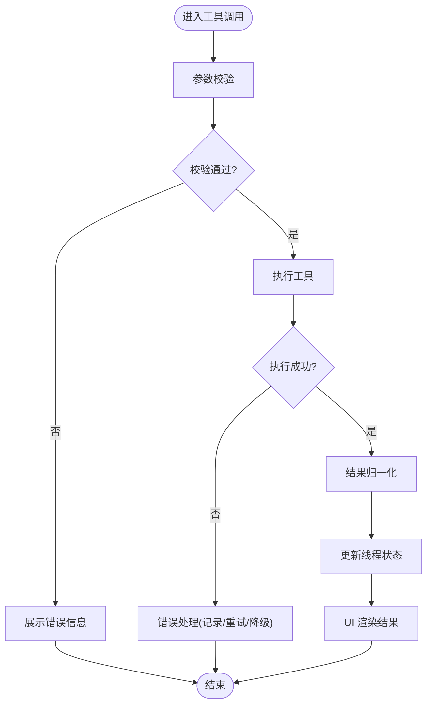
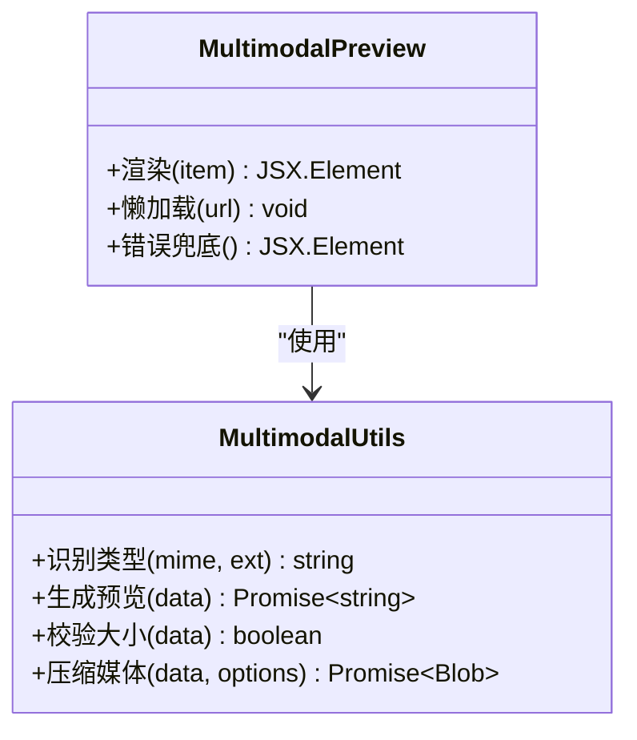
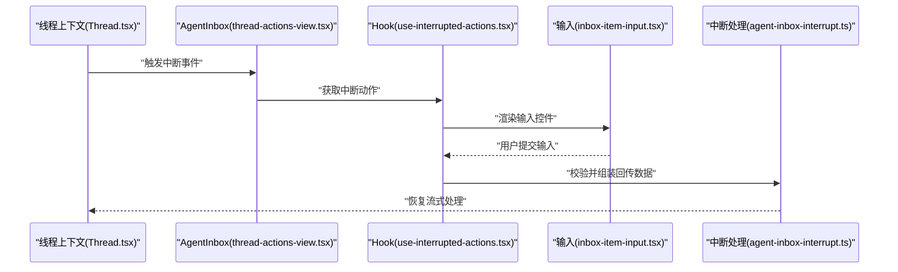
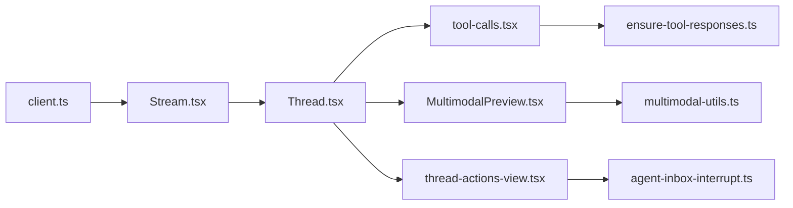

# 流式处理

<cite>
**本文引用的文件**   
- [Stream.tsx](file://apps/web/src/providers/Stream.tsx)
- [Thread.tsx](file://apps/web/src/providers/Thread.tsx)
- [client.ts](file://apps/web/src/providers/client.ts)
- [tool-calls.tsx](file://apps/web/src/components/thread/messages/tool-calls.tsx)
- [multimodal-utils.ts](file://apps/web/src/lib/multimodal-utils.ts)
- [ensure-tool-responses.ts](file://apps/web/src/lib/ensure-tool-responses.ts)
- [thread-actions-view.tsx](file://apps/web/src/components/thread/agent-inbox/components/thread-actions-view.tsx)
- [state-view.tsx](file://apps/web/src/components/thread/agent-inbox/components/state-view.tsx)
- [thread-id.tsx](file://apps/web/src/components/thread/agent-inbox/components/thread-id.tsx)
- [inbox-item-input.tsx](file://apps/web/src/components/thread/agent-inbox/components/inbox-item-input.tsx)
- [use-interrupted-actions.tsx](file://apps/web/src/components/thread/agent-inbox/hooks/use-interrupted-actions.tsx)
- [index.tsx](file://apps/web/src/components/thread/index.tsx)
- [MultimodalPreview.tsx](file://apps/web/src/components/thread/MultimodalPreview.tsx)
- [ContentBlocksPreview.tsx](file://apps/web/src/components/thread/ContentBlocksPreview.tsx)
- [ai.tsx](file://apps/web/src/components/thread/messages/ai.tsx)
- [human.tsx](file://apps/web/src/components/thread/messages/human.tsx)
- [generic-interrupt.tsx](file://apps/web/src/components/thread/messages/generic-interrupt.tsx)
- [shared.tsx](file://apps/web/src/components/thread/messages/shared.tsx)
- [composer.ts](file://apps/web/src/lib/composer.ts)
- [api-key.tsx](file://apps/web/src/lib/api-key.tsx)
- [agent-inbox-interrupt.ts](file:///apps/web/src/lib/agent-inbox-interrupt.ts)
</cite>

## 目录
1. [简介](#简介)
2. [项目结构](#项目结构)
3. [核心组件](#核心组件)
4. [架构总览](#架构总览)
5. [详细组件分析](#详细组件分析)
6. [依赖关系分析](#依赖关系分析)
7. [性能考虑](#性能考虑)
8. [故障排查指南](#故障排查指南)
9. [结论](#结论)
10. [附录](#附录)

## 简介
本文件面向“流式处理系统”的文档，聚焦于前端如何与后端进行实时通信、多模态数据的流式传输、工具调用的参数校验与结果返回、以及连接管理与错误恢复。内容覆盖 WebSocket/Server-Sent Events（SSE）等流式协议的使用方式、消息解析与状态同步、缓冲策略与内存管理、重连机制与数据完整性保证，并提供自定义流处理器的扩展指南与调试技巧。

## 项目结构
本项目采用前后端分离的 Next.js 应用组织方式。与流式处理相关的关键代码集中在以下位置：
- providers：封装了流式客户端、线程上下文与状态管理
- components/thread：消息渲染、工具调用展示、多模态预览与交互
- lib：通用工具函数、多模态处理、工具响应保障、中断处理等
- agent-inbox：用于交互式中断与用户输入的流程

图表来源 
- [Stream.tsx](file://apps/web/src/providers/Stream.tsx)
- [Thread.tsx](file://apps/web/src/providers/Thread.tsx)
- [client.ts](file://apps/web/src/providers/client.ts)
- [tool-calls.tsx](file://apps/web/src/components/thread/messages/tool-calls.tsx)
- [multimodal-utils.ts](file://apps/web/src/lib/multimodal-utils.ts)
- [ensure-tool-responses.ts](file://apps/web/src/lib/ensure-tool-responses.ts)
- [thread-actions-view.tsx](file://apps/web/src/components/thread/agent-inbox/components/thread-actions-view.tsx)
- [state-view.tsx](file://apps/web/src/components/thread/agent-inbox/components/state-view.tsx)
- [thread-id.tsx](file://apps/web/src/components/thread/agent-inbox/components/thread-id.tsx)
- [inbox-item-input.tsx](file://apps/web/src/components/thread/agent-inbox/components/inbox-item-input.tsx)
- [use-interrupted-actions.tsx](file://apps/web/src/components/thread/agent-inbox/hooks/use-interrupted-actions.tsx)
- [index.tsx](file://apps/web/src/components/thread/index.tsx)
- [MultimodalPreview.tsx](file://apps/web/src/components/thread/MultimodalPreview.tsx)
- [ContentBlocksPreview.tsx](file://apps/web/src/components/thread/ContentBlocksPreview.tsx)
- [ai.tsx](file://apps/web/src/components/thread/messages/ai.tsx)
- [human.tsx](file://apps/web/src/components/thread/messages/human.tsx)
- [generic-interrupt.tsx](file://apps/web/src/components/thread/messages/generic-interrupt.tsx)
- [shared.tsx](file://apps/web/src/components/thread/messages/shared.tsx)
- [composer.ts](file://apps/web/src/lib/composer.ts)
- [api-key.tsx](file://apps/web/src/lib/api-key.tsx)
- [agent-inbox-interrupt.ts](file://apps/web/src/lib/agent-inbox-interrupt.ts)

章节来源
- [Stream.tsx](file://apps/web/src/providers/Stream.tsx)
- [Thread.tsx](file://apps/web/src/providers/Thread.tsx)
- [client.ts](file://apps/web/src/providers/client.ts)
- [index.tsx](file://apps/web/src/components/thread/index.tsx)

## 核心组件
- 流式提供者（Stream.tsx）：负责建立并维护与后端的流式连接（WebSocket/SSE），订阅事件、解析增量消息、触发状态更新。
- 线程上下文（Thread.tsx）：维护会话级状态（消息列表、工具调用状态、中断点）、协调 UI 渲染与业务逻辑。
- 客户端（client.ts）：封装网络请求、鉴权头、重试与超时控制，为流式连接提供基础能力。
- 工具调用（tool-calls.tsx）：渲染工具调用过程、参数校验、执行结果展示与错误提示。
- 多模态预览（MultimodalPreview.tsx / ContentBlocksPreview.tsx）：对文本、图片、文件等类型进行统一预览与渲染。
- 中断与交互（agent-inbox-interrupt.ts / use-interrupted-actions.tsx / thread-actions-view.tsx）：处理需要用户介入的中断流程，收集输入并回传。

章节来源
- [Stream.tsx](file://apps/web/src/providers/Stream.tsx)
- [Thread.tsx](file://apps/web/src/providers/Thread.tsx)
- [client.ts](file://apps/web/src/providers/client.ts)
- [tool-calls.tsx](file://apps/web/src/components/thread/messages/tool-calls.tsx)
- [MultimodalPreview.tsx](file://apps/web/src/components/thread/MultimodalPreview.tsx)
- [ContentBlocksPreview.tsx](file://apps/web/src/components/thread/ContentBlocksPreview.tsx)
- [agent-inbox-interrupt.ts](file://apps/web/src/lib/agent-inbox-interrupt.ts)
- [use-interrupted-actions.tsx](file://apps/web/src/components/thread/agent-inbox/hooks/use-interrupted-actions.tsx)
- [thread-actions-view.tsx](file://apps/web/src/components/thread/agent-inbox/components/thread-actions-view.tsx)

## 架构总览
下图展示了从用户输入到流式响应渲染的整体流程，包括连接建立、消息解析、状态同步与工具调用闭环。

图表来源 
- [client.ts](file://apps/web/src/providers/client.ts)
- [Stream.tsx](file://apps/web/src/providers/Stream.tsx)
- [Thread.tsx](file://apps/web/src/providers/Thread.tsx)
- [tool-calls.tsx](file://apps/web/src/components/thread/messages/tool-calls.tsx)
- [MultimodalPreview.tsx](file://apps/web/src/components/thread/MultimodalPreview.tsx)

## 详细组件分析

### 流式提供者（Stream.tsx）
- 职责
  - 建立并维护流式连接（支持 SSE/WebSocket），处理心跳与保活
  - 解析增量事件（文本片段、工具调用事件、状态变更、完成信号）
  - 将事件分发至线程上下文，驱动 UI 增量更新
- 关键实现要点
  - 连接生命周期：创建、监听、错误回调、重连策略（指数退避、最大重试次数）
  - 事件解析：按协议分帧、去重、合并增量文本
  - 状态同步：将工具调用、中断、完成等事件映射到线程状态
- 性能与内存
  - 使用增量拼接避免全量重建
  - 限制缓冲区大小，及时释放已渲染片段
  - 防抖高频事件，减少重渲染

章节来源
- [Stream.tsx](file://apps/web/src/providers/Stream.tsx)
- [Thread.tsx](file://apps/web/src/providers/Thread.tsx)

### 线程上下文（Thread.tsx）
- 职责
  - 维护会话级状态：消息列表、工具调用状态、中断点、完成标志
  - 协调流式事件到状态转换，确保一致性
  - 暴露操作接口供 UI 组件调用（发送消息、确认工具调用、取消中断）
- 关键实现要点
  - 不可变更新模式，便于 React 高效比较
  - 事件幂等性：相同事件多次推送不导致重复
  - 错误边界：捕获异常并降级为友好提示

章节来源
- [Thread.tsx](file://apps/web/src/providers/Thread.tsx)

### 客户端（client.ts）
- 职责
  - 封装 HTTP/SSE/WebSocket 请求，统一鉴权与错误处理
  - 提供重试、超时、取消请求等能力
- 关键实现要点
  - 鉴权：自动注入 API Key/Token
  - 错误分类：网络错误、服务端错误、超时、认证失败
  - 可插拔适配器：便于切换不同传输协议

章节来源
- [client.ts](file://apps/web/src/providers/client.ts)
- [api-key.tsx](file://apps/web/src/lib/api-key.tsx)

### 工具调用（tool-calls.tsx）
- 职责
  - 渲染工具调用过程（开始、进行中、成功、失败）
  - 参数校验：在调用前对入参进行格式与约束检查
  - 执行结果返回：将执行结果写回线程状态，驱动 UI 更新
  - 错误处理：捕获异常并展示错误信息，支持重试
- 关键实现要点
  - 参数验证：类型检查、必填字段、范围限制
  - 执行隔离：异步执行，避免阻塞主线程
  - 结果归一化：统一输出结构，便于下游消费

图表来源 
- [tool-calls.tsx](file://apps/web/src/components/thread/messages/tool-calls.tsx)
- [ensure-tool-responses.ts](file://apps/web/src/lib/ensure-tool-responses.ts)

章节来源
- [tool-calls.tsx](file://apps/web/src/components/thread/messages/tool-calls.tsx)
- [ensure-tool-responses.ts](file://apps/web/src/lib/ensure-tool-responses.ts)

### 多模态数据处理（文本、图片、文件）
- 职责
  - 统一解析与渲染文本、图片、文件等多模态内容
  - 提供预览、下载、压缩、懒加载等能力
- 关键实现要点
  - 类型识别：根据 MIME/扩展名区分类型
  - 安全过滤：XSS、恶意脚本、超大文件拦截
  - 缓存策略：本地缓存缩略图与预览资源

图表来源 
- [multimodal-utils.ts](file://apps/web/src/lib/multimodal-utils.ts)
- [MultimodalPreview.tsx](file://apps/web/src/components/thread/MultimodalPreview.tsx)
- [ContentBlocksPreview.tsx](file://apps/web/src/components/thread/ContentBlocksPreview.tsx)

章节来源
- [multimodal-utils.ts](file://apps/web/src/lib/multimodal-utils.ts)
- [MultimodalPreview.tsx](file://apps/web/src/components/thread/MultimodalPreview.tsx)
- [ContentBlocksPreview.tsx](file://apps/web/src/components/thread/ContentBlocksPreview.tsx)

### 中断与交互（Agent Inbox）
- 职责
  - 处理需要用户介入的中断流程（如确认、选择、补充输入）
  - 收集用户输入并回传给后端，继续流式处理
- 关键实现要点
  - 中断状态管理：暂停、等待、恢复
  - 输入校验：必填、格式、长度限制
  - 回传策略：批量或逐条，避免频繁往返

图表来源 
- [thread-actions-view.tsx](file://apps/web/src/components/thread/agent-inbox/components/thread-actions-view.tsx)
- [use-interrupted-actions.tsx](file://apps/web/src/components/thread/agent-inbox/hooks/use-interrupted-actions.tsx)
- [inbox-item-input.tsx](file://apps/web/src/components/thread/agent-inbox/components/inbox-item-input.tsx)
- [agent-inbox-interrupt.ts](file://apps/web/src/lib/agent-inbox-interrupt.ts)
- [Thread.tsx](file://apps/web/src/providers/Thread.tsx)

章节来源
- [thread-actions-view.tsx](file://apps/web/src/components/thread/agent-inbox/components/thread-actions-view.tsx)
- [use-interrupted-actions.tsx](file://apps/web/src/components/thread/agent-inbox/hooks/use-interrupted-actions.tsx)
- [inbox-item-input.tsx](file://apps/web/src/components/thread/agent-inbox/components/inbox-item-input.tsx)
- [agent-inbox-interrupt.ts](file://apps/web/src/lib/agent-inbox-interrupt.ts)
- [Thread.tsx](file://apps/web/src/providers/Thread.tsx)

### 消息渲染（AI/Human/Shared）
- 职责
  - 渲染 AI 回复、用户消息、通用中断提示
  - 复用共享样式与行为
- 关键实现要点
  - 增量渲染：配合流式事件逐步更新
  - 错误降级：网络异常或服务端错误时展示占位

章节来源
- [ai.tsx](file://apps/web/src/components/thread/messages/ai.tsx)
- [human.tsx](file://apps/web/src/components/thread/messages/human.tsx)
- [generic-interrupt.tsx](file://apps/web/src/components/thread/messages/generic-interrupt.tsx)
- [shared.tsx](file://apps/web/src/components/thread/messages/shared.tsx)

### 组合器与输入（composer.ts）
- 职责
  - 构建用户输入（文本、附件、工具参数）
  - 格式化与校验，准备发送给后端
- 关键实现要点
  - 输入聚合：合并多源输入
  - 序列化：JSON/表单/二进制混合编码
  - 校验：必填、类型、大小限制

章节来源
- [composer.ts](file://apps/web/src/lib/composer.ts)

## 依赖关系分析
- 低耦合高内聚：providers 层专注连接与状态，UI 层专注渲染，lib 层提供通用能力
- 明确的数据流向：客户端 → 流式提供者 → 线程上下文 → UI 组件
- 可扩展点：
  - 自定义流处理器：实现事件解析与分发接口
  - 自定义工具：注册工具名称、参数 Schema、执行函数
  - 自定义多模态渲染：扩展类型识别与预览逻辑

图表来源 
- [client.ts](file://apps/web/src/providers/client.ts)
- [Stream.tsx](file://apps/web/src/providers/Stream.tsx)
- [Thread.tsx](file://apps/web/src/providers/Thread.tsx)
- [tool-calls.tsx](file://apps/web/src/components/thread/messages/tool-calls.tsx)
- [ensure-tool-responses.ts](file://apps/web/src/lib/ensure-tool-responses.ts)
- [multimodal-utils.ts](file://apps/web/src/lib/multimodal-utils.ts)
- [MultimodalPreview.tsx](file://apps/web/src/components/thread/MultimodalPreview.tsx)
- [thread-actions-view.tsx](file://apps/web/src/components/thread/agent-inbox/components/thread-actions-view.tsx)
- [agent-inbox-interrupt.ts](file://apps/web/src/lib/agent-inbox-interrupt.ts)

章节来源
- [client.ts](file://apps/web/src/providers/client.ts)
- [Stream.tsx](file://apps/web/src/providers/Stream.tsx)
- [Thread.tsx](file://apps/web/src/providers/Thread.tsx)
- [tool-calls.tsx](file://apps/web/src/components/thread/messages/tool-calls.tsx)
- [ensure-tool-responses.ts](file://apps/web/src/lib/ensure-tool-responses.ts)
- [multimodal-utils.ts](file://apps/web/src/lib/multimodal-utils.ts)
- [MultimodalPreview.tsx](file://apps/web/src/components/thread/MultimodalPreview.tsx)
- [thread-actions-view.tsx](file://apps/web/src/components/thread/agent-inbox/components/thread-actions-view.tsx)
- [agent-inbox-interrupt.ts](file://apps/web/src/lib/agent-inbox-interrupt.ts)

## 性能考虑
- 流式缓冲策略
  - 增量拼接：仅追加新片段，避免全量重建
  - 批处理：合并高频事件，降低渲染压力
  - 背压控制：当 UI 渲染慢时，暂缓接收新事件
- 内存管理
  - 及时释放已渲染片段与临时对象
  - 限制历史消息数量，滚动清理旧数据
  - 大文件分块加载与懒加载
- 优化建议
  - 使用虚拟列表渲染长消息
  - 图片与媒体资源启用缓存与压缩
  - 工具调用并行执行，限制并发度

[本节为通用指导，不直接分析具体文件]

## 故障排查指南
- 常见问题
  - 连接断开：检查网络、鉴权、跨域配置；查看重连日志
  - 消息丢失：核对事件序列号与幂等键；检查缓冲上限
  - 工具调用失败：查看参数校验日志与服务端错误码
  - 多模态渲染异常：检查 MIME 类型与文件大小限制
- 定位方法
  - 打开浏览器开发者工具，观察 Network 与 Console 日志
  - 在流式提供者中增加事件追踪与耗时统计
  - 使用线程状态快照对比差异，定位状态不一致点

章节来源
- [client.ts](file://apps/web/src/providers/client.ts)
- [Stream.tsx](file://apps/web/src/providers/Stream.tsx)
- [tool-calls.tsx](file://apps/web/src/components/thread/messages/tool-calls.tsx)
- [multimodal-utils.ts](file://apps/web/src/lib/multimodal-utils.ts)

## 结论
本系统通过清晰的层次划分与明确的职责边界，实现了高效的流式处理与多模态渲染。借助可插拔的客户端与流式提供者，结合健壮的工具调用与中断处理机制，能够在复杂交互场景下保持稳定的用户体验。通过合理的缓冲策略、内存管理与错误恢复机制，系统在性能与可靠性方面具备良好表现。

[本节为总结性内容，不直接分析具体文件]

## 附录
- 自定义流处理器扩展指南
  - 定义事件解析器：按协议分帧、类型识别、增量合并
  - 实现事件分发：将事件映射到线程状态更新
  - 接入重连与保活：心跳检测、指数退避、最大重试
- 调试技巧
  - 启用详细日志：记录事件序列、耗时、错误堆栈
  - 模拟断网与延迟：验证重连与降级逻辑
  - 使用状态快照：对比前后状态差异，定位问题

[本节为扩展与调试指导，不直接分析具体文件]